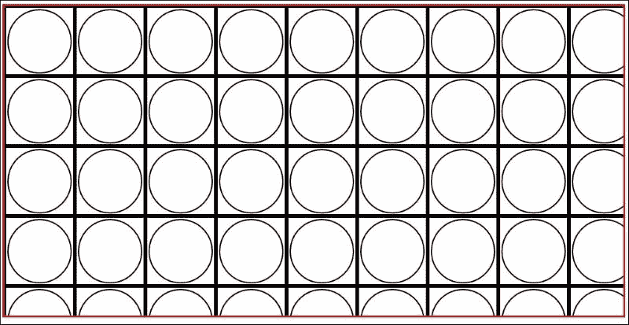
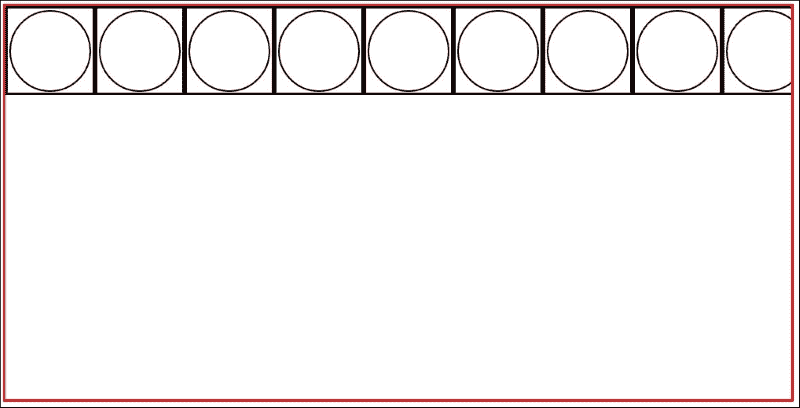
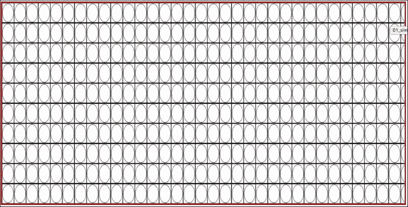
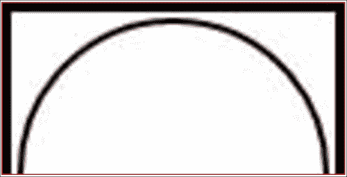
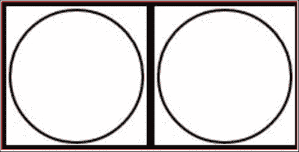
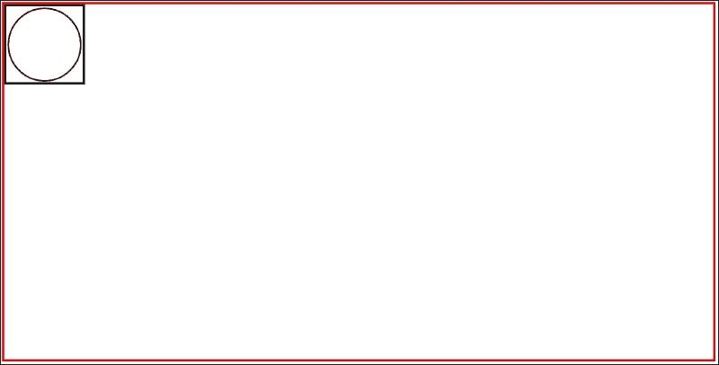
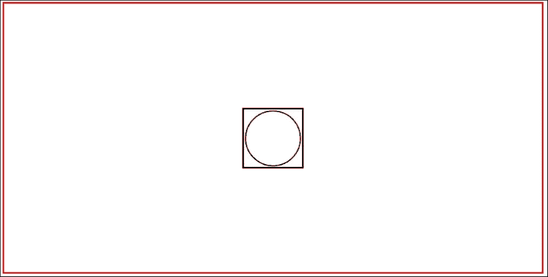
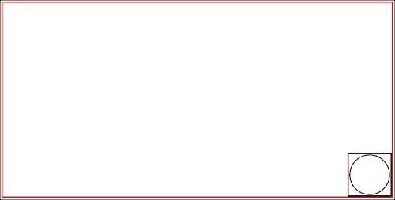
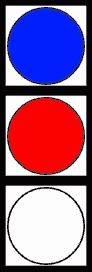
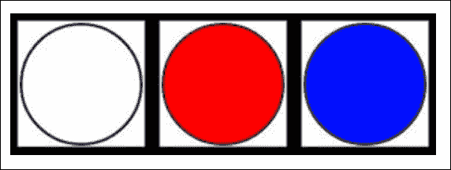

# 第五章：在 CSS 中使用背景图像

几乎所有页面上都有背景图像。本章将描述如何在现代设备的广泛范围上正确显示图像，包括手机和平板电脑。

在本章中，我们将涵盖以下主题：

+   使用背景图像

+   如何为背景图像设置正确的位置

+   如何设置背景位置的大小

+   视网膜和移动设备上的图像

# CSS 背景

CSS 背景在现代 Web 浏览器中非常有用。何时应该使用背景，何时应该使用`img`标签？这是一个简单的问题 - 每个作为内容元素的图像都应插入到`img`标签中，每个作为布局元素的图像都应移动到 CSS 背景中。

在本章中，我们将尝试始终使用相同的图像来说明每个属性和值的工作原理。这个图像将是一个有边框的圆，肯定会显示正确的纵横比（如果它不好，它看起来更像省略号），并且有了边框，您可以检查图像的重复工作。图像的宽度和高度都等于 90 像素。


## 背景重复

在处理背景时有许多可用选项。第一个是图像重复。默认值是在*x*和*y*轴上重复图像。因此，当您设置，例如：

```css
Background-image: url(/* here url to your img*/)
```

我们的 SASS 示例：

```css
.container
  width: 1000px
  height: 500px
  border: 3px solid red
  background-image: url(image.jpg)
```

编译的 CSS：

```css
.container {
    width: 1000px;
    height: 500px;
    border: 3px solid red;
    background-image: url(image.jpg);
}
```

对于所有容器，边框都是红色的，以便更好地查看容器的范围。

HTML：

```css
<body>
<div class="container">

</div>
</body>
```

此代码将给我们带来以下视图：



对于所有容器，边框都是红色的，以便更好地查看容器的范围。这意味着图像在背景中在*x*和*y*轴上重复。让我们添加以下代码并检查它将如何编译以及对我们的视图会产生什么影响：

```css
.container
  width: 1000px
  height: 500px
  border: 3px solid red
  background:
    image: url(image.jpg)
    repeat: repeat
```

编译的 CSS：

```css
.container {
    width: 1000px;
    height: 500px;
    border: 3px solid red;
    background-image: url(image.jpg);
    background-repeat: repeat;
}
```

我们可以使用`background-repeat`的另一个选项和行为：

+   `- repeat-x`：这将重复背景*x*轴

+   - repeat-y：这将重复背景*y*轴

+   `- no-repeat`：这将不会重复背景

## 背景大小

使用新的 CSS 功能，可以设置背景大小。大小可以设置如下：

```css
background-size: 30px 50px
```

让我们获取先前的 HTML 代码并附加新的 SASS 代码：

```css
.container
  width: 1000px
  height: 500px
  border: 3px solid red
  background:
    image: url(image.jpg)
    repeat: repeat
    size: 30px 50px
```

编译的 CSS：

```css
.container {
    width: 1000px;
    height: 500px;
    border: 3px solid red;
    background-image: url(image.jpg);
    background-repeat: repeat;
    background-size: 30px 50px;
}
```

此代码的输出将如下所示：



如果我们想要为图像设置容器的完整宽度，并自动计算其高度以保持图像的纵横比，执行以下操作：

```css
background-size: 100% auto
```



当然，我们可以将`fill`选项从*x*轴更改为*y*轴。让我们将`100%`的值更改为`height`，将`width`更改为`auto`：

```css
.container
  width: 1000px
  height: 500px
  border: 3px solid red
  background:
    image: url(image.jpg)
    repeat: repeat
    size: 100% auto
```

编译为：

```css
.container {
    width: 1000px;
    height: 500px;
    border: 3px solid red;
    background-image: url(image.jpg);
    background-repeat: repeat;
    background-size: 100% auto;
}
```

输出将如下所示：



`contain`值将更改其宽度和高度以包含容器。使用此选项，纵横比将得到保持：

```css
background-size: contain
```

`cover`值将更改其宽度和高度以覆盖容器。使用此选项，纵横比将得到保持：

```css
background-size: cover
```

## 背景位置

在大多数设计中，您将需要设置背景在框中的位置。可以使用 CSS 设置背景位置如下：

```css
background-position: top left
```



```css
background-position: right
```


如果要使背景在两个轴上居中，执行以下操作：

```css
background-position: center center
```



如果要将背景对齐到右下角，请执行以下操作：

```css
background-position: bottom right
```



要设置背景偏移量（以像素为单位），请执行以下操作：

```css
background-position: 600px 200px
```


## 多重背景

在过去，使用多个背景与添加具有单独背景的新 DOM 元素相关联。所有这些元素将绝对定位在相对容器中。如今，我们可以在一个容器中使用 CSS 使用多个背景，而无需任何额外的 HTML 代码。

让我们使用相同的 HTML 代码和相同的图像，然后将这个图像定位在容器中的以下位置：

+   顶部左侧

+   顶部中心

+   顶部右侧

+   左侧中心

+   中心中心

+   右侧中心

+   底部左侧

+   底部中心

+   底部右侧

CSS 代码：

```css
    .container {
    width: 1000px;
    height: 500px;
    border: 3px solid red;
    background-image:
            url(image.jpg), /* URL of image #1 */
            url(image.jpg), /* URL of image #2 */
            url(image.jpg), /* URL of image #3 */
            url(image.jpg), /* URL of image #4 */
            url(image.jpg), /* URL of image #5 */
            url(image.jpg), /* URL of image #6 */
            url(image.jpg), /* URL of image #7 */
            url(image.jpg), /* URL of image #8 */
            url(image.jpg); /* URL of image #9 */
    background-repeat: no-repeat;
    background-position:
            left top, /* position of image #1 */
            center top, /* position of image #2 */
            right top, /* position of image # 3*/
            left center, /* position of image #4 */
            center center, /* position of image #5 */
            right center, /* position of image #6 */
            bottom left, /* position of image #7 */
            bottom center, /* position of image #8 */
            bottom right; /* position of image #1 */
    background-size:
            50px auto, /* size of image #1 */
            auto auto, /* size of image #2 */
            auto auto, /* size of image #3 */
            auto auto, /* size of image #4 */
            200px auto, /* size of image #5 */
            auto auto, /* size of image #6 */
            auto auto, /* size of image #7 */
            auto auto, /* size of image #8 */
            50px auto; /* size of image #9 */
}
```

现在，让我们在 SASS 中描述它：

```css
.container
  width: 1000px
  height: 500px
  border: 3px solid red
  background:
    image: url(image.jpg), url(image.jpg), url(image.jpg), url(image.jpg), url(image.jpg),url(image.jpg), url(image.jpg), url(image.jpg), url(image.jpg)
    repeat: no-repeat
    position: left top, center top, right top, left center, center center, right center, bottom left, bottom center, bottom right
    size: 50px auto, auto auto, auto auto, auto auto, 200px auto, auto auto, auto auto, auto auto, 50px auto
```

最终视图将如下所示：


## 如何创建和使用精灵

什么是精灵？精灵是一种带有图像的图像。但是你如何在你的代码中使用它，为什么应该在你的 CSS 中使用它？因为它可以使你的网站更快，而且创建起来相当简单。让我们来看看下面的图片：


这是一个具有在*x*和*y*轴上设置偏移的基本精灵。那么我们如何从这个大图像中提取**IMG 3**？

```css
.image3
  display: inline-block
  width: 100px
  height: 100px
  background:
    image: url(image.jpg)
    repeat: no-repeat
    position: -200px 0
```

编译后的 CSS：

```css
.image3 {
    display: inline-block;
    width: 100px;
    height: 100px;
    background-image: url(image.jpg);
    background-repeat: no-repeat;
    background-position: -200px 0;
}
```

为了更好地理解精灵网格，让我们拿着名为**IMG 6**的对象：

```css
.image6
  display: inline-block
  width: 100px
  height: 100px
  background:
    image: url(image.jpg)
    repeat: no-repeat
    position: -200px -100px
```

编译后：

```css
.image6 {
    display: inline-block;
    width: 100px;
    height: 100px;
    background-image: url(image.jpg);
    background-repeat: no-repeat;
    background-position: -200px -100px;
}
```

好的。但是创建精灵非常无聊和耗时。这个过程如何自动化？使用 Compass 非常容易。我们只需要将所有图像收集到一个名为`newsprite`的文件夹中。精灵的最佳格式是 PNG，以保持适当的透明度。假设我们在这个文件夹中有以下三个 PNG 文件：

+   `circle-blue.png`

+   `circle-red.png`

+   `circle-white.png`

图像将如下所示：


现在我们需要对我们的自动化工具进行一些改变：

```css
var gulp = require('gulp'),
    compass = require('gulp-compass');

gulp.task('compass', function () {
    return gulp.src('src/styles/main.sass')
        .pipe(compass({
            sass: 'src/styles',
            image: 'src/images',
            css: 'dist/css',
            generated_images_path: 'dist/images',
            sourcemap: true,
            style: 'compressed'
        }))
        .on('error', function(err) {
            console.log(err);
        });
});

gulp.task('default', function () {
    gulp.watch('src/styles/**/*.sass', ['compass']);
    gulp.watch('src/images/**/*', ['compass']);
});
```

我们改变了以下定义图像目标的行：

```css
generated_images_path: 'dist/images'
```

现在我们需要在`compass`中添加一个代码来运行精灵创建器：

```css
@import "compass"
@import "newsprite/*.png"
@include all-newsprite-sprites(true)
```

在上述代码的第一行，我们正在导入`compass`库。在第二行，我们正在将我们的图像映射为`sprites`。在第三行，我们正在导入一个带有`sprites`的文件夹。括号中的值在编译后的 CSS 代码中给出了类的尺寸。现在让我们分析编译后的 CSS：

```css
.newsprite-sprite, 
.newsprite-circle-blue, 
.newsprite-circle-red, 
.newsprite-circle-white {
    background-image: url('../images/newsprite-s70c66611b2.png');
    background-repeat: no-repeat
}

.newsprite-circle-blue {
    background-position: 0 0;
    height: 90px;
    width: 90px
}

.newsprite-circle-red {
    background-position: 0 -90px;
    height: 90px;
    width: 90px
}

.newsprite-circle-white {
    background-position: 0 -180px;
    height: 90px;
    width: 90px
}
```

如您所见，生成的代码与文件结构和名称相关，例如：

```css
.newsprite-circle-red
```

其中：

+   `newsprite`: 这是一个文件夹/精灵名称

+   `circle-white`: 这是文件名

Compass 正在为生成的精灵图像添加前缀，例如：

```css
background-image: url('../images/newsprite-s70c66611b2.png');
```

和生成的文件：



现在让我们稍微改变一下代码，让我们使用 sprite-map。首先，我们需要创建 HTML 代码，最终在浏览器中看到效果：

```css
<div class="element-circle-white"></div>
<div class="element-circle-red"></div>
<div class="element-circle-blue"></div>
```

然后在 SASS 文件中：

```css
@import "compass/utilities/sprites"

$circles: sprite-map("newsprite/*.png", $spacing: 2px, $layout: diagonal)

.element-circle-blue
  background-image: sprite-url($circles)
  background-position: sprite-position($circles, circle-blue)
  @include sprite-dimensions($circles, circle-blue)

.element-circle-red
  background-image: sprite-url($circles)
  background-position: sprite-position($circles, circle-red)
  @include sprite-dimensions($circles, circle-red)

.element-circle-white
  background-image: sprite-url($circles)
  background-position: sprite-position($circles, circle-white)
  @include sprite-dimensions($circles, circle-white)

.element-circle-blue,
.element-circle-red,
.element-circle-white
  float: left
```

生成的 CSS：

```css
.element-circle-blue {
    background-image: url('../images/newsprite-s31a73c8e82.png');
    background-position: 0 -180px;
    height: 90px;
    width: 90px
}

.element-circle-red {
    background-image: url('../images/newsprite-s31a73c8e82.png');
    background-position: -90px -90px;
    height: 90px;
    width: 90px
}

.element-circle-white {
    background-image: url('../images/newsprite-s31a73c8e82.png');
    background-position: -180px 0;
    height: 90px;
    width: 90px
}

.element-circle-blue, .element-circle-red, .element-circle-white {
    float: left
}
```

在上述代码中，我们没有像之前那样添加所有带有它们尺寸的类。当你不想添加很多未使用的代码时，这一点很重要。现在我们只使用了需要的`sprite`部分。让我们深入分析一下：

```css
$circles: sprite-map("newsprite/*.png", $spacing: 2px, $layout: diagonal)
```

这行代码定义了我们的图像（即`@import "newsprite/*.png"`）。第二个参数定义了`sprite`中图像之间的间距（`$spacing: 2px`）；在这种情况下是`2px`。最后一个参数定义了`layout`样式。在这种情况下，`sprite`中的图像将如下所示：


有了这个参数，我们可以使用以下值：

+   **垂直**：精灵的元素将放置在一个垂直线上

+   **水平**：精灵的元素将放置在一条水平线上

+   **对角线**：精灵的元素将放置在对角线上

+   **智能**：元素将被调整为尽可能小的区域

让我们分析代码的下一部分：

```css
  background-image: sprite-url($circles)
  background-position: sprite-position($circles, circle-red)
  @include sprite-dimensions($circles, circle-red)
```

在上述代码的第一行，我们得到了`$circle`变量，其定义如下：

```css
$circles: sprite-map("newsprite/*.png", $spacing: 2px, $layout: diagonal)
```

这一行添加了背景图像。第二行是获取名为`circle-red`的图像在`$circle`变量（sprite）中的位置。最后一行包括了这个类中`circle-red`的宽度和高度。

在浏览器中，我们可以看到以下视图：



## base64 的用法

这是一种与页面加载优化和请求最小化紧密相关的技术。从概念上讲，优化与尽可能减少请求数量有关。所以让我们假设我们有 10 个需要在页面上加载的图像背景。第一个请求是用于 CSS，接下来的 10 个请求发送到服务器是用于图像。但是我们怎样才能在一个请求中完成呢？我们可以使用`base64`编码。

让我们从理论上看一下它是什么样子的：

```css
data:[<mime type>][;charset=<charset>][;base64],<encoded data>
```

这是我们对图像进行编码的主要方法。最终，它看起来像这样：

```css
background-image: url(data:image/gif;base64,<encoded data>)
```

嘿！但是我怎么把我的图像改成编码数据呢？这是一个很好的问题。打开你的终端，尝试使用以下命令：

```css
openssl base64 -in <imgfile> -out <outputfile>
```

完成这个操作后，你需要做的就是将输出文件内容从前一个命令的`<encode data>`复制过来。

# 视网膜问题

视网膜是高分辨率显示器。这种显示器唯一的问题是如何将设备的宽度和高度加倍，然后压缩到保持容器中。这听起来很容易。最简单的方法是将尽可能多的元素移动到字体和 HTML 元素/伪元素中。但我们如何处理 CSS 中的背景图像呢？

让我们从基础知识开始。对于普通屏幕，我们需要具有标准尺寸的图像。图像的宽度和高度都等于 90 像素。

HTML:

```css
<div class="element"></div>
```

SASS：

```css
.element
  background:
    image: url(img/circle-blue.png)
    repeat: no-repeat
  width: 90px
  height: 90px
```

编译后的 CSS：

```css
.element {
    background-image: url(img/circle-blue.png);
    background-repeat: no-repeat;
    width: 90px;
    height: 90px;
}
```

如果我们想要在视网膜显示器上正确显示这个图像，我们需要改变一下代码。这个改变与视网膜显示器的密度有关。视网膜显示器的像素比是等于`2`的。我们需要改变的只是元素的宽度和高度，并调整这个框中的背景图像：

```css
.element
  background:
    image: url(img/circle-blue.png)
    repeat: no-repeat
    size: 50% 50%
  width: 45px
  height: 45px
```

编译后的 CSS：

```css
.element {
    background-image: url(img/circle-blue.png);
    background-repeat: no-repeat;
    background-size: 50% 50%;
    width: 45px;
    height: 45px;
}
```

现在`.element`已经准备好在视网膜显示器上以正确的质量显示。但它会比需要的大小小两倍。在这种情况下，我们需要做的就是从更大的分辨率的图像开始。例如，设计是为浏览器准备的，在浏览器中，主包装器的宽度应该是 1000 像素；所以你应该要求设计师将这个包装器的宽度设计为 200 像素。在更大的设计中，你正在切割需要在视网膜显示器上需要的切片。然后你应该为标准密度切割图像。你可以只留下视网膜图像，但这可能会影响性能，因为更大的图像将始终在浏览器中下载。为了避免这个问题，最好添加一个适当的媒体查询。在描述的例子中，我们在视网膜显示器的情况下全局添加文件的普通版本（`img/circle-blue.png`），这是由媒体查询识别的，因此将加载两倍大的图像（`img/circle-blue@2x.png`）。

```css
.element
  background:
    image: url(img/circle-blue.png)
    repeat: no-repeat
  width: 45px
  height: 45px

@media (-webkit-min-device-pixel-ratio: 2), (min-resolution: 192dpi)
  .element
    background:
      image: url(img/circle-blue@2x.png)
      repeat: no-repeat
      size: 50% 50%
    width: 45px
    height: 45px
```

编译后的 CSS：

```css
.element {
    background-image: url(img/circle-blue.png);
    background-repeat: no-repeat;
    width: 45px;
    height: 45px;
}

@media (-webkit-min-device-pixel-ratio: 2), (min-resolution: 192dpi) {
    .element {
        background-image: url(img/circle-blue@2x.png);
        background-repeat: no-repeat;
        background-size: 50% 50%;
        width: 45px;
        height: 45px;
    }
}
```

接下来是代码的一部分：

```css
background-size: 50% 50%
```

这部分代码可以与以下内容交换：

```css
background-size: contain
```

在这种情况下，图像将调整到添加背景的框的宽度和高度。

# 总结

在这一章中，你获得了关于背景图像的基本知识。你还学会了如何定位背景图像，设置它们的大小，以及如何通过`sprites`和`base64`编码解决主要性能问题。

在下一章中，你将获得关于表单样式的基本知识。你还将深入了解如何用 CSS 代码处理输入。
