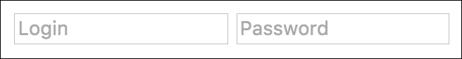
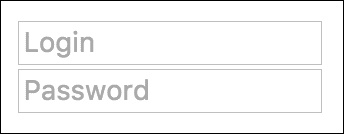
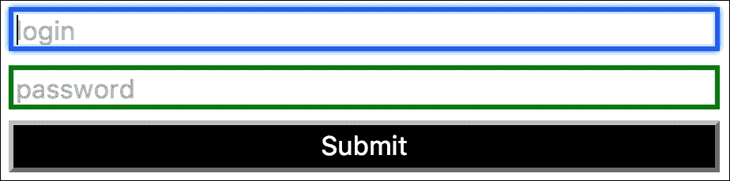
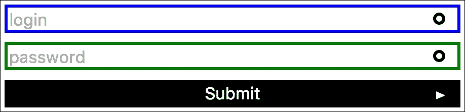
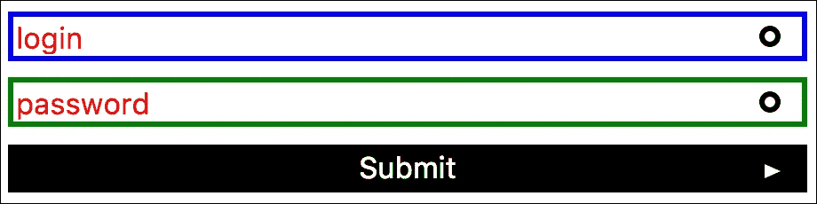
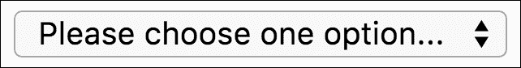

# 第六章：样式化表单

样式化表单是最具挑战性的任务之一，特别是当表单需要在桌面和移动设备上创建时。为什么？

在本章中，我们将涵盖以下主题：

+   如何为简单样式创建良好的结构

+   使用表单选择器

+   如何样式化表单

+   在表单中 CSS 的可能和不可能

# 表单-最常见的问题

你认识任何一个没有在 HTML/CSS 中构建过任何表单的前端开发人员吗？你认识任何一个喜欢做这项工作的人吗？是的...调整它并不简单，但你需要学会理解你可以用 HTML/CSS 做什么，以及在哪里需要使用 JavaScript 代码来使其更容易甚至可能。

最常见的限制如下：

+   因为输入框没有内容，所以不能使用伪元素`:before`和`:after`（`：before`和`：after`出现在内容之前或之后）

+   全局输入样式的使用并不好，因为有很多类型的输入（文本、密码、提交）

+   在所选框中显示元素的样式化根本不可能（有时更容易使用一些 JavaScript 插件来启用额外的结构，这样更容易进行样式化）

# 表单-启用超级功能

如前所述，在输入框中，无法使用`：before`和`：after`伪元素。但是有一个快速的技巧可以做到这一点，这将在接下来的章节中更好地描述，那就是将其包装在其他元素中。这总是有助于保持一些标签和输入组，并另外允许附加`：before`和`：after`伪元素。

例如，采用以下简单的 HTML 表单代码：

```css
<form>
    <input type="text" placeholder="Login"/>
    <input type="password" placeholder="Password"/>
</form>
```

现在你只需要添加包装元素：

```css
<form>
    <div class="inputKeeper">
        <input type="text" placeholder="Login"/>
    </div>
    <div class="inputKeeper">
        <input type="password" placeholder="Password"/>
    </div>
</form>
```

有什么不同？很容易看出来。第一个表单输出如下：



第二个表单如下：



## 如何样式化简单输入

输入样式基于选择器`<input> <select> <textarea>`。但是`<input>`类型存在问题。它将收集所有类型：

```css
<input type="text">
<input type="submit">
<input type="password">
<input type="checkbox">
```

对于密码输入：

```css
input[type="password"]
For submit input:
input[type="submit"]
```

让我们将这些输入整合到一个在网站上最常见的登录表单中。

HTML 代码：

```css
<form>
    <input type="text" placeholder="login"/>
    <input type="password" placeholder="password"/>
    <input type="submit" />
</form>
```

在浏览器中，它将如下所示：


让我们稍微改变结构，用包装的 div：

```css
<form>
    <div class="loginWrapper">
        <input type="text" placeholder="login"/>
    </div>
    <div class="passwordWrapper">
        <input type="password" placeholder="password"/>
    </div>
    <div class="submitWrapper">
        <input type="submit" />
    </div>
</form>
```

现在我们有了一个基本代码来开始样式化：


现在我们可以开始创建样式：

SASS：

```css
*
box-sizing: border-box

form
width: 300px

input
margin-bottom: 5px
width: 100%

input[type="text"]
  border: 2px solid blue

input[type="password"]
  border: 2px solid green

input[type="submit"]
  background: #000
color: #fff
width: 100%
```

生成的 CSS：

```css
* {
    box-sizing: border-box;
}

form {
    width: 300px;
}

input {
    margin-bottom: 5px;
    width: 100%;
}

input[type="text"] {
    border: 2px solid blue;
}

input[type="password"] {
    border: 2px solid green;
}

input[type="submit"] {
    background: #000;
    color: #fff;
    width: 100%;
}
```

现在，在了解了正确的选择器并添加了基本的 CSS 之后，我们的表单看起来像这样：



让我们看看**提交**按钮。我们需要去掉它的边框。在这个迭代中，让我们添加一些伪元素。让我们更新我们的 SASS 代码如下：

```css
=ring($size, $color, $width)
  width: $size
height: $size
border-radius: 50%
  border: $width solid $color
background: none

=triangleRight($width, $height, $color)
  width: 0
  height: 0
  border-style: solid
  border-width: $height/2 0 $height/2 $width
  border-color: transparent transparent transparent $color

*
  box-sizing: border-box

form
  width: 300px

input
  margin-bottom: 5px
  width: 100%

input[type="text"]
  border: 2px solid blue

input[type="password"]
  border: 2px solid green

input[type="submit"]
  background: #000
  color: #fff
  width: 100%

.loginWrapper,
.passwordWrapper,
.submitWrapper
  position: relative

  &:after
    content: ''
    display: inline-block
    position: absolute
    top: 50%
    right: 10px

.loginWrapper,
.passwordWrapper
  &:after
    margin-top: -6px
    right: 10px
    +ring(4px, #000, 2px)

.submitWrapper
  &:after
    margin-top: -3px
    right: 10px
    +triangleRight(6px, 6px, #fff)
```

生成的 CSS：

```css
* {
    box-sizing: border-box;
}

form {
    width: 300px;
}

input {
    margin-bottom: 5px;
    width: 100%;
}

input[type="text"] {
    border: 2px solid blue;
}

input[type="password"] {
    border: 2px solid green;
}

input[type="submit"] {
    background: #000;
    color: #fff;
    width: 100%;
}

.loginWrapper,
.passwordWrapper,
.submitWrapper {
    position: relative;
}

.loginWrapper:after,
.passwordWrapper:after,
.submitWrapper:after {
    content: "";
    display: inline-block;
    position: absolute;
    top: 50%;
    right: 10px;
}

.loginWrapper:after,
.passwordWrapper:after {
    margin-top: -6px;
    right: 10px;
    width: 4px;
    height: 4px;
    border-radius: 50%;
    border: 2px solid #000;
    background: none;
}

.submitWrapper:after {
    margin-top: -3px;
    right: 10px;
    width: 0;
    height: 0;
    border-style: solid;
    border-width: 3px 0 3px 6px;
    border-color: transparent transparent transparent #fff;
}
```

结果输出如下：



我们可以看到，我们忽略了`：before`和`：after`伪元素的问题。

## 不要忘记占位符

使用 HTML5，我们在所有浏览器中都支持占位符属性。它为我们提供了一个机会来添加以下描述：

```css
::-webkit-input-placeholder
  color: red

::-moz-placeholder
  color: red

::-ms-input-placeholder
  color: red
```

编译后的 CSS：

```css
::-webkit-input-placeholder {
    color: red;
}

::-moz-placeholder {
    color: red;
}

::-ms-input-placeholder {
    color: red;
}
```

结果输出如下：



## 基于 input[type="text"]和标签的复杂表单

那么让我们从复杂和弹性表单的样式开始。假设我们需要创建一个带有标签和输入的表单，其中标签始终位于左侧，输入正在调整大小。让我们来看 HTML 结构：

```css
<form class="" action="index.html" method="post">
    <fieldset>
        <legend>Personal data</legend>

        <div class="fieldKeeper">
            <label for="input_name">Your name</label>
            <input id="input_name" type="text" name="name" value="">
        </div>

        <div class="fieldKeeper">
            <label for="input_surname">Your surname</label>
            <input id="input_surname" type="text" name="name" value="">
        </div>

        <div class="fieldKeeper">
            <label for="input_address">Address</label>
            <input id="input_address" type="text" name="name" value="">
        </div>
    </fieldset>

    <fieldset>
        <legend>Login data</legend>
        <div class="fieldKeeper">
            <label for="input_login">Login</label>
            <input id="input_login" type="text" name="name" value="" placeholder="Your login">
        </div>

        <div class="fieldKeeper">
            <label for="input_password">Password</label>
            <input id="input_password" type="password" name="password" value="" placeholder="Password">
        </div>

        <div class="fieldKeeper">
            <label for="input_password_confirm">Confirm password</label>
            <input id="input_password_confirm" type="password" name="confirm_password" value="" placeholder="Confirmed password">
        </div>
    </fieldset>
</form>
```

在浏览器中，上述代码将如下所示：

![基于 input[type="text"]和标签的复杂表单](img/00082.jpeg)

如你所见，它现在几乎表现得像应该的样子，但它的输入宽度不是 100%。当你将其改为 100%时，标签将移动到输入框上。所以我们可以做的是将输入框包装在另一个`div`中，并使用填充和绝对/相对位置的技巧。让我们将我们的 HTML 代码改为首个`fieldset`：

```css
<fieldset>
    <legend>Login data</legend>
    <div class="fieldKeeper">
        <label for="input_login">Login</label>
        <div class="inputKeeper">
            <input id="input_login" type="text" name="name" value="" placeholder="Your login">
        </div>
    </div>

    <div class="fieldKeeper">
        <label for="input_password">Password</label>
        <div class="inputKeeper">
            <input id="input_password" type="password" name="password" value="" placeholder="Password">
        </div>
    </div>

    <div class="fieldKeeper">
        <label for="input_password_confirm">Confirm password</label>
        <div class="inputKeeper">
           <input id="input_password_confirm" type="password" name="confirm_password" value=""
                   placeholder="Confirmed password">
        </div>
    </div>
</fieldset>
```

在第一个`fieldset`中进行这个改变后，您将看到代码在有或没有额外的`inputKeeper` `div`的情况下的行为。让我们使用以下 SASS 代码：

```css
.fieldKeeper
  position: relative

fieldset
  width: auto
  border: 2px solid green

legend
  text-transform: uppercase
  font:
    size: 10px
    weight: bold

label
  position: absolute
  width: 200px
  display: inline-block
  left: 0
  font:
    size: 12px

.inputKeeper
  padding:
    left: 200px

input
  width: 100%
```

编译后的 CSS：

```css
.fieldKeeper {
    position: relative;
}

fieldset {
    width: auto;
    border: 2px solid green;
}

legend {
    text-transform: uppercase;
    font-size: 10px;
    font-weight: bold;
}

label {
    position: absolute;
    width: 200px;
    display: inline-block;
    left: 0;
    font-size: 12px;
}

.inputKeeper {
    padding-left: 200px;
}

input {
    width: 100%;
}
```

现在您在浏览器中看到的是：

![基于 input[type="text"]和标签的复杂表单](img/00083.jpeg)

在更大的屏幕上，您将看到以下内容：

![基于 input[type="text"]和标签的复杂表单](img/00084.jpeg)

正如我们所看到的，对于没有额外包装的标签，绝对位置会导致标签覆盖输入的问题。额外的包装给了我们一个机会来添加填充。在这个填充的位置，我们可以使用绝对位置推动标签。在将包装器附加到第二部分之后，它应该在浏览器中看起来如下：

![基于 input[type="text"]和标签的复杂表单](img/00085.jpeg)

## 如何样式化文本区域

`textarea`的样式化非常简单，非常类似于文本输入的样式化。其中一个区别是可以调整`textarea`的机会。这与`input[type="text"]`文本框相同，可以有一个占位符，因此您可以为其添加样式。让我们准备一个简单的 HTML 代码，以便对`textarea`进行简短的调查：

```css
<textarea placeholder="Here describe your skills"></textarea>
```

现在在浏览器中，您将看到以下内容：


请记住，在开放和关闭标签之间不要添加任何空格或行尾，因为它将被视为`textarea`的内容。这将导致占位符出现问题。

和 SASS 代码：

```css
textarea
  width: 300px
  height: 150px
  resize: none
  border: 2px solid green
```

编译后的 CSS：

```css
textarea {
    width: 300px;
    height: 150px;
    resize: none;
    border: 2px solid green;
}
```

在浏览器中，您将看到以下内容：


作为调整大小属性的值，您可以使用以下值：

+   `none`：这将在两个轴上禁用调整大小

+   `vertical`：这将启用垂直调整大小并阻止水平调整大小

+   `horizontal`：这将启用水平调整大小并阻止垂直调整大小

+   `both`：这将在两个轴上启用调整大小

## 选择框的样式化（下拉菜单）

该样式化`select`（下拉菜单）并不像应该那样简单。在大多数情况下，您需要使用一些 JavaScript 插件来使其更容易。但是您可以用简单的 CSS/HTML 代码做些什么呢？让我们看看以下代码：

```css
<select>
    <option>Please choose one option...</option>
    <option>Option one</option>
    <option>Option two</option>
    <option>Option three</option>
    <option>Option four</option>
    <option>Option five</option>
</select>
```

上述代码将生成一个未经样式化的选择框，如下所示：



并且在焦点动作之后，它会产生以下输出：


现在我们能做些什么呢？让我们尝试添加更多的风味。首先，让我们将其包装到额外的元素中：

```css
<div class="selectWrapper">
    <select>
        <option>Please choose one option...</option>
        <option>Option one</option>
        <option>Option two</option>
        <option>Option three</option>
        <option>Option four</option>
        <option>Option five</option>
    </select>
</div>
```

现在让我们添加一个 SASS 代码：

```css
=triangleBottom($width, $height, $color)
  width: 0
  height: 0
  border-style: solid
  border-width: $height $width/2 0 $width/2
  border-color: $color transparent transparent transparent

.selectWrapper
  width: 300px
  border: 2px solid green
  overflow: hidden
  position: relative

  &:after
    content: ''
    position: absolute
    +triangleBottom(10px, 6px, red)
    right: 5px
    margin-top: -3px
    top: 50%

select
  background: #fff
  color: black
  font:
    size: 14px
  border: none
  width: 105%
```

编译后的 CSS：

```css
.selectWrapper {
    width: 300px;
    border: 2px solid green;
    overflow: hidden;
    position: relative;
}

.selectWrapper:after {
    content: "";
    position: absolute;
    width: 0;
    height: 0;
    border-style: solid;
    border-width: 6px 5px 0 5px;
    border-color: red transparent transparent transparent;
    right: 5px;
    margin-top: -3px;
    top: 50%;
}

select {
    background: #fff;
    color: black;
    font-size: 14px;
    border: none;
    width: 105%;
}
```


正如您所看到的，这种方法相当棘手。我们使选择框比容器宽一点，以将原生控件移出。然后我们向容器添加了溢出隐藏。此外，我们添加了 after 元素以添加一个三角形。

# 总结

在本章中，您了解了如何样式化表单。处理所有这些表单确实有些棘手，但正如您所看到的，总会有一些解决方案（例如，使用额外的包装器）。我建议您创建一个简单的框架，以便您可以处理表单。这使您完全准备好样式化表单。

在下一章中，我们将尝试解决 CSS 中最常见的问题，例如元素居中、处理显示类型等。这将展示旧学校和新学校方法与新的 CSS 功能可能性。
