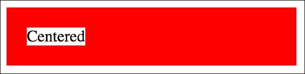
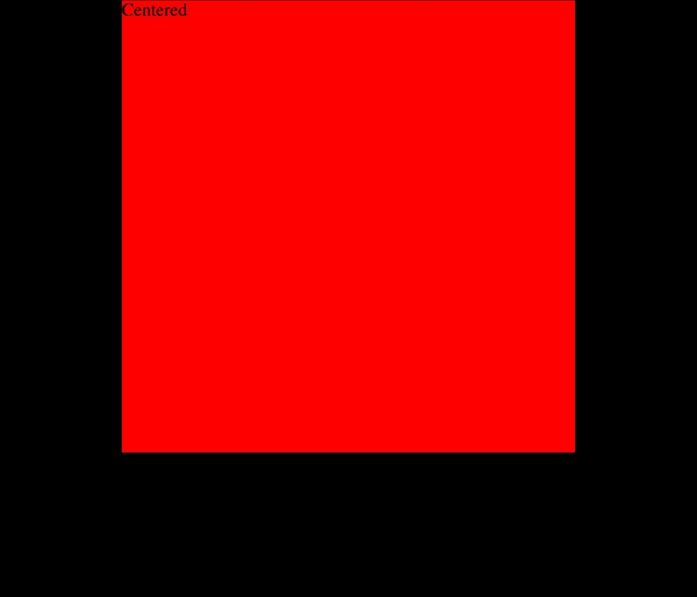
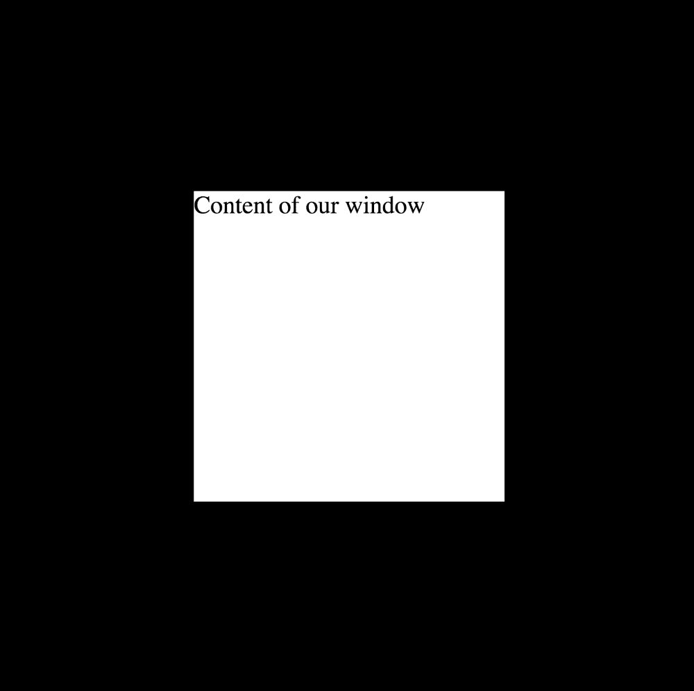
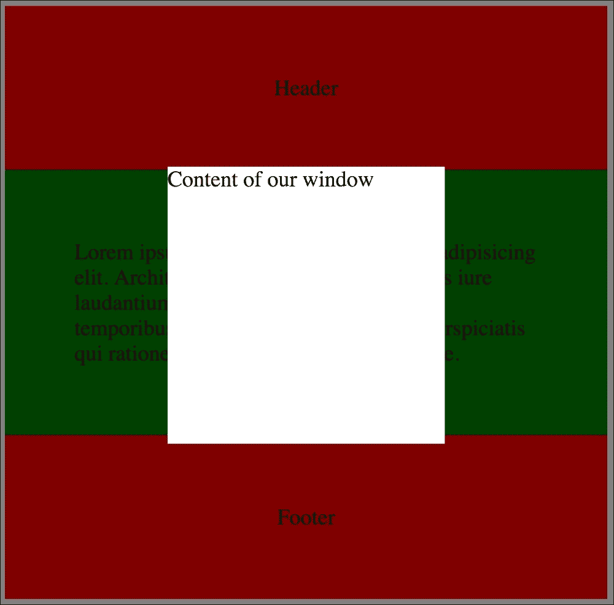

# 第七章：解决经典问题

作为前端开发人员，您总是在处理经典的 CSS 问题。最常见和重复的问题是在两个轴上居中元素和不透明度。使用当前的 CSS，您可以做得非常简单，但您需要有基础知识才能知道如何做。关于浏览器先前版本的回退的知识可以在一些其他进阶技术中使用。这就是为什么它们被添加到这一章节中。

在本章中，我们将：

+   学习如何在两个轴上居中元素

+   学习如何处理不透明度

+   汇集前面的技巧，并创建类似于时尚灯箱效果的效果

# 居中元素

居中元素是自第一个 CSS 版本以来就已知的一个方面。页面上总是有一些需要在某个容器或浏览器中垂直或水平居中的元素/元素。居中一些元素的最简单方法是将元素附加到表元素中，并在 HTML 中添加垂直对齐和水平对齐属性：

```css
<td valign="middle" align="center>  </td>
```

但是在现代 CSS 中我们该如何做到这一点呢？有两种居中方式：

+   水平

+   垂直

让我们解决这个问题。

## 内联元素-水平居中

假设我们有一段文本需要居中。这很简单。我们只需要添加`text-align: center`就可以了。在我们将要实现的示例中，我们将容器的背景设置为`red`，元素的背景设置为`white`以查看它是如何工作的。

让我们从这段 HTML 代码开始：

```css
<p class="container">
    <span class="element">Centered</span>
</p>
```

和 SASS 代码：

```css
.container
  background: red
  padding: 20px

.element
  background: white
```

CSS：

```css
.container {
    background: red;
    padding: 20px;
}

.element {
    background: white;
}
```

在浏览器中我们将看到以下内容：



要使框居中，如前面提到的，我们需要在容器中添加`text-align: center`：

SASS：

```css
.container
  text-align: center
  background: red
  padding: 20px

.element
  background: white
```

现在在浏览器中，我们可以看到以下内容：


假设我们有两个块元素，我们想要调整它们如前面的例子那样。我们需要做什么？我们需要将显示类型更改为`inline`或`inline-block`。让我们稍微改变 HTML 代码：

```css
<div class="container">
    <div class="element">Centered</div>
</div>
```

现在加入之前添加的 SASS 代码，我们的示例将表现得与以下屏幕截图类似：


如前面的屏幕截图所示，块元素占据了全部可能的宽度。我们需要做的是修改 SASS 代码：

```css
.container
  text-align: center
  background: red
  padding: 20px

.element
  background: white
  display: inline-block
```

CSS：

```css
.container {
    text-align: center;
    background: red;
    padding: 20px;
}

.element {
    background: white;
    display: inline-block;
}
```

现在在浏览器中，我们可以看到以下内容：


## 块元素-在两个轴上居中

让我们从前一章的代码开始，这将是我们 CSS 样式的基础。这是`container`中的元素：

```css
<div class="container">
    <div class="element">Centered</div>
</div>
```

添加了带颜色的 SASS 代码以更好地显示问题：

```css
.container
  background: black

.element
  width: 400px
  height: 400px
  background: red
```

CSS：

```css
.container {
    background: black;
}

.element {
    width: 400px;
    height: 400px;
    background: red;
}
```

在起始点，我们在浏览器中的代码将如下所示：


如前面的屏幕截图所示，我们的带有`居中`内容的容器现在位于黑色容器的左侧。假设这是需要居中并粘贴到页面顶部的页面容器：

```css
.container
  background: black
  height: 800px

.element
  width: 400px
  height: 400px
  background: red
  margin: 0 auto
```

编译：

```css
.container {
    background: black;
    height: 800px;
}

.element {
    width: 400px;
    height: 400px;
    background: red;
    margin: 0 auto;
}
```

最重要的一行是加粗的那一行。这使我们的容器居中，如下面的屏幕截图所示：



那么我们该怎么做才能使它在两个轴上居中呢？用已知元素的宽度和高度的老式方法是将容器的相对位置添加到元素的绝对位置。元素需要从顶部和左侧移动 50%。然后我们需要使用负边距将元素向上和向左移动已知高度的一半：

```css
.container
  position: relative

.element
  position: absolute
  width: 100px
  height: 100px
  left: 50%
  right: 50%
  margin-left: -50px
  margin-top: -50px
```

CSS：

```css
.container {
    position: relative;
}

.element {
    position: absolute;
    width: 100px;
    height: 100px;
    left: 50%;
    right: 50%;
    margin-left: -50px;
    margin-top: -50px;
}
```

输出将如下所示：


正如您在前面的截图中所看到的，该元素在两个轴上都居中。最大的问题是元素的静态宽度和高度。是的，当然，有一种方法可以添加 JavaScript 代码来实现它，但最好使用原生 CSS 函数。所以让我们尝试使用`transform`属性来实现它。

## 使用 transform 进行居中

在上一节中，我们一直在尝试解决居中元素的问题。让我们用 transform 声明来扩展它。我们将在下一章中深入了解 transform，以了解它如何与旋转和缩放一起工作，但是对于本章，我们需要添加以下代码：

```css
.container
  position: relative

.element
  position: absolute
  left: 50%
  right: 50%
  transform: translate(-50%, -50%)
```

在前面的代码中，最后一行产生了与上一节中相同的效果，定义了负左和上边距。这段代码的最佳特点是我们可以在任何地方添加它，而不需要知道宽度和高度。在下一章中，我们将学习 flexbox，它可以用于元素的居中。

# 处理不透明度

不透明度在项目中经常出现。例如，当您在页面上创建一些模型窗口或类似灯箱的画廊时。它通常用于在主窗口下添加的图层（覆盖元素），在大多数情况下，该图层在 JavaScript 中添加了`onclick`事件监听器，点击时隐藏窗口。您如何创建这种效果？过去是如何做到的？让我们从一个简单的 HTML 代码开始：

```css
<header> Header </header>
<main> Lorem ipsum dolor sit amet, consectetur adipisicing elit. Architecto dolore doloremque dolores iure laudantium magni mollitia quam ratione, temporibus ut? Aperiam necessitatibus perspiciatis qui ratione vel! Adipisci eligendi sint unde. </main>
<footer> Footer </footer>
```

SASS：

```css
header, footer, main
  padding: 50px
  text-align: center

header, footer
  background: red

main
  background: green
```

编译后：

```css
header, footer, main {
    padding: 50px;
    text-align: center;
}

header, footer {
    background: red;
}

main {
    background: green;
}
```

现在它将看起来像下面这样：


我们需要做的是在当前可见容器之上添加一个带有不透明度的图层。让我们在当前添加的代码之后追加这段代码：

```css
<div class="window_container">
    <div class="window">Content of our window</div>
</div>
```

现在我们需要做的是将容器位置更改为`fixed`，并将元素位置更改为`absolute`。让我们添加一些代码来增加更多的样式，以便更好地看到我们工作的效果：

```css
.window_container
  position: fixed
  width: 100%
  height: 100%
  top: 0
  left: 0
  background: black

.window
  position: absolute
  width: 200px
  height: 200px
  background: white
  top: 50%
  left: 50%
  -webkit-transform: translate(-50%, -50%)
  -moz-transform: translate(-50%, -50%)
  -ms-transform: translate(-50%, -50%)
  -o-transform: translate(-50%, -50%)
  transform: translate(-50%, -50%)
```

编译后：

```css
.window_container {
    position: fixed;
    width: 100%;
    height: 100%;
    top: 0;
    left: 0;
    background: black;
}

.window {
    position: absolute;
    width: 200px;
    height: 200px;
    background: white;
    top: 50%;
    left: 50%;
    -webkit-transform: translate(-50%, -50%);
    -moz-transform: translate(-50%, -50%);
    -ms-transform: translate(-50%, -50%);
    -o-transform: translate(-50%, -50%);
    transform: translate(-50%, -50%);
}
```

在浏览器中，我们将看到白色的居中块在黑色容器上，如下所示：



前面的代码将成为下一节的基础，我们将看到`opacity`和`rgba`之间的差异。

## 不透明度与 RGBA-差异及其使用场景

让我们尝试将先前添加到 HTML/SASS 结构中的`.window_container`元素设置为透明。最简单的方法是添加`opacity`：`.5`。所以让我们尝试将以下代码添加到我们当前的 SASS 代码中：

```css
.window_container
  opacity: .5
  position: fixed
  width: 100%
  height: 100%
  top: 0
  left: 0
  background: black
```

CSS：

```css
.window_container {
    opacity: 0.5;
    position: fixed;
    width: 100%;
    height: 100%;
    top: 0;
    left: 0;
    background: black;
}
```

在浏览器中的效果将如下截图所示：


正如我们在前面的截图中所看到的，不透明度被`.window_container`内的元素继承。这不是我们想要的方式，所以我们必须更改 CSS（SASS）或 HTML 代码。如果我们想更改 HTML 代码，可以这样做：

```css
<div class="window_container"> </div>
<div class="window">Content of our window</div>
```

SASS 代码将在窗口描述中更改。我们只会将位置更改为`fixed`：

```css
.window
  position: fixed
```

在浏览器中的效果将如下所示：


正如我们在前面的截图中所看到的，在浏览器中，已经实现了效果，但是我们的 HTML 结构有点混乱。我们已经同时将两个元素添加到了与一个元素相关的 HTML 代码中。所以让我们回到我们章节开头的代码，其中`.window`在`.window_container`中。这是我们将使用`rgba`的地方。确保负责窗口的 HTML 代码如下所示：

```css
<div class="window_container">
    <div class="window">Content of our window</div>
</div>
```

我们需要做的是更改`window_container`的背景颜色定义，并追加我们的`rgba`。正如我们所知，我们可以以几种方式定义元素的颜色：

+   添加颜色名称（`black`，`white`，`red`，...）

+   十六进制颜色定义（`#ff00ff`，`#fff`，...）

+   基于 RGB（`rgb(0,0,0)`，`rgb(255,255,255)`）的颜色

+   基于 HSL（`hsl(100, 90%, 50%)`）的颜色

+   RGBA（`rgb(0,0,0, .4)`, `rgb(255,255,255, .7)`）基于红绿蓝+ alpha 通道

+   HSLA（`hsl(100, 90%, 50%, .8)`）基于色调、饱和度、亮度+ alpha 通道

在我们的情况下，我们将使用`rgba`。`window_container`的最终 SASS 代码如下：

```css
.window_container
  position: fixed
  width: 100%
  height: 100%
  top: 0
  left: 0
  background: rgba(0,0,0,.5)

.window
  position: fixed
  width: 200px
  height: 200px
  background: white
  top: 50%
  left: 50%
  -webkit-transform: translate(-50%, -50%)
  -moz-transform: translate(-50%, -50%)
  -ms-transform: translate(-50%, -50%)
  -o-transform: translate(-50%, -50%)
  transform: translate(-50%, -50%)
```

编译：

```css
.window_container {
    position: fixed;
    width: 100%;
    height: 100%;
    top: 0;
    left: 0;
    background: rgba(0, 0, 0, 0.5);
}

.window {
    position: fixed;
    width: 200px;
    height: 200px;
    background: white;
    top: 50%;
    left: 50%;
    -webkit-transform: translate(-50%, -50%);
    -moz-transform: translate(-50%, -50%);
    -ms-transform: translate(-50%, -50%);
    -o-transform: translate(-50%, -50%);
    transform: translate(-50%, -50%);
}
```

如您所见，`opacity`声明被移除了。颜色定义为 RGBA。其余代码保持不变。在浏览器中的代码如下所示：



## 过去的不透明度 - 用于旧 IE 版本的回退

对于旧浏览器的回退方式与当您想要使用边框半径时的方式类似 - 您需要使用图像。最终是如何完成的呢？当图形在图形软件中被裁剪时，覆盖层被裁剪为一个小的透明图像，例如，PNG 1 像素 x1 像素。然后将其添加为背景，并在*x*和*y*轴上重复。

```css
/* FALLBACK */
.window_container
  background-image: url(<1x1.png>)
  background-repeat: repeat
```

# 总结

在本章中，您了解了 CSS 中最常见的经典问题：居中和不透明度。您解决了这个问题，并了解了解决方案的利弊。此外，您还了解了如何在旧浏览器中解决不透明度问题。

在下一章中，您将学习有关现代 CSS 方面的知识，如 flexbox 渐变、阴影、变换和数据属性。您还将学习一些可以应用到您的代码中的技巧。让我们继续下一章。
