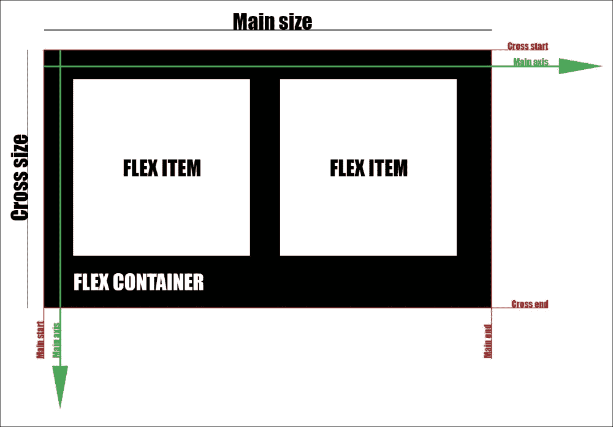
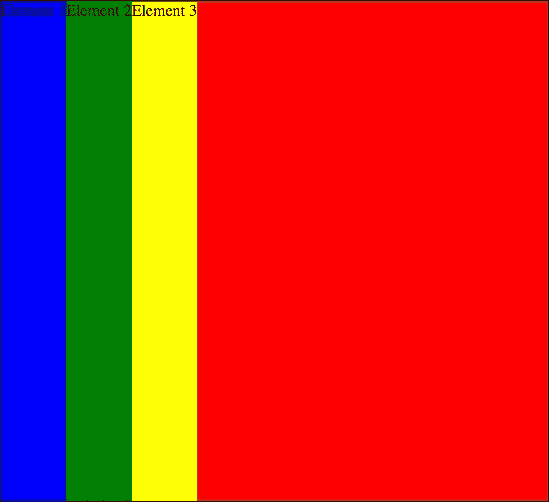
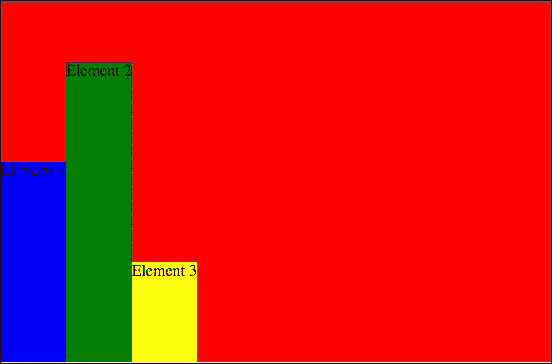
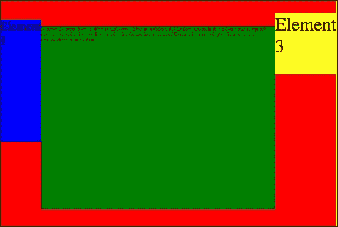
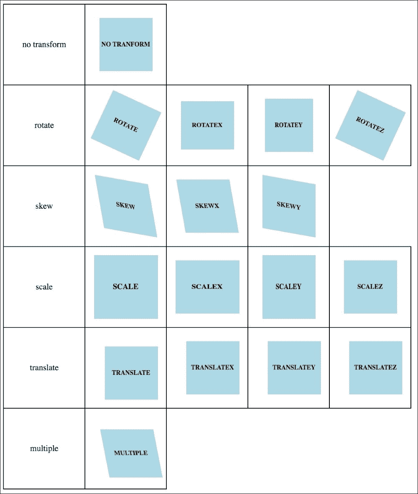

# 第八章：Flexbox 变换的使用

CSS 仍在发展。作为前端开发人员，每年您都需要关注当前趋势和可以为元素设置的新属性。当然，有很多限制，但在某些情况下，这些限制不存在，例如在新浏览器或选定的移动应用程序中，或者因为设置了要求。在本章中，我们将涵盖以下主题：

+   Flexbox

+   变换属性

# Flexbox

Flexbox 是当前 CSS 项目中使用的最响亮和最现代的布局方法之一。使用 flexbox，您可以为网页创建一个比基于浮动框更灵活的结构。为什么？我们将在本章中进行检查和调查。您需要记住的是，自 Internet Explorer 的第 11 个版本起就支持 flexbox。

让我们来看看 flexbox 的基础知识：



如您在前面的屏幕截图中所见，有一个与 flexbox 相关的新字典：

+   **主轴**（绿色箭头）

+   **主轴开始**（红线）

+   **主轴结束**（红线）

+   **主轴尺寸**（黑线）

+   **交叉轴**（绿色箭头）

+   **交叉开始**（红线）

+   **交叉结束**（红线）

+   **交叉尺寸**（黑线）

flexbox 的初始化非常简单。您只需要将以下代码添加到容器中：

```css
.flexContainer
  display: -webkit-box
  display: -moz-box
  display: -ms-flexbox
  display: -webkit-flex
  display: flex
```

编译后的代码是：

```css
.flexContainer {

    display: -webkit-box;

    display: -moz-box;

    display: -ms-flexbox;

    display: -webkit-flex;

    display: flex;

}
```

flexbox 的使用仍然需要前缀以实现跨浏览器兼容性。这是创建可重用 mixin 的一个很好的理由：

```css
=displayFlex

  display: -webkit-box

  display: -moz-box

  display: -ms-flexbox

  display: -webkit-flex

  display: flex
```

现在我们可以创建与以下相同的`.flexContainer`：

```css
.flexContainer

  +displayFlex
```

编译后的代码是：

```css
.flexContainer {

    display: -webkit-box;

    display: -moz-box;

    display: -ms-flexbox;

    display: -webkit-flex;

    display: flex;

}
```

让我们在容器中创建一些元素：

```css
<div class="flexContainer">

    <div class="flexElement">Element 1</div>

    <div class="flexElement">Element 2</div>

    <div class="flexElement">Element 3</div>

</div>
```

让我们稍微装饰一下我们的 CSS 代码，以查看 flexbox 的行为：

```css
=displayFlex

  display: -webkit-box

  display: -moz-box

  display: -ms-flexbox

  display: -webkit-flex

  display: flex

.flexContainer

  +displayFlex

  background: red
```

编译后的代码是：

```css
.flexContainer {

    display: -webkit-box;

    display: -moz-box;

    display: -ms-flexbox;

    display: -webkit-flex;

    display: flex;

    background: red;

}
```

现在我们将在浏览器中看到以下视图：


如您在前面的屏幕截图中所见，容器未达到浏览器中的最大可能高度，但确实达到了其全宽。内部元素向左浮动。现在让我们稍微改变 SASS 代码：

```css
.flexContainer

  +displayFlex

  height: 100%

  background: red

.blue

  background: blue

.green

  background: green

.yellow

  background: yellow
```

编译后的代码是：

```css
.flexContainer {

    display: -webkit-box;

    display: -moz-box;

    display: -ms-flexbox;

    display: -webkit-flex;

    display: flex;

    height: 100%;

    background: red;

}

.blue {

    background: blue;

}

.green {

    background: green;

}

.yellow {

    background: yellow;

}
```

让我们在 HTML 代码中添加一个颜色类：

```css
<div class="flexContainer">

    <div class="flexElement blue">Element 1</div>

    <div class="flexElement green">Element 2</div>

    <div class="flexElement yellow">Element 3</div>

</div>
```

在浏览器中，您将看到以下内容：



如您在前面的屏幕截图中所见，容器具有全宽和高，并且内部元素的行为类似于内联元素，但继承自容器的全高。这是因为属性称为`align-item`，其默认值为**stretch**。让我们更深入地了解此属性的值。

## Flexbox 属性 align-items

这是我们可以添加到`flexContainer`的属性之一。它有一些我们可以设置的值。目前，我们知道默认的 stretch 值的行为。让我们研究其余可能的值。在所有值之前，让我们稍微改变 HTML 和 CSS 代码，以更好地查看所有行为。

让我们修改 HTML 代码如下：

```css
<div class="flexContainer">

    <div class="flexElement blue h200px">Element 1</div>

    <div class="flexElement green h300px">Element 2</div>

    <div class="flexElement yellow h100px">Element 3</div>

</div>
```

让我们附加以下 SASS 代码：

```css
.h100px

  height: 100px

.h200px

  height: 200px

.h300px

  height: 300px
```

CSS 文件是：

```css
.h100px {

    height: 100px;

}

.h200px {

    height: 200px;

}

.h300px {

    height: 300px;

}
```

可以使用的 flex 的不同值如下：

+   `stretch`（默认）

### 提示

对于此值 stretch，您需要删除添加盒子高度（`h100px`，`h200px`，`h300px`）的类。

+   `flex-start`

+   `flex-end`

+   `center`

+   `baseline`

在这种情况下，为了更好地理解这种行为，让我们更改我们的代码以查看如何指定基线：

```css
<div class="flexContainer">
    <div class="flexElement blue h200px">Element 1</div>
    <div class="flexElement green h300px">Element 2 Lorem ipsum dolor sit amet, consectetur adipisicing elit. Possimus necessitatibus est quis sequi, sapiente quos corporis, dignissimos libero quibusdam beatae ipsam quaerat? Excepturi magni voluptas dicta inventore necessitatibus omnis officia.</div>
    <div class="flexElement yellow h100px">Element 3</div>
</div>
```

在 SASS 中，代码可以编写为：

```css
.h100px
  height: 100px
  font-size: 30px
  margin-top: 20px

.h200px
  height: 200px
  font-size: 20px

.h300px
  height: 300px
  font-size: 8px
```

CSS 代码将是：

```css
.h100px {
    height: 100px;
    font-size: 30px;
    margin-top: 20px;
}

.h200px {
    height: 200px;
    font-size: 20px;
}

.h300px {
    height: 300px;
    font-size: 8px;
}
```

前面代码的输出如下：



从顶部的盒子位置是从盒子中的第一行文本指定的基线设置的。有意义的是为`h100px`盒子添加了一个 margin-top，以查看基线是从子元素集中的任何一个盒子计算的。

好的。但是当我们添加一个没有文本内容的框时，这个例子会如何表现呢？让我们修改 HTML 代码如下：

```css
<div class="flexContainer">
    <div class="flexElement blue h200px">Element 1</div>
    <div class="flexElement yellow h100px w100px"></div>
    <div class="flexElement green h300px">Element 2 Lorem ipsum dolor sit amet, consectetur adipisicing elit. Possimus necessitatibus est quis sequi, sapiente quos corporis, dignissimos libero quibusdam beatae ipsam quaerat? Excepturi magni voluptas dicta inventore necessitatibus omnis officia.</div>
    <div class="flexElement yellow h100px">Element 3</div>
</div>
```

让我们在 SASS 代码中添加`w100px`类：

```css
.w100px
  width: 100px

CSS:
.w100px {
    width: 100px;
}
```

前面代码的输出如下：

！[Flexbox 属性 align-items]（img/00111.jpeg）

正如我们在前面的屏幕截图中看到的那样，基线由黄色空框的底部线指定。

## Flexbox 属性 flex-wrap

我们可以为 flex 容器设置的下一个属性之一是`flex-wrap`。此属性与框中的换行有关。我们可以将`nowrap`，`wrap`和`wrap-reverse`设置为值。它们的行为如何？

+   `nowrap`（默认）！[Flexbox 属性 flex-wrap]（img/00112.jpeg）

+   `wrap`！[Flexbox 属性 flex-wrap]（img/00113.jpeg）

+   `wrap-reverse`！[Flexbox 属性 flex-wrap]（img/00114.jpeg）

正如你所看到的，`wrap`和`wrap-reverse`的工作方式相同，但有一个简单的区别：`wrap-reverse`改变了伸缩项的顺序。

## Flexbox 属性 justify-content

`justify-content`属性也与容器有关：

+   `flex-start`！[Flexbox 属性 justify-content]（img/00115.jpeg）

+   `flex-end`！[Flexbox 属性 justify-content]（img/00116.jpeg）

+   `center`！[Flexbox 属性 justify-content]（img/00117.jpeg）

+   `space-between`！[Flexbox 属性 justify-content]（img/00118.jpeg）

+   `space-around`！[Flexbox 属性 justify-content]（img/00119.jpeg）

## Flexbox 属性 align-content

项目的对齐与`flexContainer`有关。您需要记住，当您至少有两行项目时，效果才会可见。因此，让我们更改以下示例代码：

HTML：

```css
<div class="flexContainer">
    <div class="flexElement blue h100px">Element 1</div>
    <div class="flexElement green h200px">Element 2</div>
    <div class="flexElement blue h100px">Element 3</div>
    <div class="flexElement green h200px">Element 4</div>
    <div class="flexElement blue h100px">Element 5</div>
    <div class="flexElement green h200px">Element 6</div>
</div>
```

SASS 代码是：

```css
=displayFlex
  display: -webkit-box
  display: -moz-box
  display: -ms-flexbox
  display: -webkit-flex
  display: flex

.flexContainer
  height: 600px
  width: 900px
  +displayFlex
  flex-wrap: wrap
  background: red

.blue
  background: blue

.green
  background: green

.yellow
  background: yellow

.h100px
  height: 100px
  font-size: 30px
  margin-top: 20px

.h200px
  height: 200px
  font-size: 20px

.h300px
  height: 300px
  font-size: 8px

.w100px
  width: 100px

.flexElement
  width: 300px
```

CSS 代码是：

```css
.flexContainer {
    height: 600px;
    width: 900px;
    display: -webkit-box;
    display: -moz-box;
    display: -ms-flexbox;
    display: -webkit-flex;
    display: flex;
    flex-wrap: wrap;
    background: red;
}

.blue {
    background: blue;
}

.green {
    background: green;
}

.yellow {
    background: yellow;
}

.h100px {
    height: 100px;
    font-size: 30px;
    margin-top: 20px;
}

.h200px {
    height: 200px;
    font-size: 20px;
}

.h300px {
    height: 300px;
    font-size: 8px;
}

.w100px {
    width: 100px;
}

.flexElement {
    width: 300px;
}
```

+   `flex-start`！[Flexbox 属性 align-content]（img/00120.jpeg）

+   `flex-end`！[Flexbox 属性 align-content]（img/00121.jpeg）

+   `center`！[Flexbox 属性 align-content]（img/00122.jpeg）

+   `space-between`！[Flexbox 属性 align-content]（img/00123.jpeg）

+   `space-around`！[Flexbox 属性 align-content]（img/00124.jpeg）

+   `stretch`！[Flexbox 属性 align-content]（img/00125.jpeg）

在最后一个例子中，所有与高度相关的类都已被删除：`h100px`，`h200px`。

## Flexbox 属性 flex-direction

flexbox 的不同属性如下：

+   `row`！[Flexbox 属性 flex-direction]（img/00126.jpeg）

+   `row-reverse`！[Flexbox 属性 flex-direction]（img/00127.jpeg）

+   `column`！[Flexbox 属性 flex-direction]（img/00128.jpeg）

+   `column-reverse`！[Flexbox 属性 flex-direction]（img/00129.jpeg）

您可以添加到您的收藏中的有用的 mixin 如下：

```css
=displayFlex
  display: -webkit-box
  display: -moz-box
  display: -ms-flexbox
  display: -webkit-flex
  display: flex

=flexOrder($number)
  -webkit-box-ordinal-group: $number
  -moz-box-ordinal-group: $number
  -ms-flex-order: $number
  -webkit-order: $number
  order: $number
```

## 使用 flexbox-创建页面结构

当您开始处理项目时，您会将准备好的布局作为图形文件，并且需要在浏览器中使其可用和交互。让我们从当前最知名的结构开始：

```css
<div class="flexContainer">
    <header>Header</header>
    <aside>Side menu</aside>
    <main>Content</main>
    <footer>Footer - Copyright fedojo.com</footer>
</div>
```

因此，我们希望将标题放在顶部，左侧主体放在右侧，页脚放在底部：

```css
.flexContainer
  +displayFlex
  -webkit-flex-flow: row wrap
  flex-flow: row wrap

  & > *
    padding: 10px
    flex: 1 100%

  header
    background: red

  footer
    background: lightblue

  main
    background: yellow
    flex: 3 1 auto

  aside
    background: green
    flex:  0 0 auto
```

CSS 文件是：

```css
.flexContainer {
    display: -webkit-box;
    display: -moz-box;
    display: -ms-flexbox;
    display: -webkit-flex;
    display: flex;
    -webkit-flex-flow: row wrap;
    flex-flow: row wrap;
}

.flexContainer > * {
    padding: 10px;
    flex: 1 100%;
}

.flexContainer header {
    background: red;
}

.flexContainer footer {
    background: lightblue;
}

.flexContainer main {
    background: yellow;
    flex: 3 auto;
}

.flexContainer aside {
    background: green;
    flex: 1 auto;
}
```

浏览器中的效果将如下：

！[使用 flexbox-创建页面结构]（img/00130.jpeg）

当您希望将侧边栏宽度更改为静态值时，您可以在侧边菜单的 SASS 声明中添加一个小的更改：

```css
aside
  background: green
  flex:  0 0 auto
  width: 100px
```

它将在 CSS 中：

```css
.flexContainer aside {
    background: green;
    flex: 0 auto;
    width: 100px;
}
```

这将保持左侧列的静态宽度。

## 使用 flexbox-在移动/平板视图中更改框的顺序

当您在创建 HTML 布局时调整到桌面和移动设备时，可能会出现一些情况，您需要更改框的顺序。桌面的简单示例如下：

+   第一个元素需要在顶部

+   第二个元素需要在底部

移动设备的简单示例如下：

+   第二个元素需要在顶部

+   第一个元素需要在底部

让我们使用以下 HTML 代码：

```css
<div class="container">
    <div class="first">First</div>
    <div class="second">Second</div>
</div>
```

让我们创建几行 SASS 代码：

```css
=displayFlex
  display: -webkit-box
  display: -moz-box
  display: -ms-flexbox
  display: -webkit-flex
  display: flex

=flexOrder($number)
  -webkit-box-ordinal-group: $number
  -moz-box-ordinal-group: $number
  -ms-flex-order: $number
  -webkit-order: $number
  order: $number

.container > *
  padding: 20px

.first
  background: lightblue

.second
  background: lightcyan

@media screen and (max-width: 600px)

  .container
    +displayFlex
    -webkit-flex-flow: row wrap
    flex-flow: row wrap

    & > *
      width: 100%

    .first
      +flexOrder(2)

    .second
      +flexOrder(1)
```

在 CSS 中：

```css
.container > * {
    padding: 20px;
}

.first {
    background: lightblue;
}

.second {
    background: lightcyan;
}

@media screen and (max-width: 600px) {
    .container {
        display: -webkit-box;
        display: -moz-box;
        display: -ms-flexbox;
        display: -webkit-flex;
        display: flex;
        -webkit-flex-flow: row wrap;
        flex-flow: row wrap;
    }

    .container > * {
        width: 100%;
    }

    .container .first {
        -webkit-box-ordinal-group: 2;
        -moz-box-ordinal-group: 2;
        -ms-flex-order: 2;
        -webkit-order: 2;
        order: 2;
    }

    .container .second {
        -webkit-box-ordinal-group: 1;
        -moz-box-ordinal-group: 1;
        -ms-flex-order: 1;
        -webkit-order: 1;
        order: 1;
    }
}
```

在桌面上，当视口宽度大于`600px`时，您可以看到以下内容：

！[使用 flexbox-在移动/平板视图中更改框的顺序]（img/00131.jpeg）

在小于`600px`的视图上，您可以看到以下内容：


# 更多关于 transform 的内容

变换对于前端开发人员非常有用，因为你可以仅使用 CSS 执行基本的图形操作。在 CSS 的早期版本中，这只能通过 JavaScript 实现。在之前的章节中，我们使用`transform`来将元素居中在容器中。现在让我们尝试更深入地理解它，并检查我们还能做些什么：

HTML 文件如下：

```css
<table>
    <tr>
        <td>no transform</td>
        <td><div class="transform_none">no transform</div></td>
    </tr>
    <tr>
        <td>rotate</td>
        <td><div class="transform_rotate">rotate</div></td>
        <td><div class="transform_rotatex">rotateX</div></td>
        <td><div class="transform_rotatey">rotateY</div></td>
        <td><div class="transform_rotatez">rotateZ</div></td>
    </tr>
    <tr>
        <td>skew</td>
        <td><div class="transform_skew">skew</div></td>
        <td><div class="transform_skewx">skewX</div></td>
        <td><div class="transform_skewy">skewY</div></td>
    </tr>
    <tr>
        <td>scale</td>
        <td><div class="transform_scale">scale</div></td>
        <td><div class="transform_scalex">scaleX</div></td>
        <td><div class="transform_scaley">scaleY</div></td>
        <td><div class="transform_scalez">scaleZ</div></td>
    </tr>
    <tr>
        <td>translate</td>
        <td><div class="transform_translate">translate</div></td>
        <td><div class="transform_translatex">translateX</div></td>
        <td><div class="transform_translatey">translateY</div></td>
        <td><div class="transform_translatez">translateZ</div></td>
    </tr>
    <tr>
        <td>multiple</td>
        <td><div class="transform_multiple01">multiple</div></td>
    </tr>

</table>
```

SASS 文件如下：

```css
table
  border-collapse: collapse

  td, th
    border: 1px solid black

div[class^="transform_"]
  width: 100px
  height: 100px
  background: lightblue
  line-height: 100px
  text:
    align: center
    transform: uppercase
  font:
    weight: bold
    size: 10px
  display: inline-block

td
  text-align: center
  vertical-align: middle
  width: 150px
  height: 150px

.transform_
  /* Rotate */
  &rotate
    transform: rotate(25deg)

  &rotatex
    transform: rotateX(25deg)

  &rotatey
    transform: rotateY(25deg)

  &rotatez
    transform: rotateZ(25deg)

  /* Skew */
  &skew
    transform: skew(10deg, 10deg)

  &skewx
    transform: skewX(10deg)

  &skewy
    transform: skewY(10deg)

  /* Scale */
  &scalex
    transform: scaleX(1.2)

  &scale
    transform: scale(1.2)

  &scaley
    transform: scaleY(1.2)

  /* Translate */
  &translate
    transform: translate(10px, 10px)

  &translatex
    transform: translate(10%)

  &translatey
    transform: translate(10%)

  &translatez
    transform: translate(10%)

  /* Multiple */
  &multiple01
    transform: rotateX(25deg) translate(10px, 10px) skewX(10deg)
```

CSS 文件如下：

```css
table {
    border-collapse: collapse;
}

table td, table th {
    border: 1px solid black;
}

div[class^="transform_"] {
    width: 100px;
    height: 100px;
    background: lightblue;
    line-height: 100px;
    text-align: center;
    text-transform: uppercase;
    font-weight: bold;
    font-size: 10px;
    display: inline-block;
}

td {
    text-align: center;
    vertical-align: middle;
    width: 150px;
    height: 150px;
}

.transform_ {
    /* Rotate */
    /* Skew */
    /* Scale */
    /* Translate */
    /* Multiple */
}

.transform_rotate {
    transform: rotate(25deg);
}

.transform_rotatex {
    transform: rotateX(25deg);
}

.transform_rotatey {
    transform: rotateY(25deg);
}

.transform_rotatez {
    transform: rotateZ(25deg);
}

.transform_skew {
    transform: skew(10deg, 10deg);
}

.transform_skewx {
    transform: skewX(10deg);
}

.transform_skewy {
    transform: skewY(10deg);
}

.transform_scalex {
    transform: scaleX(1.2);
}

.transform_scale {
    transform: scale(1.2);
}

.transform_scaley {
    transform: scaleY(1.2);
}

.transform_translate {
    transform: translate(10px, 10px);
}

.transform_translatex {
    transform: translate(10%);
}

.transform_translatey {
    transform: translate(10%);
}

.transform_translatez {
    transform: translate(10%);
}

.transform_multiple01 {
    transform: rotateX(25deg) translate(10px, 10px) skewX(10deg);
}
```

在浏览器中的效果将如下所示：



在上面的示例中，在浏览器的示例视图中有一堆可能的变换。在第一行中，你可以看到没有任何变换的元素。在接下来的每一行中，你可以检查以下内容：

+   **rotate**

+   **skew**

+   **scale**

+   **translate**

+   **multiple**

变换的重要方面是可以在每种变换类型中使用的单位：

+   `rotate`：度数，例如，`rotate(20deg, 40deg).`

+   `skew`：度数，例如，`skew(30deg, 50deg).`

+   `scale`：数字，其中 1 = 100%，例如，`scale(1.5, 1.5).`

+   `translate`：与宽度相关的单位，如像素百分比，例如，`translate(50%, 50%)`。重要信息：百分比与转换对象的尺寸相关。

在前面截图的最后一行中，有一个示例显示了如何在一行中链接多个变换。当你需要添加多个变换时，可以使用这个示例。

# 总结

在本章中，你了解了现代 CSS 的主要特性。你学会了 flexbox 的工作原理以及如何在项目中使用它。你分析了二维变换，这些变换可以在你的项目中使用。本章是对新 CSS 特性的介绍，将帮助你了解可能性。

在下一章中，我们将专注于渐变、阴影和动画。我们将创建线性和径向渐变框和文本阴影，并且还将了解`calc`函数的知识。
