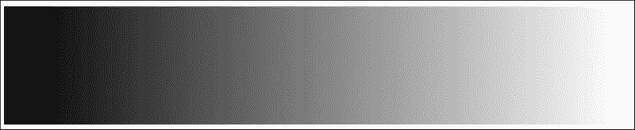
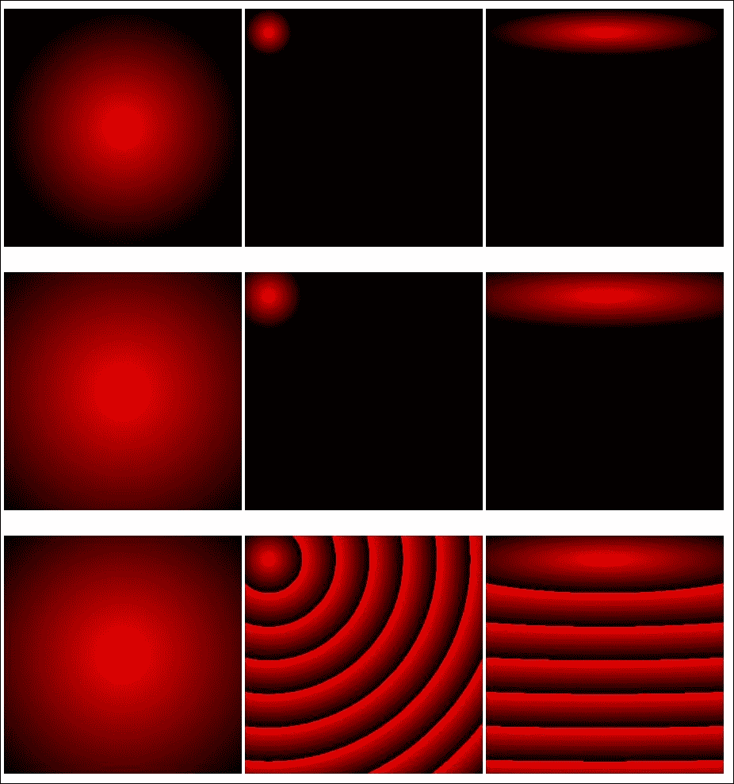
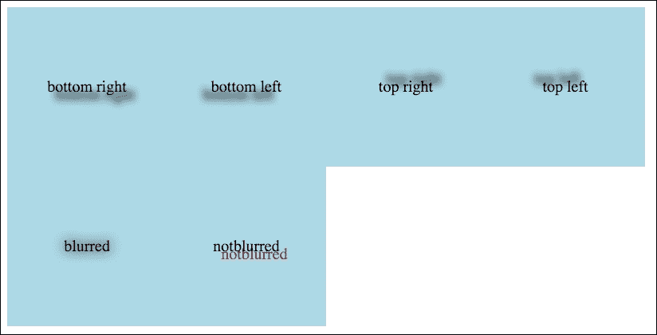
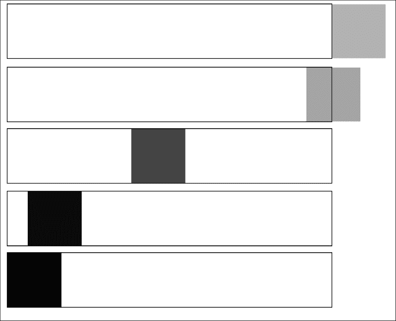
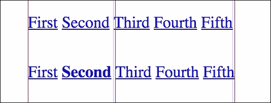

# 第九章：Calc, Gradients, and Shadows

在上一章中，我们分析了 flexbox 和基于 flexbox 模型的简单结构。在本章中，我们将专注于 CSS 的以下方面：

+   Calc 函数

+   渐变

+   阴影

+   CSS 动画。

+   使用 data-attribute

让我们开始吧！

# calc()方法

你有没有遇到过混合单位的问题？例如，假设你需要制作一个方程 60%-10px？这些操作在旧浏览器中可能非常有用，而且现在在 CSS 中可以通过`calc()`方法实现。你如何使用它？让我们解决一个有两个浮动框的问题；一个具有固定宽度，第二个则根据可能的最大宽度进行调整。代码如下：

HTML：

```css
<div class="container">
    <div class="first">First</div>
    <div class="second">Second</div>
</div>
```

SASS：

```css
  &:after
    content: ""
    display: table
    clear: both

.container
  +clearfix

  & > *
    float: left
    height: 200px
    padding: 10px
    box-sizing: border-box

.first
  width: 100px
  background: red

.second
  width: calc(100% - 100px)
  background: blue
```

编译后的 CSS：

```css
.container:after {
    content: "";
    display: table;
    clear: both;
}

.container >* {
    float: left;
    height: 200px;
    padding: 10px;
    box-sizing: border-box;
}

.first {
    width: 100px;
    background: red;
}

.second {
    width: calc(100% - 100px);
    background: blue;
}
```

这是最终结果：


`calc()`函数给了我们一个机会去做简单的方程，比如百分比减去像素。在这个简单的例子中，你可以看到我们不需要使用 padding 和绝对位置的技巧。你可以正确使用`calc()`函数，问题就会得到解决。

# CSS 中的渐变

有经验的前端开发人员还记得渐变是如何作为背景图像完成的。是的！那是模仿浏览器中的渐变的唯一想法。你需要从 PSD 文件中裁剪 1px 宽度和渐变高度（如果是垂直渐变；在水平渐变的情况下，高度是 1px，宽度由渐变的宽度指定）。然后，你需要将其添加到 CSS 中，并在背景中重复你的*魔术*图像。

现在，你可以在 CSS 中做到这一点！让我们从线性渐变开始。

## 线性渐变

线性渐变可以有两种类型：从上到下或从左到右。让我们从垂直渐变开始：

```css
background: linear-gradient(to bottom, #000 0%, #f00 100%)
```

这段代码将生成一个从上到下的线性渐变。在顶部，颜色将是黑色，在底部将是红色。


然而，成为前端开发人员可能并不那么容易。这就是为什么你需要记住前缀：

```css
background: -webkit-gradient(linear, left top, left bottom, color-stop(0%, #000), color-stop(100%, #f00))
background: -moz-linear-gradient(top, #000 0%, #f00 100%)
background: -webkit-linear-gradient(top, #000 0%, #f00 100%)
background: -o-linear-gradient(top, #000 0%, #f00 100%)
background: -ms-linear-gradient(top, #000 0%, #f00 100%)
background: linear-gradient(to bottom, #000 0%, #f00 100%)
```

正如你所看到的，带前缀的定义占用了大量的代码，特别是当你需要为 IE9 提供回退时（最后一行带有 filter 定义）。

基本的水平渐变定义如下：

```css
background: linear-gradient(left, #fff, #000) 
```

这个例子将生成一个从左到右的渐变，右边是白色，左边是黑色。



这是带前缀的版本：

```css
background: -webkit-gradient(linear, left top, right top, from(#fff), to(#000))
background: -webkit-linear-gradient(left, #fff, #000)
background: -moz-linear-gradient(left, #fff, #000)
background: -ms-linear-gradient(left, #fff, #000)
background: -o-linear-gradient(left, #fff, #000)
background: linear-gradient(left, #fff, #000)
```

多色渐变呢？当然是可能的：

```css
background: linear-gradient(to right, black, red, white)
```

这是效果：


你也可以旋转渐变：

HTML：

```css
<div class="gradient-04"></div>
```

SASS：

```css
div[class^="gradient-"]
  height: 200px
  width: 200px
  margin-bottom: 20px

.gradient-04
  background: linear-gradient(45deg , black, red, white)
```

CSS：

```css
div[class^="gradient-"] {
    height: 200px;
    width: 200px;
    margin-bottom: 20px;
}

.gradient-04 {
    background: linear-gradient(45deg, black, red, white);
}
```

在浏览器中的效果：


如果你想改变颜色之间的平衡呢？例如，也许你想在渐变中有更高浓度的黑色？这也是可能的：

SASS：

```css
.gradient-05
  background: linear-gradient(to right, black 40%, red 50%, white 100%)
```

CSS：

```css
.gradient-05 {
    background: linear-gradient(to right, black 40%, red 50%, white 100%);
}
```

在浏览器中的效果：


要理解这一点，你需要逐步检查这个例子：

```css
black 40%:This line means that black color will be finished in 40% of width of the box
red 50%:This means that red color will be finished in 50% of width of the box
white 100%:This means that white color will be finished in 100% of width of the box
```

## 使用渐变 mixin

在本章中，你可以获得这些 mixin 并在你的项目中使用它们。我不喜欢每次都写很长的代码——只需写一次，然后重复简短版本。这就是为什么我准备了这两个简单的渐变：

```css
=linearGradientFromTop($startColor, $endColor)
  background: $startColor
  background: -webkit-gradient(linear, left top, left bottom, color-stop(0%, $startColor), color-stop(100%, $endColor))
  background: -moz-linear-gradient(top, $startColor 0%, $endColor 100%)
  background: -webkit-linear-gradient(top, $startColor 0%, $endColor 100%)
  background: -o-linear-gradient(top, $startColor 0%, $endColor 100%)
  background: -ms-linear-gradient(top, $startColor 0%, $endColor100%)
  background: linear-gradient(to bottom, $startColor 0%, $endColor 100%)
  filter: progid:DXImageTransform.Microsoft.gradient( startColorstr='#{$startColor}', endColorstr='#{$endColor}',GradientType=0 )

=linearGradientFromLeft($startColor, $endColor)
  background-color: $startColor
background: -webkit-gradient(linear, left top, right top, from($startColor), to($endColor))
  background: -webkit-linear-gradient(left, $startColor, $endColor)
  background: -moz-linear-gradient(left, $startColor, $endColor)
  background: -ms-linear-gradient(left, $startColor, $endColor)
  background: -o-linear-gradient(left, $startColor, $endColor)
  background: linear-gradient(left, $startColor, $endColor)
  filter: progid:DXImageTransform.Microsoft.gradient(startColorStr='#{$startColor}', endColorStr='#{$endColor}', gradientType='1')
```

在前面的混合示例中最重要的一点是，您需要使用`hex`颜色的完整表示。例如，您不能使用`#f00`来表示红色。您必须使用`#ff0000`。这是因为 IE9 及更低版本不支持渐变中较短的颜色表示。混合中的另一个重要事项是第一行，它仅设置背景颜色。这是所有不支持任何前缀/非前缀渐变版本的浏览器的回退。使用它，颜色仅设置为作为`$startColor`设置的颜色。混合中的第二行与基于 WebKit 的旧版本浏览器有关。最后一行与旧版 IE（9 及更低版本）有关。当然，如果没有使用或不需要，您不必在项目中保留此代码。您可以修改它以满足项目的要求。

## 径向渐变

在一些项目中，您需要添加径向渐变。径向渐变标准函数如下：

```css
radial-gradient()
```

或者你可以使用：

```css
background: repeating-radial-gradient()
```

让我们检查一个示例代码和渐变使用的可能性：

HTML：

```css
<table>
    <tr>
        <td><div class="gradient-04"></div></td>
        <td><div class="gradient-05"></div></td>
        <td><div class="gradient-06"></div></td>
    </tr>
    <tr>
        <td><div class="gradient-07"></div></td>
        <td><div class="gradient-08"></div></td>
        <td><div class="gradient-09"></div></td>
    </tr>
    <tr>
        <td><div class="gradient-10"></div></td>
        <td><div class="gradient-11"></div></td>
        <td><div class="gradient-12"></div></td>
    </tr>
</table>
```

SASS：

```css
div[class^="gradient-"]
  height: 200px
  width: 200px
  margin-bottom: 20px

//
.gradient-04
  background: red
  background: -webkit-radial-gradient(50% 50%, closest-side, red, black)
  background: -o-radial-gradient(50% 50%, closest-side, red, black)
  background: -moz-radial-gradient(50% 50%, closest-side, red, black)
  background: radial-gradient(closest-side at 50% 50%, red, black)

.gradient-05
  background: red
  background: -webkit-radial-gradient(10% 10%, closest-side, red, black)
  background: -o-radial-gradient(10% 10%, closest-side, red, black)
  background: -moz-radial-gradient(10% 10%, closest-side, red, black)
  background: radial-gradient(closest-side at 10% 10%, red, black)

.gradient-06
  background: red
  background: -webkit-radial-gradient(50% 10%, closest-side, red, black)
  background: -o-radial-gradient(50% 10%, closest-side, red, black)
  background: -moz-radial-gradient(50% 10%, closest-side, red, black)
  background: radial-gradient(closest-side at 50% 10%, red, black)

.gradient-07
  background: red
  background: -webkit-radial-gradient(50% 50%, closest-corner, red, black)
  background: -o-radial-gradient(50% 50%, closest-corner, red, black)
  background: -moz-radial-gradient(50% 50%, closest-corner, red, black)
  background: radial-gradient(closest-corner at 50% 50%, red, black)

.gradient-08
  background: red
  background: -webkit-radial-gradient(10% 10%, closest-corner, red, black)
  background: -o-radial-gradient(10% 10%, closest-corner, red, black)
  background: -moz-radial-gradient(10% 10%, closest-corner, red, black)
  background: radial-gradient(closest-corner at 10% 10%, red, black)

.gradient-09
  background: red
  background: -webkit-radial-gradient(50% 10%, closest-corner, red, black)
  background: -o-radial-gradient(50% 10%, closest-corner, red, black)
  background: -moz-radial-gradient(50% 10%, closest-corner, red, black)
  background: radial-gradient(closest-corner at 50% 10%, red, black)

.gradient-10
  background: red
  background: -webkit-repeating-radial-gradient(50% 50%, closest-corner,  red, black)
  background: -o-repeating-radial-gradient(50% 50%, closest-corner, red, black)
  background: -moz-repeating-radial-gradient(50% 50%, closest-corner, red, black)
  background: repeating-radial-gradient(closest-corner at 50% 50%, red, black)

.gradient-11
  background: red
  background: -webkit-repeating-radial-gradient(10% 10%, closest-corner, red, black)
  background: -o-repeating-radial-gradient(10% 10%, closest-corner, red, black)
  background: -moz-repeating-radial-gradient(10% 10%, closest-corner, red, black)
  background: repeating-radial-gradient(closest-corner at 10% 10%, red, black)

.gradient-12
  background: red
  background: -webkit-repeating-radial-gradient(50% 10%, closest-corner, red, black)
  background: -o-repeating-radial-gradient(50% 10%, closest-corner, red, black)
  background: -moz-repeating-radial-gradient(50% 10%, closest-corner, red, black)
  background: repeating-radial-gradient(closest-corner at 50% 10%, red, black)
```

CSS：

```css
div[class^="gradient-"] {
    height: 200px;
    width: 200px;
    margin-bottom: 20px;
}

.gradient-04 {
    background: red;
    background: -webkit-radial-gradient(50% 50%, closest-side, red, black);
    background: -o-radial-gradient(50% 50%, closest-side, red, black);
    background: -moz-radial-gradient(50% 50%, closest-side, red, black);
    background: radial-gradient(closest-side at 50% 50%, red, black);
}

.gradient-05 {
    background: red;
    background: -webkit-radial-gradient(10% 10%, closest-side, red, black);
    background: -o-radial-gradient(10% 10%, closest-side, red, black);
    background: -moz-radial-gradient(10% 10%, closest-side, red, black);
    background: radial-gradient(closest-side at 10% 10%, red, black);
}

.gradient-06 {
    background: red;
    background: -webkit-radial-gradient(50% 10%, closest-side, red, black);
    background: -o-radial-gradient(50% 10%, closest-side, red, black);
    background: -moz-radial-gradient(50% 10%, closest-side, red, black);
    background: radial-gradient(closest-side at 50% 10%, red, black);
}

.gradient-07 {
    background: red;
    background: -webkit-radial-gradient(50% 50%, closest-corner, red, black);
    background: -o-radial-gradient(50% 50%, closest-corner, red, black);
    background: -moz-radial-gradient(50% 50%, closest-corner, red, black);
    background: radial-gradient(closest-corner at 50% 50%, red, black);
}

.gradient-08 {
    background: red;
    background: -webkit-radial-gradient(10% 10%, closest-corner, red, black);
    background: -o-radial-gradient(10% 10%, closest-corner, red, black);
    background: -moz-radial-gradient(10% 10%, closest-corner, red, black);
    background: radial-gradient(closest-corner at 10% 10%, red, black);
}

.gradient-09 {
    background: red;
    background: -webkit-radial-gradient(50% 10%, closest-corner, red, black);
    background: -o-radial-gradient(50% 10%, closest-corner, red, black);
    background: -moz-radial-gradient(50% 10%, closest-corner, red, black);
    background: radial-gradient(closest-corner at 50% 10%, red, black);
}

.gradient-10 {
    background: red;
    background: -webkit-repeating-radial-gradient(50% 50%, closest-corner, red, black);
    background: -o-repeating-radial-gradient(50% 50%, closest-corner, red, black);
    background: -moz-repeating-radial-gradient(50% 50%, closest-corner, red, black);
    background: repeating-radial-gradient(closest-corner at 50% 50%, red, black);
}

.gradient-11 {
    background: red;
    background: -webkit-repeating-radial-gradient(10% 10%, closest-corner, red, black);
    background: -o-repeating-radial-gradient(10% 10%, closest-corner, red, black);
    background: -moz-repeating-radial-gradient(10% 10%, closest-corner, red, black);
    background: repeating-radial-gradient(closest-corner at 10% 10%, red, black);
}

.gradient-12 {
    background: red;
    background: -webkit-repeating-radial-gradient(50% 10%, closest-corner, red, black);
    background: -o-repeating-radial-gradient(50% 10%, closest-corner, red, black);
    background: -moz-repeating-radial-gradient(50% 10%, closest-corner, red, black);
    background: repeating-radial-gradient(closest-corner at 50% 10%, red, black);
}
```

这是在浏览器中的效果：



# 如何添加盒子阴影

回到过去，CSS 中没有阴影功能。这个功能让您有机会向盒子（使用`box-shadow`）和文本（使用`text-shadow`）添加阴影效果。`box-shadow`是如何创建的？让我们来看看 CSS 中这个属性的参数：

```css
box-shadow: horizontal-shadow vertical-shadow blur spread color
```

在所有参数之前，您可以添加内部。使用此属性，阴影将位于元素内部。

理解这一点最简单的方法是查看它在浏览器中的行为：

HTML：

```css
<div class="container">
    <div class="box_container">
        <div class="box__bottom_right">bottom right</div>
    </div>
    <div class="box_container">
        <div class="box__bottom_left">bottom left</div>
    </div>
    <div class="box_container">
        <div class="box__top_right">top right</div>
    </div>
    <div class="box_container">
        <div class="box__top_left">top left</div>
    </div>
    <div class="box_container">
        <div class="box__blurred">blurred</div>
    </div>
    <div class="box_container">
        <div class="box__notblurred">notblurred</div>
    </div>
    <div class="box_container">
        <div class="box__spreaded">spreaded</div>
    </div>
    <div class="box_container">
        <div class="box__innershadow">inner shadow</div>
    </div>
</div>
```

SASS：

```css
=clearfix
  &:after
    content: ""
    display: table
    clear: both

.container
  +clearfix
  width: 800px

  & > *
    float: left

.box_container
  width: 200px
  height: 200px
  position: relative

div[class^="box__"]
  width: 100px
  height: 100px
  position: absolute
  background: lightblue
  top: 50%
  left: 50%
  line-height: 100px
  font:
    size: 10px
  text:
    align: center
  transform: translate(-50%,-50%)

.box__bottom_right
  box-shadow: 5px 5px 5px 0 #000

.box__bottom_left
  box-shadow: -5px 5px 5px 0 #000

.box__top_right
  box-shadow: 5px -5px 5px 0 #000

.box__top_left
  box-shadow: -5px -5px 5px 0 #000

.box__blurred
  box-shadow: 0px 0px 10px 0 #000

.box__notblurred
  box-shadow: 0px 0px 0 0 #000

.box__spreaded
  box-shadow: 0px 0px 0 5px #000

.box__innershadow
  box-shadow: inset 0px 0px 5px 0px #000
```

CSS：

```css
.container {
    width: 800px;
}

.container:after {
    content: "";
    display: table;
    clear: both;
}

.container > * {
    float: left;
}

.box_container {
    width: 200px;
    height: 200px;
    position: relative;
}

div[class^="box__"] {
    width: 100px;
    height: 100px;
    position: absolute;
    background: lightblue;
    top: 50%;
    left: 50%;
    line-height: 100px;
    font-size: 10px;
    text-align: center;
    transform: translate(-50%, -50%);
}

.box__bottom_right {
    box-shadow: 5px 5px 5px 0 #000;
}

.box__bottom_left {
    box-shadow: -5px 5px 5px 0 #000;
}

.box__top_right {
    box-shadow: 5px -5px 5px 0 #000;
}

.box__top_left {
    box-shadow: -5px -5px 5px 0 #000;
}

.box__blurred {
    box-shadow: 0px 0px 10px 0 #000;
}

.box__notblurred {
    box-shadow: 0px 0px 0 0 #000;
}

.box__spreaded {
    box-shadow: 0px 0px 0 5px #000;
}

.box__innershadow {
    box-shadow: inset 0px 0px 5px 0px #000;
}
```

这是在浏览器中的效果：


在这个例子中，您可以查看如何设置垂直和水平阴影。此外，您还可以设置模糊扩散和其颜色。向垂直和水平阴影添加正值会将阴影分别移动到底部和右侧。当您添加负值时，它将移动到顶部和左侧。

# 如何添加文本阴影

为盒子添加阴影非常简单。但是我们如何为文本添加阴影？使用`text-shadow`属性是可能的。它的工作方式与`box-shadow`非常相似。这是定义：

```css
text-shadow: horizontal-shadow vertical-shadow blur-radius color
```

让我们创建一个基于上一章代码的示例，以更好地理解`text-shadow`属性：

HTML：

```css
<div class="container">
    <div class="box_container">
        <div class="box__bottom_right">bottom right</div>
    </div>
    <div class="box_container">
        <div class="box__bottom_left">bottom left</div>
    </div>
    <div class="box_container">
        <div class="box__top_right">top right</div>
    </div>
    <div class="box_container">
        <div class="box__top_left">top left</div>
    </div>
    <div class="box_container">
        <div class="box__blurred">blurred</div>
    </div>
    <div class="box_container">
        <div class="box__notblurred">notblurred</div>
    </div>
</div>
```

SASS：

```css
=clearfix
  &:after
    content: ""
    display: table
    clear: both

.container
  +clearfix
  width: 00px

  &>*
    float: left

.box_container
  width: 100px
  height: 100px
  position: relative

div[class^="box__"]
  width: 100px
  height: 100px
  position: absolute
  background: lightblue
  top: 50%
  left: 50%
  line-height: 100px
  font:
    size: 10px
  text:
    align: center
  transform: translate(-50%,-50%)

.box__bottom_right
  text-shadow: 5px 5px 5px #000

.box__bottom_left
  text-shadow: -5px 5px 5px #000

.box__top_right
  text-shadow: 5px -5px 5px #000

.box__top_left
  text-shadow: -5px -5px 5px #000

.box__blurred
  text-shadow: 0px 0px 10px #000

.box__notblurred
  text-shadow: 5px 5px 0 red
```

CSS：

```css
.container {
    width: 0px;
}

.container:after {
    content: "";
    display: table;
    clear: both;
}

.container >* {
    float: left;
}

.box_container {
    width: 100px;
    height: 100px;
    position: relative;
}

div[class^="box__"] {
    width: 100px;
    height: 100px;
    position: absolute;
    background: lightblue;
    top: 50%;
    left: 50%;
    line-height: 100px;
    font-size: 10px;
    text-align: center;
    transform: translate(-50%, -50%);
}

.box__bottom_right {
    text-shadow: 5px 5px 5px #000;
}

.box__bottom_left {
    text-shadow: -5px 5px 5px #000;
}

.box__top_right {
    text-shadow: 5px -5px 5px #000;
}

.box__top_left {
    text-shadow: -5px -5px 5px #000;
}

.box__blurred {
    text-shadow: 0px 0px 10px #000;
}

.box__notblurred {
    text-shadow: 5px 5px 0 red;
}
```

这是在浏览器中的效果：



# 其他字体和文本功能

在过去的 5 年中，CSS 中的字体功能发生了很大变化。在过去，没有机会使用非标准字体，因为它被描述为*互联网安全*。这是使 Flash 技术更流行的问题之一，不仅因为完整的 Flash 页面，还因为**可扩展的 Inman Flash Replacement**（**SIFR**）。使用 SIFR，您只需要在 Adobe Flash 中附加您的字体并编译文件；然后您可以在网站上使用您的字体。但是您的 HTML 页面中有 Flash 实例。然后，有一种基于 JavaScript 的方法叫做**cufon**。您可以使用您的字体访问 cufon 页面，编译您的字体，然后在您的网站上附加`cufon.js`和您编译的字体（JS 文件）。在 JavaScript 中，您需要添加应该被交换的字体，最后您的字体就会在网站上可见。

如今，我们可以使用 font-face 在 Web 版本中使用自定义字体。

## 在浏览器中使用非标准字体

如果您想在浏览器中使用您的字体，您需要准备它。font-face 的基本定义基于原始 CSS 中的这个示例：

```css
@font-face {
    font-family: font_name;
    src: url(your_font.woff);
}
```

如果您现在想使用您的字体，您需要在 CSS 中附加此示例代码：

```css
.classOfElement {
    font-family: font_name;
}
```

主要问题是，如果我有另一种字体格式，我该如何准备我的字体以在浏览器中使用？如果您有一个字体，您可以使用`fontsquirrel.com`生成最终的 CSS 视图以供使用。当然，还有一些其他地方可以搜索字体：

+   Google Fonts ([`www.google.com/fonts`](https://www.google.com/fonts))

+   Typekit ([`typekit.com/fonts`](https://typekit.com/fonts))

在这里，您可以找到在您的项目中可以直接使用的字体。

## 使用 CSS 动画

CSS 动画是一个非常有用的功能。您无需使用 JavaScript 进行简单的动画，而且 CSS 动画受到 GPU（图形处理单元）的支持。CSS 动画可以做什么？让我们看下面的例子：

```css
<div class="container">
    <div class="rollin"></div>
</div>
```

SASS：

```css
.container
  width: 600px
  border: 1px solid #000

.rollin
  width: 100px
  height: 100px
  background: #000

  animation:
    duration: 1s
    name: roll_in
    iteration-count: 1
    delay: 1s
    fill-mode: backwards

@keyframes roll_in
  from
    margin-left: 100%
    opacity: .3

  to
    margin-left: 0%
    opacity: 1
```

这是生成的 CSS：

```css
.container {
    width: 600px;
    border: 1px solid #000;
}

.rollin {
    width: 100px;
    height: 100px;
    background: #000;
    animation-duration: 1s;
    animation-name: roll_in;
    animation-iteration-count: 1;
    animation-delay: 1s;
    animation-fill-mode: backwards;
}

@keyframes roll_in {
from {
        margin-left: 100%;
        opacity: 0.3;
    }
to {
        margin-left: 0%;
        opacity: 1;
    }
}
```

在浏览器中的效果：



您可以在 SASS/CSS 文件中看到动画的进度。

CSS 动画的属性有：

+   `animation-name`: 此属性定义了应使用哪个`@keyframs`定义，例如：`animation-name: roll_in`

+   `animation-delay`: 此属性定义了元素加载和动画开始之间的延迟时间，例如：`animation-delay: 2s`

+   `animation-duration`: 此属性定义了动画的持续时间，例如：`animation-duration: 2s`

+   `animation-iteration-count`: 此属性定义了动画应重复多少次，例如：`animation- iteration-count: 2`

+   `animation-fill-mode`: 此属性定义了元素在延迟时间方面的行为，例如：`animation- fill-mode: backward`

我如何在悬停时添加动画？让我们创建一个示例：

HTML：

```css
<a href="" class="animation_hover">Element</a>
```

SASS：

```css
.animation_hover
  display: inline-block
  padding: 20px
  background: #d3d3d3
  text-decoration: none
  color: black
  transition:
    duration: .5s
    property: all

  &:hover
    background: blue
    color: white
```

CSS：

```css
.animation_hover {
    display: inline-block;
    padding: 20px;
    background: #d3d3d3;
    text-decoration: none;
    color: black;
    transition-duration: 0.5s;
    transition-property: all;
}

.animation_hover:hover {
    background: blue;
    color: white;
}
```

这是在浏览器中的最终结果：


您可以在悬停操作之前和之后看到元素。此外，还有一个过渡，为此按钮添加了一些动画效果。在这个动画声明中最重要的是什么？

```css
transition-property
```

前面的声明给出了应该被动画化的值列表。这个列表的一个例子可能是：

```css
Color, background-color
```

这个列表意味着颜色和背景颜色将被动画化。当您想要动画化所有属性时，可以使用*all*作为值。

# 数据属性

数据属性主要与 HTML 代码和 JavaScript 相关。使用数据属性，您可以描述 DOM 元素并在脚本中使用这些值，例如，用于排序、动画或任何其他目的。但它如何帮助您在 CSS 代码中呢？让我们考虑以下示例。

## 问题 - 悬停时加粗移动导航

这是网站上一个非常常见的问题。假设您有内联元素对悬停作出反应。悬停后，元素的字重从普通变为粗体。效果是悬停元素之后的每个元素都向右移动。让我们从 HTML 代码开始：

```css
<ul>
    <li><a href="#">First</a></li>
    <li><a href="#">Second</a></li>
    <li><a href="#">Third</a></li>
    <li><a href="#">Fourth</a></li>
    <li><a href="#">Fifth</a></li>
</ul>
```

SASS：

```css
li, a
  display: inline-block
  text-align: center

a:hover
  font-weight: bold
```

CSS：

```css
li, a {
    display: inline-block;
    text-align: center;
}

a:hover {
    font-weight: bold;
}
```

CSS：

```css
li, a {
    display: inline-block;
    text-align: center;
}

a:hover {
    font-weight: bold;
}
```

在浏览器中的效果，没有和有悬停操作：



红色标尺是结构中的指向性偏移。现在，让我们使用我们的*antidotum*。首先，我们需要轻微更改我们的 HTML 代码。这个变化与`data-alt`属性及其值有关。作为值，我们正在复制 DOM 元素的值：

HTML：

```css
<ul class="bold_list_fix">
    <li><a href="#" data-alt="First">First</a></li>
    <li><a href="#" data-alt="Second">Second</a></li>
    <li><a href="#" data-alt="Third">Third</a></li>
    <li><a href="#" data-alt="Fourth">Fourth</a></li>
    <li><a href="#" data-alt="Fifth">Fifth</a></li>
</ul>
```

SASS：

```css
.bold_list_fix
  a::after
    display: block
    content: attr(data-alt)
    font-weight: bold
    height: 1px
    color: transparent
    overflow: hidden
    visibility: hidden
```

CSS：

```css
.bold_list_fix a::after {
    display: block;
    content: attr(data-alt);
    font-weight: bold;
    height: 1px;
    color: transparent;
    overflow: hidden;
}
```

大功告成！正如您所看到的，这个技巧是基于`:after`伪元素，它现在被保留为一个不可见的元素。内容是通过从 HTML 代码中获取`attr(data-alt)`属性设置的。对这个内容，加粗特性被添加。这给了我们足够的空间，这在以前的代码中没有被占用。最后，元素不会向右移动。

# 摘要

在本章中，我们讨论了 CSS 渐变，因此您无需使用图像制作渐变。我们分析了`box-shadow`和`text-shadow`的使用。我们创建了一个简单的动画并分析了其参数。此外，我们在 CSS 代码中使用了数据属性。

在下一章中，我们将讨论 CSS 中的 DRY（即不要重复自己）并尝试创建一个基本框架，这将是您项目的起点。
