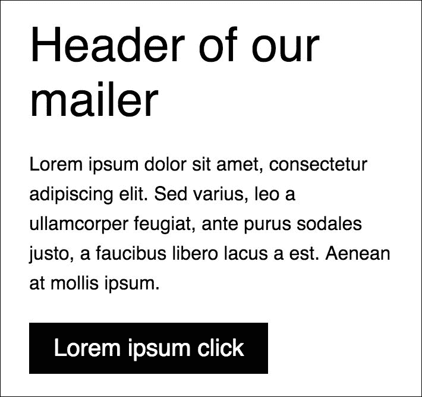

# 第十一章：邮件客户端基础知识

本章是关于构建邮件客户端和创建正确结构的基本方面。因为为邮件客户端构建正确的结构并不容易，而且仍然与 HTML 结构的老派思维有关，只有少数教程展示了如何从头到尾完成。为什么？让我们开始吧！

在本章中，我们将涵盖：

+   为邮件客户端创建一个简单的结构

+   了解邮件客户端中可能和不可能的事情

+   比较最知名的邮件客户端，包括 Outlook 和 Gmail

+   回到基于表格的 HTML 结构的老派思维

# 测试您的邮件客户端

由于需要在计算机上安装一堆邮件客户端，测试电子邮件的过程变得复杂。这当然与您需要安装以下操作系统有关：

+   Microsoft Outlook 2007/2010/2013

+   Microsoft Outlook 2003/Express

+   Microsoft Outlook.com

+   iPhone 邮件

+   Apple Mail

+   Gmail

+   雅虎电子邮件

这一大堆邮件客户端相当长，测试所有这些邮件客户端将会有问题。但您可以在工作流程中使用一些电子邮件测试工具。有一些在线工具的列表，例如 Litmus，稍后将在本章中介绍。

# 回到表格

表格结构是构建防弹电子邮件模板的最流行方法。它看起来像是从过去传来的。所以，让我们带来过去的风味，让我们开始创建正确的结构：

```css
<!DOCTYPE html PUBLIC "-//W3C//DTD XHTML 1.0 Transitional//EN" "http://www.w3.org/TR/xhtml1/DTD/xhtml1-transitional.dtd">
<html >
<head>
    <meta http-equiv="Content-Type" content="text/html; charset=utf-8"/>
    <meta name="viewport" content="width=device-width"/>
    <meta name="format-detection" content="telephone=no">
    <title>Untitled Document</title>
</head>
<body>
<style type="text/css">
    .class {} /* here will be your code */
</style>
<table width="100%" border="0" cellspacing="0" cellpadding="0">
    <!-- HERE your content -->
</table>
</body>
</html>
```

你可能会问，“但 HTML5 声明在哪里？为什么样式没有包含在`rel`标签的链接中？”这是因为电子邮件客户端中包含的旧 HTML 解释器以及使用较新的`doctype`可能会导致兼容性问题。目前，我们有一个骨架。让我们开始编写样式：

那么为什么我们要使用代码的这一部分？

```css
<meta name="format-detection" content="telephone=no">
```

这段代码与 iOS 特定问题有关。它改变了输入电话号码的行为，该电话号码（在 iOS 上）被检测并更改为一个交互链接，您可以点击并开始拨打电话。

## 重置样式

在 CSS 代码中，有很多代码应该用于重置所有浏览器上的行为。同样的情况也发生在邮件客户端中。有一堆声明应该附加到您的样式部分，并且将帮助您提供防弹邮件客户端。那么我们可以添加什么作为重置器？

```css
body {
    margin: 0;
    padding: 0;
    min-width: 100% !important;
}
```

删除边距和填充的第一个声明非常重要。这个声明来自标准的互联网浏览器。正如你所看到的，`min-width`也出现了。如代码中所述，这是非常重要的一行！在值中，有`100% !important`。是的！值和`!important`之间没有空格。以下代码是邮件客户端的`重置`样式的一部分：

```css
body,
table,
td,
a {
    -webkit-text-size-adjust: 100%; // IOS specific
-ms-text-size-adjust: 100%; // Windows mobile
}

.ExternalClass {
    width: 100%;
}

.ExternalClass,
.ExternalClass p,
.ExternalClass span,
.ExternalClass font,
.ExternalClass td,
.ExternalClass div {
    line-height: 100%;
}
```

什么是`ExternalClass`？这个类与将在 Outlook 或 Hotmail 中显示的模板有关。将这一大堆类设置到您的`<style>`标签中是一个很好的方法。这将最小化可能在特定邮件客户端上出现的问题。以下代码包含 mso-前缀。这意味着它与 Microsoft Office 有关。

```css
table {
    mso-table-lspace: 0pt;
    mso-table-rspace: 0pt;
}
```

这段代码与 Microsoft Outlook 有关。它将重置边框中的额外空间：

```css
#outlook a{
    padding:0;
}

h1,
h2,
h3,
h4,
h5,
h6 {
    color: <your_color>!important;
}

h1 a,
h2 a,
h3 a,
h4 a,
h5 a,
h6 a {
    color: <your_color>!important;
}

h1 a:active,
h2 a:active,
h3 a:active,
h4 a:active,
h5 a:active,
h6 a:active {
    color: <your_color>!important;
}

h1 a:visited,
h2 a:visited,
h3 a:visited,
h4 a:visited,
h5 a:visited,
h6 a:visited {
    color: <your_color>!important;
}

img{
    -ms-interpolation-mode:bicubic;
    border: 0;
    height: auto;
    line-height: 100%;
    outline: none;
    text-decoration: none;
}
```

# 通过媒体查询定位特定设备

要构建一个防弹邮件客户端，您将需要为一些特定的邮件客户端和设备使用特定的代码。这更难做，因为调试存在问题（没有很好的调试器/检查器来实时检查行为）。我们需要哪些设备？让我们创建一个列表：

+   带有视网膜和非视网膜显示器的 iPad 或 iPhone

+   Android 设备：

+   低密度（像素比小于 1）

+   中密度（像素比等于 1）

+   高密度（像素比大于 1）

```css
@media only screen and (max-device-width: 480px) {
}
```

这个集合将匹配平板电脑和小屏幕：

```css
@media only screen and (min-device-width: 768px) and (max-device-width: 1024px) {
}
```

视网膜显示器是 iOS 设备（如 iPhone、iPod 和 iPad）所知的。可以使用这个媒体查询来定位这些设备：

```css
@media only screen and (-webkit-min-device-pixel-ratio: 2) {
}
```

针对低密度 Android 布局：

```css
@media only screen and (-webkit-device-pixel-ratio: .75) {
}
```

针对中密度 Android 布局：

```css
@media only screen and (-webkit-device-pixel-ratio: 1) {
}
```

针对高密度 Android 布局：

```css
@media only screen and (-webkit-device-pixel-ratio: 1.5) {
}
```

如果你想要针对 Outlook 2007 和 2010，你需要使用 HTML 条件结构。它看起来像这样：

```css
<!--[if gte mso 9]>
<style>
    /* Your code here */
</style>
<![endif]-->
```

## 电子邮件模板中的 CSS 属性

重要的是要记住你可以使用哪些属性以及有哪些例外。这些知识将使你免于许多紧张的情况。让我们列举一下：

| 属性 | 特定客户端/设备的问题 |
| --- | --- |
| `direction` | - |
| `font` | - |
| `font-family` | - |
| `font-style` | - |
| `font-variant` | - |
| `font-size` | - |
| `font-weight` | - |
| `letter-spacing` | - |
| `line-height` | (iOS) 默认字体大小为 13px |
| `text-align` | (Outlook) 不要将 line-height 附加到`TD`元素。建议将此属性附加到`P`元素。 |
| `text-decoration` | - |
| `text-indent` | - |
| `background` | (Outlook) 不支持背景图片 |
| `background-color` | - |
| `border` | - |
| `padding` | (Outlook) 不支持元素的填充:`<p>``<div>``<a>` |
| `width` | (Outlook) 不支持元素的宽度:`<p>``<div>``<a>` |
| `list-style-type` | - |
| `border-collapse` | - |
| `table-layout` | - |

你可以看到，有很多属性在所有电子邮件客户端上的工作方式都不同。这是一个大问题，但是有了基本的知识，你就会知道哪些元素可以用 CSS 描述。邮件发送者中最大的问题是定位，这是不受支持的。所以例如，在大多数情况下，当文本溢出某些图像时，你需要使用包含文本的图像。

## 响应式电子邮件模板

这本书的这一部分可能会引发一场大讨论，因为在所有电子邮件客户端中都不可能构建响应式电子邮件。这是一个可以用作电子邮件模板基础的工作草案：

```css
<!DOCTYPE html PUBLIC "-//W3C//DTD XHTML 1.0 Transitional//EN"
        "http://www.w3.org/TR/xhtml1/DTD/xhtml1-transitional.dtd">
<html >
<head>
    <title>Our responsive template</title>
    <meta charset="utf-8">
    <meta name="viewport" content="width=device-width, initial-scale=1">
    <meta http-equiv="X-UA-Compatible" content="IE=edge"/>
    <style type="text/css">
        @media screen and (max-width: 525px) {
            .wrapper {
                width: 100% !important;
            }

            .content {
                padding: 10px 5% 10px 5% !important;
                text-align: left;
            }
        }
</style>
</head>
<body style="margin: 0 !important;
padding: 0 !important;">

<table border="0"
       cellpadding="0"
       cellspacing="0"
       width="100%">
    <tr>
        <td bgcolor="#ffffff"
            align="center"
            style="padding: 10px;">
            <table border="0"
                   cellpadding="0"
                   cellspacing="0"
                   width="500"
                   class="wrapper">
                <tr>
                    <td>
                        <table width="100%"
                               border="0"
                               cellspacing="0"
                               cellpadding="0">
                            <tr>
                                <td align="left"
                                    style="font-size: 40px;
                font-family: Helvetica, Arial, sans-serif;
   color: #000000;
                padding-top: 10px;"
                                 class="content">Header of our mailer
                                </td>
                            </tr>
                            <tr>
                                <td align="left"
                                    style="padding: 20px 0 0 0;
              font-size: 16px;
              line-height: 25px;
              font-family: Helvetica, Arial, sans-serif;
              color: #000000;
              padding-bottom: 30px;"
class="content">Lorem ipsum dolor sit amet, consectetur adipiscing elit. Sed
                                    varius, leo a ullamcorper feugiat, ante purus sodales justo, a faucibus libero lacus
                                    a est. Aenean at mollis ipsum.
                                </td>
                            </tr>
                            <tr>
                                <td align="center" class="content">
                                    <table width="100%"
                                           border="0"
                                           cellspacing="0"
                                           cellpadding="0">
                                        <tr>
                                            <td align="left">
                                                <table
                                                      border="0"
                                                      cellspacing="0"
                                                      cellpadding="0">
                                            <tr>
                                              <td align="center"
                                              bgcolor="#000"><a href="#"
                                              target="_blank"
                                              style="font-size: 20px;
                        font-family: Helvetica, Arial, sans-serif;
                        color: #ffffff;
                        text-decoration: none;
                        color: #ffffff;
                        text-decoration: none;
                        padding: 10px 20px;
    display: inline-block;">
                                                    Lorem ipsum click
                                                        </a>
                                                        </td>
                                                    </tr>
                                                </table>
                                            </td>
                                        </tr>
                                    </table>
                                </td>
                            </tr>
                        </table>
                    </td>
                </tr>
            </table>

        </td>
    </tr>

</table>

</body>
</html>
```

你可以看到，有很多代码...但是当我们想要将其与普通网站进行比较时，效果并不是很好。以下截图显示了在宽度大于 520px 的桌面浏览器中的外观：


在较小的浏览器（小于 520px）中，你会看到这个：



# 内联电子邮件模板

在推送项目之前，对电子邮件模板进行内联处理是一个非常重要的过程，当你使用单独的 CSS 文件或者 CSS 代码写在`<style>`部分时—[`foundation.zurb.com/e-mails/inliner-v2.html`](http://foundation.zurb.com/e-mails/inliner-v2.html)。

# 电子邮件模板开发提示

与前端开发相关的其他流程一样，这应该从准备好的设计开始。真正的网页设计师知道一个好网站的边界在哪里，也应该知道与邮件发送者相关的边界在哪里。在全局电子邮件创建过程中有很多限制。这就是为什么参与这个过程的设计师应该知道可以在 HTML 电子邮件模板中使用的功能。

## ZURB 的电子邮件模板框架 INK

这个开发过程更简单，有一些收集了经过测试的代码片段的框架。ZURB 在创建了伟大的前端框架 Foundation 之后，为电子邮件模板创建了 INK 作为框架。关于这个框架的完整信息，建议访问[`foundation.zurb.com/e-mails.html`](http://foundation.zurb.com/e-mails.html)。


基于 INK 创建的电子邮件模板非常适合开发人员。该框架收集了许多易于使用的组件，如网格系统、按钮、缩略图，你可以轻松地添加到你的模板中。此外，还有一系列可调参数，如间距、全局填充和边距。为了更深入地了解 ZURB INK2 框架，建议查看官方文档：[`foundation.zurb.com/emails/docs/`](http://foundation.zurb.com/emails/docs/)。

# 在 Litmus 上进行测试

当您想要收集所有测试环境时，电子邮件模板的测试就会变得非常复杂。使用 Litmus 会更容易，它会在大多数已知的电子邮件客户端中对您的电子邮件模板进行截图。

使用 Litmus 进行测试

创建模板后，您需要复制 HTML 代码并将其粘贴到系统中。如果您的电子邮件中有一些托管在某个服务器上的图片，您可以发送电子邮件到 Litmus 中的您的账户。Litmus 在应用程序端创建了您专用的电子邮件地址。当您发送电子邮件到此地址时，您可以在 Litmus 中测试此电子邮件。

使用 Litmus 进行测试

如您在上面的屏幕上所见，您可以在大多数已知的电子邮件客户端中检查您的代码。截图是在 Litmus 账户的试用版本上制作的，因此一些视图未被激活。

# 总结

准备防弹电子邮件模板是一个复杂的过程。为什么？正如您所见，HTML 和 CSS 在您熟悉的标准网络浏览器中表现得非常奇怪，不太符合逻辑。当然，所有这些过程都可以被描述，并且有一个工作流程可以帮助您在不紧张的情况下构建邮件发送程序。电子邮件模板带来的限制清单非常长，但对基础知识的良好掌握和电子邮件模板开发经验可以使您成为这个前端领域的专家。

在下一章中，我们将讨论 CSS 代码的可扩展性和模块化。您将更多地了解方法论和命名约定。让我们开始吧！
