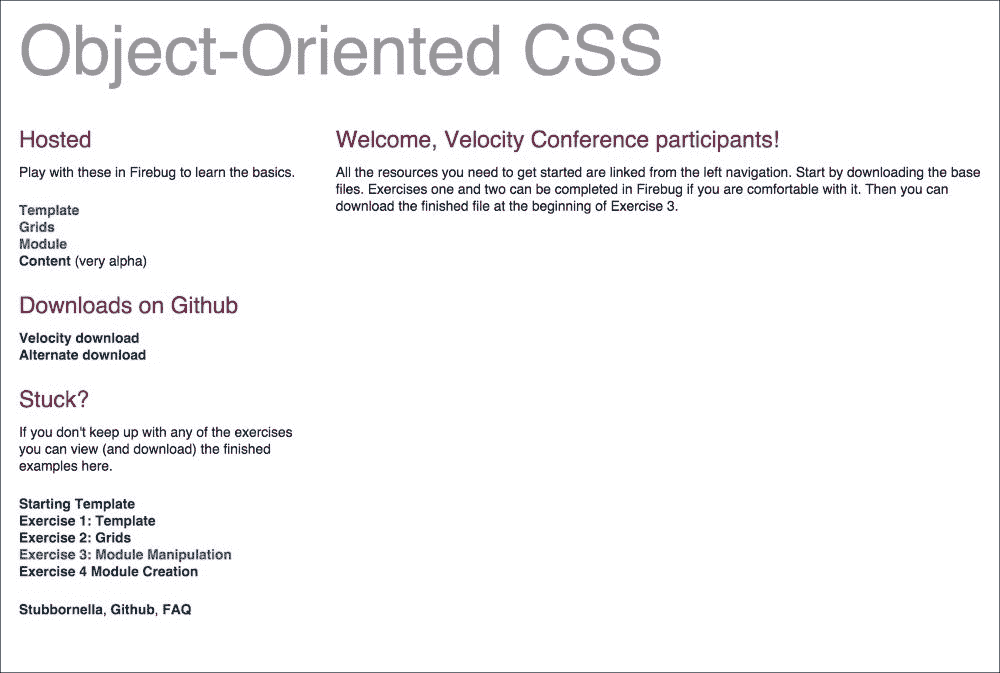
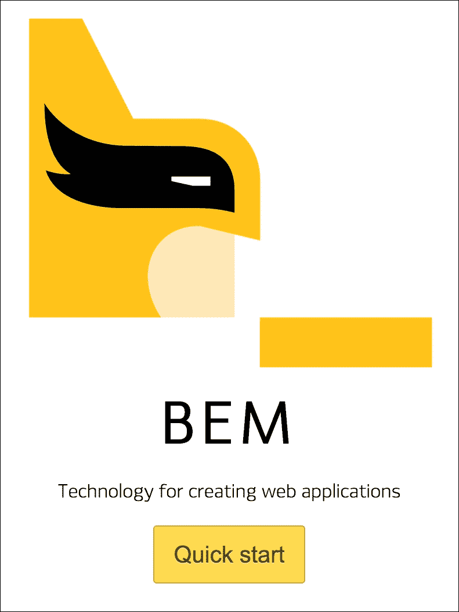

# 第十二章：可扩展性和模块化

在本章中，我们将介绍在创建模块化和可扩展代码的过程中最知名的 CSS 方法论。这是一个非常有趣的主题，因为有很多方法论。每种方法论都有其优缺点。在本章中，我们将对它们有一个基本的了解。

我们将涵盖以下主题：

+   构建可扩展和模块化的代码

+   CSS 方法论

+   SMACSS

+   BEM

+   OOCSS

+   如何选择正确的方法论？

# 构建可扩展和模块化的代码

构建良好代码的过程对每个开发者来说都是独特的。但是你如何构建易扩展的 CSS 代码？此外，这段代码需要是模块化的。

方法论中最重要的是命名约定。你可以为你的项目使用适当的方法论，但你也可以错误地使用它并附加不良的类名。你是否曾经见过类似这样的项目，其中类名和定义类似于这样的：

```css
.padding-0 {
    padding: 10px;
}
```

正如你所看到的，类名被创建为使用值`0`进行填充，但最终它的值不等于`0`。这可以是一个不良的命名约定的例子。还有更多不良使用名称的例子：

```css
.marginTop10 {
    padding-top: 50px;
}
```

方法论中的第二个重要事项是文档中类/元素的结构和嵌套级别。一些来源说，最大嵌套级别不应大于五，而其他人说三。为了可读性，代码应该具有完全平坦的结构（只有一级）。

让我们来看看流行的 CSS 方法论，学习它们的最佳特点。

# CSS 方法论

CSS 方法论的目的是使构建代码的过程更可预测和更有组织。最知名的方法论如下：

+   **可扩展和模块化的 CSS 架构**（**SMACSS**）

+   **面向对象的 CSS**（**OOCSS**）

+   **块元素修饰符**（**BEM**）

每种方法论都有不同的特点。让我们看看这些流行的方法论能提供什么。

## SMACSS

SMACSS 是由 Jonathan Snook 创建的。它更像是一个框架而不是一个方法论：


有关该项目的官方网站，请访问[`smacss.com/`](https://smacss.com/)。

SMACSS 基于以下规则：

+   基本规则

+   布局规则

+   模块规则

+   状态规则

+   主题规则

### 基本规则

基本规则与相关元素：

+   标题（`h1`-`h6`）

+   链接（`a`，`a:hover`，`a:active`）

+   表单（`form`，`input`）

所有这些规则都与 HTML 元素相关，不应该需要`!important`语句。

### 布局规则

布局规则与结构中的主要块相关，例如这些：

+   `header`

+   `footer`

+   `content`

+   `side` `menu`

+   `article`

这些元素的描述如下：

CSS：

```css
#header {
    display: inline-block;
}

#footer {
    display: inline-block;
    padding: 10px;
}
```

### 模块规则

模块规则与网站上的组件或块相关。让我们以先前为博客文章创建的结构的一个示例片段为例。在这里，我们将更好地了解如何在这种特定情况下使用 SMACSS 模块：


要在 CSS 中描述它，我们需要使用基于以下内容的选择器：

```css
.module > element / class
```

让我们为其构建一个 HTML：

```css
<article class="article">
    
    <h1>Lorem ipsum dolor sit amet, consecteur adisiciping elit</h1>
    <p> Lorem ipsum … </p>
    <a href="#">Read more</a>
</article>
```

让我们基于模块规则创建选择器：

```css
.article >img {
    /* Image in top */
}

.article > h1 {
    /* Post header */
}

.article > p {
    /* Post excerpt */
}

.article > a {
    /* Read more button */
}
```

创建所有这些是相当容易和明显的。

### 状态规则

状态规则与元素的状态相关。有许多可能的状态规则类。以下是可能的规则列表：

+   `is-collapsed`

+   `is-error`

+   `is-active`

+   `is-tab-active`

描述状态规则最简单的方法是通过一个简单的导航示例：

```css
<nav>
    <ul>
        <li class="is-active"><a href="#">Home</a>
            <ul>
                <li><a href="#">Home 1.1</a></li>
                <li><a href="#">Home 1.2</a></li>
            </ul>
        </li>
        <li><a href="#">About</a></li>
        <li><a href="#">Contact</a></li>
        <ul>
</nav>
```

要描述当前活动的菜单中的元素，可以使用类`is-active`。这种约定易于阅读，并为你提供了正确的类名的机会。

### 主题规则

主题规则与特定视图相关。例如，你创建了一个带有元素的页面：

HTML 如下：

```css
<body>
    <div class="alert">
        Alert
    </div>
</body>
```

我们最初所知道的是`.alert`是一个窗口，需要粘在浏览器上，就像一个灯箱窗口一样。

CSS（在`alert.css`中）如下：

```css
.alert {
    width: 300px;
    height: 300px;
    position: fixed;
    left: 50%;
    top: 50%;
    transform: translate(-50%, -50%);
}
```

现在我们需要为这个`.alert`（在`theme.css`中）添加一个特定的主题：

```css
.alert {
    background: red;
    color: black;
}
```

正如我们在`alert.css`中看到的，我们将静态元素的定义保留在`theme.css`中不会改变。保留在`theme.css`中的主题规则是为我们的组件进行主题设置；在这种情况下，它是一个`alert`窗口。

### SMACSS 摘要

由于以下原因，SMACSS 是一个非常好的方法：

+   它有收集主要元素定义的基本规则

+   它有描述元素状态的状态规则，使用`is-`约定

+   它在 CSS 中使用主要元素的 ID

## OOCSS

OOCSS 是由 Nicole Sullivan 发起的一个项目或方法：



访问项目的官方网站[`oocss.org/`](http://oocss.org/)获取更多信息。

OOCSS 的主要原则如下：

+   分离结构和皮肤

+   分离容器和内容

这是什么意思？让我们试着深入挖掘一下。

这意味着最好描述嵌套在另一个元素中的元素时，使用一个单独的类，而不是嵌套在容器中。当你创建这样的代码时：

```css
<div class="product">
    <h1>Name of product</h1>
    <p>Description</p>
</div>
```

你不应该基于选择器来编写你的 CSS：

```css
.product h1 {}
.product p {}
```

而不是在标记中进行小改变：

```css
<div class="product">
    <h1 class="product-name">Name of product</h1>
    <p class="product-desc">Description</p>
</div>
```

然后用选择器在 CSS 中描述它：

```css
.product-name {}
.product-desc {}
```

它让你有可能将类`.product-name`移动到 HTML 结构中的任何元素，视觉特性也会随之改变，如描述的那样。这给了你更多的灵活性和可重用的代码。

### 在我们的示例中使用 OOCSS

让我们尝试在我们的示例代码中使用 OOCSS 来描述博客文章：

```css
<article class="article">
    
    <h1 class="article-h1">Lorem ipsum dolor sit amet, consecteur adisiciping elit</h1>
    <p class="article-p"> Lorem ipsum … </p>
    <a href="#" class="article-btn">Read more</a>
</article>
```

在你的 CSS 中，它会是这样的：

```css
.article { /**/}
.article-image { /**/ }
.article-h1 { /**/ }
.article-p { /**/ }
.article-btn { /**/ }
```

### OOCSS 摘要

让我们总结一下 OOCSS：

+   你可以在 HTML 中任何地方重用类，而不需要考虑它是在哪个模块中描述的

+   这种方法非常成熟

## 块元素修饰符（BEM）

下一个方法是由 Yandex 构建的。在 BEM 方法中，每个元素都用一个类来描述。由于平面 CSS 结构，不需要嵌套。命名约定基于：



访问项目的官方网站[`en.bem.info/`](https://en.bem.info/)获取更多信息。

### 在我们的示例中使用 BEM

让我们尝试在我们的示例代码中使用 BEM 来描述博客文章：

```css
<article class="article">
    
    <h1 class="article__h1">Lorem ipsum dolor sit amet, consecteur adisiciping elit</h1>
    <p class="article__p"> Lorem ipsum … </p>
    <a href="#" class="article__btn">Read more</a>
</article>
```

现在在你的 CSS 中，它会是这样的：

```css
.article { /**/}
.article__image { /**/ }
.article__h1 { /**/ }
.article__p { /**/ }
.article__btn { /**/ }
```

### 在 SASS 中使用 BEM

在 SASS 中构建 BEM 代码不应该很难。让我们尝试描述前面代码中的代码：

```css
.article
  &__image
    /* Image in top */

  &__h1
    /* Post header */

  &__p
    /* Post paragraph */

  &__btn
    /* Post button */
```

### 如何使用修饰符？

前面的代码示例是基于 BEM 方法中的块和元素。我们如何添加`M`及其修饰符？我们什么时候可以使用它？让我们想象一下，我们有两篇文章：一篇文章左侧有一张图片，第二篇文章右侧有一张图片。使用 BEM 方法，我们可以使用一个修饰符。让我们拿上一个 CSS 代码并附加修饰符：

```css
.article { /**/}
.article__image { /**/ }
.article__h1 { /**/ }
.article__p { /**/ }
.article__btn { /**/ }

.article--imgleft { /**/}
.article--imgleft__image { /**/ }
.article--imgleft__h1 { /**/ }
.article--imgleft__p { /**/ }
.article--imgleft__btn { /**/ }
```

正如我们所看到的，修饰符被定义为`imgleft`，并使用两个破折号添加到块中。修饰符可以帮助你避免为新块创建新代码。它可以像在 CSS 中实现的装饰器一样工作。

# 你应该使用哪种方法？

这是一个非常好的问题。毫无疑问，你需要使用适合你的方法。但哪一种适合？最好的 CSS 方法是可以轻松调试的方法。什么时候呢？毫无疑问，当你不需要深入挖掘时，比如，一个元素有 10 条规则。在 CSS 中最好的可读性是当规则严格与页面上的元素相关联时。

# 也许是你自己的方法？

是的！如果你想为你的项目创建一些新的东西，创建你自己的方法。但是，不要重复造轮子，也不要试图重命名已知的方法来构建你自己的方法。对这三种方法的深入理解可能是你创建一个符合你要求的小型未命名混搭的关键。

# 摘要

现在应该更容易选择适合您的代码/项目的正确方法论了。在本章中，我们熟悉了 CSS 方法论，并试图定义它们的方法。最重要的是要理解它们，并知道如何将它们应用到您的代码中。这在调试其他代码的过程中可能会有用。

在下一章中，我们将专注于 CSS 代码优化。我们将使用`Gulp.js`来准备您的代码进行测试和最终优化项目。
