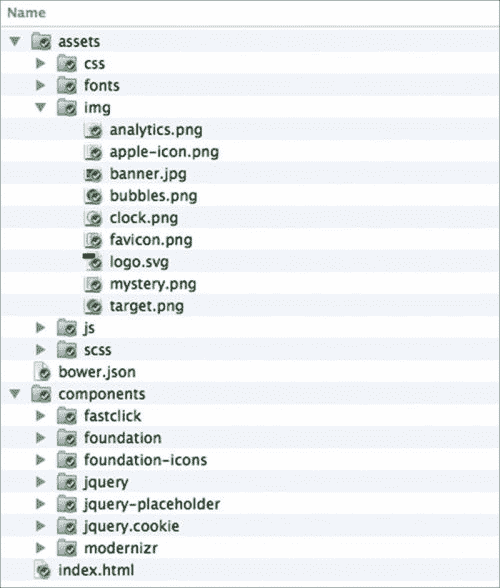
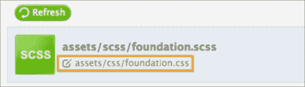
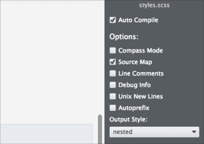
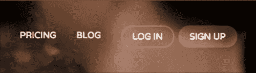
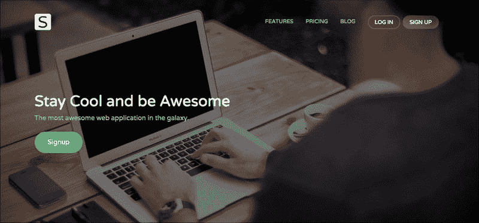

# 八、扩展 Foundation

*在上一章构建网站页面标记后，我们现在开始给网站一个外观、感觉和颜色。 这次我们将使用**Sassy CSS**(**SCSS**)，这也是 Foundation 默认样式的底层语法。 【5】*

*SCSS 是名为 Sass 的 CSS 预处理器的语法变体。 Sass 的原始语法使用了缩进格式，使代码看起来整洁。 另一方面，SCSS 像常规 CSS 一样使用大括号和分号。 这种相似性有助于每个人快速掌握语法，特别是那些新接触 Sass 的人。*

*既然我们要使用 SCSS，我们将通过带领你通过几个 Sass 特性和它的实用程序开始本章。 您将学习定义变量和函数，执行操作，并遵守其他指令，这允许我们更有效地组成网站风格规则。*

这听起来很有挑战性。 如果你喜欢挑战，我们可以马上开始。

本章将围绕以下主题展开:

*   探索 Sass 特性并学习语法
*   看看波旁威士忌，一个萨斯 mixins 图书馆
*   组织样式表结构并使用 Import 指令包含部分样式表
*   设置考拉，将 SCSS 编译为 CSS
*   通过变量定制 Foundation 的默认样式
*   组成网站自定义风格
*   根据不同的视口尺寸优化网站布局
*   通过编译 javascript 脚本使网站运行

# 语法上令人敬畏的样式表

Sass([http://sass-lang.com/](http://sass-lang.com/))是由 Hampton Catlin、Natalie Weizenbaum 和 Chris Eppstein 创建的 CSS 预处理器，该团队还创建了 Haml([http://haml.info/](http://haml.info/))。 Foundation，正如本章开头提到的，使用 Sass 来生成它的 CSS，我们也会这样做。 因此，在我们动手之前，首先我们将深入研究几个 Sass 特性，如嵌套、变量、mixins、函数等，这些特性将允许我们更有效地编写样式规则。

## 嵌套规则

Sass 允许我们将嵌套样式规则到另一个规则中。 这个特性最终允许我们编写类似于网页 HTML 结构的样式规则。 这样，样式规则可以更简洁，更容易浏览。 比如，我们添加了我们网站的标题标记，如下所示:

```html
<header>
  <h1><a href="#">Website</a></h1>
</header>
```

使用 Sass，我们可以构建风格规则，如下所示:

```html
header {
  background: #000;
  h1 {
    margin: 0;
    a {
      color: #fff;
    }
  }
}
```

值得注意的是，即使 Sass 允许嵌套样式规则，也不应该滥用此功能。 所以，不要做如下代码:

```html
body {
  nav {
    ul {
      li {
        a {
          &:before {

          }
        }
      }
    }
  }
}
```

在嵌套样式规则之前考虑它。 这个特性的主要目标是使样式规则看起来更简单、更简洁、更容易浏览，而不是不必要地使它看起来更复杂。

## 存储带有变量的值

在编程语言中，变量是一个有用的部分，它允许我们在指定的名称中定义一次值。 每种语言声明变量的方式略有不同。 例如，JavaScript 使用关键字`var`，LESS 使用`@`，在本例中 Sass 使用`$`符号。

一个非常适合变量的实现是定义网站的颜色，例如:

```html
$primary: #000;	
$secondary: #bdc3c7;
$tertiary: #2ecc71;
$quaternary: #2980b9;
$quinary: #e67e22;
```

因此，与每次需要时声明颜色值不同，我们可以简单地声明代表性变量。 在下面的例子中，我们声明`$primary`作为主体文本的颜色，`$secondary`作为背景色:

```html
body {
  background-color: $secondary;
  color: $primary;
}
```

当编译为常规 CSS 时，这些变量被替换为定义值，如下所示:

```html
body {
  background-color: #bdc3c7;
  color: #000;}
```

使用一个有正确名称的变量(当然)，你会发现写变量比记住十六进制或 RGB 数字更容易; 嗯，实际上写`$primary`比写`#bdc3c7`更容易，不是吗?

Sass 变量并不专门用于定义颜色。 我们还可以使用变量来定义字符串或纯文本，如下所示:

```html
$var: "Hello World";
$body-font-family: "Helvetica Neue";
```

我们可以使用变量来存储一个数字或一个长度:

```html
$number: 9;
$global-radius: 3px;
```

我们可以用一个变量继承另一个变量的值:

```html
$var: $anotherVar;
$header-font-family: $body-font-family;
```

我们可以使用变量来定义函数的输出:

```html
$h1-font-size: rem-calc(44);
```

Foundation 将其主要变量的声明集中在一个名为`_settings.scss`的文件中。 我们将进一步研究这个问题，当我们稍后组成网站风格规则。

### 变量插值

在某些情况下，变量不适用，例如将其插入字符串(纯文本)中，如下所示:

```html
$var: "Hello";
$newVar: "$var World";
div {
  content: $newVar;
}
```

编译时，`$newVar`中的`$var`声明不会被`"Hello"`的值所取代。 这是因为 Sass 将`$var`解释为字符串或纯文本。 因此，以下示例的输出将是:

```html
div {
  content: "$var World";
}
```

另一个变量不起作用的例子是当声明以`@`规则或指令开始时，如下所示:

```html
$screen-size: (max-width: 600px);
@media $screen-size {
  div {
    display: none;
  } 
}
```

这个例子只是向 Sass 编译器返回一个错误，因为`@media`后面应该是`print`或`screen`关键字。

在少数情况下，我们必须使用来声明一个变量。 变量插值也发生在其他编程语言中，如 PHP、Ruby 和 Swift。 但我不会深入讨论它工作的技术细节，因为我也不完全知道。 简单地说，插值允许我们在不允许变量工作的情况下嵌入一个变量——尤其是在它是一个字符串的情况下。

每种编程语言都有自己的表示法来实现插值。 在本例中，Sass 使用`#{}`。 给出前面的一个例子，我们可以这样写变量:

```html
$var: "Hello";
$newVar: "#{$var} World";
div {
  content: $newVar;
}
```

结果如下:

```html
div {
  content: "Hello World";
}
```

### 注意事项

请关注 HugoGiraudel 的帖子([https://webdesign.tutsplus.com/tutorials/all-you-ever-need-to-know-about-sass-interpolation--cms-21375](https://webdesign.tutsplus.com/tutorials/all-you-ever-need-to-know-about-sass-interpolation--cms-21375))，以获得关于 Sass 中变量插值的进一步帮助。

## 使用 mixins 的可重用代码块

现在，我们将查看 Sass mixins。 如果您遵循并完成了第二个项目，那么您应该了解 LESS mixins。 混合，在 Sass 和 LESS 中，有相似的目的; 它们允许开发人员在整个样式表中重用代码块和样式规则，从而符合[http://programmer.97things.oreilly.com/wiki/index.php/Don't_Repeat_Yourself](http://programmer.97things.oreilly.com/wiki/index.php/Don't_Repeat_Yourself)的 DRY 原则。 然而，在声明和重用 mixin 的方式方面，它略有不同。 下面是在 LESS 中声明 mixin 的方法:

```html
.buttons { 
  color: @link-color;
  font-weight: normal;
  border-radius: 0; 
}
```

在 Sass 中，我们使用`@mixins`指令创建一个 mixin，例如:

```html
$linkColor: $tertiary;
@mixin buttons { 
  color: $linkColor;
  font-weight: normal;
  border-radius: 0; 
}
```

Sass 使用`@include`指令在样式规则中重用前面的代码块。 对于前面的例子，我们可以这样写:

```html
.button {
   @include buttons;
}
```

下面是将上述示例编译为 CSS 时的输出:

```html
.button {
  color: #2ecc71;
  font-weight: normal;
  border-radius: 0;
}
```

这是 Sass mixins 应用的一个基本示例。

### Sass mixin 库简介

一些 CSS3 语法非常复杂，以至于编写它们可能是一项非常乏味的工作。 这就是 mixins 特别有用的地方。 幸运的是，由于 Sass 如此流行并得到了如此多慷慨的开发者的支持，我们不需要自己将所有的 CSS3 语法移植到 Sass mixins 中。 相反，我们可以简单地使用 Sass 的 mixin 库，使我们作为一个 web 开发人员的工作更加愉快。

Sass 库提供了一个有用的 mixins 和函数集合(我们将很快讨论函数)，我们可以立即使用它们。 有几十个流行的库可供使用，其中我们将在这里使用的一个名为 Bourbon([http://bourbon.io/](http://bourbon.io/))。

Bourbon 在一个库中编译了许多 mixin，简化了我们声明 CSS3 语法的方式，包括仍然标记为实验性的语法，如`image-rendering`、`filter`和 CSS3`calc`函数。 现在，当指定 Hi-DPI 媒体查询时，你认为哪一种写起来更容易、更快?

### 注意事项

Hi-DPI Media Query (T0)用于测量设备像素密度，因此我们可以使用它在网页上提供更高分辨率的图形，特别是在高清晰度屏幕上的设备上。 以下是有关这个主题的一些参考资料。

*   Boris Smus 的可变像素密度的高 DPI 图像([http://www.html5rocks.com/en/mobile/high-dpi/](http://www.html5rocks.com/en/mobile/high-dpi/))。
*   Reda Lemeden 的《走向视网膜网》([http://www.smashingmagazine.com/2012/08/20/towards-retina-web/](http://www.smashingmagazine.com/2012/08/20/towards-retina-web/))。

以下是标准语法吗?

```html
@media only screen and (-webkit-min-device-pixel-ratio: 2),
only screen and (min--moz-device-pixel-ratio: 2),
only screen and (-o-min-device-pixel-ratio: 2 / 1),
only screen and (min-resolution: 192dpi),
only screen and (min-resolution: 2dppx) {
  width: 500px;
}
```

还是下一款加波旁混合酒? ：

```html
@include hidpi(2) {
  width: 500px;
}
```

无需花费数年的研究，我们通常会同意使用 mixin 应该更容易编写，也更容易记忆。

### 注意事项

如前所述，除了 CSS3 mixins, Bourbon 还附带了两个 Sass 函数，比如 Triangle，它允许我们创建基于 css 的三角形。 然而，我不打算提及所有在波旁图书馆的 bits。 由于库集很可能会随着新的 CSS 规范的引入而更新或修订，因此最好参考官方文档页面上的列表([http://bourbon.io/docs/](http://bourbon.io/docs/))。

## 创建和使用 Sass 函数

函数是特性的一个片段，它使样式规则的创建更加动态。 Sass 中的函数是使用`@function`指令声明的，然后在后面跟着函数名，这是一个带有默认值的参数。 Sass 函数最简单的形式如下:

```html
@function color($parameter: green) {

}
```

然而，这个函数还不会输出任何东西。 要生成这个函数的结果，我们需要添加一个`@return`值。 对于前面的示例，我们希望输出默认值参数，即`"hello"`。 为此，我们写出`@return`值，然后再写`$parameter`，如下所示:

```html
@function color($parameter: green) {
  @return $parameter;
}
```

在选择器中使用这个函数，如下所示:

```html
@function name($parameter: green) {
  @return $parameter;
}
.selector {
  color: name();
}
```

编译它，你会得到以下输出:

```html
.selector {
  color: green;
}
```

通过在默认值之外指定一个新值来定制输出，如下所示:

```html
.selector {
  color: name(yellow);
}
```

我们将得到一个新的输出，如下所示:

```html
.selector {
  color: yellow;
}
```

### 注意事项

这个例子仅仅展示了一个函数的基本功能。 关于如何在实际情况中使用它来构建可重用的代码系列，还有很多例子。 因此，我建议您阅读下面的参考资料进行更深入的讨论，并找到更多的例子。

使用纯的 Sass 函数使可重用逻辑更加有用([http://thesassway.com/advanced/pure-sass-functions](http://thesassway.com/advanced/pure-sass-functions))。

两个 Sass 函数([http://hugogiraudel.com/2013/08/12/sass-functions/](http://hugogiraudel.com/2013/08/12/sass-functions/))。

## 使用 Sass 函数操作颜色

我喜欢使用 CSS 预处理器(如 Sass)的一点是，它可以很容易地确定和改变颜色。 在这种情况下，Sass 提供了一系列内置函数来无缝地操纵颜色。 以下是一些 Sass 颜色函数的列表，供您参考，这可能对以后在网站上操作颜色有用:

<colgroup class="calibre17"><col class="calibre18"> <col class="calibre18"> <col class="calibre18"></colgroup> 
| 

功能

 | 

描述

 | 

例子

 |
| --- | --- | --- |
| `lighten($color, $amount)` | 将颜色调亮指定的量。 | `$black: #000000``lighten($black, 10%);`在这个的例子中，我们将`$black`减轻 10%。 输出为`#1a1a1a`。 |
| `darken($color, $amount)` | 将一个颜色变得比指定的颜色深。 | `$white: #ffffff;``darken($white, 10%)`在这个例子中，我们将`$white`变暗 10%。 输出为`#e6e6e6`。 |
| `fade-out($color, $amount)` | 使颜色变得比指定的数量更透明。 | `$black: #000000;``fade-out($black, .5);`在这个的例子中，我们将`$black`颜色编译为 RGB 格式，并将透明度设置为 50%。 输出为`rgba(0, 0, 0, 0.5)`。 |

### 注意事项

请参照 Sass 官方文件([http://sass-lang.com/documentation/Sass/Script/Functions.html](http://sass-lang.com/documentation/Sass/Script/Functions.html))查找可提供的颜色功能的完整列表。

## 实用 Foundation 自身功能

Foundation 框架自带了一组自己的函数。 Foundation 使用这些函数来构建自己的默认样式，我们也可以使用它们来构建自己的默认样式。 其中一个有用的函数是`rem-calc()`，它使我们能够更轻松地计算`rem`单位。

### in and Rem

`rem`是一个相对的值，继承了与`em`相似的概念。 以下是 Ian Yates 在他的文章([https://webdesign.tutsplus.com/articles/taking-the-erm-out-of-ems--webdesign-12321](https://webdesign.tutsplus.com/articles/taking-the-erm-out-of-ems--webdesign-12321)中对中的起源的阐述:

> Ems 的名字来源于印刷。 这个术语首次使用的确切时间尚不清楚，但由于大写字母 M(发音 emm)与放置字母的方形印版最为接近，因此这种测量方法也以 M 命名。 不管问题中的字体的点大小是多少，大写的 M 块将定义 Em。”

但正如 JonathanSnook 在他的文章([http://snook.ca/archives/html_and_css/font-size-with-rem](http://snook.ca/archives/html_and_css/font-size-with-rem))中所描述的，`em`单元的问题在于它的复合性质。 由于大小与其最近的父类相关，根据我的经验，输出的大小最多只能是令人沮丧的; 大小将根据指定的位置而变化。 检查以下示例:

```html
body {
    font-size:16px;
}
div {
    font-size: 1.2em; /* 19px */
} 
ul { 
    font-size: 1em; /* 19px */
}
ul li { 
    font-size: 1.2em; /* 23px */
}
```

这时就要用到`rem`单元了。 `rem`单元直接根据 HTML 文档的根元素`<html>`的字体大小来度量计算——因此，它也被称为根`em`。 无论在哪里指定单元，结果都将是精确的、一致的，而且更重要的是，易于计算(它类似于`px`单元，但它是相对的)。

函数同时接受整数和长度。 因此，下面的代码示例可以工作:

```html
div {
  font-size: rem-calc(12); 
}
span {
  font-size: rem-calc(10px); 
}
p {
  font-size: rem-calc(11em); 
}
```

在这种情况下，结果如下:

```html
div {
  font-size: 0.75rem;
}
span {
  font-size: 0.625rem;
}
p {
  font-size: 0.6875rem;
}
```

## 有一个英雄-潜入萨斯

关于 Sass 还有很多我们无法在本模块中介绍的内容，比如占位符、条件语句和操作符，这只是其中的一些。 值得庆幸的是，有足够多的好的参考文献和书籍涵盖了 Sass，以及更深入的支持它的实用程序，您可以自己深入挖掘。 以下是我的一些最好的建议:

*   *Sass and Compass for Designers*，*Ben Frain*，*Packt Publishing*([https://www.packtpub.com/web-development/sass-and-compass-designers](https://www.packtpub.com/web-development/sass-and-compass-designers))
*   *Sass for Web designer*，*Dan Cederholm*，*A Book Apart*([http://www.abookapart.com/products/sass-for-web-designers](http://www.abookapart.com/products/sass-for-web-designers))
*   Sass way -教程和使用 Sass 的技巧([http://thesassway.com/](http://thesassway.com/))
*   一个专门的网页设计教程和涵盖任何与 Sass 相关的类别([https://webdesign.tutsplus.com/categories/sass](https://webdesign.tutsplus.com/categories/sass))

在我们继续之前，让我们以几个小测验来结束这一部分，好吗?

## Pop quiz - Sass 函数中的多个参数

在上一节中，我们讨论了 Sass 函数，并向您展示了其中最简单的示例。 在本例中，我们创建了一个只有一个参数的函数。 事实上，我们可以在一个 Sass 函数中添加多个参数。

Q1。 那么，下面哪个例子是创建具有多个参数的函数的正确方法呢?

1.  每个参数用分号分隔。

    ```html
    @function name($a:1px; $b:2px){ 
    @return $a + $b
    }
    ```

2.  每个参数用加法运算符分隔。

    ```html
    @function name($a:2px + $b:2px){ 
    @return $a + $b
    }
    ```

3.  每个参数用逗号分隔。

    ```html
    @function name($a:1px, $b:2px){ 
    @return $a + $b
    }
    ```

## 突击测验- Sass 颜色操作

Q1。 有很多内置的 Sass 函数。 在这一节中，我们命名了三个，`lighten()`，`darken()`，`fade-out()`，我认为这三个已经足够帮助我们装饰这个项目的网站了。 `fade-out()`函数有一个别名，它也会给出相同的结果。 那么，下面哪一个是淡出()函数的别名?

1.  `transparentize($color, $amount)`
2.  `transparency($color, $amount)`
3.  `transparent($color, $amount)`

# 项目概述

在[第七章](7.html#1T1401-db71610abfe249d1a7f65c5cb7ebb0eb "Chapter 7. A Responsive Website for Business with Foundation"),*响应网站业务基础,我们安装基础和基础图标,以及它们的依赖项(jQuery, Fastclick Modernizr,等等)通过鲍尔(http://bower.io/)。 我们还准备了网站资产，即图片、图像图标和网站 logo。 在本章的最后一节中，我们为网站主页创建了`index.html`，并且我们还使用一些新的 HTML5 标签构建了标记。 因此，当前在工作目录中的文件和文件夹如下截图所示:*

 *

# 样式表组织

在我们的工作目录中仍然缺少的文件是组成网站自定义样式的样式表，以及我们在前一节中简要提到的为我们提供一些现成的 mixins 和函数的 Bourbon 库。 这就是我们在这一节要做的。 我们将创建样式表，并以一种使它们在未来易于维护的方式组织它们。

好吧，让我们继续工作。

# 是时候组织和编译样式表了

执行以下步骤直到最后，以正确地组织样式表并将其编译为 CSS。

1.  We need to install Bourbon. Launch a terminal or the command prompt, and type the following command:

    ```html
    bower install bourbon --save

    ```

    这个命令通过 Bower 注册表安装 Bourbon 包，并将其注册到项目的`bower.json`文件中。

    ### 提示

    我已经在这篇文章中专门讨论了`bower.json`文件([https://webdesign.tutsplus.com/tutorials/quick-tip-what-to-do-when-you-encounter-a-bower-file--cms-21162](https://webdesign.tutsplus.com/tutorials/quick-tip-what-to-do-when-you-encounter-a-bower-file--cms-21162))，看看吧!

2.  在`scss`文件夹中创建名为`main.scss`、`responsive.scss`和`styles.scss`的新样式表。
3.  The `_main.scss` style sheet is the one where we will put all our own style rules. We will use the `_responsive.scss` file to exclusively put in the media queries of the website. And the `styles.scss` file is where we will compile those style sheets together.

    ### 提示

    文件名开头的下划线`_`是一种特殊的符号，它告诉 Sass 编译器不要直接编译该文件。

4.  仍然在`scss`文件夹中，再创建两个样式表。 这一次，将它们命名为`_config.scss`和`foundation.scss`。
5.  `_config.scss`将包含 Foundation 中使用的所有变量的副本，而`foundation.scss`将包含导入的 Foundation 样式表的部分内容。 这些副本将阻止我们直接修改原始文件，当我们更新到最新版本时，原始文件最终将被覆盖。
6.  接下来，将 Foundation`_settings.scss`文件的全部内容复制到我们最近创建的`_config.scss`文件中。 在本例中，`_settings.scss`文件位于`/components/foundation/scss/foundation/`目录中。
7.  另外，复制 Foundation 自己的`foundation.scss`的全部内容，粘贴到我们最近创建的`foundation.scss`上。
8.  Then, we need to correct the path of the imported partials in our `foundation.scss` file. At this stage, all paths are pointing to the `foundation` folder, as follows:

    ```html
    @import "foundation/components/grid";
    @import "foundation/components/accordion";
    @import "foundation/components/alert-boxes";
    ... /* other imports */
    ```

    这当然是不正确的，因为在`scss`文件夹中没有名为`foundation`的文件夹。 在这里，我们需要将路径指向`components`文件夹，而不是偏导数实际驻留的地方。 因此，将路径改为如下:

    ```html
    @import "../../components/foundation/scss/foundation/components/grid";
    @import "../../components/foundation/scss/foundation/components/accordion";
    @import "../../components/foundation/scss/foundation/components/alert-boxes";
    ... /* other imports */
    ```

    ### 提示

    可以在 Gist([http://git.io/ldITag](http://git.io/ldITag))中找到 Foundation 部分参考文献的全面片段。

    ### 注意事项

    在 Sass 中，当导入外部文件时，我们不需要指定`.scss`或`.sass`扩展名。 Sass 编译器足够聪明，可以自己确定扩展。 这也是因为纯 CSS 也是有效的 Sass。

9.  我们必须纠正的另一个路径是指向 Foundation 的路径`_functions.scss`，它包含`rem-calc()`函数。 打开`_config.scss`文件，将行`@import "foundation/functions";`更改为`@import "../../components/foundation/scss/foundation/functions";`。
10.  We are going to compile these style sheets into CSS using Koala. Launch Koala and add the working directory:

    

11.  在 Koala 的样式列表中，您不会找到带有下划线前缀的 SCSS 样式表。 考拉，默认情况下，忽略这个文件，因为它最终不会被编译成 CSS。
12.  However, you should find the two primary style sheets of the project listed therein, namely, `styles.scss` and `foundation.scss`. Be sure that this output is set to the `css` folder, as shown in the following screenshot:

    

13.  Then, make sure that the option of `Auto Compile` is checked so that they will be automatically compiled into CSS, as we've made changes. Also, check the `Source Map` option to make debugging the style sheet easier. Have a look at the following screenshot:

    

14.  点击`styles.scss`、`foundation.scss`的**Compile**按钮，将其编译为 CSS。
15.  在`<head>`标签中打开`index.html`并链接两个已编译的 css，如下所示:

## *刚才发生了什么?*

我们刚刚安装了波旁威士忌，并将几个新的样式表放在一起来设计网站。 然后，我们将它们编译成 CSS，然后链接到`index.html`。 因此，正如你在下面的截图中看到的，网站现在开始发生-与 Foundation 默认样式:


# 网站的外观和感觉

随着样式表的组织和编译，现在是时候定制网站的样式了。 碰巧的是，我们不需要自己编写所有的风格规则。 在这种情况下，由于我们使用的是一个框架(Foundation)，有时自定义网站样式可以像在一个变量中改变默认值一样容易。

废话少说，让我们继续。

# 行动时间-建立在网站上

网站的样式将涉及多个样式表。 因此，请仔细遵循以下步骤:

1.  Import the following style sheets in `foundation.scss`:

    ```html
    @import "config";
    @import "../../components/foundation/scss/normalize";
    @import "../../components/foundation-icons/foundation_icons_social/sass/social_foundicons.scss";
    ... /* other partials */
    ```

    这样，变量以及`_config.scss`中的更改将通过 Foundation 影响其他组件样式表。 变量`normalize`将标准化基本元素样式，`social_foundicons.scss`; 正如你所猜到的，这让我们可以应用 Foundation 的社会图标。

2.  打开`styles.scss`，导入波本威士忌、`_config.scss`、`main.scss`、`responsive.scss`，如下:
3.  然后，我想应用来自谷歌 font 的自定义字体，因为自定义字体看起来比一般的字体系统更好，比如 Arial 或 Times。 在这里，我选择了一个名为 Varela Round([https://www.google.com/fonts/specimen/Varela+Round](https://www.google.com/fonts/specimen/Varela+Round))的字体。
4.  打开`index.html`，在`<head>`标签中添加字体样式表，如下所示:
5.  现在，我们将更改当前指定为 Foundation 默认字体的`font-family`堆栈，以使用 Varela Round。
6.  To do so, open `_config.scss`, uncomment the variable named `$body-font-family`, and insert `"Varela Round"`, as follows:

    ```html
    $body-font-family: "Varela Round", "Helvetica Neue", "Helvetica", Helvetica, Arial, sans-serif;
    ```

    ### 提示

    **Sass comments**

    通常，注释会导致代码编译器或引擎忽略代码，就像浏览器一样。 然而，它也经常用作内联文档，解释代码的作用。

    每种编程语言都有自己的代码注释方式。 在 CSS 中，它将是这样的:

    ```html
    /* .property { content: ""' }*/
    ```

    在 Sass 中，我们可以使用 CSS 的方式，如上所示，也可以添加`//`，如下所示:

    ```html
    // .property { content: ""' }
    ```

    当在行首添加`//`时，编译器将完全忽略这一行，因此不会编译它。

7.  We will style each of the website sections. To begin with, we will focus on the website header, and then, subsequently down to the footer. Let's start off by adding an image background. Open `_main.scss` and then add the following lines:

    ```html
    .startup-header {
      background: url('img/banner.jpg') no-repeat center center fixed;
      background-size: cover;
    } 
    ```

    ### 注意事项

    **CSS3 背景尺寸**

    背景大小是一个特殊的 CSS3 属性，用于控制背景拉伸。 我们在前面的片段中使用的封面的值将按比例拉伸背景图像以完全覆盖容器。 请参阅，以进一步了解 CSS3 背景尺寸:

    *   CSS 背景和边框模块级别 3([http://www.w3.org/TR/css3-background/#the-background-size](http://www.w3.org/TR/css3-background/#the-background-size))
    *   *Perfect Full Page Background Image*by Chris Coyier([http://css-tricks.com/perfect-full-page-background-image/](http://css-tricks.com/perfect-full-page-background-image/))
    *   我可以使用 CSS3 背景大小吗? [http://caniuse.com/#feat=background-img-opts](http://caniuse.com/#feat=background-img-opts)

    隐藏图像,然而,目前的背景颜色,适用于 Foundation 的高级酒吧和一段命名为小组([http://foundation.zurb.com/docs/components/panels.html),如下截图所示:](http://foundation.zurb.com/docs/components/panels.html)

    

8.  Remove these background colors so that we can see through the background image. To do so, open the `_config.scss` file and uncomment the following lines:

    ```html
    $topbar-bg-color: #333;
    $topbar-bg: $topbar-bg-color;
    ```

    将变量`$topbar-bg-color`的值从`#333`更改为`transparent`

    ```html
    $topbar-bg: transparent;
    ```

9.  Uncomment this following line, which specifies the panel's background color:

    ```html
    $panel-bg: scale-color($white, $lightness: -5%);
    ```

    然后，将值也更改为`transparent`:

    ```html
    $panel-bg: transparent;
    ```

    现在，我们可以看到背景图片，如下截图所示:

    

10.  从前面的截图中，很明显，顶部栏和面板的背景颜色已经被删除，但一些菜单项仍然有它。
11.  Let's remove these background colors. In `_config.scss`, uncomment the following line:

    ```html
    $topbar-dropdown-bg: #333;
    ```

    并将值更改为使用`$topbar-bg`变量的值，如下所示:

    ```html
    $topbar-dropdown-bg: $topbar-bg;
    ```

12.  Save it and let a few seconds pass for the files to be compiled, and you should see now that the background color of those menu items are removed, as shown in the following screenshot:

    

13.  Add `padding-top` to give more distance between the top bar and the upper boundary of the browser viewport:

    ```html
    .startup-header {
    ...
      .startup-top-bar {
        padding-top: rem-calc(30);
      }
    }
    ```

    现在，你可以看到，这里更宽了:

    

    图像的左半部分是在我们添加填充顶部之前，而右半部分肯定是在我们添加填充顶部之后。

14.  给更多的填充物在顶部和底部的面板部分; 因此，我们可以看到更多的背景图像。 将样式规则嵌套在`.startup-header`下，如下所示:
15.  Add the logo image, as follows:

    ```html
    .startup-name {
      max-width: 60px;
      a {
        text-indent: 100%;
        white-space: nowrap;
        overflow: hidden;
        background: url('img/logo.svg') no-repeat center left;
        background-size: auto 90%;
        opacity: 0.9;
      }
    }
    ```

    现在我们添加了 logo，如下:

    

16.  Hover over the menu links in the top bar, and you will find it with a dark background color, as follows:

    

    这个背景颜色对整个网站的审美来说不太合适，所以让我们去掉它。 在`_config.scss`中，取消以下行注释:

    ```html
    $topbar-link-bg-hover: #272727;
    ```

    然后，通过继承`$topbar-bg`变量的值，将该值更改为 transparent，如下所示:

    ```html
    $topbar-link-bg-hover: $topbar-bg;
    ```

17.  将菜单链接转到大写，使其看起来稍大一些。 将`_config.scss`中名为`$topbar-link-text-transform`的变量从 none 设置为`uppercase`:

    ```html
    $topbar-link-text-transform: uppercase;
    ```

18.  The next thing we will do is change the styles of the two buttons: `Login` and `Sign Up`. We will make it just a little bit more fashionable, and the following are all the new styles for these buttons; nest these lines under the `.startup-header`:

    ```html
    .startup-header {
    ...
    .startup-top-bar {
      padding-top: rem-calc(30);
        ul {
    $color: fade-out(#fff, 0.8);
    $color-hover: fade-out(#fff, 0.5);
        background-color: transparent;
        .button {
    @include transition (border 300ms ease-out, background-color 300ms ease-out);
        }
        .log-in {
      padding-right: 0;
          > .button {
            background-color: transparent;
            border: 2px solid $color;
            color: #fff;
            &:hover {
          background-color: transparent;
          border: 2px solid $color-hover;
          color: #fff;
            }
          }
        }
        .sign-up {
          > .button {
          background-color: $color;
          border: 2px solid transparent;
          color: #fff;
          &:hover {
            background-color: $color-hover;
            border: 2px solid transparent;
          }
        }
         }
       }
      } 
    }
    ```

    现在，按钮应该如下面的截图所示。 悬停在按钮上，你会看到我们通过`transition()`混合波本威士忌添加的漂亮的小过渡效果:

    

    然而，值得注意的是，我认为这仅仅是一种装饰。 您可以自定义按钮样式。

19.  在透明背景上有按钮，让我们在左侧制作三个菜单链接项，即**PRICES**、**PRICING**和**BLOG**，也稍微透明一些。 为此，取消注释并将`_config.scss`中的变量`$topbar-link-color`更改为`fade-out(#fff, 0.3)`，如下所示:
20.  然后，让我们给链接一个过渡效果。 在`_main.scss`中添加以下行:
21.  Next, we will add a dark transparent layer on the header. By adding this dark layer, the text in the header can be more distinct over the background image.

    在`_main.scss`中添加以下几行:

    ```html
    .startup-header {
    ...
      .startup-top-bar,
     .startup-hero {
     background-color: fade-out(#000, 0.5);
     }
    }
    ```

22.  Add the following lines as our last touch for the header section:

    ```html
    .startup-header {
    ...
      .startup-hero {
        padding-top: rem-calc(150px);
        padding-bottom: rem-calc(150px);
        .hero-lead {
     color: darken(#fff, 30%);
     }
      }
    ...
    }
    ```

    现在，我们有了一个不错的网站标题，正如你在下面的截图中看到的:

    

23.  With the website styled, we will move to the next section. Below the header, we have the feature section that contains a number of key features of our products and services. And these are all the styles for the feature section:

    ```html
    ...
    .startup-features {
      padding: rem-calc(90 0);
      figure {
        margin: 0;
      }
      .columns {
        margin-bottom: rem-calc(15);
      }
    }
    ```

    在前面的代码片段中，我们从包装图像图标的 figure 元素中删除了边距。 这将给图像图标图形更多的空间来跨越，正如你在下面的截图中看到的:

    

    除此之外，`margin-bottom`，以及与之结合的填充，只会给这一节更多的空白。

24.  在特征部分下面，我们有展示快乐顾客说话的部分。 我们称它为见证部分。 添加以下样式规则来构建它:

    ```html
    .startup-testimonial {
      padding: rem-calc(90 0);
      text-align: center;
      background-color: darken(#fff, 2%);
      blockquote {
        font-size: rem-calc(24);
      }
      figure {
        margin-top: 0;
        margin-bottom: 0;
        .avatar {
          border-radius: 50%;
          display: inline-block;
          width: 64px;
        }
      }
      figcaption {
        margin-top: rem-calc(20);
        color: darken(#fff, 30%);;
      }
    }
    ```

25.  Also, remove the `blockquote` element's left-hand side border by changing the value of `$blockquote-border` in `_config.scss`, as follows:

    ```html
    $blockquote-border: 0 solid #ddd;
    ```

    注意，前面的样式仅仅是装饰。 在这个阶段，这是评价部分的样子:

    

    别慌，它没坏。 其余的样式将通过轨道滑块插件添加，一旦它被启用。 我们很快就会看到这些步骤。

26.  接下来，我们将设计价格和规划表。 这些都是桌子价格的所有样式，它们的主要目的是给每个桌子一个独特的颜色。

    ```html
    .startup-pricing {
      $basic-bg      : #85c1d0;
      $team-bg       : #9489a3;
      $enterprise-bg : #d04040;

      padding-top: rem-calc(120);
      padding-bottom: rem-calc(120);
      .pricing-table {
        background-color: darken(#fff, 2%);
      }
      .pricing-basic {
        .title {
          background-color: $basic-bg;
        }
        .price {
          background-color: lighten($basic-bg, 25%);
        }
      }
      .pricing-team {
        .title {
          background-color: $team-bg;
        }
        .price {
          background-color: lighten($team-bg, 25%);
        }
      }
      .pricing-enterprise {
      .title {
          background-color: $enterprise-bg;
        }
        .price {
          background-color: lighten($enterprise-bg, 25%);
        }
       }
    }
    ```

27.  页脚部分是简单而直接的。 没有什么突出。 这里有一堆样式规则来让页脚看起来更好看，如下:

## *刚才发生了什么?*

在本节中，我们重点关注网站的外观。 我们只是添加了样式，最终使网站从页眉到页脚看起来更漂亮。 然而，有一些东西在这个阶段是不可行的，比如 Orbit，我们还需要测试网站在较小的视口尺寸下的效果。 这就是我们下一节要讲的内容。 这是网站现在应该如何看待这个阶段:


## 有一个英雄-颜色和创造力

我意识到好、坏、好、不好是非常主观的。 这完全取决于个人的偏好和品味。 所以，如果我们在前面步骤中指定的网站装饰，如颜色、字体、大小等不符合你的口味，你可以自由地改变它们，添加自己的创意。

## Pop quiz -导入外部 Sass 样式表

Q1。 希望您完全遵循了前面的步骤，并注意到了一些细微的细节。 我们导入了许多样式表，将它们编译为一个样式表。 我们如何让 Sass 编译器忽略这些导入的样式表，这样编译器就不会自己将它们编译成 CSS 文件?

1.  在导入声明中删除扩展文件的扩展名。
2.  在导入声明中添加下划线作为前缀。
3.  在文件名中添加下划线作为前缀。

# 网站微调

如前所述，有一些事情我们需要做之前，我们叫网站完成。 首先，我们将启用 Orbit 和顶部栏的切换功能，并优化网站的风格，比如定位和尺寸，以更小的视口尺寸。 又是行动的时候了。

# 行动的时间-编译 JavaScript 和样式与媒体查询的网站

执行以下步骤编译 JavaScript 文件，优化网站为一个小的视口大小:

1.  在`assets/js`目录中创建一个名为`foundation.js`的新的 JavaScript 文件。
2.  在`foundation.js`中，导入以下 JavaScript 文件:
3.  通过考拉编译`foundation.js`。
4.  然后，打开`index.html`，在`</body>`之前添加以下行，以启用轨道滑块功能:

    ```html
    <script src="assets/js/foundation.min.js"></script>
    <script>
    $(document).foundation({
         orbit: {
           timer_speed: 3000,
           pause_on_hover: true,
           resume_on_mouseout: true,
           slide_number: false
         }
        });
    </script>
    ```

5.  Now, we will refine the website layout for smaller viewport viewing with media queries. To do so, we need to uncomment the variables that define the media query ranges used in Foundation, so that we can use them in our style sheets as well:

    ```html
    $small-range: (0em, 40em);
    $medium-range: (40.063em, 64em);
    $large-range: (64.063em, 90em);
    $xlarge-range: (90.063em, 120em);
    $xxlarge-range: (120.063em, 99999999em);

    $screen: "only screen";

    $landscape: "#{$screen} and (orientation: landscape)";
    $portrait: "#{$screen} and (orientation: portrait)";

    $small-up: $screen;
    $small-only: "#{$screen} and (max-width: #{upper-bound($small-range)})";

    $medium-up: "#{$screen} and (min-width:#{lower-bound($medium-range)})";
    $medium-only: "#{$screen} and (min-width:#{lower-bound($medium-range)}) and (max-width:#{upper-bound($medium-range)})";

    $large-up: "#{$screen} and (min-width:#{lower-bound($large-range)})";
    $large-only: "#{$screen} and (min-width:#{lower-bound($large-range)}) and (max-width:#{upper-bound($large-range)})";

    $xlarge-up: "#{$screen} and (min-width:#{lower-bound($xlarge-range)})";
    $xlarge-only: "#{$screen} and (min-width:#{lower-bound($xlarge-range)}) and (max-width:#{upper-bound($xlarge-range)})";

    $xxlarge-up: "#{$screen} and (min-width:#{lower-bound($xxlarge-range)})";
    $xxlarge-only: "#{$screen} and (min-width:#{lower-bound($xxlarge-range)}) and (max-width:#{upper-bound($xxlarge-range)})";
    ```

    ### 提示

    我们可以在自己的样式表中使用这些变量，如下所示:

    `@media #{$small-up} {`

    `}`

6.  现在，我们将通过这些媒体查询定义几个风格规则来调整网站的风格，特别是尺寸、定位和空白。
7.  这些都是要在`_responsive.scss`中添加的风格规则。

    ```html
    @media #{$small-up} {
      .startup-name a {
        position: relative;
        left: rem-calc(15);
      }
    }
    @media #{$small-only} {
      .startup-header {
        .startup-name a {
          background-size: auto 80%;
        }
        .startup-top-bar {
          padding-top: rem-calc(15);
          .top-bar-section {
            text-align: center;
          }
          .sign-up {
            padding-top: 0;
          }
        }
        .startup-hero {
          text-align: center;
        }
      }
      .startup-footer {
        .secondary-nav {
          li, a {
            display: block;
          }
          a {
            padding: rem-calc(10);
          }
        }
      }
    }
    @media #{$medium-up} {
      .startup-top-bar {
        .log-in {
          padding-right: 3px; 
        }
        .sign-up {
          padding-left: 3px; 
        }
      }
    }
    @media #{$large-only} {
        .startup-name a {
        position: relative;
        left: rem-calc(0);
      }
    } 
    ```

## *刚才发生了什么?*

我们刚刚编译了 JavaScript 来启用轨道滑块和顶部栏的切换功能。 我们还改进了网站布局，使的视口尺寸更小。 下面的截图显示了网站在一个小窗口的外观:


很漂亮，不是吗?

## Have a go hero -移除不必要的基础组件

我们包含了所有的 Foundation 组件，甚至那些我们没有在网站上使用的组件。 因此，最好删除所有的样式，不能给一个优势的网站。 打开`_foundation.scss`，注释我们不需要的`@import`组件(至少在此时)，然后重新编译样式表。

# 总结

我们刚刚完成了第三个项目的工作，通过建立一个新的创业公司响应网站与 Foundation。 在这个项目的最后，我们学到了很多东西，尤其是关于萨斯的。 Sass 是一个强大的 CSS 预处理程序，它允许我们以更高效、更灵活的形式组合样式。 我们已经学会了如何使用变量、插值、混合以及其他一些 Sass 特性。

老实说，网站，包括我们在前几章建立的网站，都是很容易建立的。 我们的工作主要涉及到网站的外观，比如颜色和大小。 我们使用的框架(Foundation、Bootstrap 和 responves .gs)已经涵盖了所有对网站响应最重要的东西，例如 Grid。

最后，我们希望我们在这个模块中展示的项目是一个很好的开始，让你建立自己的响应网站。*