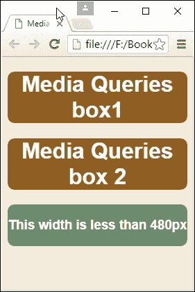
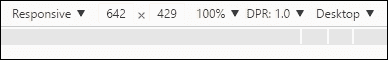
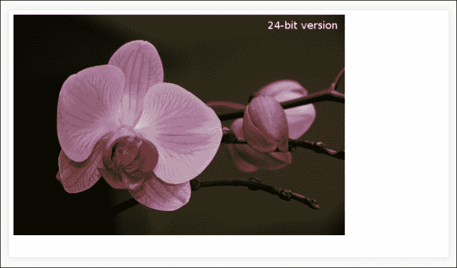

# 四、探索媒体查询

*移动互联网将在 2014 年超过固定互联网。*

KPCB 的分析师 Mary Meeker 在 2008 年的大胆预测在 2013-14 年实现了，当时美国移动互联网使用率上升到 51%，首次超过了台式电脑。 这部分可以归因于媒体查询的使用，其基本原则自 2000 年正式引入以来一直没有改变。

今天，查询的存在支持从高分辨率图像到单色屏幕和手持设备; 在本章的整个过程中，我们将继续探索只用浏览器和文本编辑器就能实现的主题，并向您展示，在构建响应性网站时，并不总是需要下载任何东西来创建媒体查询。

在本章中，我们将涵盖以下主题:

*   了解媒体查询的基本知识
*   创建断点并消除对它们的需要
*   探索最佳实践和常见错误
*   把事情进一步

好奇吗? 让我们开始。

# 探索一些例子

打开一个浏览器; 让我们去参观一些景点吧。

你可能觉得我疯了，但听我说。 我想给你们看几个例子。 让我们来看几个不同屏幕宽度的示例站点。 举个我最喜欢的星巴克咖啡公司的例子:


尝试调整浏览器窗口的大小; 如果你变得足够小，你会看到类似这样的东西:


这里还有另一个例子——我们不能忘记这本书的出版商 Packt 的网站:


尝试改变浏览器窗口的大小。 如果我们调整它的大小，它将显示如下:


对于我们的第三个也是最后一个例子，让我们去访问 CSS 技巧，由 Chris Coyier 创建的网站，在[http://www.css-tricks.com](http://www.css-tricks.com):


如果我们将其调整为更小的宽度，这是我们将得到的结果:


现在，我听到你问，这一切的意义是什么? 嗯,这很简单。 它们都以某种形式使用媒体查询; CSS Tricks 使用内置在 WordPress 中的查询，Packt 的站点使用 Drupal 托管，星巴克的站点基于 Handlebars 模板系统。

这里的关键是，所有使用媒体查询来决定应该显示什么; 在本章的整个过程中，我们将更详细地探索如何使用它们来更好地管理响应式站点的内容。 让我们开始更详细地探索他们的化妆。

# 理解媒体查询

开发者李小龙总结得很好，他将媒体查询的效果比作水在不同容器中的作用:

*清空你的思绪，做无形无形的水。 现在你把水倒在杯子里，它就变成杯子的形状; 你把水放进瓶子，它就变成瓶子的形状; 你把水放进茶壶里，它就变成茶壶的形状。 水可以流动，也可以崩塌。 像水一样，我的朋友。*

我们可以使用媒体查询应用不同的 CSS 样式，基于可用的屏幕状态或特定的设备特征。 这些可能包括但不限于显示类型、屏幕分辨率或显示密度。 媒体查询在测试的基础上工作，看看某些条件是否为真，使用以下格式:

```html
   @media [not|only] [mediatype] and ([media feature]) {
       // CSS code;
    }
```

我们可以使用类似的原则来确定是否应该加载整个样式表，而不是单个查询:

```html
<link rel="stylesheet" media="mediatype and|only|not (media feature)" href="myStyle.css"> 

```

看起来很简单，对吧? 媒体查询的伟大之处在于我们不需要下载或安装任何额外的软件来使用或创建它们; 我们可以直接在浏览器中构建它们中的大多数。

## 探索可用的媒体类型

如果我们看一下前一节中的示例查询，我们会发现它的一部分是由所使用的媒体类型组成的。 这只是查询的一部分。 所有媒体查询都分为两部分，第一部分控制 CSS 的显示方式，第二部分负责显示时间。

看看这个例子:

```html
<!-- CSS media query on a link element --> 
<link rel="stylesheet" media="(max-width: 800px)" href="example.css" /> 

<!-- CSS media query within a stylesheet --> 
<style> 
@media (max-width: 757px) { 
  .sidebar { 
    display: none; 
  } 
} 
</style> 

```

这说明了引用媒体查询的两种方式:第一个例子没有指定媒体类型，所以我们可以推断它将是默认的; 它的第二部分声明，它将仅适用于窗口宽度至少为`800px`的情况。

第二个媒体查询也没有指定媒体类型，所以 all 将被推断为默认值; 这一次，如果窗口宽度小于`600px`，则不显示`.sidebar`元素。

让我们看看所有的媒体类型可以使用:

<colgroup><col> <col></colgroup> 
| **值** | **用于** |
| `all` | 各种媒体 |
| `print` | 打印机或将内容打印到媒体 |
| `screen` | 屏幕/显示器(如电脑、手机或平板电脑) |
| `speech` | 屏幕阅读器 |
| `braille` | 盲文触觉反馈装置 |
| `embossed` | 分页的盲文打印机 |
| `handheld` | 手持设备，除了智能手机和平板电脑，使用`screen`代替 |
| `print` | 页材料和在屏幕上以打印预览模式查看的文档 |
| `projection` | 预测报告 |
| `screen` | 彩色电脑屏幕和智能手机 |
| `speech` | 语音合成器 |
| `tty` | 使用固定间距字符网格的媒体(例如具有有限显示能力的电传打字机、终端或便携式设备) |

除此之外，我们还有许多功能可以用来控制显示内容的触发器; 了解它们是值得的，因为它们都扮演着重要的角色，但以不同的方式工作。 让我们更详细地看看这个列表，并了解它们分别做什么。

## 列出可用的媒体特性

添加一个指定媒体目标的查询只是解决了问题的一半; 我们还需要给它一些控制什么时候显示它的东西! 为了实现这一点，我们可以提供一个或多个必须满足的条件，以便对内容进行样式化或显示。

让我们来看看一些可用的选项:

<colgroup><col> <col></colgroup> 
| **属性名称** | **描述** |
| `aspect-ratio` | 视窗的宽度:高度比例 |
| `device-aspect-ratio` | 设备的宽度:高度比例 |
| `device-[height&#124;width]` | 设备屏幕的高度或宽度 |
| `height` | 窗口的高度 |
| `min-device-pixel-ratio` | 检查设备的像素比。 适用于高清晰度和视网膜设备(比率大于 2) |
| `[min&#124;max]-aspect-ratio` | 视口的最小或最大宽度:高度比 |
| `[min&#124;max]-device-aspect-ratio` | 设备的最小或最大宽度:高度比 |
| `[min&#124;max]-device-height` | 设备的最小或最大高度或宽度 |
| `[min&#124;max]-width` | 视窗的最小或最大宽度 |
| `orientation` | 视图在纵向或横向模式下的方向 |
| `resolution` | 设备的分辨率(dpi 或 dpcm) |
| `width` | 视窗的宽度 |

这里的关键是选择正确的属性，我们应该根据它运行测试; 一个很好的例子是检查方向，这样我们就可以确定平板电脑是在纵向模式还是横向模式。 我们将在本章后面充分利用其中的一些查询测试。

好了，该继续了。 到目前为止的主题是我们可以通过使用浏览器和文本编辑器实现什么。 乍一看，这似乎有局限性，但我认为有太多的人在不必要的时候求助于使用额外的帮助(如使用 jQuery)来创建查询。 总的来说，这是可行的，但有几点我们应该考虑:

*   你需要支持 IE8 或以下版本吗? 如果是这样，那么我们需要为此提供额外的支持; 微软在 2016 年初做出的决定意味着不再支持 IE8，所以现在是时候真正考虑一下这个浏览器是否应该出现在你的设计中了。

*   支持一些较新的媒体查询，如最大分辨率，只有在较新的浏览器; 有必要检查一下 CanIUse.com 网站和你的服务器日志，以确定不支持旧浏览器是否会成为一个问题。
*   如果我们需要提供回退支持，那么不要想当然地认为这意味着我们必须使用基于 javascript 的解决方案; 值得考虑的是你需要提供什么支持，以及你是否真的需要使用媒体查询。

好了，让我们继续:是时候做点实际的事情了! 我们讨论了组成查询的一些不同方面，并探讨了在使用浏览器和文本编辑器时需要考虑的一些问题。 在我们变得太实际之前，我们需要再讨论一个主题。 有时我们需要测试多个条件。 我们可以使用逻辑运算符来实现这一点。 让我们快速地看一看其中的一些细节。

## 在查询中引入操作符

当组合需要多个测试的媒体查询时，我们可以使用逻辑运算符来确认是否应该将一个或多个 CSS 规则应用到我们的内容。 如果使用逻辑操作符，则需要将测试的每个属性封装在括号中; 否则，它将在代码中生成一个错误。

让我们来看看一些更常见的操作符示例:

*   **和**:用于将多个媒体类型或媒体特性组合成单个复杂查询。 它通常像算术和操作符一样工作，也就是说，要求每个条件都为真才能执行查询。
*   **Not**:我们可以用这个来否定一个查询。 它适用于整个媒体查询，并且只有在整个查询返回 false 时才会工作(例如`600px`显示上的`min-width: 700px`)。 此操作符必须与媒体类型一起使用。
*   **Only**:只有当我们需要防止在旧浏览器中应用选定的样式时，它才用于应用样式。

### 提示

媒体查询是大小写敏感的，如果遇到未知的媒体类型，将返回 false。

到目前为止，我们已经讨论了媒体查询的基本内容:让我们探索如何使用它们来管理内容，确定我们的设计在不同屏幕尺寸下的断点。 这些断点，或**断点**，是媒体查询工作的关键——虽然我们得到正确的关键，也很重要的是知道什么时候我们应该和不应该使用它们……

# 识别常见断点

在响应式设计的时代，断点是网站成功的关键; 这都是关于定义我们的设计可能在哪里中断，如果我们要调整可用的屏幕宽度。 重要的是要明白，没有两个网站会有相同的查询在使用; 这就是说，有一些我们可以使用，可以作为我们设计的基础。

我们将从这个标准桌面开始:

```html
@media only screen and (max-width: 768px){ 
  /* CSS Styles */ 
} 

```

随着手机的飞速发展，我们不能忘记那些幸运地拥有智能手机的人，比如 iPhone:

```html
@media only screen and (min-device-width: 320px) and (max-device-width: 480px) { 
  /* Styles */ 
} 

```

该查询的缺点意味着它同样适用于任何足够小以满足给定的`*-device-width`维度的设备。 这不是我们想要的(或想要的); 为了在移动设备和桌面之间设置一个更清晰的划分，我们可以这样调整查询:

```html
@media only screen and (max-device-width: 320px) { 
  /* Styles - for mobiles in portrait mode */ 
} 

```

这一项适用于横屏模式的手机:

```html
@media only screen and (min-device-width: 321px) { 
 /* Styles - for mobiles in landscape mode */ 
} 

```

进一步说，我们还可以满足平板电脑的需求，比如 ipad:

```html
@media only screen and (min-device-width: 768px) and (max-device-width: 1024px) { 
  /* Styles */ 
} 

```

不过，这里也有一个类似的警告——我们还没有设定一个仅适用于平板电脑的足够清晰的门槛。 我们可以通过添加`orientation`属性来解决这个问题:

```html
@media only screen and (min-device-width: 768px) and (max-device-width : 1024px) and (orientation : portrait) { 
  /* Styles */ 
} 

```

为了完成这张图片，我们同样可以应用一个检查，查看平板电脑内容何时以横屏模式显示:

```html
@media only screen and (min-device-width: 768px) and (max-device-width : 1024px) and (orientation : landscape) { 
  /* Styles */ 
} 

```

这些断点只是一个小的选择，可以用来添加媒体查询到任何网站; 这并不意味着我们应该盲目地使用它们; 我们应该只添加那些允许我们支持目标设备的查询。 当然，我们可以添加自定义查询，尽管存在添加过多查询的风险。 让我们花一点时间来考虑添加自定义查询的含义，以及为什么这会成为我们项目的一个问题。

### 提示

值得研究的是，其他人创造了什么样的媒体在线查询; 市面上有几十个这样的例子，其中一些将针对特定的设备，如智能手机或平板电脑。

## 创建自定义断点

我们已经列出的媒体查询应该涵盖广泛的场景; 在某些情况下，这些是不够的，我们的网站并没有像预期的那样工作。

我们该怎么办? 我们并不局限于使用我们已经介绍过的标准查询; 我们完全可以创造自己的!

创建自定义断点非常简单，只要我们采用正确的方法; 如果操作不当，我们可能会造成不必要的中断，限制使用，或者对其他设备产生意想不到的连锁反应。 为了理解我们的意思，让我们通过一个(理论)例子。

设想您的站点被调整为`335px`左右，我们看到它有点不平衡——有许多元素不太合适。 为了更好地管理这个断点的内容，可能会编写这样的查询:

```html
@media only screen and (max-device-width: 345px){ 
  /* Styles */ 
} 

```

我们将在以`/*Styles*/`为首的区域中添加我们的更改。

听起来合理,对吗? 如果不是因为一件事:我们现在刚刚为宽度低于`345px`的查看设备创造了一套全新的问题!

解决这个问题的关键不是简单地使用更大的像素值，因为这可能会破坏其他设备的布局——包括在纵向或横向模式下的移动设备。 解决这个问题的正确方法是确定查询失败的确切情况，然后调整查询以更好地匹配这些情况，或者(理想情况下)计算出设计本身是否可以调整以避免查询的需要。

因此，例如，如果我们的站点在`325px`和`345px`之间中断，并且故障仅处于竖屏模式，我们将创建一个媒体查询，如下所示:

```html
@media only screen and (min-device-width : 325px) and (max-device-width : 345px) and (orientation : portrait) { 
  /* Styles */ 
} 

```

这对我们有什么帮助? 将查询细化为更显式，可以避免与我们可能已经创建的更一般的查询发生任何可能的冲突。 我们也将门槛限制变得更加清晰; 我们不会触发查询，除非我们能同时匹配所有三个条件。

## 理解原理

有些开发者可能会问，为什么我们不简单地修复可用的视口; 当我们改变方向时，它会改变大小，所以内容肯定会调整以适应，对吗?

嗯，是也不是。 除了台式机，我们还需要了解内容的位置，以及我们希望支持的设备类型。 我们不应该忘记，它是完全有效的布局是不同的纵向模式和那些在横向模式; 试着在 iPad 的横屏和竖屏模式下查看 Packt 的网站!

在撰写本文时，一个额外的元素以纵向模式显示，但它在横向模式中不存在。 如果纵向模式中的一个元素被破坏并且没有正确显示，那么简单地指定数值断点将不起作用。 为了解决这个问题，我们还必须指定受影响的方向，否则修复一个模式可能会破坏另一个。

## 精心设计

好了，我们已经创建了一堆媒体查询，准备在网站上执行。 我们可以继续并开始创建一些示例，是吗? 如果我说“hold fire for a moment”，你很可能会认为我疯了; 但一如既往，这是有充分理由的。 让我解释一下。

使用媒体查询的一个缺点是没有两个站点是相同的; 这意味着我们不能总是在多个站点重用标准查询。 有时我们需要创建自定义断点来满足网站的需求; 诀窍是知道我们的站点在什么时候和什么地方可能需要额外的关注，除了我们可能在站点中使用的正常断点之外。

创建自定义的、临时的查询很容易，但是我们要冒创建太多查询的风险，这会破坏响应式设计的整个概念。 我们能绕过这个吗? 是的，我们可以; 这涉及到我们设计方法的转变，即不再关注视口大小，而是关注内容。

## 删除对断点的需要

到目前为止，我们已经介绍了如何使用断点来控制显示什么，以及根据使用的设备何时显示。 让我们假设您正在处理一个客户端的项目，并创建了一系列查询，这些查询使用 320px、480px、768px 和 1024px 等值来覆盖对各种设备的支持。

无论我们的设计是什么样子，如果我们专注于使用特定的屏幕视图作为控制设计的基础，我们总是会面临两个问题:

*   与现有设备的数量保持一致
*   限制屏幕宽度的不灵活性

所以,坚持下去。 我们已经创建了断点，但这最终会给我们带来更多的问题? 如果我们发现自己创建了许多针对特定问题的媒体查询(除了标准问题)，那么我们将开始失去响应性网站的好处; 相反，我们应该重新检查我们的网站，了解为什么设计不工作，看看我们是否可以调整它，以消除自定义查询的需要。

最终，我们的站点和目标设备将决定需要什么——一个好的经验法则是，如果我们创建更多定制查询而不是标准的 4 到 6 个断点，那么也许是时候重新检查我们的设计了!

作为针对特定屏幕尺寸的替代方案，我们可以采取另一种方法，即遵循适应性设计原则，而不是响应性设计原则。 我们不是简单地指定一些固定的屏幕尺寸(比如 iPhone 6 Plus 或三星 Galaxy 单元)，而是围绕*设计开始失败*的点来设计。

为什么? 答案很简单。 这里的想法是想出不同的波段，其中设计将在一个较低和较高的值之间工作，而不是简单地指定一个查询，检查固定的屏幕尺寸是低于或高于某些值。 如果它还没有完全意义，现在不要担心; 目前，这里的关键是，我们正在创建的设计意味着我们可以减少支持这么多设备的需求。

让我们将这个理论付诸实践，并开始创建一些演示来展示我们如何在实践中使用媒体查询。

# 把我们的理论付诸实践

在本章的整个过程中，我们已经涵盖了构成媒体查询的不同部分，我相信有人曾经说过，*是时候*。

是的，是时候把它付诸实践了。 在开始创建一些真实的示例之前，让我们创建一些可以用来探索在代码中添加媒体查询的效果的东西。 我们将从调整屏幕上一些简单的盒子开始:

1.  从代码下载中，继续并提取一个`queryexample.html`副本并将其保存到我们的项目区域。
2.  在文本编辑器中，继续添加以下样式; 我们将从我们的盒子的一些基本样式开始:

    ```html
            body { background-color: #F3ECDD; text-align: center; 
              font-family: Arial, sans-serif; color: #ffffff; 
              min-width: 33%; } 

            .box { width: 100%; background: #905f20; border-radius: 0.625em; 
              margin: 0; } 

            .box2{ min-width: 100%; background: #6b8e6f; border-radius: 
              0.625rem; 
              float: left; } 

            h3:after{ content: ' is less than 30rem'; } 

    ```

3.  然后我们需要添加媒体查询; 把它添加到前面样式规则的右括号下面:
4.  将该文件保存为项目区域中的`css`子文件夹中的`queryexample.css`。

如果我们尝试通过运行`queryexample.css`来预览我们的工作结果，我们应该会看到类似以下截图的内容:


让我们来了解一下这里发生了什么。 在核心 CSS 中(在步骤 3 中)，我们向标记添加了三个`<div>`元素。 由于我们默认给它们设置了`100%`宽度和高度为`auto`，它们将被堆叠成一系列的盒子。

如果我们使用 Chrome 并像之前那样激活设备模式，那么我们就可以开始看到调整浏览器窗口大小的效果。 如果我们将它的宽度调整到<`30rem`以下作为断点(或`480px`)，我们可以看到方框将同时调整大小; 背景也改变为浅棕色:



现在我们已经了解了设置查询的基础知识，让我们进一步创建一些实际示例。 我们将首先建立一个简单的网页，我们将应用一些简单的媒体查询。

# 创造一些实际的例子

在接下来的几页中，我们将探讨如何充分利用媒体查询; 我们将构造两个演示来演示使用查询的一些方法。 演示本身可能看起来并不复杂，但这并不是一件坏事; 让代码变得复杂只会让它更脆弱，更容易崩溃，更难以支持。

让我们看一下我们的第一个演示，它将响应性支持添加到一个基本的组合模板页面。

## 让它真实

让它成为现实——这是一个怎样的标题! 这是有充分理由的。 在探索新概念时，我最讨厌的就是探索一个过于简单的演示，以至于没有包含任何我想在开发中开始使用的功能的真实图片。

创建媒体查询不应该是一个例外。 在前面的示例中，我们创建了一些测试查询，以查看当浏览器窗口调整大小时三个框如何交互。 为了更好地理解这一点，我们需要一些更深入的内容; 我们可以做的比探索如何添加类似的查询到一个作品集页面，可能是一个新的或现有的网站的一部分。 对于我们的第二个演示，我们将创建一个简单的网页模板，然后开始添加和开发查询，允许它在移动设备上使用。

### 注意事项

这里有一点很重要。 敏锐的读者会注意到，这并不是我们在本书前面所提倡的“移动优先”的方法。 是的，移动优先绝对是首选的方法，但我们生活在这样一个世界里，这可能是不可能的，我们可能不得不添加查询支持到现有的站点。 尽管我们不是按照我们喜欢的顺序来做的，但是在下一个演示中使用的关于媒体查询的原则仍然适用。

让我们开始:

1.  首先，我们需要从本书附带的代码下载中提取一些文件; 继续，将`responsive.html`、两个`coffeebeans.png`图像(普通和小尺寸)和`video`文件夹的副本保存到项目区域的根目录中。 将这两张图片移动到该文件夹内的`img`文件夹中。
2.  在一个新文件中，添加以下样式并将其保存为`responsive.css`，保存在项目区域的`css`文件夹中。 第一个样式块为我们的演示创建主文本区域和整体容器:

    ```html
            #wrapper { width: 96%; max-width: 45rem; margin: auto; padding: 2%; 
              border: 1px solid #000; margin-top: 3rem; border-radius: 0.2rem; 
              margin-bottom: 3rem; } 
            #wrapper > header > img { display: none; } 

            #main { width: 60%; margin-right: 5%; float: left; } 

    ```

3.  这涉及移动视图顶部的`Skip to...`; 它暂时隐藏，但当媒体查询被激活时将可见:

    ```html
            #skipTo { display: none; } 
            #skipTo li { background: #197a8a; } 
            #skipTo a { color: #fff; font-size: 0.8rem; } 

    ```

4.  我们需要一些东西来主办我们的视频和横幅图像; 这些风格照顾我们:

    ```html
            #video-wrapper { padding-bottom: 2rem; } 
            #video-wrapper video  { max-width: 100%; } 

            #banner { float: left; margin-bottom: 0.9375rem; width: 100%; } 
            #banner { height: 15rem; width: 44.5rem; background-image: 
              url('img/coffeebeans.png'); max-width: 100%; }  

    ```

5.  我们在主演示窗口的右侧有一个侧区; 我们需要一个样式来控制其维度:

    ```html
            aside { width: 35%; float: right; } 

    ```

6.  我们的网站使用了大量的链接，主要以按钮的形式。 这就需要注意它们的样式:

    ```html
            a { text-decoration: none; text-transform: uppercase; } 
            a, img { border: medium none; color: #000; font-weight: bold; 
              outline: medium none; } 

    ```

7.  网站的一个关键部分当然是导航。 这些样式规则管理基于一些无序列表项的表示:

    ```html
            header { font-family: 'Droid Sans', sans-serif; } 
            header h1 { height: 70px; float: left; display: block; 
              font-weight: 700; font-size: 2rem; } 
            header nav { float: right; margin-top: 2.5rem; height: 1.375rem; 
              border-radius: 0.25rem; } 
            header nav li { display: inline; margin-left: 0.9375rem; } 
            header nav ul { font-weight: 400; font-size: 1.1rem; } 
            header nav a { padding: 0.3125rem 0.3125rem 0.3125rem 0.3125rem; } 
            header nav a:hover { background-color: #8e5f57; color: #fff; 
              border-radius: 0.25rem; } 

    ```

8.  最后但绝不是最不重要的，我们需要一些东西使我们的页脚像样:
9.  保存文件。 现在我们需要添加媒体查询。 在样式表中留下两行，然后添加以下代码:

    ```html
            @media screen and (max-width: 414px) and (orientation: portrait) { 
              #header { background-color: #8e5f57; } 
              #wrapper { min-width: 15.63rem; border: none; margin-top: 0; } 
              #wrapper > header > img { float: right; display: block; } 

              #skipTo { display: none; } 
              #skipTo a { padding: 0.625rem; text-align: center; 
                height: 1.25rem; background-color: #8e5f57; } 

              #main {float: left; clear: left; margin: 0 0 0.625rem; 
                width: 100%; margin-top: 10rem; } 

              #banner { display: none; } 
              aside {float: left; clear: left;margin: 0 0 0.625rem; 
                width: 100%; } 

              header h1 {margin-top: 1.25rem; height: 2.1875rem; } 
              header nav  {float: left; clear: left; margin: 0 0 0.625rem; 
                width: 100%; border-radius: none; } 
              header nav li  {margin: 0; background: #efefef; display: block; 
                margin-bottom: 0.1875rem; height: 2.5rem; } 
              header nav a  {display: block;  padding: 0.625rem; 
                text-align: center; } 
              header nav a:hover { border-radius: none; } 
            }  

    ```

10.  在第一个媒体查询的下面再留两行空，然后添加以下代码:

    ```html
            @media screen and (max-width: 736px) and (orientation: landscape) { 
              #header { background-color: #8e5f57; } 

              #wrapper { min-width: 15.63rem; border: none; margin-top: 0; } 
              #wrapper > header > img { float: right; display: block; } 

              #skipTo { display: none; } 
              #skipTo a { padding: 0.625rem; text-align: center; 
                height: 1.25rem; background-color: #8e5f57; } 
              #main {float: left; clear: left; margin: 0 0 0.625rem; 
                width: 100%; margin-top: 10rem; } 

              #banner { display: none; } 
              aside {float: left; clear: left;margin: 0 0 0.625rem; 
                width: 100%; } 

              header h1 {margin-top: 1.25rem; height: 2.188rem; } 
              header nav  {float: left; clear: left; margin: 0 0 0.625rem; 
                width: 100%; border-radius: none; } 
              header nav li { margin: 0; background: #efefef; display: block; 
                margin-bottom: 0.1875rem; height: 2.5rem; } 
              header nav a  { display: block;  padding: 0.625rem; 
                text-align: center; } 
              header nav a:hover { border-radius: none; }  
            } 

    ```

11.  Save the file, then preview the results in a browser. Ideally, this should be Google Chrome or an alternative such as Firefox:

    

我希望你会同意，这是一页很好看的书。 它完美地展示了我最喜欢的两样东西:我对咖啡和拼字游戏的热爱! 我总是说咖啡一定是许多开发者的秘密工具，但我跑题了……

试着调整屏幕大小; 为了便于讨论，让我们将其大小调整为**414 x 736**，或者是**iPhone 6 Plus**所需的大小:


我们可以使用 Chrome 的设备模式来切换方向为横向:


我们可以看到网站重新调整了自己:


这是一个简单、干净的设计。 这里的关键是，我们可以使用它作为添加更多支持其他设备的查询的基础。 有一些重要的概念，我们应该更详细地探讨，所以让我们花 5 个时间，看看媒体查询如何在我们的演示中发挥作用。

### 探索发生了什么

本例中使用的许多样式都是为了设计页面的样式; 我们的关键规则从第 33 行和第 50 行开始，在那里我们分别为 iPhone 6 Plus 设置竖屏和横屏模式。 让我们更详细地看看这两条规则:

```html
@media screen and (max-width: 414px) and (orientation: portrait) { 
... 
} 

```

该规则规定屏幕宽度的`max-width`必须为`414px`或更少; 如果它更大，但仍然显示在竖屏模式，则该规则将不适用。

在这个规则中，我们采用了主块中已经使用的样式，并应用了更改，使我们能够在 iPhone 上查看站点时保持预期的效果。 一个典型的例子就是`#banner`模块; 在主样式集中，我们设置了一些属性来在屏幕上定位它:

```html
#banner { float: left; margin-bottom: 0.9375rem; width: 100%; } 
#banner { height: 15rem; width: 44.5rem; background-image: url('img/coffeebeans.png');  max-width: 100%; } 

```

然而，这并不适合在 iPhone 上显示，先不考虑图像的大小(717px * 214px)。 它的重量也高达 102KB! 显然，我们不希望在移动设备上下载如此大的图像(移动设备上的 Internet 访问很可能会受到限制)，因此我们需要做一些其他的事情。

相反，我们有一个更小的版本在使用，以`coffeebeans-small.png`的形式。 这张图片的大小为 33KB，在移动模式下浏览时，它会显示在页面的右上角。 我们隐藏原来的，因为它是不需要的:

```html
@media screen and (max-width: 414px) and (orientation: portrait) { 
... 
  #wrapper > header > img { float: right; display: block; } 
... 
  #banner { display: none; } 
} 

```

当我们在横屏模式下使用它时，这条规则就会出现:

```html
@media screen and (max-width: 736px) and (orientation: landscape) { 
... 
  #wrapper > header > img { float: right; display: block; } 
... 
  #banner { display: none; } 
} 

```

注意，我们不需要改变规则。 图像的大小保持不变，并且已经设置为向右浮动，因此可以简单地重用该规则。 我们在这里也需要说明; 否则，它根本不会显示。 为了看到差异，尝试设置演示使用谷歌 Chrome 模拟 iPad 模式:


我们可以看到，尽管基本代码在`#banner``<div>`中使用了`coffeebeans-small.png`，但我们的媒体查询已经用`coffeebeans.png`替换了它。

### 提示

您可能会注意到，媒体查询宽度不是以 rem 单位设置的; 这纯粹是为了我们可以将它们与 Chrome 中的设备工具匹配。 如果你愿意，你可以很容易地将它们设置为 rem 单位。

我们故意让演示中的规则保持简单; 它们说明了我们如何在桌面模式、iPhone 6 竖屏模式和 iPhone 6 横屏模式下都能很好地显示页面。 然后我们可以重用相同的原则来扩展对其他设备的支持; 诀窍是确保我们使用的断点覆盖了足够多的设备，这样我们就不必添加不必要的内容到我们的站点。

现在让我们改变策略，但仍要围绕苹果主题。 不，我想的不是食物! 你们中有多少人有幸拥有 iPad? 如果答案是肯定的，那么下一个演示将是有趣的。 对于许多标准设备，我们在显示图像时所能使用的分辨率方面受到限制。

进入一个伟大的戏法。 那么显示更高分辨率图像的能力呢? 我们不需要下载任何东西来帮助解决这个问题。 大多数现代浏览器都可以开箱即用; 我们所需要的只是适当的媒体查询来告诉浏览器什么时候使用它们。

## 检测高分辨率图像支持

移动设备的出现(有些人可能会说是迅速崛起)带来了一个机会，支持更高分辨率的图像。

大多数用户无法区分标准 pc 上的单个像素。 当在典型的距离观看，一些网站会显得太小而不能使用! 相反，PC 将恢复到更现实的分辨率，比如 1440px。

为了提供更平滑的视图，一些设备会添加额外的像素; 这使得单个像素更难查看，并且图像在外观上超级清晰。 这是由苹果发起的，他们将其营销为 Retina 显示器; 其他公司也开始效仿，创造出能够支持高分辨率图像的设备。

幸运的是，我们不需要昂贵的 iphone 或 ipad 来添加支持。 我们可以通过媒体查询来实现这一点，并使用 Chrome 的设备工具来模拟测试。 为了了解如何操作，让我们创建一个简单的演示，在蝴蝶兰或飞蛾兰花的两张图片之间切换。 为了判断显示的是哪张图像，每一张都会在图像的右上角显示分辨率:

1.  首先，启动普通文本编辑器，然后添加以下代码并将其保存为`min-resolution.css`:

    ```html
            <!DOCType html> 
            <html> 
            <head> 
              <meta charset="utf-8"> 
              <link rel="stylesheet" type="text/css" 
                href="css/min-resolution.css"> 
            </head> 
            <body> 
              <div id="orchid"></div> 
            </body> 
            </html> 

    ```

2.  继续，并创建一个名为`css`的单独文件夹。 其中，将以下代码保存为`min-resolution.css`:

    ```html
            #orchid {  
              background-image: url('img/mothorchid.png');  
              height: 24.31rem; 
              width: 36.5rem; 
            }  

            @media (min-resolution: 120dpi) {  
              #orchid {  
                background-image: url('img/mothorchid@2x.png');  
                height: 24.31rem; 
                width: 36.5rem; 
              }  
            } 

    ```

3.  我们还需要一个图像文件夹。 将其创建为与`css`文件夹相同级别的`img`。
4.  从本书附带的代码下载中，提取`mothorchid.png`和`mothorchid@2x.png`的副本，然后将它们保存到`img`文件夹中。 *不要改名字!*
5.  Go ahead and preview the results of our file. If all is well, we will see something akin to this screenshot:

    

6.  To confirm what size is shown, first activate the Developer toolbar by pressing ***Ctrl* + *Shift* + *I***. Then enable device mode by pressing ***Ctrl* + *Shift* + *M***. We will see a toolbar similar to this appear:

    

这里有两点需要注意:一个是左边的设置(**Responsive**)，另一个是 DPR 或设备像素比。 要触发显示更高分辨率的图像，请尝试更改左边的设置为**iPhone 6 Plus**:


注意 DPR 设置是如何跳转到`3.0`的，我们的图像发生了改变:



希望您会同意这是添加支持的一种简单方法。 使用 Chrome 浏览器，我们可以得到一个很好的表现如何高分辨率图像将出现; 值得注意的是，它仍然应该在合适的设备上进行测试，因为即使谷歌也不能完全模拟浏览器中的特定设备!

### 探索它的工作原理

在这一点上，我相信您会问这一切是如何工作的。 这是一个简单的技巧。 它的关键是我们在演示开始时为图像使用的命名约定。

还记得我是怎么说的吗?它们应该保存在代码下载中，而不是更改名称。 原因是我们在演示中使用了这个。 苹果设备(从 iOS4 开始)希望在文件名中看到`@2x`来表示高分辨率图像:


然后，我们将其用于我们的媒体查询，如果我们的`min-resolution`检测到`120dpi`或更大，则该媒体查询仅被设置为显示更高分辨率的图像。

### 注意事项

另外，您可能会看到使用了`min`/`max-device-pixel-ratio`。 这是支持最新版本 Safari 所必需的。 所有其他浏览器都可以毫无问题地使用最小分辨率，尽管并不是所有浏览器都支持也可以使用的`dppi`或`dpcm`单元格式。

媒体查询的强大功能意味着我们可以针对支持更高分辨率图像的设备定制支持; 如果设备无法做到这一点，那么可以显示标准分辨率的图像。

好吧，我们现在改变策略。 尽管编写媒体查询是一项简单的任务，但可能会有一些情况，即使是最好的开发人员也不能很好地完成它! 这可能是任何情况，从错过视口标签到无意中编写了相互冲突的查询。 让我们花点时间来探索一些更常见的我们可能会出错的点，并看看一些提示来帮助我们回到正轨。

# 检查一些常见错误

在创建网站时，特别是那些响应性强的网站，很容易犯错误; 毕竟，这就像学习任何一项新技术; 我们从一开始就不完美!

为了帮助你进入响应式构建和创建媒体查询的世界的最初几步，让我们花一点时间探索一些更常见的错误，理解为什么它们会导致问题，并通过一些指针来帮助避免这些问题:

*   **Not including the viewport tag**: This is one of the most common errors to make. When working on mobile devices, we have to include this tag if we want them to be displayed without zooming:

    ```html
            <meta name="viewport" content="width=device-width, initial-scale=1″> 

    ```

    如果不包含标签，那么文本将显示得更小，因为移动设备默认会缩放页面。

*   **语法错误**:是的，这是另一个常见的问题原因! 虽然看起来很难，但是输入错误的查询可能会出现错误，尤其是对于那些刚开始编写媒体查询的人。 这里没有正确或错误的答案。 这是在编写代码时要小心的问题; 复制和粘贴。 看看 CSS 媒体查询网站(在[http://cssmediaqueries.com/](http://cssmediaqueries.com/))，你可以使用很多例子。
*   **Inclusive media queries**: Take a look at these two queries for a moment. At first glance, they look perfectly reasonable, don't they? After all, both are set for screen display only and will only show when the screen size is above `767px`:

    ```html
            @media screen and (max-width: 767px) {
              h1 { 
              font-size: 30px; 
              }
            }
            @media screen and (min-width: 767px) {
              h1 { 
              font-size: 40px 
              } 
            } 

    ```

    问题是，我们还有个问题。 如果我们在样式表中设置这两个查询，那么当屏幕属性为`767px`或更大时，它们都会启动。 最好的情况是，我们可能会以`h1`为`40px`(而不是`30px`); 在最坏的情况下，我们会得到一些奇怪的效果! 注意设置什么媒体查询是值得的。 确保您的查询没有重叠。

*   **Specificity and order of inheritance**: Staying with the theme of duplicated selectors (in a sense), another trap that can trip us up is that of inheritance. Say, for example, we specify these two attributes:

    ```html
            h3 {color: darkred;}
            h3 {color: #f00;}
    ```

    我们要什么颜色的? 好吧，如果你说的是深红色，那么准备好大吃一惊吧; 答案实际上是`#f00`或绿色。 为什么这会给我们带来麻烦? 如果我们编写了一些媒体查询，但没有注意到断点或没有正确规划查询的顺序，那么我们可能会添加过多的任务。 记住，如果两个选择器应用于相同的元素，具有更高特异性的选择器胜出。

在处理媒体查询时，很容易过度思考一个问题。 在许多情况下，它只需要一点预先考虑和谨慎，我们可以生成一些有用的规则来管理移动设备上的内容，而不会有太多重叠。

让我们改变策略，继续前进。 假设我们编写的任何代码都是语法正确的，现在是一个很好的机会来探索我们在编写媒体查询时可以遵循的一些准则。 虽然下一节的标题是*探索最佳实践*，但我个人讨厌这个短语。 它是一种被使用和滥用到死亡的东西! 相反，把它们当作一些友好的提示来帮助您提高编写查询时的新技能。 这一切都是关于探索可能的艺术，同时平衡它与迎合更实际的需求，如我们的目标市场和支持的设备。

# 探索最佳实践

呃，用这个短语让我畏缩! 在谈论主题 X 或主题 Y 时，太多的人经常会提出他们认为的最佳实践。

也就是说，在创建媒体查询时，我们可以使用一些有用的技巧; 这不仅仅是遵循最佳实践，同时也是为了让事情变得更简单，这样我们就可以在正确的时间在正确的设备上显示正确的内容:

*   当设计媒体查询时，总是从小处开始。 这将避免浏览器下载只有在较大屏幕尺寸时才需要的不必要元素。 大规模启动是可能的，但通常需要大量减少内容，而且不太可能那么容易管理。
*   在设计查询时，不要立即认为必须在移动设备上包含桌面站点的所有内容。 有时这样做没有意义。 通常情况下，没有足够的空间或带宽来做这些事情! 重要的是要考虑你所构建的网站的上下文，以确保你包含了所有合适或合适的内容。
*   多想想内容应该如何排序。 例如，在一个博客网站上，我们经常看到图片和文章提示符。 这些不能很好地转移到小屏幕上，所以考虑删除这些图像，留下文章的细节，写作时间，作者的照片和类似的东西。 我们仍然可以传达我们的信息，但这一次只是对我们的设计做一些简单的调整。
*   在使用图像的媒体查询时要小心。 页面大小在增加，所以在查询中引用正确的图像是至关重要的。 同样，如果我们有旋转木马之类的效果，那么我们应该考虑用静态图像替换它; 这意味着我们可以显著减小页面的大小，因为大量的图像可以被删除。
*   不要试图迎合市场上的每一种设备; 2015 年的研究表明，目前有超过 2.4 万款不同的 Android 设备，这使得市场高度分散，要想完全支持这一市场非常困难。 同样，服务器日志将帮助识别用于访问站点的设备。 通过这些检查，你会发现你最喜欢的移动浏览器，你应该把精力集中在这些浏览器上。
*   在设计时，考虑使用 em(或者更好的是 rem)单位。 像素值在正常的设计中工作得很好，但在放大时就不那么好了，这通常是在响应性强的站点中完成的。 如果我们使用 em(或 rem)值，这允许浏览器根据使用的缩放级别自动调整站点的设计。
*   使你的导航可伸缩。 清晰性和一致性应该凌驾于桌面站点的相似性之上。 不要害怕使用与桌面站点完全不同的东西; 清晰性和易用性应该凌驾于其他因素之上，比如颜色。
*   尽可能使用图标和字体，甚至 SVG 图像。 这些比例比标准图像好得多，特别是当我们使用媒体查询。 我们甚至可以使用 CSS 改变后者的内容，同时仍然保持清晰的图像。
*   注意字体大小。 我们完全可以使用媒体查询来显示更大或更小的字体，这取决于我们可以使用的屏幕状态。 但需要注意的是，如果我们使用百分比值或 em/rem 单位，那么它们将能够更好地缩放，甚至可以消除处理字体的媒体查询需求。
*   注意那些有视觉障碍的用户，比如弱视或色盲。 移动设备上可用的屏幕视口已经变小了; 如果字体大小不能很好地缩放，或者你选择了冲突的颜色，比如红色背景上的白字，你的用户肯定不会感谢你!

通过简单地使用文本编辑器、浏览器和一些仔细的规划，我们可以完成很多工作。 最棒的是，我们可以使用媒体查询来帮助这些技巧。 这只是一个计划问题，这样我们就不会创建比需要更多的查询!

让我们继续。 在本章中，我们关注的是简单地使用浏览器和文本编辑器创建查询时可能发生的事情。 我坚信，太多的人只是简单地选择最近的库来帮助构建我们的查询; 是时候回归基本了!

也就是说，在某些情况下，我们可能需要使用 jQuery 或特定的库来帮助生成查询。 一个经典的例子是整合对旧浏览器的支持，尽管我们是否应该继续支持旧技术还有待商榷。 假设我们确实需要使用库，那么让我们花一点时间来探索一些可用的选项来帮助创建这些查询，简单的 CSS 无法满足这些查询。

# 更进一步

在许多情况下，我们可以使用文本编辑器和浏览器来满足我们的需求; 后者的设备模式(或响应模式)将在创建完美有效的查询方面发挥重要作用，这将适合许多网站。

然而，在某些情况下，这是不够的。 我们可能需要依赖额外的帮助来支持特定项目的媒体查询。 不过，我们必须问一下，这是否真的有必要，而不仅仅是懒惰的借口。 最近的浏览器对媒体查询的支持非常稳固!

也就是说，如果我们不得不使用外部帮助，那么网上有很多可用的选择。 让我们来看几个例子:

*   **纯 JavaScript 或 jQuery**:不用说，大多数解决方案都是基于这两种技术中的任何一种; 当然，这些都是显而易见的选择! 但需要注意的是，jQuery 总是被设计来补充网站，而不是在设计中扮演核心角色; 有人可能会说，出于这个原因，创建媒体查询并不是一个很好的使用 jQuery 的方法。
*   **.resizr**([http://resizr.co/](http://resizr.co/)):我们可以通过这个网站来了解我们的网站在各种移动设备上的工作情况; 它确实依赖于你有一个可以访问互联网的网站，没有什么可以替代真正的东西! 这是一个很好的开始，所以当你在实际设备上测试你的站点时，这意味着许多基本问题已经解决了。
*   **我的设备像素比是多少?** :托管在[http://devicepixelratio.com/](http://devicepixelratio.com/)，此工具计算出屏幕的设备比例设置能够支持什么。 这是完美的那些实例，我们可能想要使用高分辨率的图像。 毕竟，如果你选择的设备不能显示它们，那么使用它们就没有意义了!
*   **mediaqueri.**:托管在[http://mediaqueri.es/](http://mediaqueri.es/)，这个网站应该在任何开发者的军械库中。 这是一个展示鼓舞人心的网站，使用媒体查询和 RWD。
*   **Modernizr**:可以从[http://www.modernizr.com](http://www.modernizr.com)下载，我们可以使用库测试媒体查询支持; 另一种选择是使用`@supports`指令。 在大多数情况下，会导致问题的是旧版本的 IE。 如果我们仔细规划我们的站点，我们可以通过提供一个在 IE 上工作的基础站点，并为其他浏览器在顶部添加额外的触摸，从而设计出这两者的需求。
*   **Restive.js**:从[http://restivejs.com/](http://restivejs.com/)开始，这个基于 jquery 的插件是一把真正的瑞士军刀，它允许你为网站的不同方面添加响应式支持。
*   **响应式设计模式**:总部设在美国的机构 Code My Views 创建了许多响应式设计模式; 一旦您更习惯于使用媒体查询，这可能值得一看。 你可以在[https://codemyviews.com/blog/5-really-useful-responsive-web-design-patterns](https://codemyviews.com/blog/5-really-useful-responsive-web-design-patterns)上看到更多细节。

无论你决定采用哪种方式，网上都有很多选择，可以帮助你开发媒体查询。 这里的关键是，如果你要添加一个额外的库，那么这是正确的事情为你的网站; 它可能会围绕你的项目是否必须支持 IE8 等旧浏览器。 这个浏览器在 2009 年就已经出现了，而且应该被永久地抛弃!

# 总结

创建媒体查询打开了一个可能性的世界; 我们不需要在每个设备上显示我们页面的每个元素，所以我们可以根据用户使用的设备来选择我们展示给他们的内容! 通过使用浏览器和文本编辑器，我们已经在本章中介绍了许多有用的技术，所以让我们花点时间回顾一下所学的内容。

在探索媒体查询是如何构建的之前，我们以一个快速的交互式演示开始，以说明一些知名网站如何使用媒体查询来重新排列屏幕上的内容。

然后我们看了一些不同的类型。 这包括我们可以用来控制内容显示方式的媒体类型和特性。 然后，在探讨如何为特定目的创建自定义断点之前，我们继续研究一些可能在代码中使用的常见断点语句。 我们还看到，如果我们对代码做一些简单的更改，我们甚至可以减少或删除断点。

接下来是更实际的使用媒体查询。 我们探索了如何使用它们使简单页面上的内容在移动设备上正确显示(允许其方向)。 然后我们介绍了如何使用媒体查询来控制在屏幕上显示标准或更高分辨率的图像。

然后，我们总结了这一章，看看修复一些常见的错误，我们可能会犯，然后覆盖一些可用的选项，我们可以逐步使用，一旦我们更习惯为我们的网站创建媒体查询。

唷，我们已经走到了技术发展的尽头; 还有一个主题，我们应该涵盖我们的旅程的一部分，通过创建响应网站。 如果解决方案没有效率，那么创造解决方案就没有意义。 你的访客不会感谢你，如果它需要一段时间加载一个网站! 作为优化代码的一部分，我们可以使用一些简单的技巧和技巧来解决这个问题。 我们将在下一章中探讨这个主题，以及更多内容。