# 第三章：添加响应式媒体

*一图胜千言……*

任何网站的关键元素是视觉内容；毕竟，没有添加一些形式的颜色，文本会变得非常重复和乏味！

添加媒体不仅为网站增添色彩，而且可以作为展示潜在客户产品外观或如何使用产品的重要工具。事实上，销售额可能仅基于能够看到产品演示而上升。随着移动设备的出现，更重要的是我们不仅要添加媒体，还要确保它在各种不同设备上运行良好。

在本章的过程中，我们将探讨不同的方法来向我们的页面添加媒体，并看看如何轻松地使其响应可用屏幕大小的任何更改。在本章中，我们将涵盖以下主题：

+   了解使用`<picture>`添加图像的基础知识

+   探索添加图像的替代方法

+   使视频和音频内容响应

+   自动调整文本以适应屏幕

好奇吗？让我们开始吧！

# 使媒体具有响应性

到目前为止，我们在基本的响应能力上的旅程已经涉及到了如何使我们的布局自动响应变化；现在是时候对媒体做同样的事情了！

如果您的第一个想法是我们需要大量的额外功能来使媒体响应，那么我很抱歉让您失望；这要容易得多，而且不需要额外的软件来完成！是的，我们只需要一个文本编辑器和一个浏览器；我将使用我最喜欢的编辑器 Sublime Text，但您可以使用任何适合您的工具。

在本章的过程中，我们将依次查看图像、视频、音频和文本，并看看通过一些简单的更改，我们可以使每个内容都具有响应性。让我们开始我们的旅程，首先看看如何使图像内容具有响应性。

## 创建流体图像

常常说*图像胜过千言万语*。我们可以用媒体表达的东西比用文字表达的要多得多。对于销售产品的网站来说，这一点尤为真实；清晰、鲜明的图像比质量差的图像更能清晰地展现产品的形象！

在构建响应式网站时，我们需要我们的图像自动调整大小。要了解为什么这很重要，请从随附本书的代码下载中提取`coffee.html`并在浏览器中运行它。尝试调整窗口大小。我们应该看到类似于这样的东西：

！[创建流体图像]（img / image_03_001.jpg）

看起来不太好，是吗？撇开我对大自然最好的豆类饮料的偏爱，我们不能有不能正确调整大小的图像，所以让我们看看需要做些什么：

1.  继续提取`coffee.html`的副本，并将其保存到我们的项目区域。

1.  我们还需要我们的图像-这是在`img`文件夹中；将副本保存到我们项目区域中的`img`文件夹中。

1.  在一个新的文本文件中，添加以下代码，并将其保存为`coffee.css`：

```html
        img {
           max-width: 100%;
           height: auto;
        }
```

1.  恢复到`coffee.html`。您会看到第 6 行目前已被注释掉；删除注释标记。

1.  保存文件，然后在浏览器中预览。如果一切顺利，我们仍然会看到与以前相同的图像，但这次尝试调整大小。

这一次，我们的图像会根据浏览器窗口的大小自动增长或缩小：

！[创建流体图像]（img / image_03_002.jpg）

尽管我们的图像确实更合适，但在使用此方法时，我们应该注意以下几点：

+   有时在使用响应式图像时，您可能会看到`!important`设置为`height`属性的属性；这并不是必要的，除非您在以后可能会覆盖图像大小的站点中设置大小

+   我们将`max-width`设置为`100％`作为最小值；您可能还需要设置`width`值，以确保您的图像不会变得太大并破坏布局

这是一种易于使用的技术，尽管有一个可能会让我们出错的缺点——你能发现是什么吗？如果我们使用高质量的图像，它的文件大小将非常大——我们不能指望移动设备的用户下载它，对吧？

不过不用担心——有一个备受浏览器欢迎的很好的替代方案；我们可以使用`<picture>`元素来控制根据可用窗口大小显示什么。让我们深入了解一下。

## 实现`<picture>`元素

简而言之，响应式图像是根据您的网站被查看的设备在页面上显示其最佳形式的图像。这可能意味着几件事情：

+   您希望根据用户的物理屏幕尺寸显示不同的图像资源。这可能是 13.5 英寸的笔记本电脑或 5 英寸的手机屏幕。

+   您希望根据设备的分辨率或使用设备像素比（即设备像素与 CSS 像素的比率）显示不同的图像。

+   您希望在浏览器支持的情况下以指定的图像格式（例如 WebP）显示图像。

传统上，我们可能会使用简单的脚本来实现这一点，但这样做可能会有潜在的风险，可能会下载多个图像，或者如果脚本在图像加载后加载，或者如果我们在 HTML 中没有指定任何图像并且希望脚本负责加载图像，那么可能根本不会下载任何图像。

我们显然需要一种更好的方式来管理响应式图像！HTML5 中一个相对较新的标签非常适合这项工作：`<picture>`。我们可以以三种不同的方式之一使用它，取决于我们是想要调整现有图像的大小，显示一个更大的图像，还是显示图像的高分辨率版本。建议的方法是：

1.  `srcset`属性

1.  `sizes`属性

1.  `picture`元素

我们将详细探讨这三种方法；让我们先从在标准的``标签中实现`srcset`属性开始，然后再使用`<picture>`元素。

### 使用`srcset`属性

使用`<picture>`元素的一个关键好处是使用`srcset`属性来选择多个图像中的任何一个，取决于我们是想在不同视口中显示更高分辨率的版本还是不同尺寸的相同图像。

浏览器对此的支持非常好，只有 Opera Mini 和 IE11 不愿加入这个行列：


来源：[`caniuse.com/#search=srcset`](http://caniuse.com/#search=srcset)

要使用`srcset`属性，我们需要提供足够多的不同图像，然后根据定义的`设备像素`比例在适当的触发点指定应该显示什么，就像这个例子中所示：

```html
 

```

在这里，`src`属性充当了那些不支持`srcset`的浏览器的备用图像（尽管现在支持得非常好！）。`srcset`属性允许我们根据设备像素比或可用视口指定不同的图像使用：

```html
 

```

在这种情况下，我们的备用图像是`default.png`；然而，如果使用的浏览器支持`srcset`，那么它将在`256w`处显示`small.png`或在`511w`处显示`med.png`。然而，如果我们想要改变大小并根据可用视口使用不同的图像，那么我们就需要添加一个额外的属性——`sizes`。配置起来很容易，让我们暂停一下看看这在实践中意味着什么。

### 探索`sizes`属性

在响应式网站的内容中添加图片时，每个图像可能会占据元素宽度的 100％，但内容本身并不总是占据窗口宽度的 100％！例如，我们可能将每个图像元素设置为 100％宽度（以便填充其父容器），但屏幕上的整体内容只占可用屏幕宽度的 50％。

为了克服这一点，我们需要知道各种图像的 URL 以及每个图像资源的宽度；我们无法从页面布局中的标准标记中获取这些信息，因为图像在应用 CSS 之前开始下载。

相反，我们可以在 HTML 代码中使用`srcset`属性和适当的宽度描述符来简单设置适当的宽度。对于一些人来说，这有点具有争议，因为它开始模糊 HTML 标记和 CSS 呈现层之间的界限。不过，让我们来看一个如何设置代码的例子：

```html
 

```

在这个摘录中，我们将默认设置为视口宽度的 50%或一半；然后浏览器可以根据可用宽度选择适当的图像来显示。

### 操作 HTML5 的<picture>元素

我们已经涵盖了使图像响应的两个关键部分，但为了将所有内容整合在一起，我们可以使用 HTML5 的`<picture>`元素，在大多数浏览器中得到了良好的支持：

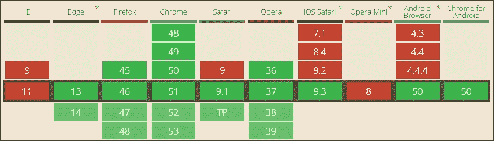

来源：[`caniuse.com/#search=picture`](http://caniuse.com/#search=picture)

`<picture>`元素使用以下语法：

```html
<picture>
   <source media="(min-width: 60rem)" sizes="(max-width: 500px) 50vw, 10vw"
   src="img/high-res-image-2x.png 145w ">
   <source media="(min-width: 35rem)" src="img/med-res-image.png">
   <source src="img/low-res-image.png">
   
   <p>Text to display</p>
</picture>
```

在这个摘录中，我们将所有可以与`<picture>`元素一起使用的各种属性联系在一起；在这种情况下，我们指定了媒体查询（一个是`60rem`，另一个是`35rem`），如果我们的视口只有 50%或更少（代码中的`50vw`值表示），我们显示普通图像；如果更高，那么我们显示高清晰度图像（使用`100vw`值指定）。

### 注意

我们将在本章后面更详细地探讨这是如何工作的，*探索发生了什么*。

### 将所有内容放在一起

既然我们已经看到了这三个元素的使用，让我们把它们整合起来，创建一个简单的演示，根据可用视口自动调整要使用的图像。为简单起见，我们将只集中在图像上，但这并不妨碍我们将其进一步发展成一个全尺寸的页面！

让我们开始吧。对于这个演示，我强烈建议使用已安装的 Google Chrome；它的设备模式非常适合这个任务！

1.  从本书附带的代码下载中提取四个横向图片的副本，并将它们保存到项目区域根目录下的`img`文件夹中。

1.  接下来，打开文本编辑器，添加以下代码：

```html
        <!DOCTYPE html> 
        <html> 
        <head> 
        <title>Adding responsive images with the <picture> element</title> 
        </head> 
        <body> 
          <picture> 
            <source media="(min-width: 800px)" sizes="(max-width: 1000px) 
            100vw" srcset="img/high-res-image.png 738w"> 
            <source media="(max-width: 799px)" sizes="(max-width: 600px) 
            100vw" srcset="img/med-res-image.png 738w"> 
             
          </picture> 
        </body> 
        </html> 

```

1.  将其保存为`pictureelement.html`，放在我们项目文件夹的根目录下。

1.  在 Google Chrome（或其他首选浏览器）中预览文件的结果。确保打开浏览器的设备/响应模式。

如果一切正常，我们应该看到图像在两个相似版本之间切换；为了识别哪个是哪个，我在一个图像上添加了**高分辨率图像**，在另一个图像上添加了**中分辨率图像**：

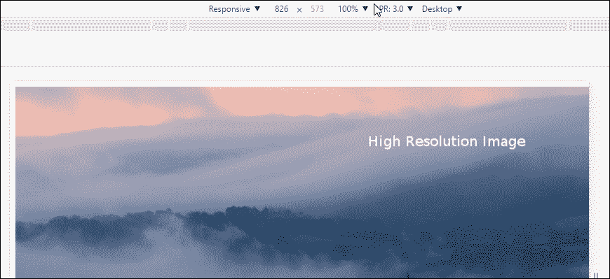

这是相同的图像，但这次使用的是中等分辨率版本：

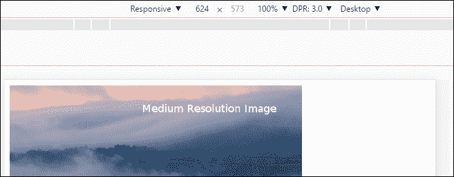

尽管这个演示看起来很简单，但实际上并不简单。我们有能力构建一些复杂的语句，可以根据多个标准自动选择图像！了解这个演示如何工作是很重要的，因为这是使用它进行复杂示例的基础。让我们花点时间更详细地探讨一下。

### 探索发生了什么

如果我们浏览一下我们的图片元素演示，所使用的代码可能一开始看起来很复杂，但实际上比看起来简单！关键在于理解每个部分`<source>`语句以及它们如何相互作用。让我们先来解决第一个：

```html
  <picture> 
    <source media="(min-width: 800px)" sizes="(max-width: 1000px) 100vw" 
    srcset="img/high-res-image.png 738w"> 
    ... 
  </picture> 

```

在这个示例中，我们指定`high-res-image.png`作为我们的源图像；这将只在我们的浏览器窗口显示的最小宽度为`800px`时显示。图像的大小将要么达到最大宽度为`1000px`，要么达到`100vw`——后者相当于可用视口空间的 100%宽度。图像旁边的`738w`只是代码中指定的图像宽度（1w 单位等于 1px，因此我们的图像宽度为 738px）。

转到第二个来源声明，我们发现它显示了一个类似的设置，但这次媒体查询的最大宽度限制为`799px`，并且图像的大小将变为`600px`或视口的全宽，具体取决于其当前大小：

```html
<picture> 
  ... 
    <source media="(max-width: 799px)" sizes="(max-width: 600px) 100vw" 
    srcset="img/med-res-image.png 738w"> 
     
  </picture> 

```

为了完成`<picture>`元素，我们指定`fallback-image.png`作为那些尚未支持 HTML5 中的这个元素的浏览器的备用图像。

### 注意

我们只是挖掘了`<picture>`元素的一部分可能性；有关更多详细信息，请查看响应式图像社区组维护的网站，托管在[`responsiveimages.org/`](https://responsiveimages.org/)。

## 创建一个真实的例子

我们已经探讨了使用一些有用的技术使图像具有响应性的理论；现在是时候实践了！我们下一个演示的基础是使用谷歌地图制作一个响应式地图。

响应式地图，你会问？这应该是自动的，对吧？好吧，不，它不是，这使得它在移动设备上有点尴尬。幸运的是，我们可以很容易地解决这个问题；它的好处在于它只需要一点额外的 CSS：

1.  让我们开始浏览[`maps.google.com`](http://maps.google.com/)，然后输入我们选择位置的邮政编码；在这种情况下，我将使用 Packt 的英国办公室，即 B3 2PB。

1.  单击齿轮图标，然后选择**分享和嵌入**地图，如此屏幕截图所示：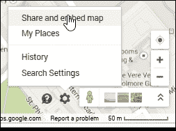

1.  在弹出的对话框中，切换到嵌入地图选项卡，然后复制以`<iframe src=...`开头的文本字段的内容。

1.  在本书附带的代码下载副本中，从中提取`googlemaps.html`的副本，然后在您喜欢的文本编辑器中添加`<iframe>`代码，放在 google-maps div 标签之间。

1.  接下来，将以下 CSS 样式添加到一个新文件中，并将其保存为`googlemaps.css`：

```html
        #container { margin: 0 auto; padding: 5px; max-width: 40rem; } 
        .google-maps { position: relative; padding-bottom: 60%;overflow: 
        hidden; } 
        .google-maps iframe { position: absolute; top: 0; left: 0; width:
        100% !important; height: 100% !important; }    

```

如果一切顺利，我们将看到伯明翰的谷歌地图图像，并标出 Packt 的办公室：

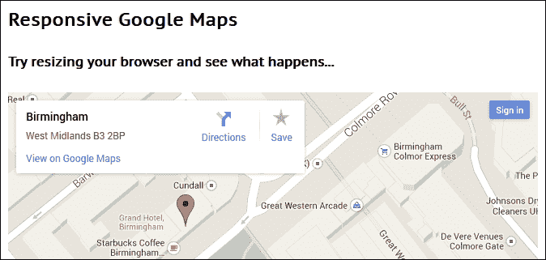

此时，尝试调整浏览器窗口的大小。您会看到地图会自动调整大小；我们添加的 CSS 样式已经覆盖了 Google 地图中使用的标准样式，使我们的地图能够在任何设备上进行响应和访问。

## 进一步进行

在本章的整个过程中，我们遵循了只使用浏览器和文本编辑器构建我们的代码的原则。当然，这包括不下载任何对创建我们的示例核心的东西（保存媒体和内容）。

然而，有时这种方法并不足够，我们可能会发现需要额外的支持来完成工作。我们的首要问题应该始终是检查我们是否真的需要它，而不仅仅是懒惰！如果在回答这个问题时，我们确实发现需要额外的帮助，那么有许多来源可以尝试，以帮助进一步解决问题：

+   不用说，但是总有一天我们需要使用 jQuery（[`www.jquery.com`](http://www.jquery.com/)）来帮助我们的开发。响应式设计的状态是，我们应该只需要 jQuery 来更容易地引用 DOM 中的元素，而不是使图像或内容具有响应性！

+   托管在[`responsiveimages.org/`](https://responsiveimages.org/)的响应式图片网站。我们在`<picture>`演示的最后简要介绍了它，但再次指出它是值得的。这是一个有用的资料汇编，可以帮助理解和使用`<picture>`元素。

+   开发人员 Scott Jehl 为`<picture>`创建了一个 polyfill，以扩展对那些不本地支持它的浏览器的支持；您可以从[`scottjehl.github.io/picturefill/`](https://scottjehl.github.io/picturefill/)下载它。

+   您需要一个响应式的轮播图吗？网上有很多可用的，但我发现工作得很好的一个是 ResponsiveSlides，可以从[`responsiveslides.com/`](http://responsiveslides.com/)获取。诚然，该项目已经存在几年了，但这个特定的插件保持了简单明了，非常符合本书的主题！

+   响应能力已经存在的一个很好的例子是使用 SVG 图像格式。这些实际上是基于矢量的图像，我们可以使用 CSS 进行操作；然而，SVG 图像的关键优势是可以自动增长或缩小，而不会失去质量。浏览器对该格式的支持非常好，尽管 IE（和 Edge）在使用这些浏览器时有一些需要注意的怪癖（有关更多详细信息，请参见[`caniuse.com/#feat=svg`](http://caniuse.com/#feat=svg)）。

+   另一个尝试的想法是使用响应式图标。一个值得一看的好例子是 FontAwesome 库，可以从[`fontawesome.io/`](http://fontawesome.io/)获取。这些图标也可以等比例调整大小。在这种情况下，它们非常适合较小的图像，比如信用卡图标或电子商务网站上的购物篮。

+   更进一步，如何支持 WebP 图像格式？是的，这是一个尚未得到广泛支持的格式，在撰写本文时仅限于 Chrome 和 Opera。然而，当与`<picture>`元素一起使用时，它展示了一个不错的技巧：

```html
        <picture> 
            <source type="image/webp" srcset="retina-image.webp 2x, 
            image.webp 1x" /> 
             
        </picture> 

```

+   在我们的例子中，浏览器将检查对 WebP 的支持，如果支持它，它将根据设备使用的设备像素比显示适当的 WebP 格式的图像。如果不支持 WebP，那么它将退回到使用 JPEG（尽管这也可以是不同的格式，比如 PNG）。

当我们习惯于使用响应式图片，并希望摆脱仅使用 HTML5 和 CSS3 时，我们当然可以做一些事情。但重要的是要注意，有许多在线运行的项目没有在这里列出。

这主要原因是年龄——一段时间内对响应式图片的支持不够完善，这意味着出现了许多项目来帮助提供对响应式图片的支持。对`<picture>`和相关元素的支持正在不断改善，这减少了一些旧项目的吸引力；值得考虑是否明智地使用它们，或者如果不使用它们的影响可以通过改变用户体验来减轻。

好的，让我们继续吧；我想是时候稍微动画一下了！好吧，这是一个糟糕的引子，因为我们接下来要探讨如何使视频具有响应性。在接下来的几页中，我们将看到虽然这里也适用一些相同的原则，但途中会有一些颠簸，这可能会影响我们的旅程。

# 使视频具有响应性

灵活的视频比图像稍微复杂一些。HTML5 的`<video>`保持其纵横比，就像图像一样，因此我们可以应用相同的 CSS 原则使其具有响应性：

```html
   video {
      max-width: 100%;
      height: auto !important;
   }
```

直到相对最近，HTML5 视频一直存在问题——这主要是由于对运行 HTML 视频所需的编解码器的支持分裂。制作 HTML5 视频所需的 CSS 非常简单，但直接使用它会带来一些挑战：

+   托管视频需要大量带宽和昂贵

+   流媒体需要复杂的硬件支持以及视频

+   在不同格式和平台上保持一致的外观和感觉并不容易

对许多人来说，一个更好的选择是通过 YouTube 等第三方服务托管视频。有一个警告，他们将控制您的视频内容；如果这不是问题，我们可以让他们担心带宽问题和提供一致的外观和感觉；我们只需要让它适应页面！这需要一些额外的 CSS 样式来使其工作，所以让我们探讨一下涉及的内容。

## 嵌入外部托管的视频

要嵌入这些视频，我们需要使用 iframe，不幸的是，默认情况下它们不保持纵横比；我们可以通过 Thierry Koblentz 的 CSS 解决方案来解决这个问题。

假设我们有一个 YouTube 视频，比如这个，名为*大野兔*，由 Blender Foundation 制作：

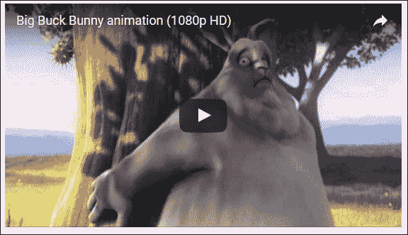

(c) Blender Foundation | [www.bigbuckbunny.org](http://www.bigbuckbunny.org)

看起来还不错，是吧？当然，我们不能立即看出这是来自 YouTube 的视频，但下一个屏幕截图清楚地显示了它是：

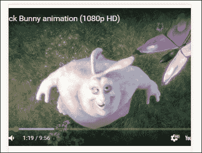

等等；那看起来不对，是吧？这个屏幕截图是在 Google 中拍摄的，但设置为模拟 Galaxy S5 手机的屏幕空间，但它清楚地显示视频不是响应式的。

要看到这一点，从本书附带的代码下载中提取`youtube.html`的副本到我们的项目区域，然后在浏览器中运行它。激活浏览器的响应式模式（或设备模式，取决于浏览器），并将屏幕调整为 360px x 640px。您很快就会看到它的调整效果不好！

我们如何解决这个问题？

诀窍是创建一个具有适当纵横比的框，比如 4:3 或 16:9（通过零高度和底部填充百分比），然后将视频放入框内，并通过绝对定位使其在框内拉伸到框的尺寸。底部填充作为帮助保持纵横比的宽度。让我们修改我们的代码来解决这个问题：

1.  在`youtube.html`中，在`<head>`部分中添加此链接：

```html
        <link rel="stylesheet" type="text/css" href="css/youtube.css"> 

```

1.  在下面，按照所示修改代码：

```html
 <div class="video-box-wrapper">
          <iframe width="560" height="315" 
          src="img/XSGBVzeBUbk" frameborder="0" 
          allowfullscreen></iframe> 
        </div>

```

1.  保存文件。切换到一个新文件，然后添加以下代码，并将其保存为`youtube.css`，放在我们项目区域的`css`子文件夹中：

```html
        .video-box-wrapper { 
          padding-bottom: 5.25%; height: 0; position: relative;padding-top: 
          1.875rem; overflow: hidden; } 

        .video-box-wrapper iframe,  
        .video-box-wrapper object,  
        .video-box-wrapper embed { position: absolute; left: 0; top: 0; 
        width: 100%; height: 100%; } 

```

### 注意

一句话注意——设置`height: 0`确保元素存在于 DOM 中，以便旧版浏览器可以正确格式化内部框。

1.  保存文件，返回到浏览器，并重新启用其响应式（或设备）模式，如果尚未打开。

1.  现在尝试预览结果；如果一切正常，我们应该看到类似于这样的东西。它使用相同的 Galaxy S5 大小设置，但这次放大到 150%以获得清晰度：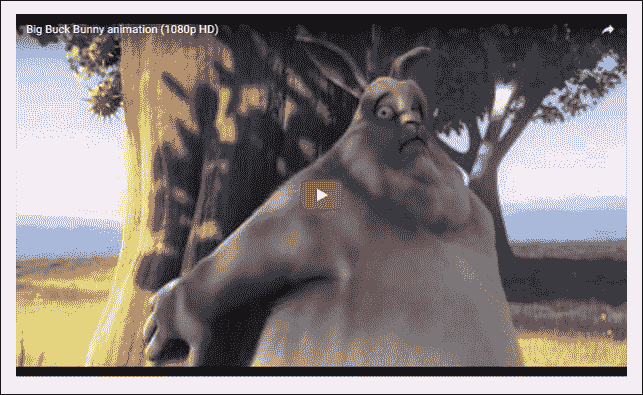

这看起来好多了！通过一些简单的样式，我们可以兼顾两全；我们可以让 YouTube 来处理所有繁重的工作，而我们专注于让我们的视频在多个设备上从我们的网站上可用。我们使用的 CSS 强制所有视频内容适应`.video-box-wrapper`容器的全宽度，然后相对于其正常位置进行定位。然后我们在底部添加了`56.25%`以保持经典的 16:9 纵横比，并在顶部提供了一些额外的填充，以便它不会出现在屏幕外！

### 注意

**问题**：我们是如何得到 56.25%的？这只是 9 除以 16（纵横比），即 0.5625 或 56.25%。

然而，有时我们必须托管自己的视频；这可能是为了控制可见性或防止在外部托管时播放广告。为了实现这一点，我们可以使用当前的 HTML5`<video>`元素在页面上呈现内容；让我们看看这在实际中是如何工作的。

## 介绍新的 HTML5 视频元素

如果在外部来源托管视频不可能，那么我们必须本地托管；为此，我们可以使用原生的 HTML5 视频标签，看起来像这样：

```html
<video controls> 
  <source src="img/bigbuckbunny.webm" type="video/webm"> 
  <source src="img/bigbuckbunny.mp4" type="video/mp4">  
</video> 

```

过去，HTML5 元素的编解码器支持在每个平台上都有所不同；2015 年，Firefox 在所有平台的浏览器中添加了对 H.264 的支持，这在很大程度上推动了对 HTML5 视频的支持。目前，对于这两种格式（MP4 和 WebM）的支持情况良好，但并非所有浏览器都支持 100% - 此截图显示了桌面和移动浏览器对 MP4 格式的当前状态：

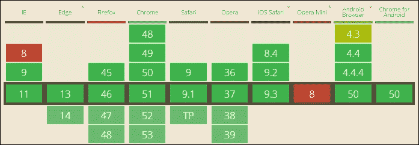

来源：CanIuse.com

相比之下，对于 WebM 格式的支持并不是那么完整：

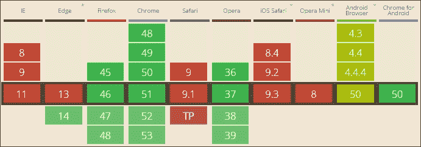

来源：CanIuse.com

实际上，我们唯一需要担心使用的格式是 MP4；如果需要，我们可以使用 WebM 格式。如果这样做，那么它必须在`<source>`列表中排在第一位；否则，浏览器将选择第一个可支持的格式（在这种情况下是 MP4），而不使用 WebM！

### 提示

在继续之前，我强烈建议确保你已经安装了 Google Chrome 或 Firefox - WebM 视频将在 IE9 或更高版本中工作，但如果没有为该格式添加编解码器支持，就无法使用！

既然我们已经介绍了，让我们继续并将其付诸实践，用一个简单的演示来说明`<video>`元素是如何运作的。

## 嵌入 HTML5 视频内容

如果我们的要求是必须自己托管视频，那么使用 HTML5 标准标签实现它非常容易；它包括在`<video>`标签中设置任意数量的不同来源，以便我们可以使用该浏览器支持的格式播放相同的视频。让我们深入了解一下我们是如何做到的：

1.  我们将从随本书附带的代码下载中提取以下内容的副本 - `video`文件夹和`html5video.html`。将它们保存到我们项目文件夹的根目录。

1.  在一个新文件中，继续添加这些样式；将文件保存为`html5video.css`，放在我们项目区域的`css`子文件夹中：

```html
        video { 
           max-width: 100%; 
           /* just in case, to force correct aspect ratio */ 
           height: auto !important; 
        } 

```

1.  尝试在浏览器中预览结果。如果一切正常，我们应该会看到类似于这样的东西（来自 Chrome 的截图）：

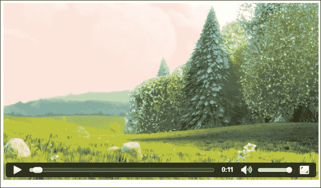

结果看起来完美 - 问题是，我们使用的是哪个版本的视频？找出的一种方法是右键单击视频，当它仍在播放时，然后单击**另存为...**。如果一切正常，我们应该会看到一个**另存为**对话框打开，准备保存 WebM 格式（如果使用 FireFox，Chrome 或 Opera）；否则将是 MP4（如果使用 IE）。

### 探索发生了什么

然而，真正的问题不是它是如何工作的，而是它是否是响应式的？

答案是肯定的；我们使用 HTML5`<video>`标签意味着我们可以选择任意数量的不同视频格式来使用；浏览器将简单地选择它能够播放的第一个可用格式。但顺序很重要：

```html
<video controls> 
    <source src="img/bigbuckbunny.webm" type="video/webm"> 
    <source src="img/bigbuckbunny.mp4" type="video/mp4"> 
</video> 

```

如果我们交换顺序，让 MP4 排在第一位，那么 WebM 将被几乎所有浏览器忽略，因为几乎所有浏览器都可以播放 MP4！

真正的魔力不在于使用特定的视频格式，而在于我们创建的 CSS 规则：

```html
video { 
   max-width: 100%; 
   /* just in case, to force correct aspect ratio */ 
   height: auto !important; 
} 

```

我们使用百分比值意味着当我们的窗口调整大小时，它会自动缩放；视频的最大尺寸受到视频尺寸的限制，而不是屏幕上的其他元素。当然，我们可以决定将视频托管在父容器中；视频将填充该容器，但父容器可能只会延伸到站点的一部分。

## 构建一个实际的例子

如果你在互联网上花费了一些时间，可能会遇到一些开发者没有使用图像作为背景，而是*视频*的网站。

这并不是一个全新的概念；它已经存在了几年。如果小心处理，它可以运行得非常好。它是制作全尺寸视频作为响应式背景的完美候选者。它的好处是我们可以使用纯 CSS 使其响应。没错，不需要任何 JavaScript。

对于我们的下一个演示，我们将暂停创建内容。这一次，我们将从附带本书的代码下载中运行演示，并稍后更详细地查看代码。我们将使用 Blender 基金会的 Big Buck Bunny 项目的视频作为我们的背景；在此之上，我们将叠加一个使用 Lorem Ipsum 生成器生成的简单文本块。

要查看此示例，请继续运行附带本书的代码下载中的`fullscreen .html`演示。如果一切正常，您将看到视频在一个简单的`<div>`后面播放，上面有文本：

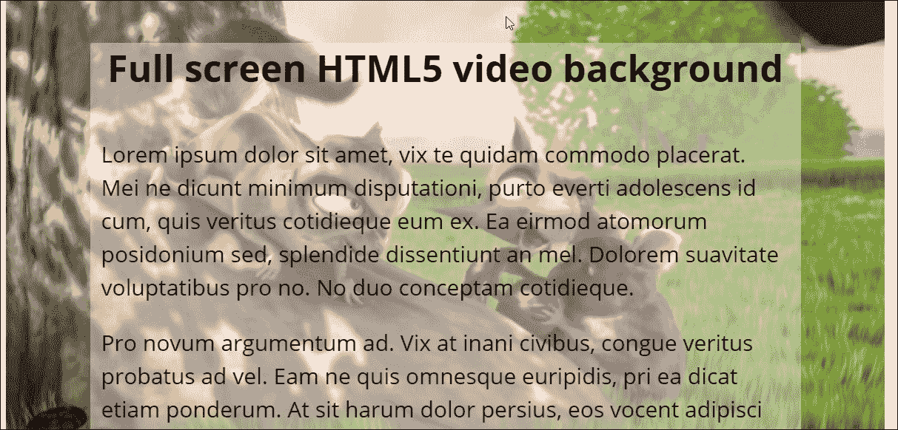

如果我们更详细地查看我们的代码，我们可以看到视频元素的使用；它被设置为自动播放，声音被静音，还设置了一个海报（或占位符）图像。然而，真正的魔力在于 CSS 样式，所以让我们更详细地探讨一下这一点。

### 探索发生了什么

使我们的视频工作的技巧在于这段代码。我们需要设置两个 16:9 宽高比的媒体查询（一个作为最小宽高比，另一个作为最大宽高比），以便我们的视频在屏幕上正确显示：

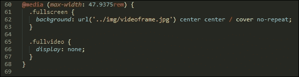

但在调整大小时，它会显示白色空间。我们通过设置负边距来解决这个问题，这样视口就会变得更宽，从而使我们能够将内容居中在屏幕上：

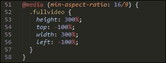

需要注意的关键点是`height`、`top`、`left`和`width`的值；尽管这些值看起来很极端，但在查看设置了`16/9`宽高比的内容时，它们是必需的，以帮助将视频居中在屏幕上。

完美！我们的视频播放得很好。我们可以轻松看到内容。一切应该都很好，对吧？嗯，是的和不是；诸如背景视频之类的概念并非没有风险；如果我们不小心，重要的是要了解事情可能出错的地方。让我们暂停一下，考虑一下我们的视频如果不小心可能会引起的一些潜在陷阱。

## 探索风险

在我们之前的例子中，我们探讨了将视频作为背景内容的概念。这是近几年流行起来的一种时尚，提供了一种有趣的效果，与我们可能会看到的标准图像不同！

然而，并非没有一定的风险；在添加视频作为背景内容时，有一些要考虑的要点：

+   可以添加视频，但我们不应该只是因为我们可以而添加它——我们使用这种方法添加的任何视频都必须增强网站的整体信息。

+   任何添加的视频可能会被设置为自动播放，但默认情况下必须将声音静音——如果可能的话，最好根本没有声音。

+   我们的视频是否符合网站品牌、语气、色彩搭配等？建立一个精彩的网站，然后用一个垃圾视频毁掉它是没有意义的。

+   成本是我们必须考虑的问题；托管视频内容可能很昂贵，因此必须尽可能压缩文件大小，并以适合多个设备（包括移动设备）的格式进行处理。

+   我们的视频不应该太长；我们必须在使它太长和不够长之间取得平衡，以使它不会感到太重复。

+   可访问性是一个关键要点；它必须具有足够高的对比度，以使文本叠加可读。

+   我们的视频可能看起来不错，但性能如何？如果您在背景中使用了一个大型、未经优化的视频，您的客户可能不会感谢您，因为这可能会减慢网站的速度；他们很可能会选择离开！

+   我们使用的兼容性技术在 IE8 上不起作用，因此必须包含一个静态占位符作为后备；以防我们使用的浏览器不支持 HTML5 视频或其属性（例如移动设备的自动播放）。

尽管我们有一些明显的指针需要考虑，但这不应该阻止我们使用这种效果；只要我们做得好，我就会不断推动可能性的边界！

## 使音频响应式

问题——我们已经致力于使视频响应式，但音频内容呢？

我们可以将类似的原则应用到 HTML5 的`<audio>`元素上；我们可以使用 max-width 而不是设置特定的宽度，并设置一个百分比来控制它在屏幕上的显示宽度。

实现这一点的代码非常简单，现在应该很熟悉——让我们看看涉及了什么：

1.  对于这个演示，我们需要使用合适的文件；出于许可原因，不幸的是，你在本书附带的代码下载中找不到任何文件！实现这一点的一种方法是复制 iTunes 文件（通常是`.m4a`格式），然后使用 Media.io（[`media.io/`](http://media.io/)）等在线服务将其转换为正确的格式。在继续进行此演示之前，您需要将其转换为 MP3 和 OGG 格式。

1.  假设我们现在有了正确的文件，继续从本书附带的代码下载中提取`audioelement.html`的副本，并将其保存到我们项目区域的根目录。

1.  接下来，在我们项目区域的根目录中，创建一个名为`audio`的新文件夹；将音频文件的副本保存到其中，这些文件要么已经存在，要么是从第一步创建的。

1.  在一个新文件中，添加以下代码，并将其保存为`audioelement.css`，保存在我们项目区域根目录的`css`子文件夹中：

```html
        audio { 
          max-width: 100%; 
          width: 800px; 
        } 

```

1.  尝试在浏览器中预览我们的工作结果——如果一切顺利，我们应该看到类似于这个屏幕截图的东西：


乍一看，它可能看起来并不特别，但`<audio>`元素本来就不打算看起来与众不同！关键在于当我们调整浏览器窗口大小时；我们设置了`100%`的最大宽度值，但通过在宽度属性中设置`50rem`的上限来限制了这一点。无论我们调整窗口多少次，音频播放器都会填满整个宽度，但不会超过`50rem`。

### 注意

与`<video>`元素不同，我们不能仅使用 CSS 调整高度；这需要使用 jQuery 覆盖`<audio>`元素，这超出了本书的范围。

让我们继续，将我们新学到的知识付诸实践，创建一个实际的例子——比如将视频全屏，并自动响应浏览器视口的变化？使用这种技术设置视频始终充满争议，但我不会逃避挑战，所以让我们毫不犹豫地深入研究，看看为什么在全屏使用视频时我们必须小心谨慎。

## 进一步进行

在本书的过程中，我们一直致力于使用 HTML5 和 CSS3 的核心技术；在许多情况下，这已经足够了，但总会有一天我们需要使用其他技术来帮助完成任务，因为我们已经超越了普通 CSS 和 HTML 代码的可能性。

幸运的是，在线上有很多选项可帮助我们使视频响应式，并提高我们的技能。不过，我们应该始终问自己，我们是否需要另一个库是因为生活的现实意味着我们无法在不使用它的情况下完成任务，还是因为我们变得太懒了！

如果确实需要下载和使用额外的库，有几个不错的选择可以尝试，包括：

+   **FluidVids**：可以从[`toddmotto.com/labs/fluidvids`](http://toddmotto.com/labs/fluidvids)获取；这个库已经有几年了，但可能值得一看。

+   **responsiveVideo**：可以从[`cbavota.bitbucket.org/responsive-video/`](http://cbavota.bitbucket.org/responsive-video/)下载。这个已经存在了几年，所以可能效果不太好。

+   **Embed Responsively**：它托管在[`embedresponsively.com/`](http://embedresponsively.com/)，并且会返回任何主要视频托管公司（如 YouTube）的适当嵌入代码；它也是响应式的！

+   **FitVids.js**：这个插件可以从[`fitvidsjs.com`](http://fitvidsjs.com)获得，由 CSS Tricks 的 Chris Coyier 创建，可能值得一看，尽管它至少有 2-3 年没有更新了。

+   **MediaElement.js**：它可以从[`mediaelementjs.com`](http://mediaelementjs.com)获得，并且是一个很棒的库，可以与`<video>`和`<audio>`元素一起使用；它允许我们覆盖标准元素，并使用 jQuery 和 CSS 来自定义它以满足我们的需求。有很多在线示例，以及如何使用 jQuery 实现自定义外观和感觉的适当教程。

小心提醒一下 - 一些用于 jQuery 的视频插件库已经有一段时间没有更新了；你可能会发现它们在最新版本的 jQuery 中无法正常工作。这并不一定是件坏事，因为对 HTML5 的`<video>`和`<audio>`元素的支持现在非常出色；这使得许多这些库变得多余！

### 注意

有些人可能会问为什么我们需要使用 jQuery 来美化 HTML5 音频或视频播放器；许多单独的元素无法使用纯 CSS 访问，并且需要 JavaScript 在用 CSS 样式之前暴露这些元素。

呼，我们几乎完成了这一部分的旅程，但在我们进入下一章节讨论如何使用媒体查询之前，还有一个制作响应式内容的部分；我们的网站上的文本怎么样？它可能不会立即让你联想到与视频和文本相关的内容（至少在使内容响应式的情况下），但一切很快就会变得清晰起来。

# 使文本适应屏幕

在构建网站时，毋庸置疑，我们的设计显然必须从某个地方开始 - 通常是添加文本。因此，在我们的响应式设计中，我们必须同时考虑到这一点。

现在是一个完美的机会来探索如何使我们的文本流动并填充可用空间。尽管文本不像图片或视频那样是媒体，但它仍然是必须在某个时候添加到我们的页面上的内容！考虑到这一点，让我们深入探讨如何使我们的文本响应式。

## 使用 em 单位进行大小调整

在处理非响应式网站时，尺寸可能会以像素值引用；这是一个完全可以接受的工作方式。然而，如果我们开始使我们的网站响应式，那么使用像素值调整内容大小就不太好了；我们必须使用其他方法。

有两种选择：em 或 rem 单位。前者是基于设置一个基本字体大小，大多数浏览器默认为 16px；在这个例子中，相应的像素大小在每条规则后面的注释中给出。

```html
h1 { font-size: 2.4em; }      /* 38px */ 
p  { line-height: 1.4em; }    /* 22px */
```

不幸的是，使用 em 单位存在一个固有的问题；如果我们嵌套元素，那么字体大小将会叠加，因为 em 单位是相对于其父元素计算的。例如，如果列表元素的字体大小设置为 1.4em（22px），那么列表中的列表项的字体大小就变成了 30.8em（1.4 x 22px）。

为了解决这些问题，我们可以使用 rem 值作为替代，这些值是从根元素计算出来的，而不是从父元素计算出来的。如果你仔细观察本书中创建的许多演示，你会看到 rem 单位被用来定义演示中元素的大小。

## 使用 rem 单位作为替代

rem（或根 em）单位被设置为相对于根的单位，而不是父级的单位；这意味着我们消除了任何复合问题，因为我们的参考点保持恒定，并且不受页面上其他元素的影响。

这样做的缺点是支持——IE7 或 8 不支持 rem 单位，因此如果我们仍然需要支持这些浏览器，那么我们必须回退到使用像素或 em 值。当然，这引发了一个问题：我们是否仍然应该支持这些浏览器，或者他们对我们网站的使用量太小，不值得更新我们的代码？

如果答案是我们必须支持 IE8 或更低版本，那么我们可以采取混合方法；我们可以在我们的代码中同时设置像素/em 和 rem 值：

```html
.article-body { 
  font-size: 1.125rem;  /* 18 / 16 */ 
  font-size: 18px; 
} 

.caps, figure, footer { 
  font-size: 0.875rem;  /* 14 / 16 */ 
  font-size: 14px; 
} 

```

注意我们首先设置 rem 值？支持 rem 单位的浏览器将首先使用这些值；不支持的浏览器可以自动回退到使用像素或 em 值。每个注释中的值都是像素等价值；例如，如果我们将`18px`除以`16px`（作为所有大小的基本值），我们将得到`1.125`，如文本中所示。

## 探索视口单位的使用

如果我们想进一步，那么还有另一种选择我们可以探索；如何使用视口单位？

这些有效地结合了两者的优点；视口单位（或`1vw`）是视口轴的 1%。因此，如果我们有一个宽度为 50 厘米的视口，一个`vw`单位将是 0.5 厘米。我们可以以与像素、em 或 rem 单位相同的方式指定大小。看看这个小节，它给出了它会是什么样子的味道：

```html
h1 { font-size: 5.9vw; } 
h2 { font-size: 3.0vh; } 
p { font-size: 2vmin; } 

```

然而，美妙之处在于无论视口大小如何，字体大小都会始终正确显示，因为如果视口改变，它会自动调整大小。

### 提示

要看到这个在实际中的简单例子，浏览到[`codepen.io/alibby251/pen/xOGrqN`](http://codepen.io/alibby251/pen/xOGrqN)并尝试调整浏览器窗口大小。看看文本如何自动更改大小，而不会失去质量？

## 进一步探讨

好吧，在这一点上，我们已经为我们的文本添加了响应能力；我们的网站看起来相当不错....我可以看到一个*但*的出现....

目前，对于响应式文本（特别是 vw 或 rem 单位）的支持非常好；对这两个单位会出现问题的浏览器是少之又少。然而，可能会有一天我们需要额外的帮助；与图像或视频内容不同，可供选择的选项并不多！最好的两个例子是 FlowType.js，可从[`simplefocus.com/flowtype/`](http://simplefocus.com/flowtype/)获取，以及 FitText.js，可从[`fittextjs.com/`](http://fittextjs.com/)获取。

但问题是这些库已经有 2-3 年没有更新了，因此不太可能与最近版本的 jQuery 一起使用。这很好地说明了多年来响应式文本的发展情况，我们真的应该原生地使用它，而不是依赖 JavaScript！

# 总结

任何网站的关键部分必须是使用的媒体；毕竟，没有某种形式的颜色，它会变得无聊！对于响应式网站来说也是如此；在本章的过程中，我们已经涵盖了一些有用的技术来添加响应式媒体，所以让我们回顾一下本章涵盖的内容。

我们从研究使图像流畅开始，这是响应式媒体背后的基本概念；然后我们迅速转向使用 HTML5 的`<picture>`元素，看看它如何用于根据硬件能力指定不同大小的图像。我们探讨了一些可用的指针，如果我们决定现有的原生支持不够，我们需要从仅使用纯 HTML 和 CSS 进展。

接下来我们将看一下响应式视频；我们将探讨如何使用纯 CSS 使外部托管的视频具有响应性。我们还介绍了使 HTML5 `<video>` 元素具有响应性所需的技术，如果外部托管不是一个选择。我们还探讨了 HTML5 `<audio>` 元素，并看到我们可以使用类似的技术使其具有响应性。

然后，我们以探讨如何使标准文本具有响应性结束了本章；我们介绍了这在本书的许多演示中已经被使用过，然后探讨了不同的技术，比如使用 em 或 rem 值，这些通常比标准像素单位更好。最后，我们进行了一个关于使用视口单位来设置字体大小的快速演示，这样我们就可以看到如何在创建响应式文本时获得最佳效果。

哦，涵盖了很多内容！让我们继续。既然我们已经有了布局和内容，我们需要考虑如何正确调整它们的大小。媒体查询就是解决这个问题的方法，这将是我们下一章的主题。
