# 第四章：探索媒体查询

*移动设备将在 2014 年超过固定的互联网访问。*

玛丽·米克尔（KPCB 的分析师）在 2008 年做出的大胆预测在 2013-14 年成真，当时移动互联网使用率首次超过台式机，达到了 51%。其中一部分可以归因于媒体查询的使用，其基本原则自 2000 年正式引入以来并未改变。

如今，查询可以支持从高分辨率图像到单色屏幕和手持设备的任何内容；在本章的过程中，我们将继续探索只使用浏览器和文本编辑器就可以实现的可能性，并向您展示在构建响应式网站时并不总是需要下载任何内容来创建媒体查询。

在这一章中，我们将涵盖以下主题：

+   了解媒体查询的基础知识

+   创建断点并消除对它们的需求

+   探索最佳实践和常见错误

+   进一步探索

好奇吗？让我们开始吧。

# 探索一些例子

打开浏览器；让我们去访问一些网站。

现在，你可能会认为我疯了，但请跟着我。我想给你看几个例子。让我们来看看在不同屏幕宽度下的一些例子。比如来自我最喜欢的咖啡公司星巴克的这个例子：

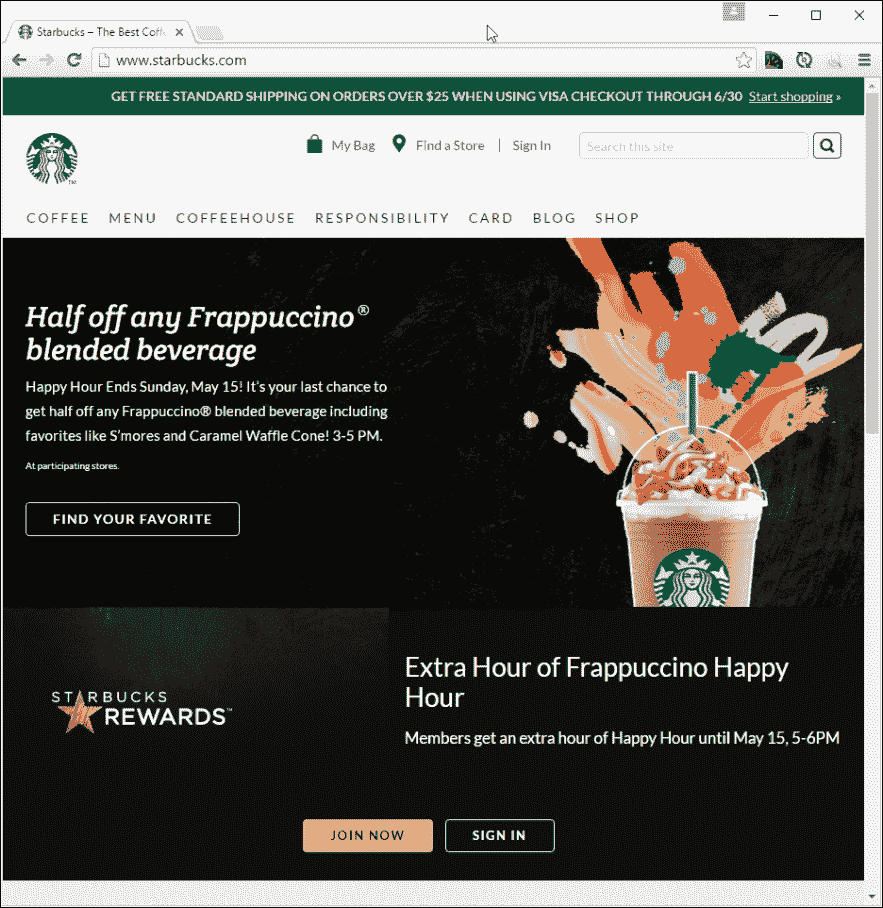

尝试调整浏览器窗口的大小；如果足够小，你将看到类似于这样的东西：

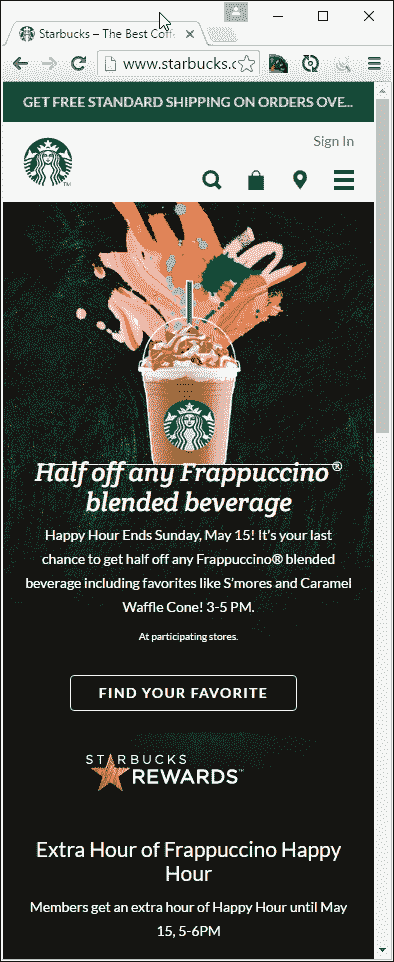

这里有另一个例子——我们不能忘记这本书的出版商 Packt 的网站：

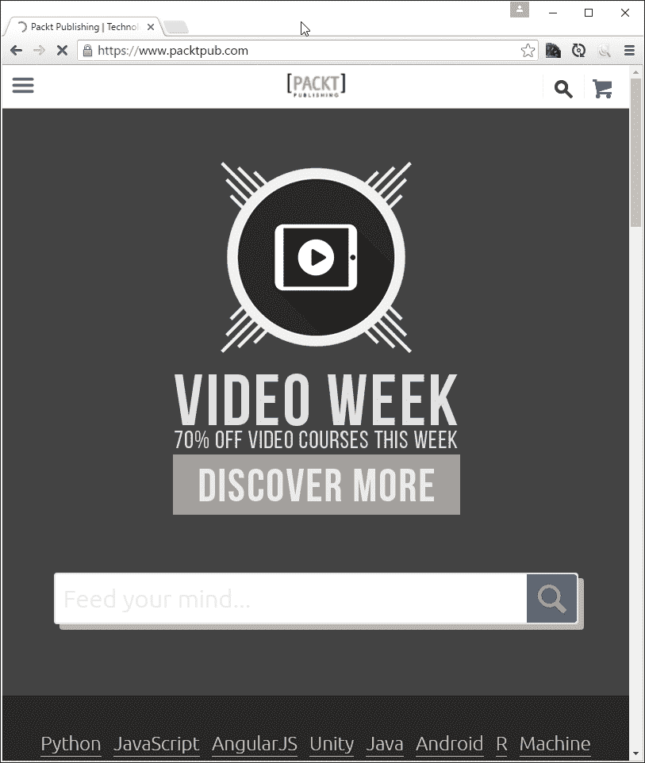

尝试改变浏览器窗口的大小。如果我们调整足够大，它会显示这个：

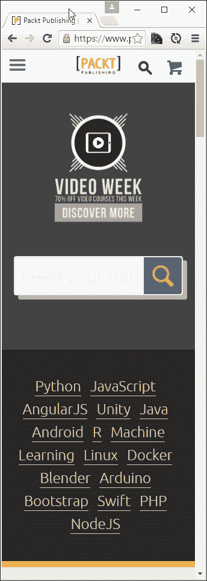

对于我们的第三个和最后一个例子，让我们去访问 CSS Tricks，由克里斯·科耶尔创建的网站，网址为[`www.css-tricks.com`](http://www.css-tricks.com)：

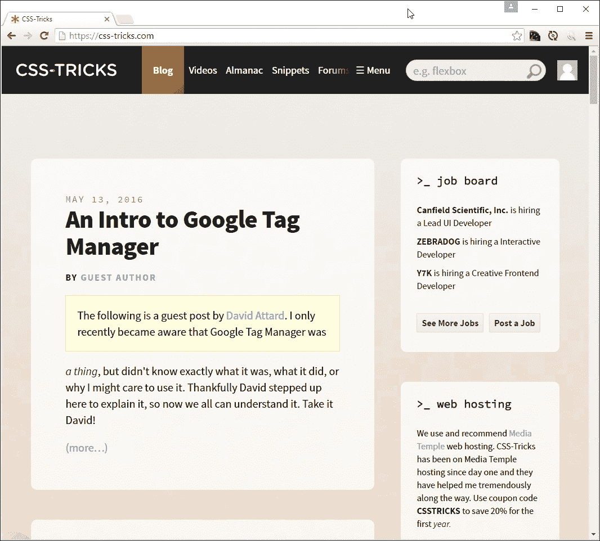

如果我们将其调整为更小的宽度，我们将得到这样的结果：

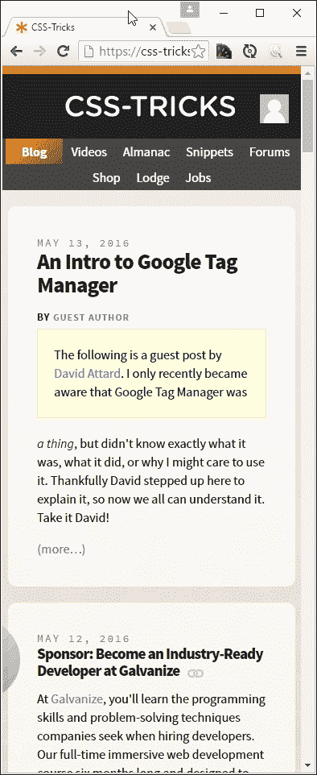

现在，你可能会问，这一切的意义是什么？嗯，很简单。所有这些都以某种形式使用媒体查询；CSS Tricks 使用 WordPress 内置的查询，Packt 的网站使用 Drupal 托管，星巴克的网站则基于 Handlebars 模板系统。

关键在于所有的使用媒体查询来确定应该显示什么；在本章的过程中，我们将更详细地探讨如何使用它们来更好地管理响应式网站中的内容。让我们开始更详细地探索它们的构成。

# 了解媒体查询

开发者布鲁斯·李完美地总结了媒体查询的效果，就像水在不同容器中的表现：

*清空你的思绪，成为无形无象的，如水。现在你把水放入杯子中，它就成了杯子；你把水放入瓶子中，它就成了瓶子；你把水放入茶壶中，它就成了茶壶。现在水可以流动也可以撞击。做水，我的朋友。*

我们可以使用媒体查询来应用不同的 CSS 样式，基于可用的屏幕空间或特定设备特征。这些特征可能包括但不限于显示类型、屏幕分辨率或显示密度。媒体查询的工作原理是测试某些条件是否为真，使用以下格式：

```html
   @media [not|only] [mediatype] and ([media feature]) {
       // CSS code;
    }
```

我们可以使用类似的原则来确定是否应该加载整个样式表，而不是单独的查询：

```html
<link rel="stylesheet" media="mediatype and|only|not (media feature)" href="myStyle.css"> 

```

看起来很简单，对吧？媒体查询的好处在于我们不需要下载或安装任何额外的软件来使用或创建它们；我们可以直接在浏览器中构建大部分媒体查询。

## 探索可用的媒体类型

如果我们看一下前一节中的示例查询，我们会发现它的一部分是由正在使用的媒体类型组成的。这只是查询的一部分。所有媒体查询分为两部分，第一部分控制我们的 CSS 将如何显示，第二部分负责何时显示它。

看看这个例子：

```html
<!-- CSS media query on a link element --> 
<link rel="stylesheet" media="(max-width: 800px)" href="example.css" /> 

<!-- CSS media query within a stylesheet --> 
<style> 
@media (max-width: 757px) { 
  .sidebar { 
    display: none; 
  } 
} 
</style> 

```

这说明了引用媒体查询的两种方式：第一个示例没有指定媒体类型，因此我们可以推断默认情况下是所有；它的第二部分说明了当窗口宽度至少为`800px`时才适用。 

第二个媒体查询也没有指定媒体类型，因此默认情况下会被推断为所有；这次，如果窗口宽度小于`600px`，`.sidebar`元素将不会显示。

让我们看看可以使用哪些媒体类型：

| **值** | **用于** |
| --- | --- |
| `all` | 所有类型的媒体 |
| `print` | 打印机或打印媒体内容 |
| `screen` | 屏幕/显示器（如计算机、手机或平板电脑） |
| `speech` | 屏幕阅读器 |
| `braille` | 盲文触觉反馈设备 |
| `embossed` | 凸版盲文打印机 |
| `handheld` | 手持设备，不包括智能手机和平板电脑，它们使用`screen`代替 |
| `print` | 分页材料和在屏幕上以打印预览模式查看的文档 |
| `projection` | 投影演示 |
| `screen` | 彩色计算机屏幕和智能手机 |
| `speech` | 语音合成器 |
| `tty` | 使用固定间距字符网格的媒体（如电传打字机、终端或具有有限显示能力的便携设备） |

此外，我们还有许多功能可以用来控制显示内容的触发器；值得了解它们，因为它们都起着重要的作用，但工作方式不同。让我们更详细地看一下列表，并逐个了解它们的作用。

## 列出可用的媒体特性

添加一个指定媒体目标的查询只是一半的工作；我们还需要给它一些控制何时显示的条件！为了实现这一点，我们可以提供一个或多个必须满足的条件，以便对内容进行样式化或显示。

让我们看看一些可用的选项：

| **属性名称** | **描述** |
| --- | --- |
| `aspect-ratio` | 视口的宽高比 |
| `device-aspect-ratio` | 设备的宽高比 |
| `device-[height&#124;width]` | 设备屏幕的高度或宽度 |
| `height` | 视口的高度 |
| `min-device-pixel-ratio` | 检查设备的像素比率。适用于高清和视网膜设备（比率大于 2 的情况） |
| `[min&#124;max]-aspect-ratio` | 视口的最小或最大宽高比 |
| `[min&#124;max]-device-aspect-ratio` | 设备的最小或最大宽高比 |
| `[min&#124;max]-device-height` | 设备的最小或最大高度或宽度 |
| `[min&#124;max]-width` | 视口的最小或最大宽度 |
| `orientation` | 视口的纵向或横向方向 |
| `resolution` | 设备的分辨率（以 dpi 或 dpcm 为单位） |
| `width` | 视口的宽度 |

关键在于选择正确的属性来运行我们的测试；一个很好的例子是检查方向，以便我们可以确定平板电脑是纵向还是横向模式。我们将在本章后面充分利用其中一些查询测试。

好的，是时候继续了。到目前为止，主题是仅使用浏览器和文本编辑器可以实现的内容。这一开始可能看起来有限，但我坚持认为，许多人在创建查询时过于依赖额外的帮助（如使用 jQuery），而这并不总是必要的。主要情况下这样做是有效的，但有一些要考虑的地方：

+   您是否需要支持 IE8 或更低版本？如果是这样，那么我们需要为此提供额外的支持；然而，微软在 2016 年初做出的决定意味着 IE8 不再受支持，所以现在是真正考虑这个浏览器是否应该出现在您的设计中的时候了。

+   对于一些较新的媒体查询，比如最大分辨率，只在较新的浏览器中可用；值得检查 CanIUse.com 网站和服务器日志，以确认不支持旧浏览器是否会成为一个问题。

+   如果我们需要提供备用支持，那么不要自动假设这意味着我们必须使用基于 JavaScript 的解决方案；值得考虑您需要提供的支持，以及您是否真的需要使用媒体查询（稍后会详细介绍）。

好的，让我们继续：是时候进行实际操作，投入更实际的事情了！我们已经涵盖了构成查询的不同方面，并探讨了在仅使用浏览器和文本编辑器时需要考虑的一些因素。不过，在我们进行实际操作之前，我们需要涵盖另一个主题。有时我们需要测试多个条件。我们可以使用逻辑运算符来实现这一点。让我们快速更详细地看一下其中一些。

## 在我们的查询中引入运算符

当编写需要多个测试的媒体查询时，我们可以使用逻辑运算符来确认一个或多个 CSS 规则是否应用于我们的内容。如果我们使用逻辑运算符，我们需要将每个被测试的属性封装在括号中；否则，它将在我们的代码中生成错误。

让我们来看一些更常见的运算符的例子：

+   **And**：它用于将多个媒体类型或媒体特性组合成一个复杂的查询。它的工作方式与算术和运算符一样，也就是说，需要每个条件都为真才能执行查询。

+   **Not**：我们可以使用它来否定一个查询。它适用于整个媒体查询，只有整个查询否则会返回 false 时才起作用（比如在`600px`显示器上对`min-width: 700px`的应用）。这个运算符必须与媒体类型一起使用。

+   **Only**：它用于仅在需要在旧浏览器中阻止应用选定样式时应用样式。

### 提示

媒体查询是区分大小写的，如果遇到未知的媒体类型，将返回 false。

到目前为止，我们已经讨论了媒体查询的基础知识：让我们探讨如何使用它们来通过识别我们的设计在不同屏幕尺寸下出现问题的地方来管理内容。这些断点，或者**断点**，是媒体查询起作用的关键 - 尽管很明显我们需要正确地设置它们，但也很重要的是要知道何时应该使用它们，何时不应该使用它们...

# 识别常见的断点

在响应式设计的时代，断点是成功网站的关键；这完全取决于我们定义设计在何处会出现问题，如果我们调整可用屏幕宽度。重要的是要理解没有两个网站会使用相同的查询；尽管如此，有一些我们可以用作设计基础的查询。

我们先从标准桌面开始：

```html
@media only screen and (max-width: 768px){ 
  /* CSS Styles */ 
} 

```

随着手机的迅速崛起，我们不能忘记那些有幸拥有智能手机的人，比如 iPhone：

```html
@media only screen and (min-device-width: 320px) and (max-device-width: 480px) { 
  /* Styles */ 
} 

```

这个查询的缺点是它同样适用于任何足够小以满足给定`*-device-width`尺寸的设备。这不是我们想要的（或者打算的）；为了在移动设备和桌面之间建立更清晰的分界线，我们可以调整查询如下：

```html
@media only screen and (max-device-width: 320px) { 
  /* Styles - for mobiles in portrait mode */ 
} 

```

这个是用于横向模式的手机：

```html
@media only screen and (min-device-width: 321px) { 
 /* Styles - for mobiles in landscape mode */ 
} 

```

更进一步，我们还可以为平板电脑，比如 iPad，提供支持：

```html
@media only screen and (min-device-width: 768px) and (max-device-width: 1024px) { 
  /* Styles */ 
} 

```

这里也有类似的警告 - 我们没有设置一个足够清晰的阈值，只能应用于平板电脑。我们可以通过添加`orientation`属性来解决这个问题：

```html
@media only screen and (min-device-width: 768px) and (max-device-width : 1024px) and (orientation : portrait) { 
  /* Styles */ 
} 

```

为了完整地了解情况，我们同样可以检查平板电脑内容是否以横向模式显示：

```html
@media only screen and (min-device-width: 768px) and (max-device-width : 1024px) and (orientation : landscape) { 
  /* Styles */ 
} 

```

这些断点只是可以用于向任何网站添加媒体查询的一小部分；这并不意味着我们应该盲目使用它们；我们应该只添加那些允许我们支持目标设备的查询。当然，我们可以添加自定义查询，尽管存在添加多余查询的风险。让我们花点时间考虑添加自定义查询的影响，以及为什么这可能成为我们项目的问题。

### 提示

值得研究一下其他人在网上创建的媒体查询；有数十个示例可供使用，其中一些将针对特定设备，如智能手机或平板电脑。

## 创建自定义断点

我们已经概述的媒体查询应该涵盖各种情况；在这些情况下，我们的网站无法按预期工作。

我们该怎么办？嗯，我们不仅限于使用我们已经涵盖的标准查询；我们绝对可以创建自己的！

创建自定义断点非常容易，只要我们以正确的方式来做；如果做得不正确，我们可能会创建不必要的断点，对其他设备产生有限的用途或意外的连锁效应。为了理解我们的意思，让我们通过一个（理论上的）例子来工作。

想象一下，您的网站已调整到约 335px 左右，我们发现它有点不协调——有一些元素不太合适。为了更好地管理这个断点处的内容，诱惑会是编写这样一个查询：

```html
@media only screen and (max-device-width: 345px){ 
  /* Styles */ 
} 

```

我们会在由“/*样式*/”标头的区域添加我们的更改。

听起来合理，对吧？如果不是因为一件事：我们现在刚刚为宽度低于 345px 的查看设备创建了一整套新问题！

解决这个问题的关键是不要简单地使用更大的像素值，因为这可能会破坏其他设备的布局——包括移动设备，在纵向或横向模式下。正确的解决方法是确定我们的查询失败的确切情况，并调整查询以更好地匹配情况，或者（理想情况下）确定设计本身是否可以进行调整，以避免需要查询。

例如，如果我们的网站在 325px 和 345px 之间出现故障，并且故障仅出现在纵向模式下，我们将创建这样一个媒体查询：

```html
@media only screen and (min-device-width : 325px) and (max-device-width : 345px) and (orientation : portrait) { 
  /* Styles */ 
} 

```

这如何帮助我们？好吧，将我们的查询调整得更明确可以避免与我们可能已经创建的更通用的查询发生冲突。我们还使阈值限制更加清晰；除非我们能同时匹配所有三个条件，否则我们不会触发查询。

## 理解原理

一些开发人员可能会问，为什么我们不只是修复可用的视口；当我们改变方向时，视口的大小也会改变，所以内容肯定会调整以适应，对吧？

嗯，是和不是。这完全取决于理解内容的定位以及我们想要支持的设备类型，除了台式机之外。我们不应忘记，在纵向模式和横向模式下拥有不同布局是完全有效的；试着在 iPad 上的横向和纵向模式下查看 Packt 的网站！

在撰写本文时，纵向模式下显示了一个额外的元素，但在横向方向上却没有。如果纵向模式中的一个元素出现故障并且显示不正确，那么仅指定数字断点将不起作用。为了解决问题，我们还必须指定受影响的方向，否则修复一个模式可能会破坏另一个模式。

## 在设计中小心谨慎

好的，我们已经创建了一堆媒体查询，准备用于实施到网站中。我们可以继续并开始构建一些示例，还是？如果我说暂停一会儿，你很可能会认为我已经失去了理智；但像往常一样，这是有充分理由的。让我解释一下。

使用媒体查询的一个缺点是，没有两个网站会完全相同；这意味着我们不能总是在多个网站中重复使用标准查询。有时我们需要创建自定义断点来满足网站的要求；关键是要知道我们的网站何时何地可能需要额外关注，超出我们网站可能使用的正常断点。

创建自定义的临时查询很容易，但我们确实面临着创建过多的风险，这会削弱响应式设计的整体概念。我们能绕过这一点吗？是的，我们可以；这涉及到我们设计方法的转变，即不再专注于视口尺寸，而是专注于我们的内容。

## 消除断点的需求

到目前为止，我们已经介绍了如何使用断点来控制根据使用的设备显示和隐藏的内容。假设你正在为客户的项目工作，并创建了一系列查询，使用值如 320px、480px、768px 和 1024px 来覆盖对各种设备的支持。

无论我们的设计看起来如何，如果我们专注于使用特定的屏幕视口作为控制设计的基础，我们总会面临两个问题：

+   跟上可用设备的数量

+   限制我们的屏幕宽度的不灵活性

所以，等等。我们创建了断点，但这可能会导致更多问题？如果我们发现自己创建了许多针对特定问题的媒体查询（除了标准的查询），那么我们将开始失去响应式网站的好处；相反，我们应该重新审视我们的网站，了解为什么设计不起作用，并看看是否可以调整它以消除对自定义查询的需求。

最终，我们的网站和目标设备将决定所需的内容——一个好的经验法则是，如果我们创建的自定义查询比标准的四到六个断点多，那么也许是时候重新检查我们的设计了！

作为与特定屏幕尺寸一起工作的替代方案，我们可以采取一种不同的方法，即遵循自适应设计而不是响应式设计的原则。我们的设计是围绕着*设计开始失败*的点构建的，而不是简单地指定一些固定的屏幕尺寸（比如 iPhone 6 Plus 或三星 Galaxy 设备）。

为什么？答案很简单。这里的想法是提出不同的带宽，设计将在较低和较高值之间工作，而不是简单地指定检查低于或高于某些值的固定屏幕尺寸的查询。如果现在还不完全明白，不要担心；现在的关键是我们正在创建设计，这意味着我们可以减少支持如此多的设备的需求。

让我们把这个理论付诸实践，开始创建一些演示来展示我们如何在实践中使用媒体查询。

# 把我们的理论付诸实践

在本章的过程中，我们已经介绍了组成媒体查询的不同部分，就像有人曾经说过的那样，*现在是时候了*。

是的，是时候付诸实践了。在我们开始创建一些真实的例子之前，让我们创建一些可以用来探索添加媒体查询效果的东西。我们将从调整屏幕上的一些简单框开始：

1.  从代码下载中，继续提取`queryexample.html`的副本并保存到我们的项目区域。

1.  在文本编辑器中，继续添加以下样式；我们将从我们的盒子开始一些基本样式：

```html
        body { background-color: #F3ECDD; text-align: center; 
          font-family: Arial, sans-serif; color: #ffffff; 
          min-width: 33%; } 

        .box { width: 100%; background: #905f20; border-radius: 0.625em; 
          margin: 0; } 

        .box2{ min-width: 100%; background: #6b8e6f; border-radius: 
          0.625rem; 
          float: left; } 

        h3:after{ content: ' is less than 30rem'; } 

```

1.  然后我们需要添加我们的媒体查询；在上一个样式规则的结束大括号下面添加这个：

```html
        @media screen and (min-width: 30rem) { 
          body { background-color: #C7B47C; } 

          .box { width: 49.5%; float: left; } 

          .box + .box { margin-left: 1%; margin-bottom: 0.625em;} 

          h3:after{ content: ' is greater than 30rem'; } 
        }  

```

1.  将文件另存为`queryexample.css`，保存到我们项目区域中的`css`子文件夹中。

如果我们尝试通过运行`queryexample.css`来预览我们的工作结果，我们应该会看到类似于这个屏幕截图的东西：

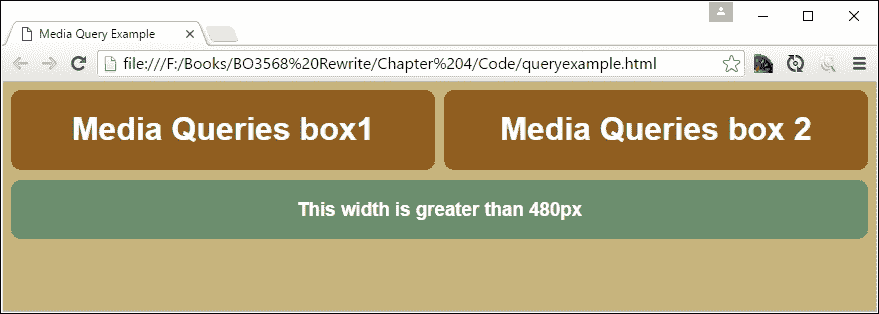

让我们了解一下这里发生了什么。在核心 CSS（第 3 步）中，我们向我们的标记添加了三个`<div>`元素。由于我们给它们设置了`100%`的宽度，并且高度默认设置为`auto`，它们将堆叠成一系列方框。

如果我们像之前一样使用 Chrome 并激活设备模式，那么我们就可以开始看到调整浏览器窗口大小的效果。如果我们将宽度调整到`30rem`以下作为我们的断点（或`480px`），我们可以看到方框重新对齐并同时调整大小；背景也会变成浅棕色：

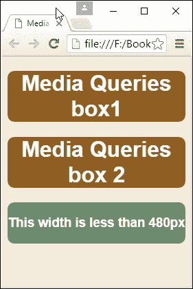

既然我们已经看到了设置查询的基础知识，让我们再进一步，创建一些实际的例子。我们将从设置一个简单的网页开始，然后应用一些简单的媒体查询。

# 创建一些实际的例子

在接下来的几页中，我们将探讨如何充分利用媒体查询；我们将构建两个演示，以说明我们可以使用查询的一些方式。演示本身可能看起来并不复杂，但这并不是坏事；使代码复杂只会使其更脆弱，更容易破坏，并且更难以支持。

让我们来看看我们的第一个演示，它为基本作品集模板页面添加了响应式支持。

## 使其真实

使其真实——多么贴切的标题！有一个很好的理由。在探索新概念时，我最讨厌的之一就是探索一个如此简约的演示，以至于没有包含任何能够真正展现我想要开始在我的开发中使用的功能的东西。

创建媒体查询不应该是一个例外。在我们之前的例子中，我们创建了一些测试查询，以查看当浏览器窗口调整大小时三个方框会如何互动。但要将其放入上下文中，需要更深入一些；探索如何向可能是新站点或现有站点的作品集页面添加类似查询是一个不错的选择。对于我们的第二个演示，我们将创建一个简单的网页模板，然后开始添加和开发查询，以使其可以在移动设备上使用。

### 注意

这里有一个重要的观点。你们中敏锐的人可能会注意到，这不是我们之前在书中提倡的移动优先方法。是的，移动优先绝对是首选的方法，但我们生活在一个可能不可能的世界，我们可能需要为现有站点添加查询支持。即使我们不是按照我们首选的顺序进行操作，下一个演示中使用的媒体查询原则仍然适用。

让我们开始：

1.  首先，我们需要从随附本书的代码下载中提取一些文件；继续保存`responsive.html`，两个`coffeebeans.png`图像（普通和小尺寸）和`video`文件夹到我们项目区域的根目录。将这两个图像移动到此文件夹内的`img`文件夹中。

1.  在一个新文件中，添加以下样式并将其保存为我们项目区域的`css`文件夹中的`responsive.css`。第一组样式创建了我们演示的主文本区域和整体容器：

```html
        #wrapper { width: 96%; max-width: 45rem; margin: auto; padding: 2%; 
          border: 1px solid #000; margin-top: 3rem; border-radius: 0.2rem; 
          margin-bottom: 3rem; } 
        #wrapper > header > img { display: none; } 

        #main { width: 60%; margin-right: 5%; float: left; } 

```

1.  这处理了移动视图顶部的“跳转到…”；现在它是隐藏的，但在媒体查询激活时将可见：

```html
        #skipTo { display: none; } 
        #skipTo li { background: #197a8a; } 
        #skipTo a { color: #fff; font-size: 0.8rem; } 

```

1.  我们需要一些东西来托管我们的视频和横幅图像；这些样式为我们处理了这些：

```html
        #video-wrapper { padding-bottom: 2rem; } 
        #video-wrapper video  { max-width: 100%; } 

        #banner { float: left; margin-bottom: 0.9375rem; width: 100%; } 
        #banner { height: 15rem; width: 44.5rem; background-image: 
          url('../img/coffeebeans.png'); max-width: 100%; }  

```

1.  我们的主演示窗口右侧有一个侧边区域；我们需要一个样式来控制它的尺寸：

```html
        aside { width: 35%; float: right; } 

```

1.  我们的网站中使用了一些链接，主要是按钮的形式。这处理了它们的样式：

```html
        a { text-decoration: none; text-transform: uppercase; } 
        a, img { border: medium none; color: #000; font-weight: bold; 
          outline: medium none; } 

```

1.  网站的一个关键部分当然是导航。这些样式规则管理了基于一些无序列表项的演示：

```html
        header { font-family: 'Droid Sans', sans-serif; } 
        header h1 { height: 70px; float: left; display: block; 
          font-weight: 700; font-size: 2rem; } 
        header nav { float: right; margin-top: 2.5rem; height: 1.375rem; 
          border-radius: 0.25rem; } 
        header nav li { display: inline; margin-left: 0.9375rem; } 
        header nav ul { font-weight: 400; font-size: 1.1rem; } 
        header nav a { padding: 0.3125rem 0.3125rem 0.3125rem 0.3125rem; } 
        header nav a:hover { background-color: #8e5f57; color: #fff; 
          border-radius: 0.25rem; } 

```

1.  最后但同样重要的是，我们需要一些东西来使我们的页脚更具吸引力：

```html
        footer { border-top: 0.0625rem solid #ccc; clear: both; 
          height: 1.875rem; padding-top: 0.3125rem; } 

```

1.  保存文件。现在我们需要添加我们的媒体查询。在我们的样式表中留下两行，然后添加以下代码：

```html
        @media screen and (max-width: 414px) and (orientation: portrait) { 
          #header { background-color: #8e5f57; } 
          #wrapper { min-width: 15.63rem; border: none; margin-top: 0; } 
          #wrapper > header > img { float: right; display: block; } 

          #skipTo { display: none; } 
          #skipTo a { padding: 0.625rem; text-align: center; 
            height: 1.25rem; background-color: #8e5f57; } 

          #main {float: left; clear: left; margin: 0 0 0.625rem; 
            width: 100%; margin-top: 10rem; } 

          #banner { display: none; } 
          aside {float: left; clear: left;margin: 0 0 0.625rem; 
            width: 100%; } 

          header h1 {margin-top: 1.25rem; height: 2.1875rem; } 
          header nav  {float: left; clear: left; margin: 0 0 0.625rem; 
            width: 100%; border-radius: none; } 
          header nav li  {margin: 0; background: #efefef; display: block; 
            margin-bottom: 0.1875rem; height: 2.5rem; } 
          header nav a  {display: block;  padding: 0.625rem; 
            text-align: center; } 
          header nav a:hover { border-radius: none; } 
        }  

```

1.  在第一个媒体查询下面再留出两行空白，然后添加以下代码：

```html
        @media screen and (max-width: 736px) and (orientation: landscape) { 
          #header { background-color: #8e5f57; } 

          #wrapper { min-width: 15.63rem; border: none; margin-top: 0; } 
          #wrapper > header > img { float: right; display: block; } 

          #skipTo { display: none; } 
          #skipTo a { padding: 0.625rem; text-align: center; 
            height: 1.25rem; background-color: #8e5f57; } 
          #main {float: left; clear: left; margin: 0 0 0.625rem; 
            width: 100%; margin-top: 10rem; } 

          #banner { display: none; } 
          aside {float: left; clear: left;margin: 0 0 0.625rem; 
            width: 100%; } 

          header h1 {margin-top: 1.25rem; height: 2.188rem; } 
          header nav  {float: left; clear: left; margin: 0 0 0.625rem; 
            width: 100%; border-radius: none; } 
          header nav li { margin: 0; background: #efefef; display: block; 
            margin-bottom: 0.1875rem; height: 2.5rem; } 
          header nav a  { display: block;  padding: 0.625rem; 
            text-align: center; } 
          header nav a:hover { border-radius: none; }  
        } 

```

1.  保存文件，然后在浏览器中预览结果。最好使用 Google Chrome 或类似的浏览器，比如 Firefox：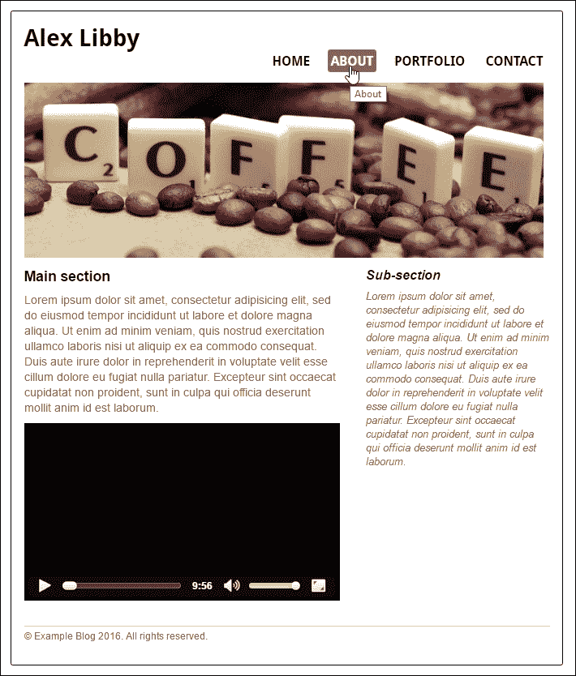

一个非常漂亮的页面，我希望你会同意。它完美展示了我两个最喜欢的东西：我对咖啡的热爱和 Scrabble 棋盘游戏！我总是说咖啡一定是许多开发者武器库中的秘密武器，但我岔开了话题…

尝试调整屏幕大小；举例来说，让我们将其调整为**414 x 736**，或者相当于**iPhone 6 Plus**所需的大小：

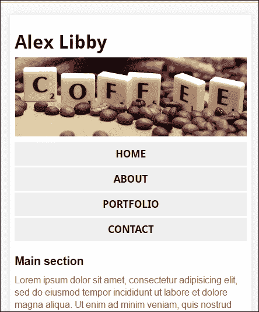

我们可以使用 Chrome 的设备模式将方向切换为横向：

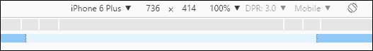

我们可以看到网站重新排列自己：

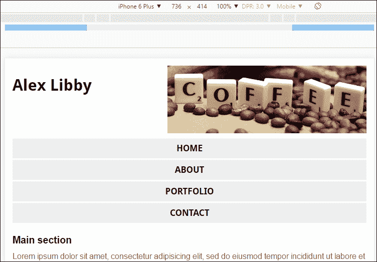

这是一个简单、干净的设计。关键在于我们可以将其作为添加更多支持其他设备的查询的基础。有一些重要的概念我们应该更详细地探讨一下，所以让我们停下来一会儿，看看媒体查询在我们的演示中起到了什么作用。

### 探索发生了什么

这个例子中使用的许多样式是为了美化我们的页面；对我们来说，关键规则从第 33 行和第 50 行开始，在这里我们分别为 iPhone 6 Plus 的纵向和横向模式设置样式。让我们更详细地看看这两个规则：

```html
@media screen and (max-width: 414px) and (orientation: portrait) { 
... 
} 

```

这个规则规定屏幕宽度必须有一个`max-width`小于或等于`414px`；如果它更大并且仍然以纵向模式显示，那么这个规则将不适用。

在这个规则内，我们已经采用了主要块中已经使用的样式，并应用了改变，使我们能够在 iPhone 上查看网站时保持所需的效果。一个完美的例子是`#banner`块；在主要样式中，我们设置了一些属性来将其定位在屏幕上：

```html
#banner { float: left; margin-bottom: 0.9375rem; width: 100%; } 
#banner { height: 15rem; width: 44.5rem; background-image: url('../img/coffeebeans.png');  max-width: 100%; } 

```

然而，这不适合在 iPhone 上显示，更不用说图像的尺寸是 717px x 214px。它还有 102KB！显然，我们不想在移动设备上不断下载这样大的图像（因为互联网访问很可能是按流量计费的），所以我们需要做点别的事情。

相反，我们使用了一个更小的版本，即`coffeebeans-small.png`。这个版本更可接受，只有 33KB，并且在移动设备上以纵向模式查看时位于页面的右上角。我们隐藏了原始版本，因为它不再需要：

```html
@media screen and (max-width: 414px) and (orientation: portrait) { 
... 
  #wrapper > header > img { float: right; display: block; } 
... 
  #banner { display: none; } 
} 

```

一旦我们切换到横向模式使用它，这个规则就会生效：

```html
@media screen and (max-width: 736px) and (orientation: landscape) { 
... 
  #wrapper > header > img { float: right; display: block; } 
... 
  #banner { display: none; } 
} 

```

请注意，我们不需要改变规则。图像保持相同的大小，并且已经设置为向右浮动，所以规则可以简单地重复使用。我们也必须在这里指定它；否则，它将根本不显示。要看到区别，请尝试使用 Google Chrome 模拟 iPad 模式设置演示：

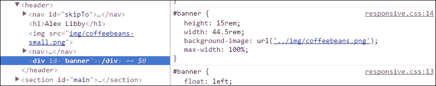

我们可以看到，即使基本代码在`#banner` `<div>`中使用了`coffeebeans-small.png`，我们的媒体查询已经将其替换为`coffeebeans.png`。

### 提示

你可能会注意到，媒体查询的宽度没有以 rem 单位设置；这纯粹是为了与 Chrome 中的设备工具匹配。如果你愿意，你可以很容易地将它们设置为 rem 单位。

我们特意保持了演示中的规则简单；它们说明了我们如何在不费吹灰之力的情况下，让我们的页面在桌面、iPhone 6 纵向和 iPhone 6 横向模式下完美显示。然后我们可以重复相同的原则来扩展支持覆盖其他设备；关键是要确保我们使用的断点覆盖了足够多的设备，这样我们就不必在网站上添加更多不必要的内容。

现在让我们改变方向，但仍然与苹果主题保持一致。不，我不是在想食物！你们有多少人幸运地拥有 iPad？如果答案是肯定的，那么下一个演示将会很有趣。对于许多标准设备，我们在显示图像时受到分辨率的限制。

输入一个很棒的技巧。如何显示更高分辨率的图像？我们不需要下载任何东西来帮助实现这一点。大多数现代浏览器都可以直接实现这一点；我们只需要适当的媒体查询来告诉浏览器何时使用它们。

## 检测高分辨率图像支持

移动设备的出现（有些人可能会说是流行的崛起）带来了一个机会，支持更高分辨率的图像。

大多数用户无法在标准 PC 上区分单个像素。在典型距离下查看时，一些网站可能会显得太小而无法使用！相反，PC 将恢复到更真实的分辨率，例如 1,440 像素。

为了获得更流畅的视图，一些设备会打包额外的像素；这样做会使单个像素更难以查看，并且图像看起来非常清晰。这是由苹果发起的，他们将其营销为 Retina 显示屏；其他公司也开始效仿并制造能够支持高分辨率图像的设备。

幸运的是，我们不需要昂贵的 iPhone 或 iPad 来添加支持。我们可以通过媒体查询来实现这一点，并使用 Chrome 的设备工具来模拟测试。要了解如何操作，让我们创建一个简单的演示，切换两张蝴蝶兰植物的图像。为了知道显示哪张图像，每张图像都会在右上角显示分辨率：

1.  首先，打开你的普通文本编辑器，然后添加以下代码并将其保存为`min-resolution.css`：

```html
        <!DOCType html> 
        <html> 
        <head> 
          <meta charset="utf-8"> 
          <link rel="stylesheet" type="text/css" 
            href="css/min-resolution.css"> 
        </head> 
        <body> 
          <div id="orchid"></div> 
        </body> 
        </html> 

```

1.  继续创建一个名为`css`的单独文件夹。在其中，将以下代码保存为`min-resolution.css`：

```html
        #orchid {  
          background-image: url('../img/mothorchid.png');  
          height: 24.31rem; 
          width: 36.5rem; 
        }  

        @media (min-resolution: 120dpi) {  
          #orchid {  
            background-image: url('../img/mothorchid@2x.png');  
            height: 24.31rem; 
            width: 36.5rem; 
          }  
        } 

```

1.  我们还需要一个图像文件夹。将其创建为`img`，与`css`文件夹处于同一级别。

1.  从随书附带的代码下载中提取`mothorchid.png`和`mothorchid@2x.png`的副本，然后保存到`img`文件夹中。*不要更改它们的名称！*

1.  继续预览我们文件的结果。如果一切正常，我们将看到类似于这个屏幕截图的东西：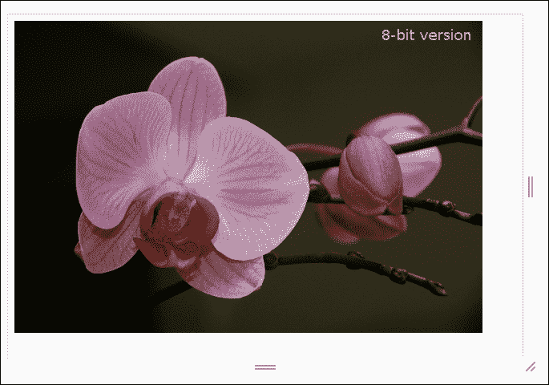

1.  要确认显示的大小，首先按***Ctrl* + *Shift* + *I***激活开发者工具栏。然后按***Ctrl* + *Shift* + *M***启用设备模式。我们将看到类似于这样的工具栏出现：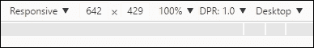

这里有两点需要注意的地方——一个是左边的设置（**响应式**），另一个是 DPR 或设备像素比。要触发显示更高分辨率的图像，尝试将左边的设置更改为**iPhone 6 Plus**：

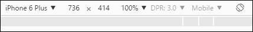

注意 DPR 设置已经跳到`3.0`，我们的图像也已经改变：

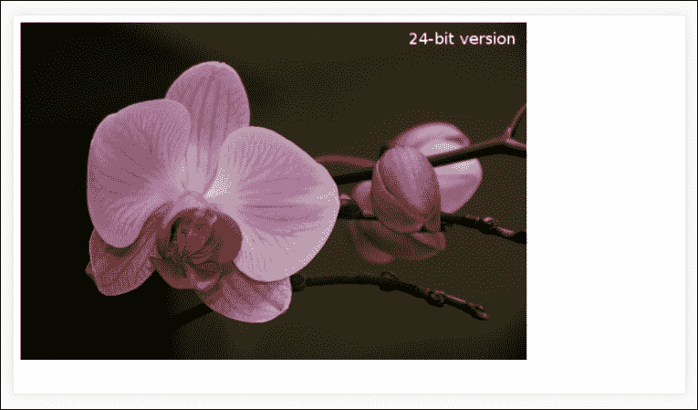

希望你会同意这是一种简单的添加支持的方法。使用 Chrome，我们可以很好地展示高分辨率图像将会是什么样子；值得注意的是，它仍然应该在真正的设备上进行测试，因为即使是谷歌也无法完全在他们的浏览器内模拟特定的设备！

### 探索它是如何工作的

在这一点上，我相信你会问这一切是如何运作的。这是一个简单的技巧。关键在于我们在演示开始时使用的图像命名约定。

还记得我说过它们应该保存为从代码下载中保存的样子，不要更改名称吗？这样做的原因是我们在演示中使用了这一点。苹果设备（自 iOS4 以来）期望在文件名中看到`@2x`来表示高分辨率图像：

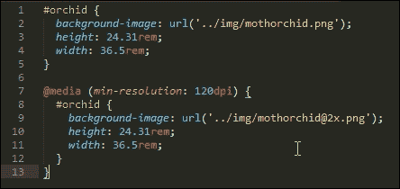

然后，我们利用我们的媒体查询，只有在检测到我们的`min-resolution`为`120dpi`或更高时，才设置为显示更高分辨率的图像。

### 注意

另外，你可能会看到`min`/`max-device-pixel-ratio`被使用。这是为了支持最近版本的 Safari。所有其他浏览器都可以使用`min-resolution`而没有问题，尽管并非所有浏览器都支持也可以使用的`dppi`或`dpcm`单位格式。

媒体查询的强大之处在于我们可以为那些可以支持更高分辨率图像的设备定制支持；如果设备无法支持，那么可以显示标准分辨率图像。

好的，现在让我们改变方向。尽管编写媒体查询是一项简单的任务，但在某些情况下，即使是最好的开发人员也可能做得不太对！这可能是从缺少视口标签到无意中编写相互冲突的查询等任何事情。让我们花点时间探索一些更常见的可能让我们犯错的地方，并看看一些指针，以帮助我们重新回到正轨。

# 检查一些常见的错误

在创建网站时，特别是响应式网站，很容易犯错；毕竟，学习任何新技术都是如此；我们一开始并不完美！

为了帮助您迈出响应式构建和创建媒体查询的第一步，让我们花点时间探索一些更常见的错误，了解它们为什么会引起问题，并通过一些指针来避免这些问题：

+   **不包括视口标签**：这是最常见的错误之一。在移动设备上工作时，如果我们希望它们在不缩放的情况下显示，我们必须包括此标签：

```html
        <meta name="viewport" content="width=device-width, initial-scale=1″> 

```

如果不包括该标签，则文本将显示得更小，因为移动设备默认会缩放页面。

+   **语法错误**：是的，这个老掉牙的问题是问题的另一个常见原因！尽管可能看起来很困难，但错误地输入查询可能会引发错误，特别是对于那些刚开始编写媒体查询的人来说。这里没有对与错的答案。这是一个在编写代码时要小心的问题；复制和粘贴。您可以查看 CSS Media Queries 网站（[`cssmediaqueries.com/`](http://cssmediaqueries.com/)）以获取大量可用的示例。

+   **包容性媒体查询**：让我们看一下这两个查询。乍一看，它们看起来完全合理，不是吗？毕竟，两者都设置为仅在屏幕显示，并且只有在屏幕尺寸大于`767px`时才会显示：

```html
        @media screen and (max-width: 767px) {
          h1 { 
          font-size: 30px; 
          }
        }
        @media screen and (min-width: 767px) {
          h1 { 
          font-size: 40px 
          } 
        } 

```

问题是，我们在这里仍然存在一个问题。如果我们在样式表中设置这两个查询，那么如果我们的屏幕空间为`767px`或更大，它们都会生效。最好的情况是，我们可能最终得到`h1`为`40px`（而不是`30px`）；最坏的情况是，我们会得到一些奇怪的效果！在设置媒体查询时要小心。确保您的查询不重叠。

+   **特异性和继承顺序**：继续讨论重复选择器的主题（在某种意义上），我们可能会遇到的另一个陷阱是继承。例如，假设我们指定了这两个属性：

```html
        h3 {color: darkred;}
        h3 {color: #f00;}
```

我们将会有什么颜色？如果你说是深红色，那么准备好惊喜；答案实际上是`#f00`或绿色。为什么这会给我们带来问题？如果我们写了几个媒体查询，但没有在断点上小心，或者没有正确规划我们的查询顺序，那么我们可能会多添加一个赋值。记住，如果两个选择器应用于同一元素，则具有更高特异性的选择器获胜。

在处理媒体查询时，很容易过度思考问题。在许多情况下，只需要一点预见和小心，我们就可以制定一些有用的规则，以在移动设备上管理我们的内容，而不会有太多重叠。

让我们改变方向继续前进。假设我们编写的任何代码在语法上都是正确的，现在是一个探索编写媒体查询时可以遵循的一些准则的好机会。尽管下一节的标题是*探索最佳实践*，但我个人讨厌这个短语。它是一个被滥用到死的短语！相反，把它们看作是一些友好的提示，以帮助改进您编写查询时的初级技能。这完全是探索可能性的艺术，同时平衡更实际的需求，比如我们的目标市场和支持的设备。

# 探索最佳实践

啊，使用这个短语让我感到不舒服！太多人在谈论某一主题时，总是认为自己的做法是最佳实践。

话虽如此，在创建媒体查询时，有一些有用的技巧可以使用；这不仅仅是遵循最佳实践，同样也是为了让自己更轻松地展示正确的内容在正确的设备上的正确时间：

+   设计媒体查询时，始终从小处着手。这样可以避免浏览器下载仅在较大屏幕尺寸下才需要的不必要元素。虽然也可以从大处着手，但通常需要大幅减少内容，并且不太容易管理。

+   在设计查询时，不要立即认为您必须在移动设备上包含来自桌面站点的所有内容。有时这样做并不合理。往往情况是，没有足够的空间或带宽来支持这样做！重要的是要考虑您正在构建的站点的上下文，以确保包含适当的内容。

+   要充分考虑内容的优先级。例如，在博客网站上，我们经常看到文章摘要旁边有图片。这些在较小的屏幕上显示效果不佳，因此考虑删除这些图片，只留下文章的详细信息、发布时间、作者照片等。我们仍然可以传达我们的信息，只需对设计进行一些简单的调整。

+   在使用媒体查询时要小心图片。页面大小正在增加，因此非常重要的是我们在查询中引用正确的图片。同样，如果我们有轮播等效果，那么我们应该考虑用静态图片替换它；这意味着我们可以显著减小页面的大小，因为大部分图片可以被移除。

+   不要试图迎合市场上的每一种设备；2015 年的研究显示，安卓设备有超过 24,000 种不同的型号，导致市场高度分散，几乎不可能完全支持。再次强调，服务器日志将有助于识别访问您网站的设备。通过检查这些日志，可以确定您应该关注的主要移动浏览器。

+   在设计时，考虑使用 em（或更好的 rem）单位。像素值在正常设计中效果很好，但在响应式站点中缩放时效果不佳。如果我们使用 em（或 rem）值，这将允许浏览器根据使用的缩放级别自动调整我们站点的设计。

+   使您的导航可伸缩。清晰和一致性应该优于与桌面站点相似。不要害怕使用与桌面站点完全不同的东西；清晰和导航的便利性应该优于其他因素，比如颜色。

+   尽可能使用图标和字体，甚至 SVG 图像。这些比标准图像更易于缩放，特别是在使用媒体查询时。我们甚至可以使用 CSS 更改后者的内容，并仍然保持清晰的图像。

+   注意字体大小。我们绝对可以使用媒体查询来显示更大或更小的字体，这取决于我们可用的屏幕空间。但需要注意的是，如果我们使用百分比值或 em/rem 单位，那么这些将更好地进行缩放，甚至可能无需使用媒体查询来处理字体。

+   注意视觉障碍用户，如红绿色盲。移动设备上的可用屏幕视口已经较小；如果字体大小不适应缩放，或者您选择了对比度较大的颜色，比如红色背景上的白色文字，您的用户肯定不会感谢您！

我们可以通过简单使用文本编辑器、浏览器和一些仔细的规划来完成很多事情。不过，很棒的是我们可以使用媒体查询来帮助实现这些建议中的许多。只是需要规划，这样我们就不会创建比需要的查询更多的查询！

让我们继续。在本章中，我们专注于只使用浏览器和文本编辑器来创建查询时可能的情况。我坚信太多人简单地求助于最近的库来帮助构建我们的查询；是时候回归基础了！

话虽如此，也许会有一些情况下我们需要使用 jQuery 或特定的库来帮助生成我们的查询。一个经典的例子是为旧版本浏览器提供支持，尽管不得不说是否仍然需要支持旧技术还是值得商榷的。不过假设我们有一个有效的需要使用库，让我们花一两分钟来探索一些可用的选项，以帮助创建那些不能简单使用 CSS 满足的查询。

# 深入探讨

在许多情况下，我们可以通过使用文本编辑器和浏览器来满足我们的需求；后者的设备模式（或响应模式）将在创建完全有效的查询方面发挥重要作用，这将适用于许多网站。

然而，有时这还不够。我们可能需要依赖额外的帮助来支持特定项目的媒体查询。然而，必须要问一下，这是否真的有必要，而不仅仅是找借口偷懒。最近浏览器中的媒体查询支持非常稳固！

话虽如此，如果我们必须使用外部帮助，那么在线上有很多选择。让我们来看几个例子：

+   **纯 JavaScript 或 jQuery**：不言而喻，但大多数解决方案将基于这两种技术之一；当然，这些将是明显的选择！不过需要注意的是，jQuery 始终是为了补充网站而设计的，并不是网站设计的核心部分；由于这个原因，有人可能会认为使用 jQuery 创建媒体查询不是一个好的用途。

+   **.resizr** ([`resizr.co/`](http://resizr.co/))：这个网站是我们可以用来感受我们的网站在各种移动设备上可能运行情况的众多网站之一；它依赖于您的网站可以访问互联网，并且没有什么可以替代真实的情况！不过这是一个很好的开始，所以当您在真实设备上测试您的网站时，这应该意味着许多基本问题已经解决了。

+   **我的设备像素比是多少？**：托管在[`devicepixelratio.com/`](http://devicepixelratio.com/)，这个工具可以计算出您的屏幕设备比例设置能够支持的内容。这对于我们可能想要使用高分辨率图像的情况非常适用。毕竟，如果您选择的设备无法显示它们，那就没有使用它们的意义了！

+   **Mediaqueri.es**：托管在[`mediaqueri.es/`](http://mediaqueri.es/)，这个网站应该是任何开发者的武器库。它展示了使用媒体查询和 RWD 的启发式网站。

+   **Modernizr**：可从[`www.modernizr.com`](http://www.modernizr.com)获取，我们可以使用这个库来测试媒体查询的支持；另一种选择是使用`@supports`指令。在大多数情况下，可能是旧版本的 IE 会引起问题。如果我们仔细规划我们的网站，也许可以通过为 IE 提供一个基本网站，并在其他浏览器上添加额外的功能来设计出不需要这两者的需求。

+   **Restive.js**：来自[`restivejs.com/`](http://restivejs.com/)，这个基于 jQuery 的插件是一个真正的多功能工具，可以让您为网站的不同方面添加响应式支持。

+   **响应式设计模式**：总部位于美国的 Code My Views 公司为响应式设计创建了许多模式；一旦你更习惯于使用媒体查询，这可能值得一看。你可以在[`codemyviews.com/blog/5-really-useful-responsive-web-design-patterns`](https://codemyviews.com/blog/5-really-useful-responsive-web-design-patterns)上看到更多细节。

无论你决定走哪条路，网上都有很多选项可供选择，以帮助开发你的媒体查询。关键在于要确保，如果你要添加额外的库，那么这对你的网站来说是正确的选择；这可能主要取决于你的项目是否必须支持 IE8 等旧浏览器。这个浏览器自 2009 年以来一直存在，真的应该永远被淘汰！

# 总结

创建媒体查询打开了无限的可能性；我们不必在每个设备上显示页面的每个元素，因此我们可以根据访问者使用的设备来选择展示什么！在这一章中，我们通过使用浏览器和文本编辑器介绍了许多有用的技巧，所以让我们花点时间回顾一下我们学到了什么。

我们以一个快速的互动演示开始，以说明一些知名网站如何使用媒体查询来重新排列屏幕上的内容，然后探讨了媒体查询的构造方式。

然后我们看了一些不同类型。这包括覆盖我们可以使用的媒体类型和功能，以控制内容的显示方式。然后我们转向了一些我们可能在代码中使用的常见断点语句，然后探讨了我们可能需要为特定目的创建自定义断点。我们还看到，如果我们对代码进行一些简单的更改，甚至可以减少或删除断点。

接下来是更实际地使用媒体查询。我们探讨了如何使用它们使简单页面上的内容在移动设备上正确显示（允许其方向）。然后我们讨论了如何使用媒体查询来控制我们在屏幕上显示标准或高分辨率的图像。

然后我们总结了一些我们可能会犯的常见错误，并讨论了一些可供选择的选项，一旦我们更习惯为我们的网站创建媒体查询，我们就可以使用这些选项。

哇，我们已经完成了技术开发的部分；作为我们创建响应式网站旅程的一部分，还有一个主题我们应该涵盖。如果解决方案不高效，那就没有意义。如果网站加载需要很长时间，你的访问者不会感谢你！我们可以通过一些简单的技巧来解决这个问题，作为优化我们的代码的一部分。我们将在下一章中探讨这个主题，以及更多内容。
