# 第六章：使用 LESS 完善响应式作品集网站

*在前一章中，我们使用 HTML5 和一些 Bootstrap 插入类构建了作品集网站的结构。你可能已经看到，网站还没有装饰。我们还没有编写自己的样式或将样式表链接到页面上。因此，本章的重点将放在网站装饰上。*

*Bootstrap 主要使用 LESS 来生成其组件的样式。我们将遵循其步伐，也使用 LESS 来为作品集网站设计样式。LESS 带来了许多功能，如变量和混合，这将使我们能够编写更精简和高效的样式规则。最终，你会发现使用 LESS 来定制和维护网站样式比纯 CSS 更容易。*

*此外，我们还使用了一个名为 Jasny Bootstrap 的 Bootstrap 扩展来将侧栏导航包含到作品集网站中。在这个阶段，侧栏导航不会发生任何变化；我们只是设置了 HTML 结构。因此，在本章中，除了编译网站样式，我们还将编译 Bootstrap 和 Jasny Bootstrap 的 JavaScript 库，以使侧栏导航功能正常。*

在本章中，我们将讨论许多内容，包括以下主题：

+   学习基本的 LESS 语法，如变量和混合

+   使用 LESS 的`@import`指令整理样式表引用

+   配置 Koala 以将 LESS 编译为常规 CSS

+   查看源映射以调试 LESS

+   使用 LESS 编写网站自定义样式

+   将 JavaScript 编译为静态 CSS 以激活侧栏导航

# 基本 LESS 语法

LESS（[`lesscss.org/`](http://lesscss.org/)）是由 Alexis Sellier（[`cloudhead.io/`](http://cloudhead.io/)）开发的基于 JavaScript 的 CSS 预处理器，也被称为 CloudHead。如前所述，Bootstrap 使用 LESS 来组合其组件样式，尽管它最近才正式发布了 Sass 版本。我们将遵循 Bootstrap 使用 LESS 来组合我们自己的样式规则和管理样式表。

简而言之，LESS 通过引入一些编程特性（如变量、函数和操作）扩展了 CSS。CSS 是一种简单直接的语言，基本上很容易学习。然而，维护静态 CSS 实际上是非常繁琐的，特别是当我们需要处理成千上万行的样式规则和多个样式表时。LESS 提供的功能，如变量、混合、函数和操作（我们很快将会看到）将使我们能够开发更易于维护和组织的样式规则。

## 变量

变量是 LESS 中最基本的特性。在 LESS 中，变量与其他编程语言一样，用于存储常量或值，可以在整个样式表中无限制地重复使用。在 LESS 中，变量用`@`符号声明，后面跟着变量名。变量名可以是数字和字母的组合。在下面的示例中，我们将创建一些 LESS 变量来存储一些十六进制格式的颜色，并在接下来的样式规则中分配它们以传递颜色，如下所示：

```html
@primaryColor: #234fb4;
@secondaryColor: #ffb400;
a {
  color: @primaryColor;
}
button {
  background-color: @secondaryColor;
}
```

使用 LESS 编译器（如 Koala），上述代码将被编译为静态 CSS，如下所示：

```html
a {
  color: #234fb4;
}
button {
  background-color: #ffb400;
}
```

使用变量不仅仅局限于存储颜色，我们可以用变量来存储任何类型的值，例如：

```html
@smallRadius: 3px;
```

使用变量的一个优点是，如果我们需要进行更改，我们只需要更改变量中的值。我们所做的更改将在样式表中该变量的每次出现中生效。这无疑是一个时间节省者。仔细扫描样式表并逐个进行更改，或者使用代码编辑器的**搜索**和**替换**功能可能会导致意外的更改。

### 注意

您会经常看到术语*compile*和*compiler*。这里的编译意味着我们将 LESS 转换为标准的 CSS 格式，可以在浏览器中呈现。编译器是用来做这件事的工具。在这种情况下，我们使用的工具是 Koala。

## 嵌套样式规则

LESS 让我们可以将样式规则嵌套到彼此之中。传统的纯 CSS 中，当我们想要将样式规则应用于元素，比如在`<nav>`元素下，我们可以以以下方式组合样式规则：

```html
nav {
  background-color: #000;
  width: 100%;
}
nav ul {
  padding: 0;
  margin: 0;
}
nav li {
  display: inline;
}
```

从上面的例子中可以看出，每次我们对`<nav>`元素下的特定元素应用样式时，都要重复`nav`选择器。通过使用 LESS，我们能够消除这种重复，并通过嵌套样式规则来简化它，如下所示：

```html
nav {
  background-color: #000;
  width: 100%;
  ul {
    padding: 0;
    margin: 0;
  }
  li {
    display: inline;
  }
}
```

最终，前面的样式规则将返回相同的结果——只是这次我们更有效地编写了样式规则。

## mixin

mixin 是 LESS 中最强大的功能之一。mixin 通过允许我们创建一组 CSS 属性来简化样式规则的声明，并可以包含在样式表中的其他样式规则中。让我们看一下以下代码片段：

```html
.links {
  -webkit-border-radius: 3px;
  -mox-border-radius: 3px;
  border-radius: 3px;
  text-decoration: none;
  font-weight: bold;
}
.box {
-webkit-border-radius: 3px;
  -moz-border-radius: 3px;
  border-radius: 3px;
  position: absolute;
  top: 0;
  left: 0;
}
.button {
  -webkit-border-radius: 3px;
  -mox-border-radius: 3px;
  border-radius: 3px;
}
```

在上面的例子中，我们在三个不同的样式规则中声明了`border-radius`，并加上了供早期版本的 Firefox 和基于 Webkit 的浏览器使用的供应商前缀。在 LESS 中，我们可以通过创建 mixin 来简化`border-radius`的声明。在 LESS 中，mixin 只需用一个类选择器来指定。根据上面的例子，让我们创建一个名为`.border-radius`的 mixin 来包含`border-radius`属性，如下所示：

```html
.border-radius {
  -webkit-border-radius: 3px;
  -moz-border-radius: 3px;
  border-radius: 3px;
}
```

之后，我们将`.border-radius`包含到后续的样式规则中，将包含的属性传递给它们，如下所示：

```html
.links {
  .border-radius;
  text-decoration: none;
  font-weight: bold;
}
.box {
  .border-radius;
  position: absolute;
  top: 0;
  left: 0;
}
.button {
  .border-radius;
}
```

当编译成静态 CSS 时，这段代码将产生与本节第一个代码片段完全相同的输出。

### 参数化 mixin

此外，我们还可以将 mixin 扩展为所谓的**参数化 mixin**。这个特性允许我们添加参数或变量，并使 mixin 可配置。让我们以前面一节中的相同例子为例。但是，这次我们不会分配一个固定的值；相反，我们将其替换为一个变量，如下所示：

```html
 .border-radius(@radius) {
  -webkit-border-radius: @radius;
  -moz-border-radius: @radius;
  border-radius: @radius;
}
```

现在，我们可以将这个 mixin 插入到其他样式规则中，并为每个规则分配不同的值：

```html
a {
  .border-radius(3px);
  text-decoration: none;
  font-weight: bold;
}
div {
  .border-radius(10px);
  position: absolute;
  top: 0;
  left: 0;
}
button {
  .border-radius(12px);
}
```

当我们将其编译成常规 CSS 时，每个样式规则都会应用不同的`border-radius`值，如下所示：

```html
a {
  -webkit-border-radius: 3px;
  -moz-border-radius: 3px;
  border-radius: 3px;
  text-decoration: none;
  font-weight: bold;
}
div {
  -webkit-border-radius: 10px;
  -moz-border-radius: 10px;
  border-radius: 10px;
  position: absolute;
  top: 0;
  left: 0;
}
button {
  -webkit-border-radius: 12px;
  -moz-border-radius: 12px;
  border-radius: 12px;
}
```

#### 在参数化 mixin 中指定默认值

此外，我们可以在参数化 mixin 中指定默认值，这在没有传递参数的情况下会很有用。当我们在 mixin 中设置参数时，就像在前面的例子中所做的那样，LESS 会将参数视为必需的。如果我们没有在其中传递参数，LESS 会返回一个错误。因此，让我们以前面的例子为例，并用默认值，比如`5px`来扩展它，如下所示：

```html
.border-radius(@radius: 5px) {
  -webkit-border-radius: @radius;
  -moz-border-radius: @radius;
  border-radius: @radius;
}
```

前面的参数化 mixin 将默认返回`5px`的边框半径。如果我们在括号内传递自定义值，将覆盖默认值。

### 使用 extend 语法合并 mixin

extend 语法是 LESS 中期待已久的功能。LESS mixin 的一个主要问题是它只是复制 mixin 的包含 CSS 属性，从而产生重复的代码。再次，如果我们处理一个有上千行代码的大型网站，重复的代码量会使样式表的大小变得不必要地大。

在 1.4 版本中，LESS 引入了 extend 语法。extend 语法的形式类似于 CSS 伪类`:extend`。extend 语法将继承包含 mixin 的属性集的 CSS 选择器分组。比较以下两个例子。

首先，我们在没有`:extend`语法的情况下包含一个 mixin：

```html
.border-radius {
  -webkit-border-radius: 3px;
  -moz-border-radius: 3px;
  border-radius: 3px;
}
.box {
  .border-radius;
  position: absolute;
  top: 0;
  left: 0;
}
.button {
  .border-radius;
}
```

上面的 LESS 代码很短，但当它编译成 CSS 时，代码会扩展到大约 17 行，因为`border-radius`属性在每个样式规则中重复或简单复制，如下所示：

```html
.border-radius {
  -webkit-border-radius: 3px;
  -moz-border-radius: 3px;
  border-radius: 3px;
}
.box {
  -webkit-border-radius: 3px;
  -moz-border-radius: 3px;
  border-radius: 3px;
  position: absolute;
  top: 0;
  left: 0;
}
.button {
  -webkit-border-radius: 3px;
  -moz-border-radius: 3px;
  border-radius: 3px;
}
```

在这个第二个例子中，我们将把`:extend`语法应用到同一个 mixin 中：

```html
.border-radius {
  -webkit-border-radius: 3px;
  -moz-border-radius: 3px;
  border-radius: 3px;
}
.box {
  &:extend(.border-radius);
  position: absolute;
  top: 0;
  left: 0;
}
.button {
  &:extend(.border-radius);
}
```

以下是代码转换为普通 CSS 的方式；它甚至比初始未编译的 LESS 代码更短。

```html
.border-radius,
.box
.button {
  -webkit-border-radius: 3px;
  -moz-border-radius: 3px;
  border-radius: 3px;
}
.box {
  position: absolute;
  top: 0;
  left: 0;
} 
```

## 使用数学运算生成值

我们还可以使用 LESS 进行数学运算，如加法、减法、除法和乘法。运算可以非常有用，用于确定长度，比如元素的宽度和高度。在下面的例子中，我们将通过减去填充来计算适当的框宽，以便它适合父容器。

首先，我们将使用`@padding`变量定义填充变量：

```html
@padding: 10px;
```

然后，我们指定框宽并减去`@padding`变量：

```html
.box {
  padding: @padding;
  width: 500px – (@padding * 2);
}
```

请记住，填充占据框的两侧，无论是右和左还是上和下，这就是为什么我们在宽度属性中将`@padding`乘以 2。最后，当我们将这个 LESS 操作编译成常规 CSS 时，这段代码将如下所示：

```html
.box {
  padding: 10px;
  width: 480px;
}
```

在其他情况下，我们也可以对高度属性进行相同操作，如下所示：

```html
.box {
  padding: @padding;
  width: 500px – (@padding * 2);
  height: 500px – (@padding * 2);
}
```

## 使用数学运算和 LESS 函数生成颜色

信不信由你，在 LESS 中，我们可以通过数学运算改变颜色。就像混合颜色一样，只是我们是通过加法、减法、除法和乘法来做的。例如：

```html
.selector {
  color: #aaa + 2;
}
```

编译后，颜色变成了以下样子：

```html
.selector {
  color: #acacac;
}
```

此外，LESS 还提供了一些函数，允许我们将颜色变暗或变亮到一定程度。下面的例子将通过`50%`使`@color`变量中的颜色变亮。

```html
@color: #FF0000;
.selector {
  color: lighten(@color, 50%);
}
```

或者，要使颜色变暗，可以使用`darken()`函数，如下所示：

```html
@color: #FF0000;
.selector {
  color: darken(@color, 50%);
}
```

### 注意

LESS 颜色函数的完整列表可以在 LESS 官方网站的以下页面中找到（[`lesscss.org/functions/#color-operations`](http://lesscss.org/functions/#color-operations)）。

## 引用式导入

这是我在 LESS 中最喜欢的功能之一。引用式导入，顾名思义，允许我们仅作为引用导入外部样式表。在此功能出现之前，使用`@import`指令导入的样式表中的所有样式规则都将被追加，这通常是不必要的。

自从 1.5 版本以来，LESS 引入了`(reference)`选项，将`@import`标记为引用，从而防止外部样式规则被追加。在`@import`后添加`(reference)`标记，如下所示：

```html
@import (reference) 'partial.less'; 
```

### 在导入语句中使用变量

LESS 曾经遇到的一个限制是在`@import`指令中使用变量时（[`github.com/less/less.js/issues/410`](https://github.com/less/less.js/issues/410)）。这是 LESS 中最常请求的功能之一，终于在 LESS 1.4 中得到解决。现在我们可以通过在花括号中命名变量来在`@import`语句中声明变量，例如，`@{variable-name}`。

使用变量和`@import`将允许我们通过变量一次性定义样式表路径。然后，使用变量调用路径，如下所示：

```html
@path: 'path/folder/less/';
@import '@{path}mixins.less';
@import '@{path}normalize.less';
@import '@{path}print.less';
```

这种方法明显比每次导入新样式表时都要添加完整路径更整洁和高效，如下所示：

```html
@import 'path/folder/less/mixins.less';
@import 'path/folder/less/normalize.less';
@import 'path/folder/less/print.less';
```

### 注意

请参考 LESS 官方网站的**导入指令**部分（[`lesscss.org/features/#import-directives-feature`](http://lesscss.org/features/#import-directives-feature)）以获取有关使用 LESS 导入外部样式表的进一步帮助。

## 使用源映射进行更轻松的样式调试

虽然 CSS 预处理器如 LESS 允许我们更高效地编写样式规则，但浏览器仍然只能读取普通的 CSS，这将在调试样式表中出现新问题。

由于浏览器引用生成的 CSS 而不是源文件（LESS），我们可能对样式规则实际在源文件中声明的确切行数一无所知。源映射通过将生成的 CSS 映射回源文件来解决此问题。在支持源映射的浏览器中，您将发现浏览器直接引用源文件。在 LESS 的情况下，浏览器将引用`.less`样式表，如下面的屏幕截图所示：

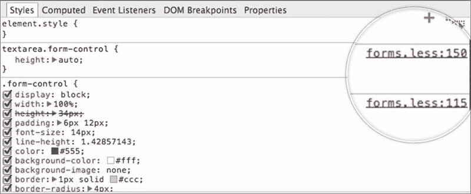

在此项目中，我们将生成生成的 CSS 的源映射。因此，如果我们遇到错误，更容易解决。我们可以立即找出样式规则所在的确切位置。

### 注意

查看以下参考资料，了解有关源映射的更多信息：

+   通过 Google 使用 CSS 预处理器（[`developer.chrome.com/devtools/docs/css-preprocessors`](https://developer.chrome.com/devtools/docs/css-preprocessors)）

+   源映射简介（[`blog.teamtreehouse.com/introduction-source-maps`](http://blog.teamtreehouse.com/introduction-source-maps)）

+   使用 LESS 源映射（[`roots.io/using-less-source-maps/`](http://roots.io/using-less-source-maps/)）

## 更多关于 LESS 的信息

LESS 有很多功能，并且将在未来不断增加更多功能。在本书中一次性包含并讨论所有这些功能是不切实际的。因此，以下是一些深入了解的参考资料：

+   LESS 的官方网站（[`lesscss.org/`](http://lesscss.org/)）；了解 LESS 的最佳来源

+   *LESS Web Development Essentials*，*Bass Jobsen*，*Packt Publishing*（[`www.packtpub.com/web-development/less-web-development-essentials`](https://www.packtpub.com/web-development/less-web-development-essentials)）

+   即时 LESS CSS 预处理器（[`www.packtpub.com/web-development/instant-less-css-preprocessor-how-instant`](https://www.packtpub.com/web-development/instant-less-css-preprocessor-how-instant)）

# 外部样式表引用

在前一节中，我们介绍了 LESS 的大量基本语法。现在，我们将开始实际使用 LESS，说到这一点，在我们能够编写自己的样式规则以及重用 Bootstrap 和 Jasny Bootstrap 包中提供的变量、mixin 和函数之前，我们必须使用 LESS 的`@import`指令将它们导入到我们自己的样式表中。

# 行动时间-创建样式表和组织外部样式表引用

执行以下步骤来管理样式表引用：

1.  转到项目目录，并在`assets/less`目录中创建一个名为`var-bootstrap.less`的新样式表。此样式表包含 Bootstrap 预定义变量的副本。此副本将允许我们自定义变量，而不影响初始规范。

1.  因此，在`/bootstrap/less`目录的`variables.less`样式表中复制 Bootstrap 变量。将所有变量粘贴到我们在步骤 1 中创建的`var-bootstrap.less`中。

### 提示

为了方便起见，您还可以直接从 Github 存储库中复制 Bootstrap 变量（[`git.io/7LmzGA`](http://git.io/7LmzGA)）。

1.  创建一个名为`var-jasny.less`的新样式表。与`var-bootstrap.less`类似，此样式表将包含 Jasny Bootstrap 变量的副本。

1.  获取`jasny-bootstrap/less`目录中的`variables.less`中的 Jasny Bootstrap 变量。将所有变量粘贴到我们在步骤 3 中刚创建的`var-jasny.less`样式表中。

### 提示

或者，直接从 Jasny Bootstrap 存储库中复制变量（[`git.io/SK1ccg`](http://git.io/SK1ccg)）。

1.  创建一个名为`frameworks.less`的新样式表。

1.  我们将使用此样式表来导入`bower_component`文件夹中的 Bootstrap 和 Jasny Bootstrap 样式表。

1.  在`frameworks.less`中，创建一个名为`@path-bootstrap`的变量来定义路径，指向名为`less`的文件夹，其中包含 Bootstrap 的所有 LESS 样式表：

```html
@path-bootstrap: '../../bower_components/bootstrap/less/';
```

1.  同样地，创建一个定义路径的变量，指向 Jasny Bootstrap 的`less`文件夹，如下所示：

```html
@path-jasny: '../../bower_components/jasny-bootstrap/less/';
```

1.  还创建一个变量来定义 Ionicons 路径：

```html
@path-ionicons: '../../bower_components/ionicons-less/less/';
```

1.  使用以下代码导入包含变量的样式表：

```html
@import 'var-bootstrap.less';
@import 'var-jasny.less';
```

1.  导入 Bootstrap 和 Jasny Bootstrap 样式表，这些只是构建投资组合网站所需的。使用我们在步骤 6 到 8 中创建的变量指定路径，如下所示：

```html
// Mixins
@import '@{path-bootstrap}mixins.less';

// Reset
@import '@{path-bootstrap}normalize.less';
@import '@{path-bootstrap}print.less';

// Core CSS
@import '@{path-bootstrap}scaffolding.less';
@import '@{path-bootstrap}type.less';
@import '@{path-bootstrap}grid.less';
@import '@{path-bootstrap}forms.less';
@import '@{path-bootstrap}buttons.less';

// Icons 
@import '@{path-ionicons}ionicons.less';

// Components
@import '@{path-bootstrap}navs.less';
@import '@{path-bootstrap}navbar.less';
@import '@{path-bootstrap}jumbotron.less';

// Offcanvas
@import "@{path-jasny}navmenu.less";
@import "@{path-jasny}offcanvas.less";

// Utility classes
@import '@{path-bootstrap}utilities.less';
@import '@{path-bootstrap}responsive-utilities.less';
```

### 提示

您还可以从 Gist ([`git.io/WpBVAA`](http://git.io/WpBVAA))中复制上述代码。

### 注意

为了最小化不需要的额外样式规则，我们从`frameworks.less`中排除了许多 Bootstrap 和 Jasny Bootstrap 样式表，如之前所示。

1.  创建一个名为`style.less`的新样式表。这是我们将要编写自己的样式规则的样式表。

1.  在`style.less`中导入 Bootstrap 变量和混合：

```html
@path-bootstrap: '../../bower_components/bootstrap/less/'; 
@import 'var-bootstrap.less';
@import 'var-jasny.less'; 
@import (reference) '@{path-bootstrap}mixins.less';
```

## *刚刚发生了什么？*

总之，我们刚刚创建了样式表并对其进行了排序。首先，我们创建了两个名为`var-bootstrap.less`和`var-jasny.less`的样式表，用于存储 Bootstrap 和 Jasny Bootstrap 的变量。正如前面提到的，我们制作了这些副本以避免直接更改原始文件。我们还创建了一个名为`frameworks.less`的样式表，其中包含对 Bootstrap 和 Jasny Bootstrap 样式表的引用。

最后，我们创建了名为`style.less`的网站主样式表，并导入了变量和混合，以便它们可以在`style.less`中重复使用。

## 尝试一下 - 命名和组织样式表

在前面的步骤中，我们根据个人喜好组织和命名了文件夹和文件。即使如此，您也不必完全遵循命名约定。请以您自己的方式组织和命名它们。

### 注意

最重要的是要注意`@import`语句引用了正确的文件名。

以下是一些想法：

+   将`var-bootstrap.less`重命名为简单的`vars.less`。

+   或者，创建一个名为`vars`或`configs`的新文件夹，将`var-bootstrap.less`和`var-jasny.less`样式表放在其中。

+   您知道您也可以导入 LESS 样式表而不声明`.less`扩展名。为了简单起见，您可以省略扩展名，例如：

```html
@import (reference) '@{path-bootstrap}mixins.less';
```

## 小测验 - 以下哪个选项不是 LESS 导入选项？

Q1. 在本章的某一部分中，我们讨论了`(reference)`，它只导入外部 LESS 样式表，但将其视为引用。除了`(reference)`之外，LESS 还提供了更多导入样式表的选项。那么，以下哪个不是 LESS 导入选项？

1.  `(less)`

1.  `(css)`

1.  `(multiple)`

1.  `(once)`

1.  `(default)`

Q2. 如何在`@import`语句中使用变量？

1.  `@import '@{variable}style.less';`

1.  `@import '@[variable]style.less';`

1.  `@import '@(variable)style.less';`

# 使用 Koala

HTML 和样式表已经准备好了。现在是时候将它们放在一起，打造一个坚实的投资组合网站了。我们将使用 LESS 语法来编写网站样式。在这里，我们还将像第一个项目一样使用 Koala。这一次，我们将把 LESS 编译成普通的 CSS。

# 行动时间 - 使用 Koala 将 LESS 编译为 CSS

执行以下步骤，使用 Koala 将 LESS 编译为 CSS：

1.  在 Koala 侧边栏中添加项目目录，如下所示：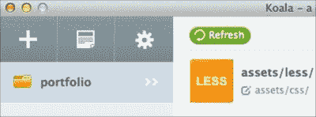

1.  选择除了`frameworks.less`和`style.less`之外的所有样式表。右键单击并选择**切换自动编译**。查看以下截图：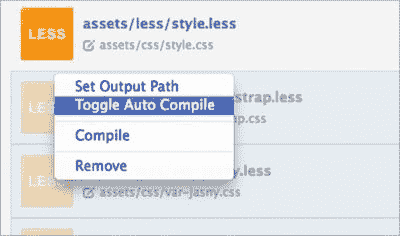

这将关闭所选样式表上的**自动编译**选项，并防止 Koala 意外编译这些样式表。

1.  另外，确保为剩下的两个样式表`frameworks.less`和`style.less`勾选**自动编译**：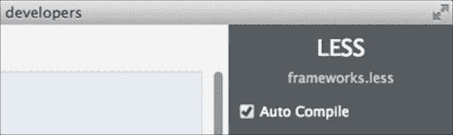

1.  确保`frameworks.less`和`style.less`的输出设置为`/assets/css`目录，如下面的截图所示：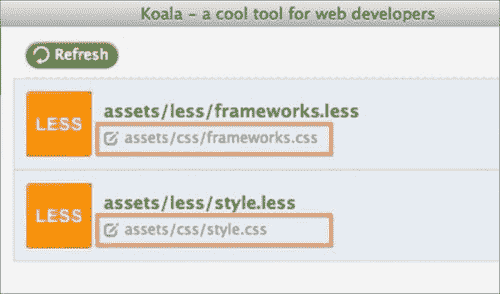

1.  检查两个样式表的**源映射**选项，以生成源映射文件，在调试时会对我们有所帮助：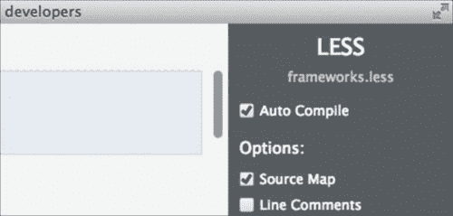

1.  选择两个样式表`frameworks.less`和`style.less`的输出样式进行**压缩**：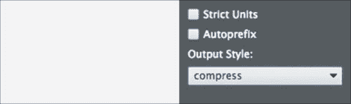

此选项将生成一个体积较小的 CSS 样式表，因为样式表中的代码将被压缩成一行。因此，样式表将在浏览器中加载得更快，也会节省用户端的带宽消耗。

1.  选择`frameworks.less`并单击**编译**按钮将其编译为 CSS：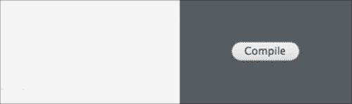

1.  对`style.less`执行相同操作。选择它并单击**编译**按钮将其编译为 CSS。在代码编辑器中打开`index.html`，并在`<head>`内链接这两个样式表，如下所示：

```html
<link href="assets/css/frameworks.css" rel="stylesheet">
<link href="assets/css/style.css" rel="stylesheet">
```

## 发生了什么？

在前面的步骤中，我们将网站的主要样式表`frameworks.less`和`style.less`从 LESS 编译为 CSS。现在，你应该将它们与源映射一起放在`assets/css/`目录中。代码已经压缩，因此文件大小相对较小，如下面的截图所示：

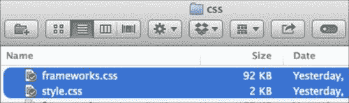

样式表的大小相对较小。如图所示，frameworks.css 为 92 kb，而 style.css 仅为 2 kb

此外，我们还在`index.html`中链接了这些 CSS 样式表。但是，由于我们尚未编写自己的样式，网站仍然使用默认的 Bootstrap 样式，如下面的截图所示：

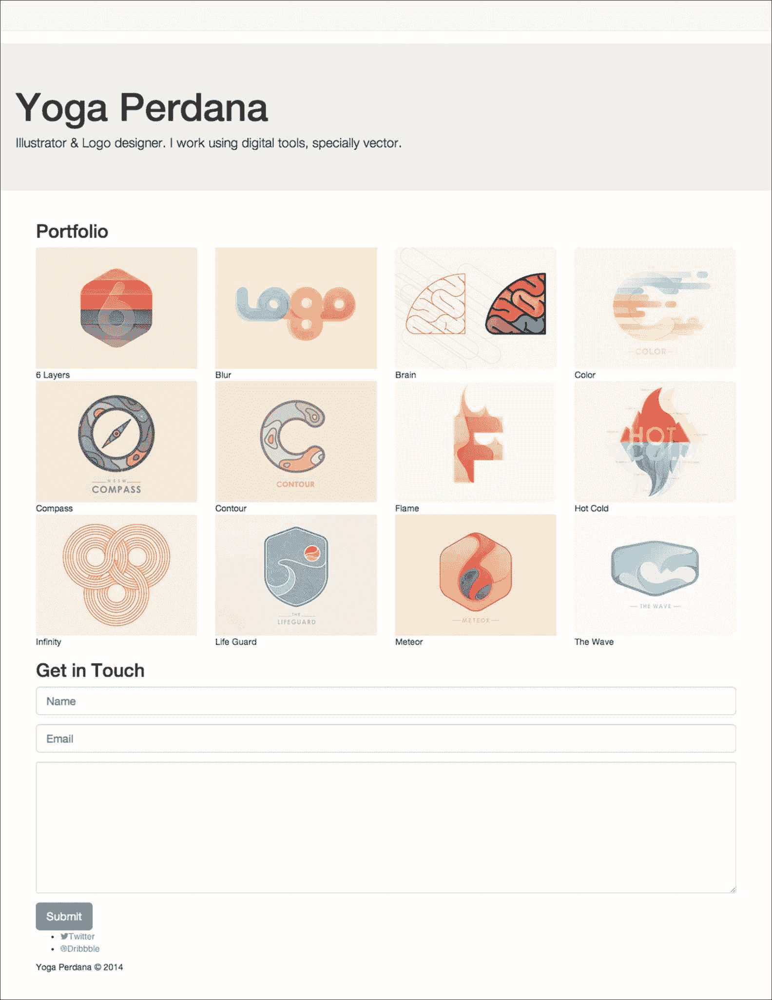

# 使用 LESS 优化投资组合网站

这是你可能在等待的部分，为投资组合网站设置样式。看到网站开始有形状、颜色和外观显然是一种愉快的体验。在本节中，我们将通过使用本章前面介绍的 LESS 语法自定义默认样式并组合我们的样式规则。

# 采取行动-使用 LESS 语法组合网站样式

执行以下步骤来为网站设置样式：

1.  从 Google Font 中添加一个新的字体系列。在这里，我选择了 Varela Round ([`www.google.com/fonts/specimen/Varela+Round`](http://www.google.com/fonts/specimen/Varela+Round))。在任何其他样式表之前放置以下 Google Font 链接：

```html
<link href='http://fonts.googleapis.com/css?family=Varela+Round' rel='stylesheet' type='text/css'>
```

1.  我们将通过更改一些变量来自定义默认样式。在 Sublime Text 中打开`var-bootstrap.less`。首先，我们将更改定义 Bootstrap 主色的`@brand-primary`变量；将其从`#428bca`更改为`#46acb8`：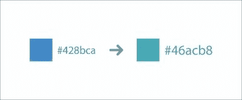

1.  此外，将`@brand-success`变量中的颜色从`#5cb85c`更改为`#7ba47c`：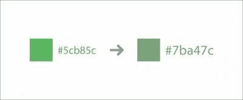

1.  更改`@headings-font-family`变量，该变量定义了标题中使用的字体系列，将其从`inherit`更改为`"Varela Round"`，如下所示：

```html
@headings-font-family: "Varela Round", @font-family-sans-serif; 
```

1.  当用户聚焦在表单字段上时，Bootstrap 默认样式会显示发光效果。此效果的颜色在`@input-border-focus`中指定。将颜色从`#66afe9`更改为`#89c6cb`：

1.  在网站的顶部部分，您可以看到导航栏仍然具有 Bootstrap 默认样式，灰色背景和边框颜色，如下截图所示：

1.  这两种颜色分别在`@navbar-default-bg`和`@navbar-default-border`中指定。将这两个变量的值都更改为 transparent，如下所示：

```html
@navbar-default-bg: transparent;
@navbar-default-border: transparent;
```

1.  同样，Jumbotron 部分的默认样式设置为灰色背景色。要删除这种颜色，将`@jumbotron-bg`变量设置为`transparent`，如下所示：

```html
@jumbotron-bg: transparent;
```

1.  稍后我们将继续编辑一些 Bootstrap 变量。与此同时，让我们编写自己的样式规则。首先，我们将显示被 Bootstrap 默认样式隐藏的导航栏切换按钮。在我们的情况下，此按钮将用于打开和关闭侧栏导航。让我们使用以下样式规则强制使此按钮可见：

```html
.portfolio-topbar {
  .navbar-toggle {
    display: block;
  }
}
```

1.  如下截图所示，带有所谓的汉堡图标（[`gizmodo.com/who-designed-the-iconic-hamburger-icon-1555438787`](http://gizmodo.com/who-designed-the-iconic-hamburger-icon-1555438787)）的切换按钮现在可见：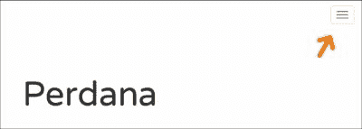

1.  目前，此按钮位于右侧。参考网站蓝图，它应该在左侧。添加`float:left`将其放在左侧，`margin-left:15px`添加一点空白到按钮的左侧，如下所示：

```html
.portfolio-topbar {
  .navbar-toggle {
    display: block;
    float: left;
    margin-left: 15px;
  }
} 
```

1.  在这里，我想自定义切换按钮的默认样式，这也是通过`var-bootstrap.less`中的一些变量指定的。因此，在 Sublime Text 中打开`var-bootstrap.less`。

1.  首先，我们将通过将`@navbar-default-toggle-border-color`变量的值从`#ddd`更改为`transparent`来删除按钮边框，如下所示：

```html
@navbar-default-toggle-border-color: transparent;
```

1.  我们还将删除悬停在按钮上时出现的灰色背景颜色。通过将`@navbar-default-toggle-hover-bg`变量从`#ddd`更改为`transparent`来将灰色背景颜色移出，如下所示：

```html
@navbar-default-toggle-hover-bg: transparent;
```

1.  我希望汉堡图标看起来更加粗体和强烈。因此，在这里，我们希望将颜色改为黑色。将`@navbar-default-toggle-icon-bar-bg`的值从`#888`更改为`#000`：

```html
 @navbar-default-toggle-icon-bar-bg: #000;
```

1.  在这个阶段，网站内容被对齐到左侧，这是任何内容的默认浏览器对齐方式。根据网站蓝图，网站内容应该居中。使用`text-align: center`，如下所示，将内容对齐到中心：

```html
.portfolio-about,
.portfolio-display,
.portfolio-contact,
.portfolio-footer {
  text-align: center;
}
```

1.  添加以下内容将网站名称转换为大写（全部大写字母），使其更大更粗：

```html
.portfolio-about {
  .portfolio-name {
    text-transform: uppercase;
  }
}
```

1.  另一方面，通过将文本颜色指定为灰色浅色，使标语行更加微妙。在这里，我们可以简单地使用 Bootstrap 的预定义变量`@gray-light`来应用灰色，如下所示：

```html
.portfolio-about {
  .portfolio-name {
    text-transform: uppercase;
  }
 .lead {
 color: @gray-light;
 }
}
```

1.  在投资组合部分，使用灰色浅色指定背景颜色，比`@gray-lighter`变量中的颜色更浅。添加背景颜色的目的是为了在投资组合部分加强一点重点。

1.  在这个项目中，我们选择使用 LESS 的`darken()`函数轻微加深白色，如下所示：

```html
.portfolio-display {
  background-color: darken(#fff, 1%);
}
```

### 注意

可以通过使用 LESS 的`lighten()`函数将黑色颜色减轻 99%来替代地实现背景颜色，如`background-color: lighten(#000, 99%);`。

1.  在这个阶段，如果我们看一下投资组合部分，似乎顶部和底部只有很少的空间，如下截图所示：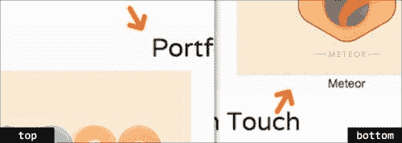

1.  通过添加`padding-top`和`padding-bottom`，为投资组合部分提供更多空间，如下所示：

```html
.portfolio-display {
  background-color: darken(#fff, 1%);
padding-top: 60px;
 padding-bottom: 60px;
}
```

1.  总之，我们在网站中添加了两个标题，包括作品集部分中的一个，以明确显示部分名称。这些标题将共享相同的样式规则。因此，在这种情况下，最好创建一个专门定义标题样式的 mixin。

1.  定义 mixin 以及应用标题样式的 CSS 属性，如下所示：

```html
.heading {
  color: lighten(#000, 70%);  
  text-transform: uppercase;
  font-size: 21px;
  margin-bottom: 60px;  
}
```

1.  为部分标题添加以下样式规则，使其看起来更加柔和，并与作品集部分的背景颜色协调：

```html
.portfolio-display {
...
  h2 {
    &:extend(.heading);
  }
}
```

1.  如下截图所示，每行之间的间距非常小；行之间的距离太近了，如下所示：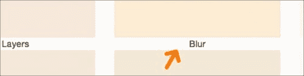

因此，通过为每个作品集项目指定`margin-bottom`来增加更多空间，如下所示：

```html
.portfolio-item {
  margin-bottom: 30px;
}
```

1.  为作品集图片添加样式，如下所示：

```html
.portfolio-image {
  padding: 15px;
  background-color: #fff;
margin-right: auto;
margin-left: auto;
}
```

1.  还要为说明添加样式，如下所示：

```html
.portfolio-caption {
  font-weight: 500;
  margin-top: 15px;
  color: @gray;
}
```

1.  当我们悬停在作品集图片上时，你觉得显示过渡效果怎么样？那看起来会很好，不是吗？在这种情况下，我想在悬停时显示围绕作品集图片的阴影。

1.  使用 Bootstrap 预定义的 mixin`.transition()`和`.box-shadow()`添加效果，如下所示：

```html
.portfolio-image {
  padding: 15px;
  background-color: #fff;
margin-right: auto;
margin-left: auto; 
 .transition(box-shadow 1s);
 &:hover {
 .box-shadow(0 0 8px fade(#000, 10%));
 }
}
```

1.  在作品集部分下面，我们有网站联系表单，已经应用了 Bootstrap 的默认样式。因此，让我们用我们自己的样式规则自定义它。

1.  首先，我们将使用`padding`在联系表单部分的顶部和底部添加更多空间。

1.  使用我们在第 18 步中创建的`.heading` mixin 为标题添加样式：

```html
.portfolio-contact {
...
 h2 {
 &:extend(.heading);
 }
} 
```

1.  目前表格完全跨越整个容器。因此，请添加以下样式规则以设置最大宽度，但仍然在容器中间显示表单，如下所示：

```html
.portfolio-contact {
...
 .form {
 width: 100%;
 max-width: 600px;
 margin-right: auto;
 margin-left: auto;
 }
} 
```

1.  添加以下样式规则使表单元素—`<input>`、`<textarea>`、`<button>`—看起来更加扁平。这些样式规则去除了阴影并降低了边框半径。看一下以下代码：

```html
.portfolio-contact {
...
  .form {
    width: 100%;
    max-width: 600px;
    margin-right: auto;
    margin-left: auto;
 input, textarea, button {
 box-shadow: none;
 border-radius: @border-radius-small;
 }
  }
}
```

1.  添加以下行以为按钮添加样式，并使用过渡效果使其生动起来，如下所示：

```html
.portfolio-contact {
...
  .form {
    width: 100%;
    max-width: 600px;
    margin-right: auto;
    margin-left: auto;
    input, textarea, button {
      box-shadow: none;
      border-radius: @border-radius-small;
    }
 .btn {
 display: block;
 width: 100%;
 .transition(background-color 500ms);
 }
  }
}
```

1.  从这一步开始，我们将为网站的最后一个部分——页脚添加样式规则。页脚包含社交媒体链接 Dribbble 和 Twitter，以及底部的版权声明。

1.  首先，与前面的步骤一样，我们使用`padding`在部分的顶部和底部添加更多空白空间：

```html
.portfolio-footer {
  padding-top: 60px;
  padding-bottom: 60px;
}
```

1.  然后，通过指定`margin-bottom`在社交媒体链接和版权声明之间增加更多空间：

```html
.portfolio-footer {
  padding-top: 60px;
  padding-bottom: 60px;
.social {
    margin-bottom: 30px;
}
} 
```

1.  添加以下行以删除从默认浏览器样式中派生的`<ul>`元素的`padding`：

```html
.portfolio-footer {
...
  .social {
    margin-bottom: 30px;
 ul {
 padding-left: 0;
 }
  }
}
```

1.  在以下代码中添加突出显示的行以将社交媒体链接并排显示：

```html
.portfolio-footer {
...
  .social {
    margin-bottom: 30px;
    ul {
      padding-left: 0;
    }
 li {
 list-style: none;
 display: inline-block;
 margin: 0 15px;
 }
  }
}
```

1.  给社交媒体链接赋予其各自社交媒体品牌的颜色，如下所示：

```html
.portfolio-footer {
...
  .social {
    ...
 a {
 font-weight: 600;
 color: @gray;
 text-decoration: none;
 .transition(color 500ms);
 &:before {
 display: block;
 font-size: 32px;
 margin-bottom: 5px;
 }
 }
 .twitter a:hover {
 color: #55acee;
 }
 .dribbble a:hover {
 color: #ea4c89;
 }
  }
} 
```

### 提示

在 BrandColors（[`brandcolors.net/`](http://brandcolors.net/)）中获取更多热门网站的颜色。

1.  最后，用灰色使版权声明颜色更加柔和：

```html
.portfolio-footer {
...
 .copyright {
 color: @gray-light;
 }
}
```

## *刚刚发生了什么？*

在前面的步骤中，我们通过自定义一些 Bootstrap 变量以及组合我们自己的样式规则来为网站添加样式。编译`style.less`以生成 CSS。此外，你可以从这个 Gist（[`git.io/-FWuiQ`](http://git.io/-FWuiQ)）获取我们应用的所有样式规则。

网站现在应该是可以展示的。以下截图显示了网站在桌面视图中的外观：

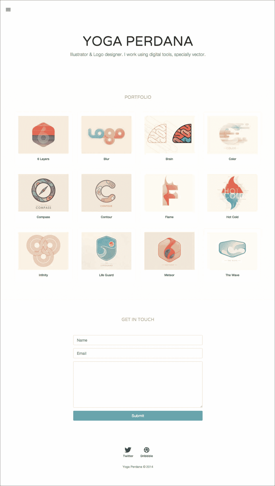

网站也是响应式的；布局将根据视口宽度大小进行调整，如下截图所示：

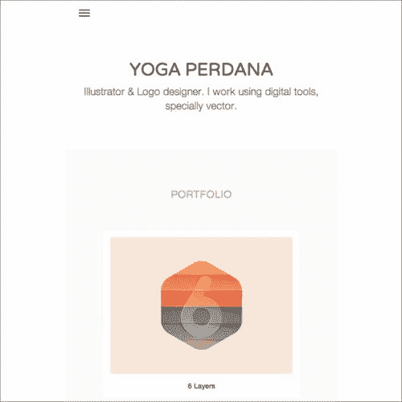

## 尝试更有创意

我们刚刚在前面的部分应用的许多样式规则仅仅是装饰性的。请随意添加更多创意和自定义，如下所示：

+   探索网站的新配色方案。使用 Kuler 等方便的工具（[`kuler.adobe.com/`](https://kuler.adobe.com/)）生成配色方案

+   应用不同的字体系列

+   使用 CSS3 展示更多令人惊叹的过渡效果

## 快速测验-使用 LESS 函数和扩展语法

Q1\. 如何使用 LESS 使颜色变浅？

1.  `lighter(#000, 30%);`

1.  `lighten(#000, 30%);`

1.  `lightening(#000, 30%);`

Q2\. 如何使颜色透明？

1.  `fadeout(#000, 10%);`

1.  `transparentize(#000, 10%);`

1.  `fade-out(#000, 10%);`

Q3\. 以下哪一种方式是在 LESS 中扩展 mixin 的不正确方式？

1.  `.class:extend(.another-class);`

1.  `.class::extend(.another-class);`

1.  `.class {`

`:extend(.another-class);`

`}`

# 改进并使用 JavaScript 使网站正常运行

侧栏导航尚未激活。如果您点击切换按钮，侧栏导航将不会滑入。此外，如果您在 Internet Explorer 8 中查看作品集网站，您会发现许多样式规则没有被应用。这是因为 Internet Explorer 8 不识别网站中使用的 HTML5 元素。为了解决这些问题，我们将不得不使用一些 JavaScript 库。

# 进行操作-使用 Koala 编译 JavaScript

1.  在`assets/js`目录中创建一个名为`html5shiv.js`的新 JavaScript 文件。

1.  从我们通过 Bower 下载的 HTML5Shiv 包中导入`html5shiv.js`到这个文件中：

```html
// @koala-prepend "../../bower_components/html5shiv/dist/html5shiv.js"
```

1.  创建一个名为`bootstrap.js`的新 JavaScript 文件。

1.  在`bootstrap.js`中，导入所需的 JavaScript 库以打开侧栏导航功能，如下所示：

```html
// @koala-prepend "../../bower_components/jquery/dist/jquery.js"
// @koala-prepend "../../bower_components/bootstrap/js/transition.js"
// @koala-prepend "../../bower_components/jasny-bootstrap/js/offcanvas.js"
```

1.  打开 Koala，并确保`html5shiv.js`和`bootstrap.js`的**自动编译**选项已经被选中，如下图所示：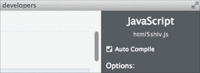

1.  此外，确保这两个 JavaScript 文件的输出路径设置为`/assets/js`目录，如下图所示：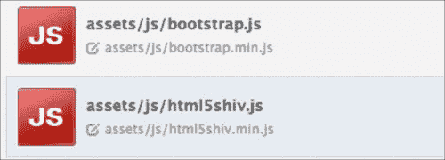

1.  点击 Koala 中的**编译**按钮编译这两个 JavaScript 文件，如下所示：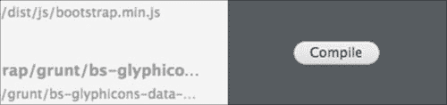

一旦这些 JavaScript 文件被编译，你应该会发现这些文件的压缩版本`html5shiv.min.js`和`bootstrap.min.js`，如下图所示：

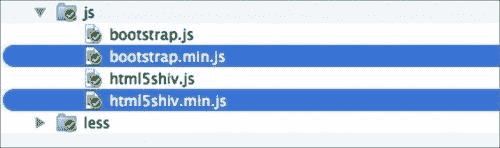

1.  在 Sublime Text 中打开`index.html`，并在`<head>`部分使用 Internet Explorer 条件注释标签链接`html5shiv.js`，如下所示：

```html
<!--[if lt IE 9]>
<script type="text/javascript" src="img/html5shiv.min.js"></script>
<![endif]-->
```

1.  在`index.html`的底部链接`bootstrap.min.js`，如下所示：

```html
<script type="text/javascript" src="img/bootstrap.min.js"></script>
```

## *刚刚发生了什么？*

我们刚刚编译了 jQuery 和 Bootstrap JavaScript 库，以启用侧栏功能。我们还使用 HTML5Shiv 在 Internet Explorer 8 中启用了 HTML5 元素。到目前为止，网站已经完全可用。

### 提示

您可以通过这个 Github 页面查看网站([`tfirdaus.github.io/rwd-portfolio/`](http://tfirdaus.github.io/rwd-portfolio/))。

您应该能够滑动进出侧栏导航，并且样式现在应该在 Internet Explorer 8 中可见。看一下以下的截图：

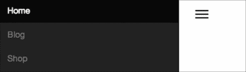

侧栏导航菜单已经滑入。

# 总结

我们刚刚完成了本书的第二个项目。在这个项目中，我们使用 Bootstrap 构建了一个作品集网站。Bootstrap 使得使用提供的快速插入类来构建响应式网站和网站组件变得简单快捷。

此外，我们还使用了一个名为 Jasny Bootstrap 的 Bootstrap 扩展，以包括侧栏导航，这是原始 Bootstrap 中缺少的流行响应式设计模式之一。在网站样式方面，我们使用了 LESS，这是一种 CSS 预处理器，可以让我们更有效地编写样式规则。

总之，在这个项目中我们做了很多事情来让网站正常运行。希望你在这个过程中学到了很多东西。

在下一章中，我们将使用 Foundation 框架开始本书的第三个项目。敬请关注！
