# 第八章：扩展 Foundation

*在上一章中构建了网站页面标记之后，我们现在开始为网站添加外观，感觉和颜色。这次我们将使用**Sassy CSS**（**SCSS**），这也恰好是 Foundation 默认样式的基础语法。*

*SCSS 是 Sass 命名的 CSS 预处理器的语法变体。Sass 原始语法使用缩进格式化，使代码看起来整洁。另一方面，SCSS 使用大括号和分号，就像常规 CSS 一样。这种相似性有助于每个人快速掌握语法，特别是那些对 Sass 不熟悉的人。*

*由于我们将使用 SCSS，因此我们将从介绍一些 Sass 功能和其实用程序开始本章。您将学会定义变量和函数，执行操作，并遵守其他指令，这使我们能够更有效地组合网站样式规则。*

*这可能听起来有挑战性。如果您喜欢挑战，我们可以立即开始。*

本章将围绕以下主题展开：

+   探索 Sass 功能并学习语法

+   研究 Bourbon，一个 Sass 混合库

+   组织样式表结构并使用导入指令包含部分样式表

+   设置 Koala 将 SCSS 编译为 CSS

+   通过变量自定义 Foundation 的默认样式

+   构建网站自定义样式

+   优化各种视口大小的网站布局

+   通过编译 JavaScript 使网站上线

# Syntactically Awesome Style Sheets

Sass（[`sass-lang.com/`](http://sass-lang.com/)）是由 Hampton Catlin，Natalie Weizenbaum 和 Chris Eppstein 创建的 CSS 预处理器，这也是创建 Haml（[`haml.info/`](http://haml.info/)）的同一个团队。正如本章开头提到的那样，Foundation 使用 Sass 来生成其 CSS，我们也会这样做。因此，在我们动手之前，我们将首先深入了解几个 Sass 功能，例如嵌套，变量，混合，函数等，这将使我们能够更有效地编写样式规则。

## 嵌套规则

Sass 允许我们将样式规则嵌套到彼此中。这个功能最终使我们能够编写类似于网页 HTML 结构的样式规则。这样，样式规则可以更简洁，更容易浏览。比如，我们添加了网站的标题标记，如下所示：

```html
<header>
  <h1><a href="#">Website</a></h1>
</header>
```

使用 Sass，我们可以构建样式规则，如下所示：

```html
header {
  background: #000;
  h1 {
    margin: 0;
    a {
      color: #fff;
    }
  }
}
```

值得注意的是，尽管 Sass 允许您嵌套样式规则，但您不应滥用这个功能。因此，不要像下面的代码那样做：

```html
body {
  nav {
    ul {
      li {
        a {
          &:before {

          }
        }
      }
    }
  }
}
```

在嵌套样式规则之前考虑一下。这个功能的主要目标是使样式规则看起来更简单，更简洁，更容易浏览，而不是使它看起来不必要地更复杂。

## 使用变量存储值

变量是编程语言中一个有用的部分，它允许我们在指定的名称中定义一个值。每种语言都有稍微不同的变量声明方式。例如，JavaScript 使用关键字`var`，LESS 使用`@`，而在这种情况下 Sass 使用`$`符号。

变量的一个完美适用实现是定义网站颜色，例如：

```html
$primary: #000;	
$secondary: #bdc3c7;
$tertiary: #2ecc71;
$quaternary: #2980b9;
$quinary: #e67e22;
```

因此，我们可以简单地声明代表性变量，而不是每次需要时都声明颜色值。在下面的例子中，我们将`$primary`声明为正文颜色，`$secondary`声明为背景颜色：

```html
body {
  background-color: $secondary;
  color: $primary;
}
```

当编译为常规 CSS 时，这些变量将被替换为定义的值，如下所示：

```html
body {
  background-color: #bdc3c7;
  color: #000;}
```

使用适当名称的变量（当然），您会发现编写变量比记住十六进制或 RGB 数字更容易；嗯，写`$primary`比`#bdc3c7`实际上更容易，不是吗？

Sass 变量不仅用于定义颜色。我们还可以使用变量来定义字符串或纯文本，如下所示：

```html
$var: "Hello World";
$body-font-family: "Helvetica Neue";
```

我们可以使用变量来存储数字或长度：

```html
$number: 9;
$global-radius: 3px;
```

我们可以使用一个变量来继承另一个变量的值：

```html
$var: $anotherVar;
$header-font-family: $body-font-family;
```

我们可以使用一个变量来定义函数的输出：

```html
$h1-font-size: rem-calc(44);
```

Foundation 在名为`_settings.scss`的文件中集中了其主要变量的声明。当我们编写网站样式规则时，我们将在稍后更深入地了解这个问题。

### 变量插值

有些情况下变量是不适用的，比如当它被插入到字符串（纯文本）中时，如下：

```html
$var: "Hello";
$newVar: "$var World";
div {
  content: $newVar;
}
```

当编译时，`$newVar`中的`$var`声明不会被替换为`"Hello"`的值。这是因为 Sass 将`$var`解释为字符串或纯文本。因此，以下示例的输出将简单地是：

```html
div {
  content: "$var World";
}
```

另一个变例子是当一个声明以`@`规则或指令开头时，变量不起作用，如下：

```html
$screen-size: (max-width: 600px);
@media $screen-size {
  div {
    display: none;
  } 
}
```

这个例子简单地返回了一个错误给 Sass 编译器，因为`@media`应该后面跟着`print`或`screen`关键字。

有一些情况下我们必须使用插值来声明一个变量。变量插值也发生在其他编程语言中，比如 PHP、Ruby 和 Swift。但我不会深入讨论其工作原理的技术细节，因为我也不太清楚。简而言之，插值允许我们在不允许变量工作的情况下嵌入变量，特别是在期望的是一个字符串的情况下。

每种编程语言都有其符号来启用插值。在这种情况下，Sass 使用`#{}`。给定前面的一个例子，我们可以这样写变量：

```html
$var: "Hello";
$newVar: "#{$var} World";
div {
  content: $newVar;
}
```

结果将如下：

```html
div {
  content: "Hello World";
}
```

### 注意

关注 Hugo Giraudel 的帖子（[`webdesign.tutsplus.com/tutorials/all-you-ever-need-to-know-about-sass-interpolation--cms-21375`](https://webdesign.tutsplus.com/tutorials/all-you-ever-need-to-know-about-sass-interpolation--cms-21375)）以获取有关 Sass 中变量插值的进一步帮助。

## 使用 mixin 重用代码块

现在，我们将深入了解 Sass mixin。如果你跟着并完成了第二个项目，你应该知道 LESS mixin。Sass 和 LESS 中的 mixin 都有类似的目的；它们允许开发者在整个样式表中重用代码块和样式规则，从而遵守 DRY 原则（[`programmer.97things.oreilly.com/wiki/index.php/Don't_Repeat_Yourself`](http://programmer.97things.oreilly.com/wiki/index.php/Don't_Repeat_Yourself)）。然而，在声明和重用 mixin 方面略有不同。这是我们在 LESS 中声明 mixin 的方式：

```html
.buttons { 
  color: @link-color;
  font-weight: normal;
  border-radius: 0; 
}
```

在 Sass 中，我们使用`@mixins`指令来创建一个 mixin，例如：

```html
$linkColor: $tertiary;
@mixin buttons { 
  color: $linkColor;
  font-weight: normal;
  border-radius: 0; 
}
```

Sass 使用`@include`指令在样式规则中重用前面的代码块。给定前面的例子，我们可以这样写：

```html
.button {
   @include buttons;
}
```

当前面的例子编译成 CSS 时，输出如下：

```html
.button {
  color: #2ecc71;
  font-weight: normal;
  border-radius: 0;
}
```

这是 Sass mixin 应用的一个基本例子。

### Sass mixin 库简介

有些 CSS3 的语法非常复杂，写起来可能非常繁琐。这就是 mixin 特别有用的地方。幸运的是，由于 Sass 如此受欢迎，并得到了许多慷慨的开发者的支持，我们不必自己将所有 CSS3 语法转换成 Sass mixin。相反，我们可以简单地使用 Sass 的 mixin 库，使我们作为 web 开发者的工作更加愉快。

Sass 库附带了一系列有用的 mixin 和函数（我们将很快讨论函数），我们可以立即使用。有数十个流行的库可用，我们将在这里使用的一个叫做 Bourbon（[`bourbon.io/`](http://bourbon.io/)）。

Bourbon 在一个库中编译了许多 mixin，简化了我们声明 CSS3 语法的方式，包括仍然标记为实验性的语法，比如`image-rendering`，`filter`和 CSS3 的`calc`函数。现在，你认为在指定 Hi-DPI 媒体查询时哪个更容易、更快速？

### 注意

Hi-DPI 媒体查询用于测量设备像素密度，我们可以用它在网页上提供更高分辨率的图形，特别是在具有高清屏幕的设备上。以下是一些有关该主题的进一步信息的参考资料。

+   Boris Smus 的可变像素密度高 DPI 图像（[`www.html5rocks.com/en/mobile/high-dpi/`](http://www.html5rocks.com/en/mobile/high-dpi/)）。

+   Reda Lemeden 的《走向视网膜网页》（[`www.smashingmagazine.com/2012/08/20/towards-retina-web/`](http://www.smashingmagazine.com/2012/08/20/towards-retina-web/)）。

以下是标准语法吗？

```html
@media only screen and (-webkit-min-device-pixel-ratio: 2),
only screen and (min--moz-device-pixel-ratio: 2),
only screen and (-o-min-device-pixel-ratio: 2 / 1),
only screen and (min-resolution: 192dpi),
only screen and (min-resolution: 2dppx) {
  width: 500px;
}
```

或者，将使用 Bourbon mixin 的以下内容？

```html
@include hidpi(2) {
  width: 500px;
}
```

不经过多年的研究，我们通常会同意使用 mixin 应该更容易编写，也更容易记住。

### 注意

如前所述，除了 CSS3 mixin 之外，Bourbon 还附带了一些 Sass 函数，例如 Triangle，它允许我们创建基于 CSS 的三角形。但我不打算提及 Bourbon 库中的所有细节。由于库集合很可能会随着新的 CSS 规范的引入而更新或修订，最好是参考官方文档页面上的列表（[`bourbon.io/docs/`](http://bourbon.io/docs/)）。

## 创建和使用 Sass 函数

函数是使创建样式规则更加动态的功能的一部分。在 Sass 中，使用`@function`指令声明函数，然后跟着函数名，最好是带有默认值的参数。在其最简单的形式中，Sass 函数可能如下所示：

```html
@function color($parameter: green) {

}
```

然而，这个函数还不会输出任何东西。要生成这个函数的结果，我们需要添加一个`@return`值。根据前面的例子，我们想要输出默认值参数，即`"hello"`。为此，我们写下`@return`值，然后跟着`$parameter`，如下所示：

```html
@function color($parameter: green) {
  @return $parameter;
}
```

在选择器中使用此函数，如下所示：

```html
@function name($parameter: green) {
  @return $parameter;
}
.selector {
  color: name();
}
```

编译它，你会得到以下输出：

```html
.selector {
  color: green;
}
```

通过指定默认值之外的新值来自定义输出，如下所示：

```html
.selector {
  color: name(yellow);
}
```

我们将得到一个新的输出，如下所示的代码：

```html
.selector {
  color: yellow;
}
```

### 注意

这个例子仅仅展示了函数的基本功能。有很多更多的例子可以告诉我们如何在实际情况中利用它来构建可重用的代码系列。因此，我建议您前往以下参考资料，进行更进一步的讨论并找到更多的例子。

使用纯 Sass 函数使可重用逻辑更有用（[`thesassway.com/advanced/pure-sass-functions`](http://thesassway.com/advanced/pure-sass-functions)）。

一些 Sass 函数（[`hugogiraudel.com/2013/08/12/sass-functions/`](http://hugogiraudel.com/2013/08/12/sass-functions/)）。

## 使用 Sass 函数操纵颜色

我喜欢使用 CSS 预处理器（如 Sass）的一件事情是，它有多容易确定和改变颜色。在这种情况下，Sass 提供了一堆内置函数来无缝地操作颜色。以下是一些 Sass 颜色函数的列表，供您参考，以便以后在网站中操作颜色时可能会有用：

| 函数 | 描述 | 示例 |
| --- | --- | --- |
| `lighten($color, $amount)` | 通过指定的量使颜色变亮。 | `$black: #000000``lighten($black, 10%);`在这个例子中，我们将`$black`变亮了 10%。输出是`#1a1a1a`。 |
| `darken($color, $amount)` | 使颜色比指定的量更暗。 | `$white: #ffffff;``darken($white, 10%)`在这个例子中，我们将`$white`变暗了 10%。输出将是`#e6e6e6`。 |
| `fade-out($color, $amount)` | 使颜色比指定的量更透明。 | `$black: #000000;``fade-out($black, .5);`在这个例子中，我们将`$black`颜色编译成 RGB 格式，并将透明度设置为 50%。输出是`rgba(0, 0, 0, 0.5)`。 |

### 注意

请查看 Sass 官方文档，了解可用的颜色函数的完整列表。

## Foundation 自己的有用函数

Foundation 框架自带了一系列自己的函数。Foundation 使用这些函数来构建自己的默认样式，我们也可以使用它们来构建我们自己的样式。其中一个有用的函数是`rem-calc()`，它可以让我们更轻松地计算`rem`单位。

### Em 和 Rem

`rem`单位是一个相对值，它继承了与`em`类似的概念。Ian Yates 在他的文章中详细阐述了`em`的起源。

> “Ems get their name from printing. Precisely when the term was first used is unclear, but as the uppercase M (pronounced emm) most closely represents the square printing block on which printing letters were placed, it came to lend its name to the measurement. Whatever the point size of the font in question, the block of the uppercase M would define the Em.”

但是，正如 Jonathan Snook 在他的文章中所描述的，`em`单位的问题在于它的复合性质。由于大小是相对于最近的父元素的，根据我的经验，输出的大小可能是不可预测的，最好的情况下会变化，具体取决于它被指定的位置。请看以下例子：

```html
body {
    font-size:16px;
}
div {
    font-size: 1.2em; /* 19px */
} 
ul { 
    font-size: 1em; /* 19px */
}
ul li { 
    font-size: 1.2em; /* 23px */
}
```

这就是`rem`单位的用武之地。`rem`单位直接根据 HTML 文档的根元素`<html>`的字体大小进行计算，因此也被称为根`em`。无论单位在何处指定，结果都将是精确、一致的，更重要的是，易于计算（就像`px`单位一样，但是它是相对的）。

`rem-calc`函数接受整数和长度。因此，以下代码示例有效：

```html
div {
  font-size: rem-calc(12); 
}
span {
  font-size: rem-calc(10px); 
}
p {
  font-size: rem-calc(11em); 
}
```

在这种情况下，它们将变成如下形式：

```html
div {
  font-size: 0.75rem;
}
span {
  font-size: 0.625rem;
}
p {
  font-size: 0.6875rem;
}
```

## 尝试一下——深入了解 Sass

关于 Sass 的内容远不止我们在这本书中所能涵盖的，比如占位符、条件语句和运算符等等。幸运的是，有足够多的好参考资料和书籍深入讨论了 Sass 及其支持工具，你可以自行深入研究。以下是我最好的推荐：

+   《Sass 和 Compass for Designers》，Ben Frain，Packt Publishing

+   《Sass for Web Designers》，Dan Cederholm，A Book Apart

+   The Sass Way——关于使用 Sass 的教程和技巧

+   一个专门的网页设计教程类别，涵盖与 Sass 相关的任何内容

在我们恢复工作之前，让我们用几个测验结束这一节，好吗？

## Pop quiz – Sass 函数中的多个参数

在前面的部分，我们讨论了 Sass 函数，并向您展示了其中最简单的例子。在这个例子中，我们创建了一个只有一个参数的函数。事实上，我们可以在一个 Sass 函数中添加多个参数。

Q1. 那么，以下哪个例子是创建具有多个参数的函数的正确方式？

1.  每个参数用分号分隔。

```html
@function name($a:1px; $b:2px){ 
@return $a + $b
}
```

1.  每个参数用加法运算符分隔。

```html
@function name($a:2px + $b:2px){ 
@return $a + $b
}
```

1.  每个参数用逗号分隔。

```html
@function name($a:1px, $b:2px){ 
@return $a + $b
}
```

## Pop quiz – Sass 颜色操作

Q1\. Sass 内置了许多函数。在本节中，我们命名了三个，`lighten()`、`darken()`和`fade-out()`，我认为这足以帮助我们装饰这个项目的网站。`fade-out()`函数有一个别名，也可以给我们相同的结果。那么，以下哪个是`fade-out()`函数的别名？

1.  `transparentize($color, $amount)`

1.  `transparency($color, $amount)`

1.  `transparent($color, $amount)`

# 项目总结

在第七章中，*使用 Foundation 创建企业响应式网站*，我们通过 Bower（[`bower.io/`](http://bower.io/)）安装了 Foundation 和 Foundation Icons，以及它们的依赖项（jQuery、Fastclick、Modernizr 等）。我们还准备了网站资产，即图片、图标和网站标志。在本章的最后一节中，我们为网站首页创建了`index.html`，并使用了一些新的 HTML5 标签构建了标记。因此，当前工作目录中显示的文件和文件夹如下截图所示：

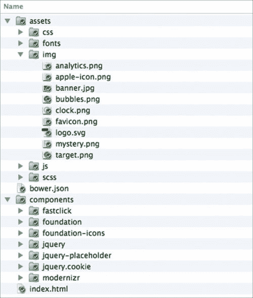

# 样式表组织

我们工作目录中仍然缺少的文件是样式表，用于为网站组合我们定制的样式，以及在前一节中简要提到的 Bourbon 库，它为我们提供了一些现成的混合和函数。这就是我们将在本节中要做的事情。我们将创建样式表并以一种易于将来维护的方式组织它们。

好吧，让我们恢复工作。

# 行动时间-组织和编译样式表

按照以下步骤正确组织样式表并将其编译为 CSS。

1.  我们需要安装 Bourbon。打开终端或命令提示符，输入以下命令：

```html
bower install bourbon --save

```

这个命令通过 Bower 注册表安装 Bourbon 包，并将其注册到项目的`bower.json`文件中。

### 提示

我在这篇文章中专门讨论了`bower.json`文件（[`webdesign.tutsplus.com/tutorials/quick-tip-what-to-do-when-you-encounter-a-bower-file--cms-21162`](https://webdesign.tutsplus.com/tutorials/quick-tip-what-to-do-when-you-encounter-a-bower-file--cms-21162)），去看看吧！

1.  在`scss`文件夹中创建名为`main.scss`、`responsive.scss`和`styles.scss`的新样式表。

1.  `_main.scss`样式表是我们将放置所有自己的样式规则的地方。我们将使用`_responsive.scss`文件专门放置网站的媒体查询。`styles.scss`文件是我们将这些样式表编译在一起的地方。

### 提示

文件名以`_`开头的下划线是一种特殊的标记，告诉 Sass 编译器不要直接编译该文件。

1.  在`scss`文件夹中，再创建两个样式表。这次，将它们命名为`_config.scss`和`foundation.scss`。

1.  `_config.scss`将包含 Foundation 中使用的所有变量的副本，而`foundation.scss`将包含 Foundation 样式表的导入部分。这些副本将防止我们直接修改原始文件，在更新到最新版本时最终会被覆盖。

1.  接下来，将 Foundation 的`_settings.scss`文件的整个内容复制到我们最近创建的`_config.scss`文件中。在我们的情况下，`_settings.scss`文件位于`/components/foundation/scss/foundation/`目录中。

1.  此外，将 Foundation 自己的`foundation.scss`的整个内容复制并粘贴到我们最近创建的`foundation.scss`中。

1.  然后，我们需要纠正`foundation.scss`文件中导入部分的路径。在这个阶段，所有路径都指向`foundation`文件夹，如下所示：

```html
@import "foundation/components/grid";
@import "foundation/components/accordion";
@import "foundation/components/alert-boxes";
... /* other imports */
```

这显然是不正确的，因为在`scss`文件夹中我们没有一个名为`foundation`的文件夹。在这里，我们需要将路径指向`components`文件夹，那里实际上包含了这些部分。因此，将路径更改为如下所示:

```html
@import "../../components/foundation/scss/foundation/components/grid";
@import "../../components/foundation/scss/foundation/components/accordion";
@import "../../components/foundation/scss/foundation/components/alert-boxes";
... /* other imports */
```

### 提示

基金会部分参考的全面片段可以在 Gist ([`git.io/ldITag`](http://git.io/ldITag))中找到。

### 注意

在 Sass 中，当导入外部文件时，我们不必指定`.scss`或`.sass`扩展名。Sass 编译器足够聪明，可以自行确定扩展名。这也是因为纯 CSS 也是有效的 Sass。

1.  我们必须更正的另一个路径是指向 Foundation 的路径，其中包含`rem-calc()`函数的`_functions.scss`。打开`_config.scss`文件，并将`@import "foundation/functions";`改为`@import "../../components/foundation/scss/foundation/functions";`。

1.  我们将使用 Koala 将这些样式表编译成 CSS。启动 Koala 并添加工作目录: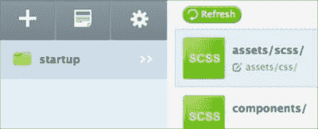

1.  在 Koala 的样式列表中，你不会找到带有下划线前缀的 SCSS 样式表。默认情况下，Koala 会忽略这个文件，因为它最终不会被编译成 CSS。

1.  但是，你应该在其中找到项目的两个主要样式表，即`styles.scss`和`foundation.scss`。确保此输出设置为`css`文件夹，如下面的屏幕截图所示: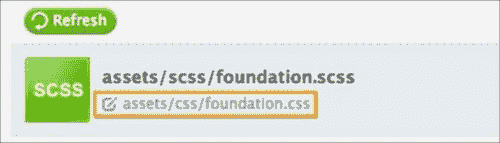

1.  然后，确保选中`自动编译`选项，这样它们将在我们进行更改时自动编译成 CSS。还要检查`源映射`选项，以便更轻松地调试样式表。请查看下面的屏幕截图: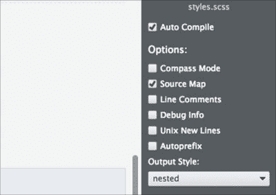

1.  点击`styles.scss`和`foundation.scss`的**编译**按钮将它们编译成 CSS。

1.  打开`index.html`，并在`<head>`标签内链接编译后的 CSS，如下所示：

```html
<link rel="stylesheet" href="assets/css/foundation.css">
<link rel="stylesheet" href="assets/css/styles.css">
```

## *刚刚发生了什么?*

我们刚刚安装了 Bourbon，并组合了几个新的样式表来为网站设计样式。然后，我们将它们编译成 CSS，并将它们链接到`index.html`。因此，正如你在下面的屏幕截图中所看到的，网站现在开始发挥作用-使用 Foundation 默认样式:

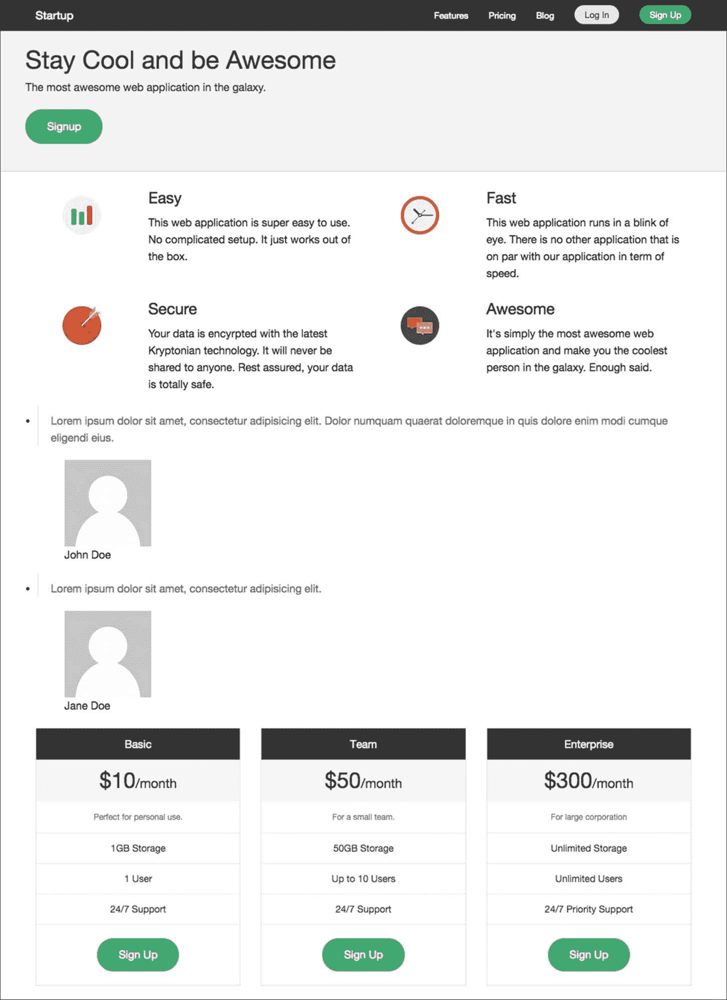

# 网站的外观和感觉

样式表组织和编译完成后，现在是定制网站样式的时候了。恰好的是，我们不必自己编写每一条样式规则。在这种情况下，由于我们使用了一个框架（Foundation），有时定制网站样式可以像更改变量中的默认值一样简单。

话不多说，让我们继续。

# 进行操作-在网站上构建

网站的样式将涉及多个样式表。因此，请仔细遵循以下步骤：

1.  在`foundation.scss`中导入以下样式表：

```html
@import "config";
@import "../../components/foundation/scss/normalize";
@import "../../components/foundation-icons/foundation_icons_social/sass/social_foundicons.scss";
... /* other partials */
```

这样，变量以及`_config.scss`中的更改将通过 Foundation 影响其他组件样式表。`normalize`变量将标准化基本元素样式，`social_foundicons.scss`；你可以猜到，这使我们能够应用 Foundation 的社交图标。

1.  打开`styles.scss`，并按照以下方式导入 Bourbon、`_config.scss`、`main.scss`和`responsive.scss`：

```html
@import "../../components/bourbon/dist/bourbon";
@import "config";
@import "main";
@import "responsive"; 
```

1.  然后，我想简单地应用来自 Google Font 的自定义字体，因为自定义字体看起来比普通字体系统（如 Arial 或 Times）更好。在这里，我选择了一个名为 Varela Round 的字体([`www.google.com/fonts/specimen/Varela+Round`](https://www.google.com/fonts/specimen/Varela+Round))。

1.  打开`index.html`，并在`<head>`标签内添加字体样式表，如下所示：

```html
<link rel='stylesheet' href='http://fonts.googleapis.com/css?family=Varela+Round' type='text/css'>
```

1.  现在，我们将把当前指定为 Foundation 默认字体的`font-family`堆栈更改为使用 Varela Round。

1.  要这样做，打开`_config.scss`，取消注释名为`$body-font-family`的变量，并插入`"Varela Round"`，如下所示：

```html
$body-font-family: "Varela Round", "Helvetica Neue", "Helvetica", Helvetica, Arial, sans-serif;
```

### 提示

**Sass 注释**

通常，注释会导致代码编译器或引擎忽略代码，就像浏览器一样。然而，它也经常被用作内联文档，解释代码的作用。

每种编程语言都有自己的注释代码的方式。在 CSS 中，它将是这样的：

```html
/* .property { content: ""' }*/
```

在 Sass 中，我们可以使用 CSS 的方式，如前面所示，或者添加`//`，如下所示：

```html
// .property { content: ""' }
```

当在行的开头添加`//`时，编译器将完全忽略该行，因此不会编译它。

1.  我们将为网站的每个部分设置样式。首先，我们将专注于网站的页眉，然后逐渐向页脚延伸。让我们首先添加一个图像背景。打开`_main.scss`，然后添加以下行：

```html
.startup-header {
  background: url('../img/banner.jpg') no-repeat center center fixed;
  background-size: cover;
} 
```

### 注意

**CSS3 背景大小**

背景大小是一个特殊的 CSS3 属性，用于控制背景的拉伸。我们在前面的片段中使用的`cover`的值将按比例拉伸背景图像以完全覆盖容器。请参考以下参考资料，以获取有关 CSS3 背景大小的进一步帮助：

+   CSS 背景和边框模块 3 级（[`www.w3.org/TR/css3-background/#the-background-size`](http://www.w3.org/TR/css3-background/#the-background-size)）

+   *Perfect Full Page Background Image* by Chris Coyier ([`css-tricks.com/perfect-full-page-background-image/`](http://css-tricks.com/perfect-full-page-background-image/))

+   我可以使用 CSS3 背景大小吗？（[`caniuse.com/#feat=background-img-opts`](http://caniuse.com/#feat=background-img-opts)）

然而，图像目前被隐藏在应用于顶部栏和 Foundation 命名为 Panel 的部分的背景颜色的后面（[`foundation.zurb.com/docs/components/panels.html`](http://foundation.zurb.com/docs/components/panels.html)），如下截图所示：

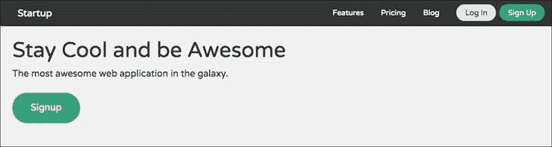

1.  去掉这些背景颜色，以便我们可以透过背景图像看到。为此，打开`_config.scss`文件，并取消注释以下行：

```html
$topbar-bg-color: #333;
$topbar-bg: $topbar-bg-color;
```

将`$topbar-bg-color`变量的值从`#333`更改为`transparent`

```html
$topbar-bg: transparent;
```

1.  取消以下行的注释，指定面板的背景颜色：

```html
$panel-bg: scale-color($white, $lightness: -5%);
```

然后，将值更改为`transparent`：

```html
$panel-bg: transparent;
```

现在，我们可以看到背景图像，如下截图所示：

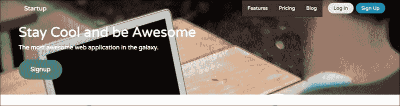

1.  从前面的截图中可以看出，顶部栏和面板的背景颜色已经被移除，但是一些菜单项仍然有。

1.  让我们去掉这些背景颜色。在`_config.scss`中，取消注释以下行：

```html
$topbar-dropdown-bg: #333;
```

并将值更改为使用`$topbar-bg`变量的值，如下所示：

```html
$topbar-dropdown-bg: $topbar-bg;
```

1.  保存文件，等待几秒钟进行编译，现在您应该看到菜单项的背景颜色已经被移除，如下截图所示：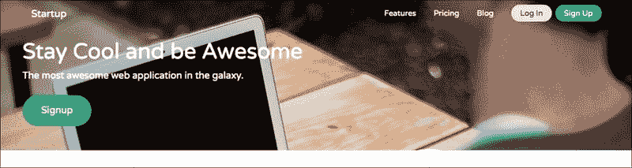

1.  添加`padding-top`以在顶部栏和浏览器视口的上边界之间提供更多距离：

```html
.startup-header {
...
  .startup-top-bar {
    padding-top: rem-calc(30);
  }
}
```

现在，正如您所看到的，其中有更多的宽度：

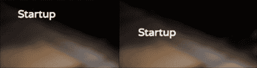

图像的左半部分是在我们添加`padding-top`之前，右半部分显然是在我们添加`padding-top`之后。

1.  在面板部分的顶部和底部增加更多的填充；因此，我们可以查看更多的背景图像。将样式规则嵌套在`.startup-header`下，如下所示：

```html
.startup-header {
  ...
 .startup-hero {
    padding-top: rem-calc(150px);
    padding-bottom: rem-calc(150px);
  }
}
```

1.  添加 logo 图像，如下所示：

```html
.startup-name {
  max-width: 60px;
  a {
    text-indent: 100%;
    white-space: nowrap;
    overflow: hidden;
    background: url('../img/logo.svg') no-repeat center left;
    background-size: auto 90%;
    opacity: 0.9;
  }
}
```

现在我们已经添加了 logo，如下所示：

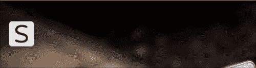

1.  在顶部菜单链接上悬停，您会发现它有一个深色背景，如下所示：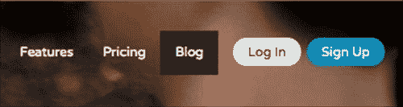

当涉及到整个网站的美学时，这个背景颜色并不太合适，所以让我们移除它。在`_config.scss`中取消注释以下行：

```html
$topbar-link-bg-hover: #272727;
```

然后，通过继承`$topbar-bg`变量的值，将值改为透明：

```html
$topbar-link-bg-hover: $topbar-bg;
```

1.  将菜单链接转换为大写，这样看起来会稍微大一些。在`_config.scss`中将名为`$topbar-link-text-transform`的变量从`none`改为`uppercase`：

```html
$topbar-link-text-transform: uppercase;
```

1.  接下来我们要做的是改变两个按钮的样式：`登录`和`注册`。我们将使它看起来更时尚一点，以下是这些按钮的所有新样式；将这些行嵌套在`.startup-header`下面：

```html
.startup-header {
...
.startup-top-bar {
  padding-top: rem-calc(30);
    ul {
$color: fade-out(#fff, 0.8);
$color-hover: fade-out(#fff, 0.5);
    background-color: transparent;
    .button {
@include transition (border 300ms ease-out, background-color 300ms ease-out);
    }
    .log-in {
  padding-right: 0;
      > .button {
        background-color: transparent;
        border: 2px solid $color;
        color: #fff;
        &:hover {
      background-color: transparent;
      border: 2px solid $color-hover;
      color: #fff;
        }
      }
    }
    .sign-up {
      > .button {
      background-color: $color;
      border: 2px solid transparent;
      color: #fff;
      &:hover {
        background-color: $color-hover;
        border: 2px solid transparent;
      }
    }
     }
   }
  } 
}
```

现在，按钮应该看起来如下截图所示。悬停在按钮上，您将看到我们通过 Bourbon 的`transition()`混合添加的漂亮的过渡效果：

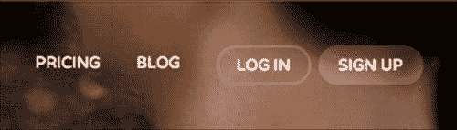

然而，值得注意的是，我认为这只是装饰。你可以自定义按钮样式。

1.  在透明背景上的按钮上，让我们也稍微透明左侧的三个菜单链接项目，即**价格**，**定价**和**博客**。为此，请取消注释并在`_config.scss`中将名为`$topbar-link-color`的变量改为`fade-out(#fff, 0.3)`，如下所示：

```html
$topbar-link-color: fade-out(#fff, 0.3);
```

1.  然后，让我们给链接添加一个过渡效果。在`_main.scss`中添加以下行：

```html
.startup-header {
...
  .startup-top-bar {
    ...
    a {
     @include transition(color 300ms ease-out);
      }
   }
 }
```

1.  接下来，我们将在页眉上添加一个深色透明层。通过添加这个深色层，页眉中的文本可以更清晰地显示在背景图像上。

在`_main.scss`中添加以下行：

```html
.startup-header {
...
  .startup-top-bar,
 .startup-hero {
 background-color: fade-out(#000, 0.5);
 }
}
```

1.  在头部部分添加以下行作为我们的最后一步：

```html
.startup-header {
...
  .startup-hero {
    padding-top: rem-calc(150px);
    padding-bottom: rem-calc(150px);
    .hero-lead {
 color: darken(#fff, 30%);
 }
  }
...
}
```

现在，我们有了一个漂亮的网站标题，正如您在下面的截图中所看到的那样：

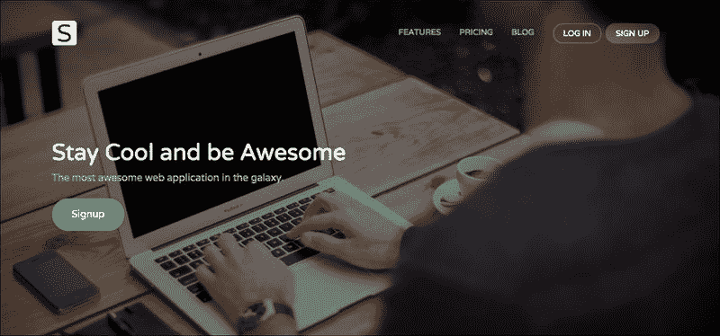

1.  网站样式完成后，我们将转到下一部分。在页眉下面，我们有包含我们产品和服务的一些关键特性的特性部分。这些都是特性部分的样式：

```html
...
.startup-features {
  padding: rem-calc(90 0);
  figure {
    margin: 0;
  }
  .columns {
    margin-bottom: rem-calc(15);
  }
}
```

在上面的片段中，我们从包裹图像图标的 figure 元素中移除了边距。这将给图像图标的 figure 更多的空间，正如您在下面的截图中所看到的那样：

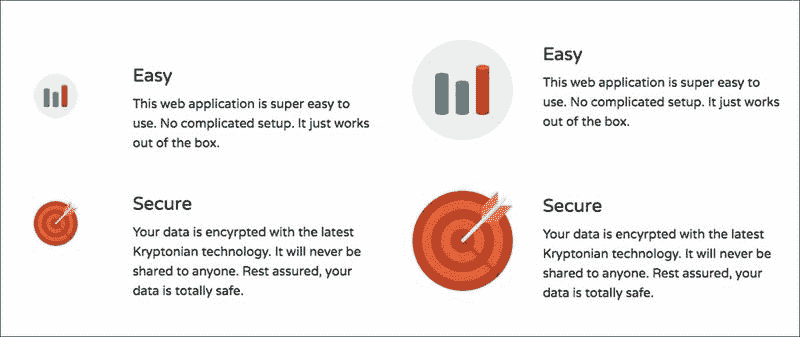

除此之外，`margin-bottom`以及我们添加的 padding，只是给这个部分增加了更多的空白。

1.  在特性部分下面，我们有一个展示满意客户的部分。我们称之为见证部分。添加以下样式规则来完善它：

```html
.startup-testimonial {
  padding: rem-calc(90 0);
  text-align: center;
  background-color: darken(#fff, 2%);
  blockquote {
    font-size: rem-calc(24);
  }
  figure {
    margin-top: 0;
    margin-bottom: 0;
    .avatar {
      border-radius: 50%;
      display: inline-block;
      width: 64px;
    }
  }
  figcaption {
    margin-top: rem-calc(20);
    color: darken(#fff, 30%);;
  }
}
```

1.  同时，通过改变`_config.scss`中`$blockquote-border`的值，也移除`blockquote`元素的左边框，如下所示：

```html
$blockquote-border: 0 solid #ddd;
```

请注意，上述样式仅仅是装饰。在这个阶段，这就是见证部分的外观：

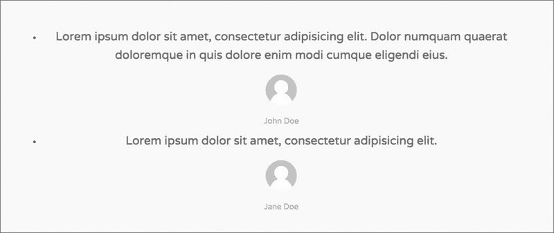

不要惊慌，它没有坏。剩下的样式将通过 Orbit Slider 插件添加一旦它被启用。我们很快就会看到这个步骤。

1.  接下来，我们将为价格和计划表格设置样式。这些都是表格价格的样式，它们的主要目的是给每个表格设置不同的颜色。

```html
.startup-pricing {
  $basic-bg      : #85c1d0;
  $team-bg       : #9489a3;
  $enterprise-bg : #d04040;

  padding-top: rem-calc(120);
  padding-bottom: rem-calc(120);
  .pricing-table {
    background-color: darken(#fff, 2%);
  }
  .pricing-basic {
    .title {
      background-color: $basic-bg;
    }
    .price {
      background-color: lighten($basic-bg, 25%);
    }
  }
  .pricing-team {
    .title {
      background-color: $team-bg;
    }
    .price {
      background-color: lighten($team-bg, 25%);
    }
  }
  .pricing-enterprise {
  .title {
      background-color: $enterprise-bg;
    }
    .price {
      background-color: lighten($enterprise-bg, 25%);
    }
   }
}
```

1.  页脚部分是简单的。没有什么显著的。只是一堆样式规则，让页脚看起来更漂亮，如下所示：

```html
.startup-footer {
  $footer-bg: darken(#fff, 5%);
  text-align: center;
  padding: rem-calc(60 0 30);
  background-color: $footer-bg;
  border-top: 1px solid darken($footer-bg, 15%);
  .footer-nav {
    ul {
      margin-left: 0;
    }
    li {
      display: inline-block;
      margin: rem-calc(0 10);
    }
    a {
      color: darken($footer-bg, 30%);
      @include transition (color 300ms ease-out);
      &:hover {
        color: darken($footer-bg, 70%);
      }
    }
  }
  .social-nav {
    li a:before {
      margin-right: rem-calc(5);
      position: relative;
      top: 2px;
    }
    .foundicon-facebook:hover {
      color: #3b5998;
    }
    .foundicon-twitter:hover {
      color: #55acee;
    }
  }
  .footer-copyright {
    margin-top: rem-calc(30);
    color: darken($footer-bg, 15%);
  }
}
```

## *刚刚发生了什么？*

在这一部分，我们关注了网站的外观。我们只是添加了最终使网站从头部到页脚看起来更漂亮的样式。然而，在这个阶段有一些东西是不可行的，比如 Orbit，我们还没有测试网站在较小的视口尺寸下的外观。所以，这正是我们接下来要解决的问题。这就是网站在这个阶段应该看起来的样子：

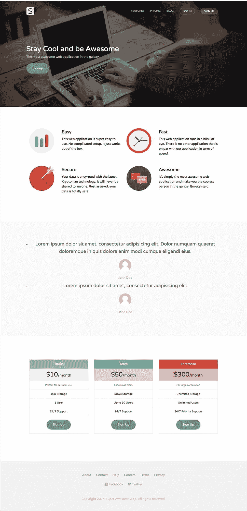

## 尝试一下-颜色和创意

我意识到好坏美丑都是高度主观的。这完全取决于个人偏好和品味程度。因此，如果我们在前面步骤中指定的网站装饰，如颜色、字体和大小，不符合您的口味，您可以自由更改它们并添加自己的创意。

## 小测验-导入外部 Sass 样式表

Q1. 希望您完全按照前面的步骤进行操作，并注意一些细节。我们已经导入了许多样式表，将它们编译成一个单独的样式表。我们如何使 Sass 编译器忽略这些导入的样式表，以便编译器不会将它们单独编译成 CSS 文件？

1.  在导入声明中删除扩展文件的扩展名。

1.  在导入声明中添加下划线作为前缀。

1.  在文件名中添加下划线作为前缀。

# 微调网站

如前所述，在我们称网站完成之前，有一些事情需要做。首先，我们将启用轨道和顶部栏的切换功能，并为较小的视口大小优化网站样式，如定位和大小。又到了行动的时候。

# 行动时间-使用媒体查询编译 JavaScript 和设置网站样式

执行以下步骤来编译 JavaScript 文件并优化小视口大小的网站：

1.  在`assets/js`目录中创建一个名为`foundation.js`的新 JavaScript 文件。

1.  在`foundation.js`中，导入以下 JavaScript 文件：

```html
// @koala-prepend "../../components/foundation/js/vendor/jquery.js"
// @koala-prepend "../../components/foundation/js/foundation/foundation.js"
// @koala-prepend "../../components/foundation/js/foundation/foundation.topbar.js"
// @koala-prepend "../../components/foundation/js/foundation/foundation.orbit.js"
```

1.  通过 Koala，编译`foundation.js`。

1.  然后，打开`index.html`，并在`</body>`之前添加以下行，以启用轨道滑块的功能：

```html
<script src="img/foundation.min.js"></script>
<script>
$(document).foundation({
     orbit: {
       timer_speed: 3000,
       pause_on_hover: true,
       resume_on_mouseout: true,
       slide_number: false
     }
    });
</script>
```

1.  现在，我们将通过媒体查询优化较小视口的网站布局。为此，我们需要取消注释在 Foundation 中定义的媒体查询范围的变量，以便我们也可以在我们的样式表中使用它们：

```html
$small-range: (0em, 40em);
$medium-range: (40.063em, 64em);
$large-range: (64.063em, 90em);
$xlarge-range: (90.063em, 120em);
$xxlarge-range: (120.063em, 99999999em);

$screen: "only screen";

$landscape: "#{$screen} and (orientation: landscape)";
$portrait: "#{$screen} and (orientation: portrait)";

$small-up: $screen;
$small-only: "#{$screen} and (max-width: #{upper-bound($small-range)})";

$medium-up: "#{$screen} and (min-width:#{lower-bound($medium-range)})";
$medium-only: "#{$screen} and (min-width:#{lower-bound($medium-range)}) and (max-width:#{upper-bound($medium-range)})";

$large-up: "#{$screen} and (min-width:#{lower-bound($large-range)})";
$large-only: "#{$screen} and (min-width:#{lower-bound($large-range)}) and (max-width:#{upper-bound($large-range)})";

$xlarge-up: "#{$screen} and (min-width:#{lower-bound($xlarge-range)})";
$xlarge-only: "#{$screen} and (min-width:#{lower-bound($xlarge-range)}) and (max-width:#{upper-bound($xlarge-range)})";

$xxlarge-up: "#{$screen} and (min-width:#{lower-bound($xxlarge-range)})";
$xxlarge-only: "#{$screen} and (min-width:#{lower-bound($xxlarge-range)}) and (max-width:#{upper-bound($xxlarge-range)})";
```

### 提示

我们可以在自己的样式表中使用这些变量，如下所示：

`@media #{$small-up} {`

`}`

1.  现在，我们将通过这些媒体查询定义一些样式规则，以调整网站的样式，特别是大小、定位和空白。

1.  这些都是要添加到`_responsive.scss`中的所有样式规则。

```html
@media #{$small-up} {
  .startup-name a {
    position: relative;
    left: rem-calc(15);
  }
}
@media #{$small-only} {
  .startup-header {
    .startup-name a {
      background-size: auto 80%;
    }
    .startup-top-bar {
      padding-top: rem-calc(15);
      .top-bar-section {
        text-align: center;
      }
      .sign-up {
        padding-top: 0;
      }
    }
    .startup-hero {
      text-align: center;
    }
  }
  .startup-footer {
    .secondary-nav {
      li, a {
        display: block;
      }
      a {
        padding: rem-calc(10);
      }
    }
  }
}
@media #{$medium-up} {
  .startup-top-bar {
    .log-in {
      padding-right: 3px; 
    }
    .sign-up {
      padding-left: 3px; 
    }
  }
}
@media #{$large-only} {
    .startup-name a {
    position: relative;
    left: rem-calc(0);
  }
} 
```

## *刚刚发生了什么？*

我们刚刚编译了 JavaScript，以启用轨道滑块和顶部栏的切换功能。我们还为较小的视口大小优化了网站布局。以下截图显示了网站在小视口下的外观：

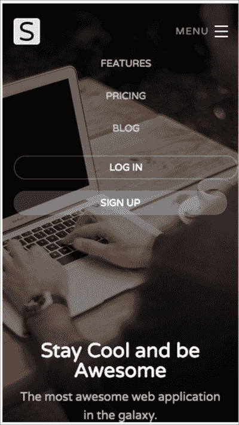

这很好，不是吗？

## 试一试-删除不必要的 Foundation 组件

我们包含了所有 Foundation 组件，即使我们在网站中没有使用。因此，最好删除所有对网站没有优势的样式。打开`_foundation.scss`，并注释掉我们不需要的`@import`组件（至少目前不需要），然后重新编译样式表。

# 总结

我们刚刚完成了第三个项目，使用 Foundation 为一家新创公司构建了一个响应式网站。在完成这个项目的过程中，我们学到了很多东西，特别是关于 Sass。Sass 是一个强大的 CSS 预处理器，可以让我们以更高效和灵活的形式组合样式。我们已经学会了使用变量、插值、混合和其他一些 Sass 功能。

坦率地说，包括我们在前几章中构建的网站在内，都很容易构建。我们的工作主要是使网站外观更加美观，比如颜色和大小。而对于使网站响应式最重要的事情，比如网格，已经被我们使用的框架（Foundation、Bootstrap 和 Responsive.gs）覆盖了。

总之，我们希望本书中呈现的项目对您自己构建响应式网站是一个很好的开始。
