# 第八章：过渡，变换和动画

在历史上，每当需要移动或在屏幕上动画元素时，这完全是 JavaScript 的专属领域。如今，CSS 可以通过三个主要代理来处理大部分运动工作：CSS 过渡，CSS 变换和 CSS 动画。实际上，只有过渡和动画与运动直接相关，变换只是允许我们改变元素，但正如我们将看到的那样，它们经常是成功运动效果的不可或缺的部分。

为了清楚地理解每个事物的责任，我将提供这个可能过于简化的总结：

+   当您已经有要应用运动的事物的起始状态和结束状态，并且需要一种简单的方法从一个状态过渡到另一个状态时，请使用 CSS 过渡。

+   如果您需要在不影响页面布局的情况下在视觉上转换项目，请使用 CSS 变换。

+   如果您想要在不同的关键点上对元素执行一系列更改，请使用 CSS 动画。

好了，我们最好继续努力，了解如何运用所有这些能力。在本章中，我们将涵盖：

+   CSS3 过渡是什么以及我们如何使用它们

+   如何编写 CSS3 过渡及其简写语法

+   CSS3 过渡时间函数（`ease`，`cubic-bezier`等）

+   响应式网站的有趣过渡效果

+   CSS3 变换是什么以及我们如何使用它们

+   理解不同的 2D 变换（`缩放`，`旋转`，`倾斜`，`平移`等）

+   理解 3D 变换

+   如何使用`keyframes`和 CSS3 进行动画

# CSS3 过渡是什么以及我们如何使用它们

过渡是使用 CSS 创建一些视觉“效果”的最简单方法，用于在一个状态和另一个状态之间进行过渡。让我们考虑一个简单的例子，当悬停时，一个元素从一个状态过渡到另一个状态。

在 CSS 中为超链接设置样式时，常见做法是创建悬停状态；这是一种明显的方式，可以让用户意识到他们悬停在的项目是一个链接。悬停状态对于越来越多的触摸屏设备来说并不重要，但对于鼠标用户来说，它们是网站和用户之间的一个很好且简单的交互。它们也很方便用于说明过渡效果，这就是我们将要开始的地方。

传统上，仅使用 CSS，悬停状态是一个开/关的事情。元素上有一组默认的属性和值，当指针悬停在该元素上时，属性和值会立即更改。然而，正如其名称所示，CSS3 过渡允许我们在一个或多个属性和值之间过渡到其他属性和值。

### 提示

首先要知道的是，您不能从`display: none;`进行过渡。当某物设置为`display: none;`时，它实际上没有在屏幕上“绘制”，因此没有现有状态可以进行过渡。为了创建某物淡入的效果，您必须过渡不透明度或位置值。其次，并非所有属性都可以进行过渡。为了确保您不会尝试不可能的事情，这是可过渡的属性列表：[`www.w3.org/TR/css3-transitions/`](http://www.w3.org/TR/css3-transitions/)

如果您打开`example_08-01`，您会看到`nav`中有一些链接。以下是相关的标记：

```html
<nav>
    <a href="#">link1</a>
    <a href="#">link2</a>
    <a href="#">link3</a>
    <a href="#">link4</a>
    <a href="#">link5</a>
</nav>
```

这是相关的 CSS：

```html
a {
    font-family: sans-serif;
    color: #fff;
    text-indent: 1rem;
    background-color: #ccc;
    display: inline-flex;
    flex: 1 1 20%;
    align-self: stretch;
    align-items: center;
    text-decoration: none;
    transition: box-shadow 1s;
}

a + a {
    border-left: 1px solid #aaa;
}

a:hover {
    box-shadow: inset 0 -3px 0 #CC3232;
}
```

这是两种状态，首先是默认状态：

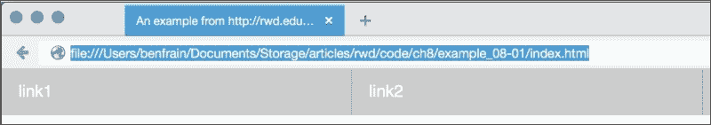

然后这是悬停状态：

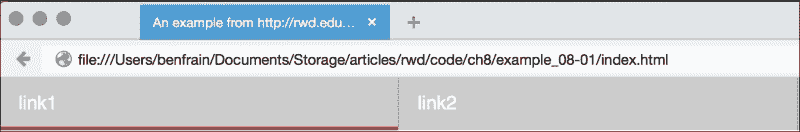

在这个例子中，当链接悬停时，我们在底部添加了一个红色的阴影（我选择了一个阴影，因为它不会像边框一样影响链接的布局）。通常，悬停在链接上会从第一个状态（没有红线）转换到第二个状态（红线）；这是一个开/关的事情。然而，这一行：

```html
transition: box-shadow 1s;
```

将`box-shadow`从现有状态过渡到悬停状态，持续 1 秒。

### 提示

你会注意到在前面示例的 CSS 中，我们使用了相邻兄弟选择器`+`。这意味着如果一个选择器（在我们的示例中是锚点标签）直接跟在另一个选择器（另一个锚点标签）后面，那么应用封闭的样式。这在这里很有用，因为我们不希望第一个元素有左边框。

请注意，过渡属性应用于元素的原始状态，而不是元素最终的状态。简而言之，在“from”状态上应用过渡声明，而不是“to”状态。这样不同的状态，比如`:active`，也可以有不同的样式设置，并享受相同的过渡。

## 过渡的属性

可以使用最多四个属性声明过渡：

+   `transition-property`：要过渡的 CSS 属性的名称（例如`background-color`、`text-shadow`或`all`以过渡每个可能的属性）。

+   `transition-duration`：过渡应该发生的时间长度（以秒为单位，例如`.3s`、`2s`或`1.5s`）。

+   `transition-timing-function`：过渡在持续时间内如何改变速度（例如`ease`、`linear`、`ease-in`、`ease-out`、`ease-in-out`或`cubic-bezier`）。

+   `transition-delay`：确定过渡开始之前的延迟的可选值。或者，可以使用负值立即开始过渡，但在过渡的“旅程”中间。它以秒为单位，例如`.3s`、`1s`或`2.5s`。

单独使用，各种过渡属性可以创建这样的过渡：

```html
.style {
    /*...(more styles)...*/
    transition-property: all;
    transition-duration: 1s;
    transition-timing-function: ease;
    transition-delay: 0s;
}
```

## 过渡的简写属性

我们可以将这些单独的声明合并成一个简写版本：

```html
transition: all 1s ease 0s;
```

在写简写版本时要注意的一个重要点是，给出的第一个与时间相关的值总是被视为`transition-duration`。第二个与时间相关的值被视为`transition-delay`。我通常更喜欢简写版本，因为我通常只需要定义过渡的持续时间和应该过渡的属性。

这只是一个小问题，但是只定义你实际需要过渡的属性。只设置`all`非常方便，但如果你只需要过渡不透明度，那么只定义不透明度作为过渡属性。否则，你会让浏览器比必要的工作更加艰难。在大多数情况下，这并不是什么大问题，但是如果你希望在老设备上尽可能地提高性能，那么每一点都有帮助。

### 提示

过渡非常受支持，但是要确保你有像 Autoprefixer 这样的工具设置好，以添加任何与你需要支持的浏览器相关的供应商前缀。你也可以在[caniuse.com](http://caniuse.com)上检查哪些浏览器支持各种功能。

**简写版本：**

过渡和 2D 变换在 IE9 及以下版本之外都可以工作，3D 变换在 IE9 及以下版本、Android 2.3 及以下版本以及 Safari 3.2 及以下版本之外都可以工作。

## 在不同的时间段内过渡不同的属性

当一个规则有多个声明的属性时，你不必以相同的方式过渡所有这些属性。考虑这条规则：

```html
.style {
    /* ...(more styles)... */
    transition-property: border, color, text-shadow;
    transition-duration: 2s, 3s, 8s; 
}
```

在这里，我们已经指定了我们希望过渡`border`、`color`和`text-shadow`的`transition-property`。然后在`transition-duration`声明中，我们规定了边框应该在 2 秒内过渡，颜色在 3 秒内过渡，文本阴影在 8 秒内过渡。逗号分隔的持续时间与逗号分隔的过渡属性的顺序相匹配。

## 理解时间函数

当你声明一个过渡时，属性、持续时间和延迟相对简单理解。然而，理解每个时间函数的作用可能会有点棘手。`ease`、`linear`、`ease-in`、`ease-out`、`ease-in-out`和`cubic-bezier`到底是什么？它们实际上都是预定义的三次贝塞尔曲线，本质上与缓动函数相同。或者更简单地说，这是过渡应该如何呈现的数学描述。通常更容易可视化这些曲线，所以我建议你去[`cubic-bezier.com/`](http://cubic-bezier.com/)和[`easings.net/`](http://easings.net/)看一看。

这两个网站都可以让你比较时间函数，并看到每个时间函数的区别。这是[`easings.net`](http://easings.net)的截图——你可以悬停在每条线上演示缓动函数。

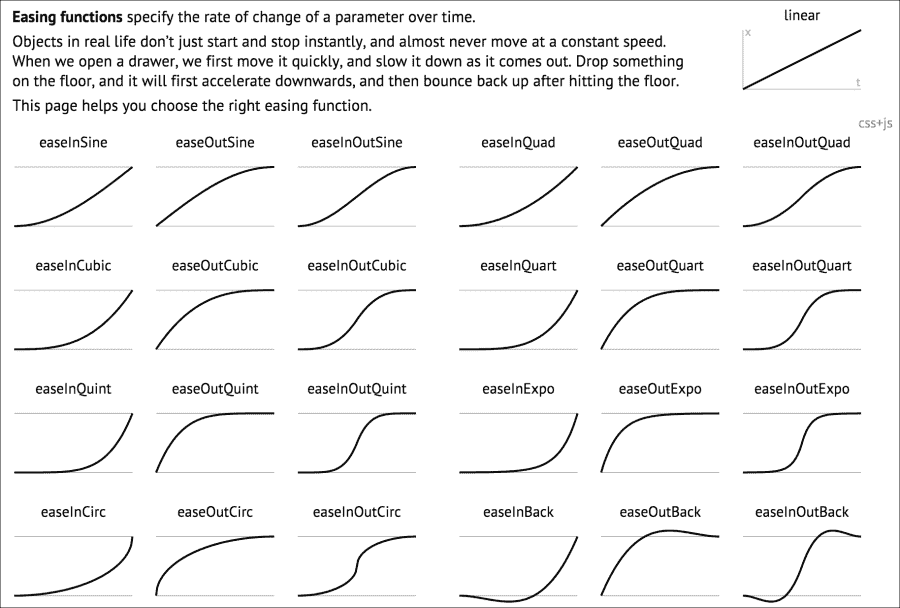

然而，即使你能闭着眼睛写出自己的三次贝塞尔曲线，对于大多数实际情况来说，这可能并没有太大的区别。原因是，像任何增强功能一样，必须谨慎地使用过渡效果。对于“真实世界”的实现，过长的过渡时间会让网站感觉缓慢。例如，需要 5 秒才能完成过渡的导航链接会让用户感到沮丧，而不是惊叹。速度的感知对我们的用户非常重要，你和我必须集中精力让网站和应用程序尽可能地快。

因此，除非有充分的理由这样做，通常最好在短时间内使用默认的过渡（ease）；我个人偏好最长 1 秒。

## 响应式网站的有趣过渡效果

你是否在成长过程中有过这样的情况，一个父母出门了，另一个父母说了类似这样的话：“好吧，你妈妈/爸爸出门了，我们要在你的早餐麦片上撒满糖，但你要答应他们回来后不告诉他们”？我肯定对我的孩子们做过这样的事。所以这样吧，趁没人注意，让我们玩一点。我不建议在生产中这样做，但是尝试将这个添加到你的响应式项目中。

```html
* {
    transition: all 1s; 
}
```

在这里，我们使用 CSS 通用选择器`*`选择所有内容，然后为所有属性设置 1 秒的过渡时间（1s）。由于我们没有指定时间函数，因此默认情况下将使用 ease，并且如果没有添加替代值，则默认为 0 延迟。效果如何？嗯，尝试调整浏览器窗口大小，大多数东西（链接、悬停状态等）的行为都如你所期望的那样。然而，因为一切都在过渡，这也包括媒体查询中的任何规则，因此随着浏览器窗口的调整，元素会从一种状态流动到另一种状态。这是必要的吗？绝对不是！但是看起来很有趣，可以玩一下！现在，在你妈妈看到之前，删除这条规则！

# CSS3 2D 变换

尽管听起来相似，但 CSS 变换与 CSS 过渡完全不同。可以这样理解：过渡使元素从一种状态平滑地转换到另一种状态，而变换则定义了元素实际上会变成什么样。我自己（虽然有点幼稚）记住这个区别的方式是这样的：想象一个变形金刚机器人，比如大黄蜂。当他变成卡车时，他已经变形了。然而，从机器人到卡车的过程是一个过渡（他正在从一种状态过渡到另一种状态）。

显然，如果你根本不知道奥普蒂默斯·普莱姆是谁或是什么，可以随意忽略最后几句。希望一切很快就会变得清晰起来。

有两组可用的 CSS3 变换：2D 和 3D。 2D 变体在浏览器方面得到了更广泛的实现，并且肯定更容易编写，所以让我们首先看看这些。 CSS3 2D 变换模块允许我们使用以下变换：

+   `缩放`：用于缩放元素（放大或缩小）

+   `平移`：在屏幕上移动元素（上，下，左和右）

+   `rotate`：按指定的角度旋转元素

+   `倾斜`：用于倾斜具有其 x 和 y 坐标的元素

+   `矩阵`：允许您以像素精度移动和形状变换

### 提示

重要的是要记住，变换发生在文档流之外。 任何被转换的元素都不会影响附近未被转换的元素的位置。

让我们尝试各种 2D 转换。 您可以通过在浏览器中打开`example_08-02`来测试这些转换中的每一个。 对所有变换应用了过渡，因此您可以更好地了解发生了什么。

## 缩放

这是`scale`的语法：

```html
.scale:hover {
    transform: scale(1.4);
}
```

在我们的示例中悬停在“缩放”链接上会产生这种效果：

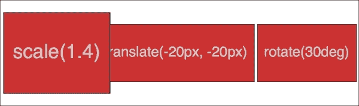

我们告诉浏览器，当悬停在此元素上时，我们希望元素的比例放大到原始值的 1.4 倍。

除了我们已经用来放大元素的值之外，通过使用小于 1 的值，我们可以缩小元素； 以下将使元素缩小到其一半大小：

```html
transform: scale(0.5);
```

## 翻译

这是`translate`的语法：

```html
.translate:hover {
    transform: translate(-20px, -20px);
}
```

这是我们的示例中该规则的效果：

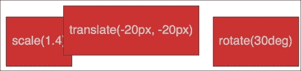

`translate`属性告诉浏览器按指定的像素或百分比移动元素。 第一个值是*x*轴，第二个值是*y*轴。 括号中给出的正值将使元素向右或向下移动； 负值将使其向左或向上移动。

如果只传递一个值，则应用于*x*轴。 如果要指定一个轴来平移元素，还可以使用`translateX`或`translateY`。

### 使用 translate 将绝对定位的元素居中

`translate`提供了一种非常有用的方法，可以在相对定位的容器内居中绝对定位的元素。 您可以在`example_08-03`中查看此示例。

考虑以下标记：

```html
<div class="outer">
    <div class="inner"></div>
</div>
```

然后是这个 CSS：

```html
.outer {
    position: relative;
    height: 400px;
    background-color: #f90;
}

.inner {
    position: absolute;
    height: 200px;
    width: 200px;
    margin-top: -100px;
    margin-left: -100px;
    top: 50%;
    left: 50%;
}
```

您可能自己做过类似的事情。 当绝对定位元素的尺寸已知（在这种情况下为 200px x 200px）时，我们可以使用负边距将项目“拉回”到中心。 但是，当您想要包含内容并且无法知道其高度时会发生什么？ 变换来拯救。

让我们在内部框中添加一些随机内容：

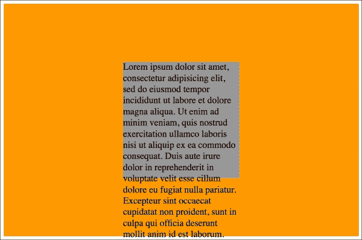

是的，就是那个问题！ 好吧，让我们使用`transform`来解决这个问题。

```html
.inner {
    position: absolute;
    width: 200px;
    background-color: #999;
    top: 50%;
    left: 50%;
    transform: translate(-50%, -50%);
}
```

以下是结果：

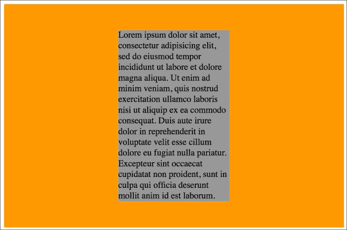

在这里，`top`和`left`定位内部框在其容器内，使内部框的左上角从外部向下 50%处和向右 50%处开始。 然后`transform`在内部元素上起作用，并通过其自身宽度和高度的一半（-50%）在这些轴上定位。 很好！

## 旋转

`rotate`变换允许您旋转元素。 这是语法：

```html
.rotate:hover {
    transform: rotate(30deg);
}
```

在浏览器中，发生了什么：

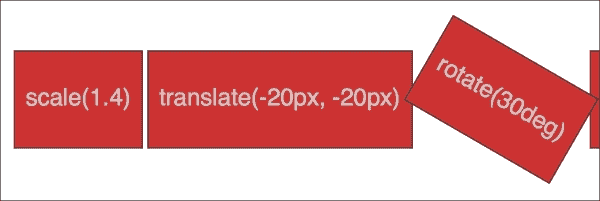

括号中的值应始终为度数（例如，90 度）。 正值始终顺时针应用，使用负值将使元素逆时针旋转。 您还可以通过指定以下值来使元素旋转：

```html
transform: rotate(3600deg);
```

这将使元素在一个完整的圆圈中旋转 10 次。 对于这个特定值的实际用途很少，但是您知道，如果您发现自己为风车公司设计网站，它可能会派上用场。

## 倾斜

如果您在 Photoshop 中工作过一段时间，您可能对`skew`会做什么有一个很好的想法。它允许元素在其一个或两个轴上倾斜。这是我们示例的代码：

```html
.skew:hover {
    transform: skew(40deg, 12deg);
}
```

将其设置为悬停链接会产生以下悬停效果：

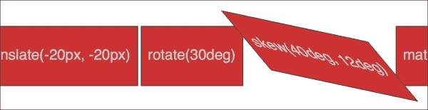

第一个值是应用于*x*轴的`skew`（在我们的示例中为 40 度），而第二个值（12 度）是应用于*y*轴的。省略第二个值意味着任何值仅仅应用于*x*轴（水平）。例如：

```html
transform: skew(10deg);
```

## 矩阵

有人提到了一部被高估的电影吗？没有？什么？你想了解 CSS3 矩阵，而不是电影？好的。

我不会撒谎。我觉得矩阵变换语法看起来很可怕。这是我们的示例代码：

```html
.matrix:hover {
    transform: matrix(1.678, -0.256, 1.522, 2.333, -51.533, -1.989);
}
```

它基本上允许您将许多其他变换（`scale`、`rotate`、`skew`等）组合成一个声明。前面的声明会在浏览器中产生以下效果：

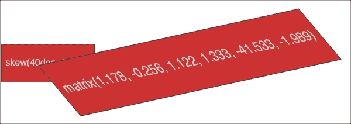

现在，我喜欢挑战，就像其他人一样（除非，你知道，是坐在*暮光之城*电影里），但我相信我们可以一致同意这个语法有点考验。对我来说，当我看规范并意识到它涉及超出我基本水平的数学知识时，情况变得更糟：[`www.w3.org/TR/css3-2d-transforms/`](http://www.w3.org/TR/css3-2d-transforms/)

### 提示

如果您发现自己在 JavaScript 中进行动画工作而没有动画库的帮助，您可能需要更加熟悉矩阵。它是所有其他变换计算出的语法，因此如果您使用 JavaScript 获取动画的当前状态，您需要检查和理解的将是矩阵值。

### 作弊者和蠢蛋的矩阵变换

我绝对不是数学家，所以当需要创建基于矩阵的变换时，我会作弊。如果您的数学技能也不足，我建议您前往[`www.useragentman.com/matrix/`](http://www.useragentman.com/matrix/)。

Matrix Construction Set 网站允许您将元素拖放到您想要的位置，然后在 CSS 文件中包括好的复制和粘贴代码（包括供应商前缀）。

## transform-origin 属性

请注意，使用 CSS 时，默认的变换原点（浏览器用作变换中心的点）位于中间：元素的*x*轴和*y*轴上分别为 50%。这与 SVG 不同，后者默认为左上角（或 0 0）。

使用`transform-origin`属性，我们可以修改变换的起始点。

考虑我们之前的矩阵变换。默认的`transform-origin`是'50% 50%'（元素的中心）。Firefox 开发者工具显示了`transform`是如何应用的：

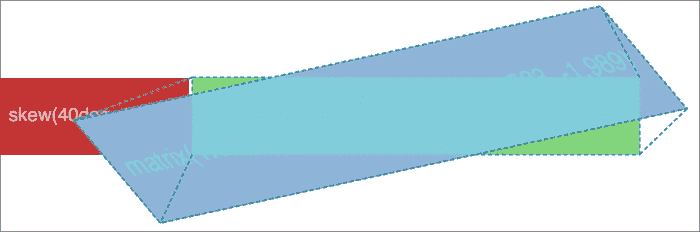

现在，如果我们像这样调整`transform-origin`：

```html
.matrix:hover {
   transform: matrix(1.678, -0.256, 1.522, 2.333, -51.533, -1.989);
   transform-origin: 270px 20px;
}
```

然后你可以看到这样的效果：


第一个值是水平偏移，第二个值是垂直偏移。您可以使用关键字。例如，left 等于 0%水平，right 等于 100%水平，top 等于 0%垂直，bottom 等于 100%垂直。或者，您可以使用长度，使用任何 CSS 长度单位。

如果您在`transform-origin`值中使用百分比，则水平/垂直偏移是相对于元素边界框的高度/宽度的。

如果您使用长度，则值是从元素边界框的左上角开始测量的。

有关`transform-origin`属性的完整信息可以在[`www.w3.org/TR/css3-2d-transforms/`](http://www.w3.org/TR/css3-2d-transforms/)找到。

这涵盖了 2D 变换的基本知识。它们比它们的 3D 兄弟更广泛地实现，并提供了一个比旧方法（如绝对定位）更好的移动元素在屏幕上的方法。

阅读 CSS3 2D Transforms Module Level 3 的完整规范，请访问[`www.w3.org/TR/css3-2d-transforms/`](http://www.w3.org/TR/css3-2d-transforms/)。

### 提示

有关使用`transform`移动元素的好处，请参阅 Paul Irish 的一篇很棒的文章（[`www.paulirish.com/2012/why-moving-elements-with-translate-is-better-than-posabs-topleft/`](http://www.paulirish.com/2012/why-moving-elements-with-translate-is-better-than-posabs-topleft/)），其中提供了一些很好的数据。

此外，关于浏览器如何处理过渡和动画，以及变换为何如此有效的概述，我强烈推荐阅读以下博客文章：[`blogs.adobe.com/webplatform/2014/03/18/css-animations-and-transitions-performance/`](http://blogs.adobe.com/webplatform/2014/03/18/css-animations-and-transitions-performance/)

# CSS3 3D transformations

让我们看看我们的第一个示例。当我们悬停在元素上时翻转的元素。我在这里使用悬停来调用更改，因为这对于说明来说很简单，然而翻转动作也可以通过类更改（通过 JavaScript）或当元素获得焦点时轻松地启动。

我们将有两个这样的元素；一个是水平翻转元素，一个是垂直翻转元素。您可以在`example_08-04`中查看最终示例。图片无法完全传达这种技术，但想法是元素从绿色“面”翻转到红色“面”，并在透视的帮助下产生在 3D 空间中进行翻转的错觉。这是从绿色到红色过渡的一部分效果。

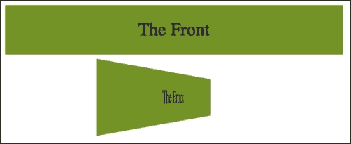

### 提示

值得知道的是，虽然使用 top/left/bottom/right 值绝对定位元素是以像素为单位的，但变换可以在亚像素位置进行插值。

以下是翻转元素的标记：

```html
<div class="flipper">
    <span class="flipper-object flipper-vertical">
        <span class="panel front">The Front</span>
        <span class="panel back">The Back</span>
    </span>
</div>
```

水平翻转元素的唯一区别是标记上的`flipper-horizontal`类，而不是`flipper-vertical`。

由于大多数样式与美学有关，我们只会看一下样式中使翻转效果成为可能的基本要素。有关美学样式，请参考示例中的完整样式表。

首先，我们需要为`.flipper-object`设置一些透视，以便在其中进行翻转。为此，我们使用`perspective`属性。这需要一个长度，试图模拟观看者屏幕到元素 3D 空间边缘的距离。

如果您设置了一个低值，比如 20px 作为透视值，元素的 3D 空间将延伸到距离屏幕仅 20px 的地方；结果是非常明显的 3D 效果。另一方面，设置一个高值将意味着那个想象的 3D 空间的边缘将更远，因此产生一个不太明显的 3D 效果。

```html
.flipper {
    perspective: 400px;
    position: relative;
}
```

我们将相对定位外部元素，以创建`flipper-object`在其中定位的上下文：

```html
.flipper-object {
    position: absolute;
    transition: transform 1s;
    transform-style: preserve-3d;
}
```

除了将`.flipper-object`绝对定位在其最近的相对定位的父元素的左上角（绝对定位元素的默认位置）之外，我们还为变换设置了一个过渡。在 3D 方面，关键的是`transform-styles: preserve-3d`。这告诉浏览器，当我们变换这个元素时，我们希望任何子元素都保持 3D 效果。

如果我们没有在`.flipper-object`上设置`preserve-3d`，我们将永远看不到翻转元素的背面（红色部分）。您可以在[`www.w3.org/TR/2009/WD-css3-3d-transforms-20090320/`](http://www.w3.org/TR/2009/WD-css3-3d-transforms-20090320/)上阅读此属性的规范。

我们翻转元素中的每个“面板”都需要定位在其容器的顶部，但我们也希望确保如果旋转了，我们不会看到它的“后面”（否则我们永远看不到绿色面板，因为它位于红色面板的“后面”）。为此，我们使用`backface-visibility`属性。我们将其设置为隐藏，以便元素的背面被隐藏：

```html
.panel {
    top: 0;
    position: absolute;
    backface-visibility: hidden;
}
```

### 提示

我发现`backface-visibility`在一些浏览器中实际上有一些令人惊讶的副作用。它特别适用于改善旧版 Android 设备上固定位置元素的性能。有关更多信息以及它为什么会产生这种效果，请查看这篇文章：[`benfrain.com/easy-css-fix-fixed-positioning-android-2-2-2-3/`](http://benfrain.com/easy-css-fix-fixed-positioning-android-2-2-2-3/)和这篇文章：[`benfrain.com/improving-css-performance-fixed-position-elements/`](http://benfrain.com/improving-css-performance-fixed-position-elements/)

接下来，我们希望默认情况下翻转我们的后面板（这样当我们翻转整个东西时，它实际上会处于正确的位置）。为此，我们应用了`rotate`变换：

```html
.flipper-vertical .back {
    transform: rotateX(180deg);
}

.flipper-horizontal .back {
    transform: rotateY(180deg);
}
```

现在一切都就绪，我们要做的就是在悬停在外部元素上时翻转整个内部元素：

```html
.flipper:hover .flipper-vertical {
    transform: rotateX(180deg);
}

.flipper:hover .flipper-horizontal {
    transform: rotateY(180deg);
}
```

您可以想象有无数种方式可以使用这些原则。如果您想知道带有一点透视效果的花哨导航效果或离屏菜单可能会是什么样子，我强烈建议您访问 Codrops：[`tympanus.net/Development/PerspectivePageViewNavigation/index.html`](http://tympanus.net/Development/PerspectivePageViewNavigation/index.html)。

### 提示

阅读有关 CSS Transforms Module Level 1 的最新 W3C 发展情况：[`dev.w3.org/csswg/css-transforms/`](http://dev.w3.org/csswg/css-transforms/)。

## transform3d 属性

除了使用透视，我还发现`transform3d`值非常有用。通过单个属性和值，这允许您在 X（左/右）、Y（上/下）和 Z（前/后）轴上移动元素。让我们修改我们的最后一个示例，利用`translate3d`变换。您可以在`example_08-06`中查看此示例。

除了用一点填充设置元素外，我们的上一个示例的唯一变化可以在这里看到：

```html
.flipper:hover .flipper-vertical {
    transform: rotateX(180deg) translate3d(0, 0, -120px);
    animation: pulse 1s 1s infinite alternate both;
}

.flipper:hover .flipper-horizontal {
    transform: rotateY(180deg) translate3d(0, 0, 120px);
    animation: pulse 1s 1s infinite alternate both;
}
```

我们仍然应用变换，但这次，除了我们的旋转之外，我们还添加了`translate3d`。您可以传递给`translate3d`的逗号分隔的“参数”的语法是*x*轴移动、*y*轴移动和*z*轴移动。

在我们的两个示例中，我没有在*x*或*y*轴（左右和上下）移动元素，而是向您移动或远离您。

如果您查看顶部示例，您会看到它在底部按钮后面翻转，并最终离屏幕更近 120 像素（负值实际上将其向您拉回）。


另一方面，底部按钮水平翻转，最终距离您 120 像素。

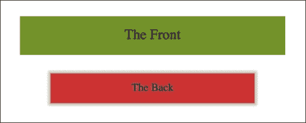

### 提示

您可以在[`www.w3.org/TR/css3-3d-transforms/`](http://www.w3.org/TR/css3-3d-transforms/)阅读`translate3d`的规范。

### 使用渐进增强的转换

我发现`transform3d`最有用的地方是在屏幕上滑动面板，特别是“离屏”导航模式。如果你打开`example_08-07`，你会看到我创建了一个基本的、逐步增强的离屏模式。

每当您使用 JavaScript 和现代 CSS 功能（如变换）创建交互时，考虑从您想要支持的最低可能设备的角度是有意义的。那么那两个没有 JavaScript 的人怎么办（是的，那些家伙），或者如果 JavaScript 加载或执行时出现问题怎么办？如果某人的设备不支持变换（例如 Opera Mini）怎么办？别担心，通过一点努力，可以确保每种情况下都有一个可用的界面。

在构建这种界面模式时，我发现从最低级别的功能开始，并从那里进行增强是最有用的。因此，首先确定如果没有 JavaScript 可用，某人会看到什么。毕竟，如果显示菜单的方法依赖于 JavaScript，将菜单停放在屏幕外是没有用的。在这种情况下，我们依赖于标记来将导航区域放在正常的文档流中。最坏的情况是，无论视口宽度如何，他们只需滚动页面并点击链接即可：

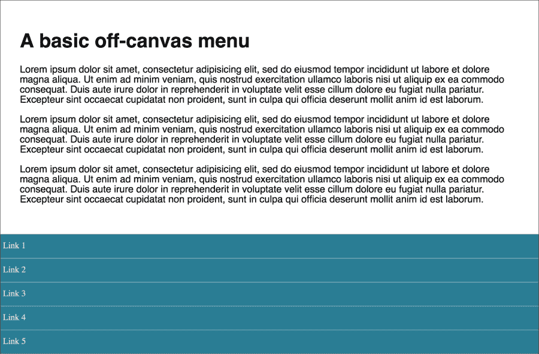

如果 JavaScript 可用，对于较小的屏幕，我们将菜单“拉”到左侧。当单击菜单按钮时，我们在`body`标签上添加一个类（使用 JavaScript），并使用这个类作为钩子，通过 CSS 将导航移回视图中。

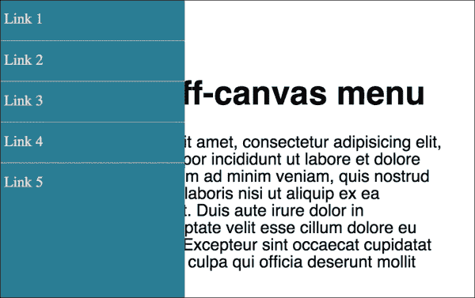

对于较大的视口，我们隐藏菜单按钮，仅将导航定位到左侧，并移动主要内容以适应。

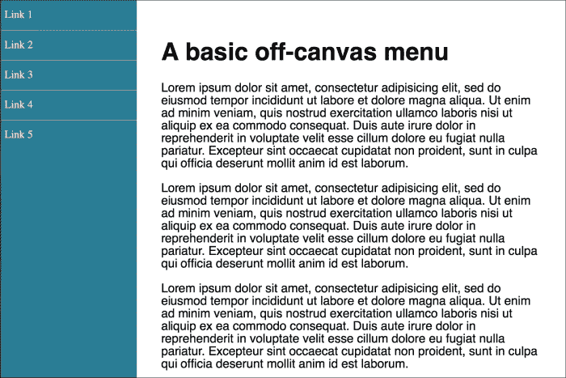

然后我们逐步增强导航显示/隐藏效果。这就是像 Modernizr 这样的工具真正发挥作用的地方；通过向 HTML 标签添加类，我们可以用作样式钩子（Modernizr 在第五章中有更详细的讨论，“CSS3 – 选择器、排版、颜色模式和新功能”）。

首先，对于只支持 translate 变换的浏览器（例如旧版 Android），简单的`translateX`：

```html
.js .csstransforms .navigation-menu {
    left: auto;
    transform: translateX(-200px);
}
```

对于支持`translate3d`的浏览器，我们使用`translate3d`。在支持的情况下，这将表现得更好，因为大多数设备上的图形处理器会卸载它：

```html
.js .csstransforms3d .navigation-menu {
    left: auto;
    transform: translate3d(-200px, 0, 0);
}
```

采用渐进增强方法可以确保尽可能广泛的受众能够从您的设计中获得可用的体验。记住，用户不需要视觉一致性，但他们可能会欣赏功能一致性。

# 使用 CSS3 进行动画制作

如果你曾经使用过 Flash、Final Cut Pro 或 After Effects 等应用程序，那么在使用 CSS3 动画时，你会立即获得优势。CSS3 采用了时间轴应用程序中找到的动画关键帧约定。

动画广泛实现；在 Firefox 5+、Chrome、Safari 4+、Android（所有版本）、iOS（所有版本）和 Internet Explorer 10+中都受支持。CSS3 动画有两个组成部分；首先是`keyframes`声明，然后在`animation`属性中使用该`keyframes`声明。让我们来看看。

在之前的示例中，我们对结合变换和过渡的元素进行了简单的翻转效果。让我们将本章学到的所有技术结合起来，并为之前的示例添加动画。在下一个示例中，`example_08-05`，让我们在元素翻转后添加一个脉动动画效果。

首先，我们将创建一个`keyframes` at-rule：

```html
@keyframes pulse {
  100% {
    text-shadow: 0 0 5px #bbb;
    box-shadow: 0 0 3px 4px #bbb;
  }
}
```

如您所见，在编写`@keyframes`来定义新的`keyframes` at-rule 后，我们为这个特定的动画命名（在这种情况下是 pulse）。

通常最好使用代表动画功能的名称，而不是你打算在哪里使用动画的名称，因为单个`@keyframes`规则可以在项目中使用多次。

在这里，我们使用了一个单一的关键帧选择器：100%。但是，在`keyframes`规则中，您可以设置尽可能多的关键帧选择器（定义为百分比点）。将这些想象成时间轴上的点。例如，在 10%处，使背景变蓝，在 30%处，使背景变紫，在 60%处，使元素半透明。您需要多少就设置多少。还有关键字 from，相当于 0%，to，相当于 100%。您可以这样使用它们：

```html
@keyframes pulse {
  to {
    text-shadow: 0 0 5px #bbb;
    box-shadow: 0 0 3px 4px #bbb;
  }
}
```

但是要注意，WebKit 浏览器（iOS，Safari）并不总是对 from 和 to 值（更喜欢 0%和 100%）很友好，所以我建议坚持使用百分比关键帧选择器。

在这里，您会注意到我们没有费心定义起点。那是因为起点是每个属性已经处于的状态。这是规范的一部分，解释了这一点：[`www.w3.org/TR/css3-animations/`](http://www.w3.org/TR/css3-animations/)

### 注意

如果未指定`0%`或`from`关键帧，则用户代理将使用正在动画化的属性的计算值构造`0%`关键帧。如果未指定`100%`或`to`关键帧，则用户代理将使用正在动画化的属性的计算值构造`100%`关键帧。如果关键帧选择器指定负百分比值或高于`100%`的值，则将忽略该关键帧。

在这个`keyframes` at-rule 中，我们在 100%处添加了 text-shadow 和 box-shadow。然后，我们可以期望`keyframes`应用到元素时，将文本阴影和框阴影动画到定义的程度。但是动画持续多久？我们如何使其重复，反转，以及其他可能性，我希望有答案？这就是我们实际应用`keyframes`动画的方法：

```html
.flipper:hover .flipper-horizontal {
    transform: rotateY(180deg);
    animation: pulse 1s 1s infinite alternate both;
}
```

这里的`animation`属性被用作多个与动画相关的属性的速记。在这个例子中，我们实际上是按顺序声明了要使用的`keyframes`声明的名称（pulse），`animation-duration`（1 秒），动画开始前的延迟（1 秒，以便我们的按钮首先翻转的时间），动画将运行的次数（无限次），动画的方向（交替，所以它先沿着一条路线动画，然后返回另一条路线），以及我们希望`animation-fill-mode`保留在`keyframes`中定义的值，无论是向前还是向后（两者都是）。

速记属性实际上可以接受所有七个动画属性。除了前面示例中使用的属性之外，还可以指定`animation-play-state`。这可以设置为 running 或 paused，以有效地播放和暂停动画。当然，您不需要使用速记属性；有时分别设置每个属性可能更有意义（并且在将来重新访问代码时可能会有所帮助）。以下是各个属性以及在适当的情况下，用管道符号分隔的备用值：

```html
.animation-properties {
    animation-name: warning;
    animation-duration: 1.5s;
    animation-timing-function: ease-in-out;
    animation-iteration-count: infinite;
    animation-play-state: running | paused;
    animation-delay: 0s;
    animation-fill-mode: none | forwards | backwards | both;
    animation-direction: normal | reverse | alternate | alternate-reverse;
}
```

### 注意

您可以在[`www.w3.org/TR/css3-animations/`](http://www.w3.org/TR/css3-animations/)上阅读每个这些动画属性的完整定义。

如前所述，可以简单地在其他元素上重用已声明的`keyframes`，并且具有完全不同的设置：

```html
.flipper:hover .flipper-vertical {
    transform: rotateX(180deg);
    animation: pulse 2s 1s cubic-bezier(0.68, -0.55, 0.265, 1.55) 5 alternate both;
}
```

在这里，`pulse`动画将持续 2 秒，并使用 ease-in-out-back 时间函数（定义为三次贝塞尔曲线）。它在两个方向上各运行五次。这个声明已经应用到示例文件中垂直翻转的元素上。

这只是使用 CSS 动画的一个非常简单的例子。几乎任何东西都可以成为关键帧，可能性非常广泛。阅读有关 CSS3 动画的最新发展，访问[`dev.w3.org/csswg/css3-animations/`](http://dev.w3.org/csswg/css3-animations/)。

## animation-fill-mode 属性

`animation-fill-mode`属性值得特别一提。考虑一个动画，从黄色背景开始，经过 3 秒动画到红色背景。你可以在`example_08-08`中查看。

我们这样应用动画：

```html
.background-change {
  animation: fillBg 3s;
  height: 200px;
  width: 400px;
  border: 1px solid #ccc;
}

@keyframes fillBg {
  0% {
    background-color: yellow;
  }
  100% {
    background-color: red;
  }
}
```

然而，一旦动画完成，`div`的背景将返回到原来的状态。这是因为默认情况下，“动画之外发生的事情，留在动画之外”！为了覆盖这种行为，我们有`animation-fill-mode`属性。在这种情况下，我们可以应用这样的属性：

```html
animation-fill-mode: forwards;
```

这使得项目保留了动画结束时应用的任何值。在我们的例子中，`div`将保留动画结束时的红色背景颜色。有关`animation-fill-mode`属性的更多信息，请参阅：[`www.w3.org/TR/css3-animations/#animation-fill-mode-property`](http://www.w3.org/TR/css3-animations/#animation-fill-mode-property)

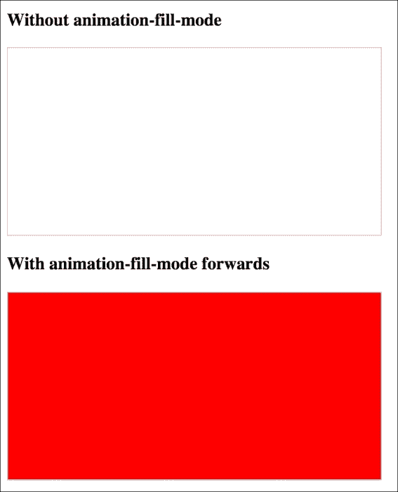

# 总结

填写多本书来覆盖 CSS 变换、过渡和动画的可能性是完全可能的。然而，希望通过本章的涉水，你能够掌握基础知识并运用它们。最终，通过拥抱 CSS 的这些新特性和技术，目标是使响应式设计比以往更加精简且丰富，而不是使用 JavaScript 来实现一些更花哨的美学增强。

在本章中，我们学习了 CSS3 过渡是什么以及如何编写它们。我们掌握了像 ease 和 linear 这样的时间函数，然后使用它们创建简单但有趣的效果。然后我们学习了所有关于`scale`和`skew`这样的 2D 变换，以及如何与过渡一起使用它们。我们还简要介绍了 3D 变换，然后学习了 CSS 动画的强大和相对简单。你最好相信我们的 CSS3 技能正在增长！

然而，如果有一个网站设计领域，我尽量避免的，那就是制作表单。我不知道为什么，我总是觉得制作它们是一项乏味且令人沮丧的任务。当我得知 HTML5 和 CSS3 可以比以往更容易地构建、样式化甚至验证（是的，验证！）整个表单过程时，我感到非常高兴。在下一章中，我想与你分享这些知识。
