# 第九章：使用 HTML5 和 CSS3 征服表单

在 HTML5 之前，添加诸如日期选择器、占位文本和范围滑块到表单中总是需要 JavaScript。同样，我们无法轻松地告诉用户我们希望他们在某些输入字段中输入什么，例如，我们是希望用户输入电话号码、电子邮件地址还是 URL。好消息是，HTML5 在很大程度上解决了这些常见问题。

本章有两个主要目标。首先，了解 HTML5 表单功能，其次，了解如何使用最新的 CSS 功能为多个设备更简单地布局表单。

在本章中，我们将学习如何：

+   轻松地在相关的表单输入字段中添加占位文本

+   在必要时禁用表单字段的自动完成

+   在提交之前设置某些字段为必填项

+   指定不同的输入类型，如电子邮件、电话号码和 URL

+   为了方便选择数值，创建数字范围滑块

+   将日期和颜色选择器放入表单中

+   学习如何使用正则表达式来定义允许的表单值

+   如何使用 Flexbox 样式化表单

# HTML5 表单

我认为理解 HTML5 表单的最简单方法是通过一个示例表单逐步进行。从最好的日间电视示例中，我有一个之前制作的。需要一个小的介绍。

两个事实：首先，我喜欢电影。其次，我对什么是一部好电影，什么不是有很强烈的意见。

每年奥斯卡提名公布时，我总是忍不住觉得奥斯卡学院选错了电影。因此，我们将从一个 HTML5 表单开始，让影迷们发泄对奥斯卡提名持续不公的不满。

它由几个`fieldset`元素组成，在其中我们包括了大量的 HTML5 表单输入类型和属性。除了标准的表单输入字段和文本区域，我们还有一个数字微调器、一个范围滑块，以及许多字段的占位文本。

在 Chrome 中没有应用样式的情况下是这样的：

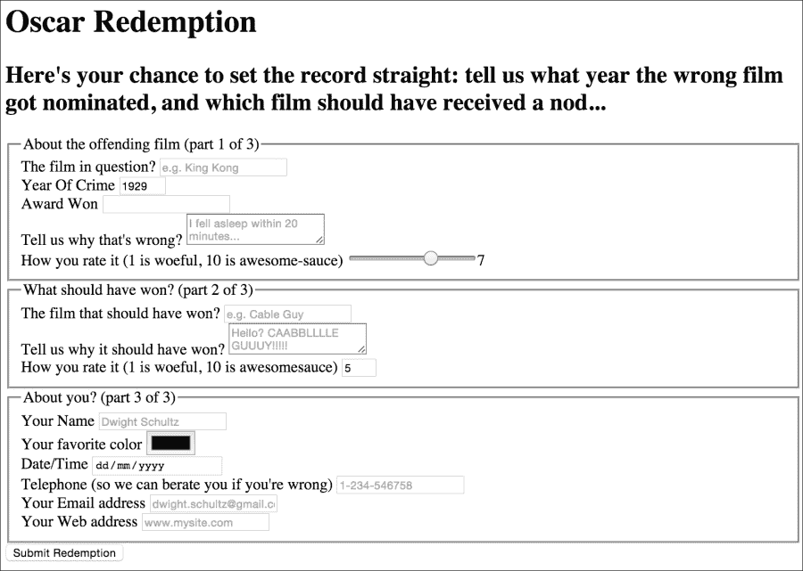

如果我们“聚焦”在第一个字段上并开始输入文本，占位文本将被移除。如果我们在不输入任何内容的情况下失去焦点（再次点击输入框外部），占位文本将重新出现。如果我们提交表单（没有输入任何内容），则会发生以下情况：


令人振奋的消息是，所有这些用户界面元素，包括前面提到的滑块、占位文本和微调器，以及输入验证，都是由浏览器通过 HTML5 原生处理的，而无需 JavaScript。现在，表单验证并不完全跨浏览器兼容，但我们很快就会解决这个问题。首先，让我们了解所有与表单相关的 HTML5 的新功能，以及使所有这些成为可能的机制。一旦我们了解了所有的机制，我们就可以开始着手进行样式设计。

# 理解 HTML5 表单的组成部分

我们的 HTML5 动力表单中有很多内容，让我们来分解一下。表单的三个部分都包裹在一个带有标题的`fieldset`中：

```html
<fieldset>
<legend>About the offending film (part 1 of 3)</legend>
<div>
  <label for="film">The film in question?</label>
  <input id="film" name="film" type="text" placeholder="e.g. King Kong" required>
</div>
```

从前面的代码片段中可以看到，表单的每个输入元素也都包裹在一个带有与每个输入相关联的标签的`div`中（如果我们也想的话，我们也可以用标签元素包装输入）。到目前为止，一切都很正常。然而，在这个第一个输入中，我们刚刚遇到了我们的第一个 HTML5 表单功能。在常见的 ID、名称和类型属性之后，我们有`placeholder`。

## 占位文本

`placeholder`属性看起来是这样的：

```html
placeholder="e.g. King Kong"
```

表单字段内的占位文本是一个如此常见的需求，以至于创建 HTML5 的人们决定它应该成为 HTML 的一个标准特性。只需在输入中包含`placeholder`属性，该值将默认显示，直到字段获得焦点。当失去焦点时，如果没有输入值，它将重新显示占位文本。

### 样式化占位文本

您可以使用`:placeholder-shown`伪选择器样式化`placeholder`属性。请注意，此选择器经历了许多迭代，因此请确保您已设置前缀工具，以提供已实现版本的回退选择器。

```html
input:placeholder-shown {
  color: #333;
}
```

在上一个代码片段中的`placeholder`属性之后，下一个 HTML5 表单功能是`required`属性。

## 必需的

`required`属性看起来像这样：

```html
required
```

在支持 HTML5 的浏览器中，通过在`input`元素内添加布尔值（意味着您只需包含属性或不包含属性），可以指示需要输入值的`required`属性。如果在不包含必要信息的字段提交表单，则应显示警告消息。显示的消息对于使用的浏览器和输入类型都是特定的（在内容和样式上）。

我们已经看到了`required`字段在 Chrome 中的浏览器消息是什么样子。以下截图显示了 Firefox 中相同的消息：

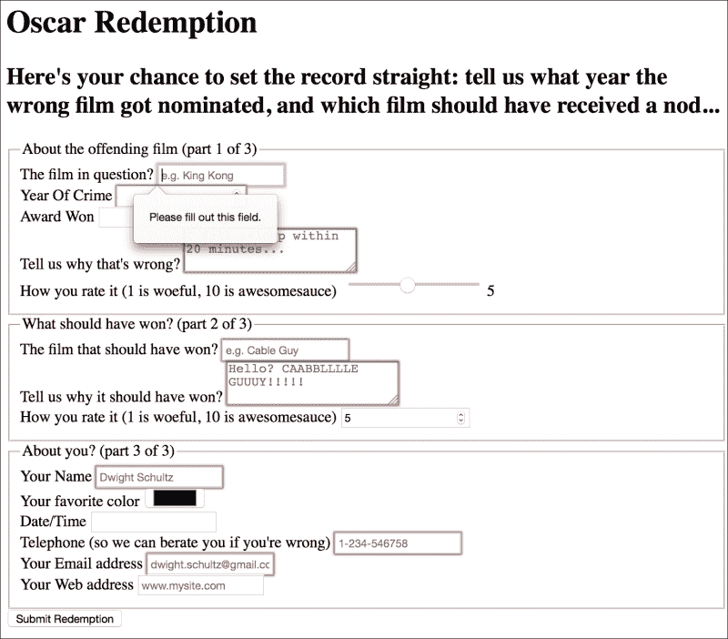

`required`值可以与许多输入类型一起使用，以确保输入值。需要注意的例外是`range`、`color`、`button`和`hidden`输入类型，因为它们几乎总是具有默认值。

## 自动聚焦

HTML5 的`autofocus`属性允许表单已经聚焦在一个字段上，准备好接受用户输入。以下代码是一个在`div`中添加了`autofocus`属性的`input`字段的示例：

```html
<div>
  <label for="search">Search the site...</label>
  <input id="search" name="search" type="search" placeholder="Wyatt Earp" autofocus>
</div>
```

在使用此属性时要小心。如果多个字段都添加了`autofocus`属性，则可能会在多个浏览器中引起混乱。例如，如果多个字段都添加了`autofocus`，在 Safari 中，具有`autofocus`属性的最后一个字段在页面加载时会聚焦。然而，Firefox 和 Chrome 在第一个`autofocus`字段被选中时会做相反的操作。

还值得考虑的是，一些用户在加载网页后会使用空格键快速跳过内容。在一个具有自动聚焦输入字段的表单页面上，它会阻止这种功能；相反，它会在聚焦的输入字段中添加一个空格。很容易看出这可能会成为用户的挫折之源。

如果使用`autofocus`属性，请确保它在表单中只使用一次，并确保您了解使用空格键滚动的用户的影响。

## 自动完成

默认情况下，大多数浏览器通过自动填充表单字段的值来帮助用户输入。虽然用户可以在浏览器中打开或关闭此偏好设置，但现在我们还可以指示浏览器在我们不希望表单或字段允许自动完成时。这不仅对于敏感数据（例如银行账号）有用，而且还可以确保用户注意并手动输入内容。例如，对于我填写的许多表单，如果需要电话号码，我会输入一个“欺骗”电话号码。我知道我不是唯一这样做的人（难道不是每个人都这样吗？），但我可以通过在相关输入字段上将`autocomplete`属性设置为关闭来确保用户不输入自动完成的欺骗号码。以下是一个将`autocomplete`属性设置为`off`的字段的代码示例：

```html
<div>
  <label for="tel">Telephone (so we can berate you if you're wrong)</label>
  <input id="tel" name="tel" type="tel" placeholder="1-234-546758" autocomplete="off" required>
</div>
```

我们还可以通过在表单本身上使用属性来设置整个表单（但不是字段集）不自动完成。以下是一个代码示例：

```html
<form id="redemption" method="post" autocomplete="off">
```

## 列表和相关的 datalist 元素

此`list`属性和相关的`datalist`元素允许在用户开始输入字段中的值后向用户呈现多个选择。以下是一个使用`list`属性的代码示例，其中包含一个相关的`datalist`，全部包装在一个`div`中：

```html
<div>
  <label for="awardWon">Award Won</label>
  <input id="awardWon" name="awardWon" type="text" list="awards">
  <datalist id="awards">
    <select>
      <option value="Best Picture"></option>
      <option value="Best Director"></option>
      <option value="Best Adapted Screenplay"></option>
      <option value="Best Original Screenplay"></option>
    </select>
  </datalist>
</div>
```

在`list`属性（`awards`）中给出的值是`datalist`的 ID。这样做可以将`datalist`与输入字段关联起来。虽然在`<select>`元素中包装选项并不是严格必要的，但在为尚未实现该功能的浏览器应用 polyfill 时会有所帮助。

### 注意

令人惊讶的是，到 2015 年中期，iOS、Safari 或 Android 4.4 及以下仍然不支持`datalist`元素（[`caniuse.com/`](http://caniuse.com/)）

您可以在[`www.w3.org/TR/html5/forms.html`](http://www.w3.org/TR/html5/forms.html)上阅读`datalist`的规范。

虽然`input`字段似乎只是一个普通的文本输入字段，但在输入字段时，支持的浏览器下方会出现一个选择框，其中包含来自`datalist`的匹配结果。在下面的截图中，我们可以看到列表的效果（Firefox）。在这种情况下，由于`B`在`datalist`中的所有选项中都存在，所有值都会显示给用户选择：

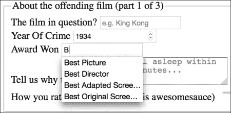

然而，当输入`D`时，只有匹配的建议会出现，如下面的截图所示：

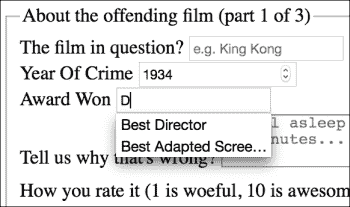

`list`和`datalist`不会阻止用户在输入框中输入不同的文本，但它们确实提供了另一种通过 HTML5 标记添加常见功能和用户增强的好方法。

# HTML5 输入类型

HTML5 添加了许多额外的输入类型，其中包括其他功能，使我们能够限制用户输入的数据，而无需额外的 JavaScript 代码。这些新输入类型最令人欣慰的是，默认情况下，如果浏览器不支持该功能，它们会退化为标准的文本输入框。此外，还有很多很好的 polyfill 可用于使旧版浏览器跟上步伐，我们很快会看到。与此同时，让我们来看看这些新的 HTML5 输入类型以及它们提供的好处。

## email

您可以像这样将输入设置为`email`类型：

```html
type="email"
```

支持的浏览器将期望用户输入与电子邮件地址的语法匹配。在下面的代码示例中，`type="email"`与`required`和`placeholder`一起使用：

```html
<div>
  <label for="email">Your Email address</label>
  <input id="email" name="email" type="email" placeholder="dwight.schultz@gmail.com" required>
</div>
```

当与 required 一起使用时，提交不符合规范的输入将生成警告消息：


此外，许多触摸屏设备（例如 Android、iPhone 等）会根据此输入类型改变输入显示。下面的截图显示了 iPad 上`type="email"`的输入屏幕的外观。请注意，软键盘已添加`@`符号，以便轻松完成电子邮件地址：

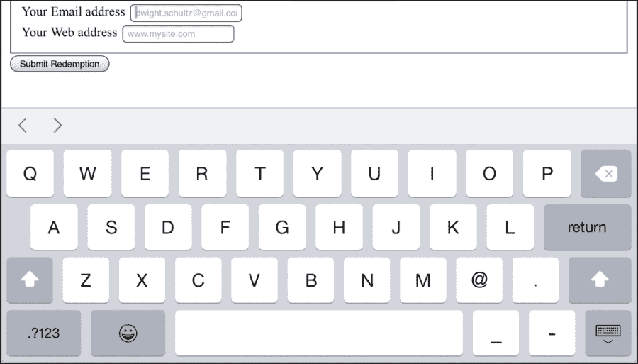

## 数字

您可以像这样将输入字段设置为数字类型：

```html
type="number"
```

支持的浏览器期望在此输入数字。支持的浏览器还提供所谓的**微调控件**。这些是微小的用户界面元素，允许用户轻松点击上下来改变输入的值。以下是一个代码示例：

```html
<div>
  <label for="yearOfCrime">Year Of Crime</label>
  <input id="yearOfCrime" name="yearOfCrime" type="number" min="1929" max="2015" required>
</div>
```

以下是在支持的浏览器（Chrome）中的外观截图：

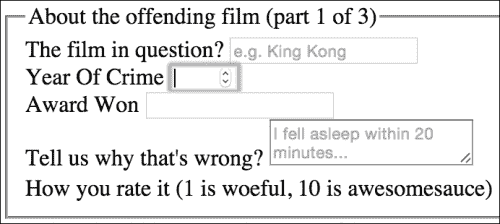

如果不输入数字，不同浏览器的实现方式也不同。例如，Chrome 和 Firefox 在表单提交之前不会做任何操作，然后在字段上方弹出警告。另一方面，Safari 什么也不做，只是让表单被提交。Internet Explorer 11 在焦点离开字段时会清空字段。

### 最小和最大范围

在上一个代码示例中，我们还设置了允许的最小和最大范围，类似于以下代码：

```html
type="number" min="1929" max="2015"
```

超出此范围的数字（应该）会得到特殊处理。

您可能不会感到惊讶，浏览器对`min`和`max`范围的实现是各不相同的。例如，Internet Explorer 11、Chrome 和 Firefox 会显示警告，而 Safari 则什么也不做。

### 更改步进增量

您可以使用`step`属性来改变各种输入类型的微调控件的步进增量（粒度）。例如，每次步进 10 个单位：

```html
<input type="number" step="10">
```

## url

您可以设置输入字段期望输入 URL，如下所示：

```html
type="url"
```

正如您所期望的，`url`输入类型用于 URL 值。与`tel`和`email`输入类型类似；它的行为几乎与标准文本输入完全相同。但是，一些浏览器在提交不正确的值时会向警告消息中添加特定信息。以下是包括`placeholder`属性的代码示例：

```html
<div>
  <label for="web">Your Web address</label>
  <input id="web" name="web" type="url" placeholder="www.mysite.com">
</div>
```

以下截图显示了在 Chrome 中提交不正确输入的 URL 字段时会发生什么：


与`type="email"`一样，触摸屏设备通常根据此输入类型修改输入显示。以下截图显示了 iPad 上`type="url"`屏幕的外观：

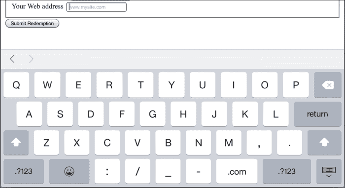

注意到*.com*键了吗？因为我们使用了 URL 输入类型，设备会为易于 URL 完成而呈现它们（在 iOS 上，如果您不是要去.com 网站，您可以长按一下以获得其他几个流行的顶级域名）。

## tel

设置输入字段以期望电话号码，如下所示：

```html
type="tel"
```

以下是一个更完整的示例：

```html
<div>
  <label for="tel">Telephone (so we can berate you if you're wrong)</label>
  <input id="tel" name="tel" type="tel" placeholder="1-234-546758" autocomplete="off" required>
</div>
```

尽管在许多浏览器上期望数字格式，甚至是现代的 evergreen 浏览器，如 Internet Explorer 11、Chrome 和 Firefox，它们仅仅表现得像文本输入字段。当输入不正确的值时，它们在字段失去焦点或表单提交时未能提供合适的警告消息。

然而，更好的消息是，与`email`和`url`输入类型一样，触摸屏设备通常会贴心地适应这种输入，通过修改输入显示来方便完成；这是在 iPad 上访问`tel`输入时的外观（运行 iOS 8.2）：

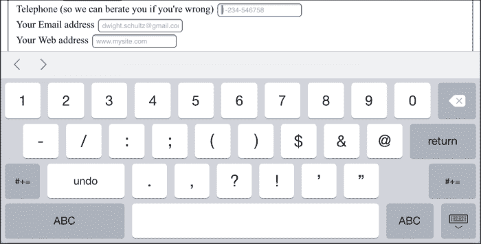

注意键盘区域中缺少字母字符？这使用户更快地以正确格式输入值。

### 提示

**快速提示**

如果在 iOS Safari 中使用`tel`输入时默认的蓝色电话号码颜色让您感到不适，您可以使用以下选择器进行修改：

```html
a[href^=tel] { color: inherit; }
```

## search

您可以将输入设置为搜索类型，如下所示：

```html
type="search"
```

`search`输入类型的工作方式类似于标准文本输入。以下是一个例子：

```html
<div>
  <label for="search">Search the site...</label>
  <input id="search" name="search" type="search" placeholder="Wyatt Earp">
</div>
```

然而，软件键盘（如移动设备上的键盘）通常提供更贴心的键盘。这是当`search`输入类型获得焦点时出现的 iOS 8.2 键盘：

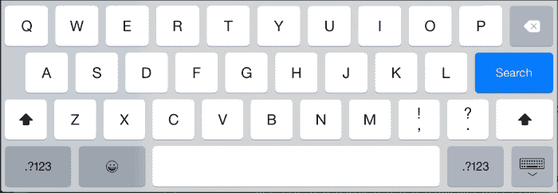

## pattern

您可以设置输入以期望某种模式输入，如下所示：

```html
pattern=""
```

`pattern`属性允许您通过正则表达式指定应在给定输入字段中允许的数据的语法。

### 注意

**了解正则表达式**

如果您以前从未遇到过正则表达式，我建议从这里开始：[`en.wikipedia.org/wiki/Regular_expressions`](http://en.wikipedia.org/wiki/Regular_expressions)

正则表达式在许多编程语言中被用作匹配可能的字符串的手段。虽然一开始格式可能令人生畏，但它们非常强大和灵活。例如，您可以构建一个正则表达式来匹配密码格式，或选择某种样式的 CSS 类命名模式。为了帮助您构建自己的正则表达式模式并直观地了解它们的工作原理，我建议从像[`www.regexr.com/`](http://www.regexr.com/)这样的基于浏览器的工具开始。

以下代码是一个例子：

```html
<div>
  <label for="name">Your Name (first and last)</label>
  <input id="name" name="name" pattern="([a-zA-Z]{3,30}\s*)+[a-zA-Z]{3,30}" placeholder="Dwight Schultz" required>
</div>
```

我对这本书的承诺如此之深，我在互联网上搜索了大约 458 秒，找到了一个可以匹配名字和姓氏语法的正则表达式。通过在`pattern`属性中输入正则表达式值，支持的浏览器会期望匹配的输入语法。然后，当与`required`属性一起使用时，支持的浏览器会对不正确的输入进行以下处理。在这种情况下，我尝试在没有提供姓氏的情况下提交表单。

同样，浏览器的行为不同。Internet Explorer 11 要求正确输入字段，Safari、Firefox 和 Chrome 什么也不做（它们只是像标准文本输入一样行为）。

## 颜色

想要设置一个输入字段接收十六进制颜色值？您可以这样做：

```html
type="color"
```

`color`输入类型在支持的浏览器中调用颜色选择器（目前仅限 Chrome 和 Firefox），允许用户选择十六进制颜色值。以下代码是一个例子：

```html
<div>
  <label for="color">Your favorite color</label>
  <input id="color" name="color" type="color">
</div>
```

## 日期和时间输入

新的`date`和`time`输入类型的思路是为选择日期和时间提供一致的用户体验。如果你曾经在网上购买活动门票，很可能使用过某种日期选择器。这种功能几乎总是通过 JavaScript（通常是 jQuery UI 库）提供的，但希望能够仅通过 HTML5 标记实现这种常见需求。

### 日期

以下代码是一个例子：

```html
<input id="date" type="date" name="date">
```

与`color`输入类型类似，原生浏览器支持非常有限，在大多数浏览器上默认为标准文本输入框。Chrome 和 Opera 是唯一实现此功能的现代浏览器。这并不奇怪，因为它们都使用相同的引擎（如果您感兴趣，它被称为**Blink**）。


有各种不同的与`date`和`time`相关的输入类型可用。以下是其他类型的简要概述。

### 月份

以下代码是一个例子：

```html
<input id="month" type="month" name="month">
```

该界面允许用户选择单个月份，并提供年份和月份的输入，例如 2012-06。以下截图显示了它在浏览器中的外观：


### 周

以下代码是一个例子：

```html
<input id="week" type="week" name="week">
```

当使用`week`输入类型时，选择器允许用户在一年中选择单个星期，并以 2012-W47 格式提供输入。

以下截图显示了它在浏览器中的外观：

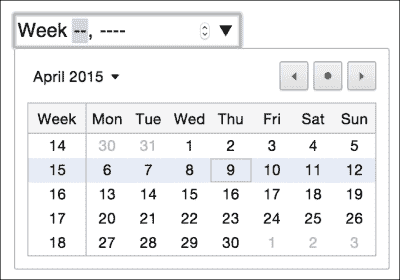

### 时间

以下代码是一个例子：

```html
<input id="time" type="time" name="time">
```

`time`输入类型允许使用 24 小时制的值，例如 23:50。

它在支持的浏览器中显示为微调控件，但仅允许相关的时间值。

## 范围

`range`输入类型创建了一个滑块界面元素。以下是一个例子：

```html
<input type="range" min="1" max="10" value="5">
```

以下截图显示了它在 Firefox 中的外观：


默认范围是从 0 到 100。但是，在我们的示例中指定了`min`和`max`值，将其限制在 1 到 10 之间。

我在使用`range`输入类型时遇到的一个大问题是，当前值从不显示给用户。尽管范围滑块仅用于模糊的数字选择，但我经常希望在值发生变化时显示值。目前，使用 HTML5 没有办法做到这一点。但是，如果您绝对必须显示滑块的当前值，可以通过一些简单的 JavaScript 轻松实现。将前面的示例修改为以下代码：

```html
<input id="howYouRateIt" name="howYouRateIt" type="range" min="1" max="10" value="5" onchange="showValue(this.value)"><span  id="range">5</span>
```

我们添加了两个东西，一个是`onchange`属性，另一个是 ID 为 range 的`span`元素。现在，我们将添加以下简短的 JavaScript 代码：

```html
<script>
  function showValue(newValue)
  {
    document.getElementById("range").innerHTML=newValue;
  }
</script>
```

这只是获取范围滑块的当前值，并在具有 ID 为 range 的元素中显示它（我们的`span`标记）。然后，您可以使用任何您认为合适的 CSS 来更改值的外观。

HTML5 中还有一些其他与表单相关的新功能。您可以在[`www.w3.org/TR/html5/forms.html`](http://www.w3.org/TR/html5/forms.html)阅读完整规范。

# 如何为不支持的浏览器提供 polyfill

所有这些 HTML5 表单的花哨都很好。然而，似乎有两件事严重影响了我们使用它们的能力：支持浏览器实现功能的差异，以及如何处理根本不支持这些功能的浏览器。

如果您需要在较旧或不支持的浏览器中支持某些功能，请考虑使用 Webshims Lib，您可以在[`afarkas.github.com/webshim/demos/`](http://afarkas.github.com/webshim/demos/)下载。这是由 Alexander Farkas 编写的一个 polyfill 库，可以加载表单 polyfills 以使不支持 HTML5 表单功能的浏览器处理。

### 提示

**小心使用 polyfills**

每当您使用 polyfill 脚本时，请务必仔细考虑。虽然它们非常方便，但会增加项目的负担。例如，Webshims 还需要 jQuery，因此如果您以前没有使用 jQuery，则需要另一个依赖项。除非在较旧的浏览器中使用 polyfill 是必不可少的，否则我会避免使用。

Webshims 的方便之处在于它只在需要时添加 polyfills。如果被支持这些 HTML5 功能的浏览器查看，它几乎不会添加任何内容。老旧的浏览器虽然需要加载更多代码（因为它们默认情况下功能较弱），但用户体验类似，尽管相关功能是通过 JavaScript 创建的。

但受益的不仅仅是较旧的浏览器。正如我们所见，许多现代浏览器并没有完全实现 HTML5 表单功能。将 Webshims lib 应用到页面上也可以填补它们功能上的任何空白。例如，Safari 在提交带有必填字段为空的 HTML5 表单时不提供任何警告。用户不会得到有关问题的任何反馈：这几乎不理想。将 Webshims lib 添加到页面后，在上述情况下会发生以下情况。

因此，当 Firefox 无法为`type="number"`属性提供微调器时，Webshims lib 提供了一个合适的、由 jQuery 支持的替代方案。简而言之，这是一个很棒的工具，所以让我们安装并连接这个美丽的小包，然后我们可以继续使用 HTML5 编写表单，放心地知道所有用户都将看到他们需要使用我们的表单（除了那两个使用 IE6 并关闭了 JavaScript 的人——你们知道自己是谁——现在停止吧！）。

首先下载 Webshims lib（[`github.com/aFarkas/webshim/downloads`](http://github.com/aFarkas/webshim/downloads)）并提取包。现在将`js-webshim`文件夹复制到网页的相关部分。为了简单起见，我将其复制到了网站根目录。

现在将以下代码添加到页面的相应部分：

```html
<script src="img/jquery-2.1.3.min.js"></script>
<script src="img/polyfiller.js"></script>
<script>
  //request the features you need:
  webshim.polyfill('forms');
</script>
```

让我们一步一步来。首先，我们链接到本地的 jQuery 库（在[www.jquery.com](http://www.jquery.com)获取最新版本）和 Webshim 脚本：

```html
<script src="img/jquery-2.1.3.min.js"></script>
<script src="img/polyfiller.js"></script>
```

最后，我告诉脚本加载所有需要的 polyfills：

```html
<script>
  //request the features you need:
  webshim.polyfill('forms');
</script>
```

就是这样。现在，相关的 polyfill 会自动添加缺失的功能。太棒了！

# 用 CSS3 样式化 HTML5 表单

我们的表单现在在各种浏览器上都可以正常使用，现在我们需要使其在不同的视口尺寸下更具吸引力。现在，我不认为自己是一个设计师，但通过应用我们在前几章学到的一些技巧，我仍然认为我们可以改善表单的美观度。

### 注意

您可以在`example_09-02`中查看样式化的表单，并且请记住，如果您还没有示例代码，可以在[`rwd.education`](http://rwd.education)获取它。

在这个例子中，我还包括了两个版本的样式表：`styles.css`是包含供应商前缀的版本（通过 Autoprefixer 添加），`styles-unprefixed.css`是原始的 CSS。如果您想查看如何应用任何内容，后者可能更容易查看。

在小视口中应用了一些基本样式后，表单的外观如下：

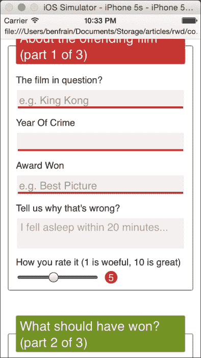

在较大的视口中是这样的：


如果你看一下 CSS，你会看到我们在之前的章节中学到的许多技巧。例如，Flexbox（第三章，*流动布局和响应式图片*）已被用于创建元素的统一间距和灵活性；变换和过渡（第八章，*过渡、变换和动画*）使得焦点输入字段增大，准备/提交按钮在获得焦点时垂直翻转。盒阴影和渐变（第六章，*CSS3 的惊人美学*）被用来强调表单的不同区域。媒体查询（第二章，*媒体查询-支持不同的视口*）被用于在不同的视口尺寸下切换 Flexbox 方向，CSS Level 3 选择器（第五章，*CSS3-选择器、排版、颜色模式和新特性*）被用于选择器否定。

我们不会再详细介绍这些技术。相反，我们将专注于一些特殊之处。首先，如何在视觉上指示必填字段（并且额外加分指示已输入值），其次，如何在字段获得用户焦点时创建“填充”效果。

## 指示必填字段

我们可以仅使用 CSS 向用户指示必填输入字段。例如：

```html
input:required {
  /* styles */
}
```

通过该选择器，我们可以为必填字段添加边框或轮廓，或在字段内部添加`background-image`。基本上没有限制！我们还可以使用特定的选择器来仅在输入字段获得焦点时，针对必填的输入字段进行定位。例如：

```html
input:focus:required {
  /* styles */
}
```

然而，这将会应用样式到输入框本身。如果我们想要修改相关的`label`元素上的样式怎么办？我决定我想在标签旁边用一个小星号符号来表示必填字段。但这带来了一个问题。通常，CSS 只允许我们在元素的子元素、元素本身或者元素的一般或相邻兄弟元素上进行更改（当我说状态时，我指的是`hover`、`focus`、`active`、`checked`等）。在下面的例子中，我使用了`:hover`，但这对基于触摸的设备显然是有问题的。

```html
.item:hover .item-child {}
```

通过前面的选择器，当悬停在项目上时，样式将应用到`item-child`。

```html
.item:hover ~ .item-general-sibling {}
```

通过这个选择器，当悬停在项目上时，样式将应用到`item-general-sibling`，如果它与项目在同一 DOM 级别，并跟随在其后。

```html
.item:hover + .item-adjacent-sibling {}
```

在这里，当悬停在项目上时，样式将应用到`item-adjacent-sibling`，如果它是项目的相邻兄弟元素（在 DOM 中紧跟在它后面）。

所以，回到我们的问题。如果我们有一个带有标签和字段的表单，标签在输入框上方（以便给我们所需的基本布局），这让我们有点困扰：

```html
<div class="form-Input_Wrapper">
  <label for="film">The film in question?</label>
  <input id="film" name="film" type="text" placeholder="e.g. King Kong" required/>
</div>
```

在这种情况下，仅使用 CSS，没有办法根据输入是否必填来更改标签的样式（因为它在标记中位于标签之后）。我们可以在标记中切换这两个元素的顺序，但那样我们会得到标签在输入框下面的结果。

然而，Flexbox 让我们能够轻松地在元素的视觉顺序上进行反转（如果你还没有阅读过，请在第三章中了解更多相关内容，*流动布局和响应式图片*）。这使我们可以使用以下标记：

```html
<div class="form-Input_Wrapper">
  <input id="film" name="film" type="text" placeholder="e.g. King Kong" required/>
  <label for="film">The film in question?</label>
</div>
```

然后只需将`flex-direction: row-reverse`或`flex-direction: column-reverse`应用于父元素。这些声明可以颠倒子元素的视觉顺序，使标签在输入框上方（较小的视口）或左侧（较大的视口）显示所需的美学效果。现在我们可以开始实际提供一些必填字段的指示以及它们何时接收到输入。

由于我们修改过的标记，相邻兄弟选择器现在使这成为可能。

```html
input:required + label:after { }
```

这个选择器基本上是说，对于跟随具有`required`属性的输入的每个标签，应用封闭的规则。以下是该部分的 CSS：

```html
input:required + label:after {
  content: "*";
  font-size: 2.1em;
  position: relative;
  top: 6px;
  display: inline-flex;
  margin-left: .2ch;
  transition: color, 1s;
}

input:required:invalid + label:after {
  color: red;
}

input:required:valid + label:after {
  color: green;
}
```

然后，如果你专注于必填输入并输入相关值，星号的颜色会变成绿色。这是一个细微但有用的触摸。

### 注意

除了我们已经看过的所有选择器之外，还有更多的选择器（已实现和正在指定）。要获取最新的列表，请查看 Selectors Level 4 规范的最新编辑草案：[`dev.w3.org/csswg/selectors-4/`](http://dev.w3.org/csswg/selectors-4/)

## 创建背景填充效果

在第六章中，*使用 CSS3 创建令人惊叹的美学*，我们学习了如何生成线性和径向渐变作为背景图像。遗憾的是，无法在两个背景图像之间进行过渡（这是有道理的，因为浏览器实际上将声明光栅化为图像）。但是，我们可以在关联属性的值之间进行过渡，例如`background-position`和`background-size`。我们将利用这一因素，在`input`或`textarea`获得焦点时创建填充效果。

以下是添加到输入的属性和值：

```html
input:not([type="range"]),
textarea {
  min-height: 30px;
  padding: 2px;
  font-size: 17px;
  border: 1px solid #ebebeb;
  outline: none;
  transition: transform .4s, box-shadow .4s, background-position .2s;
  background: radial-gradient(400px circle,  #fff 99%, transparent 99%), #f1f1f1;
  background-position: -400px 90px, 0 0;
  background-repeat: no-repeat, no-repeat;
  border-radius: 0;
  position: relative;
}

input:not([type="range"]):focus,
textarea:focus {
  background-position: 0 0, 0 0;
}
```

在第一个规则中，正在生成一个实心白色径向渐变，但位置偏移不在视图之外。`radial-gradient`之后的 HEX 值是背后的背景颜色，因此提供了默认颜色。当输入获得焦点时，`radial-gradient`的背景位置被设置回默认值，因为我们在设置了背景图像的过渡，所以我们得到了两者之间的漂亮过渡。结果是当输入获得焦点时，出现输入被不同颜色“填充”的外观。

### 注意

不同的浏览器在样式化本机 UI 的部分时都有自己的专有选择器和功能。Aurelius Wendelken 编制了一个令人印象深刻的选择器列表。我制作了自己的副本（或者在 Git 版本控制中称为“分支”），你可以在[`gist.github.com/benfrain/403d3d3a8e2b6198e395`](https://gist.github.com/benfrain/403d3d3a8e2b6198e395)找到。

# 摘要

在本章中，我们学习了如何使用一系列新的 HTML5 表单属性。它们使我们能够使表单比以往任何时候都更易于使用，并且捕获的数据更相关。此外，我们可以在需要时使用 JavaScript polyfill 脚本来未来化这个新的标记，以便所有用户无论其浏览器的能力如何，都能体验相似的表单功能。

我们即将结束我们的响应式 HTML5 和 CSS3 之旅。虽然我们在一起的时间里涵盖了大量内容，但我意识到我永远无法传授你们遇到的每种情况的所有信息。因此，在最后一章中，我想以更高层次的方式来看待响应式网页设计，并尝试提供一些确切的最佳实践，以便让你的下一个/第一个响应式项目有一个良好的开端。
