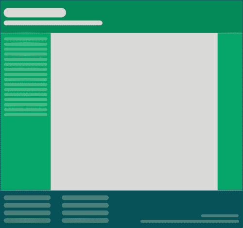
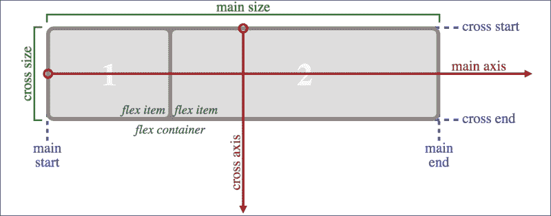
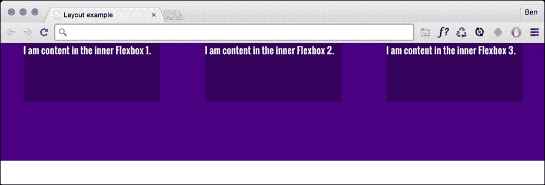
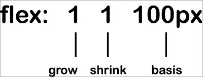
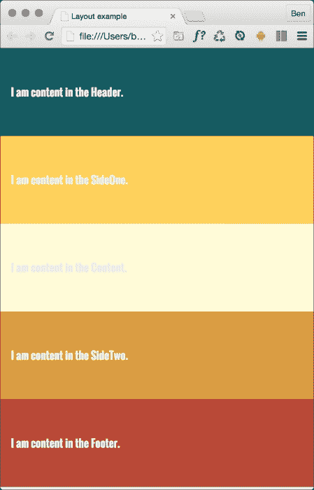
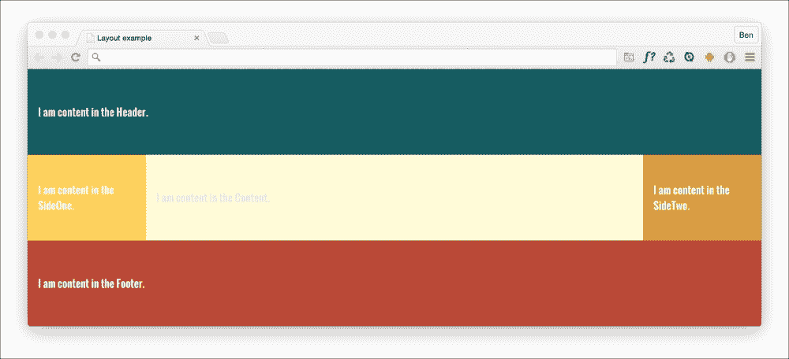

# 第三章：流式布局和响应式图片

亿万年前，在时间的迷雾中（嗯，是在 20 世纪 90 年代晚期），网站通常以百分比定义宽度。这些基于百分比的宽度可以流畅地调整到屏幕上，并被称为流式布局。

在之后的几年里，即在 2000 年代中期到晚期，人们对固定宽度设计产生了干扰（我责怪那些固执的印刷设计师和他们对像素完美精度的痴迷）。如今，当我们构建响应式网页设计时，我们需要回顾流式布局，并记住它们提供的所有好处。

在第二章, *媒体查询-支持不同的视口*中，我们最终承认，虽然媒体查询允许我们的设计适应不同的视口大小，但通过从一组样式切换到另一组样式，我们需要一些能力在媒体查询提供的“断点”之间灵活调整我们的设计。通过编写“流式”布局，我们可以完美地满足这种需求；它将轻松地拉伸以填补媒体查询断点之间的空白。

2015 年，我们有比以往任何时候都更好的方法来构建响应式网站。现在有一个名为**Flexible Box**（或者更常见的称为**Flexbox**）的新 CSS 布局模块，它现在有足够的浏览器支持，可以在日常使用中使用。

它不仅可以提供流式布局机制。想要轻松地居中内容，更改标记的源顺序，并以相关的轻松方式创建令人惊叹的布局？Flexbox 是适合您的布局机制。本章的大部分内容涉及 Flexbox，涵盖了它所提供的所有令人难以置信的功能。

现在，有了指定的方法和语法，可以向设备发送最相关版本的图像以适应其视口。我们将在本章的最后一节中了解响应式图片的工作原理以及如何使其为我们工作。

在本章中，我们将涵盖：

+   如何将固定像素尺寸转换为比例尺寸

+   考虑现有的 CSS 布局机制及其不足之处

+   了解 Flexbox 布局模块及其提供的好处

+   学习响应式图片的分辨率切换和艺术方向的正确语法

# 将固定像素设计转换为流式比例布局

在像 Photoshop、Illustrator、Fireworks（已故）或 Sketch 这样的程序中制作的图形合成都有固定的像素尺寸。在将设计重新创建为浏览器中的流式布局时，开发人员需要将设计转换为比例尺寸。

有一个非常简单的公式可以将固定尺寸布局转换为响应式/流式等价物，这是响应式网页设计之父 Ethan Marcotte 在他 2009 年的文章*Fluid Grids*（[`alistapart.com/article/FLUIDGRIDS`](http://alistapart.com/article/FLUIDGRIDS)）中提出的：

*目标/上下文=结果*

如果任何类似数学的东西让您感到不安，可以这样想：将您想要的东西的单位除以它所在的单位。理解这一点将使您能够将任何固定尺寸布局转换为响应式/流式等价物。

考虑一个专为桌面设计的非常基本的页面布局。在理想的情况下，我们总是会从较小的屏幕布局转移到桌面布局，但为了说明比例，我们将从后往前看这两种情况。

这是布局的图像：



布局宽度为 960 像素。页眉和页脚都是布局的全宽。左侧区域宽度为 200 像素，右侧区域宽度为 100 像素。即使我的数学能力有限，我也可以告诉您中间部分将宽 660 像素。我们需要将中间和侧面区域转换为比例尺寸。

首先，左侧。它的宽度是 200 个单位（目标）。将该尺寸除以 960 个单位（上下文），我们得到一个结果：.208333333\. 现在，每当我们用这个公式得到结果时，我们需要将小数点向右移动两位。这将给我们 20.8333333%。这是将 200px 描述为 960px 的百分比。

好了，中间部分呢？660（目标）除以 960（上下文）给我们.6875\. 将小数点向右移动两位，我们得到 68.75%。最后，右侧部分。100（目标）除以 960（上下文）给我们.104166667\. 移动小数点，我们得到 10.4166667%。就是这么困难。跟我说：目标，除以上下文，等于结果。

为了证明这一点，让我们在浏览器中快速构建基本布局块。您可以在`example_03-01`中查看布局。这是 HTML：

```html
<div class="Wrap">
    <div class="Header"></div>
    <div class="WrapMiddle">
        <div class="Left"></div>
        <div class="Middle"></div>
        <div class="Right"></div>
    </div>
    <div class="Footer"></div>
</div>
```

这是 CSS：

```html
html,
body {
    margin: 0;
    padding: 0;
}

.Wrap {
    max-width: 1400px;
    margin: 0 auto;
}

.Header {
    width: 100%;
    height: 130px;
    background-color: #038C5A;
}

.WrapMiddle {
    width: 100%;
    font-size: 0;
}

.Left {
    height: 625px;
    width: 20.8333333%;
    background-color: #03A66A;
    display: inline-block;
}

.Middle {
    height: 625px;
    width: 68.75%;
    background-color: #bbbf90;
    display: inline-block;
}

.Right {
    height: 625px;
    width: 10.4166667%;
    background-color: #03A66A;
    display: inline-block;
}

.Footer {
    height: 200px;
    width: 100%;
    background-color: #025059;
}
```

如果您在浏览器中打开示例代码并调整页面大小，您会发现中间部分的尺寸保持相互成比例。您还可以通过调整`.Wrap`值的最大宽度来使布局的边界尺寸变大或变小（在示例中设置为`1400px`）。

### 提示

如果您查看标记并想知道为什么我没有使用`header`，`footer`和`aside`等语义元素，那就不用担心。第四章，*响应式 Web 设计的 HTML5*，详细介绍了这些语义 HTML5 元素。

现在，让我们考虑一下如何在较小的屏幕上具有相同的内容，然后转换为我们已经看到的布局。您可以在`example_03-02`中查看此布局的最终代码。

想法是，对于较小的屏幕，我们将有一个单独的内容'管道'。左侧区域将只能作为'离屏'区域查看；通常是菜单区域或类似的区域，位于可视屏幕区域之外，当按下菜单按钮时滑入。主要内容位于页眉下方，然后右侧部分位于其下方，最后是页脚区域。在我们的示例中，我们可以通过单击页眉的任何位置来显示左侧菜单区域。通常，在真正制作这种设计模式时，会使用菜单按钮来激活侧边菜单。

### 提示

为了在文档的 body 上切换类，我使用了一点 JavaScript。不过这并不是'production ready'，因为我们在 JavaScript 中使用了'click'作为事件处理程序，理想情况下，我们应该有一些触摸的准备（以消除 iOS 设备上仍然存在的 300 毫秒延迟）。

正如您所期望的那样，当将这与我们新掌握的媒体查询技能相结合时，我们可以调整视口和设计，布局就会自动地从一个布局移动到另一个布局，并在两者之间拉伸。

我不打算在这里列出所有的 CSS，它都在`example_03-02`中。不过，这里有一个例子——左侧部分：

```html
.Left {
    height: 625px;
    background-color: #03A66A;
    display: inline-block;
    position: absolute;
    left: -200px;
    width: 200px;
    font-size: .9rem;
    transition: transform .3s;
}

@media (min-width: 40rem) {
    .Left {
        width: 20.8333333%;
        left: 0;
        position: relative;
    }
}
```

您可以看到，首先是在没有媒体查询的情况下，小屏幕布局。然后，在较大的屏幕尺寸上，宽度变得成比例，定位相对，左值设置为零。我们不需要重新编写诸如`height`，`display`或`background-color`之类的属性，因为我们不会改变它们。

这是进步。我们已经结合了我们所学的两种核心响应式 Web 设计技术；将固定尺寸转换为比例，并使用媒体查询来针对视口大小调整 CSS 规则。

### 提示

在我们之前的例子中有两件重要的事情需要注意。首先，您可能想知道是否严格需要包括小数点后的所有数字。虽然这些宽度最终将被浏览器转换为像素，但它们的值将被保留用于未来的计算（例如，更准确地计算嵌套元素的宽度）。因此，我总是建议保留小数点后的数字。

其次，在一个真实的项目中，如果 JavaScript 不可用并且我们需要查看菜单的内容，我们应该做一些准备。我们在第八章中详细处理这种情况，*过渡，变换和动画*。

## 我们为什么需要 Flexbox？

我们现在将详细介绍使用 CSS 弹性盒布局，或者更常见的 Flexbox。

然而，在我们这样做之前，我认为首先考虑现有布局技术的不足是明智的，比如内联块，浮动和表格。

## 内联块和空格

使用内联块作为布局机制的最大问题是它在 HTML 元素之间渲染空格。这不是一个错误（尽管大多数开发人员都希望有一种理智的方法来删除空格），但这意味着一些方法来删除不需要的空格，对我来说，这大约是 95%的时间。有很多方法可以做到这一点，在前面的例子中，我们使用了“字体大小为零”的方法；这种方法并非没有问题和局限性。但是，与其列出使用内联块时去除空格的每种可能的解决方法，不如查看这篇由无法抑制的 Chris Coyier 撰写的文章：[`css-tricks.com/fighting-the-space-between-inline-block-elements/`](http://css-tricks.com/fighting-the-space-between-inline-block-elements/)。

还值得指出的是，没有简单的方法在内联块内垂直居中内容。使用内联块，也没有办法让两个兄弟元素中一个具有固定宽度，另一个自动填充剩余空间。

## 浮动

我讨厌浮动。我说了。它们的好处是它们在各处的工作相当一致。然而，有两个主要的烦恼。

首先，当以百分比指定浮动元素的宽度时，它们的计算宽度在各个浏览器中并不一致（有些浏览器向上舍入，有些向下舍入）。这意味着有时部分内容会意外地下降到其他部分下面，而其他时候它们可能会在一侧留下令人恼火的间隙。

其次，通常需要“清除”浮动，以防止父框/元素坍塌。这很容易做到，但它不断提醒我们，浮动从来不是用作强大的布局机制。

## 表格和表格单元格

不要混淆`display: table`和`display: table-cell`与等效的 HTML 元素。这些 CSS 属性仅模仿其基于 HTML 的兄弟的布局。它们绝对不会影响 HTML 的结构。

我发现使用 CSS 表格布局非常有用。首先，它们可以在元素之间实现一致和强大的垂直居中。此外，设置为`display: table`的元素内部设置为`display: table-cell`的元素可以完美地空出空间；它们不像浮动元素那样遇到四舍五入的问题。您还可以获得对 Internet Explorer 7 的全面支持！

然而，也有局限性。通常需要在项目周围包装额外的元素（为了获得完美的垂直居中的乐趣，表格单元格必须存在于设置为表格的元素内）。还不可能将设置为`display: table-cell`的项目包装到多行中。

总之，所有现有的布局方法都有严重的局限性。幸运的是，有一种新的 CSS 布局方法可以解决这些问题，还有更多。吹号声响起，铺开红地毯。Flexbox 来了。

# 介绍 Flexbox

Flexbox 解决了上述每种显示机制的不足。以下是它的超级功能的简要概述：

+   它可以轻松地垂直居中内容

+   它可以改变元素的视觉顺序

+   它可以自动在框内对齐和排列元素，自动分配它们之间的可用空间。

+   它可以让你看起来年轻 10 岁（可能不是，但在少量经验测试中（我）已经证明可以减轻压力）

## 通往 Flexbox 的崎岖之路

在达到我们今天拥有的相对稳定版本之前，Flexbox 经历了几次重大迭代。例如，考虑从 2009 年版本（[`www.w3.org/TR/2009/WD-css3-flexbox-20090723/`](http://www.w3.org/TR/2009/WD-css3-flexbox-20090723/)）到 2011 年版本（[`www.w3.org/TR/2011/WD-css3-flexbox-20111129/`](http://www.w3.org/TR/2011/WD-css3-flexbox-20111129/)），再到我们基于的 2014 年版本（[`www.w3.org/TR/css-flexbox-1/`](http://www.w3.org/TR/css-flexbox-1/)）。语法差异很大。

这些不同的规范意味着有三个主要的实现版本。您需要关注多少取决于您需要的浏览器支持级别。

## Flexbox 的浏览器支持

让我们先说清楚：Internet Explorer 9、8 或更低版本都不支持 Flexbox。

对于您可能想要支持的其他所有内容（几乎所有移动浏览器），都有一种方法可以享受 Flexbox 的大多数（如果不是全部）功能。您可以在[`caniuse.com/`](http://caniuse.com/)上查看支持信息。

在我们深入 Flexbox 之前，我们需要进行一个简短但必要的偏离。

### 把前缀留给别人

我希望一旦您看到了 Flexbox 的一些示例，您会欣赏到它的实用性，并感到有能力使用它。然而，手动编写支持每个不同 Flexbox 规范所需的所有必要代码是一项艰巨的任务。这里有一个例子。我将设置三个与 Flexbox 相关的属性和值。考虑一下：

```html
.flex {
    display: flex;
    flex: 1;
    justify-content: space-between;
}
```

这就是最新语法中属性和值的样子。然而，如果我们想要支持 Android 浏览器（v4 及以下）和 IE 10，实际上需要的是：

```html
.flex {
    display: -webkit-box;
    display: -webkit-flex;
    display: -ms-flexbox;
    display: flex;
    -webkit-box-flex: 1;
    -webkit-flex: 1;
        -ms-flex: 1;
            flex: 1;
    -webkit-box-pack: justify;
    -webkit-justify-content: space-between;
        -ms-flex-pack: justify;
            justify-content: space-between;
}
```

有必要写出所有这些，因为在过去几年里，随着浏览器发布了新功能的实验版本，它们都带有“供应商前缀”。每个供应商都有自己的前缀。例如，微软的是`-ms-`，WebKit 的是`-webkit-`，Mozilla 的是`-moz-`，等等。对于每个新功能，这意味着需要编写同一属性的多个版本；首先是供应商前缀版本，然后是官方的 W3C 版本。

这个咒语在 Web 历史上的结果是 CSS 看起来像前面的例子。这是在尽可能多的设备上使功能正常工作的唯一方法。如今，供应商很少添加前缀，但在可预见的未来，我们必须接受许多现有浏览器仍然需要前缀来启用某些功能的现实。这让我们回到了 Flexbox，这是供应商前缀的一个极端例子，不仅有多个供应商版本，还有不同的功能规范。记住并理解您需要以当前格式和每个以前的格式编写的所有内容并不是一件有趣的事情。

我不知道你怎么想，但我宁愿把时间花在做一些更有意义的事情上，而不是每次都写出那么多东西！简而言之，如果您打算愤怒地使用 Flexbox，请花时间设置自动前缀解决方案。

#### 选择您的自动前缀解决方案

为了保持理智，准确且轻松地向 CSS 添加供应商前缀，使用某种形式的自动前缀解决方案。目前，我更喜欢 Autoprefixer（[`github.com/postcss/autoprefixer`](https://github.com/postcss/autoprefixer)）。它快速、易于设置且非常准确。

大多数设置都有 Autoprefixer 的版本；您不一定需要基于命令行的构建工具（例如 Gulp 或 Grunt）。例如，如果您使用 Sublime Text，有一个版本可以直接从命令面板中使用：[`github.com/sindresorhus/sublime-autoprefixer`](https://github.com/sindresorhus/sublime-autoprefixer)。Atom、Brackets 和 Visual Studio 也有 Autoprefixer 的版本。

从这一点开始，除非必须说明一个观点，否则在代码示例中将不再有供应商前缀。

# 灵活起来

Flexbox 有四个关键特性：**方向**，**对齐**，**排序**和**灵活性**。我们将通过一些示例来介绍所有这些特性以及它们之间的关系。

这些示例故意简单化；只是移动一些框和它们的内容，以便我们可以理解 Flexbox 的工作原理。

## 完美垂直居中的文本

请注意，这个第一个 Flexbox 示例是`example_03-03`：


这是标记：

```html
<div class="CenterMe">
    Hello, I'm centered with Flexbox!
</div>
```

这是样式整个 CSS 规则：

```html
.CenterMe {
    background-color: indigo;
    color: #ebebeb;
    font-family: 'Oswald', sans-serif;
    font-size: 2rem;
    text-transform: uppercase;
    height: 200px;
    display: flex;
    align-items: center;
    justify-content: center;
}
```

该规则中的大多数属性/值对仅仅是设置颜色和字体大小。我们感兴趣的三个属性是：

```html
.CenterMe {    
    /* other properties */
    display: flex;
    align-items: center;
    justify-content: center;
}
```

如果您没有使用 Flexbox 或相关的 Box Alignment 规范中的任何属性（[`www.w3.org/TR/css3-align/`](http://www.w3.org/TR/css3-align/)），这些属性可能看起来有点陌生。让我们考虑每个属性的作用：

+   `display: flex`：这是 Flexbox 的基础。这仅仅是将项目设置为 Flexbox（而不是块、内联块等）。

+   `align-items`：这在 Flexbox 中沿交叉轴对齐项目（在我们的示例中垂直居中文本）。

+   `justify-content`：这设置了内容的主轴居中。对于 Flexbox 行，您可以将其视为文字处理器中设置文本左对齐、右对齐或居中的按钮（尽管我们很快将看到更多`justify-content`的值）。

好的，在我们深入了解 Flexbox 的属性之前，我们将考虑一些更多的示例。

### 提示

在其中一些示例中，我使用了谷歌托管的字体'Oswald'（并回退到无衬线字体）。在第五章中，*CSS3 – 选择器、排版、颜色模式和新功能*，我们将看看如何使用`@font-face`规则链接到自定义字体文件。

## 偏移项目

想要一个简单的导航项目列表，但其中一个偏移了一边？

这是它的样子：


这是标记：

```html
<div class="MenuWrap">
    <a href="#" class="ListItem">Home</a>
    <a href="#" class="ListItem">About Us</a>
    <a href="#" class="ListItem">Products</a>
    <a href="#" class="ListItem">Policy</a>
    <a href="#" class="LastItem">Contact Us</a>
</div>
```

这是 CSS：

```html
.MenuWrap {
    background-color: indigo;
    font-family: 'Oswald', sans-serif;
    font-size: 1rem;
    min-height: 2.75rem;
    display: flex;
    align-items: center;
    padding: 0 1rem;
}

.ListItem,
.LastItem {
    color: #ebebeb;
    text-decoration: none;
}

.ListItem {
    margin-right: 1rem;
}

.LastItem {
    margin-left: auto;
}
```

怎么样，没有一个浮动、内联块或表格单元格！当您在包裹元素上设置`display: flex;`时，该元素的子元素就成为了 flex 项目，然后使用 flex 布局模型进行布局。这里的神奇属性是`margin-left: auto`，它使该项目在该侧使用所有可用的边距。

## 颠倒项目的顺序

想要颠倒项目的顺序吗？


只需在包裹元素上添加`flex-direction: row-reverse;`并将偏移项上的`margin-left: auto`更改为`margin-right: auto`：

```html
.MenuWrap {
    background-color: indigo;
    font-family: 'Oswald', sans-serif;
    font-size: 1rem;
    min-height: 2.75rem;
    display: flex;
    flex-direction: row-reverse;
    align-items: center;
    padding: 0 1rem;
}

.ListItem,
.LastItem {
    color: #ebebeb;
    text-decoration: none;
}

.ListItem {
    margin-right: 1rem;
}

.LastItem {
    margin-right: auto;
}
```

### 如果我们想要它们垂直布局呢？

简单。在包裹元素上更改为`flex-direction: column;`并删除自动边距：

```html
.MenuWrap {
    background-color: indigo;
    font-family: 'Oswald', sans-serif;
    font-size: 1rem;
    min-height: 2.75rem;
    display: flex;
    flex-direction: column;
    align-items: center;
    padding: 0 1rem;
}

.ListItem,
.LastItem {
    color: #ebebeb;
    text-decoration: none;
}
```

### 列反转

想要它们以相反的方向堆叠吗？只需更改为`flex-direction: column-reverse;`就可以了。

### 注意

您应该知道有一个`flex-flow`属性，它是设置`flex-direction`和`flex-wrap`的快捷方式。例如，`flex-flow: row wrap;`会将方向设置为行，并设置换行。然而，至少在最初，我发现更容易分别指定这两个设置。`flex-wrap`属性在最旧的 Flexbox 实现中也不存在，因此可能会在某些浏览器中使整个声明无效。

## 不同的媒体查询内的不同 Flexbox 布局

正如其名称所示，Flexbox 本质上是灵活的，所以在较小的视口上，我们选择列出项目，并在空间允许时选择行样式布局。这对 Flexbox 来说非常简单：

```html
.MenuWrap {
    background-color: indigo;
    font-family: 'Oswald', sans-serif;
    font-size: 1rem;
    min-height: 2.75rem;
    display: flex;
    flex-direction: column;
    align-items: center;
    padding: 0 1rem;
}

@media (min-width: 31.25em) {
    .MenuWrap {
        flex-direction: row;
    }    
}

.ListItem,
.LastItem {
    color: #ebebeb;
    text-decoration: none;
}

@media (min-width: 31.25em) {
    .ListItem {
        margin-right: 1rem;
    }
    .LastItem {
        margin-left: auto;
    }
}
```

您可以将其视为`example_03-05`。确保调整浏览器窗口大小以查看不同的布局。

## 内联弹性

Flexbox 有一个内联变体，以补充内联块和内联表格。你可能已经猜到了，它是`display: inline-flex;`。由于它美丽的居中能力，你可以用很少的努力做一些古怪的事情。


这是标记：

```html
<p>Here is a sentence with a <a href="http://www.w3.org/TR/css-flexbox-1/#flex-containers" class="InlineFlex">inline-flex link</a>.</p>
```

这是那个的 CSS：

```html
.InlineFlex {
    display: inline-flex;
    align-items: center;    
    height: 120px;
    padding: 0 4px;
    background-color: indigo;
    text-decoration: none;
    border-radius: 3px;
    color: #ddd;
}
```

当项目被匿名设置为`inline-flex`（例如，它们的父元素没有设置为`display: flex;`）时，它们保留元素之间的空白，就像 inline-block 或 inline-table 一样。然而，如果它们在一个 flex 容器中，那么空白将被移除，就像在表格中的 table-cell 项目一样。

当然，你并不总是需要在 Flexbox 中居中项目。有许多不同的选项。让我们现在来看看这些。

## Flexbox 对齐属性

如果你想玩玩这个例子，你可以在`example_03-07`找到它。记住你下载的例子代码将会在我们完成这一部分时的位置，所以如果你想“跟着做”，你可能更喜欢删除示例文件中的 CSS，然后重新开始。

理解 Flexbox 对齐的重要事情是轴的概念。有两个轴要考虑，'主轴'和'交叉轴'。每个代表什么取决于 Flexbox 的方向。例如，如果你的 Flexbox 的方向设置为`row`，主轴将是水平轴，交叉轴将是垂直轴。

相反，如果你的 Flexbox 方向设置为`column`，主轴将是垂直轴，交叉轴将是水平轴。

规范([`www.w3.org/TR/css-flexbox-1/#justify-content-property`](http://www.w3.org/TR/css-flexbox-1/#justify-content-property))提供了以下插图来帮助作者：



这是我们示例的基本标记：

```html
<div class="FlexWrapper">
    <div class="FlexInner">I am content in the inner Flexbox.</div>
</div>
```

让我们设置基本的 Flexbox 相关样式：

```html
.FlexWrapper {
    background-color: indigo;
    display: flex;
    height: 200px;
    width: 400px;
}

.FlexInner {
    background-color: #34005B;
    display: flex;
    height: 100px;
    width: 200px;
}
```

在浏览器中，这产生了这个效果：


好了，让我们来测试一下这些属性的效果。

### align-items 属性

`align-items`属性将项目在交叉轴上定位。如果我们将这个属性应用到我们的包裹元素上，就像这样：

```html
.FlexWrapper {
    background-color: indigo;
    display: flex;
    height: 200px;
    width: 400px;
    align-items: center;
}
```

正如你所想象的，盒子中的项目垂直居中：


相同的效果将应用于任何数量的子元素。

### align-self 属性

有时，你可能只想将一个项目拉到不同的对齐方式。单独的 flex 项目可以使用`align-self`属性来对齐自己。在这一点上，我将删除之前的对齐属性，将另外两个项目添加到标记中（它们已经被赋予了`.FlexInner` HTML 类），并在中间的项目上添加另一个 HTML 类（`.AlignSelf`），并使用它来添加`align-self`属性。此时查看 CSS 可能更具说明性：

```html
.FlexWrapper {
    background-color: indigo;
    display: flex;
    height: 200px;
    width: 400px;
}
.FlexInner {
    background-color: #34005B;
    display: flex;
    height: 100px;
    width: 200px;
}

.AlignSelf {
    align-self: flex-end;
}
```

这是在浏览器中的效果：


哇！Flexbox 真的让这些变化变得微不足道。在这个例子中，`align-self`的值被设置为`flex-end`。在看主轴上的对齐之前，让我们考虑一下我们可以在交叉轴上使用的可能值。

### 可能的对齐值

对于交叉轴对齐，Flexbox 有以下可能的值：

+   `flex-start`：将元素设置为`flex-start`会使其从其 flex 容器的“起始”边开始

+   `flex-end`：设置为`flex-end`会将元素对齐到 flex 容器的末尾

+   `center`：将其放在 flex 容器的中间

+   `baseline`：设置容器中所有 flex 项目，使它们的基线对齐

+   `stretch`：使项目拉伸到其 flex 容器的大小（在交叉轴上）

### 注意

使用这些属性有一些特殊之处，所以如果有什么不顺利的地方，总是参考规范中的任何边缘情况场景：[`www.w3.org/TR/css-flexbox-1/`](http://www.w3.org/TR/css-flexbox-1/)。

### justify-content 属性

主轴上的对齐由`justify-content`控制（对于非 Flexbox/block-level 项目，还提出了`justify-self`属性（[`www.w3.org/TR/css3-align/`](http://www.w3.org/TR/css3-align/)）。`justify-content`的可能值包括：

+   `flex-start`

+   `flex-end`

+   `center`

+   `space-between`

+   `space-around`

前三个正是你现在所期望的。然而，让我们看看`space-between`和`space-around`的作用。考虑这个标记：

```html
<div class="FlexWrapper">
    <div class="FlexInner">I am content in the inner Flexbox 1.</div>
    <div class="FlexInner">I am content in the inner Flexbox 2.</div>
    <div class="FlexInner">I am content in the inner Flexbox 3.</div>
</div>
```

然后考虑这个 CSS。我们将三个 flex 项（`FlexInner`）的宽度分别设置为 25%，并由一个设置为 100%宽度的 flex 容器（`FlexWrapper`）包裹。

```html
.FlexWrapper {
    background-color: indigo;
    display: flex;
    justify-content: space-between;
    height: 200px;
    width: 100%;
}
.FlexItems {
    background-color: #34005B;
    display: flex;
    height: 100px;
    width: 25%;
}
```

由于这三个项目只占用了可用空间的 75%，`justify-content`解释了我们希望浏览器如何处理剩余空间。`space-between`的值在项目之间放置相等的空间，而`space-around`则将其放置在周围。也许这里的屏幕截图会有所帮助：这是`space-between`。


如果我们切换到`space-around`，会发生什么呢？



我认为这两个值非常方便。

### 提示

Flexbox 的各种对齐属性目前正在被规范为 CSS Box Alignment Module Level 3。这应该为其他显示属性（如`display: block;`和`display: table;`）提供相同的基本对齐功能。规范仍在进行中，因此请查看[`www.w3.org/TR/css3-align/`](http://www.w3.org/TR/css3-align/)的状态。

## flex 属性

我们已经在这些 flex 项上使用了`width`属性，但也可以使用`flex`属性定义宽度或'灵活性'。为了说明这一点，考虑另一个例子；相同的标记，但是为项目修改了 CSS：

```html
.FlexItems {
    border: 1px solid #ebebeb;
    background-color: #34005B;
    display: flex;
    height: 100px;
    flex: 1;
}
```

`flex`属性实际上是指定三个单独属性的一种简写方式：`flex-grow`、`flex-shrink`和`flex-basis`。规范在[`www.w3.org/TR/css-flexbox-1/`](http://www.w3.org/TR/css-flexbox-1/)中更详细地涵盖了这些单独的属性。然而，规范建议作者使用`flex`简写属性，这就是我们在这里使用的，明白了吗？



对于 flex 项，如果存在`flex`属性（并且浏览器支持），则使用该属性来调整项目的大小，而不是宽度或高度值（如果存在）。即使在`flex`属性之后指定了宽度或高度值，它仍然没有效果。让我们看看每个值的作用。

+   `flex-grow`（传递给 flex 的第一个值）是与其他 flex 项相关的，当有空闲空间时，flex 项可以增长的量

+   `flex-shrink`是与其他 flex 项相关的，当没有足够的空间时，flex 项可以缩小的量

+   `flex-basis`（传递给 Flex 的最后一个值）是 flex 项的基础大小

虽然可能只写`flex: 1`，但我建议将所有值写入`flex`属性。我认为这样更清楚你的意图。例如：`flex: 1 1 auto`表示项目将占用可用空间的 1 部分，当空间不足时它也会缩小 1 部分，而弹性的基础大小是内容的固有宽度（如果没有弹性，内容的大小将是多少）。

让我们再试一下：`flex: 0 0 50px`表示此项目既不会增长也不会缩小，其基础大小为 50px（因此无论有多少空闲空间，它都将是 50px）。`flex: 2 0 50%`呢？这将占用两个'部分'的可用空间，它不会缩小，其基础大小为 50%。希望这些简短的例子能让 flex 属性变得更加清晰。

### 提示

如果将`flex-shrink`值设置为零，则 flex 基础实际上就像最小宽度一样。

您可以将`flex`属性视为设置比例的一种方式。每个 flex 项设置为 1，它们各自占据相等的空间：


好了，为了测试这个理论，让我们修改标记中的 HTML 类：

```html
<div class="FlexWrapper">
    <div class="FlexItems FlexOne">I am content in the inner Flexbox 1.</div>
    <div class="FlexItems FlexTwo">I am content in the inner Flexbox 2.</div>
    <div class="FlexItems FlexThree">I am content in the inner Flexbox 3.</div>
</div>
```

然后这是修改后的 CSS：

```html
.FlexItems {
    border: 1px solid #ebebeb;
    background-color: #34005B;
    display: flex;
    height: 100px;
}

.FlexOne {
    flex: 1.5 0 auto;
}

.FlexTwo,
.FlexThree {
    flex: 1 0 auto;
}
```

在这种情况下，`FlexOne`占据了`FlexTwo`和`FlexThree`占据的 1.5 倍空间。

这种简写语法确实非常有用，可以快速建立项目之间的关系。例如，如果有请求说，“这需要比其他项目宽 1.8 倍”，您可以很容易地使用 flex 属性满足该请求。

希望非常强大的 flex 属性现在开始有点意义了？

我可以写上关于 Flexbox 的章节！我们可以看很多例子。然而，在我们继续本章的另一个主题（响应式图片）之前，我还有两件事想与您分享。

## 简单的粘性页脚

假设您希望在内容不足以将其推到底部时，页脚位于视口底部。以前实现这一点总是很麻烦，但使用 Flexbox 很简单。考虑以下标记（可以在`example_03-08`中查看）：

```html
<body>
    <div class="MainContent">
        Here is a bunch of text up at the top. But there isn't enough content to push the footer to the bottom of the page.
    </div>
    <div class="Footer">
        However, thanks to flexbox, I've been put in my place.
    </div>
</body>
```

这是 CSS：

```html
html,
body {
    margin: 0;
    padding: 0;
}

html {
    height: 100%;
}

body {
    font-family: 'Oswald', sans-serif;
    color: #ebebeb;
    display: flex;
    flex-direction: column;
    min-height: 100%;
}

.MainContent {
    flex: 1;
    color: #333;
    padding: .5rem;
}

.Footer {
    background-color: violet;
    padding: .5rem;
}
```

在浏览器中查看并测试向`.MainContentdiv`添加更多内容。您会发现当内容不足时，页脚会固定在视口底部。当有足够内容时，它会显示在内容下方。

这是因为我们的`flex`属性设置为在有空间时增长。由于我们的 body 是一个 100%最小高度的 flex 容器，主内容可以扩展到所有可用空间。很美。

## 更改源顺序

自 CSS 诞生以来，在网页中切换 HTML 元素的视觉顺序只有一种方法。通过将元素包装在设置为`display: table`的东西中，然后在元素之间切换`display`属性，即在`display: table-caption`（将其放在顶部），`display: table-footer-group`（将其发送到底部）和`display: table-header-group`（将其发送到`display: table-caption`下方的项目）。然而，尽管这种技术很强大，但这是一个幸运的意外，而不是这些设置的真正意图。

然而，Flexbox 内置了视觉源重新排序。让我们看看它是如何工作的。

考虑这个标记：

```html
<div class="FlexWrapper">
    <div class="FlexItems FlexHeader">I am content in the Header.</div>
    <div class="FlexItems FlexSideOne">I am content in the SideOne.</div>
    <div class="FlexItems FlexContent">I am content in the Content.</div>
    <div class="FlexItems FlexSideTwo">I am content in the SideTwo.</div>
    <div class="FlexItems FlexFooter">I am content in the Footer.</div>
</div>
```

您可以在这里看到包装器中的第三个项目具有`FlexContent`的 HTML 类-想象一下这个`div`将保存页面的主要内容。

好的，让我们保持简单。我们将为更容易区分各个部分添加一些简单的颜色，并使这些项目按照它们在标记中出现的顺序一个接一个地排列。

```html
.FlexWrapper {
    background-color: indigo;
    display: flex;
    flex-direction: column;
}

.FlexItems {
    display: flex;
    align-items: center;
    min-height: 6.25rem;
    padding: 1rem;
}

.FlexHeader {
    background-color: #105B63;    
}

.FlexContent {
    background-color: #FFFAD5;
}

.FlexSideOne {
    background-color: #FFD34E;
}

.FlexSideTwo {
    background-color: #DB9E36;
}

.FlexFooter {
    background-color: #BD4932;
}
```

在浏览器中呈现如下：



现在，假设我们想要交换`.FlexContent`的顺序成为第一项，而不改变标记。使用 Flexbox 很简单，只需添加一个属性/值对：

```html
.FlexContent {
    background-color: #FFFAD5;
    order: -1;
}
```

`order`属性让我们简单而明智地修改 Flexbox 中项目的顺序。在这个例子中，值为`-1`表示我们希望它在所有其他项目之前。

### 提示

如果您想频繁切换项目的顺序，我建议更加声明性地为每个添加一个顺序号。当您将它们与媒体查询结合使用时，这样做会使事情变得更容易理解。

让我们将我们的新源顺序更改功能与一些媒体查询结合起来，以在不同尺寸下产生不同的布局和不同的顺序。

### 注意

注意：您可以在`example_03-09`中查看此完成的示例。

由于通常认为将主要内容放在文档开头是明智的，让我们将标记修改为这样：

```html
<div class="FlexWrapper">
    <div class="FlexItems FlexContent">I am content in the Content.</div>
    <div class="FlexItems FlexSideOne">I am content in the SideOne.</div>
    <div class="FlexItems FlexSideTwo">I am content in the SideTwo.</div>
    <div class="FlexItems FlexHeader">I am content in the Header.</div>
    <div class="FlexItems FlexFooter">I am content in the Footer.</div>
</div>
```

首先是页面内容，然后是我们的两个侧边栏区域，然后是页眉，最后是页脚。由于我将使用 Flexbox，我们可以按照对文档有意义的顺序来构造 HTML，而不管需要如何在视觉上布局。

对于最小的屏幕（在任何媒体查询之外），我将按照这个顺序进行：

```html
.FlexHeader {
    background-color: #105B63;
    order: 1;
}

.FlexContent {
    background-color: #FFFAD5;
    order: 2;
}

.FlexSideOne {
    background-color: #FFD34E;
    order: 3;
}

.FlexSideTwo {
    background-color: #DB9E36;
    order: 4;
}

.FlexFooter {
    background-color: #BD4932;
    order: 5;
}
```

这在浏览器中给我们的是这样的：


然后，在断点处，我切换到这个：

```html
@media (min-width: 30rem) {
    .FlexWrapper {
        flex-flow: row wrap;
    }
    .FlexHeader {
        width: 100%;
    }
    .FlexContent {
        flex: 1;
        order: 3;
    }
    .FlexSideOne {
        width: 150px;
        order: 2;
    }
    .FlexSideTwo {
        width: 150px;
        order: 4;
    }
    .FlexFooter {
        width: 100%;
    }
}
```

这在浏览器中给我们的是这样的：



### 注意

在这个例子中，使用了快捷方式`flex-flow: row wrap`。这允许 flex 项目换行到多行。这是支持较差的属性之一，因此，取决于需要多远的支持，可能需要将内容和两个侧边栏包装在另一个元素中。

## 总结 Flexbox

使用 Flexbox 布局系统时有无限的可能性，由于其固有的“灵活性”，它非常适合响应式设计。如果你以前从未使用过 Flexbox 构建任何东西，所有新的属性和值可能看起来有点奇怪，有时很容易实现以前需要更多工作的布局。要根据最新版本的规范检查实施细节，请确保查看[`www.w3.org/TR/css-flexbox-1/`](http://www.w3.org/TR/css-flexbox-1/)。

我认为你会喜欢使用 Flexbox 构建东西。

### 注意

紧随灵活盒子布局模块之后的是网格布局模块 1 级：[`www.w3.org/TR/css3-grid-layout/`](http://www.w3.org/TR/css3-grid-layout/)。

与 Flexbox 相比，它相对不成熟（就像 Flexbox 的早期历史一样，网格布局已经经历了一些重大变化），因此我们在这里不会详细讨论它。然而，这绝对是一个值得关注的属性，因为它向我们承诺了更多的布局能力。

# 响应式图片

根据用户设备和环境的特点为用户提供适当的图像一直是一个棘手的问题。这个问题在响应式网页设计的出现时就被突显出来，其本质是为每个设备提供单一的代码库。

## 响应式图片的固有问题

作为作者，你无法知道或计划每个可能访问你网站的设备。只有浏览器知道在它提供和渲染内容时使用它的设备的特点（例如屏幕尺寸和设备功能）。

相反，只有作者（你和我）知道我们拥有哪些图像的版本。例如，我们可能有同一图像的三个版本。小，中，大：每个版本都有不同的尺寸，以涵盖各种屏幕尺寸和密度的情况。浏览器不知道这一点。我们必须告诉它。

总结这个难题，我们知道我们拥有的图像是一半的解决方案，浏览器知道访问网站的设备的特点以及最合适的图像尺寸和分辨率是另一半的解决方案。

我们如何告诉浏览器我们拥有哪些图像，以便它可以为用户选择最合适的图像？

在响应式网页设计的最初几年，没有指定的方法。幸运的是，现在我们有了嵌入内容规范：[`html.spec.whatwg.org/multipage/embedded-content.html`](https://html.spec.whatwg.org/multipage/embedded-content.html)。

嵌入内容规范描述了处理图像的简单分辨率切换（以便在更高分辨率屏幕上接收图像的更高分辨率版本）和“艺术方向”情况的方法，即作者希望用户根据一些设备特性（比如媒体查询）看到完全不同的图像。

演示响应式图像示例是棘手的。在单个屏幕上无法欣赏到特定语法或技术加载的不同图像。因此，接下来的示例将主要是代码，你只能相信我，它将在支持的浏览器中产生你需要的结果。

让我们看看你可能需要响应式图片的两种最常见情况。这些是在需要不同分辨率时切换图像，以及根据可用的视口空间改变图像。

## 使用 srcset 进行简单的分辨率切换

假设你有图像的三个版本。它们看起来都一样，只是一个是为较小的视口而设计的较小尺寸或分辨率，另一个是为中等尺寸视口而设计的，最后一个更大的版本适用于其他任何视口。以下是我们如何让浏览器知道我们有这三个版本可用。

```html

```

这是响应式图片中最简单的情况，所以让我们确保语法完全合理。

首先，`src`属性，你可能已经熟悉了，这里有一个双重作用；它指定了图像的小尺寸 1x 版本，如果浏览器不支持`srcset`属性，它也充当备用图像。这就是为什么我们在小图像上使用它。这样，忽略`srcset`信息的旧浏览器将得到最小且性能最佳的图像。

对于理解`srcset`的浏览器，我们在该属性后提供了一个逗号分隔的图像列表，供浏览器选择。在图像名称（如`scones_medium.jpg`）之后，我们发出了一个简单的分辨率提示。在这个例子中，使用了 1.5x 和 2x，但任何整数都是有效的。例如，3x 或 4x 也可以（只要你能找到适当分辨率的屏幕）。

然而，这里存在一个问题；一个 1440 像素宽，1x 屏幕的设备将得到与 480 像素宽，3x 屏幕相同的图像。这可能是期望的效果，也可能不是。

## 使用 srcset 和 sizes 进行高级切换

让我们考虑另一种情况。在响应式网页设计中，图像在较小的视口上可能是整个视口宽度，但在较大的尺寸上可能只有视口宽度的一半。第一章中的主要示例，“响应式网页设计的基本要素”，就是一个典型的例子。以下是我们如何向浏览器传达这些意图的方式：

```html

```

在图像标签内部，我们再次使用`srcset`。然而，这一次，在指定图像之后，我们添加了一个带有 w 后缀的值。这告诉浏览器图像有多宽。在我们的例子中，我们有一个宽度为 450 像素的图像（名为`scones-small.jpg`）和一个宽度为 900 像素的图像（名为`scones-medium.jpg`）。重要的是要注意，这个带有`w`后缀的值并不是一个“真实”的尺寸。它只是对浏览器的一种指示，大致相当于“CSS 像素”的宽度。

### 提示

CSS 中究竟是什么定义了像素？我自己也想知道。然后我在[`www.w3.org/TR/css3-values/`](http://www.w3.org/TR/css3-values/)找到了解释，但后悔了。

当我们考虑`sizes`属性时，这个带有`w`后缀的值更有意义。`sizes`属性允许我们向浏览器传达我们图像的意图。在我们之前的例子中，第一个值相当于“对于至少宽度为 17em 的设备，我打算显示大约 100vw 宽的图像”。

### 注意

如果一些使用的单位，比如 vh（其中 1vh 等于视口高度的 1%）和 vw（其中 1vw 等于视口宽度的 1%）不合理，请务必阅读第五章，“CSS3 – 选择器，排版，颜色模式和新特性”。

第二部分有效地是，“嗨，浏览器，对于至少 40em 宽的设备，我只打算以 50vw 的宽度显示图像”。这可能看起来有点多余，直到你考虑 DPI（或 DPR，设备像素比）。例如，在一个 320px 宽的设备上，分辨率为 2 倍（如果以全宽度显示需要 640px 宽的图像），浏览器可能会决定 900px 宽的图像实际上更合适，因为它是满足所需尺寸的第一个选项。

### 你说浏览器可能会选择一张图像而不是另一张？

重要的是要记住，`sizes`属性只是对浏览器的提示。这并不一定意味着浏览器总是会遵守。这是一件好事。相信我，真的是。这意味着将来，如果浏览器有一种可靠的方式来确定网络条件，它可能会选择提供一张图像而不是另一张，因为在那时它知道的事情我们在这个时候作为作者可能无法知道。也许用户在他们的设备上设置了“只下载 1x 图像”或“只下载 2x 图像”的选项；在这些情况下，浏览器可以做出最佳选择。

与浏览器决定相反的是使用`picture`元素。使用这个元素可以确保浏览器提供你要求的确切图像。让我们看看它是如何工作的。

## 使用 picture 元素进行艺术指导

你可能会发现自己处于的最后一种情况是，你有不同的图像适用于不同的视口尺寸。例如，再次考虑我们基于蛋糕的例子，来自第一章，“响应式网页设计的基本原理”。也许在最小的屏幕上，我们想要一个特写的司康饼，上面有大量果酱和奶油。对于更大的屏幕，也许我们有一个更宽的图像想要使用。也许是一张装满各种蛋糕的桌子的全景照。最后，对于更大的视口，也许我们想要看到一个村庄街道上的蛋糕店的外部，人们坐在外面吃蛋糕和喝茶（我知道，听起来像天堂，对吧？）。我们需要三种在不同视口范围内最合适的图像。以下是我们如何使用`picture`解决这个问题的方法：

```html
<picture>
    <source media="(min-width: 30em)" srcset="cake-table.jpg">
    <source media="(min-width: 60em)" srcset="cake-shop.jpg">
    
</picture>
```

首先，要注意的是，当你使用`picture`元素时，它只是一个包装器，用于方便其他图像进入`img`标签。如果你想以任何方式样式化图像，应该关注的是`img`。

其次，在这里，`srcset`属性的工作方式与前面的示例完全相同。

第三，`img`标签提供了你的备用图像，也是如果浏览器理解`picture`但没有匹配的媒体定义时将显示的图像。只是为了非常清楚；不要在`picture`元素内省略`img`标签，否则事情就会变得不好。

`picture`的关键区别在于我们有一个`source`标签。在这里，我们可以使用媒体查询样式表达式明确告诉浏览器在匹配情况下使用哪个资源。例如，前面示例中的第一个告诉浏览器，“嘿，如果屏幕宽度至少为 30em，就加载`cake-table.jpg`图像”。只要条件匹配，浏览器就会忠实地遵守。

### 方便新潮的图像格式

作为一个额外的好处，`picture`还可以帮助我们提供图像的其他格式。'WebP'（更多信息请参阅[`developers.google.com/speed/webp/`](https://developers.google.com/speed/webp/)）是一种新的格式，许多浏览器不支持（[`caniuse.com/`](http://caniuse.com/)）。对于那些支持的浏览器，我们可以提供该格式的文件，对于不支持的浏览器，我们可以提供更常见的格式：

```html
<picture>
    <source type="image/webp" srcset="scones-baby-yeah.webp">
    
</picture>
```

希望现在这已经变得更加简单明了。我们不再使用`media`属性，而是使用`type`（我们将在第四章中更多地使用 type 属性，*响应式 Web 设计的 HTML5*），尽管它更常用于指定视频来源（可能的视频来源类型可以在[`html.spec.whatwg.org/multipage/embedded-content.html`](https://html.spec.whatwg.org/multipage/embedded-content.html)找到），但在这里允许我们定义 WebP 作为首选图像格式。如果浏览器可以显示它，它将显示，否则它将获取`img`标签中的默认图像。

### 提示

有很多旧版浏览器永远无法使用官方的 W3C 响应式图像。除非有特定原因不这样做，我的建议是允许内置的回退功能发挥作用。使用一个合理大小的回退图像为他们提供良好的体验，并允许更有能力的设备享受增强的体验。

# 总结

在本章中，我们涵盖了很多内容。我们花了相当多的时间来熟悉 Flexbox，这是最新、最强大、现在也得到了很好支持的布局技术。我们还介绍了如何根据我们需要解决的问题，为我们的用户提供任意数量的替代图像。通过使用`srcset`、`sizes`和`picture`，我们的用户应该始终能够获得最适合他们需求的图像，无论是现在还是将来。

到目前为止，我们已经看了很多 CSS 及其一些新兴的可能性和能力，但只有在响应式图像中，我们才看到了更现代的标记。让我们下一步来解决这个问题。

下一章将全面介绍 HTML5。它提供了什么，与上一个版本相比有什么变化，以及在很大程度上，我们如何最好地利用其新的语义元素来创建更清晰、更有意义的 HTML 文档。
