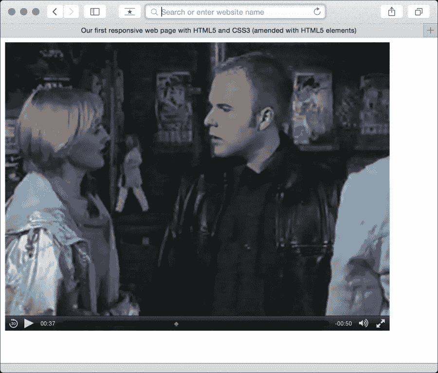

# 第四章：响应式 Web 设计的 HTML5

如果您正在寻求使用 HTML5 **应用程序编程接口**（**API**）的指导，我要引用一部伟大的西部电影中的一句话，说：“我不是你的 Huckleberry”。

我想和您一起看看 HTML5 的“词汇”部分；它的语义。更简洁地说，我们可以如何使用 HTML5 的新元素来描述我们在标记中放置的内容。本章大部分内容与响应式 Web 设计无关。然而，HTML 是构建所有基于 Web 的设计和应用程序的基础。谁不想在最坚实的基础上构建？

您可能会想知道“HTML5 到底是什么？”如果是这样，我会告诉您，HTML5 只是给 HTML 的最新版本的描述，这是我们用来构建网页的标签语言。HTML 本身是一个不断发展的标准，之前的主要版本是 4.01。

关于 HTML 的版本和时间线的更多背景信息，您可以阅读维基百科条目[`en.wikipedia.org/wiki/HTML#HTML_versions_timeline`](http://en.wikipedia.org/wiki/HTML#HTML_versions_timeline)。

### 提示

HTML5 现在是 W3C 的推荐标准。您可以在[`www.w3.org/TR/html5/`](http://www.w3.org/TR/html5/)上阅读规范。

本章我们将涵盖的主题有：

+   HTML5 得到了多大的支持？

+   正确开始 HTML5 页面

+   轻松的 HTML5

+   新的语义元素

+   文本级语义

+   过时的功能

+   将新元素投入使用

+   **Web 内容可访问性指南**（**WCAG**）可访问性符合和**Web 可访问性倡议-可访问丰富的互联网应用程序**（**WAI-ARIA**）用于更具可访问性的 Web 应用程序

+   嵌入媒体

+   响应式视频和 iFrames

+   关于“离线优先”的说明

### 注意

HTML5 还提供了处理表单和用户输入的特定工具。这一系列功能大大减轻了像 JavaScript 这样的资源密集型技术对表单验证等方面的负担。然而，我们将在第九章中单独讨论 HTML5 表单，*用 HTML5 和 CSS3 征服表单*。

# HTML5 标记-所有现代浏览器都能理解

如今，我看到的大多数网站（包括我自己制作的所有网站）都是使用 HTML5 编写的，而不是旧的 HTML 4.01 标准。

所有现代浏览器都理解 HTML5 的新语义元素（新的结构元素、视频和音频标签），甚至旧版本的 Internet Explorer（Internet Explorer 9 之前的版本）也可以使用一个小的“polyfill”来渲染这些新元素。

### 注意

**什么是 polyfill？**

术语**polyfill**是由 Remy Sharp 创造的，意指用 Polyfilla（在美国称为**Spackling Paste**）填补旧浏览器中的裂缝。因此，polyfill 是 JavaScript 的“垫片”，可以在旧浏览器中有效地复制新功能。然而，重要的是要意识到 polyfill 会给您的代码增加额外的负担。因此，即使您可以添加 15 个 polyfill 脚本使 Internet Explorer 6 渲染网站与其他浏览器完全相同，也并不意味着您一定应该这样做。

如果您需要启用 HTML5 结构元素，我建议查看 Remy Sharp 的原始脚本（[`remysharp.com/2009/01/07/html5-enabling-script/`](http://remysharp.com/2009/01/07/html5-enabling-script/)）或创建 Modernizr 的自定义版本（[`modernizr.com`](http://modernizr.com)）。如果您还没有接触或使用 Modernizr，下一章中有一个完整的部分介绍它。

考虑到这一点，让我们来考虑一下 HTML5 页面的开始。让我们了解所有的开放标签以及它们的作用。

# 正确开始 HTML5 页面

让我们从 HTML5 文档的开头开始。如果搞砸了这部分，你可能会花很长时间想知道为什么你的页面表现得不像应该的那样。前几行应该是这样的：

```html
<!DOCTYPE html>
<html lang="en">
<head>
<meta charset=utf-8>
```

让我们逐个讨论这些标签。通常情况下，每次创建网页时它们都是一样的，但相信我，了解它们的作用是值得的。

## 文档类型

`doctype`是一种向浏览器传达我们拥有的文档类型的方式。否则，它可能不知道如何使用其中的内容。

我们用 HTML5 的`doctype`声明打开了我们的文档：

```html
<!DOCTYPE html>
```

如果你喜欢小写字母，那么`<!doctype html>`也是一样好的。没有任何区别。

这是从 HTML 4.01 页面中的一个受欢迎的变化。它们过去通常是这样开始的：

```html
<!DOCTYPE html PUBLIC "-//W3C//DTD XHTML 1.0 Transitional//EN" "http://www.w3.org/TR/xhtml1/DTD/xhtml1-transitional.dtd">
```

这真是一个巨大的痛苦！难怪我过去常常复制粘贴它！

另一方面，HTML5 的`doctype`非常简短，只是`<!DOCTYPE html>`。有趣的事实（至少对我来说）：实际上它最终变成这样是因为确定这是告诉浏览器以“标准模式”渲染页面的最短方法。

### 提示

想要了解“怪癖”和“标准”模式是什么吗？维基百科可以帮到你：[`en.wikipedia.org/wiki/Quirks_mode`](http://en.wikipedia.org/wiki/Quirks_mode)

## HTML 标签和 lang 属性

在`doctype`声明之后，我们打开了`html`标签；我们文档的根标签。我们还使用`lang`属性来指定文档的语言，然后我们打开了`<head>`部分。

```html
<html lang="en">
<head>
```

## 指定备用语言

根据 W3C 规范（[`www.w3.org/TR/html5/dom.html#the-lang-and-xml:lang-attributes`](http://www.w3.org/TR/html5/dom.html#the-lang-and-xml:lang-attributes)），`lang`属性指定了元素内容的主要语言，以及包含文本的元素属性的语言。如果你不是用英语编写页面，最好指定正确的语言代码。例如，对于日语，HTML 标签将是`<html lang="ja">`。要查看完整的语言列表，请查看[`www.iana.org/assignments/language-subtag-registry`](http://www.iana.org/assignments/language-subtag-registry)。

## 字符编码

最后，我们指定字符编码。由于它是一个空元素（不能包含任何内容），它不需要闭合标签：

```html
<meta charset="utf-8">
```

除非你有充分的理由指定其他值，否则字符集的值几乎总是`utf-8`。对于好奇的人，关于这个主题的更多信息可以在[`www.w3.org/International/questions/qa-html-encoding-declarations#html5charset`](http://www.w3.org/International/questions/qa-html-encoding-declarations#html5charset)找到。

# 轻松的 HTML5

我记得，在学校的时候，我们非常严厉（但实际上非常好）的数学老师偶尔会缺席。班上会松一口气，因为替代老师通常是一个随和的人。他安静地坐着，不会大声喊叫或不断刺激我们。他在我们工作时不坚持要求安静，也不太在意我们是否遵守他解决问题的方式，重要的是答案以及我们如何得出答案。如果 HTML5 是一位数学老师，它就是那位随和的替代老师。现在我将解释这个奇怪的类比。

如果你注意写代码的方式，通常会大部分使用小写字母，用引号括起属性值，并为脚本和样式表声明“类型”。例如，也许你链接到一个样式表，就像这样：

```html
<link href="CSS/main.css" rel="stylesheet" type="text/css" />
```

HTML5 不需要如此精确，它也可以接受这样的写法：

```html
<link href=CSS/main.css rel=stylesheet >
```

你注意到了吗？没有结束标签/斜杠，属性值周围没有引号，也没有类型声明。然而，轻松的 HTML5 并不在乎。第二个例子和第一个一样有效。

这种更宽松的语法适用于整个文档，不仅仅是链接的资产。例如，如果你喜欢，可以这样指定一个 div：

```html
<div id=wrapper>
```

这是完全有效的 HTML5。插入图像也是一样：

```html

```

这也是有效的 HTML5。没有结束标签/斜杠，没有引号，大小写字母混合。你甚至可以省略诸如开头的`<head>`标签，页面仍然验证。XHTML 1.0 会对此有何看法？

### 提示

想要一个快捷的 HTML5 代码？考虑使用 HTML5 Boilerplate（[`html5boilerplate.com/`](http://html5boilerplate.com/)）。这是一个预先制作的“最佳实践”HTML5 文件，包括必要的样式，polyfills 和可选工具，如 Modernizr。你可以通过查看代码获得很多很好的提示，还可以根据自己的特定需求定制模板。强烈推荐！

## HTML5 标记的合理方法

就个人而言，我喜欢以“XHTML”风格编写我的标记。这意味着关闭标签，引用属性值，并遵循一致的大小写。有人可能会争辩说放弃其中一些做法会节省一些数据字节，但这就是工具的用途（如果需要，可以剥离任何不必要的字符/数据）。我希望我的标记尽可能易读，也鼓励其他人这样做。我认为代码的清晰度应该胜过简洁性。

因此，在编写 HTML5 文档时，我认为你可以编写干净易读的代码，同时仍然可以利用 HTML5 所提供的经济效益。举例来说，对于 CSS 链接，我会选择以下方式：

```html
<link href="CSS/main.css" rel="stylesheet"/>
```

我保留了闭合标签和引号，但省略了`type`属性。这里要说明的是，你可以找到一个让自己满意的水平。HTML5 不会对你大喊大叫，在班上标记你的标记，并让你站在角落里戴着愚人帽子，因为你的标记没有验证（难道只有我的学校这样做吗？）。但是，你想怎么写你的标记都可以。

我在开玩笑吗？我现在就想让你知道，如果你在编写代码时不引用属性值和不关闭标签，我会默默地评判你。

### 提示

尽管 HTML5 的语法更宽松，但检查你的标记是否有效总是值得的。有效的标记更具可访问性。W3C 验证器就是为了这个目的而创建的：[`validator.w3.org/`](http://validator.w3.org/)

我已经够抨击“嬉皮士”风格标记的作者了。让我们看看 HTML5 的更多好处。

## 万岁强大的<a>标签

HTML5 的一个巨大的优势是现在我们可以将多个元素包装在一个`<a>`标签中（喔耶！是时候了，对吧？）。以前，如果你想让你的标记验证，就必须将每个元素包装在自己的`<a>`标签中。例如，看看以下 HTML 4.01 代码：

```html
<h2><a href="index.html">The home page</a></h2>
<p><a href="index.html">This paragraph also links to the home page</a></p>
<a href="index.html"></a>
```

有了 HTML5，我们可以放弃所有单独的`<a>`标签，而是用一个标签包装整个组：

```html
<a href="index.html">
  <h2>The home page</h2>
  <p>This paragraph also links to the home page</p>
  
</a>
```

需要记住的唯一限制是，可以理解的是，你不能在另一个`<a>`标签中包装一个`<a>`标签（因为，嗯，显而易见），或者另一个交互元素，如`button`（因为，嗯，显而易见！），也不能在`<a>`标签中包装一个表单（因为，嗯，你懂的）。

# HTML5 中的新语义元素

如果我查看 OS X 字典中“语义”一词的定义，它被定义为：

> *“与语言学和逻辑有关的分支，关注意义”。*

对于我们的目的，语义是赋予我们的标记意义的过程。这为什么重要？很高兴你问。

大多数网站遵循相当标准的结构约定；典型的区域包括标题、页脚、侧边栏、导航栏等。作为网页作者，我们通常会为我们使用的 div 命名，以更清晰地指定这些区域（例如，`class="Header"`）。但是，就代码本身而言，任何用户代理（Web 浏览器、屏幕阅读器、搜索引擎爬虫等）查看它时无法确定每个`div`元素的目的。辅助技术的用户也会发现很难区分一个`div`和另一个`div`。HTML5 旨在通过新的语义元素解决这个问题。

### 注意

要获取 HTML5 元素的完整列表，请舒服地将浏览器指向[`www.w3.org/TR/html5/semantics.html#semantics`](http://www.w3.org/TR/html5/semantics.html#semantics)。

我们不会在这里涵盖所有新元素，只是我认为在日常响应式 Web 设计中最有益或有趣的元素。让我们深入了解。

## `<main>`元素

很长一段时间，HTML5 没有元素来划分页面的主要内容。在网页的正文中，这将是包含主要内容块的元素。

起初，有人认为不在其他新的语义 HTML5 元素之一内的内容，通过否定，将成为主要内容。幸运的是，规范发生了变化，现在我们有了更具有声明性的方式来分组主要内容；这个名为`<main>`的标签。

无论您是包装页面的主要内容还是基于 Web 的应用程序的主要部分，`main`元素都是您应该将所有内容分组的元素。以下是规范中特别有用的一行：

> “文档的主要内容区域包括该文档独有的内容，不包括在一组文档中重复的内容，例如站点导航链接、版权信息、站点标识和横幅以及搜索表单（除非文档或应用程序的主要功能是搜索表单）。”

值得注意的是，每个页面上不应该有多个主要内容（毕竟，您不能有两个主要内容），它不应该被用作其他语义 HTML5 元素的后代，例如`article`、`aside`、`header`、`footer`、`nav`或`header`。但它们可以存在于主要元素中。

### 注意

阅读关于主要元素的官方说明：[`www.w3.org/TR/html5/grouping-content.html#the-main-element`](http://www.w3.org/TR/html5/grouping-content.html#the-main-element)

## `<section>`元素

`<section>`元素用于定义文档或应用程序的通用部分。例如，您可以选择围绕您的内容创建部分；一个部分用于联系信息，另一个部分用于新闻提要等。重要的是要理解它并不是用于样式目的。如果您需要包装一个元素仅用于样式化，您应该继续像以前一样使用`div`。

在开发基于 Web 的应用程序时，我倾向于使用`section`作为可视组件的包装元素。它提供了一种简单的方法来查看标记中组件的开始和结束。

您还可以自行判断是否应该使用基于内容的部分（例如`h1`）来确定是否应该使用部分。如果没有，您最好选择`div`。

### 注意

要查看 W3C HTML5 规范中关于`<section>`的内容，请访问以下网址：

[`www.w3.org/TR/html5/sections.html#the-section-element`](http://www.w3.org/TR/html5/sections.html#the-section-element)

## <nav>元素

`<nav>`元素用于包装到其他页面或同一页面内部的主要导航链接。它并不严格用于页脚（尽管可以），以及其他常见的其他页面链接组。

如果您通常使用无序列表（`<ul>`）和一堆列表标签（`li`）标记您的导航元素，您可能更适合使用`nav`和一些嵌套的`a`标签。

### 注意

要了解 W3C HTML5 规范对`<nav>`的说明，请访问以下网址：

[`www.w3.org/TR/html5/sections.html#the-nav-element`](http://www.w3.org/TR/html5/sections.html#the-nav-element)

## `<article>`元素

`<article>`元素和`<section>`一样容易引起混淆。我肯定在它们的规范之前读了很多遍，才明白它们的含义。这是我对规范的重新阐述。`<article>`元素用于包装一个独立的内容块。在构建页面时，问一下，您打算在`<article>`标签中使用的内容是否可以作为一个整体被复制到另一个网站上，并且仍然完全有意义？另一种思考方式是，您打算用`<article>`包装的内容是否实际上构成了 RSS 订阅中的一个单独的文章？显而易见的应该用`<article>`元素包装的内容的例子是博客文章或新闻报道。请注意，如果嵌套`<article>`元素，假定嵌套的`<article>`元素主要与外部文章相关。

### 注意

有关 W3C HTML5 规范对`<article>`的说明，请访问[`www.w3.org/TR/html5/sections.html#the-article-element`](http://www.w3.org/TR/html5/sections.html#the-article-element)。

## `<aside>`元素

`<aside>`元素用于与周围内容有关的内容。在实际操作中，我经常用它来制作侧边栏（当它包含合适的内容时）。它也被认为适合用于拉引语、广告和导航元素组。基本上，任何与主要内容不直接相关的内容都可以放在`<aside>`中。如果这是一个电子商务网站，我会考虑像“购买此商品的顾客还购买了”这样的区域作为`<aside>`的首选内容。

### 注意

有关 W3C HTML5 规范对`<aside>`的说明，请访问[`www.w3.org/TR/html5/sections.html#the-aside-element`](http://www.w3.org/TR/html5/sections.html#the-aside-element)。

## `<figure>`和`<figcaption>`元素

规范涉及`figure`元素：

> 这样可以用来注释插图、图表、照片、代码清单等。

以下是我们如何使用它来修改第一章的一部分标记：

```html
<figure class="MoneyShot">
  
  <figcaption class="ImageCaption">Incredible scones, picture from Wikipedia</figcaption>
</figure>
```

您可以看到`<figure>`元素用于包装这个小的独立块。在内部，`<figcaption>`用于为父`<figure>`元素提供标题。

当图片或代码需要在旁边加上一点标题时（这在内容的主要文本中不合适），这是完美的。

### 注意

`figure`元素的规范可以在[`www.w3.org/TR/html5/grouping-content.html#the-figure-element`](http://www.w3.org/TR/html5/grouping-content.html#the-figure-element)找到。

`figcaption`的规范在[`www.w3.org/TR/html5/grouping-content.html#the-figcaption-element`](http://www.w3.org/TR/html5/grouping-content.html#the-figcaption-element)。

## `<details>`和`<summary>`元素

您有多少次想要在页面上创建一个简单的打开和关闭“小部件”？点击时打开一个带有附加信息的面板的摘要文本。HTML5 通过`details`和`summary`元素实现了这种模式。考虑一下这个标记（您可以打开本章代码中的`example3.html`来自己尝试）：

```html
<details>
    <summary>I ate 15 scones in one day</summary>
    <p>Of course I didn't. It would probably kill me if I did. What a way to go. Mmmmmm, scones!</p>
</details>
```

在 Chrome 中打开时，默认只显示摘要文本：


单击摘要文本的任何位置都会打开面板。再次单击它会切换关闭。如果您希望面板默认打开，可以将`open`属性添加到`details`元素中：

```html
<details open>
    <summary>I ate 15 scones in one day</summary>
    <p>Of course I didn't. It would probably kill me if I did. What a way to go. Mmmmmm, scones!</p>
</details>
```


支持的浏览器通常会添加一些默认样式来指示面板可以打开。在 Chrome（以及 Safari）中，这是一个深色的披露三角形。要禁用这个，你需要使用一个 WebKit 特定的私有伪选择器：

```html
summary::-webkit-details-marker {
  display: none;
}
```

当然，你可以使用相同的选择器来以不同的样式显示标记。

目前，没有办法对打开和关闭进行动画处理。也没有（非 JavaScript）的办法在打开不同的详细信息面板时关闭其他详细信息面板（在同一级别）。我不确定这些愿望中的任何一个会（或应该）得到解决。你应该把它看作是一种通过 JavaScript 的`display: none;`切换来促进你所做的事情。

遗憾的是，截至我写这篇文章时（2015 年中），Firefox 或 Internet Explorer 不支持此元素（它们只将这两个元素呈现为内联元素）。存在 Polyfills（[`mathiasbynens.be/notes/html5-details-jquery`](https://mathiasbynens.be/notes/html5-details-jquery)），希望很快就会完全实现。

## `<header>`元素

实际上，`<header>`元素可以用于站点页眉的“标志”区域。它也可以用作其他内容的介绍，比如`<article>`元素中的一个部分。你可以在同一页上使用它多次（例如，你可以在页面上的每个`<section>`中都有一个`<header>`）。

### 注意

这是 W3C HTML5 规范对`<header>`的说明：

[`www.w3.org/TR/html5/sections.html#the-header-element`](http://www.w3.org/TR/html5/sections.html#the-header-element)

## `<footer>`元素

`<footer>`元素应该用于包含所在部分的信息。例如，它可能包含指向其他文档的链接或版权信息。与`<header>`一样，如果需要，它可以在页面中多次使用。例如，它可以用于博客的页脚，也可以用于博客文章中的`footer`部分。但是，规范解释说，博客文章作者的联系信息应该用`<address>`元素包装。

### 注意

查看 W3C HTML5 规范对`<footer>`的说明：

[`www.w3.org/TR/html5/sections.html#the-footer-element`](http://www.w3.org/TR/html5/sections.html#the-footer-element)

## `<address>`元素

`<address>`元素专门用于标记其最近的`<article>`或`<body>`祖先的联系信息。要混淆事情，要记住它不应该用于邮政地址等（除非它们确实是所讨论内容的联系地址）。相反，邮政地址和其他任意联系信息应该用老式的`<p>`标签包装。

我不喜欢`<address>`元素，因为根据我的经验，将物理地址标记为自己的元素会更有用，但这是我的个人抱怨。希望这对你来说更有意义。

### 注意

有关 W3C HTML5 规范对`<address>`的更多信息，请查看：

[`www.w3.org/TR/html5/sections.html#the-address-element`](http://www.w3.org/TR/html5/sections.html#the-address-element)

## 关于 h1-h6 元素的说明

直到最近我才意识到，使用`h1`-`h6`标签标记标题和副标题是不鼓励的。我说的是这种情况：

```html
<h1>Scones:</h1>
<h2>The most resplendent of snacks</h2>
```

以下是 HTML5 规范的一句引用：

h1-h6 元素不得用于标记副标题、副标题、替代标题和标语，除非打算用作新部分或子部分的标题。

这绝对是规范中最不明确的句子之一！哎呀！

那么，我们应该如何编写这样的情况呢？规范实际上有一个专门的部分（[`www.w3.org/TR/html5/common-idioms.html#common-idioms`](http://www.w3.org/TR/html5/common-idioms.html#common-idioms)）来专门讨论这个问题。就我个人而言，我更喜欢旧的`<hgroup>`元素，但可惜的是，那艘船已经启航了（更多信息请参见*过时的 HTML 功能*部分）。因此，为了遵循规范的建议，我们之前的例子可以重写为：

```html
<h1>Scones:</h1>
<p>The most resplendent of snacks</p>
```

# HTML5 文本级语义

除了我们已经看过的结构和分组元素之外，HTML5 还修改了一些以前被称为内联元素的标签。HTML5 规范现在将这些标签称为文本级语义（[`www.w3.org/TR/html5/text-level-semantics.html#text-level-semantics`](http://www.w3.org/TR/html5/text-level-semantics.html#text-level-semantics)）。让我们看一些常见的例子。

## `<b>`元素

从历史上看，`<b>`元素意味着“使其加粗”（[`www.w3.org/TR/html4/present/graphics.html#edef-B`](http://www.w3.org/TR/html4/present/graphics.html#edef-B)）。这是从以前样式选择是标记的一部分的时代。然而，现在你可以正式地将其仅用作 CSS 中的样式钩，因为 HTML5 规范现在声明`<b>`是：

> *“b 元素表示吸引注意力的文本范围，用于实用目的，而不传达任何额外的重要性，并且没有暗示另一种声音或情绪，例如文档摘要中的关键词，评论中的产品名称，交互式文本驱动软件中的可操作单词，或文章导言。”*

虽然现在没有特定的含义与之相关联，但由于它是文本级的，它不打算用于包围大量的标记，对此请使用`div`。您还应该知道，因为它在历史上用于加粗文本，如果您希望`<b>`标签内的内容不显示为加粗，通常需要在 CSS 中重置字体重量。

## `<em>`元素

好的，举起手来，我经常只是把`<em>`用作样式钩。我需要改变我的方式，因为在 HTML5 中：

`em`元素表示其内容的重点强调。

因此，除非您真的希望强调所包含的内容，否则请考虑使用`<b>`标签或者在相关情况下使用`<i>`标签。

## `<i>`元素

HTML5 规范将`<i>`描述为：

> *“...以另一种声音或情绪，或以其他方式偏离正常散文的方式，表明文本的不同质量。”*

可以说，它不仅仅用于使某物变斜体。例如，我们可以使用它来标记文本行中的奇怪名称：

```html
<p>However, discussion on the hgroup element is now frustraneous as it's now gone the way of the <i>Raphus cucullatus</i>.</p>
```

### 注意

HTML5 中有许多其他文本级语义标签。要了解完整的信息，请查看规范的相关部分，网址如下：

[`www.w3.org/TR/html5/text-level-semantics.html#text-level-semantics`](http://www.w3.org/TR/html5/text-level-semantics.html#text-level-semantics)

# 过时的 HTML 功能

除了脚本链接中的语言属性之类的东西，HTML 中还有一些您可能习惯使用的其他部分，现在在 HTML5 中被认为是“过时的”。重要的是要意识到在 HTML5 中有两种过时功能的阵营——符合和不符合。符合功能仍然可以工作，但会在验证器中生成警告。实际上，如果可以的话最好避免使用它们，但如果您使用它们，也不会导致天塌下来。不符合功能在某些浏览器中可能仍然可以渲染，但如果您使用它们，您会被认为是非常非常淘气的，并且您可能在周末得不到奖励！

在过时和不符合规范的功能方面，有相当多的功能。我承认很多我从未使用过（有些我甚至从未见过！）。你可能会有类似的反应。然而，如果你感兴趣，你可以在[`www.w3.org/TR/html5/obsolete.html`](http://www.w3.org/TR/html5/obsolete.html)找到完整的过时和不符合规范的功能列表。值得注意的过时和不符合规范的功能包括`strike`、`center`、`font`、`acronym`、`frame`和`frameset`。

HTML5 中还有一些早期草案中存在的功能，现在已经被删除了。`hgroup`就是一个例子。该标签最初被提议用于包装标题组；一个标题`h1`和一个副标题`h2`可能被包装在`hgroup`元素中。然而，关于`hgroup`元素的讨论现在已经变得无用，因为它已经像 Raphus cucullatus 一样消失了（去吧，谷歌一下，你知道你想要的）。

# 使用 HTML5 元素

现在是练习刚刚学习的一些元素的时候了。让我们重新访问第一章中的示例，*响应式网页设计的基本知识*。如果我们将下面的标记与第一章中的原始标记进行比较（记住，你可以从[`rwd.education`](http://rwd.education)网站或 GitHub 存储库下载所有示例），你可以看到我们刚刚学习的新元素在下面的示例中是如何使用的。

```html
<article>
  <header class="Header">
    <a href="/" class="LogoWrapper"></a>
    <h1 class="Strap">Scones: the most resplendent of snacks</h1>

	</header>
  <section class="IntroWrapper">
    <p class="IntroText">Occasionally maligned and misunderstood; the scone is a quintessentially British classic.</p>
    <figure class="MoneyShot">
      
      <figcaption class="ImageCaption">Incredible scones, picture from Wikipedia</figcaption>
    </figure>
  </section>
  <p>Recipe and serving suggestions follow.</p>
  <section class="Ingredients">
    <h3 class="SubHeader">Ingredients</h3>
  </section>
  <section class="HowToMake">
    <h3 class="SubHeader">Method</h3>
  </section>
  <footer>
    Made for the book, <a href="http://rwd.education">'Resonsive web design with HTML5 and CSS3'</a> by <address><a href="http://benfrain">Ben Frain</a></address>
  </footer>
</article>
```

## 运用常识进行元素选择

我已经删除了大部分内部内容，这样我们就可以集中精力关注结构。希望你会同意，很容易区分出标记的不同部分。然而，在这一点上，我也想提供一些建议；如果你并不总是为每个特定情况选择正确的元素，这并不是世界末日。例如，在前面的例子中，我使用`<section>`还是`<div>`并不是很重要。如果我们在应该使用`<i>`时使用了`<em>`，我并不认为这是对人类的罪行；W3C 的人员不会因为你做出了错误的选择而追捕你。只需运用一点常识。也就是说，如果你能在相关情况下使用`<header>`和`<footer>`等元素，那么这样做就具有固有的可访问性好处。

# WCAG 和 WAI-ARIA 用于更易访问的网页应用程序

即使自 2011 年至 2012 年编写本书的第一版以来，W3C 在使作者更容易编写更易访问的网页方面已经取得了进展。

## WCAG

WCAG 的存在是为了提供：

> *“一个共享的标准，用于满足国际上个人、组织和政府的网页内容可访问性需求。”*

对于更普通的网页（而不是单页面网页应用程序等），集中精力关注 WCAG 指南是有意义的。它们提供了许多（大多数是常识）关于如何确保您的网页内容可访问的指南。每个建议都被评为符合级别：A、AA 或 AAA。有关这些符合级别的更多信息，请参阅[`www.w3.org/TR/UNDERSTANDING-WCAG20/conformance.html#uc-levels-head`](http://www.w3.org/TR/UNDERSTANDING-WCAG20/conformance.html#uc-levels-head)。

你可能会发现，你已经遵守了许多指南，比如为图像提供替代文本。然而，你可以在[`www.w3.org/WAI/WCAG20/glance/Overview.html`](http://www.w3.org/WAI/WCAG20/glance/Overview.html)上快速了解这些指南，然后在[`www.w3.org/WAI/WCAG20/quickref/`](http://www.w3.org/WAI/WCAG20/quickref/)上建立自己的自定义快速参考清单。

我鼓励每个人花一两个小时看一看这个清单。许多指南都很容易实施，并为用户带来实际的好处。

## WAI-ARIA

WAI-ARIA 的目标主要是解决使网页上的动态内容可访问的问题。它提供了一种描述自定义小部件（Web 应用程序中的动态部分）的角色、状态和属性的方法，以便辅助技术用户能够识别和使用它们。

例如，如果屏幕上的小部件显示不断更新的股票价格，那么如何盲人用户访问页面时知道呢？WAI-ARIA 试图解决这些问题。

### 不要为语义元素使用角色

以前建议为标题和页脚添加“地标”角色，如下所示：

```html
<header role="banner">A header with ARIA landmark banner role</header>
```

然而，现在认为这是多余的。如果您查看前面列出的任何元素的规范，都有一个专门的*允许的 ARIA 角色属性*部分。以下是来自 section 元素的相关解释：

> “允许的 ARIA 角色属性值：”
> 
> *region role (default - do not set), alert, alertdialog, application, contentinfo, dialog, document, log, main, marquee, presentation, search or status."*

其中关键部分是“role（默认-不设置）”。这意味着在元素本身已经隐含了 ARIA 角色时，明确添加 ARIA 角色到元素是没有意义的。规范中的一条说明现在已经明确表明了这一点。

> “在大多数情况下，设置与默认隐式 ARIA 语义匹配的 ARIA 角色和/或 aria-*属性是不必要的，也不建议这样做，因为这些属性已经由浏览器设置。”

## 如果您只记住一件事

您可以尽可能使用正确的元素来帮助辅助技术。`header`元素比`div class="Header"`更有用。同样，如果页面上有一个按钮，请使用`<button>`元素（而不是`span`或其他样式看起来像`button`的元素）。我知道`button`元素并不总是允许精确的样式（例如，它不喜欢被设置为`display: table-cell`或`display: flex`），在这种情况下至少选择次佳选择；通常是`<a>`标签。

## 进一步了解 ARIA

ARIA 不仅限于地标角色。要进一步了解，可以在[`www.w3.org/TR/wai-aria/roles`](http://www.w3.org/TR/wai-aria/roles)上找到角色的完整列表和简洁的用法描述。

对于这个话题的轻松看法，我还推荐 Heydon Pickering 的书《Apps For All: Coding Accessible Web Applications》（可在[`shop.smashingmagazine.com/products/apps-for-all-coding-accessible-web-applications`](https://shop.smashingmagazine.com/products/apps-for-all-coding-accessible-web-applications)上获取）。

### 提示

**免费使用非视觉桌面访问（NVDA）测试您的设计**

如果您在 Windows 平台上开发，并且想要免费使用 NVDA 测试您的 ARIA 增强设计，您可以在以下网址获取：

[`www.nvda-project.org/`](http://www.nvda-project.org/)

谷歌现在还为 Chrome 浏览器提供免费的“辅助开发者工具”（可跨平台使用）；非常值得一试。

还有越来越多的工具可以帮助您快速测试自己的设计，例如[`michelf.ca/projects/sim-daltonism/`](https://michelf.ca/projects/sim-daltonism/)是一个 Mac 应用程序，可以让您切换色盲类型，并在浮动调色板中预览。

最后，OS X 还包括 VoiceOver 实用程序，用于测试您的网页。

希望对 WAI-ARIA 和 WCAG 的简要介绍为您提供了足够的信息，让您更多地考虑如何支持辅助技术。也许在您的下一个 HTML5 项目中添加辅助技术支持会比您想象的更容易。

作为所有辅助功能的最终资源，A11Y 项目主页上有很多有用的链接和建议，网址为[`a11yproject.com/`](http://a11yproject.com/)。

# 在 HTML5 中嵌入媒体

对许多人来说，当苹果拒绝在其 iOS 设备中添加对 Flash 的支持时，HTML5 首次进入他们的词汇表。Flash 已经在市场上占据了主导地位（有人会认为是市场垄断），成为通过网络浏览器提供视频的首选插件。然而，苹果决定不使用 Adobe 的专有技术，而是依靠 HTML5 来处理丰富的媒体渲染。虽然 HTML5 在这个领域本来就取得了良好的进展，但苹果对 HTML5 的公开支持使其获得了重大的优势，并帮助其媒体工具在更广泛的社区中获得了更大的影响力。

正如你所想象的，Internet Explorer 8 及更低版本不支持 HTML5 视频和音频。大多数其他现代浏览器（Firefox 3.5+，Chrome 4+，Safari 4，Opera 10.5+，Internet Explorer 9+，iOS 3.2+，Opera Mobile 11+，Android 2.3+）都可以很好地处理它。

## 以 HTML5 方式添加视频和音频

在 HTML5 中，视频和音频非常简单。以前使用 HTML5 媒体的唯一真正困难之处在于列出媒体的备用源格式（因为不同的浏览器支持不同的文件格式）。如今，MP4 在桌面和移动平台上都是无处不在的，使得通过 HTML5 在网页中包含媒体变得轻而易举。以下是如何在页面中链接到视频文件的“简单至极”的示例：

```html
<video src="img/myVideo.mp4"></video>
```

HTML5 允许一个`<video></video>`标签（或者用于音频的`<audio></audio>`）来完成所有繁重的工作。还可以在开放和闭合标签之间插入文本，以通知用户存在问题。通常还有其他属性需要添加，比如`height`和`width`。让我们添加这些：

```html
<video src="img/myVideo.mp4" width="640" height="480">What, do you mean you don't understand HTML5?</video>
```

现在，如果我们将前面的代码片段添加到我们的页面中，并在 Safari 中查看它，它将出现，但没有播放控件。要获得默认的播放控件，我们需要添加`controls`属性。我们还可以添加`autoplay`属性（不建议-众所周知，每个人都讨厌自动播放的视频）。这在以下代码片段中进行了演示：

```html
<video src="img/myVideo.mp4" width="640" height="480" controls autoplay> What, do you mean you don't understand HTML5?</video>
```

前面的代码片段的结果如下截图所示：



其他属性包括`preload`来控制媒体的预加载（早期的 HTML5 采用者应该注意，preload 取代了 autobuffer），`loop`来重复播放视频，以及`poster`来定义视频的海报帧。如果视频播放可能会有延迟（或者缓冲可能需要一些时间），这将非常有用。要使用属性，只需将其添加到标签中。以下是包括所有这些属性的示例：

```html
<video src="img/myVideo.mp4" width="640" height="480" controls autoplay preload="auto" loop poster="myVideoPoster.png">What, do you mean you don't understand HTML5?</video>
```

### 旧版浏览器的回退功能

`<source>`标签使我们能够根据需要提供备用方案。例如，除了提供视频的 MP4 版本外，如果我们想要确保 Internet Explorer 8 及更低版本有合适的备用方案，我们可以添加 Flash 回退。更进一步，如果用户在浏览器中没有任何合适的播放技术，我们可以提供文件本身的下载链接。以下是一个示例：

```html
<video width="640" height="480" controls preload="auto" loop poster="myVideoPoster.png">
    <source src="img/myVideo.mp4" type="video/mp4">  
    <object width="640" height="480" type="application/x-shockwave-flash" data="myFlashVideo.SWF">
      <param name="movie" value="myFlashVideo.swf" />
      <param name="flashvars" value="controlbar=over&amp;image=myVideoPoster.jpg&amp;file=myVideo.mp4" />
      
    </object>
    <p><b>Download Video:</b>
  MP4 Format:  <a href="myVideo.mp4">"MP4"</a>
    </p>
</video>
```

该代码示例和示例视频文件（我在英国肥皂剧《加冕街》中出现，当时我还有头发，希望能与德尼罗一起出演）以 MP4 格式在本章代码的`example2.html`中。

## 音频和视频标签的工作方式几乎相同

`<audio>`标签遵循相同的原则，具有相同的属性（不包括`width`，`height`和`poster`）。两者之间的主要区别在于`<audio>`没有用于可见内容的播放区域。

# 响应式 HTML5 视频和 iFrames

我们已经看到，支持旧版浏览器会导致代码膨胀。以`<video>`标签开始的一两行最终变成了 10 行或更多行（还有一个额外的 Flash 文件），只是为了让旧版的 Internet Explorer 满意！就我个人而言，我通常愿意放弃 Flash 回退，以追求更小的代码占用空间，但每个用例都不同。

现在，我们可爱的 HTML5 视频实现的唯一问题是它不是响应式的。没错，在一个使用 HTML5 和 CSS3 的响应式网页设计示例中，它并没有“响应”。

值得庆幸的是，对于 HTML5 嵌入视频，修复很容易。只需在标记中删除任何高度和宽度属性（例如，删除`width="640" height="480"`），并在 CSS 中添加以下内容：

```html
video { max-width: 100%; height: auto; }
```

然而，虽然这对于我们可能在本地托管的文件效果很好，但它并没有解决嵌入在 iFrame 中的视频的问题（比如 YouTube、Vimeo 等）。以下代码将在页面中添加来自 YouTube 的《午夜逃亡》电影预告：

```html
<iframe width="960" height="720" src="img/watch?v=B1_N28DA3gY" frameborder="0" allowfullscreen></iframe>
```

然而，如果按原样添加到页面上，即使添加了之前的 CSS 规则，如果视口小于 960px 宽，事情就会开始被裁剪。

解决这个问题最简单的方法是使用加利西 CSS 大师 Thierry Koblentz 开创的一个小 CSS 技巧；基本上是为视频创建一个正确宽高比的框。我不想泄露这位魔术师的解释，去阅读一下[`alistapart.com/article/creating-intrinsic-ratios-for-video`](http://alistapart.com/article/creating-intrinsic-ratios-for-video)。

如果你感到懒惰，甚至不需要计算宽高比并自己插入，有一个在线服务可以为你做到。只需转到[`embedresponsively.com/`](http://embedresponsively.com/)，粘贴你的 iFrame URL 进去。它会为你生成一小段简单的代码，你可以粘贴到你的页面中。例如，我们的《午夜逃亡》预告片的结果如下：

```html
<style>.embed-container { position: relative; padding-bottom: 56.25%; height: 0; overflow: hidden; max-width: 100%; height: auto; } .embed-container iframe, .embed-container object, .embed-container embed { position: absolute; top: 0; left: 0; width: 100%; height: 100%; }</style><div class='embed-container'><iframe src='http://www.youtube.com/embed/B1_N28DA3gY' frameborder='0' allowfullscreen></iframe></div>
```

就是这样，简单地添加到你的页面，就完成了：我们现在有了一个完全响应式的 YouTube 视频（注意：孩子们，不要理会 DeNiro 先生；吸烟有害健康）！

# 关于“离线优先”的说明

我相信构建响应式网页和基于 Web 的应用程序的理想方式是“离线优先”。这种方法意味着网站和应用程序将继续工作和加载，即使没有互联网连接。

HTML5 离线 Web 应用程序（[`www.w3.org/TR/2011/WD-html5-20110525/offline.html`](http://www.w3.org/TR/2011/WD-html5-20110525/offline.html)）是为了实现这个目标而指定的。

尽管离线 Web 应用程序的支持很好（[`caniuse.com/#feat=offline-apps`](http://caniuse.com/#feat=offline-apps)），遗憾的是，这并不是一个完美的解决方案。虽然设置起来相对简单，但存在许多限制和陷阱。在这本书的范围之外记录它们都是不可能的。相反，我建议阅读 Jake Archibald 在这个主题上的幽默而全面的文章：[`alistapart.com/article/application-cache-is-a-douchebag`](http://alistapart.com/article/application-cache-is-a-douchebag)。

因此，我认为虽然使用离线 Web 应用程序（如[`diveintohtml5.info/offline.html`](http://diveintohtml5.info/offline.html)中的教程）和 LocalStorage（或两者的某种组合）可以实现离线优先体验，但更好的解决方案将很快出现。我寄希望于“Service Workers”（[`www.w3.org/TR/service-workers/`](http://www.w3.org/TR/service-workers/)）。

在撰写本文时，Service Workers 仍然是一个相对较新的规范，但我建议你观看这个 15 分钟的介绍：[`www.youtube.com/watch?v=4uQMl7mFB6g`](https://www.youtube.com/watch?v=4uQMl7mFB6g)。阅读这篇介绍[`www.html5rocks.com/en/tutorials/service-worker/introduction/`](http://www.html5rocks.com/en/tutorials/service-worker/introduction/)，并在[`jakearchibald.github.io/isserviceworkerready/`](https://jakearchibald.github.io/isserviceworkerready/)检查支持情况。

我希望如果我写第三版这本书的时候，我们能够考虑全面概述和实施这种技术。保持乐观。

# 总结

在本章中，我们涵盖了很多内容。从创建一个符合 HTML5 验证的页面的基础知识，到将丰富媒体（视频）嵌入我们的标记，并确保它具有响应性。

虽然不是专门针对响应式设计，但我们也讨论了如何编写语义丰富和有意义的代码，并考虑了如何确保页面对于依赖辅助技术的用户来说是有意义和可用的。

出于必要性，这是一个非常标记密集的章节，所以现在让我们改变方向。在接下来的几章中，我们将拥抱 CSS 的强大和灵活性。首先，让我们看看 CSS 3 和 4 选择器的强大功能，新的视口相关 CSS 单位，以及诸如 calc 和 HSL 颜色等功能。它们都将使我们能够创建更快、更有能力和更易维护的响应式设计。
