# 第五章：CSS3-选择器、排版、颜色模式和新功能

在过去的几年里，CSS 已经拥有了许多新功能。一些功能使我们能够对元素进行动画和变换，其他功能允许我们创建背景图像、渐变、蒙版和滤镜效果，还有一些功能允许我们使 SVG 元素栩栩如生。

我们将在接下来的几章中了解所有这些功能。首先，我认为看一下过去几年中 CSS 中发生的一些基本变化会很有用：我们如何在页面上选择元素，我们可以使用哪些单位来样式和调整我们的元素，以及现有（和未来）伪类和伪元素如何使 CSS 变得更加强大。我们还将看看如何在我们的 CSS 代码中创建分支，以便在不同浏览器中支持不同的功能。

在本章中，我们将学习以下内容：

+   CSS 规则的解剖（定义规则、声明和属性、值对）

+   响应式设计的快速和方便的 CSS 技巧（多列、换行、截断/文本省略、滚动区域）

+   在 CSS 中实现功能分支（如何使一些规则适用于一些浏览器，而另一些规则适用于其他浏览器）

+   如何使用子字符串属性选择器选择 HTML 元素

+   基于 nth 的选择器是什么以及我们如何使用它们

+   伪类和伪元素是什么（`:empty`, `::before`, `::after`, `:target`, `:scope`）

+   CSS Level 4 选择器模块中的新选择器（`:has`）

+   CSS 变量和自定义属性是什么，以及如何编写它们

+   CSS `calc`函数是什么以及如何使用它

+   利用与视口相关的单位（`vh`、`vw`、`vmin`和`vmax`）

+   如何使用`@font-face`进行网络排版

+   RGB 和 HSL 颜色模式与 Alpha 透明度

# 没有人知道所有的东西

没有人能知道所有的东西。我已经使用 CSS 工作了十多年，每周我仍然会在 CSS 中发现一些新东西（或重新发现我已经忘记的东西）。因此，我认为试图了解每种可能的 CSS 属性和值的排列组合实际上并不值得追求。相反，我认为更明智的做法是掌握可能性。

因此，在本章中，我们将集中讨论一些在构建响应式网页设计时我发现最有用的技术、单位和选择器。我希望你能够掌握解决开发响应式网页设计时遇到的大多数问题所需的知识。

# CSS 规则的解剖

在探索 CSS3 所提供的一些功能之前，为了避免混淆，让我们先确定一下我们用来描述 CSS 规则的术语。考虑以下示例：

```html
.round { /* selector */
  border-radius: 10px; /* declaration */
}
```

这个规则由选择器（`.round`）和声明（`border-radius: 10px;`）组成。声明进一步由属性（`border-radius:`）和值（`10px;`）定义。我们对此有了共识吗？太好了，让我们继续前进。

### 提示

**记得检查用户的支持情况**

随着我们越来越深入了解 CSS3，请不要忘记访问[`caniuse.com/`](http://caniuse.com/)，如果您想了解特定 CSS3 或 HTML5 功能的当前浏览器支持水平。除了显示浏览器版本支持（可按功能搜索），它还提供了来自[`gs.statcounter.com/`](http://gs.statcounter.com/)的最新全局使用统计数据。

# 快速实用的 CSS 技巧

在我的日常工作中，我发现我经常使用一些 CSS3 功能，而其他一些几乎从不使用。我认为分享我经常使用的那些可能会很有用。这些是 CSS3 的好东西，可以让生活变得更轻松，特别是在响应式设计中。它们可以相对轻松地解决以前可能是小头疼的问题。

## 响应式设计的 CSS 多列布局

是否曾经需要使单个文本出现在多个列中？您可以通过将内容拆分为不同的标记元素，然后进行相应的样式设置来解决问题。但是，仅出于样式目的而更改标记永远不是理想的。CSS 多列布局规范描述了我们如何轻松地跨越一个或多个内容片段跨越多个列。考虑以下标记：

```html
<main>
    <p>lloremipsimLoremipsum dolor sit amet, consectetur
<!-- LOTS MORE TEXT -->
</p>
    <p>lloremipsimLoremipsum dolor sit amet, consectetur
<!-- LOTS MORE TEXT -->
</p>
</main>
```

使用 CSS 多列，您可以以多种方式使所有内容跨越多列流动。您可以使列具有特定的列宽（例如 12em），或者您可以指定内容需要跨越一定数量的列（例如 3 列）。

让我们看看实现这些情景所需的代码。对于固定宽度的列，请使用以下语法：

```html
main {
  column-width: 12em;
}
```

这意味着无论视口大小如何，内容都将跨越宽度为 12em 的列。更改视口将动态调整显示的列数。您可以通过查看`example_05-01`（或 GitHub 存储库：[`github.com/benfrain/rwd`](https://github.com/benfrain/rwd)）在浏览器中查看此内容。

考虑一下页面在 iPad 纵向方向（768px 宽视口）上的呈现方式：

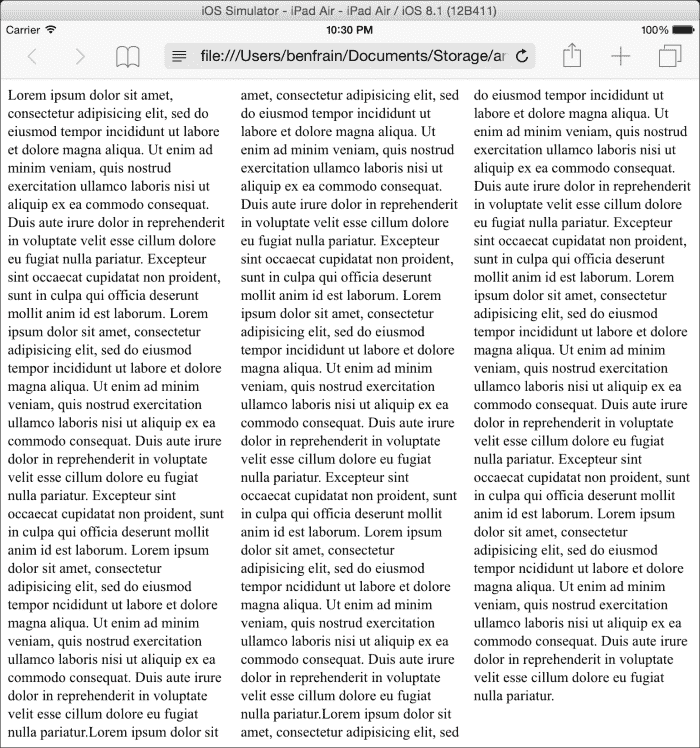

然后在 Chrome 桌面上（大约 1100px 宽的视口）：

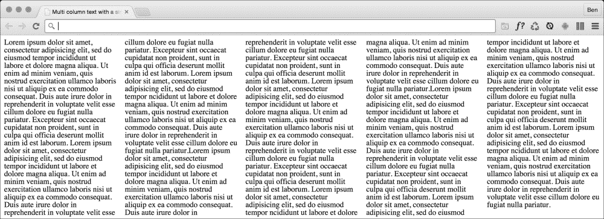

简单的响应式文本列，工作量最小；我喜欢它！

### 固定列，可变宽度

如果您更喜欢保持固定数量的列并改变宽度，可以编写以下规则：

```html
main {
  column-count: 4;
}
```

### 添加间隙和列分隔符

我们甚至可以进一步添加指定的列间隙和分隔符：

```html
main {
  column-gap: 2em;
  column-rule: thin dotted #999;
  column-width: 12em;
}
```

这给我们带来了以下结果：

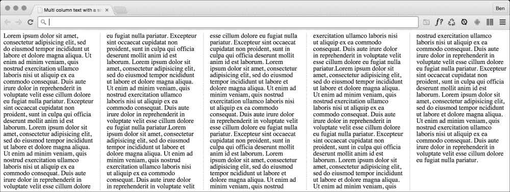

要阅读 CSS3 多列布局模块的规范，请访问[`www.w3.org/TR/css3-multicol/`](http://www.w3.org/TR/css3-multicol/)。

目前，尽管在 W3C 的 CR 状态，但您可能仍需要供应商前缀以获得最大的兼容性。

我对使用 CSS 多列的唯一警告是，对于较长的文本跨度，它可能导致用户体验不佳。在这些情况下，用户将不得不在页面上上下滚动以阅读文本的列，这可能有点繁琐。

# 自动换行

您有多少次不得不将一个大 URL 添加到一个小空间中，然后感到绝望？看一下[`rwd.education/code/example_05-04`](http://rwd.education/code/example_05-04)。问题也可以在以下屏幕截图中看到；请注意，URL 正在超出其分配的空间。

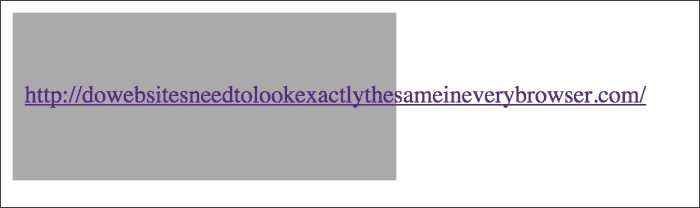

通过简单的 CSS3 声明很容易解决这个问题，碰巧的是，这也适用于 Internet Explorer 5.5 以前的旧版本！只需添加：

```html
word-wrap: break-word;
```

到包含元素，效果如下截图所示。

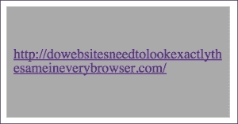

哇，长长的 URL 现在完美地换行了！

## 文本省略

文本截断过去是服务器端技术的专属领域。现在我们可以仅使用 CSS 进行文本省略/截断。让我们来考虑一下。

考虑这个标记（您可以在`rwd.education/code/ch5/example_05-03/`上在线查看此示例）：

```html
<p class="truncate">OK, listen up, I've figured out the key eternal happiness. All you need to do is eat lots of scones.</p>
```

但实际上我们希望将文本截断为 520px 宽。所以看起来像这样：

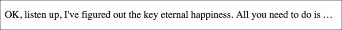

以下是使其发生的 CSS：

```html
.truncate {
  width: 520px;
  overflow: hidden;
  text-overflow: ellipsis;
  white-space: no-wrap;
}
```

### 提示

您可以在[`dev.w3.org/csswg/css-ui-3/`](http://dev.w3.org/csswg/css-ui-3/)上阅读有关`text-overflow`属性的规范。

每当内容的宽度超过定义的宽度时（如果它在一个灵活的容器内，宽度也可以设置为百分比，比如 100%），它将被截断。`white-space: no-wrap`属性/值对用于确保内容不会在周围的元素内换行。

## 创建水平滚动面板

希望您知道我是什么意思？水平滚动面板在 iTunes 商店和 Apple TV 上很常见，用于显示相关内容的面板（电影、专辑等）。当水平空间足够时，所有项目都是可见的。当空间有限时（考虑移动设备），面板可以从一侧滚动到另一侧。

滚动面板在现代 Android 和 iOS 设备上特别有效。如果您手头有一部现代 iOS 或 Android 设备，请在那上面看看下一个示例，同时在 Safari 或 Chrome 等桌面浏览器上查看：[`rwd.education/code/ch5/example_05-02/`](http://rwd.education/code/ch5/example_05-02/)。

我创建了一个 2014 年票房最高的电影的滚动面板。在 iPhone 上看起来是这样的：

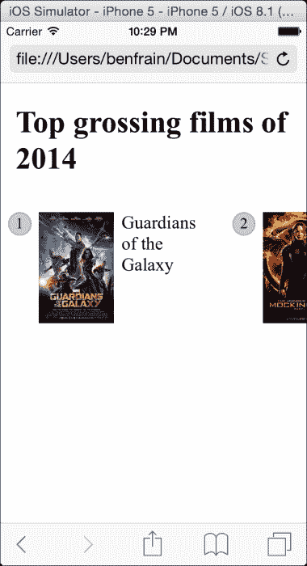

我其实有点作弊。这种技术的关键是`white-space`属性，它实际上自 CSS 2.1 以来就存在了（[`www.w3.org/TR/CSS2/text.html`](http://www.w3.org/TR/CSS2/text.html)）。然而，我打算将它与新的 Flexbox 布局机制一起使用，所以希望你不介意？

为了使这种技术起作用，我们只需要一个比其内容总和更窄的包装器，并在*x*轴上将其宽度设置为自动。这样，如果有足够的空间，它就不会滚动，但如果没有，它就会滚动。

```html
.Scroll_Wrapper {
  width: 100%;
  white-space: nowrap;
  overflow-x: auto;
  overflow-y: hidden;
}

.Item {
  display: inline-flex;
}
```

通过使用`white-space: nowrap`，我们在说'当找到空白字符时，不要换行这些元素'。然后为了保持所有内容在一行中，我们将该容器的所有第一个子元素设置为内联显示。我们在这里使用`inline-flex`，但它也可以很容易地是内联、`inline-block`或`inline-table`。

### 提示

**::before 和::after 伪元素**

如果查看示例代码，您会注意到`::before`伪元素用于显示项目的编号。如果使用伪元素，请记住`::before`或`::after`要显示，它们必须有内容值，即使只是空格。当这些伪元素被显示时，它们就会分别像该元素的第一个和最后一个子元素一样行为。

为了使事情看起来更美观，我将尽可能隐藏滚动条。不幸的是，这些是特定于浏览器的，所以您需要手动添加它们（自动添加器工具不会添加它们，因为它们是专有属性）。我还将为 WebKit 浏览器（通常是 iOS 设备）添加触摸样式惯性滚动。现在更新的`.Scroll_Wrapper`规则看起来像这样：

```html
.Scroll_Wrapper {
  width: 100%;
  white-space: nowrap;
  overflow-x: auto;
  overflow-y: hidden;
  /*Give us inertia style scrolling on WebKit based touch devices*/
  -webkit-overflow-scrolling: touch;
  /*Remove the scrollbars in supporting versions of IE*/
  -ms-overflow-style: none;
}

/*Stops the scrollbar appearing in WebKit browsers*/
.Scroll_Wrapper::-webkit-scrollbar {
  display: none;
}
```

当空间有限时，我们得到一个漂亮的可滚动水平面板。否则，内容就合适。

然而，这种模式有一些注意事项。首先，在撰写本文时，Firefox 没有允许隐藏滚动条的属性。其次，较旧的 Android 设备无法执行水平滚动（是的，真的）。因此，我倾向于通过特性检测来限定这种模式。我们将看看下面的工作原理。

# 在 CSS 中实现特性分支

当您构建响应式网页设计时，试图提供一个在每个设备上都能正常工作的单一设计，一个简单的事实是，您经常会遇到某些设备不支持的功能或技术。在这些情况下，您可能希望在您的 CSS 中创建一个分支；如果浏览器支持某个功能，则提供一段代码，如果不支持，则提供不同的代码。这是 JavaScript 中`if/else`或`switch`语句处理的情况。

我们目前有两种可能的方法。一种完全基于 CSS，但浏览器实现较少，另一种只能在 JavaScript 库的帮助下实现，但支持范围更广。让我们依次考虑每种方法。

## 特性查询

在 CSS 中分叉代码的本机解决方案是使用'Feature Queries'，这是 CSS 条件规则模块 3 级的一部分（[`www.w3.org/TR/css3-conditional/`](http://www.w3.org/TR/css3-conditional/)）。然而，目前，CSS 条件规则在 Internet Explorer（截至版本 11）和 Safari（包括 iOS 设备直到 iOS 8.1）中缺乏支持，因此支持几乎不普遍。

特性查询遵循与媒体查询类似的语法。考虑这个：

```html
@supports (flashing-sausages: lincolnshire) {
  body {
    sausage-sound: sizzling;
    sausage-color: slighty-burnt;
    background-color: brown;
  }
}
```

这里的样式只有在浏览器支持`flashing-sausages`属性时才会应用。我非常确信没有浏览器会支持`flashing-sausages`功能（如果他们支持，我希望得到充分的认可），因此`@supports`块内的样式将不会应用。

让我们考虑一个更实际的例子。如果浏览器支持 Flexbox，则使用 Flexbox，否则使用其他布局技术。考虑这个例子：

```html
@supports (display: flex) {
  .Item {
    display: inline-flex;
  }
}

@supports not (display: flex) {
  .Item {
    display: inline-block;
  }
}
```

在这里，我们为浏览器支持某个功能定义了一个代码块，为不支持该功能的情况定义了另一个代码块。如果浏览器支持`@supports`（是的，我意识到这很令人困惑），这种模式是可以的，但如果不支持，将不会应用任何这些样式。

如果您想覆盖不支持`@supports`的设备，最好先编写默认声明，然后在支持`@support`的声明之后编写特定的声明，这样如果支持`@support`存在，先前的规则将被覆盖，如果浏览器不支持`@support`，则将忽略`@support`块。因此，我们之前的示例可以重新设计为：

```html
.Item {
  display: inline-block;
}

@supports (display: flex) {
  .Item {
    display: inline-flex;
  }
}
```

## 组合条件

您还可以结合条件。假设我们只想在支持 Flexbox 和`pointer: coarse`的情况下应用一些规则（如果您错过了，我们在第二章中介绍了'pointer'交互媒体特性，*媒体查询-支持不同的视口*）。可能会是这样：

```html
@supports ((display: flex) and (pointer: coarse)) {
  .Item {
    display: inline-flex;
  }
}
```

这里我们使用了`and`关键字，但我们也可以使用`or`，或者用它来代替。例如，如果我们愿意在支持前两个属性/值组合或支持 3D 变换时应用样式：

```html
@supports ((display: flex) and (pointer: coarse)) or (transform: translate3d(0, 0, 0)) {
  .Item {
    display: inline-flex;
  }
}
```

请注意，在上一个示例中，额外的括号将灵活和指针条件与变换条件分开。

不幸的是，正如我之前提到的，对`@support`的支持远非普遍。哎呀！一个响应式网页设计师该怎么办？不要担心，有一个很棒的 JavaScript 工具完全能够应对这一挑战。

## Modernizr

在`@supports`在浏览器中得到更广泛实现之前，我们可以使用一个名为 Modernizr 的 JavaScript 工具。目前，这是促进代码分叉的最健壮的方式。

当在 CSS 中需要分叉时，我尝试采用渐进增强方法。渐进增强意味着从简单的可访问代码开始；至少为功能较弱的设备提供功能设计的代码。然后逐渐增强更强大的设备的代码。

### 提示

我们将在第十章中更详细地讨论渐进增强，*接近响应式网页设计*。

让我们看看如何使用 Modernizr 来促进渐进增强和分叉我们的 CSS 代码。

### 使用 Modernizr 进行特性检测

如果您是 Web 开发人员，很可能已经听说过 Modernizr，即使您可能尚未使用它。这是一个 JavaScript 库，您可以在页面中包含它来对浏览器进行特性测试。要开始使用 Modernizr，只需在页面的`head`部分包含指向下载文件的链接即可：

```html
<script src="img/modernizr-2.8.3-custom.min.js"></script>
```

有了这个，当浏览器加载页面时，任何包含的测试都会运行。如果浏览器通过了测试，Modernizr 会方便地（对我们的目的）向根 HTML 标签添加相关的类。

例如，Mondernizr 完成其任务后，页面的 HTML 标签上的类可能如下所示：

```html
<html class="js no-touch cssanimations csstransforms csstransforms3d csstransitions svg inlinesvg" lang="en">
```

在这种情况下，只测试了一些功能：动画，变换，SVG，内联 SVG 和对触摸的支持。有了这些类，代码可以被分叉，就像这样：

```html
.widget {
  height: 1rem;
}

.touch .widget {
  height: 2rem;
}
```

在上面的例子中，小部件项目通常只有 1rem 高，但如果 HTML 上存在触摸类（感谢 Modernizr），那么小部件将有 2rem 高。

我们也可以改变逻辑：

```html
.widget {
  height: 2rem;
}

.no-touch .widget {
  height: 1rem;
}
```

这样，我们将默认为项目高度为 2rem，并在出现`no-touch`类时调整高度。

无论您想如何构造结构，Modernizr 都提供了一种广泛支持的方式来分叉功能。当您想要使用`transform3d`等功能但仍为无法使用它的浏览器提供一个可用的替代品时，您会发现它特别有用。

### 提示

Modernizr 可以为您可能需要在其上分叉代码的大多数事物提供准确的测试，但并非所有事物都是如此。例如，溢出滚动通常很难进行准确测试。在设备类别不愉快的情况下，可能更有意义的是在不同的功能上分叉您的代码。例如，由于旧版 Android 版本难以进行水平滚动，您可能会使用`no-svg`进行分叉（因为 Android 2-2.3 也不支持 SVG）。

最后，您可能希望结合测试来创建自己的自定义测试。这有点超出了这里的范围，但如果这是您感兴趣的事情，请查看[`benfrain.com/combining-modernizr-tests-create-custom-convenience-forks/`](http://benfrain.com/combining-modernizr-tests-create-custom-convenience-forks/)。

# 新的 CSS3 选择器及其使用方法

CSS3 为在页面内选择元素提供了令人难以置信的能力。您可能认为这听起来并不那么花哨，但相信我，它会让您的生活变得更轻松，您会喜欢 CSS3 的！我最好对这个大胆的说法进行限定。

## CSS3 属性选择器

您可能已经使用 CSS 属性选择器创建规则。例如，考虑以下规则：

```html
img[alt] {
  border: 3px dashed #e15f5f;
}
```

这将针对标记中具有`alt`属性的任何图像标记。或者，假设我们想选择所有具有`data-sausage`属性的元素：

```html
[data-sausage] {
  /* styles */
}
```

您只需要在方括号中指定属性。

### 提示

`data-*`类型的属性是在 HTML5 中引入的，用于提供一个无法通过任何其他现有机制合理存储的自定义数据的位置。这些的规范描述可以在[`www.w3.org/TR/2010/WD-html5-20101019/elements.html`](http://www.w3.org/TR/2010/WD-html5-20101019/elements.html)找到。

您还可以通过指定属性值来缩小范围。例如，考虑以下规则：

```html
img[alt="sausages"] {
  /* Styles */
}
```

这将仅针对具有`alt`属性为`sausages`的图像。例如：

```html

```

到目前为止，这听起来像是“我们在 CSS2 中也可以做到这一点”。CSS3 给派对带来了什么？

## CSS3 子字符串匹配属性选择器

CSS3 让我们根据其属性选择器的子字符串选择元素。听起来很复杂。其实不是！这三个选项是属性是否：

+   以前缀开始

+   包含一个实例

+   以后缀结束

让我们看看它们是什么样子的。

### “以...开始”的子字符串匹配属性选择器

考虑以下标记：

```html


```

我们可以使用“以...开始”的子字符串匹配属性选择器来选择这两个图像，就像这样：

```html
img[alt^="film"] {
    /* Styles */
}
```

所有这些中的关键字符都是`^`符号（该符号称为**caret**，尽管它也经常被称为“帽子”符号），意思是“以...开始”。因为两个`alt`标签都以`film`开头，我们的选择器选择了它们。

### “包含一个实例”的子字符串匹配属性选择器

'包含一个实例'子字符串匹配属性选择器的语法如下：

```html
[attribute*="value"] {
  /* Styles */
}
```

与所有属性选择器一样，如果需要，您可以将它们与类型选择器（引用实际使用的 HTML 元素）结合使用，尽管个人认为只有在必要时才这样做（以防您想要更改所使用的元素类型）。

让我们来试一个例子。考虑这个标记：

```html
<p data-ingredients="scones cream jam">Will I get selected?</p>
We can select that element like this:
[data-ingredients*="cream"] {
  color: red;
}
```

所有这些中的关键字符是`*`符号，在这种情况下表示“包含”。

'以...开头'选择器在这个标记中不起作用，因为属性中的字符串并没有以'cream'开头。但它确实*包含* 'cream'，因此'包含一个实例'子字符串属性选择器找到了它。

### '以...结尾'子字符串匹配属性选择器

“以...结尾”子字符串匹配属性选择器的语法如下：

```html
[attribute$="value"] {
  /* Styles */
}
```

一个例子应该有所帮助。考虑这个标记：

```html
<p data-ingredients="scones cream jam">Will I get selected?</p>
<p data-ingredients="toast jam butter">Will I get selected?</p>
<p data-ingredients="jam toast butter">Will I get selected?</p>
```

假设我们只想选择`data-ingredients`属性中包含 scones、cream 和 jam 的元素（第一个元素）。我们不能使用'包含一个实例'（它会选择所有三个）或'以...开头'（它只会选择最后一个）子字符串属性选择器。但是，我们可以使用'以...结尾'子字符串属性选择器。

```html
[data-ingredients$="jam"] {
color: red;
}
```

所有这些中的关键字符是`$`（美元）符号，表示“以...结尾”。

## 属性选择的陷阱

属性选择中有一个需要理解的“陷阱”：属性被视为单个字符串。考虑这个 CSS 规则：

```html
[data-film^="film"] {
  color: red;
}
```

也许让你惊讶的是，它不会选择这个，即使属性中的一个单词以`film`开头：

```html
<span data-film="awful moulin-rouge film">Moulin Rouge is dreadful</span>
```

这是因为这里的`data-film`属性不是以`film`开头的，在这种情况下它是以 awful 开头的（如果你看过《红磨坊》，你会知道它一开始就很糟糕，而且永远不会好转）。

除了我们刚才看到的子字符串匹配选择器，还有几种解决方法。您可以使用空格分隔选择器（注意波浪线符号），它一直支持到 Internet Explorer 7：

```html
[data-film~="film"] {
  color: red;
}
```

您可以选择整个属性：

```html
[data-film="awful moulin-rouge film"] {
  color: red;
}
```

或者，如果您只想根据属性中的一些字符串的存在来进行选择，您可以连接一对（或者需要的数量）'包含一个实例'子字符串属性选择器：

```html
[data-film*="awful"][data-film*="moulin-rouge"] {
  color: red;
}
```

在这方面没有“正确”的做法，这实际上取决于您尝试选择的字符串的复杂性。

## 属性选择器允许您选择以数字开头的 ID 和类

在 HTML5 之前，以数字开头的 ID 或类名是无效的标记。HTML5 取消了这一限制。在涉及 ID 时，仍然有一些事情需要记住。ID 名称中不应该有空格，并且在页面上必须是唯一的。有关更多信息，请访问[`www.w3.org/html/wg/drafts/html/master/dom.html`](http://www.w3.org/html/wg/drafts/html/master/dom.html)。

尽管在 HTML5 中可以以数字开头命名 ID 和类值，但 CSS 仍限制您不能使用以数字开头的 ID 和类选择器（[`www.w3.org/TR/CSS21/syndata.html`](http://www.w3.org/TR/CSS21/syndata.html)）。

幸运的是，我们可以通过使用属性选择器轻松解决这个问题。例如，`[id="10"]`。

# CSS3 结构伪类

CSS3 使我们能够更有力地选择基于 DOM 结构的元素。

让我们考虑一个常见的设计处理；我们正在为较大的视口设计导航栏，并且希望除了最后一个链接之外的所有链接都在左侧。

从历史上看，我们需要通过向最后一个链接添加类名来解决这个问题，以便我们可以选择它，就像这样：

```html
<nav class="nav-Wrapper">
  <a href="/home" class="nav-Link">Home</a>
  <a href="/About" class="nav-Link">About</a>
  <a href="/Films" class="nav-Link">Films</a>
  <a href="/Forum" class="nav-Link">Forum</a>
  <a href="/Contact-Us" class="nav-Link nav-LinkLast">Contact Us</a>
</nav>
```

这本身可能会有问题。例如，有时，让内容管理系统向最后一个列表项添加类可能会非常困难。幸运的是，在这种情况下，这不再是一个问题。我们可以使用 CSS3 结构伪类来解决这个问题以及许多其他问题。

## :last-child 选择器

CSS 2.1 已经有了一个适用于列表中第一项的选择器：

```html
div:first-child {
  /* Styles */
}
```

然而，CSS3 添加了一个选择器，也可以匹配最后一个：

```html
div:last-child {
  /* Styles */
}
```

让我们看看那个选择器如何解决我们之前的问题：

```html
@media (min-width: 60rem) {
  .nav-Wrapper {
    display: flex;
  }
  .nav-Link:last-child {
    margin-left: auto;
  }
}
```

还有一些有用的选择器，用于当某物是唯一的项目时：`:only-child`和唯一的类型：`:only-of-type`。

## nth-child 选择器

`nth-child`选择器让我们解决更困难的问题。使用与之前相同的标记，让我们考虑一下 nth-child 选择器如何允许我们选择列表中的任何链接。

首先，选择每隔一个列表项怎么样？我们可以这样选择奇数项：

```html
.nav-Link:nth-child(odd) {
  /* Styles */
}
```

或者，如果您想选择偶数：

```html
.nav-Link:nth-child(even) {
  /* Styles */
}
```

## 理解 nth 规则的作用

对于初学者来说，基于 nth 的选择器可能看起来很吓人。然而，一旦你掌握了逻辑和语法，你会惊讶于你可以用它们做什么。让我们来看看。

CSS3 用几个基于 nth 的规则给了我们令人难以置信的灵活性：

+   `nth-child(n)`

+   `nth-last-child(n)`

+   `nth-of-type(n)`

+   `nth-last-of-type(n)`

我们已经看到在基于 nth 的表达式中可以使用（奇数）或（偶数）值，但（n）参数还可以以另外两种方式使用：

作为整数；例如，`:nth-child(2)`将选择第二个项目

作为数字表达式；例如，`:nth-child(3n+1)`将从 1 开始，然后选择每三个元素

整数属性很容易理解，只需输入您想要选择的元素编号。

选择器的数字表达式版本对于普通人来说可能有点令人困惑。如果数学对你来说很容易，我为这一部分道歉。对于其他人，让我们来分解一下。

### 分解数学

让我们考虑页面上的 10 个 span（您可以通过查看`example_05-05`来玩弄这些）：

```html
<span></span>
<span></span>
<span></span>
<span></span>
<span></span>
<span></span>
<span></span>
<span></span>
<span></span>
<span></span>
```

默认情况下，它们的样式将是这样的：

```html
span {
  height: 2rem;
  width: 2rem;
  background-color: blue;
  display: inline-block;
}
```

正如你所想象的，这给了我们一行中的 10 个方块：

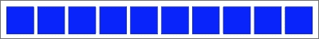

好吧，让我们看看如何使用基于 nth 的选择来选择不同的项目。

为了实用性，当考虑括号内的表达式时，我从右边开始。所以，例如，如果我想弄清楚(2n+3)会选择什么，我从最右边的数字开始（这里的三表示从左边数第三个项目），并且知道它将从那一点开始选择每第二个元素。因此添加这个规则：

```html
span:nth-child(2n+3) {
  color: #f90;
  border-radius: 50%;
}
```

在浏览器中的结果：

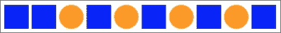

如您所见，我们的 nth 选择器目标是第三个列表项，然后是之后的每第二个列表项（如果有 100 个列表项，它将继续选择每第二个列表项）。

如何从第二个项目开始选择所有内容？虽然你可以写成`:nth-child(1n+2)`，但实际上你不需要第一个数字 1，因为除非另有说明，n 等于 1。因此，我们可以只写`:nth-child(n+2)`。同样，如果我们想选择每三个元素，而不是写成`:nth-child(3n+3)`，我们可以只写`:nth-child(3n)`，因为每三个项目都会从第三个项目开始，而不需要明确说明。表达式也可以使用负数，例如，`:nth-child(3n-2)`从-2 开始，然后选择每三个项目。

您还可以更改方向。默认情况下，一旦找到选择的第一部分，随后的选择将沿着 DOM 中的元素向下（因此在我们的示例中从左到右）。但是，您可以用减号来颠倒这一点。例如：

```html
span:nth-child(-2n+3) {
  background-color: #f90;
  border-radius: 50%;
}
```

这个例子再次找到第三个项目，然后沿着相反的方向选择每两个元素（在 DOM 树中向上，因此在我们的示例中从右到左）：


希望基于 nth 的表达式现在完全合乎逻辑了？

`nth-child`和`nth-last-child`的区别在于`nth-last-child`变体是从文档树的相反端起作用的。例如，`:nth-last-child(-n+3)`从末尾开始的 3 开始，然后选择其后的所有项目。这是浏览器中该规则给我们的内容：


最后，让我们考虑`：nth-of-type`和`：nth-last-of-type`。虽然前面的例子计算任何类型的子元素（始终记住`nth-child`选择器会选择同一 DOM 级别的所有子元素，而不管类），`：nth-of-type`和`：nth-last-of-type`让您可以具体指定要选择的项目类型。考虑以下标记（`example_05-06`）：

```html
<span class="span-class"></span>
<span class="span-class"></span>
<span class="span-class"></span>
<span class="span-class"></span>
<span class="span-class"></span>
<div class="span-class"></div>
<div class="span-class"></div>
<div class="span-class"></div>
<div class="span-class"></div>
<div class="span-class"></div>
```

如果我们使用了选择器：

```html
.span-class:nth-of-type(-2n+3) {
  background-color: #f90;
  border-radius: 50%;
}
```

尽管所有元素都具有相同的`span-class`，但实际上我们只会针对`span`元素（因为它们是首选类型）。这是被选中的内容：


我们将看到 CSS4 选择器如何解决这个问题。

### 提示

**CSS3 不像 JavaScript 和 jQuery 那样计数！**

如果您习惯使用 JavaScript 和 jQuery，您会知道它从 0 开始计数（基于零索引）。例如，如果在 JavaScript 或 jQuery 中选择元素，整数值 1 实际上是第二个元素。然而，CSS3 从 1 开始，因此值为 1 的是它匹配的第一个项目。

## 响应式网页设计中的基于 nth 的选择

最后，让我们考虑一个真实的响应式网页设计问题，以及我们如何使用基于 nth 的选择来解决它。

还记得`example_05-02`中的水平滚动面板吗？让我们考虑一下在水平滚动不可能的情况下它可能会是什么样子。因此，使用相同的标记，让我们将 2014 年票房前十的电影变成网格。对于某些视口，网格将只有两个项目宽，随着视口的增加，我们显示三个项目，并且在更大的尺寸上，我们仍然显示四个。然而，这里有一个问题。无论视口大小如何，我们都希望防止底部的任何项目具有底部边框。您可以在`example_05-09`中查看此代码。

这是四个宽项目的外观：

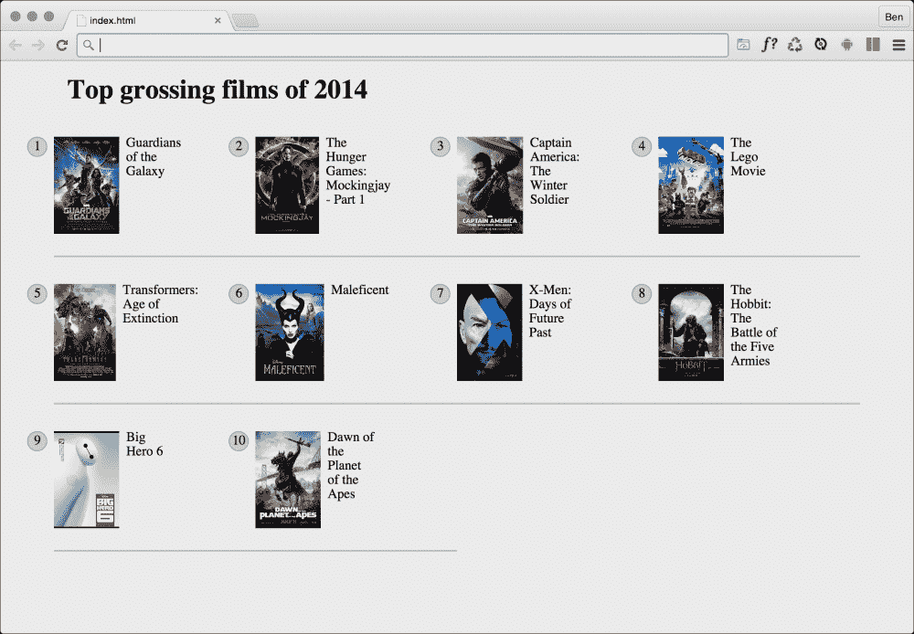

看到下面两个项目底部的烦人边框了吗？这就是我们需要移除的。但是，我希望有一个强大的解决方案，这样如果底部行还有另一个项目，边框也会被移除。现在，因为在不同的视口上每行的项目数量不同，我们还需要在不同的视口上更改基于 nth 的选择。为了简洁起见，我将向您展示匹配每行四个项目的选择（较大的视口）。您可以查看代码示例，以查看在不同视口上修改后的选择。

```html
@media (min-width: 55rem) {
  .Item {
    width: 25%; 
  }
  /*  Get me every fourth item and of those, only ones that are in the last four items */
  .Item:nth-child(4n+1):nth-last-child(-n+4),
  /* Now get me every one after that same collection too. */
  .Item:nth-child(4n+1):nth-last-child(-n+4) ~ .Item {
    border-bottom: 0;
  }
}
```

### 注意

您会注意到我们在链接基于 nth 的伪类选择器。重要的是要理解，第一个不会过滤下一个的选择，而是元素必须匹配每个选择。对于我们之前的例子，第一个元素必须是四个中的第一个项目，并且也必须是最后四个中的一个。

很好！由于基于 nth 的选择，我们有一套防御性规则，可以删除底部边框，而不管视口大小或我们显示的项目数量如何。

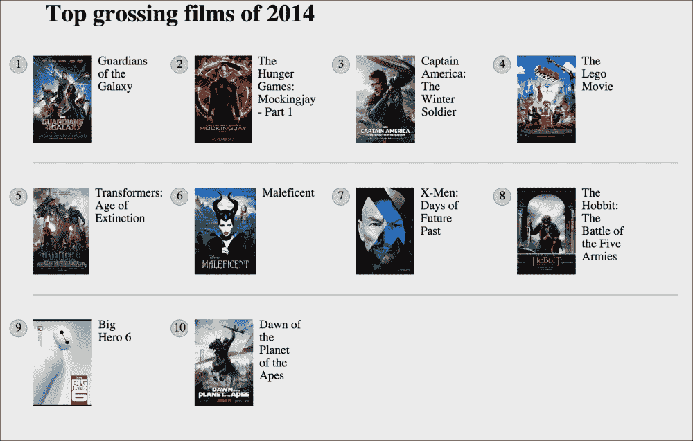

## 否定（:not）选择器

另一个方便的选择器是否定伪类选择器。这用于选择除其他东西之外的所有内容。考虑这个：

```html
<div class="a-div"></div>
<div class="a-div"></div>
<div class="a-div"></div>
<div class="a-div not-me"></div>
<div class="a-div"></div>
```

然后这些样式：

```html
div {
  display: inline-block;
  height: 2rem;
  width: 2rem;
  background-color: blue;
}

.a-div:not(.not-me) {
  background-color: orange;
  border-radius: 50%;
}
```

我们的最终规则将使具有`.a-div`类的每个元素变为橙色和圆形，但`div`也具有`.not-me`类除外。您可以在代码示例的`example_05-07`文件夹中找到该代码（请记住，您可以在[`rwd.education/`](http://rwd.education/)上找到所有代码示例）。

### 提示

到目前为止，我们主要看了所谓的结构伪类（关于这方面的完整信息可在[`www.w3.org/TR/selectors/`](http://www.w3.org/TR/selectors/)找到）。然而，CSS3 还有许多其他选择器。如果你正在开发一个 Web 应用程序，值得查看完整的 UI 元素状态伪类列表（[`www.w3.org/TR/selectors/`](http://www.w3.org/TR/selectors/)），因为它们可以帮助你根据某些东西是否被选中来定位规则。

## 空的(:empty)选择器

我遇到过这样的情况，我有一个元素，在里面包含一些填充，并且动态插入内容。有时它会有内容，有时没有。问题是，当它不包含内容时，我仍然看到填充。考虑一下`example_05-08`中的 HTML 和 CSS：

```html
<div class="thing"></div>
.thing {
  padding: 1rem;
  background-color: violet;
}
```

在那个`div`中没有任何内容，我仍然看到`background-color`。幸运的是，我们可以很容易地隐藏它，就像这样：

```html
.thing:empty {
  display: none;
}
```

然而，要小心`:empty`选择器。例如，你可能认为这是空的：

```html
<div class="thing"> </div>
```

不是！看看里面的空白。空白不是没有空间！

然而，要让事情更加混乱，要知道评论不会影响元素是否有空白或不。例如，这仍然被认为是空的：

```html
<div class="thing"><!--I'm empty, honest I am--></div>
```

### 提示

**伪元素的修正**

伪元素自 CSS2 以来就存在，但 CSS3 规范对它们的使用语法进行了非常轻微的修订。为了提醒你，直到现在，`p:first-line`会定位`<p>`标签中的第一行。或者`p:first-letter`会定位第一个字母。然而，CSS3 要求我们用双冒号来区分这些伪元素和伪类（比如`nth-child()`）。因此，我们应该写成`p::first-letter`。然而，需要注意的是，Internet Explorer 8 及更低版本不理解双冒号语法，它们只理解单冒号语法。

## 无论视口如何，都对`:first-line`做一些事情

关于`:first-line`伪元素，你可能会发现一个特别方便的地方是它是特定于视口的。例如，如果我们写下以下规则：

```html
p::first-line {
  color: #ff0cff;
}
```

正如你所期望的，第一行呈现为一种可怕的粉色。然而，在不同的视口上，它呈现为不同的文本选择。

因此，不需要改变标记，使用响应式设计，有一种方便的方法可以使文本的第一行（如浏览器呈现的，而不是在标记中显示的）与其他行不同。

# CSS 自定义属性和变量

由于 CSS 预处理器的流行，CSS 开始获得一些更多的“编程”特性。其中之一是自定义属性。它们更常被称为变量，尽管这不一定是它们唯一的用例。你可以在[`dev.w3.org/csswg/css-variables/`](http://dev.w3.org/csswg/css-variables/)找到完整的规范。需要警告的是，截至 2015 年初，浏览器实现还很少（只有 Firefox）。

CSS 自定义属性允许我们在样式表中存储信息，然后可以在该样式表中利用或者通过 JavaScript 进行操作。一个明显的用例是存储字体系列名称，然后引用它。以下是我们创建自定义属性的方法：

```html
:root {
  --MainFont: 'Helvetica Neue', Helvetica, Arial, sans-serif;
}
```

在这里，我们使用`:root`伪类将自定义属性存储在文档根中（尽管你可以将它们存储在任何你喜欢的规则中）。

### 提示

`:root`伪类总是引用文档结构中最顶层的父元素。在 HTML 文档中，这总是 HTML 标签，但对于 SVG 文档（我们在第七章中看到 SVG，*使用 SVG 实现分辨率独立性*），它将引用不同的元素。

自定义属性总是以两个破折号开始，然后是自定义名称，然后是它的结束，就像 CSS 中的其他属性一样；用一个冒号表示。

我们可以用`var()`符号引用该值。就像这样：

```html
.Title {
  font-family: var(--MainFont);
}
```

你显然可以以这种方式存储尽可能多的自定义属性。这种方法的主要好处是，你可以更改变量内的值，而每个使用该变量的规则都会得到新的值，而无需直接修改它们。

预计将来这些属性可能会被 JavaScript 解析和利用。关于这种疯狂的东西，你可能会对新的 CSS 扩展模块感兴趣：

[`dev.w3.org/csswg/css-extensions/`](http://dev.w3.org/csswg/css-extensions/)

# CSS calc

你有多少次试图编写布局并想到类似“它需要是父元素宽度的一半减去 10 像素”这样的东西？这在响应式网页设计中特别有用，因为我们永远不知道将查看我们网页的屏幕大小。幸运的是，CSS 现在有了一种方法来做到这一点。它被称为`calc()`函数。以下是 CSS 中的示例：

```html
.thing {
  width: calc(50% - 10px);
}
```

加法、减法、除法和乘法都受支持，因此可以解决以前无法使用 JavaScript 解决的一系列问题。

浏览器支持相当不错，但一个值得注意的例外是 Android 4.3 及以下版本。请阅读规范：[`www.w3.org/TR/css3-values/`](http://www.w3.org/TR/css3-values/)。

# CSS 4 级选择器

CSS 选择器 4 级（最新版本是 2014 年 12 月 14 日的编辑草案，[`dev.w3.org/csswg/selectors-4/`](http://dev.w3.org/csswg/selectors-4/)）中规定了许多新的选择器类型。然而，就在我写这篇文章的时候，浏览器中还没有它们的实现。因此，我们只看一个例子，因为它们可能会发生变化。

关系伪类选择器来自“逻辑组合”（[`dev.w3.org/csswg/selectors-4/`](http://dev.w3.org/csswg/selectors-4/)）部分的最新草案。

## :has 伪类

这个选择器采用这种格式：

```html
a:has(figcaption) {
  padding: 1rem;
}
```

如果`a`标签包含`figcaption`，这将为任何`a`标签添加填充。你也可以与否定伪类结合来反转选择：

```html
a:not(:has(figcaption)) {
  padding: 1rem;
}
```

如果`a`标签不包含`figcaption`元素，这将添加填充。

我要诚实地说，现在在这份草案中，并没有太多新的选择器让我感到兴奋。但谁知道他们在开始在浏览器中使用之前会想出什么呢？

## 响应式视口百分比长度（vmax、vmin、vh、vw）

现在我们改变一下方向。我们已经看过如何在响应式世界中选择项目。但是如何调整它们的大小呢？CSS 值和单位模块 3 级（[`www.w3.org/TR/css3-values/`](http://www.w3.org/TR/css3-values/)）引入了视口相关单位。这对于响应式网页设计非常有用，因为每个单位都是视口的百分比长度：

+   vw 单位（视口宽度）

+   vh 单位（视口高度）

+   vmin 单位（视口最小值；等于 vw 或 vh 中较小的一个）

+   vmax（视口最大值；等于 vw 或 vh 中较大的一个）

浏览器支持也不错（[`caniuse.com/`](http://caniuse.com/)）。

想要一个模态窗口，它的高度是浏览器高度的 90%？这很容易：

```html
.modal {
  height: 90vh;
}
```

### 提示

视口相关单位虽然很有用，但一些浏览器的实现方式很奇怪。例如，iOS 8 中的 Safari 在你从页面顶部滚动时会改变可视屏幕区域（它会缩小地址栏），但不会对报告的视口高度进行任何更改。

然而，当与字体结合时，也许可以找到更多这些单位的实用性。例如，现在可以轻松创建根据视口大小而调整大小的文本。

现在，我可以立即向你展示。但是，我想使用一个不同的字体，这样无论你是在 Windows、Mac 还是 Linux 上查看示例，我们都能看到相同的东西。

好吧，我要诚实地说，这是一个廉价的手段，让我记录一下我们如何在 CSS3 中使用 Web 字体。

# 网络排版

多年来，网络一直不得不使用一些无聊的“网络安全”字体。当设计中必不可少的一些花哨的排版时，有必要用图形元素替代它，并使用文本缩进规则将实际文本从视口中移开。哦，快乐！

在这一过程中，还有一些创新的方法可以在页面上添加花哨的排版。sIFR（[`www.mikeindustries.com/blog/sifr/`](http://www.mikeindustries.com/blog/sifr/)）和 Cufón（[`cufon.shoqolate.com/generate/`](http://cufon.shoqolate.com/generate/)）分别使用 Flash 和 JavaScript 重新制作文本元素，使其显示为它们原本打算的字体。幸运的是，CSS3 提供了一种现在已经准备好大放异彩的自定义网络排版的方法。

## @font-face CSS 规则

`@font-face` CSS 规则自 CSS2 以来就存在（但随后在 CSS 2.1 中消失了）。甚至 Internet Explorer 4 部分支持它（不是吗）！那么，当我们应该谈论 CSS3 时，它在这里做什么呢？

事实证明，`@font-face`被重新引入到了 CSS3 字体模块中（[`www.w3.org/TR/css3-fonts`](http://www.w3.org/TR/css3-fonts)）。由于在网络上使用字体的历史法律泥潭，直到最近几年，它才开始作为网络排版的事实解决方案而受到严重关注。

与网页上涉及资产的任何内容一样，没有单一的文件格式。就像图像可以是 JPG、PNG、GIF 和其他格式一样，字体也有自己的一套可供选择的格式。嵌入式开放类型（扩展名为`.eot`的文件）字体是 Internet Explorer（而不是其他任何人）的首选。其他人更喜欢更常见的 TrueType（`.ttf`文件扩展名），同时还有 SVG 和 Web 开放字体格式（`.woff` / `.woff2`扩展名）。

现在，需要为不同的浏览器实现提供相同字体的多个文件版本。

然而，好消息是为每个浏览器添加每种自定义字体格式很容易。让我们看看如何！

## 使用@font-face 实现网络字体

CSS 提供了一个`@font-face`“at-rule”来引用在线字体，然后可以用于显示文本。

现在有许多查看和获取网络字体的好资源，包括免费和付费的。我个人最喜欢免费字体的是 Font Squirrel（[`www.fontsquirrel.com/`](http://www.fontsquirrel.com/)），尽管谷歌也提供免费网络字体，最终使用`@font-face`规则提供（[`www.google.com/webfonts`](http://www.google.com/webfonts)）。还有来自 Typekit（[`www.typekit.com/`](http://www.typekit.com/)）和 Font Deck（[`www.fontdeck.com/`](http://www.fontdeck.com/)）的优秀付费服务。

在这个练习中，我将下载 Roboto。它是后来 Android 手机使用的字体，所以如果你有其中之一，它会很熟悉。否则，你只需要知道它是一种可爱的界面字体，设计用于在小屏幕上非常易读。你可以在[`www.fontsquirrel.com/fonts/roboto`](http://www.fontsquirrel.com/fonts/roboto)上自己获取它。

### 注意

如果可以下载特定于您打算使用的语言的字体的“子集”，请这样做。这意味着由于不包含您不打算使用的语言的字形，结果文件大小将小得多。

下载了`@font-face`套件后，打开 ZIP 文件，里面有不同 Roboto 字体的文件夹。我选择了 Roboto Regular 版本，在该文件夹中，字体以各种文件格式（WOFF、TTF、EOT 和 SVG）存在，还有一个包含字体堆栈的`stylesheet.css`文件。例如，Roboto Regular 的规则如下：

```html
@font-face {
    font-family: 'robotoregular';
    src: url('Roboto-Regular-webfont.eot');
    src: url('Roboto-Regular-webfont.eot?#iefix') format('embedded-opentype'),
         url('Roboto-Regular-webfont.woff') format('woff'),
         url('Roboto-Regular-webfont.ttf') format('truetype'),
         url('Roboto-Regular-webfont.svg#robotoregular') format('svg');
    font-weight: normal;
    font-style: normal;
}
```

就像供应商前缀的工作方式一样，浏览器将应用来自该属性列表的样式（如果适用，较低的属性优先），并忽略它不理解的样式。这样，无论使用什么浏览器，都应该有一个可以使用的字体。

现在，尽管这段代码对于复制和粘贴的粉丝来说非常棒，但重要的是要注意字体存储的路径。例如，我倾向于从 ZIP 文件中复制字体并将其存储在一个名为`fonts`的文件夹中，该文件夹与我的`css`文件夹处于同一级别。因此，由于我通常将这个字体堆栈规则复制到我的主样式表中，我需要修改路径。因此，我的规则变成了：

```html
@font-face {
    font-family: 'robotoregular';
    src: url('../fonts/Roboto-Regular-webfont.eot');
    src: url('../fonts/Roboto-Regular-webfont.eot?#iefix') format('embedded-opentype'),
         url('../fonts/Roboto-Regular-webfont.woff') format('woff'),
         url('../fonts/Roboto-Regular-webfont.ttf') format('truetype'),
         url('../fonts/Roboto-Regular-webfont.svg#robotoregular') format('svg');
    font-weight: normal;
    font-style: normal;
}
```

然后只需设置正确的字体和重量（如果需要）即可为相关的样式规则设置正确的字体。看看`example_05-10`，它与`example_05-09`的标记相同，我们只是将这个`font-family`声明为默认值：

```html
body {
  font-family: robotoregular;
}
```

网络字体的一个额外好处是，如果合成文件使用与代码中使用的相同字体，您可以直接从合成文件中插入大小。例如，如果 Photoshop 中的字体大小为 24px，我们可以直接插入该值，或者将其转换为更灵活的单位，如 REM（假设根字体大小为 16px，24/16=1.5rem）。

然而，正如我之前提到的，现在我们可以使用视口相对大小。我们可以在这里使用它们，以便根据视口空间的大小来调整文本的大小。

```html
body {
  font-family: robotoregular;
  font-size: 2.1vw;
}

@media (min-width: 45rem) {
  html,
  body {
    max-width: 50.75rem;
    font-size: 1.8vw;
  }
}

@media (min-width: 55rem) {
  html,
  body {
    max-width: 78.75rem;
    font-size: 1.7vw;
  }
}
```

如果您在浏览器中打开该示例并调整视口大小，您会看到只需几行 CSS，我们就可以使文本按照可用空间进行缩放。美妙！

## 关于自定义@font-face 排版和响应式设计的说明

网络排版的`@font-face`方法总体上非常好。在使用响应式设计技术时需要注意的唯一注意事项是字体文件的大小。例如，如果设备需要渲染我们示例的 Roboto Regular 的 SVG 字体格式，它需要额外获取 34 KB，而使用标准的网络安全字体（如 Arial）则不需要。我们在示例中使用了英文子集来减小文件大小，但这并不总是一个选项。如果您希望获得最佳的网站性能，请务必检查自定义字体的大小，并谨慎使用。

# 新的 CSS3 颜色格式和 alpha 透明度

到目前为止，在本章中，我们已经看到 CSS3 如何赋予我们新的选择能力，并使我们能够向设计中添加自定义排版。现在，我们将看看 CSS3 允许我们以前根本不可能的方式处理颜色的方法。

首先，CSS3 提供了两种声明颜色的新方法：RGB 和 HSL。此外，这两种格式使我们能够在它们旁边使用 alpha 通道（分别为 RGBA 和 HSLA）。

## RGB 颜色

**红色、绿色和蓝色**（**RGB**）是一个存在几十年的着色系统。它通过为颜色的红色、绿色和蓝色分量定义不同的值来工作。例如，红色可以在 CSS 中定义为十六进制值`#fe0208`：

```html
.redness {
  color: #fe0208;
}
```

### 提示

关于如何更直观地理解十六进制值的出色文章，我可以推荐 Smashing Magazine 上的这篇博文：[`www.smashingmagazine.com/2012/10/04/the-code-side-of-color/`](http://www.smashingmagazine.com/2012/10/04/the-code-side-of-color/)

然而，使用 CSS3，该颜色同样可以用 RGB 值来描述：

```html
.redness {
  color: rgb(254, 2, 8);
}
```

大多数图像编辑应用程序在其颜色选择器中以 HEX 和 RGB 值显示颜色。例如，Photoshop 的颜色选择器显示了 R、G 和 B 框，显示了每个通道的值。例如，R 值可能是 254，G 值为 2，B 值为 8。这很容易转换为 CSS 的`color`属性值。在 CSS 中，定义颜色模式（例如 RGB）后，红色、绿色和蓝色的值以逗号分隔的顺序放在括号内（就像我们在之前的代码中所做的那样）。

## HSL 颜色

除了 RGB，CSS3 还允许我们将颜色值声明为**色调、饱和度和亮度**（**HSL**）。

### 提示

**HSL 不同于 HSB！**

不要犯错误认为图像编辑应用程序（如 Photoshop）中的颜色选择器中显示的**色调、饱和度和亮度**（**HSB**）值与 HSL 相同-它并不相同！

HSL 如此令人愉快的原因在于，根据给定的值，很容易理解将表示的颜色。例如，除非你是某种颜色选择忍者，否则我敢打赌你无法立即告诉我 rgb(255, 51, 204)是什么颜色？没有人？我也不知道。然而，告诉我 hsl(315, 100％, 60％)的值，我可以猜测它在品红色和红色之间（实际上是一种节日粉色）。我怎么知道的？很简单。

HSL 基于 360°的色轮。它看起来像这样：

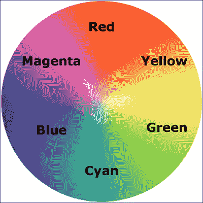

HSL 颜色定义中的第一个数字代表色调。从我们的色轮上可以看到，黄色在 60°，绿色在 120°，青色在 180°，蓝色在 240°，品红色在 300°，最后红色在 360°。因此，如上述 HSL 颜色的色调为 315，很容易知道它将在品红色（在 300°）和红色（在 360°）之间。

HSL 定义中的后两个值是饱和度和亮度，以百分比表示。这些只是改变基本色调。要获得更饱和或“色彩丰富”的外观，请在第二个值中使用更高的百分比。控制亮度的最终值可以在 0％至 100％之间变化，0％表示黑色，100％表示白色。

因此，一旦您将颜色定义为 HSL 值，仅通过改变饱和度和亮度百分比就可以轻松创建变化。例如，我们的红色可以用以下 HSL 值来定义：

```html
.redness {
  color: hsl(359, 99%, 50%);
}
```

如果我们想要制作稍暗一些的颜色，我们可以使用相同的 HSL 值，仅改变亮度（最终值）百分比值：

```html
.darker-red {
  color: hsl(359, 99%, 40%);
}
```

总之，如果你能记住“年轻人可以是混乱的顽童”（或者你想记住的任何其他助记符）的话，你就能大致写出 HSL 颜色值，而不需要使用取色器，并且还可以创建变化。在办公室派对上向 Ruby、Node 和.NET 的聪明人展示这个技巧，赢得一些快速的赞赏吧！

## Alpha 通道

到目前为止，你可能会想为什么我们要使用 HSL 或 RGB 而不是多年来一直在使用的可靠的 HEX 值。HSL 和 RGB 与 HEX 的不同之处在于它们允许使用 alpha 透明通道，因此元素下面的东西可以透过来。

HSLA 颜色声明在语法上类似于标准的 HSL 规则。但是，除此之外，您必须将值声明为`hsla`（而不仅仅是`hsl`），并添加一个额外的不透明度值，以十进制值表示，介于 0（完全透明）和 1（完全不透明）之间。例如：

```html
.redness-alpha {
  color: hsla(359, 99%, 50%, .5);
}
```

RGBA 语法遵循与 HSLA 等效项相同的约定：

```html
.redness-alpha-rgba {
  color: rgba(255, 255, 255, 0.8);
}
```

### 提示

**为什么不直接使用不透明度？**

CSS3 还允许使用 opacity 声明设置元素的不透明度。值在 0 和 1 之间以十进制增量设置（例如，设置为 0.1 的不透明度为 10％）。然而，这与 RGBA 和 HSLA 不同之处在于，在元素上设置不透明度值会影响整个元素。而使用 HSLA 或 RGBA 设置值与此同时允许元素的特定部分具有 alpha 层。例如，一个元素可以具有背景的 HSLA 值，但其中的文本为纯色。

## 使用 CSS 颜色模块 4 进行颜色操作

尽管在非常早期的规范阶段，但在不久的将来，通过使用`color()`函数在 CSS 中进行颜色操作应该是可能的。

在有广泛的浏览器支持之前，最好由 CSS 预处理器/后处理器来处理这种情况（给自己一个忠告，立即买一本关于这个主题的书；我推荐那位了不起的人 Ben Frain 的《面向设计师的 Sass 和 Compass》）。

您可以在[`dev.w3.org/csswg/css-color-4/`](http://dev.w3.org/csswg/css-color-4/)上关注 CSS 颜色模块 4 的进展。

# 总结

在本章中，我们已经学会了如何使用 CSS3 的新选择器轻松地选择几乎我们在页面上需要的任何东西。我们还看到了如何可以快速制作响应式的列和滚动面板，以解决常见且令人讨厌的问题，比如长 URL 换行。我们现在也了解了 CSS3 的新颜色模块，以及如何使用 RGB 和 HSL 应用颜色，包括透明的 alpha 层，以产生出色的美学效果。

在本章中，我们还学会了如何使用`@font-face`规则将网络排版添加到设计中，最终摆脱了单调的网络安全字体的束缚。尽管有了所有这些新特性和技术，我们只是触及了 CSS3 的潜力表面。让我们继续前进，看看 CSS3 如何通过文本阴影、盒子阴影、渐变和多重背景等方式，使响应式设计尽可能快速、高效和易于维护。
