# 第六章：使用 CSS3 创建令人惊叹的美学效果

CSS3 的美学特性在响应式设计中非常有用，因为使用 CSS3 可以在许多情况下替换图像。这可以节省时间，使您的代码更易维护和灵活，并且减少了最终用户的页面“重量”。即使在典型的固定宽度桌面设计中，这些好处也是有用的，但在响应式设计中更加重要，因为在这些情况下使用 CSS 可以轻松地在不同的视口上创建不同的美学效果。

在本章中，我们将涵盖：

+   如何使用 CSS3 创建文本阴影

+   如何使用 CSS3 创建框阴影

+   如何使用 CSS3 创建渐变背景

+   如何使用 CSS3 创建多个背景

+   使用 CSS3 背景渐变创建图案

+   如何使用媒体查询实现高分辨率背景图像

+   如何使用 CSS 滤镜（以及它们的性能影响）

让我们深入了解。

### 提示

**供应商前缀**

在实现实验性的 CSS 时，只需记住通过工具添加相关的供应商前缀，而不是手动添加。这可以确保最广泛的跨浏览器兼容性，并且也可以避免添加不再需要的前缀。在大多数章节中，我都提到了 Autoprefixer（[`github.com/postcss/autoprefixer`](https://github.com/postcss/autoprefixer)），因为在撰写本文时，我认为它是最好的工具。

# 使用 CSS3 创建文本阴影

CSS3 中最广泛实现的功能之一是`text-shadow`。与`@font-face`一样，它曾经存在过，但在 CSS 2.1 中被删除了。幸运的是，它现在又回来了，并得到了广泛支持（适用于所有现代浏览器和 Internet Explorer 9 及以上版本）。让我们来看一下基本的语法：

```html
.element {
    text-shadow: 1px 1px 1px #ccc;
}
```

请记住，简写规则中的值总是向右和向下排列（或者如果您喜欢，可以认为是顺时针）。因此，第一个值是阴影向右的量，第二个是向下的量，第三个值是模糊的量（阴影在消失之前移动的距离），最后一个值是颜色。

可以使用负值来实现左侧和上方的阴影。例如：

```html
.text {
    text-shadow: -4px -4px 0px #dad7d7;
}
```

颜色值不需要定义为十六进制值。它同样可以是 HSL(A)或 RGB(A)：

```html
text-shadow: 4px 4px 0px hsla(140, 3%, 26%, 0.4);
```

但请记住，浏览器必须同时支持 HSL/RGB 颜色模式和`text-shadow`才能呈现效果。

您还可以使用任何其他有效的 CSS 长度单位来设置阴影值，例如 em、rem、ch、rem 等。就个人而言，我很少使用 em 或 rem 单位来设置`text-shadow`值。因为这些值总是非常低，使用 1px 或 2px 通常在所有视口上看起来都不错。

由于媒体查询，我们还可以轻松地在不同的视口尺寸下移除文本阴影。关键在于 none 值：

```html
.text {
    text-shadow: .0625rem .0625rem 0 #bfbfbf;
}
@media (min-width: 30rem) {
    .text {
        text-shadow: none;
    }
}
```

### 提示

另外，值得知道的是，在 CSS 中，如果一个值以零开头，比如 0.14s，就不需要写前导零：.14s 和 0.14s 是完全相同的。

## 在不需要时省略模糊值

如果`text-shadow`不需要添加模糊，可以从声明中省略该值，例如：

```html
.text {
    text-shadow: -4px -4px #dad7d7;
}
```

这是完全有效的。如果没有声明第三个值，浏览器会假定前两个值是偏移量。

## 多个文本阴影

可以通过逗号分隔两个或多个阴影来添加多个文本阴影。例如：

```html
.multiple {
    text-shadow: 0px 1px #fff,4px 4px 0px #dad7d7;
}
```

此外，由于 CSS 对空白字符宽容，如果有助于可读性，您可以像这样布置值：

```html
.text { 
    font-size: calc(100vmax / 40); /* 100 of vh or vw, whichever is larger divided by 40 */
    text-shadow: 
    3px 3px #bbb, /* right and down */
    -3px -3px #999; /* left and up */
}
```

### 提示

您可以在[`www.w3.org/TR/css3-text/`](http://www.w3.org/TR/css3-text/)上阅读`text-shadow`属性的 W3C 规范。

# 框阴影

框阴影允许您在应用到元素的外部或内部创建一个框形阴影。一旦了解了文本阴影，框阴影就很简单了；基本上，它们遵循相同的语法：水平偏移、垂直偏移、模糊、扩展（我们稍后会讨论扩展），以及颜色。

只需要四个可能的长度值中的两个（在没有最后两个的情况下，颜色的值定义阴影颜色，模糊半径使用零值）。让我们看一个简单的例子：

```html
.shadow {
    box-shadow: 0px 3px 5px #444;
}
```

默认的 box-shadow 设置在元素的外部。另一个可选的关键字，inset，允许在元素内部应用 box-shadow。

## 内部阴影

box-shadow 属性也可以用来创建内部阴影。语法与普通的盒子阴影相同，只是值以关键字 inset 开头：

```html
.inset {
    box-shadow: inset 0 0 40px #000;
}
```

一切都像以前一样运作，但声明的`inset`部分指示浏览器在内部设置效果。如果你看 example_06-01，你会看到每种类型的例子：

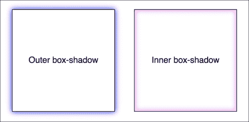

## 多个阴影

像 text-shadow 一样，您可以应用多个 box-shadow。用逗号分隔 box-shadow，它们按照从底部到顶部（最后到第一个）的顺序应用，如它们在列表中列出的那样。通过想到规则（在代码中）中最接近顶部的声明在浏览器中显示时出现在顺序的“顶部”，来提醒自己顺序。与 text-shadow 一样，您可能会发现使用空格在视觉上堆叠不同的 box-shadow 很有用：

```html
box-shadow: inset 0 0 30px hsl(0, 0%, 0%), 
            inset 0 0 70px hsla(0, 97%, 53%, 1);
```

### 提示

在代码中堆叠更长的、多个值，一个在另一个下面，当使用版本控制系统时有一个额外的好处；它使得在“diff”两个文件版本时更容易发现差异。这就是我将选择器组堆叠在一起的主要原因。

## 理解扩展

说实话，多年来我并没有真正理解 box-shadow 的扩展值到底是做什么的。我认为“扩展”这个名字并不有用。把它想象成一个偏移更有帮助。让我解释一下。

看看 example_06-02 中左边的盒子。这是应用了标准的 box-shadow。右边的盒子应用了负的扩展值。它是用第四个值设置的。这是相关的代码：

```html
.no-spread {
  box-shadow: 0 10px 10px;
}

.spread {
  box-shadow: 0 10px 10px -10px;
}
```

这是每个效果（右边带有扩展值的元素）：

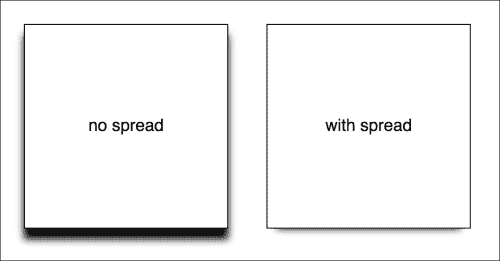

扩展值允许您按指定的数量在所有方向上扩展或收缩阴影。在这个例子中，负值将阴影向后拉。结果是我们只在底部看到阴影，而不是在所有方向看到模糊“泄漏”出来（因为负的扩展值正在抵消模糊）。

### 注意

您可以在[`www.w3.org/TR/css3-background/`](http://www.w3.org/TR/css3-background/)阅读 box-shadow 属性的 W3C 规范。

# 背景渐变

过去的日子里，要在元素上实现背景渐变，需要平铺一个薄的渐变图形切片。作为图形资源，这是一个相当经济的权衡。一张只有一两个像素宽的图像不会耗尽带宽，在单个站点上可以用于多个元素。

然而，如果我们需要调整渐变，仍然需要往返到图形编辑器。而且，偶尔，内容可能会“突破”渐变背景，超出图像的固定大小限制。这个问题在响应式设计中更加严重，因为页面的部分可能在不同的视口上增加。

然而，使用 CSS 背景图像渐变，事情要灵活得多。作为 CSS 图像值和替换内容模块 3 级的一部分，CSS 使我们能够创建线性和径向背景渐变。让我们看看如何定义它们。

### 提示

CSS 图像值和替换内容模块 3 级的规范可以在[`www.w3.org/TR/css3-images/`](http://www.w3.org/TR/css3-images/)找到。

## 线性渐变符号

线性渐变符号，在其最简单的形式中，看起来像这样：

```html
.linear-gradient {
    background: linear-gradient(red, blue); 
}
```

这将创建一个线性渐变，从红色开始（默认从顶部开始）到蓝色。

### 指定渐变方向

现在，如果您想为梯度指定一个方向，有几种方法。梯度将始终从您发送它的相反方向开始。但是，当没有设置方向时，梯度将始终默认为从上到下的方向。例如：

```html
.linear-gradient {
    background: linear-gradient(to top right, red, blue); 
}
```

在这种情况下，梯度朝右上方。它从左下角开始是红色，逐渐变为右上角的蓝色。

如果你更喜欢数学，你可能会认为写梯度会像这样：

```html
.linear-gradient {
    background: linear-gradient(45deg, red, blue); 
}
```

但是，请记住，在矩形框上，一个梯度向'右上方'（始终是应用于的元素的右上方）的梯度将以与`45deg`（始终是从其起始点开始的 45 度）略有不同的位置结束。

值得知道的是，您还可以在盒子内部可见之前开始梯度。例如：

```html
.linear-gradient {
    background: linear-gradient(red -50%, blue); 
}
```

这将呈现一个梯度，就好像它在盒子内部甚至在可见之前就开始了。

实际上，在上一个例子中，我们使用了一个颜色停止来定义颜色应该开始和结束的位置，所以让我们更全面地看一下。

### 颜色停止

背景梯度最方便的地方可能是颜色停止。它们提供了在梯度中设置哪种颜色在哪一点使用的方法。使用颜色停止，您可以指定您可能需要的复杂性。考虑这个例子：

```html
.linear-gradient {
  margin: 1rem;  
  width: 400px;
  height: 200px;
  background: linear-gradient(#f90 0, #f90 2%, #555 2%, #eee 50%, #555 98%, #f90 98%, #f90 100%);
}
```

这是`linear-gradient`的呈现方式：

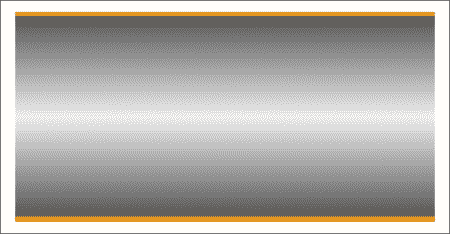

在这个例子（`example_06-03`）中，没有指定方向，因此默认的从上到下的方向适用。

梯度内的颜色停止以逗号分隔，并通过给出首先颜色，然后停止的位置来定义。通常建议不要在一个符号中混合使用单位，但您可以。您可以拥有尽可能多的颜色停止，并且颜色可以写为关键字、HEX、RGBA 或 HSLA 值。

### 提示

请注意，多年来已经有许多不同的背景梯度语法，因此这是一个特别难以手工编写回退的领域。冒着听起来像是一张破碎的唱片的风险（孩子们，如果你不知道'唱片'是什么，请问爸爸妈妈），使用诸如 Autoprefixer 之类的工具可以让您的生活更轻松。这样，您可以编写当前的 W3C 标准语法（如前面详细介绍的）并自动为您创建之前的版本。

阅读 W3C 规范，了解线性背景梯度[`www.w3.org/TR/css3-images/`](http://www.w3.org/TR/css3-images/)。

### 为旧版浏览器添加回退

作为旧版浏览器的简单回退，只需首先定义一个纯色背景。这样，旧版浏览器将至少在不理解后面定义的梯度时呈现一个纯色背景。例如：

```html
.thing {
  background: red;
  background: linear-gradient(45deg, red, blue); 
}
```

## 径向背景梯度

在 CSS 中创建径向梯度同样简单。这些通常从一个中心点开始，并以椭圆或圆形平滑地扩展开来。

这是径向背景梯度的语法（您可以在`example_06-04`中进行操作）：

```html
.radial-gradient {  
    margin: 1rem;
    width: 400px;
    height: 200px;
    background: radial-gradient(12rem circle at bottom,  yellow, orange, red);
}
```

### 径向梯度语法的分解

在指定属性（`background:`）之后，我们开始`radial-gradient`符号。首先，在第一个逗号之前，我们定义梯度的形状或大小和位置。我们上面使用了 12rem 圆形来定义形状和大小，但考虑一些其他例子：

+   `5em`将是一个尺寸为 5em 的圆。如果只给出尺寸，可以省略'circle'部分。

+   `circle`将是容器的完整尺寸的圆形（如果省略，则径向梯度的大小默认为'最远的角' - 关于尺寸关键字的更多信息）

+   `40px 30px`将是一个椭圆，就像在一个 40px 宽，30px 高的框内绘制一样

+   `ellipse`将创建一个椭圆形状，适合元素内

接下来，在尺寸和/或形状之后，我们定义位置。默认位置是中心，但让我们看看其他可能性以及它们如何定义：

+   **在右上方** 从右上方开始径向渐变

+   **在右侧 100px 顶部 20px** 从右侧边缘 100px 和顶部边缘 20px 开始渐变

+   **在左侧中心** 从元素的左侧中间开始

我们以逗号结束我们的大小、形状和位置 '参数'，然后定义任何颜色停止；它们的工作方式与 `linear-gradient` 完全相同。

为了简化表示：在第一个逗号之前是大小、形状和位置，然后在其后是尽可能多的颜色停止（每个停止之间用逗号分隔）。

## 响应式尺寸的方便 'extent' 关键字

对于响应式工作，您可能会发现按比例调整渐变的大小比使用固定像素尺寸更有优势。这样，当元素的大小发生变化时，您就知道自己已经覆盖到了（从字面上和比喻上）。有一些方便的尺寸关键字可以应用于渐变。您可以像这样写它们，而不是使用任何尺寸值：

```html
background: radial-gradient(closest-side circle at center, #333, blue);
```

以下是它们各自的作用：

+   `closest-side`: 形状与盒子最靠近中心的边相遇（对于圆形），或者与最靠近中心的水平和垂直边相遇（对于椭圆）。

+   `closest-corner`: 形状与盒子的最近角完全相遇

+   `farthest-side`: 与 `closest-side` 相反，不是形状与最近的边相遇，而是大小与离其中心最远的边相遇（或在椭圆的情况下，与最远的垂直和水平边相遇）。

+   `farthest-corner`: 形状扩展到盒子的中心到最远角

+   `cover`: 与 `farthest-corner` 相同

+   `contain`: 与 `closest-side` 相同

阅读 W3C 规范，了解径向背景渐变 [`www.w3.org/TR/css3-images/`](http://www.w3.org/TR/css3-images/)。

### 提示

**完美的 CSS3 线性和径向渐变的快捷方法**

如果手动定义渐变看起来很费力，那么有一些很棒的在线渐变生成器。我个人最喜欢的是 [`www.colorzilla.com/gradient-editor/`](http://www.colorzilla.com/gradient-editor/)。它使用图形编辑器风格的 GUI，允许您选择颜色、停止、渐变样式（支持线性和径向渐变），甚至是您想要最终渐变的颜色空间（HEX、RGB(A)、HSL(A)）。还有很多预设的渐变可用作起点。如果这还不够，它甚至为您提供了可选的代码，用于修复 Internet Explorer 9 以显示渐变和为旧版浏览器提供备用的纯色。还不确定？那么您是否能够根据现有图像中的渐变值生成 CSS 渐变？我想这可能会说服您。

# 重复渐变

CSS3 还赋予了我们创建重复背景渐变的能力。让我们看看它是如何完成的：

```html
.repeating-radial-gradient {
    background: repeating-radial-gradient(black 0px, orange 5px, red 10px);
}
```

这就是它的样子（不要看太久，可能会引起恶心）：

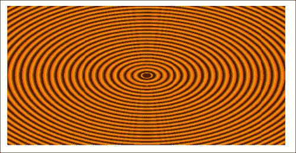

首先，用重复前缀 `linear-gradient` 或 `radial-gradient`，然后它遵循与正常渐变相同的语法。在这里，我使用了黑色、橙色和红色之间的像素距离（分别为 0px、5px 和 10px），但您也可以选择使用百分比。为了获得最佳效果，建议在渐变中使用相同的测量单位（如像素或百分比）。

### 注意

阅读 W3C 关于重复渐变的信息 [`www.w3.org/TR/css3-images/`](http://www.w3.org/TR/css3-images/)。

还有一种使用背景渐变的方法我想和你分享。

# 背景渐变图案

尽管我经常在设计中使用微妙的线性渐变，但对于径向渐变和重复渐变的实际用途较少。然而，聪明的人们已经利用渐变的力量来创建背景渐变图案。让我们看一个来自 CSS 忍者 Lea Verou 的 CSS3 背景图案集合的例子，可在[`lea.verou.me/css3patterns/`](http://lea.verou.me/css3patterns/)上找到。

```html
.carbon-fibre {
    margin: 1rem;  
    width: 400px;
    height: 200px;
    background:
    radial-gradient(black 15%, transparent 16%) 0 0,
    radial-gradient(black 15%, transparent 16%) 8px 8px,
    radial-gradient(rgba(255,255,255,.1) 15%, transparent 20%) 0 1px,
    radial-gradient(rgba(255,255,255,.1) 15%, transparent 20%) 8px 9px;
    background-color:#282828;
    background-size:16px 16px;
}
```

这是在浏览器中得到的效果，一个`carbon-fibre`背景效果：

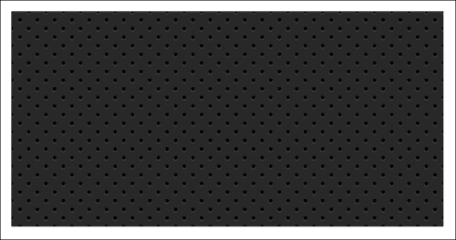

怎么样？只需几行 CSS3 代码，我们就有了一个易于编辑、响应式和可伸缩的背景图案。

### 提示

您可能会发现在规则的末尾添加`background-repeat: no-repeat`会更好地理解它的工作原理。

与往常一样，借助媒体查询，可以针对不同的响应式场景使用不同的声明。例如，尽管渐变图案在较小的视口上可能效果很好，但在较大的视口上最好使用纯色背景：

```html
@media (min-width: 45rem) {
    .carbon-fibre {
        background: #333;
    }
}
```

您可以在`example_06-05`中查看此示例。

# 多重背景图像

尽管现在有点过时，但过去构建页面时通常需要在页面顶部和底部使用不同的背景图像，或者在页面内的内容部分使用不同的背景图像。在 CSS2.1 时代，通常需要额外的标记（一个用于页眉背景，另一个用于页脚背景）来实现这种效果。

使用 CSS3，您可以在元素上堆叠尽可能多的背景图像。

以下是语法：

```html
.bg {
    background: 
        url('../img/1.png'),
        url('../img/2.png'),
        url('../img/3.png');
}
```

与多个阴影的堆叠顺序一样，首先列出的图像在浏览器中最靠近顶部。如果愿意，您还可以在同一声明中添加背景的一般颜色，如下所示：

```html
.bg {
    background: 
    url('../img/1.png'),
    url('../img/2.png'),
    url('../img/3.png') left bottom, black;
}
```

最后指定颜色，这将显示在上面指定的每个图像下面。

### 提示

在指定多个背景元素时，您不必将不同的图像堆叠在不同的行上；我只是发现这种写法更容易阅读代码。

不理解多重背景规则的浏览器（如 Internet Explorer 8 及更低版本）将完全忽略该规则，因此您可能希望在 CSS3 多重背景规则之前立即声明一个“正常”的背景属性，作为非常老的浏览器的后备。

使用多个背景图像时，只要使用带有透明度的 PNG 文件，任何部分透明的背景图像都会显示在另一个背景图像下面。但是，背景图像不必彼此叠放，也不必都是相同的尺寸。

## 背景大小

要为每个图像设置不同的尺寸，请使用`background-size`属性。当使用多个图像时，语法如下：

```html
.bg {
    background-size: 100% 50%, 300px 400px, auto;
}
```

每个图像的尺寸值（首先是宽度，然后是高度）都是按照在背景属性中列出的顺序，用逗号分隔声明的。与上面的示例一样，您可以在每个图像旁边使用百分比或像素值，以及以下内容：

+   `auto`：将元素设置为其本机大小

+   `cover`：将图像扩展，保持其纵横比，以覆盖元素的区域

+   `contain`：将图像扩展到元素内适应其最长的一侧，同时保持纵横比

## 背景位置

如果您有不同尺寸的不同背景图像，接下来您会希望能够以不同的方式定位它们。幸运的是，`background-position`属性也可以实现这一点。

让我们将所有这些背景图像功能与我们在之前章节中看到的一些响应式单位放在一起。

让我们创建一个简单的太空场景，由一个单一元素和三个背景图像组成，设置为三种不同的尺寸，并以三种不同的方式定位：

```html
.bg-multi {
    height: 100vh;
    width: 100vw;
    background:
        url('rosetta.png'), 
        url('moon.png'),
        url('stars.jpg');
    background-size: 75vmax, 50vw, cover;
    background-position: top 50px right 80px, 40px 40px, top center;
    background-repeat: no-repeat;
}
```

您将在浏览器中看到类似于这样的东西：

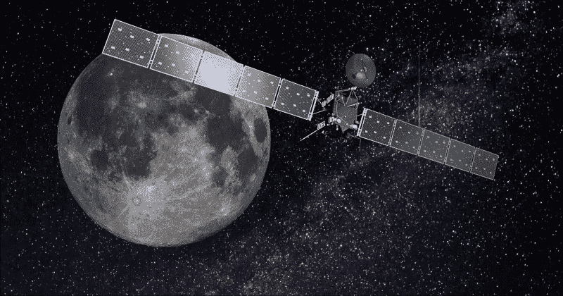

我们在底部有星星图片，然后是顶部的月亮，最后是顶部的罗塞塔空间探测器的图片。您可以在`example_06-06`中自行查看。请注意，如果调整浏览器窗口，响应式长度单位（`vmax`，`vh`和`vw`）可以很好地工作，并保持比例，而基于像素的单位则不行。

### 注意

如果没有声明`background-position`，则会应用默认位置为左上角。

## 背景简写

有一种简写方法可以将不同的背景属性组合在一起。您可以在[`www.w3.org/TR/css3-background/`](http://www.w3.org/TR/css3-background/)的规范中阅读它。然而，到目前为止，我的经验是它会产生不稳定的结果。因此，我建议使用长格式方法，先声明多个图像，然后是大小，然后是位置。

### 注意

阅读 W3C 关于多个背景元素的文档，网址为[`www.w3.org/TR/css3-background/`](http://www.w3.org/TR/css3-background/)。

# 高分辨率背景图片

由于媒体查询，我们可以加载不同的背景图片，不仅在不同的视口大小，还在不同的视口分辨率下。

例如，这是为'普通'和高 DPI 屏幕指定背景图片的官方方式。您可以在`example_06-07`中找到这个：

```html
.bg {
    background-image: url('bg.jpg');
}
@media (min-resolution: 1.5dppx) {
    .bg {
        background-image: url('bg@1_5x.jpg');
    }
}
```

媒体查询的编写方式与宽度、高度或其他能力测试一样。在这个例子中，我们定义了`bg@1_5x.jpg`应该使用的最小分辨率为 1.5dppx（每个 CSS 像素的设备像素）。如果需要的话，我们也可以使用**dpi**（每英寸点数）或**dpcm**（每厘米点数）单位。然而，尽管支持较差，我发现 dppx 是最容易理解的单位；因为 2dppx 是两倍的分辨率，3dppx 将是三倍的分辨率。在 dpi 中考虑这一点就比较棘手。'标准'分辨率将是 96dpi，两倍分辨率将是 192dpi，依此类推。

目前对于'dppx'单位的支持并不是很好（在[`caniuse.com/`](http://caniuse.com/)上检查您的目标浏览器），因此为了使其在各处都能平稳运行，您需要编写几个版本的媒体查询分辨率，或者像往常一样，依赖工具来为您添加前缀。

### 提示

**关于性能的简短说明**

只需记住，大图像可能会减慢您网站的速度，并导致用户体验不佳。虽然背景图片不会阻止页面的渲染（在等待背景图片时，您仍然会看到页面的其余部分被绘制到页面上），但它会增加页面的总重量，这对于用户支付数据来说很重要。

# CSS 滤镜

`box-shadow`存在一个明显的问题。正如其名称所暗示的那样，它仅限于应用于元素的矩形 CSS 框形状。这是一个使用 CSS 制作的三角形形状的屏幕截图（您可以在`example_06-08`中查看代码），应用了一个框阴影：

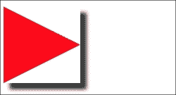

并不完全是我所希望的。幸运的是，我们可以通过 CSS 滤镜来解决这个问题，这是 Filter Effects Module Level 1 的一部分（[`www.w3.org/TR/filter-effects/`](http://www.w3.org/TR/filter-effects/)）。它们的支持并不像`box-shadow`那样广泛，但在渐进增强的方法中效果很好。如果浏览器不理解如何处理滤镜，它就会简单地忽略它。对于支持滤镜的浏览器，这些花哨的效果会被渲染出来。

这是相同的元素，应用了 CSS `drop-shadow`滤镜，而不是`box-shadow`：

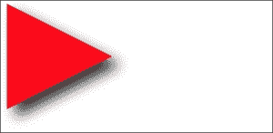

以下是 CSS 滤镜的格式：

```html
.filter-drop-shadow {
    filter: drop-shadow(8px 8px 6px #333);
}
```

在`filter`属性之后，我们指定要使用的滤镜，在这个例子中是`drop-shadow`，然后传入滤镜的参数。`drop-shadow`遵循与`box-shadow`类似的语法，因此这很容易；x 和 y 偏移量，模糊度，然后是扩散半径（都是可选的），最后是颜色（同样是可选的，尽管我建议为了一致性而指定颜色）。

### 提示

CSS 滤镜实际上是基于具有更广泛支持的 SVG 滤镜的。我们将在第七章中看到基于 SVG 的等效物，*使用 SVG 实现分辨率独立性*。

## 可用的 CSS 滤镜

有几个滤镜可供选择。我们将逐一查看。虽然大多数滤镜的图像随后会出现，但阅读本书的读者（使用单色图像的硬拷贝）可能会难以注意到差异。如果你处于这种情况，请记住你仍然可以通过打开`example_06-08`在浏览器中查看各种滤镜。我现在将列出每一个适当的值。正如你所想象的那样，更多的值意味着更多的滤镜应用。在使用图像的地方，相关代码之后会显示图像。

+   `filter: url ('./img/filters.svg#filterRed')`: 让你指定要使用的 SVG 滤镜。

+   `filter: blur(3px)`: 使用单个长度值（但不是百分比）。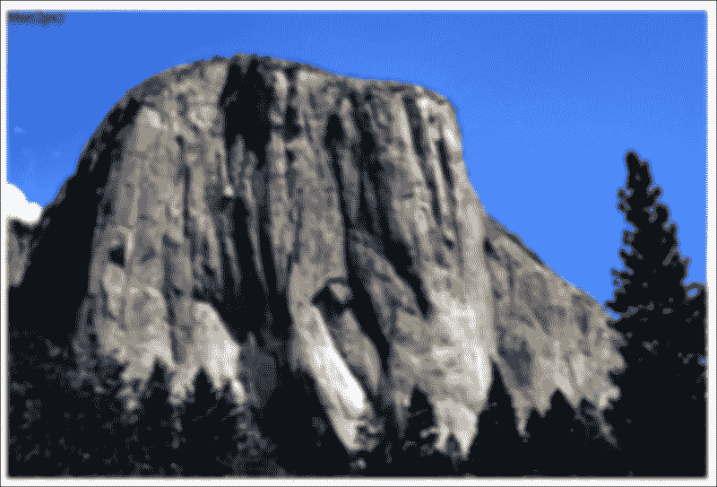

+   `filter: brightness(2)`: 使用从 0 到 1 或 0%到 100%的值。0/0%是黑色，1/100%是'正常'，而任何超过这个值的都会使元素更亮。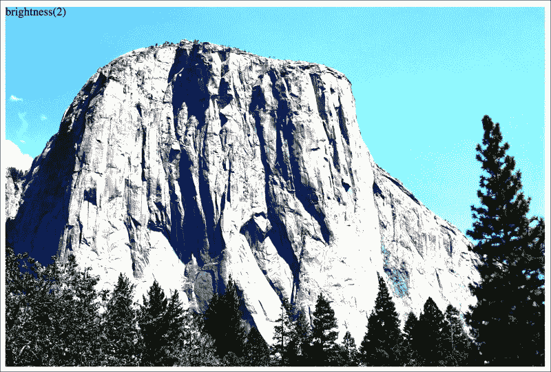

+   `filter: contrast(2)`: 使用从 0 到 1 或 0%到 100%的值。0/0%是黑色，1/100%是'正常'，而任何超过这个值的都会提高颜色对比度。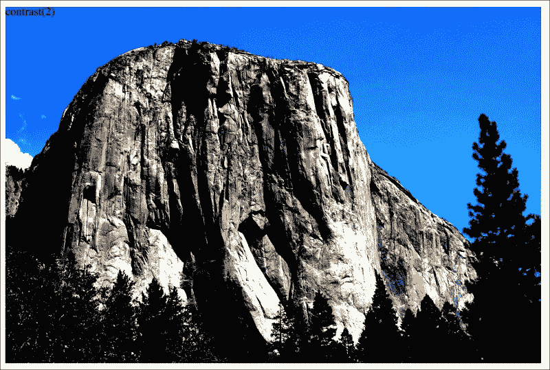

+   `filter: drop-shadow(4px 4px 6px #333)`: 我们之前详细讨论过`drop-shadow`。

+   `filter: grayscale(.8)`: 使用从 0 到 1 的值，或者 0%到 100%的值来对元素应用不同程度的灰度。0 的值将没有灰度，而 1 的值将完全是灰度。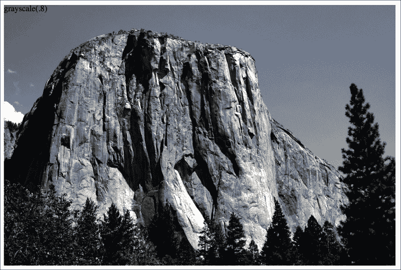

+   `filter: hue-rotate(25deg)`: 使用从 0 到 360 度的值来调整颜色在色轮周围的颜色。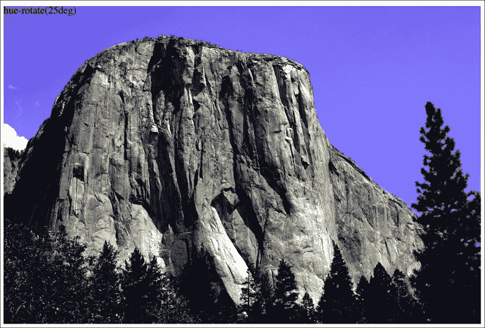

+   `filter: invert(75%)`: 使用从 0 到 1 的值，或者 0%到 100%的值来定义元素颜色反转的程度。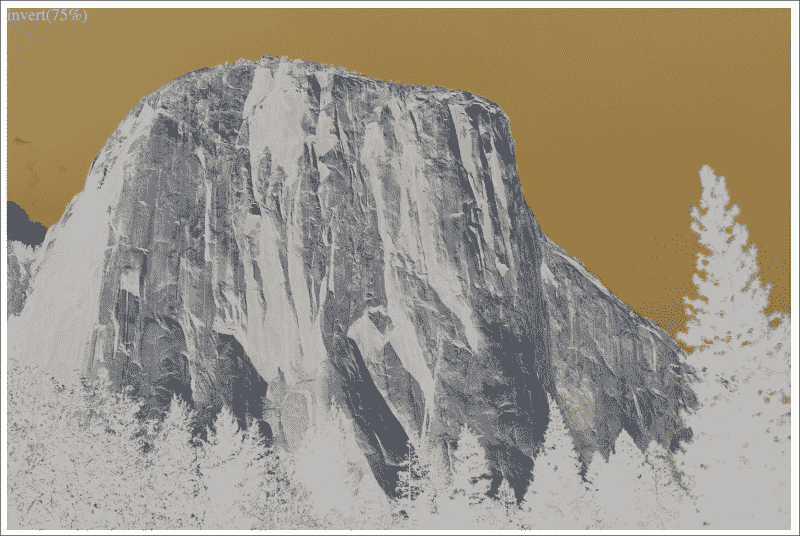

+   `filter: opacity(50%)`: 使用从 0 到 1 的值，或者 0%到 100%的值来改变元素的不透明度。这类似于你已经熟悉的`不透明度`属性。然而，正如我们将看到的那样，滤镜可以组合，这允许不透明度与其他滤镜一起组合。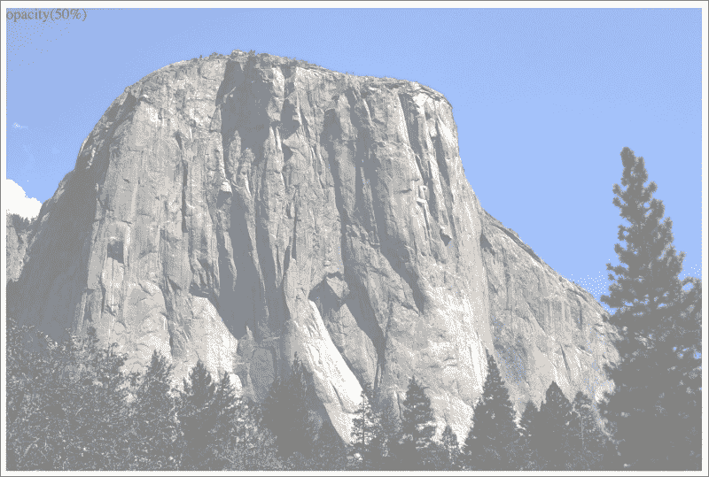

+   `filter: saturate(15%)`: 使用从 0 到 1 的值，或者 0%到 100%的值来去饱和图像，超过 1/100%则增加额外的饱和度。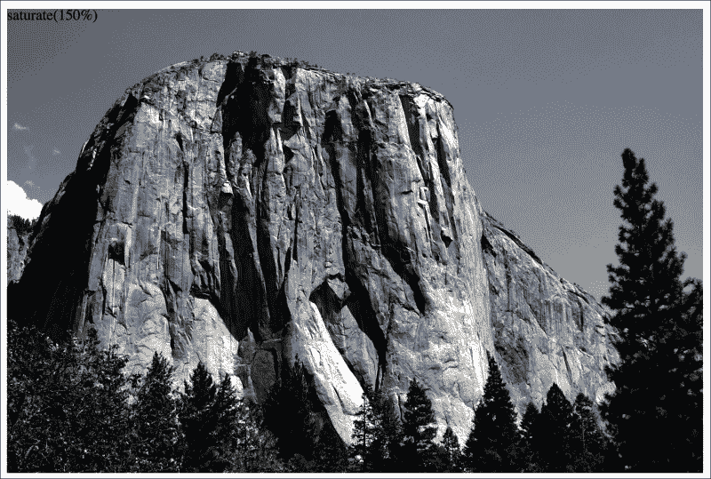

+   `filter: sepia(.75)`: 使用从 0 到 1 的值，或者 0%到 100%的值使元素呈现出更多的深褐色。0/0%使元素保持原样，而任何超过这个值的都会应用更多的深褐色，最多为 1/100%。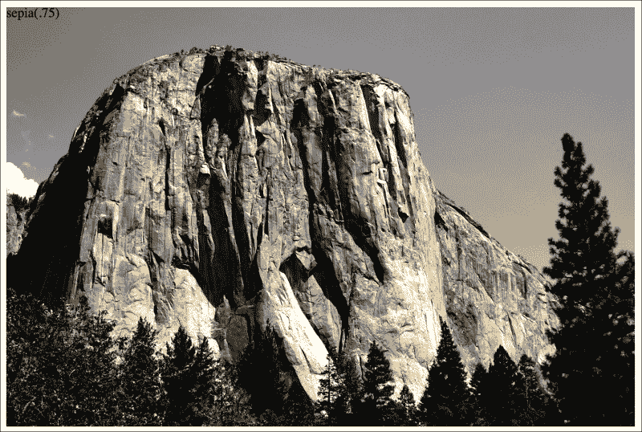

## 组合 CSS 滤镜

你也可以轻松地组合滤镜；只需用空格分隔它们。例如，这是如何一次应用`不透明度`，`模糊`和`深褐色`滤镜的：

```html
.MultipleFilters {
    filter: opacity(10%) blur(2px) sepia(35%);
}
```

### 注意

注意：除了`hue-rotate`之外，使用滤镜时，不允许使用负值。

我想你会同意，CSS 滤镜提供了一些非常强大的效果。这些也是我们可以从一种情况过渡到另一种情况的效果。我们将在第八章中看到如何做到这一点，*过渡，转换和动画*。

然而，在你对这些新玩具感到兴奋之前，我们需要就性能进行一次成熟的对话。

# 关于 CSS 性能的警告

在谈到 CSS 性能时，我希望你记住一件事：

|   | *"建筑在括号外，性能在括号内。"* |   |
| --- | --- | --- |
|   | --*Ben Frain* |

让我扩展一下我的小格言：

就我所能证明的，担心 CSS 选择器（大括号外的部分）是快还是慢是毫无意义的。我在[`benfrain.com/css-performance-revisited-selectors-bloat-expensive-styles/`](http://benfrain.com/css-performance-revisited-selectors-bloat-expensive-styles/)中试图证明这一点。

然而，从 CSS 的角度来看，真正会使页面停滞不前的一件事是“昂贵”的属性（大括号内的部分）。当我们在某些样式方面使用术语“昂贵”时，它简单地意味着它给浏览器带来了很多开销。这是浏览器发现过于繁重的事情。

我们可以根据常识猜测什么可能会导致浏览器额外工作。基本上，任何在绘制屏幕之前必须计算的东西。例如，比较一个具有纯色背景的标准 div 和一个半透明图像，放在由多个渐变组成的背景之上，带有圆角和`drop-shadow`。后者更昂贵；它将导致浏览器进行更多的计算工作，随后会导致更多的开销。

因此，当您应用滤镜等效果时，请谨慎行事，并在可能的情况下测试页面速度是否在您希望支持的最低功率设备上受到影响。至少，在 Chrome 中打开开发工具功能，如连续页面重绘，并切换任何可能会导致问题的效果。这将为您提供数据（以毫秒为单位，显示当前视口绘制所需的时间），以便更明智地决定应用哪些效果。数字越低，页面的性能越快（尽管要注意浏览器/平台会有所不同，因此尽可能在真实设备上进行测试）。

有关此主题的更多信息，我建议参考以下资源：

[`developers.google.com/web/fundamentals/performance/rendering/`](https://developers.google.com/web/fundamentals/performance/rendering/)

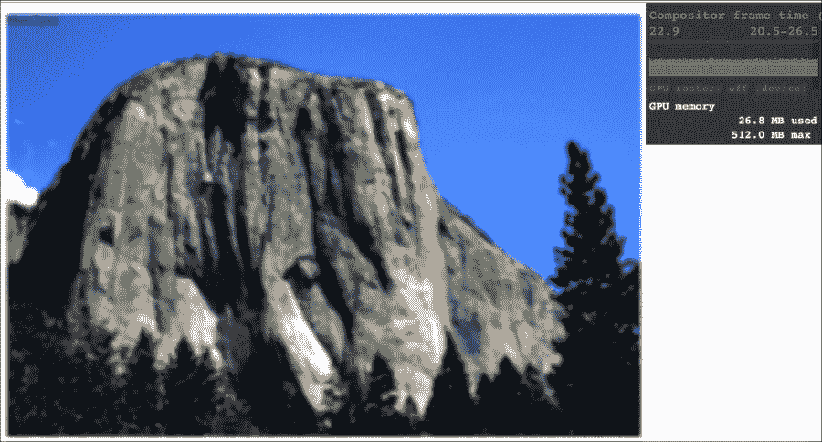

## 关于 CSS 蒙版和裁剪的说明

在不久的将来，CSS 将能够在 CSS 蒙版模块 1 级中提供蒙版和裁剪。这些功能将使我们能够使用形状或任意路径（通过 SVG 或多边形点的方式指定）裁剪图像。遗憾的是，尽管规范处于更高级的 CR 阶段，但在我写这篇文章时，浏览器的实现仍然太多 bug，无法推荐。但是，这是一个不断变化的情况，因此在您阅读本文时，实现可能已经非常稳定。对于好奇的人，我将向您推荐规范[`www.w3.org/TR/css-masking/`](http://www.w3.org/TR/css-masking/)。

我认为克里斯·科耶在这篇文章中很好地解释了支持方面的情况：

[`css-tricks.com/clipping-masking-css/`](http://css-tricks.com/clipping-masking-css/)

最后，萨拉·苏艾丹在这篇文章中提供了一个关于未来可能实现的概述和解释：

[`alistapart.com/article/css-shapes-101`](http://alistapart.com/article/css-shapes-101)

# 摘要

在本章中，我们已经研究了一些最有用的 CSS 功能，用于在响应式网页设计中创建轻量级的美学效果。CSS3 的背景渐变减少了我们对背景效果图像的依赖。我们甚至考虑了它们如何用于创建无限重复的背景图案。我们还学习了如何使用文本阴影来创建简单的文本增强和使用盒子阴影来为元素的外部和内部添加阴影。我们还研究了 CSS 滤镜。它们使我们能够仅使用 CSS 实现更令人印象深刻的视觉效果，并且可以组合以获得真正令人印象深刻的结果。

在下一章中，我们将把注意力转向创建和使用 SVG（可伸缩矢量图形），它们通常被简称为 SVG。虽然这是一种非常成熟的技术，但只有在当前响应式和高性能网站的环境下，它才真正成熟起来。
