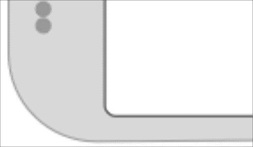
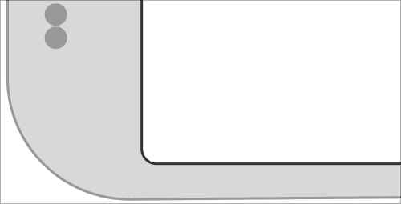
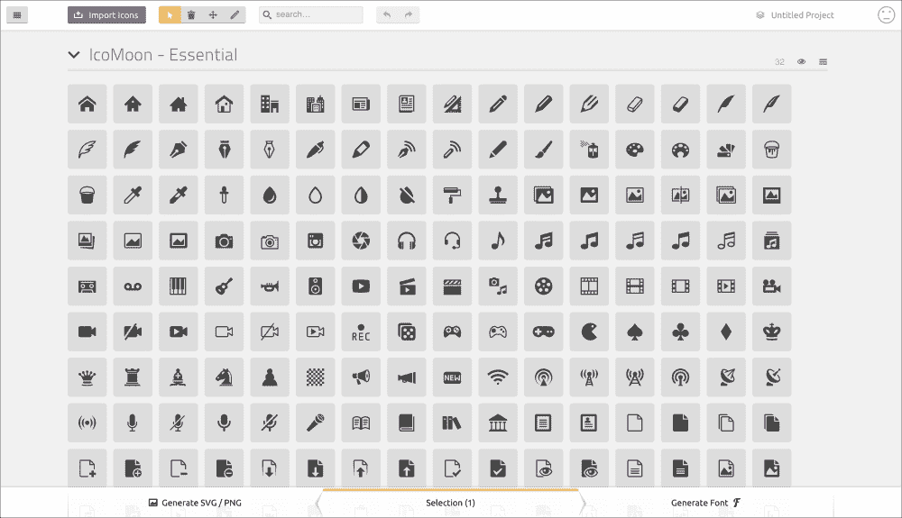
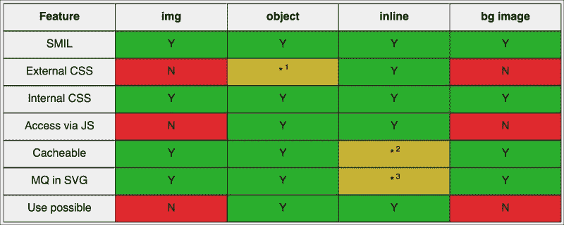
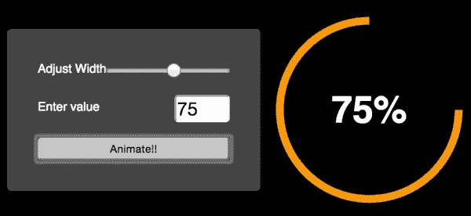
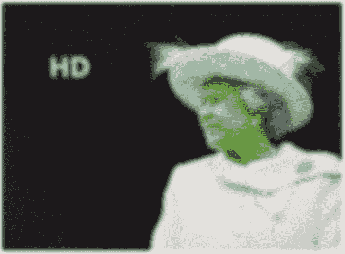

# 第七章：使用 SVG 实现分辨率独立性

整本书都在写关于 SVG 的内容。SVG 是响应式网页设计的重要技术，因为它为所有屏幕分辨率提供了清晰和未来可靠的图形资产。

在 Web 上，使用 JPEG、GIF 或 PNG 等格式的图像，其视觉数据保存为固定像素。如果您以固定宽度和高度保存图形，并将图像放大到原始大小的两倍或更多，它们的限制很容易暴露出来。

这是我在浏览器中放大的 PNG 图像截图：



你能看到图像明显呈现像素化吗？这是完全相同的图像，保存为矢量图像，以 SVG 格式，并放大到类似的级别：



希望差异是显而易见的。

除了最小的图形资产外，尽可能使用 SVG 而不是 JPEG、GIF 或 PNG，将产生分辨率独立的图形，与位图图像相比，文件大小要小得多。

虽然我们将在本章涉及 SVG 的许多方面，但重点将放在如何将它们整合到您的工作流程中，同时还提供 SVG 的可能性概述。

在本章中，我们将涵盖：

+   SVG，简要历史，以及基本 SVG 文档的解剖

+   使用流行的图像编辑软件和服务创建 SVG

+   使用`img`和`object`标签将 SVG 插入页面

+   将 SVG 插入为背景图像

+   直接（内联）将 SVG 插入 HTML

+   重用 SVG 符号

+   引用外部 SVG 符号

+   每种插入方法可能具有的功能

+   使用 SMIL 对 SVG 进行动画处理

+   使用外部样式表对 SVG 进行样式设置

+   使用内部样式对 SVG 进行样式设置

+   使用 CSS 修改和动画 SVG

+   媒体查询和 SVG

+   优化 SVG

+   使用 SVG 定义 CSS 滤镜

+   使用 JavaScript 和 JavaScript 库操纵 SVG

+   实施提示

+   更多资源

SVG 是一个复杂的主题。本章的哪些部分与您的需求最相关将取决于您实际需要的 SVG。希望我能够提供一些快捷方式。

如果您只是想用 SVG 版本替换网站上的静态图形资产，以获得更清晰的图像和/或更小的文件大小，那么请查看使用 SVG 作为背景图像和在`img`标签中的较短部分。

如果您想了解哪些应用程序和服务可以帮助您生成和管理 SVG 资产，请跳转到*使用流行的图像编辑软件和服务创建 SVG*部分，获取一些有用的链接和指引。

如果您想更全面地了解 SVG，或者想要对 SVG 进行动画和操作，最好找个舒服的地方，准备一份您最喜欢的饮料，因为这会是一个相当长的过程。

为了开始我们的理解之旅，请和我一起回到 2001 年。

# SVG 的简要历史

SVG 的首次发布是在 2001 年。这不是笔误。SVG 自 2001 年以来一直存在。虽然它在发展过程中获得了一些关注，但直到高分辨率设备的出现，它们才受到了广泛的关注和采用。以下是来自 1.1 规范的 SVG 介绍（[`www.w3.org/TR/SVG11/intro.html`](http://www.w3.org/TR/SVG11/intro.html)）：

SVG 是一种用 XML 描述二维图形的语言[XML10]。SVG 允许三种类型的图形对象：矢量图形形状（例如，由直线和曲线组成的路径）、图像和文本。

正如其名称所示，SVG 允许将二维图像描述为矢量点的代码。这使它们成为图标、线条图和图表的理想选择。

由于矢量描述了相对点，它们可以按比例缩放到任何大小，而不会失去保真度。此外，就数据而言，由于 SVG 被描述为矢量点，与大小相当的 JPEG、GIF 或 PNG 文件相比，它们往往很小。

现在，浏览器对 SVG 的支持也非常好。Android 2.3 及以上版本，以及 Internet Explorer 9 及以上版本都支持 SVG（[`caniuse.com/#search=svg`](http://caniuse.com/#search=svg)）。

# 作为文档的图形

通常情况下，如果您尝试在文本编辑器中查看图形文件的代码，生成的文本将完全无法理解。

SVG 图形的不同之处在于它们实际上是用一种标记样式语言描述的。SVG 是用**可扩展标记语言**（**XML**）编写的，这是 HTML 的近亲。尽管您可能没有意识到，但 XML 实际上无处不在于互联网上。您使用 RSS 阅读器吗？那就是 XML。XML 是将 RSS 订阅的内容打包起来，使其可以轻松地被各种工具和服务使用的语言。

因此，不仅机器可以读取和理解 SVG 图形，我们也可以。

让我举个例子。看看这个星形图形：


这是一个名为`Star.svg`的 SVG 图形，位于`example_07-01`内。您可以在浏览器中打开此示例，它将显示为星形，或者您可以在文本编辑器中打开它，您可以看到生成它的代码。考虑一下：

```html
<?xml version="1.0" encoding="UTF-8" standalone="no"?>
<svg width="198px" height="188px" viewBox="0 0 198 188" version="1.1"   >
    <!-- Generator: Sketch 3.2.2 (9983) - http://www.bohemiancoding.com/sketch -->
    <title>Star 1</title>
    <desc>Created with Sketch.</desc>
    <defs></defs>
    <g id="Page-1" stroke="none" stroke-width="1" fill="none" fill-rule="evenodd" sketch:type="MSPage">
        <polygon id="Star-1" stroke="#979797" stroke-width="3" fill="#F8E81C" sketch:type="MSShapeGroup" points="99 154 40.2214748 184.901699 51.4471742 119.45085 3.89434837 73.0983006 69.6107374 63.5491503 99 4 128.389263 63.5491503 194.105652 73.0983006 146.552826 119.45085 157.778525 184.901699 "></polygon>
    </g>
</svg>
```

这就是生成那个星形 SVG 图形所需的全部代码。

现在，通常情况下，如果您以前从未查看过 SVG 图形的代码，您可能会想知道为什么要这样做。如果您只想在网页上显示矢量图形，那么您确实不需要。只需找到一个可以将矢量艺术作品保存为 SVG 的图形应用程序，就可以了。我们将在接下来的页面中列出其中一些软件包。

然而，虽然只在图形编辑应用程序中使用 SVG 图形是常见且可能的，但如果您需要开始操作和动画化 SVG，了解 SVG 如何拼合以及如何调整它以满足您的需求可能会非常有用。

因此，让我们仔细看看 SVG 标记，并了解其中到底发生了什么。我想让您注意一些关键事项。

## 根 SVG 元素

这里的根 SVG 元素具有`width`、`height`和`viewbox`属性。

```html
 <svg width="198px" height="188px" viewBox="0 0 198 188"
```

这些都在如何显示 SVG 图形中扮演着重要的角色。

希望在这一点上，您理解了“视口”这个术语。它在本书的大多数章节中都被用来描述设备上用于查看内容的区域。例如，移动设备可能有一个 320 像素乘以 480 像素的视口。台式电脑可能有一个 1920 像素乘以 1080 像素的视口。

SVG 的`width`和`height`属性有效地创建了一个视口。通过这个定义的视口，我们可以窥视 SVG 内部定义的形状。就像网页一样，SVG 的内容可能比视口大，但这并不意味着其余部分不存在，它只是隐藏在我们当前的视图之外。

另一方面，视图框定义了 SVG 中所有形状所遵循的坐标系。

您可以将视图框的值 0 0 198 188 看作描述矩形的左上角和右下角区域。前两个值，在技术上称为**min-x**和**min-y**，描述了左上角，而后两个值，在技术上称为宽度和高度，描述了右下角。

具有`viewbox`属性使您可以执行缩放图像等操作。例如，如果像这样在`viewbox`属性中减半宽度和高度：

```html
<svg width="198px" height="188px" viewBox="0 0 99 94"
```

形状将“缩放”以填充 SVG 的宽度和高度。

### 提示

要真正理解视图框和 SVG 坐标系统以及它所提供的机会，我建议阅读 Sara Soueidan 的这篇文章：[`sarasoueidan.com/blog/svg-coordinate-systems/`](http://sarasoueidan.com/blog/svg-coordinate-systems/) 以及 Jakob Jenkov 的这篇文章：[`tutorials.jenkov.com/svg/svg-viewport-view-box.html`](http://tutorials.jenkov.com/svg/svg-viewport-view-box.html)

## 命名空间

这个 SVG 文件为生成它的 Sketch 图形程序定义了一个额外的命名空间（`xmlns`是 XML 命名空间的缩写）。

这些命名空间引用通常只被生成 SVG 的程序使用，因此当 SVG 被用于网络时，它们通常是不需要的。用于减小 SVG 文件大小的优化过程通常会将它们剥离。

## 标题和描述标签

有`title`和`desc`标签，使得 SVG 文档非常易于访问：

```html
<title>Star 1</title>
    <desc>Created with Sketch.</desc>
```

这些标签可以用来描述图形的内容，当它们看不见时。然而，当 SVG 图形用于背景图形时，这些标签可以被删除以进一步减小文件大小。

## 定义标签

在我们的示例代码中有一个空的`defs`标签：

```html
<defs></defs>
```

尽管在我们的示例中为空，但这是一个重要的元素。它用于存储各种可重用内容的定义，如渐变、符号、路径等。

## g 元素

`g`元素用于将其他元素分组在一起。例如，如果你要绘制一辆汽车的 SVG，你可能会将组成整个车轮的形状放在`g`标签内。

```html
<g id="Page-1" stroke="none" stroke-width="1" fill="none" fill-rule="evenodd" sketch:type="MSPage">
```

在我们的`g`标签中，我们可以看到之前的 sketch 命名空间在这里被重用。这将帮助图形应用程序再次打开这个图形，但如果这个图像被绑定到其他地方，它就没有进一步的作用了。

## SVG 形状

在这个示例中，最内部的节点是一个多边形。

```html
<polygon id="Star-1" stroke="#979797" stroke-width="3" fill="#F8E81C" sketch:type="MSShapeGroup" points="99 154 40.2214748 184.901699 51.4471742 119.45085 3.89434837 73.0983006 69.6107374 63.5491503 99 4 128.389263 63.5491503 194.105652 73.0983006 146.552826 119.45085 157.778525 184.901699 "></polygon>
```

SVG 具有许多现成的形状可用（`path`、`rect`、`circle`、`ellipse`、`line`、`polyline`和`polygon`）。

## SVG 路径

SVG 路径与 SVG 的其他形状不同，因为它们由任意数量的连接点组成（使你可以自由地创建任何形状）。

所以这就是 SVG 文件的要点，希望现在你对正在发生的事情有了一个高层次的理解。虽然有些人会喜欢手写或编辑 SVG 文件的代码，但更多的人宁愿用图形软件生成 SVG。让我们考虑一些更受欢迎的选择。

# 使用流行的图像编辑软件和服务创建 SVG

虽然 SVG 可以在文本编辑器中打开、编辑和编写，但有许多应用程序提供图形用户界面（GUI），使得如果你来自图形编辑背景，编写复杂的 SVG 图形会更容易。也许最明显的选择是 Adobe 的 Illustrator（PC/Mac）。然而，它对于偶尔使用者来说是昂贵的，所以我个人偏好 Bohemian Coding 的 Sketch（仅限 Mac：[`bohemiancoding.com/sketch/`](http://bohemiancoding.com/sketch/)）。这本身也不便宜（目前为 99 美元），但如果你使用 Mac，这仍然是我推荐的选择。

如果你使用 Windows/Linux 或者正在寻找更便宜的选择，可以考虑免费开源的 Inkscape（[`inkscape.org/en/`](https://inkscape.org/en/)）。它并不是最好看的工具，但它非常有能力（如果你需要任何证明，可以查看 Inkscape 画廊：[`inkscape.org/en/community/gallery/`](https://inkscape.org/en/community/gallery/)）。

最后，有一些在线编辑器。Google 有 SVG-edit ([`svg-edit.googlecode.com/svn/branches/stable/editor/svg-editor.html`](http://svg-edit.googlecode.com/svn/branches/stable/editor/svg-editor.html))。还有 Draw SVG ([`www.drawsvg.org`](http://www.drawsvg.org))，以及 Method Draw，这是 SVG-edit 的一个外观更好的分支（[`editor.method.ac/`](http://editor.method.ac/)）。

## 使用 SVG 图标服务节省时间

前面提到的应用程序都可以让您从头开始创建 SVG 图形。但是，如果您想要的是图标，您可能可以通过从在线图标服务下载 SVG 版本来节省大量时间（对我来说，获得更好的结果）。我个人最喜欢的是[`icomoon.io/`](http://icomoon.io/)也很棒。

为了快速说明在线图标服务的好处，加载 icomoon.io 应用程序会为您提供一个可搜索的图标库（一些免费，一些付费）：



您可以选择您想要的图标，然后单击下载。生成的文件包含 SVG、PNG 和 SVG 符号的图标，用于放置在`defs`元素中（请记住，`defs`元素是用于引用元素的容器元素）。

要自己看一下，请打开`example_07-02`，您可以看到我从[`icomoon.io/`](http://icomoon.io/)选择了五个图标后的下载文件。

# 将 SVG 插入到您的网页中

有许多与 SVG 图像（与常规图像格式 JPEG、GIF、PNG 不同）相关的事情（取决于浏览器），您可以做的事情。可能的范围在很大程度上取决于 SVG 插入到页面的方式。因此，在我们实际可以对 SVG 做些什么之前，我们将考虑我们实际上可以将它们放在页面上的各种方式。

## 使用 img 标签

使用 SVG 图形的最直接方法就是将其插入到 HTML 文档中的方式。我们只需使用一个好老旧的`img`标签：

```html

```

这使得 SVG 的行为几乎与任何其他图像相同。关于这点没有更多要说的。

## 使用对象标签

`object`标签是 W3C 推荐的在网页中保存非 HTML 内容的容器（object 的规范位于[`www.w3.org/TR/html5/embedded-content-0.html`](http://www.w3.org/TR/html5/embedded-content-0.html)）。我们可以利用它来像这样将 SVG 插入到我们的页面中：

```html
<object data="img/svgfile.svg" type="image/svg+xml">
    <span class="fallback-info">Your browser doesn't support SVG</span>
</object>
```

`data`或`type`属性是必需的，尽管我总是建议两者都添加。`data`属性是您链接到 SVG 资产的位置，方式与链接到任何其他资产的方式相同。`type`属性描述了与内容相关的 MIME 类型。在这种情况下，`image/svg+xml`是用于指示数据为 SVG 的 MIME（互联网媒体类型）类型。如果您希望使用此容器限制 SVG 的大小，还可以添加`width`和`height`属性。

通过`object`标签插入到页面中的 SVG 也可以通过 JavaScript 访问，这就是以这种方式插入它们的一个原因。但是，使用`object`标签的额外好处是，它为浏览器不理解数据类型时提供了一个简单的机制。例如，如果在不支持 SVG 的 Internet Explorer 8 中查看先前的`object`元素，它将简单地看到消息“您的浏览器不支持 SVG”。您可以使用此空间在`img`标签中提供备用图像。但是，请注意，根据我的粗略测试，浏览器将始终下载备用图像，无论它是否真正需要它。因此，如果您希望您的网站以尽可能短的时间加载（您会的，相信我），这实际上可能不是最佳选择。

### 注意

如果您想使用 jQuery 操作通过`object`标签插入的 SVG，您需要使用本机`.contentDocument` JavaScript 属性。然后，您可以使用 jQuery`.attr`来更改`fill`等内容。

提供备用的另一种方法是通过 CSS 添加`background-image`。例如，在我们上面的示例中，我们的备用 span 具有`.fallback-info`类。我们可以在 CSS 中使用它来链接到合适的`background-image`。这样，只有在需要时才会下载`background-image`。

## 将 SVG 作为背景图像插入

SVG 可以像任何其他图像格式（PNG、JPG、GIF）一样在 CSS 中用作背景图像。在引用它们的方式上没有什么特别之处：

```html
.item {
    background-image: url('image.svg');
}
```

对于不支持 SVG 的旧版浏览器，您可能希望在更广泛支持的格式（通常是 PNG）中包含一个“回退”图像。以下是一种在 IE8 和 Android 2 中实现的方法，因为 IE8 不支持 SVG 或`background-size`，而 Android 2.3 不支持 SVG 并且需要对`background-size`使用供应商前缀：

```html
.item {
    background: url('image.png') no-repeat;
    background: url('image.svg') left top / auto auto no-repeat;
}
```

在 CSS 中，如果应用了两个等效的属性，样式表中较低的属性将始终覆盖上面的属性。在 CSS 中，浏览器总是会忽略它无法理解的规则中的属性/值对。因此，在这种情况下，旧版浏览器会得到 PNG，因为它们无法使用 SVG 或理解未加前缀的`background-size`属性，而实际上可以使用任何一种的新版浏览器会采用下面的规则，因为它覆盖了第一个规则。

您还可以借助 Modernizr 提供回退；这是用于测试浏览器功能的 JavaScript 工具（Modernizr 在第五章中有更详细的讨论，“CSS3-选择器、排版、颜色模式和新功能”）。Modernizr 对一些不同的 SVG 插入方法进行了单独测试，而下一个版本的 Modernizr（撰写时尚未发布）可能会对 CSS 中的 SVG 有更具体的内容。然而，目前您可以这样做：

```html
.item {
    background-image: url('image.png');
}
.svg .item {
    background-image: url('image.svg');
}
```

或者如果更喜欢，可以颠倒逻辑：

```html
.item {
    background-image: url('image.svg');
}
.no-svg .item {
    background-image: url('image.png');
}
```

当功能查询得到更全面的支持时，您也可以这样做：

```html
.item {
    background-image: url('image.png');
}

@supports (fill: black) {
    .item {
        background-image: url('image.svg');
    }
}
```

`@supports`规则在这里起作用，因为`fill`是 SVG 属性，所以如果浏览器理解它，它将采用下面的规则而不是第一个规则。

如果您对 SVG 的需求主要是静态背景图像，比如图标之类的，我强烈建议将 SVG 作为背景图像实现。这是因为有许多工具可以自动创建图像精灵或样式表资产（这意味着将 SVG 作为数据 URI 包含），回退 PNG 资产以及从您创建的任何单个 SVG 生成所需的样式表。以这种方式使用 SVG 得到了很好的支持，图像本身缓存效果很好（因此在性能方面效果很好），而且实现起来很简单。

## 关于数据 URI 的简要说明

如果您阅读前面的部分，并想知道与 CSS 相关的数据**统一资源标识符**（**URI**）是什么意思，它是一种在 CSS 文件本身中包含通常是外部资产（如图像）的方法。因此，我们可能会这样链接外部图像文件：

```html
.external {
  background-image: url('Star.svg');
}
```

我们可以简单地在样式表中包含图像，使用数据 URI，如下所示：

```html
.data-uri {
  background-image: url(data:image/svg+xml,%3C%3Fxml%20version%3D%221.0%22%20encoding%3D%22UTF-8%22%20standalone%3D%22no%22%3F%3E%0A%3Csvg%20width%3D%22198px%22%20height%3D%22188px%22%20viewBox%3D%220%200%20198%20188%22%20version%3D%221.1%22%20xmlns%3D%22http%3A%2F%2Fwww.w3.org%2F2000%2Fsvg%22%20xmlns%3Axlink%3D%22http%3A%2F%2Fwww.w3.org%2F1999%2Fxlink%22%20xmlns%3Asketch%3D%22http%3A%2F%2Fwww.bohemiancoding.com%2Fsketch%2Fns%22%3E%0A%20%20%20%20%3C%21--%20Generator%3A%20Sketch%203.2.2%20%289983%29%20-%20http%3A%2F%2Fwww.bohemiancoding.com%2Fsketch%20--%3E%0A%20%20%20%20%3Ctitle%3EStar%201%3C%2Ftitle%3E%0A%20%20%20%20%3Cdesc%3ECreated%20with%20Sketch.%3C%2Fdesc%3E%0A%20%20%20%20%3Cdefs%3E%3C%2Fdefs%3E%0A%20%20%20%20%3Cg%20id%3D%22Page-1%22%20stroke%3D%22none%22%20stroke-width%3D%221%22%20fill%3D%22none%22%20fill-rule%3D%22evenodd%22%20sketch%3Atype%3D%22MSPage%22%3E%0A%20%20%20%20%20%20%20%20%3Cpolygon%20id%3D%22Star-1%22%20stroke%3D%22%23979797%22%20stroke-width%3D%223%22%20fill%3D%22%23F8E81C%22%20sketch%3Atype%3D%22MSShapeGroup%22%20points%3D%2299%20154%2040.2214748%20184.901699%2051.4471742%20119.45085%203.89434837%2073.0983006%2069.6107374%2063.5491503%2099%204%20128.389263%2063.5491503%20194.105652%2073.0983006%20146.552826%20119.45085%20157.778525%20184.901699%20%22%3E%3C%2Fpolygon%3E%0A%20%20%20%20%3C%2Fg%3E%0A%3C%2Fsvg%3E);
}
```

这并不美观，但它提供了一种消除网络上的单独请求的方法。数据 URI 有不同的编码方法，还有很多工具可以从您的资产创建数据 URI。

如果以这种方式对 SVG 进行编码，我建议避免使用 base64 方法，因为它对 SVG 内容的压缩效果不如文本好。

## 生成图像精灵

我个人推荐的工具，用于生成图像精灵或数据 URI 资产，是 Iconizr（[`iconizr.com/`](http://iconizr.com/)）。它可以完全控制您希望生成的最终 SVG 和回退 PNG 资产。您可以将 SVG 和回退 PNG 文件输出为数据 URI 或图像精灵，甚至包括加载正确资产的必要 JavaScript 片段，如果您选择数据 URI，则强烈推荐使用。

此外，如果您在思考是选择数据 URI 还是图像精灵用于您的项目，我对数据 URI 或图像精灵的利弊进行了进一步研究，您可能会对此感兴趣，如果您面临同样的选择：[`benfrain.com/image-sprites-data-uris-icon-fonts-v-svgs/`](http://benfrain.com/image-sprites-data-uris-icon-fonts-v-svgs/)

虽然我非常喜欢 SVG 作为背景图像，但如果您想要动态地对其进行动画，或者通过 JavaScript 将值注入其中，最好选择将 SVG 数据“内联”插入 HTML。

# 内联插入 SVG

由于 SVG 仅仅是一个 XML 文档，您可以直接将其插入 HTML 中。例如：

```html
<div>
    <h3>Inserted 'inline':</h3>
    <span class="inlineSVG">
        <svg id="svgInline" width="198" height="188" viewBox="0 0 198 188"  >
        <title>Star 1</title>
            <g class="star_Wrapper" fill="none" fill-rule="evenodd">
                <path id="star_Path" stroke="#979797" stroke-width="3" fill="#F8E81C" d="M99 154l-58.78 30.902 11.227-65.45L3.894 73.097l65.717-9.55L99 4l29.39 59.55 65.716 9.548-47.553 46.353 11.226 65.452z" />
            </g>
        </svg>
    </span>
</div>
```

不需要特殊的包装元素，您只需在 HTML 标记中插入 SVG 标记。还值得知道的是，如果在`svg`元素上删除任何`width`和`height`属性，SVG 将会流动地缩放以适应包含元素。

在文档中插入 SVG 可能是最多功能的 SVG 特性。

## 从符号中重复使用图形对象

在本章的前面，我提到我从 IcoMoon（[`icomoon.io`](http://icomoon.io)）中挑选并下载了一些图标。它们是描绘触摸手势的图标：滑动、捏、拖动等等。假设在您正在构建的网站中，您需要多次使用它们。请记住，我提到这些图标有 SVG 符号定义的版本？这就是我们现在要使用的。

在`example_07-09`中，我们将在页面的 SVG 的`defs`元素中插入各种符号定义。您会注意到在 SVG 元素上使用了内联样式：`display:none`，`height`和`width`属性都被设置为零（如果您愿意，这些样式可以在 CSS 中设置）。这样做是为了使这个 SVG 不占用空间。我们只是使用这个 SVG 来容纳我们想要在其他地方使用的图形对象的符号。

因此，我们的标记从这里开始：

```html
<body>
    <svg display="none" width="0" height="0" version="1.1"  >
    <defs>
    <symbol id="icon-drag-left-right" viewBox="0 0 1344 1024">
        <title>drag-left-right</title>
        <path class="path1" d="M256 192v-160l-224 224 224 224v-160h256v-128z"></path>
```

注意`defs`元素内的`symbol`元素？这是我们想要定义形状以供以后重用时使用的元素。

在 SVG 定义了我们工作所需的所有必要符号之后，我们有了所有我们的“正常”HTML 标记。然后，当我们想要使用其中一个符号时，我们可以这样做：

```html
<svg class="icon-drag-left-right">
  <use xlink:href="#icon-drag-left-right"></use>
</svg>
```

这将显示拖动左右图标：


这里的魔法是`use`元素。正如您可能已经从名称中猜到的那样，它用于利用已经在其他地方定义的现有图形对象。选择要引用的机制是`xlink`属性，在这种情况下，它引用了我们在标记开头内联的“拖动左右”图标（`#icon-drag-left-right`）的符号 ID。

当您重复使用一个符号时，除非您明确设置了大小（可以通过元素本身的属性或 CSS 设置），否则`use`将被设置为宽度和高度为 100%。因此，要调整我们的图标大小，我们可以这样做：

```html
.icon-drag-left-right {
    width: 2.5rem;
    height: 2.5rem;
}
```

`use`元素可用于重用各种 SVG 内容：渐变、形状、符号等等。

## 内联 SVG 允许在不同的上下文中使用不同的颜色

使用内联 SVG，您还可以做一些有用的事情，比如根据上下文更改颜色，当您需要不同颜色的相同图标的多个版本时，这将非常有用：

```html
.icon-drag-left-right {
    fill: #f90;
}

.different-context .icon-drag-left-right {
    fill: #ddd;
}
```

### 使双色图标继承其父元素的颜色

使用内联 SVG，您还可以玩得很开心，从单色图标创建双色效果（只要 SVG 由多个路径组成），并使用`currentColor`，这是最古老的 CSS 变量。要做到这一点，在 SVG 符号内部，将要成为一种颜色的路径的`fill`设置为`currentColor`。然后在 CSS 中使用颜色值对元素进行着色。对于 SVG 符号中没有填充的路径，设置为`currentColor`，它们将接收填充值。举例说明：

```html
.icon-drag-left-right {
    width: 2.5rem;
    height: 2.5rem;
    fill: #f90;
    color: #ccc; /* this gets applied to the path that has it's fill attribute set to currentColor in the symbol */
}
```

这是同一个符号被重复使用了三次，每次都有不同的颜色和大小：


请记住，您可以查看`example_07-09`中的代码。还值得知道的是，颜色不一定要设置在元素本身上，它可以在任何父元素上；`currentColor`将从 DOM 树上的最近的父元素继承一个值。

以这种方式使用 SVG 有很多积极的方面。唯一的缺点是需要在每个要使用图标的页面上包含相同的 SVG 数据。不幸的是，这对性能来说是不好的，因为资产（SVG 数据）不容易被缓存。然而，还有另一种选择（如果您愿意添加一个脚本来支持 Internet Explorer）。

## 从外部来源重用图形对象

与其在每个页面中粘贴一组巨大的 SVG 符号，同时仍然使用`use`元素，不如链接到外部 SVG 文件并获取您想要使用的文档部分。看一下`example-07-10`，和我们在`example_07-09`中的三个图标以这种方式放在页面上：

```html
<svg class="icon-drag-left-right">
    <use xlink:href="defs.svg#icon-drag-left-right"></use>
</svg>
```

重要的是要理解`href`。我们正在链接到外部 SVG 文件（`defs.svg`部分），然后指定我们想要使用的文件中的符号的 ID（`#icon-drag-left-right`部分）。

这种方法的好处是，浏览器会缓存资产（就像任何其他外部图像一样），并且它可以节省我们的标记，不用用充满符号定义的 SVG。缺点是，与内联放置`defs`时不同，对`defs.svg`进行的任何动态更改（例如，如果路径被 JavaScript 操纵）不会在`use`标签中更新。

不幸的是，Internet Explorer 不允许从外部资产引用符号。但是，有一个用于 IE9-11 的 polyfill 脚本，名为**SVG For Everybody**，它允许我们无论如何使用这种技术。请访问[`github.com/jonathantneal/svg4everybody`](https://github.com/jonathantneal/svg4everybody)了解更多信息。

使用那段 JavaScript 时，您可以愉快地引用外部资产，polyfill 将直接将 SVG 数据插入到文档的主体中，以支持 Internet Explorer。

# 您可以使用每种 SVG 插入方法（内联、对象、背景图像和 img）做什么

如前所述，SVG 与其他图形资产不同。它们的行为可能会有所不同，取决于它们被插入到页面的方式。正如我们所见，有四种主要的方式可以将 SVG 放置到页面上：

+   在`img`标签内部

+   在`object`标签内部

+   作为背景图像

+   内联

并且根据插入方法，某些功能将或将不可用。

要了解每种插入方法应该可能做什么，可能更简单的方法是考虑这个表格。



现在有一些需要考虑的注意事项，用数字标记：

+   ***1**：当在对象内部使用 SVG 时，您可以使用外部样式表来为 SVG 设置样式，但您必须从 SVG 内部链接到该样式表

+   ***2**：您可以在外部资产中使用 SVG（可缓存），但在 Internet Explorer 中默认情况下无法工作

+   ***3**：'内联'的 SVG 中样式部分的媒体查询作用于其所在文档的大小（而不是 SVG 本身的大小）

## 浏览器分歧

请注意，SVG 的浏览器实现也有所不同。因此，仅仅因为上面所示的东西应该是可能的，并不意味着它们实际上在每个浏览器中都会出现，或者它们会表现一致！

例如，上表中的结果是基于`example_07-03`中的测试页面。

测试页面的行为在最新版本的 Firefox、Chrome 和 Safari 中是可比较的。然而，Internet Explorer 有时会做一些不同的事情。

例如，在所有支持 SVG 的 Internet Explorer 版本（目前为止，即 9、10 和 11），正如我们已经看到的，不可能引用外部 SVG 源。此外，Internet Explorer 会将外部样式表中的样式应用到 SVG 上，而不管它们是如何插入的（其他浏览器只有在 SVG 通过`object`或内联方式插入时才应用外部样式表中的样式）。Internet Explorer 也不允许通过 CSS 对 SVG 进行任何动画；在 Internet Explorer 中，SVG 的动画必须通过 JavaScript 完成。我再说一遍，给后排的人听：除了 JavaScript，你无法以任何其他方式在 Internet Explorer 中对 SVG 进行动画。

# 额外的 SVG 功能和奇特之处

让我们暂时抛开浏览器的缺陷，考虑一下表中的一些功能实际上允许什么，以及为什么你可能会或不会想要使用它们。

SVG 将始终以查看设备允许的最清晰方式呈现，而不管插入的方式如何。对于大多数实际情况，分辨率独立通常足以使用 SVG。然后只是选择适合你的工作流程和任务的插入方法的问题。

然而，还有其他一些值得知道的功能和奇特之处，比如 SMIL 动画、不同的链接外部样式表的方式、用字符数据分隔符标记内部样式、用 JavaScript 修改 SVG，以及在 SVG 中使用媒体查询。让我们接下来讨论这些。

## SMIL 动画

SMIL 动画（[`www.w3.org/TR/smil-animation/`](http://www.w3.org/TR/smil-animation/)）是一种在 SVG 文档内部定义动画的方法。

SMIL（如果你想知道，发音为“smile”）代表同步多媒体集成语言，是作为在 XML 文档内定义动画的一种方法而开发的（记住，SVG 是基于 XML 的）。

以下是一个基于 SMIL 的动画的示例：

```html
<g class="star_Wrapper" fill="none" fill-rule="evenodd">
    <animate xlink:href="#star_Path" attributeName="fill" attributeType="XML" begin="0s" dur="2s" fill="freeze" from="#F8E81C" to="#14805e" />

    <path id="star_Path" stroke="#979797" stroke-width="3" fill="#F8E81C" d="M99 154l-58.78 30.902 11.227-65.45L3.894 73.097l65.717-9.55L99 4l29.39 59.55 65.716 9.548-47.553 46.353 11.226 65.452z" />
</g>
```

我抓取了我们之前看过的 SVG 的一部分。`g`是 SVG 中的分组元素，这个元素包括一个星形（`id="star_Path"`的`path`元素）和`animate`元素内的 SMIL 动画。这个简单的动画将星星的填充颜色从黄色变为绿色，持续两秒。而且，无论 SVG 是以`img`、`object`、`background-image`还是内联方式放在页面上（不，真的，除了 Internet Explorer 之外的任何最新浏览器中打开`example_07-03`都可以看到）。

### 注意

**Tweening**

如果你还不知道（我不知道），“tweening”作为一个术语只是“inbetweening”的缩写，因为它仅仅表示从一个动画点到另一个动画点的所有中间阶段。

哇！很棒，对吧？嗯，本来可以的。尽管已经成为标准一段时间，看起来 SMIL 的日子已经不多了。

### SMIL 的结束

Internet Explorer 不支持 SMIL。没有。没有。没有。我可以用其他词语来表达，但我相信你明白在这一点上 Internet Explorer 对 SMIL 的支持并不多。

更糟糕的是（我知道，我在这里给你两个枪口），微软也没有引入它的计划。看看平台状态：[`status.modern.ie/svgsmilanimation?term=SMIL`](https://status.modern.ie/svgsmilanimation?term=SMIL)

此外，Chrome 现在已经表示了在 Chrome 浏览器中弃用 SMIL 的意图：[`groups.google.com/a/chromium.org/forum/#!topic/blink-dev/5o0yiO440LM`](https://groups.google.com/a/chromium.org/forum/#!topic/blink-dev/5o0yiO440LM)

麦克风。放下。

### 注意

如果你仍然需要使用 SMIL，Sara Soueidan 在[`css-tricks.com/guide-svg-animations-smil/`](http://css-tricks.com/guide-svg-animations-smil/)写了一篇关于 SMIL 动画的优秀而深入的文章。

幸运的是，我们有很多其他方法可以使 SVG 动画，我们很快就会介绍。所以如果你必须支持 Internet Explorer，请坚持下去。

## 用外部样式表样式化 SVG

可以用 CSS 样式化 SVG。这可以是 SVG 本身中的 CSS，也可以是 CSS 样式表中写所有你的“正常”CSS。

现在，如果你回到本章前面的特性表，你会发现当 SVG 通过`img`标签或作为背景图像（除了 Internet Explorer）包含时，使用外部 CSS 样式化 SVG 是不可能的。只有当 SVG 通过`object`标签或`inline`插入时才可能。

从 SVG 链接到外部样式表有两种语法。最直接的方式是这样的（你通常会在`defs`部分中添加这个）：

```html
<link href="styles.css" type="text/css" rel="stylesheet"/>
```

这类似于 HTML5 之前我们用来链接样式表的方式（例如，注意在 HTML5 中`type`属性不再是必需的）。然而，尽管这在许多浏览器中有效，但这并不是规范定义外部样式表应该如何在 SVG 中链接的方式（[`www.w3.org/TR/SVG/styling.html`](http://www.w3.org/TR/SVG/styling.html)）。这是正确/官方的方式，实际上在 1999 年就为 XML 定义了（[`www.w3.org/1999/06/REC-xml-stylesheet-19990629/`](http://www.w3.org/1999/06/REC-xml-stylesheet-19990629/)）：

```html
<?xml-stylesheet href="styles.css" type="text/css"?>
```

需要在文件中的开头 SVG 元素上方添加。例如：

```html
<?xml-stylesheet href="styles.css" type="text/css"?>
<svg width="198" height="188" viewBox="0 0 198 188"  >
```

有趣的是，后一种语法是唯一在 Internet Explorer 中有效的。所以，当你需要从 SVG 链接到样式表时，我建议使用这种第二种语法以获得更广泛的支持。

你不必使用外部样式表；如果你愿意，你可以直接在 SVG 本身中使用内联样式。

## 使用内部样式样式化 SVG

你可以在 SVG 中放置 SVG 的样式。它们应该放在`defs`元素内。由于 SVG 是基于 XML 的，最安全的做法是包含**Character Data**（**CDATA**）标记。CDATA 标记简单地告诉浏览器，字符数据定界部分内的信息可能被解释为 XML 标记，但不应该。语法是这样的：

```html
<defs>
    <style type="text/css">
        <![CDATA[
            #star_Path {
                stroke: red;
            }
        ]]>
    </style>
</defs>
```

### CSS 中的 SVG 属性和值

注意前面代码块中的`stroke`属性。那不是 CSS 属性，而是 SVG 属性。无论是内联声明还是外部样式表，你都可以使用许多特定的 SVG 属性。例如，对于 SVG，你不指定`background-color`，而是指定`fill`。你不指定`border`，而是指定`stroke-width`。关于 SVG 特定属性的完整列表，请查看这里的规范：[`www.w3.org/TR/SVG/styling.html`](http://www.w3.org/TR/SVG/styling.html)

使用内联或外部 CSS，可以做所有你期望的“正常”CSS 事情；改变元素的外观，动画，转换元素等等。

## 用 CSS 动画 SVG

让我们考虑一个快速的示例，向 SVG 中添加 CSS 动画（记住，这些样式也可以很容易地放在外部样式表中）。

让我们以本章中一直在看的星星示例为例，让它旋转。你可以在`example_07-07`中看到完成的示例：

```html
<div class="wrapper">
    <svg width="198" height="188" viewBox="0 0 220 200"  >
        <title>Star 1</title>
        <defs>
            <style type="text/css">
                <![CDATA[
                @keyframes spin {
                    0% {
                        transform: rotate(0deg);
                    }
                    100% {
                        transform: rotate(360deg);
                    }
                }
                .star_Wrapper {
                    animation: spin 2s 1s;
                    transform-origin: 50% 50%;
                }
                .wrapper {
                    padding: 2rem;
                    margin: 2rem;
                }
                ]]>
            </style>
            <g id="shape">
                <path fill="#14805e" d="M50 50h50v50H50z"/>
                <circle fill="#ebebeb" cx="50" cy="50" r="50"/>
            </g>
        </defs>
        <g class="star_Wrapper" fill="none" fill-rule="evenodd">
            <path id="star_Path" stroke="#333" stroke-width="3" fill="#F8E81C" d="M99 154l-58.78 30.902 11.227-65.45L3.894 73.097l65.717-9.55L99 4l29.39 59.55 65.716 9.548-47.553 46.353 11.226 65.453z"/>
        </g>
    </svg>
</div>
```

如果你在浏览器中加载这个示例，在 1 秒延迟后，星星将在 2 秒内旋转一整圈。

### 提示

注意 SVG 上设置了`50% 50%`的变换原点？这是因为，与 CSS 不同，SVG 的默认`transform-origin`不是`50% 50%`（两个轴的中心），实际上是`0 0`（左上角）。如果不设置这个属性，星星将围绕左上角旋转。

仅使用 CSS 动画就可以对 SVG 进行相当深入的动画处理（嗯，假设您不需要担心 Internet Explorer）。然而，当您想要添加交互性、支持 Internet Explorer 或同步多个事件时，通常最好依赖 JavaScript。好消息是，有很多优秀的库可以使对 SVG 进行动画处理变得非常容易。现在让我们看一个例子。

# 使用 JavaScript 对 SVG 进行动画处理

通过`object`标签或内联插入到页面中的 SVG，可以直接或间接地使用 JavaScript 来操作 SVG。

间接地，我指的是可以使用 JavaScript 在 SVG 上方或上方更改一个类，从而导致 CSS 动画开始。例如：

```html
svg {
    /* no animation */
}

.added-with-js svg {
    /* animation */
}
```

然而，也可以直接通过 JavaScript 来对 SVG 进行动画处理。

如果只需要独立地对一两个元素进行动画处理，可能通过手动编写 JavaScript 代码来减少代码量。然而，如果需要对许多元素进行动画处理或同步元素的动画处理，就可以使用 JavaScript 库。最终，您需要判断是否可以为您试图实现的目标来合理地包含库的重量。

我推荐使用 GreenSock 动画平台（[`greensock.com`](http://greensock.com)）、Velocity.js（[`julian.com/research/velocity/`](http://julian.com/research/velocity/)）或 Snap.svg（[`snapsvg.io/`](http://snapsvg.io/)）来通过 JavaScript 对 SVG 进行动画处理。在下一个示例中，我们将介绍使用 GreenSock 的一个非常简单的示例。

## 使用 GreenSock 对 SVG 进行动画处理的一个简单示例

假设我们想制作一个界面刻度盘，当我们点击按钮时，它会从零开始动画到我们输入的任意值。我们不仅希望刻度盘的描边在长度和颜色上进行动画处理，还希望数字从零到我们输入的值进行动画处理。您可以在`example_07-08`中查看已完成的实现。

因此，如果我们输入了 75，并点击了动画，它会填充到如下所示：



为了简洁起见，我们不列出整个 JavaScript 文件（该文件有很多注释，因此在单独阅读时应该能够理解一些），我们只考虑关键点。

基本思路是我们已经将一个圆作为 SVG 的`<path>`（而不是`<circle>`元素）制作出来。由于它是一个路径，这意味着我们可以使用`stroke-dashoffset`技术对路径进行动画处理。关于这种技术的更多信息，请参见下面的方框中的部分，简而言之，我们使用 JavaScript 来测量路径的长度，然后使用`stroke-dasharray`属性来指定线条的渲染部分的长度和间隙的长度。然后我们使用`stroke-dashoffset`来改变`dasharray`的起始位置。这意味着您可以有效地从路径的“外部”开始描边并进行动画处理。这会产生路径正在被绘制的错觉。

如果要将`dasharray`的动画值设置为静态的已知值，可以通过 CSS 动画和一些试错来相对简单地实现这种效果（关于 CSS 动画的更多内容将在下一章中介绍）。

然而，除了动态值之外，与我们“绘制”线条的同时，我们还希望将描边颜色从一个值淡入到另一个值，并在文本节点中直观地计数到输入值。这相当于同时摸头、搓肚子，并从 10,000 开始倒数。GreenSock 使这些事情变得非常容易（动画部分；它不会搓你的肚子或摸你的头，尽管如果需要，它可以从 10,000 开始倒数）。以下是使 GreenSock 执行所有这些操作所需的 JavaScript 代码行：

```html
// Animate the drawing of the line and color change
TweenLite.to(circlePath, 1.5, {'stroke-dashoffset': "-"+amount, stroke: strokeEndColour});
// Set a counter to zero and animate to the input value
var counter = { var: 0 };
TweenLite.to(counter, 1.5, {
    var: inputValue, 
    onUpdate: function () {
        text.textContent = Math.ceil(counter.var) + "%";
    },
    ease:Circ.easeOut
});
```

实质上，通过`TweenLite.to()`函数，您可以传入要进行动画处理的对象、动画处理应该发生的时间以及要更改的值（以及您希望将其更改为的值）。

GreenSock 网站有出色的文档和支持论坛，因此如果你发现自己需要同时同步多个动画，请确保从你的日程表中抽出一天的时间，熟悉一下 GreenSock。

### 提示

如果你以前没有接触过 SVG 的“线条绘制”技术，那么它是由 Polygon 杂志推广的，当 Vox Media 动画化了 Xbox One 和 Playstation 4 游戏机的几个线条绘制时。你可以在[`product.voxmedia.com/2013/11/25/5426880/polygon-feature-design-svg-animations-for-fun-and-profit`](http://product.voxmedia.com/2013/11/25/5426880/polygon-feature-design-svg-animations-for-fun-and-profit)上阅读原始帖子。

Jake Archibald 在[`jakearchibald.com/2013/animated-line-drawing-svg/`](http://jakearchibald.com/2013/animated-line-drawing-svg/)上也有一个关于这种技术的更详细的解释。

# 优化 SVG

作为尽职的开发人员，我们希望确保资产尽可能小。使用 SVG 的最简单方法是利用可以优化 SVG 文档的自动化工具。除了明显的节约，比如删除元素（例如，去除标题和描述元素），还可以执行一系列微小的优化，这些优化加起来可以使 SVG 资产更加精简。

目前，对于这个任务，我建议使用 SVGO ([`github.com/svg/svgo`](https://github.com/svg/svgo))。如果你以前从未使用过 SVGO，我建议从 SVGOMG ([`jakearchibald.github.io/svgomg/`](https://jakearchibald.github.io/svgomg/))开始。这是 SVGO 的基于浏览器的版本，它使你可以切换各种优化插件，并即时获得文件节省的反馈。

还记得我们在本章开头的例子星形 SVG 标记吗？默认情况下，这个简单的 SVG 大小为 489 字节。通过 SVGO 处理，可以将大小减小到 218 字节，这还保留了`viewBox`。这是节省了 55.42%。如果你使用了大量的 SVG 图像，这些节省可能会真正累积起来。优化后的 SVG 标记如下所示：

```html
<svg width="198" height="188" viewBox="0 0 198 188" ><path stroke="#979797" stroke-width="3" fill="#F8E81C" d="M99 154l-58.78 30.902 11.227-65.45L3.894 73.097l65.717-9.55L99 4l29.39 59.55 65.716 9.548-47.553 46.353 11.226 65.454z"/></svg>
```

在使用 SVGO 之前，要注意 SVGO 的受欢迎程度，许多其他 SVG 工具也使用它。例如，前面提到的 Iconizr ([`iconizr.com/`](http://iconizr.com/))工具默认情况下会将你的 SVG 文件通过 SVGO 运行，然后再创建你的资产，因此请确保你不会不必要地进行双重优化。

# 使用 SVG 作为滤镜

在第六章中，我们看到了 CSS 滤镜效果。然而，它们目前不受 Internet Explorer 10 或 11 的支持。如果你想在这些浏览器中享受滤镜效果，这可能会让人沮丧。幸运的是，借助 SVG 的帮助，我们也可以创建适用于 Internet Explorer 10 和 11 的滤镜，但正如以往一样，这可能并不像你想象的那样简单。例如，在`example_07-05`中，我们有一个页面，其中包含以下标记：

```html

```

这是英国女王的一张图片。通常，它看起来是这样的：


现在，在示例文件夹中还有一个在`defs`元素中定义了滤镜的 SVG。SVG 标记如下：

```html
<svg  version="1.1">
     <defs>
          <filter id="myfilter" x="0" y="0">  
                <feColorMatrix in="SourceGraphic" type="hueRotate" values="90" result="A"/>
                <feGaussianBlur in="A" stdDeviation="6"/>
          </filter>
     </defs>
</svg>
```

在滤镜中，我们首先定义了一个 90 度的色相旋转（使用`feColorMatrix`），然后通过`result`属性将该效果传递给下一个滤镜（`feGaussianBlur`），模糊值为 6。请注意，我在这里故意做得很重。这不会产生一个好的美学效果，但这应该让你毫无疑问地知道效果已经起作用了！

现在，我们可以不将 SVG 标记添加到 HTML 中，而是将其留在原地，并使用与上一章中看到的相同的 CSS 滤镜语法来引用它。

```html
.HRH {
    filter: url('filter.svg#myfilter');
}
```

在大多数现代浏览器（Chrome，Safari，Firefox）中，这是效果：



遗憾的是，这种方法在 IE 10 或 11 中不起作用。然而，还有另一种实现我们目标的方法，那就是使用 SVG 自己的图像标签将图像包含在 SVG 中。在`example_07-06`中，我们有以下标记：

```html
<svg height="747px" width="1024px" viewbox="0 0 1024 747"  version="1.1">
     <defs>
          <filter id="myfilter" x="0" y="0">  
                <feColorMatrix in="SourceGraphic" type="hueRotate" values="90" result="A"/>
                <feGaussianBlur in="A" stdDeviation="6"/>
          </filter>
     </defs>
     <image x="0" y="0" height="747px" width="1024px"  xlink:href="queen@2x-1024x747.png" filter="url(#myfilter)"></image>
</svg>
```

这里的 SVG 标记与我们在上一个示例中使用的外部`filter.svg`过滤器非常相似，但添加了`height`、`width`和`viewbox`属性。此外，我们要对其应用过滤器的图像是 SVG 中`defs`元素之外的唯一内容。为了链接到过滤器，我们使用`filter`属性并传递我们想要使用的过滤器的 ID（在这种情况下是在上面的`defs`元素中）。

虽然这种方法有点复杂，但它意味着你可以获得 SVG 提供的许多不同的滤镜效果，即使在 Internet Explorer 的 10 和 11 版本中也是如此。

# 关于 SVG 中的媒体查询的说明

所有理解 SVG 的浏览器都应该尊重 SVG 内定义的 CSS 媒体查询。然而，当涉及到 SVG 内的媒体查询时，有一些事情需要记住。

例如，假设你在 SVG 中插入了一个媒体查询，就像这样：

```html
<style type="text/css"><![CDATA[
    #star_Path {
        stroke: red;
    }
    @media (min-width: 800px) {
        #star_Path {
            stroke: violet;
        }
    }
]]></style>
```

而 SVG 在页面上以 200px 的宽度显示，而视口宽度为 1200px。

我们可能期望星星的描边在屏幕宽度为 800px 及以上时是紫色的。毕竟，这就是我们设置媒体查询的方式。然而，当 SVG 通过`img`标签、作为背景图像或嵌入`object`标签放置在页面中时，它对外部 HTML 文档一无所知。因此，在这种情况下，`min-width`意味着 SVG 本身的最小宽度。因此，除非 SVG 本身在页面上以 800px 或更多的宽度显示，否则描边不会是紫色的。

相反，当你内联插入 SVG 时，它会（在某种意义上）与外部 HTML 文档合并。这里的`min-width`媒体查询是根据视口（就像 HTML 一样）来决定何时匹配媒体查询。

为了解决这个特定的问题并使相同的媒体查询行为一致，我们可以修改我们的媒体查询为：

```html
@media (min-device-width: 800px) {
    #star_Path {
        stroke: violet;
    }
}
```

这样，无论 SVG 的大小或嵌入方式如何，它都会根据设备宽度（实际上是视口）进行调整。

## 实施提示

现在我们几乎到了本章的结尾，还有很多关于 SVG 的内容可以讨论。因此，这时我只列出一些无关的注意事项。它们不一定值得详细解释，但我会在这里列出它们的笔记形式，以防它们能让你省去一小时的谷歌搜索：

+   如果你不需要为 SVG 添加动画，可以选择使用图像精灵或数据 URI 样式表。这样更容易提供回退资产，并且从性能的角度来看，它们几乎总是表现更好。

+   尽可能自动化资产创建过程中的许多步骤；这样可以减少人为错误，并更快地产生可预测的结果。

+   要在项目中插入静态 SVG，尽量选择一种交付机制并坚持使用（图像精灵、数据 URI 或内联）。如果以一种方式生成一些资产，以另一种方式生成其他资产，并维护各种实现，这可能会成为负担。

+   SVG 动画没有一个简单的“一刀切”的选择。对于偶尔和简单的动画，使用 CSS。对于复杂的交互式或时间轴样式的动画，还可以在 Internet Explorer 中工作，依赖于像 Greensock、Velocity.js 或 Snap.svg 这样的成熟库。

## 进一步的资源

正如我在本章开头提到的，我既没有空间，也没有知识来传授关于 SVG 的所有知识。因此，我想让你了解以下优秀的资源，它们提供了关于这个主题的额外深度和范围：

+   *SVG Essentials, 2nd Edition* by J. David Eisenberg, Amelia Bellamy-Royds ([`shop.oreilly.com/product/0636920032335.do`](http://shop.oreilly.com/product/0636920032335.do))

+   *Sara Soueidan 的《SVG 动画指南（SMIL）*（[`css-tricks.com/guide-svg-animations-smil/`](http://css-tricks.com/guide-svg-animations-smil/)）

+   *Jeremie Patonnier 的《SVG 内部媒体查询测试*（[`jeremie.patonnier.net/experiences/svg/media-queries/test.html`](http://jeremie.patonnier.net/experiences/svg/media-queries/test.html)）

+   *今天浏览器的 SVG 入门*（[`www.w3.org/Graphics/SVG/IG/resources/svgprimer.html`](http://www.w3.org/Graphics/SVG/IG/resources/svgprimer.html)）

+   *Sara Soueidan 的《理解 SVG 坐标系和变换（第一部分）*（[`sarasoueidan.com/blog/svg-coordinate-systems/`](http://sarasoueidan.com/blog/svg-coordinate-systems/)）

+   *《SVG 滤镜效果实践》*（[`ie.microsoft.com/testdrive/graphics/hands-on-css3/hands-on_svg-filter-effects.htm`](http://ie.microsoft.com/testdrive/graphics/hands-on-css3/hands-on_svg-filter-effects.htm)）

+   Jakob Jenkov 的完整 SVG 教程*（[`tutorials.jenkov.com/svg/index.html`](http://tutorials.jenkov.com/svg/index.html)）

# 总结

在本章中，我们已经涵盖了许多必要的信息，以便开始理解和实施响应式项目中的 SVG。我们考虑了不同的图形应用程序和在线解决方案，以创建 SVG 资产，然后考虑了可能的各种插入方法以及每种方法允许的功能，以及需要注意的各种浏览器特性。

我们还考虑了如何链接到外部样式表，并在同一页面内重复使用 SVG 符号以及在外部引用时。我们甚至研究了如何使用 SVG 制作可以在 CSS 中引用和使用的滤镜，以获得比 CSS 滤镜更广泛的支持。

最后，我们考虑了如何利用 JavaScript 库来帮助动画化 SVG，以及如何借助 SVGO 工具优化 SVG。

在下一章中，我们将研究 CSS 过渡、变换和动画。与 SVG 相关的语法和技术中有许多可以在 SVG 文档中使用和应用的内容，因此也值得阅读该章节。所以，来杯热饮（你值得拥有），我马上就会再见到你。
