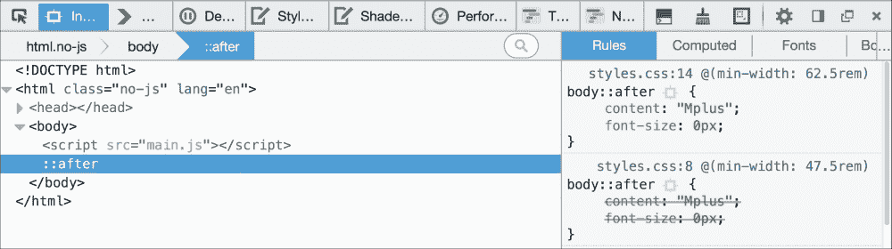
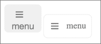
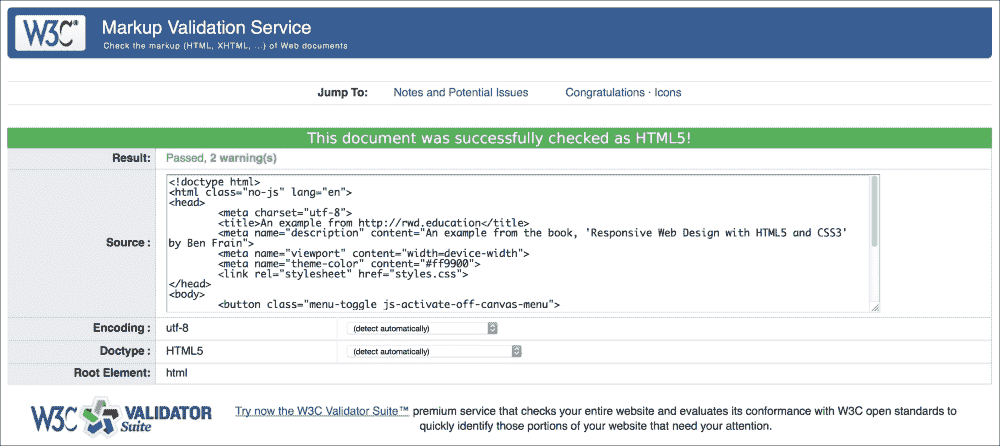
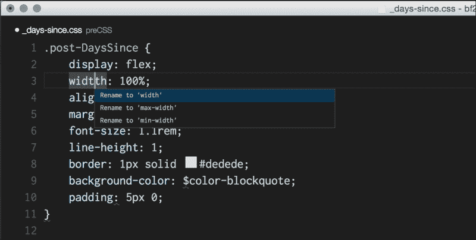
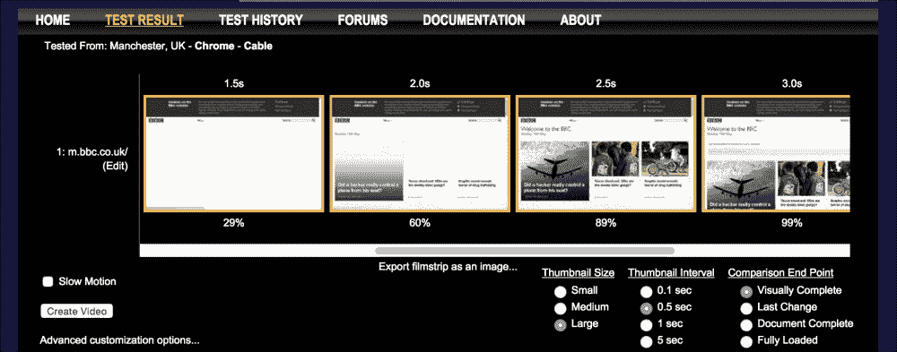

# 第十章：接近响应式网页设计

在我最喜欢的故事和电影中，通常会有一幕导师传授宝贵建议和一些神奇物品给英雄。你知道这些物品会很有用；只是不知道何时或如何使用。

好吧，我想在最后一章中扮演导师的角色（再加上我的头发已经变少，我也没有英雄的外表）。我希望你，我的优秀学徒，在你踏上响应式之旅之前，能再给我一点时间，让我在你出发之前提供一些最后的建议。

本章将是一半哲学思考和指导，一半无关的技巧和技术。我希望在你的响应式冒险中，这些技巧会在某个时候证明有用。以下是我们将要涵盖的内容：

+   尽快在浏览器和真实设备上获取设计

+   让设计决定断点

+   拥抱渐进增强

+   定义浏览器支持矩阵

+   渐进增强的实践

+   将 CSS 断点链接到 JavaScript

+   避免在生产中使用 CSS 框架

+   开发务实的解决方案

+   编写尽可能简单的代码

+   在视口之间隐藏、显示和加载内容

+   让 CSS 承担（视觉）重任

+   使用验证器和 linting 工具

+   分析和测试网页性能（[webpagetest.org](http://webpagetest.org)）

+   采用更快更有效的技术

+   留意下一个“大”事物

# 尽快在浏览器中获取设计

我做的响应式设计工作越多，我发现尽快在浏览器环境中启动和运行设计变得越来越重要。如果你既是设计师又是开发人员，那就简化了事情。一旦你对自己需要什么有了足够的视觉感觉，你就可以在浏览器中创建原型，并在浏览器环境中进一步发展这个想法。通过完全放弃高保真度的全页面模拟，可以更全面地采用这种方法。相反，考虑一些像样式瓷砖这样的东西——介于心情板和完整模拟之间。样式瓷砖的介绍（[`styletil.es/`](http://styletil.es/)）将它们描述为：

> “样式瓷砖是一种设计成果，包括字体、颜色和界面元素，用于传达网页视觉品牌的本质。”

我发现这种图形成果可以用于在利益相关者之间呈现和传达外观和感觉，而不必诉诸无休止的合成。

## 让设计决定断点

我想重申前几章提到的一点。让设计定义断点应该设置在哪里。有了浏览器中的设计，这个过程会变得更容易。你应该始终从最小的屏幕尺寸开始修改设计，然后随着视口尺寸的增加，你可以看到在需要引入断点之前设计能够工作到什么程度。

你还会发现以这种方式编写设计会更容易。首先为最小的视口编写 CSS，然后在媒体查询中添加对不同元素的任何更改。例如：

```html
.rule {
  /* Smallest viewport size styles */
}

@media (min-width: 40em) {
  .rule {
    /* Medium viewport size changes */
  }
}

@media (min-width: 70em) {
  .rule {
    /* Larger viewport size changes */
  }
}
```

# 在真实设备上查看并使用设计

如果可以的话，开始建立一个旧设备（手机/平板电脑）的“设备实验室”来查看你的工作。拥有多种不同的设备非常有益。它不仅可以让你感受设计在不同设备上的实际效果，还可以在过程的早期暴露布局/渲染的特殊性。毕竟，没有人喜欢相信他们在某个环境中完成了项目，结果被告知它在那里无法正常工作。早期测试，经常测试！这并不需要花费很多钱。例如，你可以在 eBay 上购买旧手机和平板电脑，或者从朋友/亲戚那里购买，因为他们在升级时会卖掉旧设备。

### 注意

**使用诸如 BrowserSync 之类的工具来同步你的工作**

最近我使用的最大的省时工具之一是**BrowserSync**。一旦配置好，当你保存你的工作时，诸如 CSS 之类的任何更改都会被注入到浏览器中，而你无需不断地刷新屏幕。如果这还不够好，你在同一 WiFi 上的其他设备上的任何其他浏览器窗口也会刷新。这样就不用每次更改都要拿起每个测试设备并点击刷新了。它甚至还同步滚动和点击。强烈推荐：[`browsersync.io/`](http://browsersync.io/)

# 拥抱渐进增强

在之前的章节中，我们简要考虑了渐进增强的概念。这是一种我在实践中发现非常有用的开发方法，我认为值得重复。渐进增强的基本思想是，你从最低公共分母开始考虑所有你的前端代码（HTML、CSS、JavaScript）。然后，你逐渐增强代码以适应更有能力的设备和浏览器。这可能看起来很简单，而且确实如此，但如果你习惯了以相反的方式工作；设计最佳体验，然后想出一种方法使那个东西在较差的设备/浏览器上运行，你会发现渐进增强是一种更容易的方法。

想象一下一台性能低下、功能差的设备。没有 JavaScript，没有 Flexbox 支持，没有 CSS3/CSS4 支持。在这种情况下，你能做些什么来提供可用的体验？

最重要的是，你应该编写有意义的 HTML5 标记，准确描述内容。如果你正在构建基于文本和内容的网站，这将是一项更容易的任务。在这种情况下，专注于正确使用`main`、`header`、`footer`、`article`、`section`和`aside`等元素。这不仅有助于你区分代码的不同部分，还将为你的用户提供更大的无障碍性，而且没有额外的成本。

如果你正在构建类似基于 Web 的应用程序或视觉 UI 组件（轮播、选项卡、手风琴等），你需要考虑如何将视觉模式提炼成可访问的标记。

良好标记的原因是它为所有用户提供了基本水平的体验。你在 HTML 中能实现的越多，你就越不需要在 CSS 和 JavaScript 中为了支持旧浏览器而做更多的工作。而且没有人，我真的是指没有人，喜欢编写支持旧浏览器的代码。

### 注意

关于这个主题的更多阅读和实用示例，我推荐以下两篇文章。它们提供了关于如何使用 HTML 和 CSS 的结构处理相当复杂的交互的深刻见解：

+   [`www.cssmojo.com/how-to-style-a-carousel/`](http://www.cssmojo.com/how-to-style-a-carousel/)

+   [`www.cssmojo.com/use-radio-buttons-for-single-option/`](http://www.cssmojo.com/use-radio-buttons-for-single-option/)

以这种方式开始思考绝不是一件简单的事情。然而，这种方法很可能会在你努力尽量少地支持不佳的浏览器时为你提供帮助。

现在，谈谈那些浏览器。

# 定义浏览器支持矩阵

提前了解一个 Web 项目需要支持的浏览器和设备可能对开发成功的响应式 Web 设计至关重要。我们已经考虑过为什么渐进增强在这方面如此有用；如果做得正确，这意味着你的网站的绝大部分甚至在最老的浏览器上也是功能性的。

然而，也可能有时候你需要从更高的先决条件开始你的体验。也许你正在开发一个 JavaScript 是必不可少的项目，这并不罕见。在这种情况下，你仍然可以逐渐增强。只是，你只是从不同的起点开始增强。

无论你的起点是什么，关键是要确定它是什么。然后，只有在这之后，你才能定义并达成对你打算支持的不同浏览器和设备的视觉和功能体验的一致意见。

## 功能平等，而不是美学平等

试图让任何网站在每个浏览器中看起来和工作起来都一样是不现实也不可取的。除了特定于某些浏览器的怪异行为外，还有一些基本的功能考虑。例如，我们必须考虑触摸屏上的按钮和链接的触摸目标，这在基于鼠标的设备上是不相关的。

因此，作为响应式网页开发人员，你的一部分工作是教育你需要向之人（老板、客户、股东）解释“支持旧版浏览器”并不意味着“在旧版浏览器中看起来一样”。我通常会说的一句话是，支持矩阵中的所有浏览器将获得任务平等，而不是视觉平等。这意味着如果你需要构建一个结账页面，所有用户都能通过结账并购买商品。对于使用更现代浏览器的用户可能会有视觉和交互效果，但所有用户都能完成核心任务。

## 选择要支持的浏览器

通常，当我们讨论要支持哪些浏览器时，我们在讨论需要往回看多远。根据情况，有几种可能性需要考虑。

如果是现有网站，查看访客统计数据（谷歌分析或类似工具）。有了一些数据，你可能可以进行一些粗略的计算。例如：如果支持浏览器 X 的成本小于支持浏览器 X 产生的价值，那就支持浏览器 X！

另外，要考虑统计数据中占比不到 10%的浏览器，要进一步考虑趋势。过去 3、6 和 12 个月的使用情况发生了什么变化？如果目前占比为 6%，并且这个值在过去 12 个月内减少了一半，你就有更有力的理由考虑排除该浏览器进行特定增强。

如果是一个新项目并且没有统计数据，我通常会选择“前两个”策略。这将是当前版本加上每个浏览器的前两个版本。例如，如果 Internet Explorer 12 是当前版本，那就考虑为该版本以及 IE10 和 IE11（前两个版本）提供增强。这个选择在“常青”浏览器上更容易，这个术语用于不断更新的浏览器，比如 Firefox 和 Chrome。

# 用户体验分层

在这一点上，让我们假设股东已经接受教育并且同意。让我们也假设你已经明确了想要为其添加增强体验的浏览器。现在我们可以开始对体验进行分层。我喜欢保持简单，所以在可能的情况下，我选择定义一个简单的“基础”层和一个更“增强”的层。

基础体验是站点的最小可行版本，而增强版本是最完整功能和美学上令人满意的版本。你可能需要在你的层中提供更多细化，例如根据浏览器功能分叉体验；例如对 Flexbox 的支持或对`translate3d`的支持。无论层是如何定义的，确保你定义它们以及你期望用每个层交付的内容。然后你可以着手编写这些层。

## 实际交付体验层

现在，Modernizr 提供了最强大的方式来根据设备能力增强和分叉体验。虽然这意味着在项目中添加一个 JavaScript 依赖，但我认为这是值得的。

记住，当编写 CSS 时，不在媒体查询之外的代码，也不需要 Modernizr 添加类的选择器应该构成我们的“基础”体验。

然后，借助 Modernizr，我们可以根据浏览器的能力提供更多增强的体验。如果你回头看`example_08-07`，你会看到这种思维方式和代码模式应用到了侧栏菜单模式。

# 将 CSS 断点链接到 JavaScript

通常，涉及任何交互的基于 Web 的东西都会涉及 JavaScript。当你开发一个响应式项目时，你可能会希望在不同的视口大小下做不同的事情。不仅在 CSS 中，还有在 JavaScript 中。

假设我们想在 CSS 中达到某个断点时调用某个 JavaScript 函数（记住，“断点”是用来定义响应式设计应该显著改变的点）。假设该断点是 47.5rem（带有 16px 根字体大小，相当于 760px），我们只想在那个大小运行函数。显而易见的解决方案是简单地测量屏幕宽度，并在值匹配您为 CSS 断点决定的相同值时调用函数。

JavaScript 始终会返回宽度的像素值，而不是 REM 值，所以这是第一个复杂的问题。然而，即使我们在 CSS 中将断点设置为像素值，这仍意味着在更改视口大小时需要更新和更改这些值的两个地方。

幸运的是，有一种更好的方法。我第一次接触到这种技术是在 Jeremy Keith 的网站上：[`adactio.com/journal/5429/`](http://adactio.com/journal/5429/)

您可以在`example_10-01`中找到这个完整的代码。然而，基本思想是在 CSS 中插入一些可以被 JavaScript 轻松读取和理解的东西。

在 CSS 中考虑这一点：

```html
@media (min-width: 20rem) {
    body::after {
        content: "Splus";
        font-size: 0;
    }
}
@media (min-width: 47.5rem) {
    body::after {
        content: "Mplus";
        font-size: 0;
    }
}
@media (min-width: 62.5rem) {
    body::after {
        content: "Lplus";
        font-size: 0;
    }
}
```

对于我们想要传达给 JavaScript 的每个断点，我们使用`after`伪元素（您也可以使用 before，两者都一样好），并将该伪元素的内容设置为我们断点的名称。在我们之前的例子中，我使用`Splus`表示小屏幕及以上，`Mplus`表示中等屏幕及以上，`Lplus`表示大屏幕及以上。您可以使用任何对您有意义的名称，并在有意义的时候更改值（不同的方向，不同的高度，不同的宽度等）。

### 提示

`::before`和`::after`伪元素被插入到 DOM 中作为阴影 DOM 元素。`::before`伪元素被插入为其父元素的第一个子元素，而`::after`被插入为最后一个子元素。您可以在浏览器的开发者工具中确认这一点。

有了这个 CSS 设置，我们可以浏览 DOM 树并看到我们的`::after`伪元素。



然后在我们的 JavaScript 中，我们可以读取这个值。首先，我们将这个值赋给一个变量：

```html
var size = window.getComputedStyle(document.body,':after').getPropertyValue('content');
```

然后一旦我们有了它，我们可以对它做些什么。为了证明这个概念，我做了一个简单的自调用函数（自调用意味着它在浏览器解析时立即执行），根据视口大小在页面加载时警报不同的消息：

```html
;(function alertSize() {
    if (size.indexOf("Splus") !=-1) {
        alert('I will run functions for small screens');
    }
    if (size.indexOf("Mplus") !=-1) {
        alert('At medium sizes, a different function could run');
    }
    if (size.indexOf("Lplus") !=-1) {
        alert('Large screen here, different functions if needed');
    }
})();
```

我希望你在项目中做一些更有趣的事情，而不仅仅是警报一条消息，但我认为以这种方式解决问题会带来很大的好处。你再也不会担心你的 CSS 媒体查询和宽度相关的 JavaScript 函数再次不同步了。

# 避免在生产中使用 CSS 框架

有大量的免费框架可用，旨在帮助快速原型设计和构建响应式网站。最常见的两个例子是 Bootstrap ([`getbootstrap.com/`](http://getbootstrap.com/))和 Foundation ([`foundation.zurb.com/`](http://foundation.zurb.com/))。虽然它们是很棒的项目，特别适合学习如何构建响应式视觉模式，但我认为它们在生产中应该避免使用。

我曾经和许多开发者交谈过，他们在所有项目中都使用这些框架之一，并对其进行修改以适应他们的需求。这种方法对于快速原型设计可能非常有利（例如，向客户说明某些交互），但我认为对于你打算推向生产的项目来说，这是错误的做法。

首先，从技术角度来看，使用框架很可能会导致项目代码比实际需要的更多。其次，从美学角度来看，由于这些框架的流行，你的项目很可能会看起来与无数其他项目非常相似。

最后，如果你只是将代码复制粘贴到你的项目中，并根据自己的需求进行调整，你很可能无法完全理解“底层”发生了什么。只有通过定义和解决你所面临的问题，你才能掌握你放入项目中的代码。

# 编写务实的解决方案

在前端网页开发中，“象牙塔式的理想主义”是我特别讨厌的一个问题。虽然我们应该始终努力以“正确的方式”去做事，但务实主义必须始终占上风。让我举个例子（完成的代码是`example_10-02`）。假设我们有一个按钮来打开一个侧边菜单。我们的自然倾向可能是这样标记它：

```html
<button class="menu-toggle js-activate-off-canvas-menu">
    <span aria-label="site navigation">&#9776;</span> menu
</button>
```

简单明了。这是一个按钮，所以我们使用了`button`元素。我们在按钮上使用了两个不同的 HTML 类，一个用于 CSS 样式（`menu-toggle`），另一个作为 JavaScript 钩子（`js-activate-off-canvas-menu`）。此外，我们使用了`aria-label`属性（ARIA 在第四章中有更详细的介绍，“适应性 Web 设计的 HTML5”）来向屏幕阅读器传达`span`内字符的含义。在这个例子中，我们使用了 HTML 实体`&#9776`; 这是 Unicode 字符“天卦”。这里使用它仅仅是因为它看起来像经常用来表示菜单的“汉堡图标”。

### 提示

如果你想得到关于何时以及如何使用`aria-label`属性的可靠建议，我强烈推荐 Opera 开发者网站上 Heydon Pickering 的以下文章：[`dev.opera.com/articles/ux-accessibility-aria-label/`](https://dev.opera.com/articles/ux-accessibility-aria-label/)

在这一点上，我们似乎处于良好状态。语义化，高度可访问的标记和用于分离关注点的类。太好了。让我们添加一些样式：

```html
.menu-toggle {
    appearance: none;
    display: inline-flex;
    padding: 0 10px;
    font-size: 17px;
    align-items: center;
    justify-content: center;
    border-radius: 8px;
    border: 1px solid #ebebeb;
    min-height: 44px;
    text-decoration: none;
    color: #777;
}

[aria-label="site navigation"] {
    margin-right: 1ch;
    font-size: 24px;
}
```

在 Firefox 中打开这个，我们看到：


并不是我们所希望的。在这种情况下，浏览器已经决定我们走得太远了；Firefox 根本不允许我们将按钮元素用作 Flex 容器。这对开发人员来说是一个非常真实的冲突。我们是选择正确的元素还是正确的美学？鉴于理想情况下，我们希望菜单的“汉堡图标”在左边，单词“菜单”在右边。

### 提示

你可以看到在之前的代码中我们使用了`appearance`属性。它用于移除表单元素的浏览器默认样式，并且它有一个悠久的历史。它曾经被 W3C 规定了一段时间，然后后来被取消，留下了 Mozilla 和 WebKit 浏览器中的供应商前缀版本的属性。幸运的是，它现在又回到了标准轨道上：[`dev.w3.org/csswg/css-ui-4/#appearance-switching`](http://dev.w3.org/csswg/css-ui-4/#appearance-switching)

## 当链接变成按钮时

我不会撒谎。鉴于这个困境，我通常选择后者。然后我尽量弥补我使用错误元素的事实，选择次优元素并在可能的情况下更改 ARIA 角色。在这种情况下，虽然我们的菜单按钮显然不是一个链接（毕竟，它并没有把用户带到任何地方），但我将使用`a`标签。我决定这是次优选择——比其他任何元素更像一个按钮。通过使用链接，我们可以实现期望的美学。这是我会使用的标记。请注意，在`a`标签上添加的 ARIA 角色，以指示它作为按钮的角色（而不是默认的链接）对辅助技术进行辅助：

```html
<a class="menu-toggle js-activate-off-canvas-menu" role="button">
    <span aria-label="site navigation">&#9776;</span> menu
</a>
```

这并不完美，但这是一个务实的解决方案。这是在 Firefox 中（如果你感兴趣，版本是 39.0a2）左边是`button`元素，右边是`a`标签：



当然，对于这个简单的例子，我们可以将显示从 flex 改为 block，并调整填充，直到达到我们想要的美学效果。或者，我们可以保留`button`元素，并嵌套另一个语义上没有意义的元素（`span`），并将其设置为 Flex 容器。无论你选择哪种方法，都会有权衡。

最终，我们需要尽可能合理地标记文档。在一端，有一些开发者只使用 div 和 span 进行标记，以确保浏览器不会产生不需要的样式。这样做的代价是元素没有固有的含义，因此也没有“免费”的可访问性。在另一端是标记纯粹主义者，他们只会使用他们认为正确的元素来标记内容，而不管视觉上可能会出现多大的偏差。中间有一个折中的地方，我觉得那是最明智和最有效的地方。

# 尽可能使用最简单的代码

沉迷于新技术带来的力量是很容易的。因此，要设法以最简单的方式解决响应式问题。例如，如果你需要为项目列表中的第五个项目设置样式，并且可以访问标记，不要像这样使用`nth-child`选择器：

```html
.list-item:nth-child(5) {
    /* Styles */
}
```

如果你可以访问标记，通过为项目添加 HTML 类来简化生活：

```html
<li class="list-item specific-class">Item</li>
```

然后使用这个简单的类来为项目设置样式：

```html
.specific-class {
    /* Styles */
}
```

这不仅更容易理解，而且可以免费获得更广泛的支持（较旧版本的 Internet Explorer 不支持`nth-child`选择器）。

# 在不同的视口上隐藏、显示和加载内容

关于响应式网页设计的一个常见格言是：如果在较小的视口上屏幕上没有某些内容，那么在较大的视口上也不应该有。

这意味着用户应该能够在每个视口大小下实现相同的目标（购买产品，阅读文章，完成界面任务）。这是常识。毕竟，作为用户，我们都曾因为使用较小的屏幕而无法在网站上实现目标而感到沮丧。

这也意味着随着屏幕空间更加充裕，我们不应该感到有必要添加额外的东西来填充空间（例如小部件、广告或链接）。如果用户在较小的屏幕尺寸下可以不使用这些额外内容，他们在更大的屏幕上也会很好地完成任务。在较大的视口尺寸下显示额外内容也意味着要么在较小的视口尺寸下已经存在内容，只是被隐藏了（通常使用 CSS 中的`display: none;`），要么在特定的视口尺寸下加载内容（借助 JavaScript 的帮助）。简而言之：要么内容已经加载但不可见，要么内容可见但可能是多余的。

总的来说，我认为上面的格言是一个明智的建议。至少，它让设计师和开发人员更加彻底地质疑他们在屏幕上显示的内容。然而，在网页设计中，总会有例外情况。

尽可能地，我会避免为不同的视口加载新的标记，但偶尔这是必要的。我曾经在复杂的用户界面上工作，这些界面在较宽的视口上需要不同的标记和设计。

在这种情况下，JavaScript 被用来用另一种标记替换一部分标记。这并不是理想的情况，但却是最务实的。如果由于某种原因 JavaScript 失败，用户将得到最小的屏幕布局。他们可以实现相同的目标，只是布局对于完成手头的任务来说不是最佳的。

这些是您在编写越来越复杂的响应式网页设计时可能会面临的选择，您需要根据具体情况自行判断最佳选择是什么。但是，如果您使用`display: none`来切换标记的可见性以实现目标，这并不是一个致命的错误。

## 让 CSS 来（视觉上）承担重任

事实上，JavaScript 提供了网页上无法仅通过 CSS 实现的交互水平。然而，在可能的情况下，在视觉方面，我们仍然应该使用 CSS 来承担所有繁重的工作。在实际操作中，这意味着不要仅使用 JavaScript 来动画显示菜单（我在看你 jQuery `show`和`hide`方法）。而是使用 JavaScript 对标记的相关部分进行简单的类更改。然后让该类更改触发 CSS 中显示/动画的菜单。

### 提示

为了获得最佳性能，在 HTML 中切换类时，请确保尽可能接近要影响的项目添加类。例如，如果您希望弹出框出现在另一个元素上方，请在最接近的共享父元素上添加类。这将确保为了获得最佳性能，只有页面的特定部分被标记为“脏”，浏览器不应该再次绘制页面的大片区域。要了解有关性能的出色免费课程，请查看 Paul Lewis 的“浏览器渲染优化”课程：[`www.udacity.com/course/browser-rendering-optimization--ud860`](https://www.udacity.com/course/browser-rendering-optimization--ud860)

# 验证器和 linting 工具

一般来说，编写 HTML 和 CSS 相当宽容。您可以偶尔错误地嵌套一些内容，错过偶尔的引号或自闭合标记，并不总是注意到问题。尽管如此，几乎每周我都会用不正确的标记使自己困惑。有时是像意外输入错误字符这样的失误。其他时候是像将`div`嵌套在`span`中这样的低级错误（将`span`嵌入块级元素`div`是无效的标记，导致结果不可预测）。幸运的是，有很好的工具可以帮助解决问题。最坏的情况下，如果遇到奇怪的问题，请转到[`validator.w3.org/`](http://validator.w3.org/)并将您的标记粘贴在那里。它将指出所有错误以及行号，帮助您轻松解决问题。



更好的是，安装和配置 HTML、CSS 和 JavaScript 的“linting”工具。或者选择一个带有一定程度的合理检查的文本编辑器。然后，随着您的代码的进行，问题区域会在您的代码中标记出来。以下是 Microsoft 的“Code”编辑器中标记出的 CSS 中的简单拼写错误的示例：



就像小丑一样，我笨拙地输入了`widthh`而不是`width`。编辑器已经发现了这个错误，并指出了我的错误，并提供了一些明智的替代方案。在可能的情况下，接受这些工具。您的时间有更好的用途，而不是在代码中追踪简单的语法错误。

# 性能

考虑响应式网页设计的性能与美学一样重要。然而，性能呈现出一种不断变化的目标。例如，浏览器更新和改进了它们处理资产的方式，发现了超越现有“最佳实践”的新技术，技术最终得到了足够的浏览器支持，从而变得适合广泛采用。列表还在继续。

然而，有一些基本的实施细节是相当稳固的（好吧，直到 HTTP2 普及，很快就会有更多）。这些是：

1.  尽量减少资产数量（例如，如果可以将它们合并为一个文件，则不要加载 15 个 JavaScript 文件）。

1.  尽量减少页面权重（如果可以将图像压缩到原始大小的一小部分，则应该这样做）。

1.  推迟非必要的资产（如果可以推迟加载 CSS 和 JavaScript 直到页面呈现，可以大大增加感知加载时间）。

1.  确保页面尽快可用（通常是完成所有前面步骤的副产品）。

有许多很棒的工具可用于测量和优化性能。我个人最喜欢的是[`webpagetest.org/`](http://webpagetest.org/)。在最简单的情况下，您选择一个 URL 并单击**开始测试**。它会向您显示页面的完整分析，但更有用的是，它会显示页面加载时的“电影带”视图，让您可以集中精力更早地完成呈现页面。这是 BBC 主页的电影带视图的一个例子：



在尝试优化性能时，确保在开始之前进行测量（否则，您不知道您的性能工作有多有效）。然后进行修改，测试和重复。

# 下一个大事件

使前端 Web 开发变得有趣的一件事是，事物变化迅速。总是有新东西要学习，网络社区总是在找到更好、更快和更有效地解决问题的方法。

例如，在撰写本书的这一版之前的三年，响应式图像（`srcset`和`picture`元素在第三章中详细介绍）根本不存在。那时，我们不得不使用巧妙的第三方解决方案来为不同的视口尺寸提供更合适的图像。现在，这种常见的需求已经合理化为 W3C 标准，我们现在都可以使用和享受。

同样，不久之前，Flexbox 只是规范作者眼中的一个闪烁。即使规范发展了，实现起来仍然很困难，直到 Andrey Sitnik 和那些聪明的 Evil Martians 的人们([`evilmartians.com/`](https://evilmartians.com/))创建了 Autoprefixer，我们随后能够相对轻松地跨浏览器使用它。

未来还将有更多令人兴奋的能力供我们理解和实施。例如，我们已经在第四章中提到了服务工作者，*响应式 Web 设计的 HTML5*，例如([`www.w3.org/TR/service-workers/`](http://www.w3.org/TR/service-workers/)); 这是创建离线可用的基于 Web 的应用程序的更好方法。

还有“Web 组件”，由 Shadow DOM([`w3c.github.io/webcomponents/spec/shadow/`](http://w3c.github.io/webcomponents/spec/shadow/))、自定义元素([`w3c.github.io/webcomponents/spec/custom/`](http://w3c.github.io/webcomponents/spec/custom/))和 HTML 导入([`w3c.github.io/webcomponents/spec/imports/`](http://w3c.github.io/webcomponents/spec/imports/))等标准组成，这将使我们能够创建完全定制和可重用的组件。

然后还有其他即将推出的增强功能，例如 CSS Level 4 选择器([`dev.w3.org/csswg/selectors-4/`](http://dev.w3.org/csswg/selectors-4/))和 CSS Level 4 媒体查询，我们在第二章中有详细介绍，*媒体查询-支持不同的视口*。

最后，即将到来的另一个重大变化是 HTTP2。它承诺使我们当前的许多最佳实践变成坏实践。对于一个深入的入门指南，我建议阅读 Daniel Stenberg 的*http2 explained*（这是一个免费的 PDF）。或者，对于一个更轻松的摘要，阅读 Matt Wilcox 的优秀文章*HTTP2 for front-end web developers*([`mattwilcox.net/web-development/http2-for-front-end-web-developers`](https://mattwilcox.net/web-development/http2-for-front-end-web-developers))。

# 摘要

在我们共同度过的时光即将结束之际，你们谦卑的作者希望已经介绍了你们开始构建下一个网站或网络应用所需的所有技术和工具。

我坚信，通过事先考虑并对现有工作流程、实践和技术进行一些修改，我们可以创建出快速、灵活、易于维护的响应式网页设计，无论使用何种设备访问，都能呈现出令人难以置信的效果。

我们在一起的时间里涵盖了大量的信息；技术、技术优化、规格、工作流程、工具等等。我不指望任何人一次阅读就能全部掌握。因此，下次当你需要记住这个或那个语法，或者想要复习我们涵盖的响应式相关主题之一时，我希望你能再次翻阅这些页面。我会在这里等着你。

在那之前，祝你在响应式网页设计的探索中好运。

希望能再次见到你。
