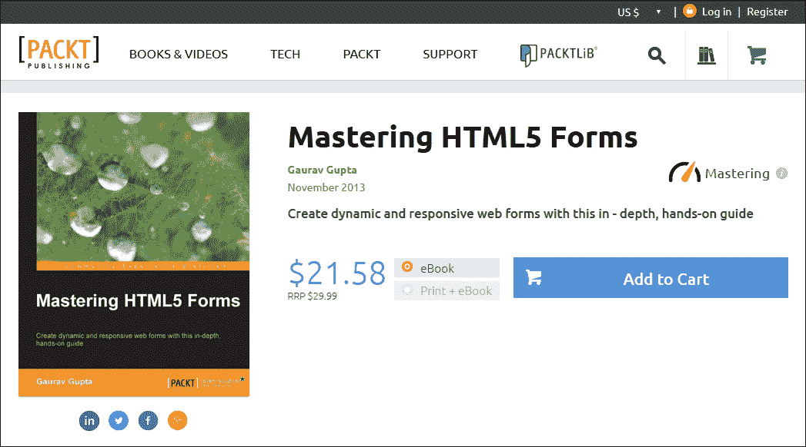
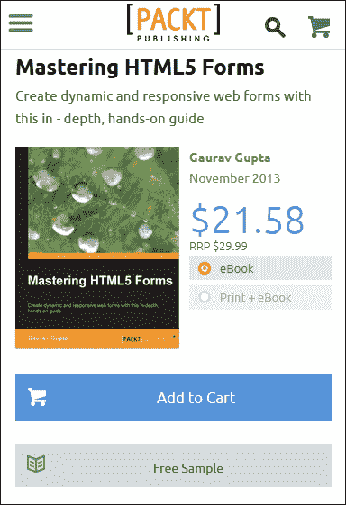
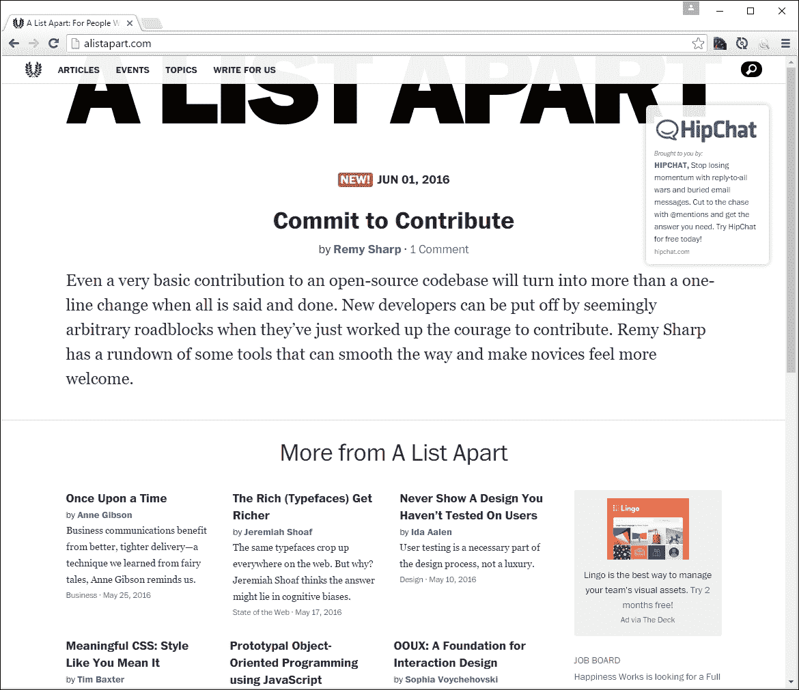
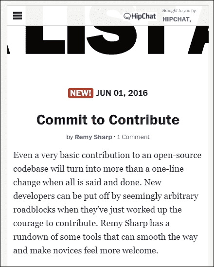
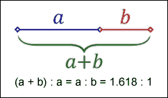
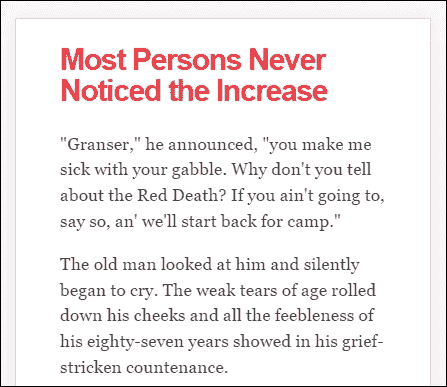
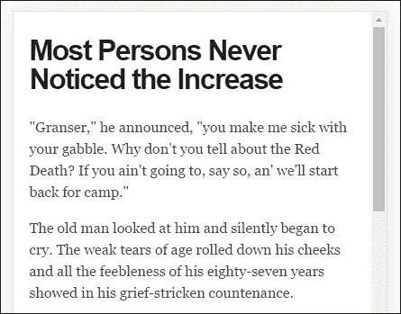
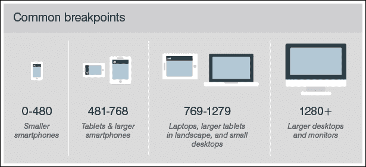
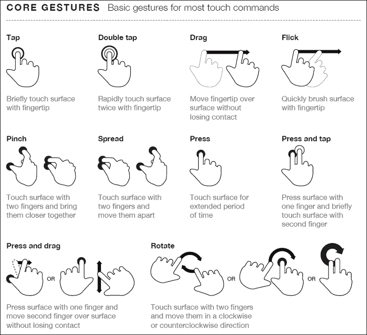
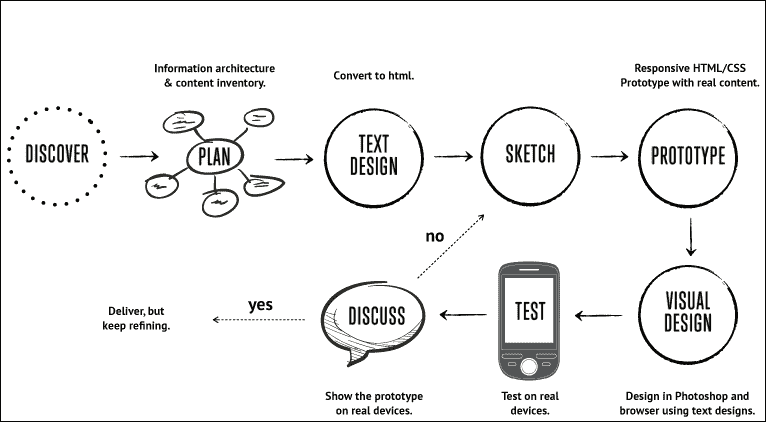

# 第一章：介绍响应式网页设计

网页设计的概念曾经很简单——设计师会为流行的桌面屏幕开发内容，使用适用于大多数设备的布局，以产生布局良好、连贯的页面。

随着技术的变化和移动设备的引入，整个体验发生了变化——静态布局的时代已经过去。取而代之的是需要对可用屏幕房地产做出响应的内容，元素会根据所使用的设备自动调整大小或隐藏。这构成了 Ethan Marcotte 所推广的一种技术的基础，我们现在称之为**响应式网页设计**（**RWD**）。在本章的课程中，我们将开始探索这意味着什么，并了解一些对这个概念至关重要的原则。

在本章中，我们将涵盖以下主题：

+   开始使用 RWD

+   了解 RWD 的元素

+   了解 RWD 的重要性

+   探索 RWD 的工作原理

+   建立开发工作流程

+   探索最佳实践和常见错误

好奇吗？让我们开始吧！

# 开始使用 RWD

如果要用一句话描述 RWD，那么响应式设计描述了内容如何在各种屏幕和设备上显示，如手机、平板电脑、大屏手机或台式电脑。要理解这意味着什么，让我们以水为例。水的性质是它会取决于被倒入的容器的形状。这是一种方法，即网站或网页根据屏幕的大小或分辨率动态调整其布局。这确保用户在使用网站时获得最佳体验。

我们开发一个单一的网站，使用单一的代码库。这将包含流体、灵活的图像，比例为基础的网格，流体图像或视频和 CSS3 媒体查询，以适应多个设备和设备分辨率。使它们工作的关键是使用百分比值，而不是像素或基于 ems 的固定单位大小。

最好的部分是，我们可以在不需要服务器端/后端解决方案的知识或需求下使用这种技术；要看它的效果，我们可以使用 Packt 的网站作为例子。继续浏览[`www.packtpub.com/web-development/mastering-html5-forms`](https://www.packtpub.com/web-development/mastering-html5-forms)；这是我们将在桌面视图中看到的内容：



在较小的设备上查看同一网站的移动视图如下所示：



我们可以清楚地看到相同的核心内容被显示出来（即书的图片、购买按钮、定价详情和关于书的信息），但菜单等元素已经转变为位于左上角的单个下拉菜单。这就是 RWD 的全部意义——产生一个灵活的设计，根据我们选择使用的设备进行调整，以适应所使用设备的格式。

让我们尝试另一个技术网站；我相信你们中的一些人熟悉 A List Apart 网站（托管在[`alistapart.com`](http://alistapart.com/)，由著名的 Jeffery Zeldman 创立）：



尝试调整浏览器窗口大小。这是一个完美的例子，说明一个简单的文本网站如何在最小的改变下重新排列内容；在文本菜单的位置，我们现在有了汉堡图标（我们将在本章后面介绍）：



虽然这个网站的文本重新排列起来并不困难，但似乎顶部的图像效果不太好——它没有随着变化而调整大小，因此在较小的设备上会显得被切掉。

尽管这可能看起来是一个复杂的任务，但实际上归结为遵循一些简单的原则；这些原则的实施最终将决定我们网站的成功。我们已经看到一些在 Packt 和 A List Apart 网站上以不同尺寸使用的原则——让我们花点时间来探讨响应式设计的原则，以及为什么它是创建现代互联网网站的重要部分。

# 探索 RWD 的工作原理

对于一些人来说，我们现在所知的 RWD 的创作通常与 Ethan Marcotte 有关，尽管它的真正起源可以追溯到更早的时候，当时 Audi.com 网站首次创建时，由于当时 IE 的限制，它具有自适应的视口区域。

如果必须描述 RWD 是什么，那么 Ethan 完美地总结了它：

> *与将不同的设计分别适应不断增加的网络设备不同，我们可以将它们视为同一体验的不同方面。我们可以设计出最佳的观看体验，但将基于标准的技术嵌入到我们的设计中，使其不仅更灵活，而且更适应呈现它们的媒体。简而言之，我们需要实践响应式网页设计。*

简而言之，RWD 是关于在不同设备上为客户呈现一种允许他们与您的业务互动的体验。但需要注意的是，体验不必使用相同的流程；更重要的是客户能够达到相同的结果，即使他们可能是通过不同的途径到达的。那么，RWD 是如何工作的呢？

RWD 是我们应该遵循的一套原则，但最重要的理念是使内容流动起来。固定值已经消失，至少对于页面上的元素来说；取而代之的是使用百分比值或 em/rem 单位。我们的页面布局将使用流动网格，根据可用的视口空间自动调整大小。

将有助于确定我们网站成功的一个关键概念并不是我们自动与响应式设计联系在一起的，但它仍然会有所帮助：神圣比例。

神圣比例，或者通常所说的黄金比例，是一种定义美学上令人愉悦的比例的方法——它非常适合设置响应式布局的正确比例。其中的诀窍是使用这个公式：



想象一下，我们有一个宽度为 960px 的布局，我们想将其分成两部分，称为**a**和**b**。神圣比例规定**a**的大小必须是**b**的 1.618 倍。

为了得到我们的列宽，我们必须完成以下计算：

1.  将我们网站的宽度（960px）除以 1.618。这给出了 593px（四舍五入到最接近的整数）。

1.  从 960px 中减去 593px。这给出了 367px。

这是一个简单的公式，但它将有助于改善您网站上内容的传达——我们并不一定非要使用它；互联网上有一些不遵循这一原则的网站。这意味着他们必须确保内容仍然平衡，以产生令人愉悦的效果——这并不容易！

然而，这里重要的一点是，我们不应该为响应式网站使用固定像素值；相反，我们可以使用 rem 单位（它们可以更好地调整大小），或者理想情况下使用百分比值。

为了将这个转化为更有意义的东西，我们可以简单地计算出结果列宽占原始尺寸的百分比。在这种情况下，593px 相当于 62%，367px 相当于 38%。这将给我们类似这样的东西：

```html
#wrapper { width: 60rem;}
#sidebar { width: 32%; }
#main { width: 68%; }
```

好吧，有点理论，但希望你能理解！这是一个简单的公式，但是确保我们得到一个平衡的布局的好方法；使用百分比值（或至少是 rem 单位）将有助于使我们的网站同时具有响应性。

# 理解 RWD 的要素

现在我们已经了解了 RWD，重要的是要理解一些构成我们所知的灵活设计哲学的元素。其中一个关键部分是理解视口或可见屏幕空间；除了视口，我们还必须考虑灵活的媒体、响应式文本和网格以及媒体查询。我们将在本书的后面更详细地涵盖每个部分，但首先让我们快速概述一下构成 RWD 的元素。

## 控制视口

RWD 的一个关键部分是处理设备上的视口或可见内容区域。如果我们在处理台式电脑，通常是分辨率；但对于移动设备来说就不是这样了。

有一种诱惑，想要使用 JavaScript（或类库如 jQuery）来设置视口宽度或高度的值，但其实没有必要，因为我们可以使用 CSS 来做到这一点：

```html
<meta name="viewport" content="width=device-width"> 

```

或者使用这个指令：

```html
<meta name="viewport" content="width=device-width, initial-scale=1"> 

```

这意味着浏览器应该将页面的宽度渲染为与浏览器窗口相同的宽度——例如，如果后者是 480px，那么页面的宽度将是 480px。要看看不设置视口会有什么影响，看一下这个例子的截图：



这个例子是在 Chrome 中显示一些文本，使用 iPhone 6 Plus 仿真模式，但没有视口。现在，让我们查看相同的文本，但这次设置了视口指令：



尽管这只是一个简单的例子，你注意到了什么不同吗？是的，标题颜色已经改变，但更重要的是我们的显示宽度已经增加了。这都是设置视口的一部分——浏览器经常假设我们想要查看内容就像在台式电脑上一样。如果我们不告诉它视口区域已经缩小（并且我们没有正确设置缩放），它会试图把所有内容塞进更小的空间。这将导致页面看起来被缩小了，这样做效果不是很好！

因此，对于我们的设计来说，设置正确的视口并允许其根据设备的大小进行缩放是至关重要的。我们将在第二章中更详细地探讨这一点，*创建流体布局*。

## 创建灵活的网格

在设计响应式网站时，我们可以创建自己的布局，也可以使用已经创建好的网格系统，比如 Bootstrap。关键在于确保我们的布局大小和间距的机制是根据我们想要为用户显示的内容设置的，并且当浏览器的宽度调整时，它能够正确地重新排列自己。

对于许多开发人员来说，标准的度量单位一直是像素值；响应式设计的一个关键部分是转而使用百分比和 em（或者最好是 rem）单位。后者比标准像素更好地进行了缩放，尽管需要一定的信任来习惯使用这些替代单位！

## 媒体响应式设计

布局的两个关键部分当然是图像和文本——前者可能会让设计师头疼，因为简单地使用大图像并设置 overflow:hidden 来隐藏不可见部分是不够的！

响应式网站中的图像必须与用于托管它们的网格一样灵活——对于一些人来说，如果网站内容非常丰富，这可能是一个大问题；现在是一个好时机来考虑一下是否不再需要一些内容，并且可以从网站中删除。当然，我们当然可以简单地对任何不应显示的图像应用`display: none`，根据设置的视口。但是，这并不是一个好主意，因为在应用样式之前仍然必须下载内容；这意味着我们下载了比必要的更多的内容！相反，我们应该评估内容的水平，确保它完全优化，然后应用百分比值，以便在浏览器视口更改时可以自动调整大小。

## 构建适当的断点

有了内容和媒体，我们必须把注意力转向媒体查询——有一种诱惑是创建适合特定设备的查询，但这可能会成为一个维护头疼的问题。

我们可以通过根据内容断点而不是针对特定设备来设计查询来避免头疼的问题——这个技巧是从小处着手，逐渐增强体验，使用媒体查询：

```html
<link rel="stylesheet" media="(max-device-width: 320px)" href="mobile.css" /> 
<link rel="stylesheet" media="(min-width: 1600px)" href="widescreen.css" /> 

```

我们应该以每行约 75 个字符的长度为目标，以保持内容的最佳长度。

# 欣赏 RWD 的重要性

因此，我们已经探讨了 RWD 的工作原理，以及构成这一理念的一些关键元素；问题是，为什么考虑使用它如此重要？将响应能力纳入我们的网站中有几个好处，包括以下几点：

+   用户与您的网站进行交互会更容易，如果它被设计为适用于多个设备。

+   创建一个适用于多个设备的单一网站本身可能需要更多的努力，但这样做的好处是我们只开发一个网站，而不是多个版本。

+   构建一个基于特定视口中可以显示多少内容的网站，比依赖可以被伪造和容易出错的浏览器代理字符串更有效地在屏幕上呈现内容。

+   RWD 能够适应未来的变化。如果我们仔细规划我们的网站，我们可以构建适用于已经在使用和尚未上市的设备的媒体查询。

## 使我们的网站易于访问和直观

可访问性在响应式设计中起着关键作用。我们的内容应尽可能直观，每一条信息都易于访问。响应式设计非常强调使我们的设计不言自明；在网站上访问信息的方式不应该有任何疑问。

### 注意

在这种情况下，可访问性是指使我们的网站在各种设备上可用；这不应与满足残疾人士的需求混淆。为他们提供网站的可访问性同样重要，但不是 RWD 的主要角色。

即使我们的移动版本可能不包含相同的信息（这些信息完全可以访问），它仍然必须是引人入胜的，具有吸引人的颜色，易读的文本（在所有尺寸下），并且设计保持视觉和谐与我们选择的配色方案。

## 组织我们的内容

我们网站的成功取决于一系列因素，其中之一将是我们的内容在布局中的组织方式。内容应该以使其易于处理的方式组织，简单且没有杂乱，并且我们充分利用了我们所针对的设备的可用视口空间。

我们还必须确保我们的内容简洁——我们应该尽量用尽可能少的词语来表达我们的观点，以便移动用户不会浪费时间下载多余的内容。保持我们的选择简单是至关重要的——如果我们使它过于复杂，有很多链接或类别，那么这将增加访问者做出决定所需的时间，并最终只会使他们感到困惑！

在这一点上，值得指出一些事情——随着时间的推移，当谈论响应式设计时，你可能会遇到短语“自适应设计”。两者之间有微妙但关键的区别，我们在构建网站时可以使用其中任何一个原则。让我们花一点时间来探讨每个原则的含义，以及可能影响我们构建网站方式的差异。

# 比较 RWD 和自适应设计

那么，什么是自适应设计，它与响应式设计有何不同？

响应式设计是指使一个设计适应多种设备——这要求我们为网站创建最佳的视图解决方案，无论我们使用哪种设备。这意味着我们不应该不必要地调整大小、滚动或移动；例如，如果我们的页面宽度不适合我们使用的屏幕，那么我们的设计就不正确！不过，最终我们可以将响应式设计视为一个可以自动增大或缩小的球，以适应多种大小的篮圈。

保持篮圈的类比，自适应设计的原理是我们有多个可用的布局；浏览器将根据检测到的设备类型选择要使用的正确布局。在这种情况下，我们将根据使用的篮圈大小将几个不同的球投入不同大小的篮圈。然而，关键的区别在于响应式设计侧重于客户端开发；自适应设计主要使用服务器端检测来显示最适合的页面，根据用于浏览网站的设备。

### 注意

在本书中，我们将在文本中使用响应式设计来完成所有示例。

现在我们了解了使用 RWD 的重要性以及它与自适应设计的区别，让我们真正开始我们的旅程；我们的第一步是准备好我们的开发环境以供使用。在这一点上，你可能期待下载许多不同的插件或使用 jQuery 等库。你可能会有一点惊喜！

# 准备我们的开发环境

好了，我们已经涵盖了足够的一般背景知识；是时候更加实际了！

在构建响应式网站时有许多可用的工具；当然包括 JavaScript 或 jQuery 等工具，还有像 FitVids（用于管理响应式视频）或 ResponsiveSlides（用于创建响应式走马灯）等插件。

不过，我们不会使用任何插件。我们只需要一个文本编辑器和一个浏览器，什么都不需要！在完成本书中的练习时，我们不会下载任何东西。

是的，我听到了那些难以置信的感叹。我一定是疯了，我听到你们说。不过，这种方法是有很好的原因的；让我解释一下：

在许多情况下，我看到我们只是简单地使用最新的插件来帮助我们实现结果。通常情况下，这没有什么问题；毕竟，时间压力经常意味着我们无法承担花更多时间来进行更深思熟虑的方法。

不过，我认为我们变得懒惰了。在构建响应式网站时，并不需要许多可用的工具。是时候回归基础了；在本书的过程中，我们将证明我们可以仅仅使用简单的文本编辑器和浏览器来构建响应功能的基础。

不过，这种方法也有一些注意事项：

+   我们构建的许多内容在一些旧版浏览器中无法正常工作——比如 IE9 或更低版本。你必须问自己的问题是：有多少人会在你的网站上使用这些浏览器？如果比例非常低，那么你可以考虑放弃它们；如果不是，那么你需要寻找另一种方法。

+   专注于只使用 HTML 和 CSS 并不意味着我们完全拒绝其他工具；如果我们需要使用它们，那么我们就需要使用它们。然而，我们必须问自己的问题是：我们真的需要使用它们吗？还是我们只是太懒，不愿意从头开始创建东西？

除此之外，我们需要先完成一些管理任务；我们需要一个项目区域来存储我们的内容。我建议在你的 PC 或 Mac 上的某个地方创建一个文件夹来存储文件；为了本书的目的，我假设你已经将其命名为`B03568`，并且它存储在`C:`驱动器上。如果你把它存储在其他地方，那就相应地调整。

接下来，我们需要一份随附本书的代码下载副本——在某些情况下，我们不会涵盖一些更乏味的内容，而是专注于真正重要的内容；我们可以从代码下载中获取那些不太关键的文件。

最后，你有喜欢使用的文本编辑器吗？如果没有，那么你可能会喜欢看看 Sublime Text 3；这是我们首选的编辑器。使用它的真正好处在于我们可以添加插件，比如 REM-PX（可从[`packagecontrol.io/packages/REM%20PX`](https://packagecontrol.io/packages/REM%20PX)获取），它非常适合将像素转换为 rem 单位的值！（我们将在后面的章节中更详细地介绍这个）。

好的，我们继续前进；我们旅程的下一阶段是考虑创建响应式网站的合适策略。这并不是什么非常复杂的事情，更多的是关于做出一些明智的选择，决定我们应该使用哪种方法最适合我们的解决方案。让我们花点时间来探讨这在实践中意味着什么。

# 考虑一个合适的策略

作为开发者，我相信你一定想着着手创建你的下一个杰作，对吧？听起来很熟悉；毕竟，这就是帮助我们支付账单的方式…

在我们开始编写代码之前，我们必须制定一些策略，这可以简单也可以复杂，取决于我们的需求。虽然定义基本规则很重要，但我从来不是一个坚持原则的人；相反，制定一套遵循的准则和原则意味着我们可以灵活地处理问题，同时保持一致性。

有一些指导方针我们应该尽量纳入到我们的开发过程中，这些更多是帮助我们在第一次开发响应式网站时减少任何不清晰的地方：

+   **选择移动端而非桌面端**：这并不是一个新概念；在响应式设计成为创建网站的一种严肃方法之前，它就已经存在了。移动优先的概念意味着我们应该先为较小的移动设备开发内容，然后再逐步扩展到平板电脑和桌面设备。在这个阶段，重要的是要意识到访问者可能在你当前的网站上使用什么设备；这将有助于确定我们应该集中关注哪些设备作为我们设计的一部分。

+   **断点**：正确设置这些对于我们构建的任何网站的成功至关重要；我们不仅必须选择适合我们想要支持的设备的正确阈值，还必须确保切换点不会彼此重叠。一个常见的误解是开发标准的断点，比如桌面或平板电脑；相反，我们应该设置我们的断点，以便在我们的布局中内容发生断裂时启动。这个截图展示了我们在设计中必须考虑的阈值类型：



+   **内容的流动**：当我们开始为较小的屏幕设计时，内容自然会被挤压并向下流动。如果你习惯于在设计时使用像素和点，这可能是一个难以理解的概念，但一旦你习惯了内容在响应式设计中向下流动的方式，它就会变得合理起来。

+   **相对单位**：这是响应式设计中的一个重要概念。这是一个学习如何从静态值转换为相对单位的过程。用百分比计算数值意味着内容将始终适合，无论视口大小如何；例如，将`<div>`的大小设置为 50%意味着它只会填充其父容器的 50%，无论视口的大小如何。可能需要使用静态值构建初始设计，但我们应该尝试转换为使用百分比作为设计过程的一部分。

+   **最大和最小值**：使用相对值的一部分意味着我们的浏览器不会理解每个元素的下限和上限大小。为了解决这个问题，我们必须设置`min-width`或`max-width`值；这将确保无论我们的元素宽度如何，它们都不会超出代码中设置的限制。

+   **网络字体或系统字体**：如果您已经维护了网站的桌面版本，并且使用了一个或多个网络字体，那么您需要做出重要决定：移动网站是否应该使用相同的字体？问这个问题的原因是因为这需要下载额外的内容；这将消耗额外的带宽，这对于带宽有限的设备来说是一个问题。请记住，任何使用移动设备的人都可能面临时间压力，他们希望快速完成某些事情，而且尽量少麻烦，因此选择非标准字体不会是一个有用的方法。

+   **位图或矢量图像**：在使用响应式设计时，一个关键原则是可伸缩性；我们必须拥有可以轻松调整大小或根据需要更换为更大或更小的图像。在移动设备上采用后一种方法是不明智的；更好的方法是考虑使用矢量图像。这些不仅可以在不损失质量的情况下调整大小，而且如果需要的话还可以使用 CSS 进行操作，这减少了需要相同图像的不同版本（前提是矢量图像在使用 CSS 之前已经进行了优化）。

+   **内容策略**：响应式设计的目标是无论使用何种设备查看网站，都能创造最佳的体验。其中一部分围绕内容展开；作为制定策略的一部分，内容应始终排在首位。我们需要添加足够的内容来使我们的设计成为一个有用的基础；然后我们可以在以后为更大的屏幕和分辨率添加支持时添加或开发这些内容。

+   **草图和原型**：一旦我们确定了内容和管理内容的策略，就该是开发布局的时候了。其中一个关键部分应该包括草图或线框图；这将有助于将计划的粗糙开端转化为更加坚实的东西。许多设计师会使用 PhotoShop，但这有浪费大量可计费时间的风险，这必须与客户核算。在纸上草图是便携的，并且具有较低的视觉和内容保真度，这意味着我们可以专注于内容的互动，而不是外观。

+   **框架**：在我们的开发中使用框架可以为我们的开发过程带来几个好处；它经过验证的代码意味着我们可以减少开发时间，并利用网格方法来构建和完善我们的布局。框架已经在多个设备上进行了测试，因此调试时间减少了；我们应该集中精力选择合适的框架，基于学习曲线、支持和文档可用性等标准。

### 注意

使用框架的一个注意事项是它们的大小；如果我们选择这条路线，我们应该仔细选择要使用的框架，因为许多框架代码量很大，添加额外的不必要代码会使我们的网站变慢。

+   **可伸缩媒体**：图片和视频对于任何网站都是必不可少的；它们不仅可以增加色彩，还可以在较小的空间中传达更多信息。我们所有的图片必须是可伸缩的；无论我们在分辨率增加时是否更换图片，还是使用可伸缩格式如 SVG。我们需要考虑获取标准和高分辨率版本的图片，以满足支持后者的设备；这些可以是单独的，也可以是图像精灵的形式。我们的媒体策略还应考虑使用图标字体，这对于小型、可重复的元素如社交媒体标志非常适合。

+   **最小化**：如果我们正在构建适用于带宽限制和资源有限的设备的网站，那么我们必须考虑最小化我们的 CSS 和 JavaScript 内容。最小化应该是任何开发工作流程的标准部分。我们可以减少向服务器的 HTTP 请求次数，并提高响应时间。在响应式设计时，最小化变得更加重要，因为我们正在添加更多的 CSS 样式（如媒体查询）以适应不同的视口。这将进一步增加我们样式表的大小，所以我们可以尽量减少大小，以鼓励移动设备上新开发的响应式网站的使用。

作为开发人员，我们在创建网站时应该有一定的策略；它不应该太死板，以至于阻止我们改变方向，如果我们现有的计划不起作用。无论我们决定走哪条路，我们都应该在我们的开发工作流程中考虑最佳实践的元素；现在我们可以使用一些提示，让我们更详细地看一看。

# 探索最佳实践

最佳实践...噢...多么糟糕的短语！

这是一个被滥用至死的短语；讽刺的是，当它被使用时，它也并不总是被正确使用！尽管如此，我们可以使用一些指针来帮助设计我们的响应式网站；让我们来看看其中一些：

+   **采用极简主义方法**：这在目前非常流行，非常适合响应式设计。它减少了屏幕尺寸变化时我们需要重新排列的元素数量；如果我们的页面内容较少，还可以更容易地编辑内容和元素。

+   **始终采用移动优先策略**：必须考虑用户在移动设备上的体验。拥有移动设备或手机的比例高于拥有个人电脑的比例；我们必须确保内容在较小的屏幕上既可见又清晰。一旦我们掌握了这一点，我们就可以将我们的设计扩展到更大的屏幕上。

+   **理解速度的重要性**：网站加载慢会让顾客失去兴趣；在测量加载时间时，一个良好的指导是大约 4-5 秒。网站加载慢可能有很多原因，从网站提供源慢到硬件优化不佳，但其中一个较容易纠正的是大型图片。确保您已经检查过所有加载的媒体，并确保它已经完全优化适合您的网站。

+   尽量保持网站设计尽可能简洁：消除任何不必要的东西来传达您的信息。毋庸置疑，但为什么要用 20 个词，当我们可以在 10 个词中传达我们的信息呢？

+   **使用汉堡图标**：不，我不是在指食物，无论大小如何（抱歉，开了个玩笑！）。相反，将其用作访问您的网站的一个一致的访问点。但要注意，用户可能不想一直点击它来访问所有内容，所以如果您有经常使用的菜单项，那么考虑将这些暴露在您的网站上，并将不太重要的内容隐藏在汉堡图标下。

+   **不要使用小按钮尺寸**：请记住，许多用户将使用手指点击图标，因此任何可点击的图标都应足够大，以便准确点击，并减少因意外点击错误链接而产生的任何挫败感。

+   **熟悉媒体查询**：正如我们将在第四章中看到的，*探索媒体查询*，我们可以使用媒体查询来控制在不同设备上的特定条件下显示内容。这在响应式设计中起着关键作用；我们需要根据我们需要支持的内容来获得正确的查询组合！

我们可以遵循很多最佳实践，但我们不应该盲目地遵循它们；除了我们的网站失去任何*突出*吸引力的风险（即，都是一样的），并非所有最佳实践都适用，甚至准确。

相反，值得研究其他人在网上所做的事情；随着时间的推移，您将开始看到共同的主题-这些主题应该成为您在设计网站方面进行讨论的基础。

有一些实践我们应该遵循，不一定是因为它们是最佳实践，而更多是出于常识；触摸是一个很好的例子。当我们设计触摸时，有一些指针我们应该使用，这些指针将影响我们的设计，所以让我们更详细地看看这些。

## 为触摸设计

尽管有很多提示和指针可以帮助我们改进响应式开发，但有一个主题值得更详细地探讨-触摸。

为什么？答案很简单-响应式工作不仅仅是写代码；任何人都可以写代码。然而，区别在于，以及将网站看起来和工作的方式。在这一点上付出的关怀将把优秀的网站与其他网站区分开来；为了了解一个人可能经历的决策和思考的种类，让我们看看在设计触摸时可能需要考虑的内容：

+   目标是使用角落。在小屏幕上，左下角通常是最容易访问的；对于平板电脑，上角更好。我们必须考虑将任何呼吁行动按钮放在这些位置，并根据实际情况调整我们的设计以自动重新对齐，如果使用不同的设备。

+   不要使按钮太小。通常，触摸目标（包括按钮）的一个很好的指导是大约 44 点（或 3.68rem）。

+   避免将项目放置得太靠近，以防止某人错误地访问错误的项目。避免界面错误的间距的一个很好的起点是最少 23pt（或 1.92rem）。

+   使用自然的交互，并创建与常见手势良好配合的导航，例如滑动。这个截图显示了我们可以使用的一些示例手势，以及在构建我们的网站时必须考虑的手势：



来源：The Next Web ([*http://www.thenextweb.com*)](http://www.thenextweb.com/)

悬停阶段在响应式设计中是不允许的-这些不存在。任何呼吁行动都应该基于轻触，因此确保您的设计考虑到这一因素。

哦，有一些事情需要考虑！关键是，虽然编写代码很容易，但创建有效的响应式设计需要时间和资源，并且应始终是一个持续的工作，这样我们的设计才能保持新鲜和更新。

现在我们已经探讨了一些指导方针和提示，可以帮助我们进行响应式开发，是时候考虑我们的工作流程了。我们可能已经有一个为制作标准网站而建立的工作流程，转向包括响应式设计可能需要我们对流程进行一些更改，所以让我们去探索一下在使用响应式设计时典型工作流程可能是什么样子。

# 建立开发工作流程

在我们开始工作流程之前，让我问你一个问题：

你的工作流程是否包括规划、创建静态线框图、构建静态设计、添加代码然后测试，最后启动你的网站？听起来耳熟吗？

如果是这样，那就做好改变的准备吧；使用瀑布流流程（与这些步骤相一致）在创建响应式网站时效果不佳；响应式工作完全是敏捷的，正如开发者 Viljami Salminen 在 2012 年所阐述的那样：



来源：Viljami Salminen，2012

尽管他的设计可以追溯到 2012 年，但至今仍然完全有效；在你们都惊恐地举起双手之前，让我解释一下为什么瀑布流的流程对响应式设计不起作用：

+   我们不能指望一次性为我们的网站构建到很多不同设备的支持。我们必须首先专注于小视口，然后逐渐扩大以支持更大的设备，最后是桌面设备。

+   在响应式工作时，我们的重点必须首先放在内容上，而不是布局；原因是我们的媒体查询应该围绕着内容在我们可用视口的宽度改变时断裂的位置构建。这消除了对为特定设备构建的依赖，意味着我们可以构建可以为多个设备提供服务的查询。

我们的开发流程需要是迭代的，主要关注文本和媒体，然后再构建布局。在整个过程中，我们应该与客户保持密切联系，作为每个迭代的一部分；过去那种朝着大揭示的日子已经一去不复返了！考虑到所有这些，让我们更详细地看一下 Viljami 的插图。

## 发现需求

这个初始阶段对于任何网站都是一样的，但对于响应式设计来说尤为重要，因为我们必须支持网站中不同的视口尺寸。这一切都是为了更好地了解客户及其需求。我们必须了解客户的业务，他们的竞争对手，以及他们试图实现的目标。

在这一点上，我们应该问一些问题，比如，“人们为什么会来到你的网站？”，“你试图实现的主要目标是什么？”，“你的主要竞争对手是谁？”我们问得越多，我们就能越多地理解，因此更好地为客户提供建议，以满足他们的需求。

## 规划我们的网站

当我们收集到构建我们的网站所需的所有知识后，现在我们需要规划它的外观。我们可以从最初的概念开始，但与其像以前那样专注于布局，我们应该集中精力放在内容元素上，并创建用户故事和信息架构。然后我们可以将这些放在一个基本的 HTML 线框中。在这个阶段，布局不那么关键；关键是我们在关注页面上的信息位置之前，获得正确的信息视图。

## 设计文本

在这一点上，我们现在需要专注于以文本形式编写我们的内容。这个经常被低估的步骤可能是整个过程中最重要的；没有它，人们就不会来看网站，如果我们不知道将填充其中的内容，设计布局也就没有意义！一个有用的提示是尽量保持样式的最小化，集中精力放在内容上；至少最初，我们可以看到它将以长格式连续显示，并且它是否适用于使用屏幕阅读器的人。不过，不要担心，我们总是可以在原型制作阶段对文本进行完善；在这一点上，我们需要一些东西作为起点，但第一次很难做到完美。

## 勾画我们的设计

对于下一步，忘掉使用 PhotoShop；它太慢了，而且很难快速进行更正！敏捷过程是关于快速和轻松地进行更改，没有比传统的纸和笔更好的媒介了。我们甚至可以打印出纯文本内容并进行草图，如果有帮助的话，这将为我们节省数小时的开发时间，甚至有助于减少那些你遇到开发者瓶颈时的场合……现在怎么办？

## 原型设计和创建

设计草图完成后，现在是创建原型的时候了。这时我们可以看到布局如何响应不同的视口大小，并且可以突出任何潜在的挑战，或者对客户报告的任何问题做出反应。了解各种断点是很好的，但最终我们应该让我们的内容决定设计中应该设置这些断点的位置。

我们可能习惯于使用 PhotoShop 来制作我们的设计原型，但更好的选择是切换到使用浏览器。我们可以使用 Proto.io（[`proto.io/`](https://proto.io/)）或 Froont（[`froont.com/`](http://froont.com/)）等服务。这给了我们更多时间来解决更难的元素，比如排版；它还有助于消除我们可能在使用 PhotoShop 等工具时遇到的任何限制。

## 测试我们的设计

尽管我们可能仍处于原型阶段，但早期引入测试是很重要的。我们设计中可能会有很多断点，这意味着在多个设备上进行测试需要时间！作为一个替代方案，我们可以进行多次测试和揭示，而不是进行一次大规模的测试和揭示。这有助于减少任何回滚的影响（如果某些东西不符合要求），还有助于让客户参与项目，因为他们可以看到开发过程中的进展。

我们绝对必须做的一件事是在多个设备上进行测试。维护这些设备的测试套件是一项昂贵的工作，所以值得向同事、朋友和家人询问是否可以帮助进行测试。他们至少可以浏览网站，并帮助确定哪些地方“看起来不对”（用客户的说法）。我们需要找出根本原因，并实施修复以改善用户体验。

# 探索错误

尽管我们尽了最大努力，但我们只是人类；有时会犯错！正如剧作家奥斯卡·王尔德曾经说过，“……犯错一次是人性，犯错两次就是粗心大意。”希望我们不会犯错到那个地步，但在响应式工作中经常会犯一些常见的错误；让我们来看看前五名候选人：

+   **未考虑触摸输入**：这可能看起来很奇怪，但未考虑触摸输入是非常常见的！一些用户希望网站“简单地工作”，并且在桌面和移动设备上都有一致的方法。这将包括任何激活链接的机制（如按钮）。在桌面客户端上可能有效的东西，在移动设备上很可能会失败。我们绝对必须包含一些东西，以允许移动用户使用触摸在网站上导航。这可以（主要）通过 CSS3 样式来实现，所以没有借口！

+   **坚持一致的导航**：创建成功的网站的一部分将是拥有一些保持在所有页面上一致外观和感觉的导航；但这并不意味着我们必须将这一点延续到移动设备上！移动设备上的导航当然会有不同的作用；我们还有额外的触摸输入要考虑，作为我们设计的一部分。至少，链接和按钮，以及我们选择的字体和颜色应该保持一致；按钮的大小，我们的视觉布局，以及我们点击按钮的方式可能会改变。

+   **建立与非移动友好内容的链接**：你有多少次通过移动设备访问内容，结果发现是一个巨大的图片或大量的文件需要下载？我敢打赌这让你恼火。确保你的内容适合在不同设备上下载。在桌面宽带连接上，我们可能不会在意使用 100Kb 的图片；但在 3G 连接上加载这些图片，很容易看出为什么我们需要重新考虑我们之前在标准宽带连接上使用的内容。

+   **忽视性能**：在现代宽带连接的时代，我们很容易对可供下载的内容变得自满。如果我们首先考虑桌面，那么在设计我们的移动网站时就会给自己制造一个真正的问题！我们不能将桌面环境压缩成移动体验——这不会高效，会提供糟糕的用户体验，并最终导致销售转化率下降。为了避免性能问题，我们应该以极简或*移动优先*的方式作为我们网站设计的基础。

+   **测试**：一个常见的错误是我们没有充分地在多个设备上测试我们的解决方案，在发布之前运行它们将揭示任何需要在我们的解决方案可供普遍使用之前解决的用户体验问题。一个难点可能是我们要测试多少设备的问题。如果我们可以访问网站现有桌面版本的分析数据，那么这应该给我们一个起点，我们可以用来双重检查我们的设计是否按预期工作。如果没有，我们可以利用浏览器中的设备模拟器进行一些基本检查。我们还可以使用在线测试服务，比如 MobileTest.me ([`mobiletest.me`](http://mobiletest.me))，以确保我们的设计足够地适合更广泛的使用。

这些常见问题可以通过对我们的开发工作流程进行一些简单的更改来轻松解决，至少在一开始就避免这些错误，将会在开发过程中节省很多烦恼！

# 总结

RWD 的理念为我们作为设计师开辟了许多机会。随着移动和其他互联网设备的出现，重要的不仅是转变，还要了解如何做到正确。我们已经涵盖了关于 RWD 的许多有用的主题，所以让我们花一点时间来反思一下你在本章学到了什么。

我们以对 RWD 的温和介绍开始，然后探讨了使我们的网站响应式的基本原则，并理解了组成 RWD 的一些关键元素。

然后我们继续探讨了 RWD 作为一套我们可以遵循的指导原则的重要性；我们探讨了这与自适应设计的比较，以及响应式设计可能更难实施，但随着时间的推移是值得的努力。

接下来我们来看一下策略——我们涵盖了正确理解的重要性，以及在朝着响应式工作的过程中应该考虑的不同元素。我们看了一些我们可以遵循的最佳实践，并强调了为触摸设计是这些准则的一个关键部分，以阐明我们在开发过程中需要做出的一些决定。

然后我们用一个广泛的视角来结束这一章，创建一个开发工作流程。我们探讨了我们可能需要对现有流程进行更改，以及必须纳入我们的开发的一些主题，然后讨论了一些可能会让我们失误的地方！

哇，这里有很多细节！不过好在我们已经涵盖了许多我们需要考虑的战略问题；现在是时候将其中一些付诸实践，开始建立内容和布局了。让我们继续，开始看看我们如何构建灵活的网格布局。这将是我们旅程中下一章的主题。
