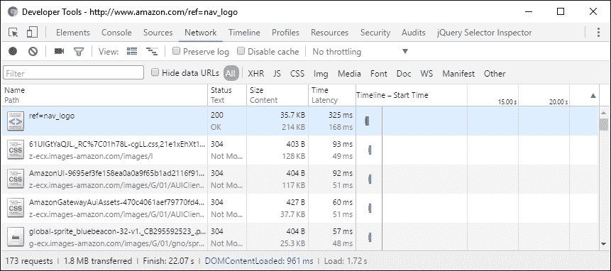
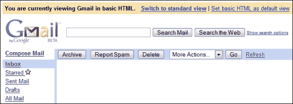
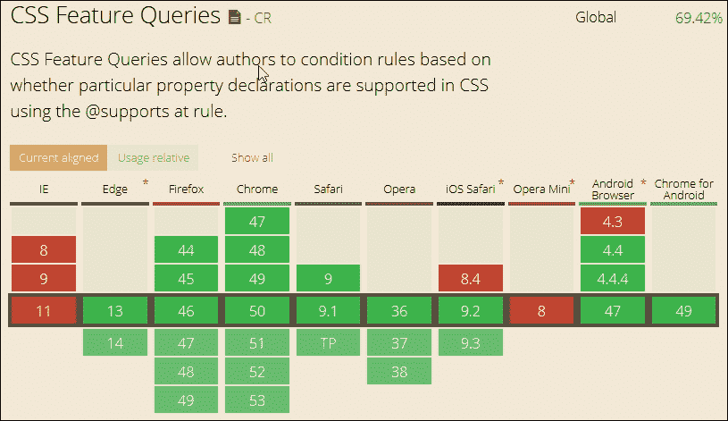
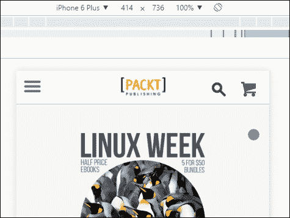
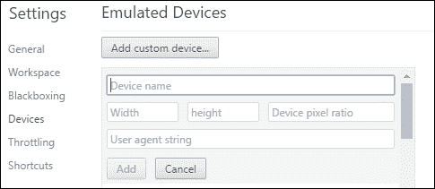

# 第五章：测试和优化性能

在本书的过程中，我们已经探讨了响应式网页设计的一些基本要素，使用了 HTML5 和 CSS3，并学会了如何修改我们的代码，使内容在不同设备上响应。

我们应该记住，仅仅构建一个响应式网站是不够的，我们还必须测试和优化内容，使其在不同设备上尽可能高效地运行。如果我们网站上的页面加载缓慢，那显然是一个问题。在本章的过程中，我们将看一些我们可以使用的技巧和窍门，开始确保我们的网站足够响应，并且内容加载迅速。

在本章中，我们将涵盖以下主题：

+   探索页面加载缓慢的原因

+   优化我们网站的性能

+   测量网站性能

+   测试跨浏览器兼容性

+   探索最佳实践

好奇吗？让我们开始吧！

# 了解速度的重要性

使用可以访问互联网的不同设备的出现意味着速度至关重要——从托管服务器下载内容所需的时间以及用户与网站互动的速度对于任何网站的成功至关重要。

为什么重点关注我们网站在移动设备或屏幕分辨率较低的设备上的性能？有几个原因，包括以下：

+   近 80％的互联网用户拥有智能手机

+   大约 90％的用户通过移动设备上网，其中 48％的用户使用搜索引擎来研究新产品

+   大约 72％的用户会在加载时间超过 5-6 秒时放弃网站

+   移动数字媒体的使用时间现在显著高于桌面使用

如果我们不考虑这样的统计数据，那么我们可能会继续构建我们的网站，但最终会导致客户失去收入和市场份额，如果我们没有充分考虑我们的网站应该在何处运行的范围。与此同时，还有性能的问题；如果我们的网站速度慢，那么这将使客户失去兴趣并导致销售额下降。

旧金山基思度公司进行的一项研究表明，移动用户在关闭网站并对其失去信心之前等待 6-10 秒。与此同时，Guy Podjarny 为 Mediaqueri.es 网站（[`mediaqueri.es`](http://mediaqueri.es)）进行的测试表明，我们经常为大屏幕和小屏幕下载相同的内容；当然，只要进行一些简单的更改，我们就可以根据需要调整内容以更好地适应台式电脑或移动设备！

那么，我们能做些什么？在开始探索何处进行更改之前，让我们看一看网站运行缓慢的一些原因。

# 了解页面加载缓慢的原因

尽管我们可能构建了一个在多个设备上运行良好的网站，但如果速度慢，那还是不够好！当然，每个网站的运行方式都不同，但有一些因素需要考虑，这些因素可能会影响页面（和网站）的速度：

+   **不必要地下载数据**：在响应式网站上，我们可能会隐藏在较小设备上不显示的元素；在代码中使用`display: none`意味着我们仍然下载内容，即使我们在屏幕上没有显示它，这导致网站加载缓慢和带宽使用更高。

+   **在缩小图像之前下载图像**：如果我们没有使用适当大小的图像优化我们的网站，那么在移动设备上可能会下载比必要更大的图像。当然，我们可以通过使用基于百分比的大小值使它们变得流动，但如果原始图像仍然太大，这会给服务器和浏览器增加额外的需求来调整它们的大小。

+   **网站上使用复杂的 DOM**: 在创建响应式网站时，我们必须添加一层额外的代码来管理不同的设备；这使得 DOM 更加复杂，从而减慢了我们的网站速度。因此，我们必须确保不添加任何不必要的元素，这些元素需要浏览器额外的解析时间。

+   **从外部来源下载媒体或源**: 不言而喻，这些不在我们的控制范围内；如果我们的网站依赖于它们，那么如果这些外部来源失败，我们的网站速度将受到影响。

+   **使用 Flash**: 依赖 Flash 的网站显然比不使用该技术的网站加载速度慢。值得考虑的是，我们的网站是否真的需要使用它；Adobe 最近的变化意味着 Flash 技术正在被淘汰，而更倾向于使用其他方式进行动画，比如 HTML5 Canvas 或 WebGL。

还有另一个要考虑的问题，我们在这个列表中没有涉及；自从九十年代中期互联网诞生以来，页面的平均大小显著增加。尽管这些数字可能不是 100%准确，但它们仍然给人一种明显的印象：事情已经发生了变化。

+   **1995 年**：当时，平均页面大小约为 14.1 KB。原因可能是它包含了大约两三个嵌入对象，比如图像。这意味着只需两三次对托管网站的服务器的调用。

+   **2008 年**：平均页面大小增加到约 498 KB，平均使用约 70 个对象，包括对 CSS、图像和 JavaScript 的更改。尽管宽带的可用性增加了，但并非每个人都能负担得起快速访问，因此如果我们的网站加载速度慢，我们将失去客户。

但并非一切都已经失去——我们可以使用一些技巧来帮助优化我们网站的性能。其中许多同样适用于标准网站和响应式网站——让我们更详细地看一下。

# 优化性能

到目前为止，我们已经探讨了我们的网站可能加载缓慢的一些原因，以及如果我们不解决性能问题将面临的后果。尽管我们可能面临的一些问题可能不容易解决，但我们仍然可以做出改变，帮助改善我们网站的性能。

## 从谷歌开始

分析显示，如果页面加载时间超过 4-5 秒，那么客户经常会选择放弃（也就是说，离开）。超过一秒的延迟同样会导致用户体验不佳。

一个很好的资源可以帮助我们了解一些问题的来源，那就是谷歌这个庞然大物。我们可能会批评它过于强大，但它显然知道一些有用的技巧！

谷歌表示，我们的页面不必在 4-5 秒内完全加载，但在此时间内应该可用；任何优先级较低的内容可以放在折叠处或在后台加载。

基本上，谷歌建议我们的服务器响应时间应该小于 200 毫秒——我们还应该探索诸如客户端渲染之类的方面，以帮助减少加载内容所需的时间：

从谷歌开始

尽管大部分内容适用于任何网站，但对于响应式网站来说尤为重要，因为需要额外的代码来管理移动设备的体验。

谷歌还建议我们考虑执行这些任务：

+   最小化呈现内容所需的重定向和往返次数

+   优化 JavaScript 执行和图像大小

+   避免阻止上折内容中的 JavaScript 和 CSS，通过将脚本推送到页面底部

+   减少页面调用的域名数量，有助于避免移动和桌面客户端之间的重定向

此外，我们可以探索使用其他技巧来提高性能。这些包括以下内容：

+   **使用缓存**：我们可以考虑使用这种方法来临时存储不经常更改的数据；如果内容没有更改，它将有助于减少对服务器的请求（因此带宽使用），。随着 HTML5 的出现，我们甚至可以使用离线 AppCache 功能。这还有一个额外的好处，即在我们的互联网访问失败时，可以使内容离线可用。类似的技术也存在于本地存储；虽然默认情况下无法离线使用，但如果需要，它可以用于缓存更持久的内容。

+   **使用可缩放矢量图形（SVG）**：与 JPEG 或 PNG 图像不同，这些图像可以在不损失质量的情况下调整大小，因此非常适合响应式设计；它们的大小通常比等效的标准图像小。但并不是每个应用都适合使用它们，因为它们更适合用于线条绘图或标志。

+   **应用片段缓存**：如果我们生成需要服务器资源来呈现的动态页面，但只有一小部分内容发生变化，那么应用片段缓存意味着我们可以存储不发生变化的内容的静态版本。然后在请求页面时，我们发送缓存的内容，只应用需要更新内容的更改。这减少了对我们的数据库后端的调用次数，因此减少了显示内容所需的资源。

+   **优化数据库**：如果我们的网站是一个内容来自不同来源的网站，那么内容将经常更新；垃圾数据也会同样增加。我们应该定期花时间清理数据库中的内容，以确保它尽可能小而且工作效率高。

## 进一步进行

如果我们想进一步探索，那么有一些更先进的、侵入性更大的改变可以帮助优化我们的网站。这需要更多的工作，因此应该计划为长期改变：

+   **启用 GZip 压缩**：我们可以使用这个来压缩资源，这将使页面加载更快。但是，这不应该在没有计划的情况下应用于整个网站；一些元素，如 CSS 或 JavaScript，在开发过程中可以进行压缩或缩小，因此应用 GZip 压缩不会产生任何好处。

+   **选择我们的主机**：有数十个主机可供选择；每个主机都将提供不同级别的功能和性能，这可能会影响我们网站的运行。选择合适的主机需要花时间；值得比较不同的主机，看看它们的表现如何，并从其他人那里获得推荐，看看谁在较长时间内表现良好。

### 提示

查看[`www.whoishostingthis.com`](http://www.whoishostingthis.com)上的公司评论，看看它们与其他公司相比如何。

+   **排除不需要的内容或媒体**：这几乎是不言而喻的，但我们不应该加载不需要的内容！理解客户需求是关键；如果客户坚持要在台式机和移动设备上提供所有内容，那么有必要向他们解释为什么这不是一个好的做法，并鼓励他们明白，在移动设备上提供较少的内容并不一定会导致糟糕的用户体验。

+   **探索使用内容交付网络（CDN）**：这有助于更快地呈现内容，因为它是从距离客户端最近的本地服务器获取的。内容通常上传到一个中心点，然后复制到世界各地的几个关键服务器；这减少了内容传输的距离和呈现屏幕上内容所需的时间。

+   **限制 HTTP 请求**：作为开发的一部分，我们应该考虑网站将需要向服务器发出的 HTTP 请求的数量，并努力尽量减少这些请求。这种减少将有助于减少网络流量并提高性能，因为我们不需要频繁访问 DOM，也不需要等待内容下载的时间太长。我们可以使用工具，比如创建图像精灵或预处理器将多个 CSS 文件合并成一个，来帮助尽量减少 HTTP 请求。

优化网站需要时间，但在精炼网站上花费的努力将会带来增加的赞助和最终增加的销售额。问题是，除非我们测试它，否则我们不会知道我们的网站表现如何；让我们更详细地探讨一些可以帮助我们评估网站运行情况的工具。

# 测试我们网站的性能

我们构建了响应式页面，改善了外观和感觉，也优化了网站的性能。但在应用上线之前，开发人员（或专门的测试人员）有责任测试网站的性能。

有一组工具可以使用：

+   **mobiReady**（[`ready.mobi/`](http://ready.mobi/)）：这个免费工具用于测试响应式网站在不同分辨率下的性能。它根据诸如发送或接收的数据和发出的请求数量等因素，给每个页面打分，最高分为五分。

+   **Webpagetest**（[`www.webpagetest.org/`](http://www.webpagetest.org/)）：这个在线工具可以帮助我们测试网站的性能，针对我们想要的特定位置和浏览器。我们可以测试页面的许多不同因素，比如缓存静态内容、有效使用 CDN，或者是否启用了持续连接。

+   **Google 的 Pagespeed Insights 工具**（[`developers.google.com/speed/pagespeed/insights/`](https://developers.google.com/speed/pagespeed/insights/)）：使用这个工具，我们可以对我们的响应式网站的速度进行分析，包括桌面和移动版本。这个工具根据网站的速度和用户体验给出 100 分的评分，并提供一个我们可以修复的指针列表，以及如何修复的详细信息。

+   **IntoDns.com**（[`www.intodns.com/`](http://www.intodns.com/)）：虽然这不是一个性能测试工具，但它可以帮助确定我们的 DNS 是否影响了网站的性能。它提供了网站和邮件服务器的报告，我们可以用来解决问题，最终帮助保持性能达到最高效率。

+   YSlow（[`yslow.org/`](http://yslow.org/)）：这个书签工具可以根据三个预定义的规则集或我们定义的自定义规则集对任何选择的网站进行评分。它根据不同数值的数组提供建议，比如 DNS 查找、使 AJAX 可缓存、避免 CSS 表达式和配置 eTags 等，来帮助我们改善页面的性能。

这些是一些有用的工具，可以帮助我们提高网站的性能和优化（还有很多在线工具可用）。然而，如果我们只专注于这些工具，我们就会错失一个机会。那么，我们可以利用浏览器中已有的功能呢？

大多数（如果不是全部）浏览器都内置了某种形式的 DOM 检查器，或者可以作为独立选项使用。这些工具可以提供一些有用的信息，可以作为对外部服务更深入详细信息的前提。为了看看可能性，让我们探索一下，如果我们在 DOM 检查器中对一个网站进行简单检查，我们可以得到什么；在这个例子中，我们将使用在线零售的权威亚马逊进行相同的测试两次：第一次将作为桌面浏览器，第二次将作为（模拟的）移动版本，使用 Chrome 内置的 DOM 检查器。

## 通过桌面示例进行工作

对于我们的测试，我们将从桌面浏览器开始——我们将使用谷歌的 Chrome，因为它有一套很好的工具；其他浏览器也可以使用，但可能得不到完全相同的结果。让我们开始吧，以亚马逊作为我们测试的基础：


我们需要做的是：

1.  启动 Chrome，然后按下***Shift*** + ***Ctrl*** + ***I***显示开发者工具栏。

1.  寻找窗口左上角的红色录制按钮，然后点击它。

1.  回到 Chrome 的窗口，然后浏览到[`www.amazon.com`](http://www.amazon.com)。页面加载完成后，点击红色的录制按钮停止录制。

此时，我们将得到一组结果，可以浏览类似于这个摘录：



起初，这些结果可能看起来毫无意义，但我们想要的细节在窗口底部。


这显示了发出的服务器请求数量，传输的内容量以及初始解析 DOM（`DOMContentLoaded`）所花费的时间；然后，完全下载内容（由**Finish**和**Load**事件的触发来指示）。

### 注意

请注意，`DOMContentLoaded`时间仅与解析文档有关，并不考虑其他资源（如脚本、图像或外部样式表）是否已下载。

尽管亚马逊的网站下载了相当数量的内容，但他们巧妙地利用了我们所介绍的一些技巧，帮助减少带宽使用并提高页面渲染速度。我们如何知道呢？尝试点击屏幕截图中显示的最后两个链接（或者浏览器中显示的资产列表中的链接 4 和 5）。

第一个链接显示了一个压缩的 CSS 样式表；如果我们仔细观察，可以推断出其中一些链接是使用自动化过程生成的。一个示例中的 PNG 文件名超过 70 个字符！使用长名称会增加文件大小；图像需要准确命名，但文件名长度要合理！

考虑到页面的大小和请求的数量，可能会认为这个网站面临性能问题。然而，如果我们仔细观察，就会发现很多内容是在后台加载的。这意味着我们仍然提供了良好的用户体验，优先加载了内容，次要内容在后台加载。

### 注意

要了解 Chrome 开发者工具中网络选项卡中所有设置的含义，可以查看谷歌开发者网站上的主要文档，网址为[`bit.ly/2ay9H8g`](http://bit.ly/2ay9H8g)。

现在让我们改变方向，关注在移动设备上查看相同的网站——这次是 iPhone 6 Plus。

## 在移动设备上查看

我们再次进行相同的测试，但这次将 Chrome 设置为模拟 iPhone 6 Plus，然后我们应该看到这样的结果：


真正的测试在于请求的数量，数据传输量和页面加载所花费的时间。这一次，我们的浏览器发出了 103 个请求，从服务器传输了 1.8 MB 的数据，并在大约 12 秒内完成了总下载：


在这里，我们可以清楚地看到，为了为客户提供最佳的用户体验，亚马逊巧妙地减少了页面大小和请求的数量。

我们应该不断监控我们的网站性能；随着 CSS3 属性的频繁添加或更新，我们可以开始更新我们的网站，并开始减少对外部库的依赖，从而提高网站的速度，最终提供更好的用户体验。

# 最佳实践

在这一部分，您将学习一些最佳实践和范例，这将帮助我们实现网页开发的实际目标：

+   **砖头优先设计范式**：在构建响应式网站时，最好的做法是以移动设备为基准，然后再添加额外功能以适应桌面使用。我们的思维应该是尽量满足移动设备用户的最低要求。

今天，我们知道每年移动设备销售的主要部分已被智能手机超越。尽管有很大比例的用户不经常购买移动设备，他们仍然拥有能够支持 Web 应用甚至本地应用的设备。除此之外，我们仍然有那些使用一些旧一代智能手机的人。我们甚至可以加入其他设备，如 Kindle 和半网页能力设备；如果我们加上这些数字，我们可能会达到一个惊人的总数！

现在针对这个庞大的受众，让我们考虑一些情况：

+   他们不会进行研究

+   他们不会阅读长篇文章

那些使用较旧手机的用户可能需要使用类似普通座机电话的标准键盘来浏览页面，而不是使用标准键盘。

较旧设备屏幕的小尺寸使得提供移动优先布局更加困难；这使得我们只显示这些用户所需的基本内容变得更加重要，其他元素应该从显示或下载中移除。

# 为旧浏览器提供支持

另一个最佳实践是为那些功能有限且不如今天的移动设备快速的旧设备改善我们网站的性能。

我们知道自从有了互联网，我们就有了用来显示内容的网络浏览器。我们不应忘记仍然有用户使用缺乏现代功能的旧移动设备；我们可以使用优雅降级来处理这个问题。

优雅降级是一种策略，用于处理不同浏览器的网页设计。如果我们使用优雅降级策略构建网站，那么它首先是为现代浏览器设计的，然后是为具有较少功能的旧浏览器设计。它应该以这样一种方式退化，使得我们的网站在外观和功能上仍然良好，但功能较少。

### 注意

请注意，优雅降级并不意味着我们告诉用户下载最新的浏览器来查看我们的网站。

但是今天的现代设计师和开发人员不喜欢这种方法。主要原因是这经常变成了一个要求，即我们的用户应该下载最新和更新的浏览器才能查看我们网站的最佳视图。我们应该记住这不是优雅降级。

如果我们要求用户下载现代浏览器，那意味着我们正在使用以浏览器为中心的方法。一些我们应该记住的关于优雅降级的点，同样也适用于渐进增强：

+   我们应该编写符合标准的有效 HTML。

+   我们应该使用外部样式表

+   我们应该始终将我们的脚本链接到外部。

+   我们应该确保我们的内容对没有 CSS 或 JavaScript 的旧浏览器是可访问的。

## 考虑支持哪些功能

在开发响应式网站时，我们应该检查我们的目标浏览器或设备是否支持特定功能，而不是简单地假设它可以使用。

例如，如果我们在旧的 Android 手机上安装最新的 Chrome 浏览器，我们可能会认为它会支持最新的功能，比如 CSS 动画、背景视差效果和 WebGL。

但是，这真的是这样吗？如果我们试图在一个不支持旧安卓设备的功能的网站上操作会发生什么？最终结果可能是我们的浏览器变得无响应或崩溃；我们将被迫重新启动它以恢复服务。

最近，安卓用户在这方面遇到了很大的问题，其中最明显受到影响的应用是 Google Talk/Hangout。随着它们的升级，Google 最轻量级的聊天服务因旧设备的性能问题而变得几乎无法使用。

这样过滤掉那些在小屏幕上不太可用且不太相关的功能非常重要。一个很好的例子是使用接近传感器的应用程序。这有助于推动制造商将这成为所有新智能手机的标准功能。

## 让用户选择他们想要的

我们开发了一个引人注目、响应式、动画化和触摸导向的网站，但对于网络连接差或旧设备的用户呢？

如果网站在初始加载或后续页面刷新时出现卡顿，我们应该怎么办？

读者当然会困惑于他们应该怎么做。

这是我们应该做的一件简单的事情。曾经在旧设备或慢的网络连接上运行 Gmail 吗？如果是的话，那么你一定注意到了**加载基本 HTML（用于慢速连接）**，甚至是这个宝石，慢速连接意味着我们可能被迫使用 Gmail 的简单视图，因为慢的网络连接使得使用标准视图变得不可能：



对于那些习惯于高速电缆或宽带连接的精英，他们可能很难相信其他用户没有这种奢侈，被迫使用基本视图，就像我们的例子一样。使用这个选项会加载 Gmail 的基本 GUI 版本，它针对较慢的连接进行了优化，并允许用户与网站进行交互。

这说明了一个很重要的观点——如果一个网站必须使用最新的功能，那么我们应该考虑在我们的应用程序中实现基本或标准模式。我们已经从只有少数网站拥有所有最新功能并获得所有流量的日子中进步了，为用户提供他们在网站上寻找的内容才是他们关心的。

## 我们需要包含整个库吗？

我们应该始终遵循*使用*或*保留*的标准。跟踪所有正在使用的库和模块是困难的；我们必须在使用的库和维护网站速度之间取得微妙的平衡。

现在许多框架和库都有自定义功能的选项；例如，我们可能只需要 jQuery 的一些关键元素（如果我们在使用它），我们可以选择在下载库时排除多余的功能。然而，如果我们仍处于开发阶段，那么我们将需要整个库；我们可以选择运行我们的应用程序所需的部分，然后将其缩小以供生产使用。

# 考虑跨浏览器兼容性

任何开发者心中必须时刻牢记的一个问题是如何在构建网站时保持最大的浏览器兼容性；如果在足够多的浏览器上无法运行，那么 UI 再惊艳也没有用！

任何不支持目标浏览器市场的网站（即，网站受众最多使用的浏览器）都面临失去业务和声誉的风险。这使得我们不仅需要测试我们的网站，而且如果我们正在制作响应式网站，还需要在多个浏览器上进行测试。这种测试是保持客户满意度和市场份额的关键步骤。在我们考虑一些可用的解决方案之前，有许多技术可以帮助减少与跨浏览器兼容性相关的问题，让我们更详细地看看我们面临的一些挑战。

## 概述挑战

任何设计师的乌托邦是拥有一个 100%无 bug 的网站；然而现实是，虽然这总是开发者心中的期望，但却是不可能实现的！

为什么？一个关键考虑因素是 CSS3 的使用（以及现在存在的 CSS4 的元素）；尽管支持不断改进，但在每个浏览器提供对所有 CSS3 属性的一致支持之前还有一段路要走。同样地，对于响应式媒体和媒体查询的支持在旧版浏览器中也不被支持，因此我们必须考虑我们能够为这些浏览器提供多少支持。

考虑可能的解决方案，我们已经提到了对响应式网站至关重要的三个因素，为了解决它们，我们有许多选择。

我们可以（也应该）考虑使用基本内容构建我们的网站，这样可以在任何浏览器上运行；然后通过添加一些可能只对某些浏览器有效但并不是整体用户体验关键的额外功能，逐步增强体验。相比之下，我们也可以认为我们的网站是基于最新技术和浏览器构建的，但随后添加支持，以允许内容在旧版浏览器上优雅降级。

我们能够解决这些问题吗？当然可以，有许多不同的选择。然而，有一点我们应该考虑，使用 JavaScript 解决方案并不一定是最佳解决方案；我们可以使用一些技巧来帮助保持兼容性。在我们讨论这些之前，让我们花一点时间考虑一下在使用 JavaScript 作为解决方案时可用的一些选项：

+   **Adapt.js**：这个脚本不使用媒体查询；相反，它根据浏览器窗口大小等值来确定加载哪个 CSS 文件。该脚本可以从[`adapt.960.gs/`](http://adapt.960.gs/)下载。

+   **Modernizr.js**：这个库允许我们选择要支持的元素，比如 HTML5 的`<video>`元素；当检测到选择的元素正在使用时，Modernizr 为我们提供了一个优雅降级内容的选项，不让我们的网站简单地垮掉！该库可以从[`modernizr.com/download`](https://modernizr.com/download)下载。

+   **Respond.js**：这个解决方案使用 JavaScript 为旧版浏览器（如 IE6-8）提供断点支持，基于我们在配置页面时指定的大小。我们可以以类似的方式使用它，如将设备宽度设置为 414px，以适应 iPhone 6 Plus 的纵向模式。有关该库的更多详细信息和下载，请访问[`responsejs.com/`](http://responsejs.com/)。

尽管这些解决方案都能很好地工作，但它们都有一个固有的缺点——JavaScript！在这个现代时代，大多数浏览器可能默认已经打开了 JavaScript，但也会有一些情况下没有打开；让我们探讨一下为什么使用 JavaScript 并不总是正确的解决方案。

## 理解 JavaScript 的缺点

在任何响应式网站的构建阶段，我们自然需要确定要支持哪些断点。这将基于诸如 Google Analytics 之类的统计数据。然后通常的做法是在我们的 CSS 样式表中使用媒体查询来在需要时加载元素。这对于最近的浏览器（过去一年到十八个月内的任何浏览器）效果很好，但对于旧版浏览器来说，这将是一个问题。

我们可以使用基于 JavaScript 的解决方案来支持它们：

+   我们提到的所有解决方案都需要 JavaScript——如果它被关闭，那么它们显然就不会起作用！

+   一些解决方案使用 AJAX 来获取内容（如 Adapt.js）。这可能会在获取内容时出现短暂的闪烁。开发人员已经尽量将其减少到最低，但无论他们如何努力，都不可能完全消除它；在网站上使用时会显得奇怪。

+   一些解决方案在旧设备上不起作用，Adapt.js 就是一个很好的例子。

+   如果 JavaScript 被关闭，我们可以使用默认样式表，使用`<no script>`标签；问题是，我们支持什么屏幕尺寸？

+   使用 JavaScript 将需要服务器加载额外的资源，这会给服务器增加额外的负担；JavaScript 始终旨在提供额外的功能，并且在该功能对站点的成功运行至关重要时不应使用。

显然，这些缺点使得在使用 JavaScript 时成为一个不太吸引人的选择！然而，我们应该问的两个关键问题是：我们真的需要支持旧的浏览器，比如 IE8，并使用 JavaScript 来支持它们吗？

## 提供基于 CSS 的解决方案

支持哪些浏览器是一个会分裂开发人员和设计师的问题；一方面，我们有创意人员希望利用最新的功能，而另一方面，其他人会说我们必须尽可能支持广泛的浏览器群体。

后者通常需要在旧浏览器中使用 JavaScript；考虑到这需要从服务器调用额外的资源，因此尽可能使用 CSS 是有道理的。为此，我们可以考虑使用相对较新的`@supports`功能（或称为功能查询）。这与媒体查询类似，允许我们根据浏览器中是否支持所选样式来设置元素的样式。这在最近的大多数浏览器中得到了很好的支持（当然 IE 除外，它总是喜欢与众不同！）：



然后我们可以在主要标记中创建这样的代码：

```html
<article class="artwork"> 
   
</article> 

```

当它受支持时，使用这样的代码来设置样式：

```html
@supports (mix-blend-mode: overlay) { 
  .artwork img { 
    mix-blend-mode: overlay; 
  } 
} 

```

然而，如果它不受支持，我们只需添加一个功能查询来使其优雅地降级：

```html
@supports not(mix-blend-mode: overlay) { 
  .artwork img { 
    opacity: 0.5; 
  } 
} 

```

美妙之处在于，我们不依赖任何外部库来支持可能是核心功能的东西；我们可以使用这个来支持新的 CSS3 样式和现有属性。当然，这意味着我们的样式代码库会增加，但这是有限度的，因为增加的是已经被缓存的现有文件，而不是从服务器调用额外的新资源！

# 测试网站的兼容性

在这个阶段，我们的网站将被优化和测试性能，但兼容性呢？

尽管可用浏览器的范围保持相对静态（至少对于主流使用的浏览器），但它们提供的功能不断变化；这使得开发人员和设计师难以处理支持每个浏览器所需的所有细微差别。

此外，广泛的范围使得支持成本高昂。在理想的世界中，我们会支持每个可用的设备，但这是不可能的；相反，我们必须使用分析软件来确定哪些设备正在使用我们的网站，因此值得支持。

## 找出解决方案

如果我们在 iPhone 6 等设备上测试我们的网站，很有可能它也会在其他苹果设备上运行良好，比如 iPad。对于在三星 Galaxy S4 等移动设备上进行测试也是如此；如果它们需要进行比其他设备更多的调整，我们可以使用这个原则来帮助优先支持特定的移动设备。

但最终，我们必须使用分析软件来确定谁访问我们的网站；诸如浏览器、来源、操作系统和使用的设备等信息将有助于确定我们的目标受众应该是什么。这并不意味着我们完全忽视其他设备；我们应该尽量确保它们也能与我们的网站配合，但这在开发过程中不是优先考虑的事项。

需要注意的关键一点是，我们不应该尝试支持每一种设备；这样管理成本太高，而且我们永远也无法跟上所有可供出售的设备！相反，我们可以使用我们的分析软件来确定我们的访问者使用的设备；然后我们可以测试一些不同的属性：

+   **屏幕尺寸**：这应该包括各种不同的桌面和移动设备的分辨率。

+   **连接速度**：在不同的连接速度下进行测试将帮助我们了解网站的行为，并确定我们可能需要进行更改的机会或弱点。

+   **像素密度**：一些设备将支持更高的像素密度，这使它们能够显示更高分辨率的图像或内容。在设计网站时（尤其是响应式网站），我们显然希望将我们的内容放在屏幕上的正确位置。高分辨率显示器提供的清晰度使得我们更容易微调如何在屏幕上显示这些内容；这将使查看和修复显示网页内容的任何问题变得更容易。

+   **交互风格**：能够在不同设备上查看互联网意味着我们应该考虑我们的访问者如何与网站进行交互：他们纯粹在桌面上使用，还是使用平板电脑、智能手机或游戏设备？最有可能的是前两者会在一定程度上被使用，但后者不太可能被广泛使用。

一旦我们确定了应该支持哪些设备，那么我们就有一系列工具可供我们使用，来测试浏览器兼容性。这些工具包括物理设备（理想，但维护成本高昂）、模拟器或在线服务（这些可以是商业的或免费的）。让我们看一下可供选择的一些工具，以帮助我们测试浏览器兼容性。

## 探索可用于测试的工具

当我们计划测试移动或响应式网站时，我们需要在开始测试之前考虑一些因素，以帮助交付一个在所有设备和浏览器上看起来一致的网站。这些因素包括回答以下三个问题：

+   网站看起来好吗？

+   是否有已知的错误或缺陷？

+   我们的网站真的是响应式的吗？

为了帮助测试我们的网站，我们可以使用一些可用的工具（付费或免费）；但需要注意的一点是，我们可以通过简单地使用大多数浏览器中可用的开发者工具栏，已经对我们的网站的工作情况有一个很好的了解！

当然，这不是我们绝对依赖的东西，但它提供了一个完美的起点。当我们的需求超出了浏览器提供的功能时，我们总是可以升级到商业选项。让我们简要看一下有哪些可用的选项：

## 使用 Chrome 查看

我们可以通过在 Chrome 中按下***Ctrl*** + ***Shift*** + ***M***来轻松模拟移动设备；Chrome 会在窗口顶部显示一个工具栏，允许我们选择不同的设备：



如果我们点击菜单项（当前显示为 iPhone 6 Plus）并将其更改为“编辑”，我们可以添加新设备；这使我们能够设置特定的尺寸、用户代理字符串以及设备是否支持高分辨率图像：



现在让我们切换一下，看看 Firefox 中有哪些选项。

## 在 Firefox 中工作

响应式设计视图选项可使用与 Chrome 相同的***Ctrl*** + ***Shift*** + ***M***选项；我们也可以通过导航到**工具** | **Web 开发者** | **响应式设计模式**来访问它。

当在 Firefox 中激活模式时，我们可以在不同的屏幕尺寸之间切换：


尽管浏览器在提供网站运行情况的指示方面已经有了一定的进展，但它们只能满足有限范围的视图。有时，我们需要更进一步，使用商业解决方案来同时测试我们的网站在多个浏览器上的运行情况。让我们来看看商业上可用的一些选项。

## 探索我们的选择

如果你花了一些时间开发代码，那么你很可能已经知道 Browserstack（来自[`www.browserstack.com`](https://www.browserstack.com)）。其他选项包括以下内容：

+   **GhostLab**：[`www.vanamco.com/ghostlab/`](https://www.vanamco.com/ghostlab/)

+   **Muir**：[`labs.iqfoundry.com/`](http://labs.iqfoundry.com/)

+   **CrossBrowserTesting**：[`www.crossbrowsertesting.com/`](http://www.crossbrowsertesting.com/)

然而，如果我们只需要检查我们的网站的响应水平，那么我们不需要使用付费选项。有许多网站可以让我们检查，而无需安装插件或额外的工具：

+   **Am I Responsive**: [`ami.responsive.is`](http://ami.responsive.is)

+   **ScreenQueries**：[`screenqueri.es`](http://screenqueri.es)

+   **Cybercrab 的屏幕检查设施**：[`cybercrab.com/screencheck`](http://cybercrab.com/screencheck)

+   **Remy Sharp 的检查站点**：[`responsivepx.com`](http://responsivepx.com)

我们还可以使用书签工具来检查我们的网站在不同设备上的运行情况——可以尝试的一些例子在[`codebomber.com/jquery/resizer`](http://codebomber.com/jquery/resizer)和[`responsive.victorcoulon.fr/`](http://responsive.victorcoulon.fr)；值得注意的是，当前的浏览器已经包含了这个功能，使得书签工具作为一个选项变得不那么吸引人。

# 遵循最佳实践

我们必须问自己的一个关键问题是，在开发网站时，我们将在多大程度上支持特定浏览器的使用。这个问题的答案将在监控分析软件中，确定哪些浏览器正在使用。

在大多数情况下，它应该显示正在使用的现代浏览器，但仍然有一些使用旧浏览器的情况；例如，IE6 仍在使用，尽管其市场份额现在只有微不足道的 0.25%，截至 2016 年 4 月。这引发了一个问题，即如果监控我们网站的分析数据显示，只有一个微小的百分比（例如低于 1%）的用户使用旧浏览器，那么我们可能会决定不支持它们，如果所需的工作量和资源不足以证明从这么小的市场份额中获得回报的话。

这样说，有一些基本的技巧可以帮助我们优化我们的网站：

+   我们应该尽量避免使用 hack。条件注释是一个更好的选择，尽管我们应该定期检查并删除不再适用的样式（例如供应商前缀，它们不再适用）。

+   尽量在你的代码中使用`<!DOCType html>`。这将告诉浏览器它应该遵循 HTML5 规则；如果浏览器不支持 HTML5，它将自动降级。

+   我们可以使用 W3C 验证服务来检查我们的代码是否一致。不过，更好的选择是将其纳入开发过程的一部分；我们可以很容易地用 Node.js 做到这一点，所以它可以自动完成。

+   在现代网站时代，JavaScript 已经成为开发的一个必不可少的工具。很容易就会倾向于使用它，而不真正考虑其他选择。尽量避免使用 JavaScript。它是设计用来补充现有代码的，并且不应该依赖它来提供核心功能。CSS 的状态现在已经是这样，以至于以前只能用 JavaScript 实现的样式功能现在可能用 CSS 实现，并且提供更流畅的结果！

# 总结

在本章中，我们了解了性能是什么，以及如果网站性能不佳会有什么后果。然后，我们探讨了什么因素可能导致我们的网页加载缓慢。在本章中，我们还学习了如何使用在线可用的各种工具来衡量网站的性能，并介绍了我们可以采取的措施来改善网站的性能。然后，我们介绍了一些关于网站性能的最佳实践。

我们接着探讨了保持跨浏览器兼容性的重要性，并考虑了一些可用的解决方案来处理跨浏览器问题。然后，我们讨论了在测试跨浏览器兼容性时所面临的挑战，涉及了各种可用浏览器和设备的组合。除此之外，我们发现了如何解决这个问题并制定策略以获得最大的输出。最后，我们看到了一些在线可用的工具，用于测试我们的网站在各种浏览器和设备组合上的兼容性。我们现在已经完成了创建响应式网站基础知识的旅程。希望您喜欢阅读本书，就像我们写作一样，并希望它能帮助您开始使用简单的 HTML 和 CSS 进入响应式设计的世界。
