# 第二章：创建流体布局

我们在响应式设计的基本知识中的关键部分是在页面上布置内容——在互联网的早期，这是一个简单的过程！

随着移动设备（以及那些非 PC 设备）能够访问互联网，内容布局变得更加关键；例如，我们有多少图片，或者我们是否包含内容 X，或者只显示摘要？这些只是我们可能问自己的一些问题。这表明它可能会引发一系列问题！

为了简化这个过程，我们可以使用网格或基于流体的布局。在本章的课程中，我们将更详细地研究它们的使用；我们将从设置可用的视口开始，一直到未来的基于网格的布局。

在本章中，我们将涵盖以下主题：

+   介绍网格布局并了解不同类型

+   设置可用的视口以供使用

+   探索使用网格布局的好处和机制

+   实施预先构建的网格布局

+   探索基于网格模板布局的未来

好奇吗？让我们开始吧！

### 注意

请注意，这些练习是为 Windows 平台设计的，因为这是作者首选的平台；如果您使用不同的平台，请适当修改。

# 介绍灵活的网格布局

多年来，设计师们建立了不同类型的布局；它们可能只是一个名片网站，也可能是一个用于内容管理系统（如 WordPress 或 Joomla）的主题。通过不同设备访问互联网的迅猛增长意味着我们不能再创建与特定设备或尺寸绑定的布局——我们必须要灵活！

要实现这种灵活性，我们需要在设计过程中接受一些变化——首先是我们应该创建的布局类型。其中一个关键部分是使用百分比值来定义我们的布局；我们可以利用经过试验和测试的预定义网格系统作为未来设计的基础，而不是从头开始创建某些东西。

讽刺的是，有很多网格系统争相吸引我们的注意，因此，让我们毫不犹豫地开始探索不同类型的布局以及它们与响应式设计的比较。

# 了解不同的布局类型

多年来，困扰网页设计师的一个问题是他们的网站应该使用哪种布局——应该是流体的、固定宽度的、具有弹性的，还是混合这些布局优势的混合版本？

我们选择使用的布局类型当然取决于客户的要求——将其设置为流体布局意味着我们实际上更接近于使其响应式；不同之处在于后者使用媒体查询来允许不同设备上的内容调整大小，而不仅仅是普通的桌面！

为了了解差异以及响应式布局的比较，让我们依次快速看一下每种布局：

+   **固定宽度布局**：这些布局受限于固定宽度；一个好的尺寸大约是 960 像素，因为这可以平均分成列，没有余数。缺点是固定宽度对可用视口区域做出了假设，如果屏幕太小或太大，就会导致大量滚动，影响用户体验。

+   **流体布局**：我们使用基于百分比的单位，而不是使用静态值；这意味着无论浏览器窗口的大小如何，我们的网站都会相应调整。这一举措一下子解决了围绕固定布局的问题。

+   **弹性布局**：它们类似于流体布局，但约束是通过类型或字体大小来衡量的，使用 em 或 rem 单位；这些是基于定义的字体大小，因此 16px 是 1 rem，32px 是 2 rem，依此类推。这些布局允许良好的可读性，每行 45-70 个字符；字体大小会自动调整大小。在某些情况下，我们可能仍会看到滚动条出现，或者在缩放页面内容时体验一些奇怪的效果。

+   **混合布局**：它们结合了两种或更多种不同的布局类型；这使我们可以为某些元素选择静态宽度，而其他元素保持弹性或流体。

相比之下，响应式布局进一步使用媒体查询，不仅使我们的设计自动调整大小，还在多个设备上呈现我们内容的不同视图。

但是，我们如何设置可用空间，并确保我们的内容会根据需要放大或缩小呢？很简单——我们可以通过在标记中添加视口指令来实现这一点；让我们去探索允许我们的视口根据需要调整大小所需的内容。

# 设置可用视口以供使用

当在不同设备上查看网站时，我们当然希望它能自动调整到可用的设备宽度，而不会丢失*体验*；不幸的是，并非每个网站都能以正确的方式或成功地实现这一点！

要理解为什么这很重要，让我们假设我们在桌面版本的网站上操作（在此屏幕截图中的 1280+组中），以及移动等效版本从 418-768 组中：

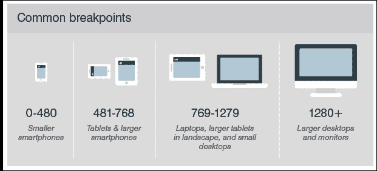

使我们的网站响应的第一步是添加视口指令；没有它，我们很可能会在调整我们的网站大小时出现类似的效果：

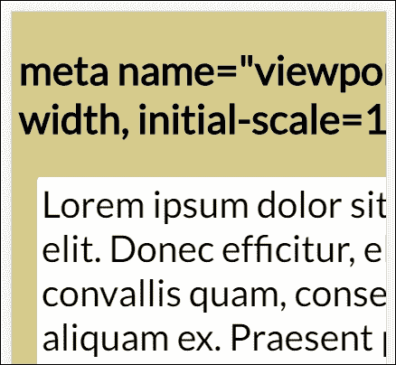

明白我的意思了吗？看起来很糟糕——文本被截断，我们必须向右滑动...噫！相比之下，添加一行代码可以产生戏剧性的效果：

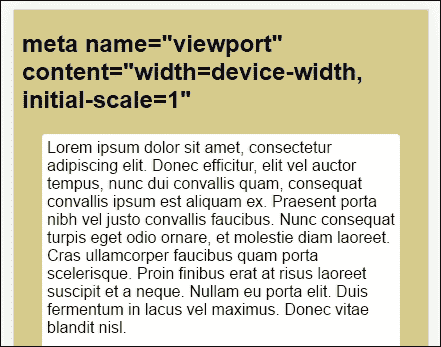

我们的示例使用了设置为模拟 iPhone 6 Plus 的 Google Chrome。恢复我们示例的理智所需的代码可以添加到我们代码的`<head>`中：

```html
<meta name="viewport" content="width=device-width, initial-scale=1"> 

```

设置后，我们可以立即看到区别。诚然，我们的演示不会赢得任何风格奖，但这也不是目的！然而，它确实显示文本已经缩小以适应屏幕，我们在文本周围有一个适当的边框——作为显示，这一切看起来更令人愉悦。

### 注意

要查看实际效果，请尝试运行附带本书的代码下载中的`viewport.html`演示；您需要在浏览器的设备/响应模式下运行它；删除第 5 行，然后重新添加它以查看区别。

此指令中的内容属性支持使用多种不同的值之一：

| **属性** | **描述** |
| --- | --- |
| `width` | 设备虚拟视口的宽度。 |
| `device-width` | 设备屏幕的物理宽度。 |
| `height` | 设备虚拟视口的高度。 |
| `device-height` | 设备屏幕的物理高度。 |
| `initial-scale` | 访问页面时的初始缩放；设置为 1.0 不会缩放。 |
| `minimum-scale` | 访问者可以在页面上缩小的最小量；设置为 1.0 不会缩小。 |
| `maximum-scale` | 访问者可以在页面上放大的最大量；设置为 1.0 不会放大。 |
| `user-scalable` | 允许设备放大和缩小（是）或保持固定（否）。 |

当前版本的 MS Edge 与视口标签不太兼容；值得注意的是，需要在代码中指定`@-ms-viewport`，以确保我们的视口宽度与其他浏览器的行为方式相同。

## 在视口和体验之间取得平衡

您会注意到我在本节开头使用了斜体的“体验”一词——这里的关键是，在响应式设计中，体验不必在所有设备上完全相同；但它必须是有用的，并允许我们的访问者作为一个组织与我们互动。换句话说，如果我们为一个剧院工作，我们可能会将我们的移动提供限制在简单的订票，而让主要的桌面站点管理其他一切。

这是完全有效的；虽然限制了站点，移动订票可能被一些人认为非常受限制。这个概念在技术上仍然是合理的，只要用户体验是可以接受的。

值得注意的是，我们可以使用`width=<value>`来设置特定的宽度。如果我们需要特定的宽度来显示我们的内容，这是很好的；如果方向从纵向（320 像素）变为横向（360 像素），那么视口的内容将自动按比例缩放以反映这些变化。然而，如果我们将设备宽度设置为最大值，这意味着不需要缩放，浏览器应该调整其中的内容以适应。

## 考虑视口单位

响应式设计的一个关键部分是摆脱使用像素值，而是使用 em 或 rem 单位。在我们的示例中（以及本章前面的视口演示中），我们使用了像素和 rem 单位。虽然这很有效，但我们仍然依赖于父元素。相反，我们应该考虑使用另一种处理视口的方法。它们是：

+   **vw**：视口宽度

+   **vh**：视口高度

+   **vmax**：视口高度和宽度的最大值

+   **vmin**：视口高度和宽度的最小值

作为一种度量单位，它们相当于已设置的视口区域的 1%；但美妙之处在于它们消除了任何依赖元素，并且基于当前视口大小进行计算。目前，浏览器对它们的支持非常好：

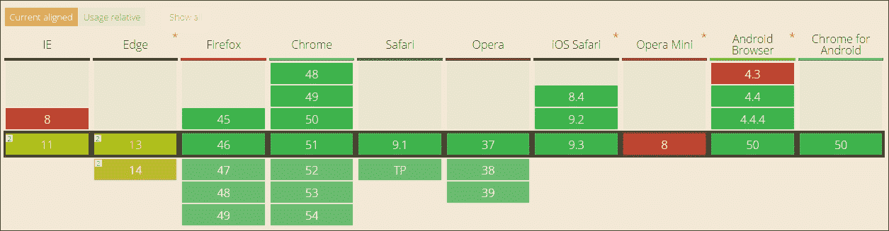

来源：[`caniuse.com/#search=vh`](http://caniuse.com/#search=vh)

撇开最近版本的 Internet Explorer 存在的一些小问题，这是一个有用的选项，它结合了单位的简便性和在设计中使用百分比的灵活性。

让我们继续——我们已经介绍了灵活的网格，并探讨了设置视口对于正确显示内容的重要性。现在是时候继续探索将网格系统纳入我们的布局的一些好处，并深入了解它们作为响应式设计原则的内部工作。

# 探索灵活网格布局的好处

既然我们已经了解了网格布局作为响应式设计的一个原则，现在是一个很好的机会来探讨为什么我们应该使用它们。从头开始创建布局可能会耗费时间并需要大量测试；使用网格布局有一些真正的好处：

+   **网格使设计更简单**：我们可以专注于提供内容，而不是试图开发传统的轮子；基础设施已经经过开发人员和其他用户的测试。

+   **它们提供了视觉上吸引人的设计**：许多人喜欢以列的形式显示内容，因此网格布局很好地利用了这个概念来帮助组织页面上的内容。

+   **网格当然可以适应不同大小的视口**：它们使用的系统使得在多个设备上显示单一的代码库更容易，这减少了开发人员维护和网站管理员管理所需的工作量。

+   **网格有助于显示广告**：谷歌已经知道偏爱显示真实内容的网站，而不是那些它认为网站的唯一目的是产生广告的网站；我们可以使用网格来定义特定的广告区域，而不会妨碍自然内容。

总的来说，熟悉网格布局是有意义的；诱惑当然是使用现有的库。这没有错，但要真正从中获益，了解一些围绕网格布局机制的基础知识以及如何帮助构建我们的网站是很有好处的。

首先让我们快速看一下如何计算每个元素的宽度，这是创建任何网格布局的重要部分。

# 理解网格布局的机制

到目前为止，我们探讨了响应式设计的一个关键要素，即我们将如何设置我们的可用屏幕空间（或视口）——正如有人曾经说过的那样，“是时候了…”

绝对没错——是时候开始探索网格是如何运作的了！网格背后的技巧并不特别；它归结为使用一个公式来帮助定义我们布局中使用的每个元素的比例：

*目标 ÷ 上下文 = 结果*

假设我们有一个包含两列的布局，容器（或上下文）宽度为 960px（我将使用像素值纯粹是为了说明所涉及的数学）。

为了创建我们的布局，我们将使用我们在第一章中提到的黄金比例，*介绍响应式网页设计*；回顾一下，我们使用 1.618 的比例对每个像素。因此，如果我们的布局宽度为 960px，我们将 960 乘以 0.618（差值）—这给出 593px（四舍五入到最接近的整数）。然后我们简单地从 960 中减去 593，得到 367px 作为我们的侧边栏。当你知道如何做的时候，这就很简单了…！

在这个阶段，我们可以将这些转换为百分比；`593px`变为`61.77%`，侧边栏将是`38.23%`。让我们将这些转化为一些样本 CSS，值四舍五入到小数点后两位：

```html
section, aside {
   margin: 1.00%;    /*  10px ÷ 960px = 0.010416 */
}

section {
   float: left;
   width: 61.77%;    /* 593px ÷ 960px = 0.617708 */
}

aside {
   float: right;
   width: 38.23%;    /* 367px ÷ 960px = 0.382291 */
}
```

在这里，我们的目标是`aside`（或子元素），上下文是容器；在这种情况下，我们将其设置为 960px。该部分形成了第二个目标；在这两种情况下，我们将目标除以上下文得出结果。由于我们的结果需要以百分比表示，我们只需将每个结果乘以 100 即可获得所需的数字。

你们中敏锐的人可能会注意到`margin: 1.00%`的存在。我们必须为我们的边距留出足够的空间，因此结果数字将需要更改。我们将保持部分宽度为`61.77%`，因此我们的边距将需要降至`34.23%`，以保持 100%的全宽（这允许两个子元素两侧的两个边距）。

如果我们一直坚持下去，最终可能会得到类似于这个屏幕截图的布局：

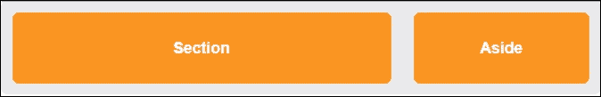

好的，让我们继续。我觉得是时候进行演示了！在我们开始编写代码之前，有一些要点我们应该快速看一下：

+   虽然我们只是浅尝辄止地探索了网格布局的工作原理，但我们还有很多事情要做；这将取决于你的网站需要多少列，列是否应该等宽，或者与其他列合并，容器有多大，等等。

+   有数十种网格布局框架可以在线使用。在开始从头设计和创建自己的网格之前，看看有什么可用的；这将节省你很多时间！

+   保持简单；不要试图过分复杂化你的布局。你可能会读到开发人员赞扬 flexbox 的优点，或者说你必须以某种形式使用 JavaScript 或 jQuery；对于简单的布局，这是不必要的。是的，我们可能会使用 box sizing 等属性，但基于 flexbox 的网格系统可能会在 CSS 中变得过于臃肿。

考虑到这一点，现在是时候进行演示了。不过，在我们开始之前，有一些东西需要讲解，因为这将成为本书中的一个主题：

我们将避免使用 JavaScript 或下载库来创建我们的演示。是的，你没听错。我们将尝试仅使用纯 HTML5 或 CSS3 来构建我们的响应式元素！

原因很简单——我坚持认为我们作为开发人员变得懒惰了，有时候回归基础并真正欣赏简单更好。你可能会听说歌手想回到他们的根源或起点；我们只是将同样的原则应用到我们的响应式开发中。这意味着我们不能总是使用最丰富功能的或最新版本的，但这并不总是坏事，对吧？

# 实施预构建的网格布局

我们已经介绍了创建网格的基础知识；从头开始创建这些可能非常耗时，因此有这么多已经可用在线的网格，除非您的要求是找不到适合您的网格，否则最好使用预构建版本！值得花时间研究可用的内容，因为没有两个网格是相同的。

作为可用内容的示例，并证明我们不需要网格提供的所有花哨功能，让我们看一个 Gridism 形式的示例网格。我们可以在这个屏幕截图中看到我们的下一个演示完成后的样子：

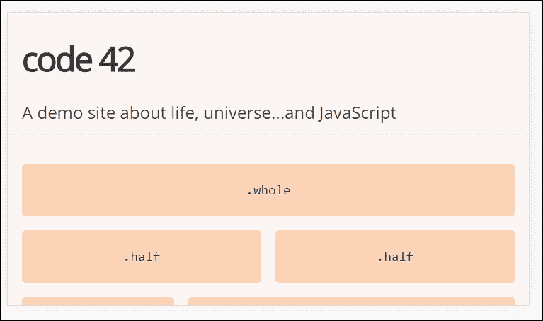

尽管这个库已经存在了两三年，但它的简单性证明了我们不需要实施复杂的解决方案来创建简单布局的基础。CSS 中的 flexbox 属性非常适合创建网格，但它的灵活性增加了不必要的复杂性；相反，我们将使用`box-sizing`属性，它同样有效。

由 Cody Chapple 创建，它不使用 flexbox（稍后会详细介绍），但在网格中使用 box-sizing 作为属性。该库可以从[`github.com/cobyism/gridism/blob/master/gridism.css`](https://github.com/cobyism/gridism/blob/master/gridism.css)下载（或使用 Bower 安装），但由于它只包含一个文件，我们可以简单地将内容复制到文本文件中并保存（仍然保持我们早期的目标，即不下载内容）。

### 注意

演示将使用 Gridism 网站的原始示例，但 CSS 已经重新设计以使其保持最新状态并删除一些不必要的代码。为了方便起见，我们将假设在整个演示过程中都使用 Google Chrome。

让我们开始吧：

1.  从随书附带的代码下载中，下载`gridism.html`的副本，以及`normalize.css`，`gridism.css`和`style.css`。将 HTML 标记保存在项目区域的根目录中，将两个 CSS 文件保存在 CSS 子文件夹中。

1.  尝试在浏览器中运行`gridism.html`，然后启用其设备或响应模式（按下*Ctrl* + *Shift* + *I*，然后按下*Ctrl* + *Shift* + *M*）。我们应该看到类似于本练习开始时显示的屏幕截图。

1.  本节开头的屏幕截图是在设置为模拟 iPhone 6 Plus 横向模式的 Google Chrome 中拍摄的。现在在 Chrome 中使用方向工具：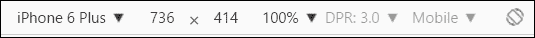

1.  要将方向更改为纵向：

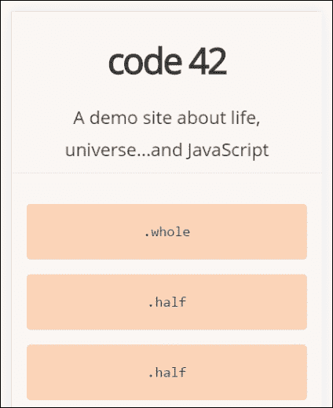

注意网格如何自动重新排列？这里的技巧不在于`style.css`文件，而在于`gridism.css`；如果我们在文本编辑器中打开它并查找代码块，大约在第 50-61 行左右，它会像这样：

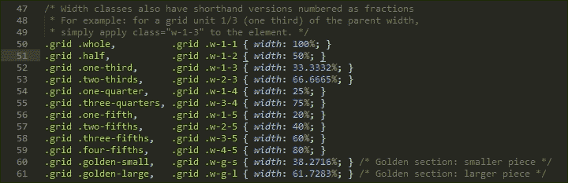

我们可以看到该库充分利用百分比值来为每个块分配宽度。这里的关键不在于设置的宽度，而在于我们的容器的大小；对于 gridism，默认设置为`978px`。因此，例如，如果我们设置一个单元格宽度为`.one-third`，我们希望占据`736px`的`33.3332%`，即`245.33px`。然后，我们通过将 box-sizing 属性应用于我们的每个网格单元格来确保所有网格单元格具有正确的尺寸。

看，这多简单？我们只需指定我们需要的列类型的名称，具体取决于我们需要它有多宽：

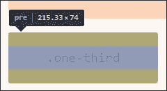

等一下。为什么屏幕截图显示的是`215.33`，而不是计算所指示的`245.33`？

啊哈，这只是我们需要注意的一点；当使用像 Gridism 这样的网格系统时，计算是基于我们视口的全宽度的。任何所需的填充将包含在我们列的宽度计算中，因此我们可能需要比预期的稍大的列！这表明，即使我们的网格系统没有当前系统的所有功能，只要我们仔细规划，我们仍然可以制作出一个可用的网格。

好的，让我们继续。我们曾经提到过，许多网格使用 flexbox 来帮助控制它们的外观；这是一个很好的选择，但可能需要设置许多额外的属性，否则对于简单的布局来说是不必要的。通过仔细规划，有可能避免使用它，但如果我们正在处理具有许多不同元素的复杂布局，那么在某些情况下使用它将避免很多麻烦！考虑到这一点，让我们快速看一下它的基本工作原理。

# 探索 flexbox 的使用

那么，什么是 flexbox？

它是一个被设计为以更有效的方式在容器中布局和分配空间的模块，特别是如果它们的大小尚不清楚。我们可以设置一些属性来确保每个项目最好地利用其周围的可用空间，即使其大小发生变化。

在撰写本文时，这是 W3C 的候选推荐；这意味着它实际上是在 2016 年底成为浏览器标准之前的最后一次呼吁。尽管如此，大多数浏览器已经支持它作为标准：

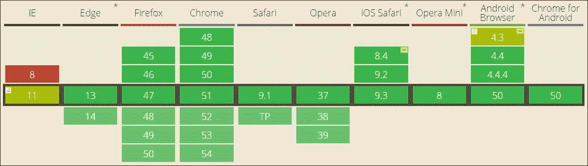

来源：[`caniuse.com/#search=flexbox`](http://caniuse.com/#search=flexbox)

要完全理解它的工作原理超出了本书的范围，但为了帮助入门，我们可以运行一个快速演示，并探索一些主要特性：

1.  从附带本书的代码下载中，提取`flexbox.html`和`flexbox.css`的副本；将 HTML 标记存储在我们项目区域的根目录下，将 CSS 样式表存储在我们项目区域的`css`子文件夹中。

1.  在浏览器中尝试预览`flexbox.html`。为此，我们需要启用浏览器的响应模式（或设备模式，取决于浏览器）；如果一切正常，我们应该看到类似于这个屏幕截图的东西：

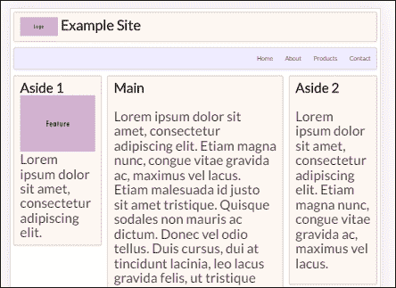

该演示基于 Irina Kramer 创建的一个笔记本，可以在[`codepen.io/irinakramer/pen/jcLlp`](https://codepen.io/irinakramer/pen/jcLlp)上找到；为了我们的演示目的，我们专注于从该笔记本中提取的示例布局。

乍一看，这个演示看起来非常简单。它肯定可以在颜色方面提供一些帮助，但这并不是我们目前感兴趣的。如果我们深入挖掘代码，我们会发现 flexbox 已经被应用在各个地方；让我们更详细地探索它的使用。

## 仔细观察

仔细看一下我们的代码，我们会发现其中有很大一部分使用了标准属性，这些属性可能在任何网站上都能找到。对我们感兴趣的代码从第 50 行开始；为了理解它的作用，我们首先需要理解 flex 布局的基本概念：

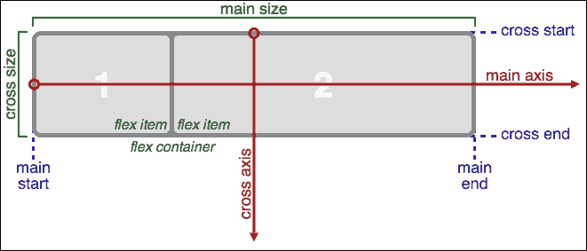

来源：W3C

简而言之，项目按照主轴（从主开始到主结束）或交叉轴（从交叉开始到交叉结束）进行布局：

| **属性** | **目的** |
| --- | --- |
| `main axis` | 伸缩项目布局的主轴；这取决于 flex-direction 属性。 |
| `main-start &#124;  main-end` | 容器内放置的伸缩项目的起点和终点（水平）。 |
| `main size` | 伸缩项目的宽度或高度，取决于主尺寸，是项目的主尺寸。主尺寸属性可以是项目的高度或宽度尺寸。 |
| `cross axis` | 与主轴垂直的轴。其方向取决于主轴的方向。 |
| `cross-start &#124; cross-end` | 用于填充项目并放置到容器中的伸缩行的起点和终点（垂直）。 |
| `cross size` | 这是伸缩项目的宽度或高度，取决于交叉尺寸。 |

有了这个想法，让我们来探索一些在我们的代码中使用的 flexbox 术语；最初的几个样式是适用于任何网站的标准规则。我们感兴趣的代码从第`29`行开始。

如果我们滚动到那一行，我们会看到这个：

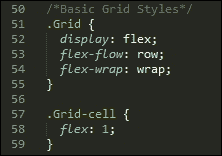

我们的第一个属性`display: flex`定义了包含伸缩项目的容器；在这里，我们设置它以行的形式显示项目，并从左到右换行。如果我们的布局中有多列，我的意思不仅仅是两三列，那么我们可能会使用`align-items`和`justify-content`来确保每一列均匀地分布在行中，而不管每一列的宽度如何。

有了`.grid`的定义，我们需要为我们的网格单元格或容器进行样式设置。我们可以应用几个属性；我们使用的是`flex`，这是`flex-grow`，`flex-shrink`和`flex-basis`的简写。在我们的情况下，建议使用简写版本，因为这将自动设置其他值；我们将`flex-grow`设置为`1`，这表示它应该在同一容器中的其他伸缩项目中增长多少。

我们感兴趣的下一个属性是在`.nav`规则中。在这里，我们再次使用了 flex-flow，但这次我们还使用了 justify-content；后者控制了每一行上的项目是如何排列的（在这种情况下，朝着行的末尾）：


我们特别感兴趣的最后一段代码是在大屏幕媒体查询中的这一部分：

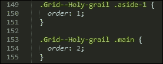

order 属性只是指定了我们的伸缩容器中每个项目的顺序；在这种情况下，我们有`.aside-1`和`.aside-2`分别在位置 1 和 2（不在镜头中），而`.main`在中间位置 2。

### 注意

根据我们的需求，我们可以设置更多属性。查看原始笔的源代码。在线上有很多关于 flexbox 的参考资料，首先可以看看 Chris Coyier 的指南，网址为[`bit.ly/1xEYMhF`](http://bit.ly/1xEYMhF)。

让我们继续。我们已经探索了现在可能的一些例子，但是使用 flexbox 至少有一个缺点。这项技术非常有效，但在网站实施时可能会增加大量代码和复杂性。

是时候寻找一些更简单的东西来使用了，这不需要同样的努力来实现；进入 CSS 网格模板！这仍然是一项早期技术，浏览器支持有限，但已经更容易实现。让我们深入了解一下。

# 访问未来

想象一下，我们有 flexbox 作为一种创建网格布局的技术，但它的设计是用于更简单的一维布局；如果布局复杂，它就不太适用！有没有一个答案，更好的东西，专门为这项工作设计的？

幸运的是；我当然是在指一种相对较新的技术，名为 CSS Grid Layout。目前对它的支持还很有限，但这可能会改变。简而言之，它提供了一种更简单的方式在浏览器中创建网格，而不像 flexbox 那样拥有大量的选项。

使用 CSS Grid Layout 作为一种技术的缺点是，对它的支持尚未普及；它在 IE11/Edge 中得到支持，但只在`-ms-`前缀下支持。Opera、Firefox 和 Chrome 提供支持，但都需要启用标志才能查看结果：


来源：[CanIUse.com](http://caniuse.com/)

暂且不谈对支持的担忧，很容易看出为什么 CSS Grid Layout 将作为一种技术蓬勃发展。整个概念旨在简化我们如何引用单元格、行和列；与 flexbox 相比，使用 CSS Grid Layout 更容易应用样式。

### 注意

如果您想了解更多关于 CSS Grid Layout 的信息，请在网上查看。Chris House 的这篇文章解释得很好：[`bit.ly/2bMGlDp`](http://bit.ly/2bMGlDp)。

为了看看它的效果，让我们深入研究并构建一个简单的演示，以说明网格布局中的一些图片。

## 实现基本画廊网格

对于我们的下一个演示，我们将利用开发人员 Rachel Andrew 在[`codepen.io/rachelandrew/full/LGpONE/`](http://codepen.io/rachelandrew/full/LGpONE/)创建的一个示例；我们将用来自 Flickr 的图片替换它们，展示我最喜欢的欧洲小镇布鲁日的图片。不，这与蕾丝无关，你问之前：美食、美酒、绝佳的氛围、出售的令人惊叹的巧克力……我想你还能要求什么呢？

但我岔开了话题。在我们开始创建我们的代码之前，有几点我们必须牢记：

+   这个演示是尖端的，不会在所有浏览器中运行，对于一些浏览器，需要在其中启用支持。请注意，启用标志是完全可以的，但请确保您选择正确的标志：


+   我们必须在第 1 步重新启动 Google Chrome，所以确保在演示开始时只显示标志页面。

话不多说，让我们开始我们的演示吧：

1.  我们将首先在 Google Chrome 中启用对 CSS Grid Layout 的支持。要这样做，浏览到`chrome://flags`，并搜索**实验性网络平台功能**。单击启用按钮以激活它，然后点击页面底部的蓝色**立即重新启动**按钮以重新启动 Google Chrome。

1.  在启用支持后，继续从本书附带的代码下载中提取`gridtemplate.html`的副本；将其保存到我们项目区域的根目录。

1.  在一个新的文本文件中，添加以下样式。我们将按块进行解释，首先是一些用于我们的图片和标签的初始样式：

```html
        body { 
          font-family: helvetica neue, sans-serif; 
        } 

        img { 
          max-width: 100%; 
          border-radius: 10px; 
        } 

```

1.  接下来是设置我们的容器所需的规则；请注意，与我们的网格相关的唯一样式是`box-sizing`，我们将其设置为`border-box`：

```html
        .wrapper { 
          list-style: none; 
          margin: 0; 
          padding: 0; 
        } 

        .wrapper li { 
          box-sizing: border-box; 
          padding: 1em; 
          min-width: 1%; 
        } 

```

1.  真正的魔法开始在一组媒体查询中发生；我们首先将 wrapper 分配为我们的网格容器，然后设置网格的列和行布局：

```html
        @media screen and (min-width: 500px) { 
          .wrapper { 
            display: grid; 
            grid-template-columns: 1fr 1fr; 
          } 

          .wrapper li:nth-child(1) { 
            grid-column: 1 / 3; 
          } 
        } 

```

1.  在我们的第二个查询中，我们为我们的网格包装器和列表项设置了单独的样式，这次是针对 640 像素或更大的情况：

```html
        @media screen and (min-width: 640px) { 
          .wrapper { 
            grid-template-columns: 1fr 1fr 1fr; 
          } 

          .wrapper li:nth-child(1) { 
            grid-column: 2; 
            grid-row: 1 / 3; 
          } 

          .wrapper li:nth-child(2) { 
            grid-column: 3; 
            grid-row: 2; 
          } 

          .wrapper li:nth-child(3) { 
            grid-column: 1; 
            grid-row: 1; 
          } 

          .wrapper li:nth-child(4) { 
            grid-column: 3; 
            grid-row: 1; 
          } 
          .wrapper li:nth-child(5) { 
            grid-column: 1; 
            grid-row: 2; 
          } 
        } 

```

1.  将文件保存为`gridtemplate.css`，保存在我们项目区域的`css`子文件夹中。

1.  尝试在浏览器中预览结果；如果一切正常，我们应该看到类似于这个截图的结果：


好吧，承认吧。这可能不是你所期望的样式，但这个演示不是为了让它看起来漂亮，而是基本的网格效果。然而，有一些重要的概念是值得理解的，所以让我们深入探讨一下我们演示中发生的事情。

## 探索发生了什么

在本章的早些时候，我们探讨了 flexbox 如何用于创建网格布局；如果我们比较 CSS 样式，很容易看出，使用 flexbox 需要提供更多的样式，而使用 CSS Grid 布局则需要更少的样式。

我们在核心样式中唯一使用的样式属性是`box-sizing`，我们将其设置为`border-box`。在这一点上没有使用其他任何东西——我们所有的 CSS Grid 布局样式都在两个媒体查询中设置。

我们的第一个媒体查询将`.wrapper`类设置为我们的网格容器。请注意，我们只需要设置一次，因为它将在大于`500px`的更大视口中级联。

一旦网格容器被分配，我们就可以为我们的模板指定网格列——分配的`1fr`值代表了网格中每个单元格内容周围的自由空白空间的分数（因此是`fr`单位）。然后我们在两个媒体查询中通过指定`grid-row`或`grid-column`来完成——这些值定义了网格项在网格中的位置；这两个术语是`grid-row-start`、`grid-row-end`、`grid-column-start`和`grid-column-end`的简写。

### 注意

有关这些术语在创建网格中的使用方式的更详细解释，请参阅 Mozilla 开发者网络上的文章，网址为[`developer.mozilla.org/en-US/docs/Web/CSS/CSS_Grid_Layout`](https://developer.mozilla.org/en-US/docs/Web/CSS/CSS_Grid_Layout)。

# 进一步探索

学习新技术就像穿上新衣服；在某个时候，我们会长大，或者它们不再具有吸引我们购买时的吸引力。

在这样的时候，我们需要进步到更高级或具有额外功能的东西，否则我们的开发将停滞不前！幸运的是，在线上有数十种我们可以探索的选项——人们可能会原谅我们认为有太多选择，不知道从哪里开始？

一个很好的起点是一个响应式框架，比如 Bootstrap 或 Unsemantic；这些框架旨在提高可用性，并帮助加快开发过程。这些框架的推出旨在为各种移动功能、布局的快速原型设计提供网格或基础，使设计师和开发人员能更好地利用他们的开发时间。

这只是可用于帮助您的一部分，让我们简要地介绍一些可能作为起点的想法：

+   **Bootstrap**可以从[`getbootstrap.com/`](http://getbootstrap.com/)下载，这个老牌网格系统最初是由 Facebook 创建的，后来成为了一个独立的产品。

+   如果你想探索更多不仅仅是一个框架的东西，那么**Responsive Grid System**可能是一个选择；它可以从[`www.responsivegridsystem.com/`](http://www.responsivegridsystem.com/)获得，对于那些使用 CSS 预处理器的人来说，还有一个 SASS 版本可用。

+   与其简单地下载一个框架，不如在线生成一个？为此，可以尝试**Responsify.it** ([`responsify.it`](http://responsify.it/)) 和 Gridpak.com ([`gridpak.com`](http://gridpak.com/))。

+   我们之前在 Gridfy 中使用了一个最小的网格系统，还有其他可用的选项，如果这个选项不合你的口味。例如，尝试一下 Gridly，可以从[`ionicabizau.github.io/gridly/example/`](http://ionicabizau.github.io/gridly/example/)下载。

+   值得注意的是，并非每个网格系统都可以作为独立的存在——有些是组件库的一部分。一个很好的例子是**Formstone**；它的网格系统可以从[`formstone.it/components/grid/`](https://formstone.it/components/grid/)获取。对于那些使用 Less CSS 预处理器的人来说，这个网格系统有一个可以与这个工具一起使用的版本。

+   继续讨论组件库的主题，为什么不看看**Metro UI**？这个库可以从[`metroui.org.ua/grid.html`](http://metroui.org.ua/grid.html)获取，甚至得到了微软的支持；不过它需要 jQuery！

+   你们中的一些人可能听说过 960.gs 网格系统，它在几年前是可用的——现在已经被**Unsemantic**取代，可以从[`unsemantic.com/`](http://unsemantic.com/)获取。

+   我们讨论了使用 flexbox 作为创建基于网格的布局的技术；作为一个起点，为什么不看看 PureCSS 库？这可以在[`purecss.io`](http://purecss.io/)找到；这是使用 flexbox 来产生清晰布局的一个很好的例子，而不需要太多麻烦。

作为开发者，这是响应式设计的一个领域，我们有很多选择；开源软件的好处在于，如果我们选择的框架不合适，我们总是可以尝试另一个！为了帮助我们做出决定，我们可以问自己几个问题：

+   你是否需要一个与 CSS 预处理器兼容的版本？尽管预处理的 CSS 是标准 CSS 的超集，但有一些网格系统是专门从 SASS 或 PostCSS 等预处理技术构建的。这比尝试将成品 CSS 转换为可以被我们的处理器编译的东西要容易得多。

+   你的网站有多复杂？它是一个单页的“名片”式网站，还是更复杂的东西？显然，给一个简单的网站加上复杂的网格布局是没有意义的；同样，如果我们正在构建一个复杂的网站，那么我们选择的网格系统必须达到要求。

+   浏览器支持是否是一个问题？如果我们可以放弃对一些旧版本浏览器的支持（特别是 IE8 以下），那么选择仅依赖 CSS 的选项比依赖 jQuery 的选项更可取。如果我们已经不得不使用不止偶尔的外部资源，同样的原则也适用。如果使用 CSS 就足够了，就没有必要添加插件。

+   你的网站是否需要使用需要使用主题库进行样式化的 UI 组件？如果是这样，检查一下库；它可能已经内置了一个我们可以使用的网格系统。

关键在于我们不应该简单地选择第一个可用的选项，而是仔细考虑可用的内容，并选择尽可能满足我们要求的东西。当然，任何样式都可以被覆盖——关键在于选择合适的样式，以便最小化或不需要覆盖我们的网站。

# 总结

为任何网站构建布局网格对其成功至关重要；传统上，我们可能首先做这个，但在响应式设计的世界中，内容是第一位的！在本章的过程中，我们已经涵盖了一些主题，帮助你入门，所以让我们花点时间回顾一下我们学到了什么。

我们从灵活的网格布局入手，提到我们可能需要改变我们的设计流程来促进创建响应式网格。然后我们继续探讨了我们可以使用的不同类型的布局，以及响应式布局与这些不同类型的比较。

接下来，我们开始布局中最重要的部分——设置可用的视口；这控制着任何时候可见的内容量。我们讨论了在我们的代码中设置视口指令的必要性，以便内容能够正确显示；我们还研究了不提供指令可能对内容外观产生负面影响！此外，我们还介绍了一些额外的属性和值单位，以及如何平衡视口大小和用户体验。

然后，我们开始探讨灵活的网格布局的好处，然后更详细地了解它们的工作原理；然后我们使用从互联网上获得的预构建网格系统创建了一个简单的演示。

接着，我们开始研究 flexbox 作为一种技术；我们通过一个简单的演示来探索它，然后剖析了使用 flexbox 时的一些问题。然后我们看到正在研发一种替代方案。我们以一个演示来结束本章，探讨了如何在今天激活它，以及一旦它成为主流标准，为其开发解决方案会更加简单。

现在我们的布局已经就位，是时候继续了。我们需要开始添加内容！默认情况下会添加文本，但是媒体呢？我们如何使其响应式？我们将在下一章中回答这些问题，以及更多内容，当我们看看如何向我们的页面添加响应式媒体时。
