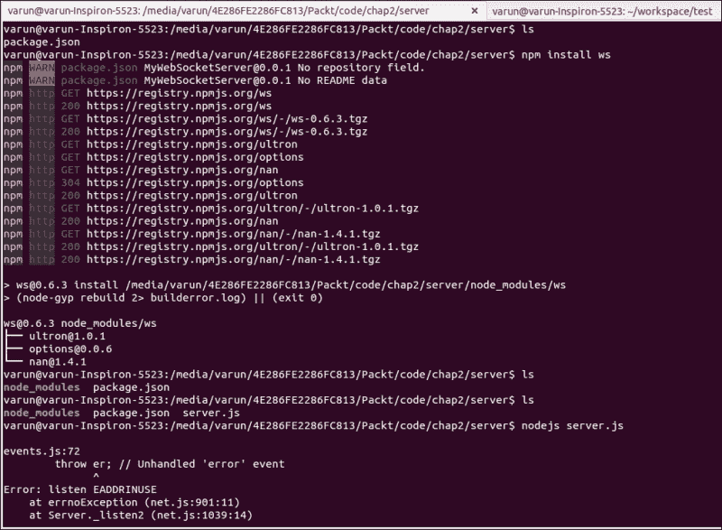

# 第二章：使用 WebSockets 入门

客户端服务器通信是任何 Web 应用程序中最重要的部分之一。 服务器和客户端之间的数据通信必须平稳快速，以便用户可以获得出色的体验。 如果我们研究传统的服务器通信方法，我们会发现这些方法是有限的，而且并不是真正的最佳解决方案。 这些方法已经被人们使用了很长一段时间，并且使 HTML 成为数据通信的第二选择。

# 为什么要使用 WebSockets？

为什么我们需要 WebSockets 的答案在于这个问题——其他通信方法存在什么问题？ 用于服务器通信的一些方法是请求/响应，轮询和长轮询，已经解释如下：

+   请求/响应：这是一种常用的机制，其中客户端请求服务器并获得响应。 这个过程是由一些交互驱动的，比如网页上按钮的点击来刷新整个页面。 当 AJAX 出现时，它使网页动态化，并帮助加载网页的某些部分而不加载整个页面。

+   轮询：有些情况下，我们需要在没有用户交互的情况下反映数据，比如足球比赛的比分。 在轮询中，数据在一段时间后被获取，并且它不断地向服务器发送请求，无论数据是否已更改。 这会导致不必要的对服务器的调用，每次都打开连接然后关闭连接。

+   长轮询：基本上是在特定时间段内保持打开的连接。 这是实现实时通信的一种方式，但仅当您知道时间间隔时才有效。

这些方法的问题导致了解决方案，即 WebSockets。 它解决了在使用旧方法时遇到的所有问题。

# WebSockets 的重要性

WebSockets 出现来拯救我们摆脱旧的服务器通信方法。 WebSockets 通过提供全双工的双向通信桥解决了服务器通信的最大问题之一。 它为服务器和客户端提供了在任何时间点发送数据的能力，这是任何旧方法都无法提供的。 这不仅提高了性能，还减少了数据的延迟。 它创建了一个轻量级的连接，我们可以长时间保持连接而不牺牲性能。 它还允许我们在任何时间点完全控制打开和关闭连接。

WebSockets 是 HTML5 标准的一部分，因此我们不需要担心添加额外的插件来使其工作。 WebSockets API 完全由 JavaScript 支持和实现。 几乎所有现代浏览器现在都支持 WebSockets； 可以使用网站[`caniuse.com/#feat=websockets`](http://caniuse.com/#feat=websockets)进行检查，该网站给出以下截图：


WebSockets 需要在客户端和服务器端都实现。 在客户端，API 是 HTML5 的一部分。 但是在服务器端，我们需要使用实现 WebSockets 的库。 现在有许多——或者我们可以说几乎所有——支持 WebSockets API 库的服务器。 Node.js 是一个现代的基于 JavaScript 的平台，也支持使用不同包实现基于 WebSockets 的服务器，这使得开发人员可以轻松编写服务器和客户端代码，而无需学习另一种语言。

# 何时使用？

WebSockets 作为客户端和服务器之间非常强大的通信方式，对于需要大量服务器交互的应用程序非常有用。 由于 WebSockets 使我们能够实现实时通信的好处，因此需要实时数据传输的应用程序，如聊天应用程序，可以利用 WebSockets。 它不仅用于实时通信，还用于只需要服务器向客户端推送数据的情况。

当我们知道其使用目的时，可以决定使用 WebSockets。当我们只需创建一个具有静态页面和几乎没有交互的网站时，不应使用 WebSockets。我们应该在客户端和服务器之间的数据传递方面使用 WebSockets。

有许多应用程序，如股票应用程序，其中数据保持实时更新。协作应用程序需要实时数据共享，例如国际象棋游戏或乒乓球游戏。WebSockets 主要用于实时游戏 Web 应用程序。

# 它是如何工作的？

WebSockets 使用 TCP 层进行通信。连接是通过 HTTP 建立的，基本上是客户端和服务器之间的握手机制。握手后，连接升级为 TCP。让我们通过这个流程图看看它是如何工作的：


以下步骤将带您完成前面图表中显示的流程：

1.  第一步是从客户端发起的 HTTP 调用；HTTP 调用的标头如下所示：

```js
GET /chat HTTP/1.1
Host: server.example.com
Upgrade: websocket
Connection: Upgrade
Sec-WebSocket-Key: x3JJHMbDL1EzLkh9GBhXDw==
Sec-WebSocket-Protocol: chat, superchat
Sec-WebSocket-Version: 13
Origin: http://example.com

```

+   在这里，`Host`是我们正在访问的服务器的名称。

+   “升级”显示这是一个升级调用，这种情况下是 WebSockets。连接定义了这是一个升级调用。

+   `Sec-Websocket-Key`是一个随机生成的密钥，用于验证响应。这是握手的认证密钥。

+   `Origin`也是另一个重要的参数，显示调用的来源；在服务器端，它用于检查请求者的真实性。

1.  一旦服务器检查了真实性，就会发送回复，看起来像这样：

```js
HTTP/1.1 101 Switching Protocols
Upgrade: websocket
Connection: Upgrade
Sec-WebSocket-Accept: HSmrc0sMlYUkAGmm5OPpG2HaGWk=
Sec-WebSocket-Protocol: chat

```

+   在这里，`Sec-WebSocket-Accept`有一个密钥，解码并与发送的密钥进行检查，以确认响应是否来自正确的发起者。

1.  因此，一旦连接打开，客户端和服务器就可以彼此发送数据。

1.  数据以小数据包的形式使用 TCP 协议发送。这些调用不是 HTTP，因此在浏览器的开发者工具的网络选项卡下不会直接显示。

# WebSocket API

WebSockets 标准由 W3 定义。WebSockets 的 API 接口如下所示：

```js
enum BinaryType { "blob", "arraybuffer" };

[Constructor(DOMString url, optional (DOMString or DOMString[]) protocols), Exposed=Window,Worker]

interface WebSocket : EventTarget {

  readonly attribute DOMString url;

  // ready state

  const unsigned short CONNECTING = 0;
  const unsigned short OPEN = 1;
  const unsigned short CLOSING = 2;
  const unsigned short CLOSED = 3;
  readonly attribute unsigned short readyState;
  readonly attribute unsigned long bufferedAmount;

  // networking

           attribute EventHandler onopen;
           attribute EventHandler onerror;
           attribute EventHandler onclose;
  readonly attribute DOMString extensions;
  readonly attribute DOMString protocol;

  void close([Clamp] optional unsigned short code, optional DOMString reason);

  // messaging
           attribute EventHandler onmessage;
           attribute BinaryType binaryType;
  void send(DOMString data);
  void send(Blob data);
  void send(ArrayBuffer data);
  void send(ArrayBufferView data);

};
```

我们可以从接口中看到 WebSockets API 提供的准备状态、网络事件和消息类型。

### 提示

**下载示例代码**

您可以从[`www.packtpub.com`](http://www.packtpub.com)的帐户中下载您购买的所有 Packt Publishing 图书的示例代码文件。如果您在其他地方购买了这本书，您可以访问[`www.packtpub.com/support`](http://www.packtpub.com/support)并注册，直接将文件发送到您的电子邮件。

## 准备状态

以下是准备状态：

+   **CONNECTING**：连接尚未建立。

+   **OPEN**：WebSockets 连接已建立，可以进行通信。

+   **CLOSING**：连接正在进行关闭握手或已调用`close()`方法。

+   **CLOSED**：连接已关闭或无法打开。

## 事件

以下是触发的事件：

+   **onopen**：当连接打开时触发。

+   **onclose**：当连接关闭时触发。

+   **onerror**：遇到错误时触发。

+   **onmessage**：当从服务器接收到消息时触发。

# 回声测试

让我们从**回声测试**应用程序开始。转到 URL [`www.websocket.org/echo.html`](https://www.websocket.org/echo.html)。在这里，您可以看到一个现成的**回声**服务器，我们可以访问，然后接收消息。它只是为您提供一个服务器；当您向该服务器发送消息时，它将返回相同的消息。继续玩您的回声应用程序。之后，我们将看到如何编写我们自己的客户端代码来访问这个回声服务器。


# WebSockets 客户端应用

让我们从 JavaScript 中编写客户端代码开始。我们现在将暂时使用相同的 Echo 服务器。让我们开始编写我们的客户端代码。以下是客户端代码的样子：

```js
<!DOCTYPE html>
<html>
  <head>
    <meta charset="utf-8" >
    <title>WebSocket Test</title>
    <script language="javascript" type="text/javascript">
      var wsUri = "ws://echo.websocket.org/";
      var output;

      function init(){
          output = document.getElementById("output");
          testWebSocket();
      }
      function testWebSocket(){

          websocket = new WebSocket(wsUri);

          websocket.onopen = onOpen;

          websocket.onclose = onClose;

          websocket.onmessage = onMessage;

          websocket.onerror = onError;

      }

      function onOpen(evt){
          writeToScreen("CONNECTED");
          doSend("WebSocket rocks");
      }

      function onClose(evt){
          writeToScreen("DISCONNECTED");
      }

      function onMessage(evt){
          writeToScreen('<span style="color: blue;">RESPONSE: ' + evt.data + '</span>');
          websocket.close();
      }

      function onError(evt){
          writeToScreen('<span style="color: red;">ERROR:</span> ' + evt.data);
      }

      function doSend(message){
          writeToScreen("SENT: " + message);
          websocket.send(message);
      }

      function writeToScreen(message){
          var pre = document.createElement("p");
          pre.style.wordWrap = "break-word";
          pre.innerHTML = message;
          output.appendChild(pre);
      }

      window.addEventListener("load", init, false);

    </script>
  </head>
  <body>
    <h2>WebSocket Test</h2>
    <div id="output"></div>
  </body>
</html>
```

如果我们运行这段代码，将得到以下输出：


这是一个非常简单的代码；有一点 JavaScript 经验的开发人员也可以理解。让我们来看看代码并理解发生了什么。这里的顺序如下：

1.  我们与服务器建立连接。

1.  如果成功，我们就向服务器发送消息。

1.  一旦我们从服务器接收到消息，我们就会显示它。

1.  然后，我们关闭连接。

让我们谈谈使用 WebSockets 创建任何应用程序时需要注意的重要阶段。

## 实例化

我们可以像创建任何其他类的实例一样创建 WebSockets 对象的实例。以下是我们可以这样做的方法：

```js
var wsUri = "ws://echo.websocket.org/";
websocket = new WebSocket(wsUri);
```

### 注意

我们只需要传递一个重要的参数，那就是服务器的 URI。您会注意到我们使用了**ws://** URL 模式，这基本上定义了通信应该使用哪种协议。还有另一个 URL 模式，即**wss://**，用于在我们想要使用安全通信时使用，就像我们有 HTTPS 用于安全连接一样。

## 添加事件

我们可以向 WebSockets 对象添加事件处理程序，在任何事件发生时触发。有四个主要事件需要添加处理程序，它们是：

+   当我们创建 WebSockets 对象的实例时，将触发打开事件，告诉我们连接现在已经打开。以下是我们添加事件的方式：

```js
websocket.onopen = onOpen;
```

+   当连接关闭时，将调用`onClose`方法：

```js
websocket.onclose = onClose;
```

+   当我们从服务器接收到消息时，将触发`onmessage`事件，我们可以处理它并使用事件的数据属性获取数据：

```js
websocket.onmessage = onMessage;
```

+   有时我们在连接过程中会遇到一些错误，因为服务器宕机或发生了一些配置问题，或者由于其他原因。由于这些不同的可能原因，我们可能会收到一个错误，该错误将在`onerror`事件处理程序中捕获并提供给客户端：

```js
websocket.onerror = onError;
```

## 发送消息

我们不仅可以发送字符串，还可以发送对象、blob 和数组缓冲区到服务器，反之亦然。发送方法如下：

```js
websocket.send(message);
```

这是一个重要的方法，因为我们用它向服务器发送数据。

## 接收消息

接收数据也很简单，因为我们已经为事件添加了处理程序。在这里，我们将在事件对象的数据属性下获取数据。在这种情况下，我们添加了一些样式并将其添加到 HTML 页面中，以便我们可以看到一个视觉上吸引人的消息，这可以从输出中看到：

```js
function onMessage(evt){
    writeToScreen('<span style="color: blue;">RESPONSE: ' + evt.data + '</span>');
}
```

## 关闭连接

连接也需要关闭；最佳实践是在使用完连接后关闭连接。同样，我们希望在接收到消息后关闭与服务器的连接。我们必须确保在退出应用程序之前关闭连接。我们只需调用 WebSocket 对象的`close()`方法即可关闭打开的连接。关闭连接的方法如下：

```js
    websocket.close();
```

# WebSocket 服务器

我们已经看到了客户端的工作方式以及如何向服务器发送数据并从服务器接收数据。现在我们将看看如何让我们自己的服务器代码处理消息。

使用现代 Web 技术，我们将探索使用 Node.js 创建 WebSocket 服务器的实现。Node.js 是一个非常友好、轻量级且易于使用的平台。让我们看看如何创建我们自己的 WebSockets 服务器。

## Node.js 服务器

Node.js 服务器为我们提供了很大的灵活性来创建我们自己的服务器。有许多通过 NPM 可用的库包。我们将使用 Einar Otto Stangvik 创建的库，它基本上处理一般机制，比如升级 HTTP 协议等。这是一个非常健壮、干净和轻量级的库。

现在，要设置服务器，您必须在您的计算机上安装 Node.js。如果您还没有安装，那就去查看 Node.js 的网站（[`nodejs.org/`](https://nodejs.org/)），阅读文档，并安装它。参考以下步骤安装 WebSocket 服务器：

1.  在 Node.js 中使用 NPM 创建一个新项目。您只需要运行`npm init`命令。按照随后的说明操作。

1.  这将创建一个`package.json`文件，其中包含项目和相关包的所有信息。这对于版本和包的控制非常有用。这是`npm init`命令执行后 Node.js 命令提示符的样子：

1.  完成后，我们需要使用`npm install ws`命令设置 WebSockets 包。这个命令将安装 WebSocket 连接所需的库，看起来会像这样：

### 注意

可能会出现与 Python 相关的错误。请忽略它。这个库有一些其他功能需要安装 Python，但我们正在使用的功能与 Python 无关，所以我们可以忽略它。这个错误不会影响我们的开发过程，我们的代码将正常工作。

现在我们准备编码。首先，我们将创建我们的服务器 JavaScript 文件，命名为`server.js`，这将是我们的主服务器文件。请注意，它应该在我们之前运行`npm init`命令的同一个文件夹中创建。服务器代码将如下所示：

```js
var WebSocketServer = require('ws').Server
wss = new WebSocketServer({ port: 8080 });
wss.on('connection', function connection(ws) {
ws.on('message', function incoming(message) {
console.log('received: %s', message);
ws.send(message);
});
ws.send('Connected');
});
```

这是一个非常简单的服务器。让我们逐步了解代码：

1.  在这里，我们只是创建了一个 WebSocketServer 实例，并定义了它应该监听的端口。有时端口`8080`不可用，所以您可能会收到错误。不用担心；您可以通过以下方式简单地更改它：

```js
var WebSocketServer = require('ws').Server
wss = new WebSocketServer({ port: 8080 });
```

1.  一旦我们有了实例，我们就需要添加连接监听器，如果连接建立，它就会被触发：

```js
wss.on('connection', function connection(ws)
```

1.  一旦连接建立，我们需要为特定的 WebSockets 连接实例添加监听器。这个实例可以用于许多目的，比如发送消息：

```js
ws.on('message', function incoming(message)
```

1.  然后是消息发送部分。因为我们正在创建一个 Echo 服务器，所以我们只需要将收到的消息发送回去。所以我们使用相同的消息，并通过 WebSockets 实例发送它：

```js
ws.send(message);
```

1.  一旦我们编写了代码，就该是测试的时候了。我们需要启动我们的 Node.js 服务器，可以使用以下命令来完成：

```js
> node server.js

```

1.  一旦服务器启动，我们只需要从客户端代码中更改一行——我们在本章前面开发的服务器 URI。之前，我们访问的是[www.websocket.org](http://www.websocket.org)网站，但现在我们需要访问我们自己的服务器。我们只需将 URI 从`ws://demo.websocket.org`更改为`ws://localhost:8080`，然后就可以运行我们的客户端应用程序文件，就像我们在上一个客户端应用程序中做的那样，并查看结果：

```js
var wsUri = "ws://localhost:8080";
```


结果将与之前的相同。

恭喜！您刚刚创建了您的第一个 WebSockets Echo 应用程序。

# 总结

在本章中，我们学习了如何编写客户端和服务器端代码。我们了解了如何将 Node.js 用作 WebSockets 服务器，以及如何利用它快速创建一个小型服务器。

在下一章中，我们将制作一个简单的应用程序，看看 WebSockets 如何被使用。
