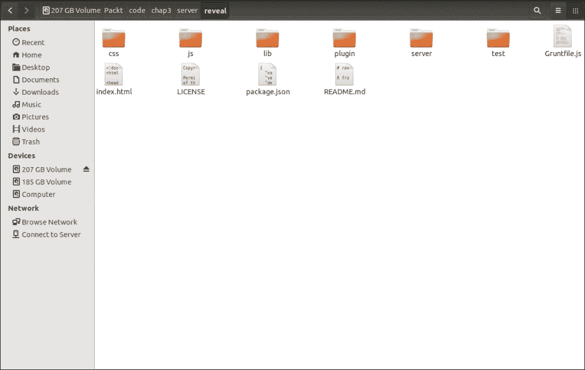
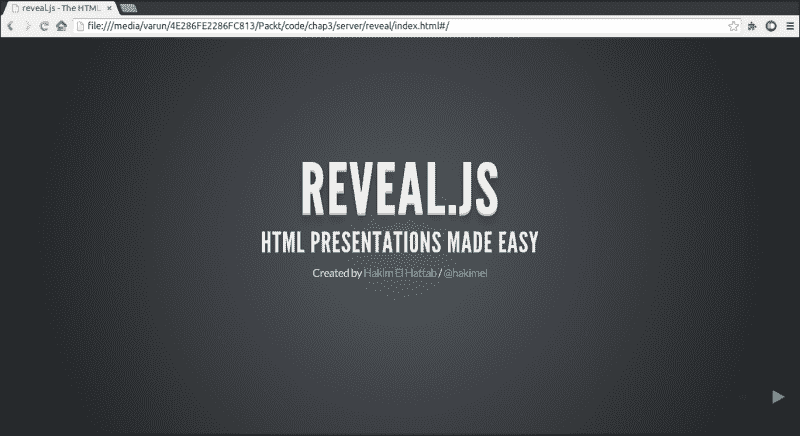
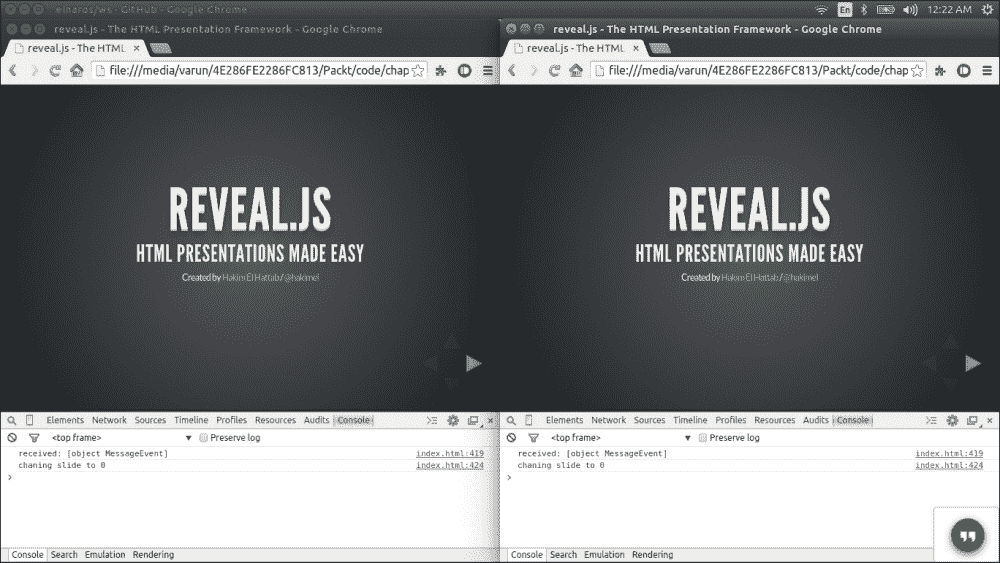
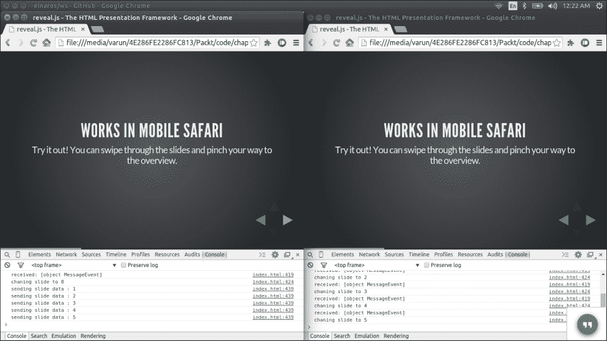
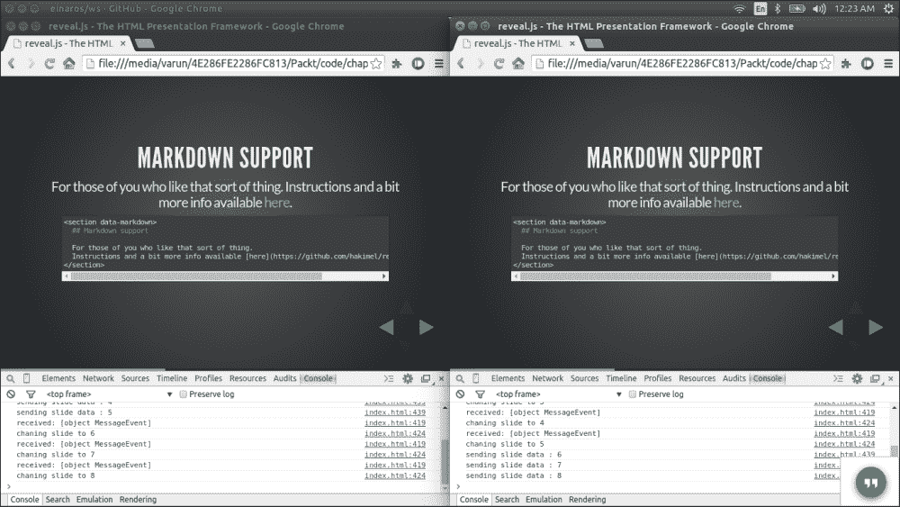
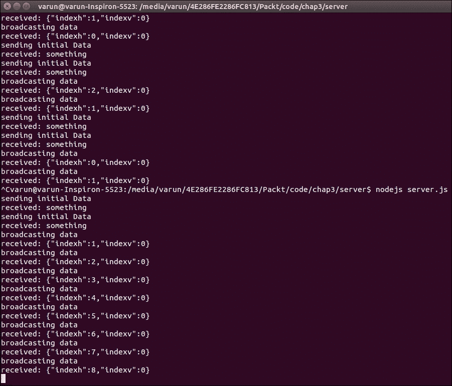

# 第三章：配置服务器和传输实时数据

数据是任何应用程序的核心。客户端和服务器之间的数据传输是其中非常重要的一部分。在上一章中，我们已经看到了如何使用 WebSockets 传输数据。现在，我们将看到如何利用它，并制作一个可以使用实时数据传输的应用程序。实时数据传输主要用于协作应用程序或任何需要在数据发生变化时立即反映的应用程序。

在本章中，我们将涵盖以下主题：

+   实时数据传输

+   实时应用程序

+   协作演示应用程序

+   添加协作

+   自己动手

+   技巧和窍门

# 全双工实时数据传输

众所周知，一旦发生变化，发送和接收数据就是实时数据传输。它可以是发生在数据中的一些变化。数据变化的原因可能是用户本身或某些定时事件。在正常情况下，用户的更改应该相应地反映给其他用户；例如，人们互相发送消息的聊天应用程序。聊天应用程序是实时数据传输的一个很小的例子；让我们谈谈一些大的例子，比如游戏。游戏是需要实时数据传输的主要应用程序。但随着行业的发展，我们日常使用的应用程序也在采用实时全双工数据通信。如果我们看任何股票市场应用程序，我们可以看到实时数据变化发生，这基本上是服务器推送的一个很好的例子。在这种情况下，服务器正在推送数据，这是 WebSockets 的一个很好的特性。

# 实时应用程序的基础

我们已经了解了什么是实时数据传输；现在让我们看看我们需要做什么来制作一个实时数据传输应用程序。在开始任何应用程序之前，有一些基础步骤我们需要考虑。一些主要步骤包括：

+   选择我们需要使协作或实时数据传输应用程序的功能

+   选择服务器端技术使其成为可能

+   选择与服务器轻松集成的客户端技术

这三个步骤是需要牢记的主要要点。正如我们所知，HTML5 支持 WebSockets，并且是数据通信的最佳方式之一。现在对于服务器端，我们已经看到了 Node.js 服务器可以如何轻松地无缝集成。现在最重要的部分是我们需要使实时的功能。这取决于我们正在构建的应用程序的类型。接下来，牢记这些要点，我们将开始构建我们的应用程序，以便更好地理解它。

# 协作演示应用程序

在考虑基础元素的基础上，让我们构建一个演示应用程序，如果你更改演示，那么其他用户也会相应地更改，反之亦然。基本上，我们将构建一个基于 Web 的协作演示共享应用程序。为了使这个应用程序适用于现代浏览器，我们需要一个 JavaScript 库，它给我们提供了演示应用程序所需的所有功能，比如创建不同的页面、导航等。然后我们将添加使不同用户之间可以协作的功能。

## 演示库

有不同的 JavaScript 库可供选择。给我们足够功能来创建我们的应用程序的库是**reveal.js**。这是一个制作精良的 API，完全基于 HTML5。还有一个制作精良的在线演示应用程序，也是基于我们将要使用的相同 JavaScript 库。该网站是[www.slides.com](http://www.slides.com)。继续访问这个网站；它会让你感受到我们的演示将会是什么样子。我们将使用这个 API，并使其协作，以便其他用户也可以更改幻灯片，并且反映可以被所有人看到。

## 设置图书馆

首先，我们需要下载并设置库文件。我们将要使用的库可以在[`github.com/hakimel/reveal.js`](https://github.com/hakimel/reveal.js)找到。以下是设置库的步骤：

1.  下载副本并打开`index.html`文件。

1.  一旦你打开文件，你就可以看到默认的演示文稿。

1.  reveal.js 库是一个完整的演示解决方案，带有自己的导航和演示机制。

1.  在这里，你可以使用键盘控制来导航到不同的页面。使用右箭头键转到下一张幻灯片，使用左箭头键转到上一张幻灯片。同样，使用上下箭头键可以进行不同级别的演示。它支持各种文本，你可以在其中放置真实的代码或任何 HTML 内容，这是实时的。你可以浏览幻灯片以了解更多关于库功能的信息。

## 添加协作

要向演示库添加协作功能，让我们首先看看我们需要遵循哪些步骤使这个应用程序工作。将客户端和服务器端的重要步骤写下来是一个好的做法，以确保我们覆盖了每一个步骤。

对于这个应用程序，让我们列出客户端需要做的事情的清单：

+   连接到 WebSocket 服务器

+   从 WebSocket 接收消息

+   将从服务器接收的幻灯片编号应用到当前演示

+   当用户更改幻灯片时向服务器发送幻灯片详细信息

既然我们已经列出了客户端的要点，让我们也列出服务器端的要点：

+   初始化 WebSocket 服务器

+   从客户端接收幻灯片数据

+   存储当前幻灯片数据

+   为后来加入的新用户传递当前幻灯片数据

+   将幻灯片数据更改广播给所有用户

+   检查幻灯片数据更改以减少重复调用

由于我们已经下载了库，我们需要添加我们的自定义客户端和服务器端代码使其工作。

## 代码实现

库已经为我们准备好了大部分代码，所以我们不需要为客户端添加太多代码。我们需要完全编写服务器端代码。让我们来看看代码。

### 客户端代码

在客户端，主文件是`index.html`，所以我们将把我们的代码添加到该文件中。在文件的 JavaScript 代码末尾，添加以下代码：

```js
function isJson(str)
{
    try 
    {
        JSON.parse(str);
    }
    catch (e)
    {
        return false;
    }
    return true;
}

var ws;

var isChangedByMe = true;
function init()
{
  ws = new WebSocket('ws://localhost:9001');
  //Connection open event handler
    ws.onopen = function(evt) 
    {
      ws.send('connection open');
    }
  //Event Handler to receive messages from server
  ws.onmessage = function(message)
  {
      console.log('received: '+ message);
      if(isJson(message.data))
      {
        var obj = JSON.parse(message.data);
        console.log("changing slide to "+ obj.indexh);
        isChangedByMe = false;
        Reveal.slide( obj.indexh, obj.indexv);
      }
  }
  //Adding event handler when slide is changed by use
  Reveal.addEventListener( 'slidechanged', function( event )
  {
      if(isChangedByMe)
      {
        ws.send(JSON.stringify({ 'indexh' :event.indexh , 'indexv' : event.indexv}));
        console.log("sending slide data : " + event.indexh);
      }
      isChangedByMe = true;
  });
}
//Event handler for application load event
window.addEventListener("load", init, false);
```

#### 代码解释

让我们看看我们在这段代码中写了什么。

我们已经向窗口添加了 load 事件监听器，这样一旦我们知道浏览器窗口已经正确加载，我们就可以开始初始化我们的 WebSocket 连接：

```js
window.addEventListener("load", init, false);
```

一旦调用`init`方法，我们就写下了实际与 WebSocket 服务器通信的代码。在这里，在这段代码中，我们实例化了 WebSocket 对象，并编写了一个事件处理程序，当连接打开时将被调用。一旦连接建立，这个方法被调用，我们就知道连接已经创建。现在我们发送一些随机数据，这可以被视为对服务器的确认：

```js
  ws = new WebSocket('ws://localhost:9001');
  ws.onopen = function(evt) 
   {
      ws.send('connection open');
   }
```

现在，我们添加消息事件处理程序，当服务器发送消息时调用它——在我们的情况下，我们必须处理服务器将要发送给我们的数据：

```js
  ws.onmessage = function(message)
```

所以你可以看到我们调用了`isJson`方法并将消息数据发送给它。这个方法被调用来检查我们收到的数据是否是我们想要的格式；否则它可能会抛出一个错误：

```js
     if(isJson(message.data))
```

在检查我们是否有正确类型的数据之后，我们现在将数据解析成**JavaScript 对象表示法**（**JSON**）格式。我们必须解析 JSON 方法的原因是因为我们正在以 JSON 格式发送数据，它被转换为字符串：

```js
     var obj = JSON.parse(message.data)
```

一旦数据被转换，我们就在 obj 变量中得到了一个 JSON 对象。现在来看一个重要的方法，这个方法基本上是一个 reveal.js 库方法，用于设置演示的当前幻灯片：

```js
      Reveal.slide( obj.indexh, obj.indexv);
```

这样我们就接收到数据并在演示文稿中设置它。现在来看代码的第二部分——将数据发送到服务器。

reveal.js 库给了我们一个事件，我们可以监听并获取关于当前幻灯片的信息：

```js
  Reveal.addEventListener( 'slidechanged', function( event )
```

一旦我们将监听器添加到`slidechanged`事件中，我们就可以使用在事件属性下传递的数据。

以下是我们如何从 JSON 对象创建字符串并将其传递给服务器：

```js
  ws.send(JSON.stringify({ 'indexh' :event.indexh , 'indexv' : event.indexv}));
```

在 WebSockets 客户端中，我们使用`send`方法将数据发送到服务器。一旦发送，服务器接收到并执行我们定义的操作。现在让我们来看看服务器是如何设置和行为的。

### 服务器代码

在上一章中，我们已经看到了如何创建一个 Node.js 服务器。以类似的方式，我们将使用 NPM 创建另一个应用程序（请参考第二章，*使用 WebSockets 入门*来获取设置和运行服务器的说明）。以下是我们需要在`server.js`文件中编写的服务器代码：

```js
var WebSocketServer = require('ws').Server
   wss = new WebSocketServer({ port: 9001 });

//Broadcast method to send message to all the users
wss.broadcast = function broadcast(data,sentBy)
{
  for(var i in this.clients)
  {
    if(this.clients[i] != sentBy)
    {
      this.clients[i].send(data);
    }
  }
};

//Data holder for current side number
var currentSlideData = { 'indexh' :0 , 'indexv' : 0};
//JSON string parser
function isJson(str)
{
    try
    {
        JSON.parse(str);
    } 
    catch (e)
    {
        return false;
    }
    return true;
}

//WebSocket connection open handler
wss.on('connection', function connection(ws)
{
//WebSocket message receive handler
    ws.on('message', function incoming(message)
    {
    if(isJson(message))
    {
      var obj = JSON.parse(message);

        if(currentSlideData.indexv != obj.indexv || currentSlideData.indexh != obj.indexh )

        {
          currentSlideData.indexv = obj.indexv;
          currentSlideData.indexh = obj.indexh;
//Broadcasting the message to all the users
          wss.broadcast(message,this);
          console.log('broadcasting data');
        }
    }

      console.log('received: %s', message);

  });

  console.log('sending initial Data');
//When user is connected sending the current slide information for the users who joined later
  ws.send(JSON.stringify(currentSlideData));

});
```

这段代码非常标准和直接。让我们分解并理解我们在这里放了什么以及为什么。

#### 代码解释

在这里，你可以看到的一个主要方法是`broadcast`。我们编写这个方法来将幻灯片更改数据广播给所有使用 WebSockets 连接的用户。我们只是简单地循环遍历所有客户端，并使用`send()`方法发送数据：

```js
wss.broadcast = function broadcast(data,sentBy)
{
  for(var i in this.clients) 
  {
    if(this.clients[i] != sentBy)
    {
      this.clients[i].send(data);  
    }
  }
};
```

在此之后，我们定义一个变量，我们将暂时保存幻灯片数据。这个变量很重要，因为每当我们获取幻灯片数据时，我们将存储它，并在需要时传递它。有一种情况是用户在后期加入会议；使用存储在这个变量中的数据，我们可以为他们提供存储的当前幻灯片编号：

```js
var currentSlideData = {'indexh' :0 , 'indexv' : 0};
```

现在看一下以下代码片段。在这里，我们正在处理连接事件，以便我们可以将当前幻灯片编号数据传递给用户。这个事件给了我们新用户的指示。在发送数据时，你会注意到我们使用了`JSON.stringify`方法。这个方法用于从 JSON 中创建字符串，因为我们的对象是以 JSON 格式的：

```js
wss.on('connection', function connection(ws) 
{
  console.log('sending initial Data');

  ws.send(JSON.stringify(currentSlideData));

});
```

在这段代码中，我们可以看到有一个参数被传递：该特定用户的 WebSocket 对象的实例。为了接收消息，我们需要添加一个`message`事件处理程序，你可以在以下代码中看到。参数是从客户端传递的实际消息：

```js
  ws.on('message', function incoming(message)
```

收到消息后，我们检查传递的对象是否是 JSON。为此，我们定义了 JSON 方法，它基本上检查 JSON 字符串并返回 true/false。检查后，我们解析 JSON 字符串并检查值是否与幻灯片索引数据的最后一个值相似。如果不是，我们将其存储并将消息广播给所有客户端。检查是必要的，以避免重复调用。以下是代码：

```js
if(isJson(message))
  {
    var obj = JSON.parse(message);
      if(currentSlideData.indexv != obj.indexv || currentSlideData.indexh != obj.indexh )
      {
        currentSlideData.indexv = obj.indexv;
        currentSlideData.indexh = obj.indexh;
        wss.broadcast(message,this);
        console.log('broadcasting data');
      }
  }
```

就是这样——只是一个简单的服务器代码，非常强大，适用于我们的小型应用程序。

一旦我们运行应用程序，它将如下所示：



我们可以看到两者都有相同的第一张幻灯片，即索引为零的幻灯片：



一旦我们导航到其他幻灯片，其他用户的幻灯片也会改变。看一下左侧窗口中的**控制台**日志。我们可以看到**发送幻灯片数据**以及幻灯片编号被显示出来，这表明在幻灯片改变时，数据正在被发送。在右侧窗口中，我们可以看到**将幻灯片更改为**被记录在控制台中，这表明数据是从服务器接收到的，相应地我们看到用户的幻灯片也在改变。



同样，如果我们从右侧窗口更改幻灯片，它将在左侧窗口上反映出来，这在日志中是清晰可见的。所有用户都会发生同样的情况。以下是在命令提示符中看到的日志的截图：



在服务器端，我们可以看到接收到的数据和数据广播日志显示数据正在传递给所有用户。在服务器端放置日志总是有助于检查调试应用程序的步骤。

# 自己动手

这个应用程序是一个非常简单和易于构建的应用程序。你已经学会了如何创建一个带有一些有限功能的简单应用程序。可以对这个应用程序进行许多添加，并且可以使其更加强大。让我们给你一些可以开发的功能的提示。

## 输入用户名

每当用户访问 URL 时，应用程序都会要求用户名。输入的用户名将显示在屏幕左上角。我认为这种情况相当容易构建。我会把它的实现留给你。直到我们想要显示用户列表，这是相当容易的。

## 用户列表

制作一个按钮，它将显示当前在线用户的列表。这种情况需要在客户端和服务器端都进行代码更改。让我列出一些你需要实现这个功能的关键点：

1.  用户一输入名称，立即在服务器端保存。这可以通过以特定格式发送用户名称并在服务器端处理相同来实现，以将其存储在数组或对象中。

1.  在服务器端维护所有用户的列表以供参考。

1.  从服务器获取用户列表，只要我们加入服务器即可。这可以通过发送一个特定的消息，比如`getUsers`，并在`message`事件处理程序中添加另一个条目来返回用户列表来实现。

1.  在 UI 界面上制作一个按钮，并滑动显示用户列表。

## 基于用户的授权来更改演示文稿

当用户进入会议时，询问他们是否要以演讲者或与会者的身份加入。如果用户选择以演讲者身份加入，则允许用户更改幻灯片。如果用户选择以与会者身份加入，则限制用户更改幻灯片。

询问用户输入名称很容易；稍微复杂的部分是限制用户更改幻灯片。如果我们深入研究 reveal.js 库的配置，这是很容易的。在配置中，我们可以看到一些参数是 true 和 false。我们只需要根据用户类型（演讲者/与会者）进行修改。

## 使用户成为演讲者

我们有演讲者和与会者。现在让我们为演讲者提供权限，以允许与会者。因此，从用户列表中，如果演讲者点击用户名，那么该用户将成为演讲者。

通过在运行时更改 reveal.js 的配置，可以以简单的方式实现这一点。我们只需要在用户角色更改时调用相同的功能，就像我们之前根据角色更改的配置一样。

# 提示和技巧

让我们谈谈在制作应用程序时可以使用的一些提示和技巧。

+   使用 JSON：

JSON 格式在 JavaScript 中是一种易于阅读的格式。以 JSON 格式传输数据总是很好的。

+   基于对象的 WebSocket 结构：

通常，在任何需要传输不同数据集的应用程序中，最好确定消息的正确结构。以聊天应用程序为例：如果我们确定了一个结构，更好地处理消息。以下是一个示例结构：

```js
  {
    type: "message"
    data : {
      from: "varun"
      to : "user1"
      data : "hello"
           }
  }
```

+   使用 ArrayBuffer：

还有另一种使用 ArrayBuffer 发送数据的方法；你也可以发送一个二进制大对象（BLOB）。以下是一个示例：

```js
var array = new Float32Array(5);
  for(var i = 0; i < array.length; ++i) {
    array[i] = i / 2;
  }
  ws.send(array, { binary: true, mask: true });
```

这些结构可以帮助更好地理解，并可用于不同类型的消息。在这里，类型可以是消息、图像、音频、文件或其他任何东西。而属性数据是通用的，可以包含所有这些不同类型的数据。

# 摘要

在本章中，我们已经看到了如何利用基于 HTML5 的 JavaScript 库。我们将 WebSockets 与 reveal.js 库结合起来，用于协作应用程序。这是一个简单的例子，您已经看到我们用更少的编码实现了一个良好的工作应用程序。您已经学会了如何配置服务器，发送和接收数据，并从服务器向所有客户端广播数据。

在接下来的章节中，我们将看到另一个库的使用，以及一些框架，利用现代技术开发完整的应用程序。
