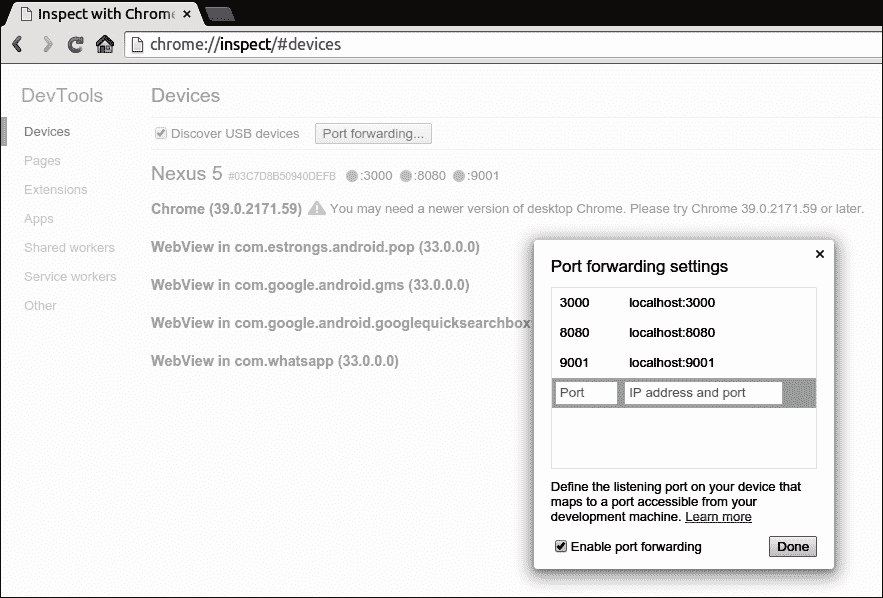
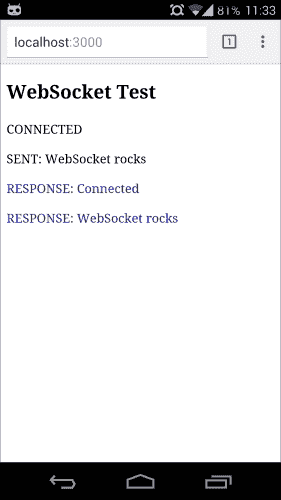
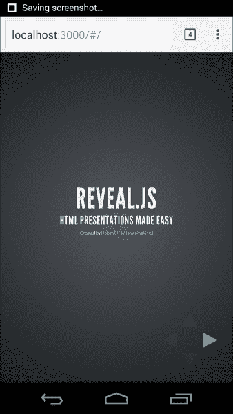
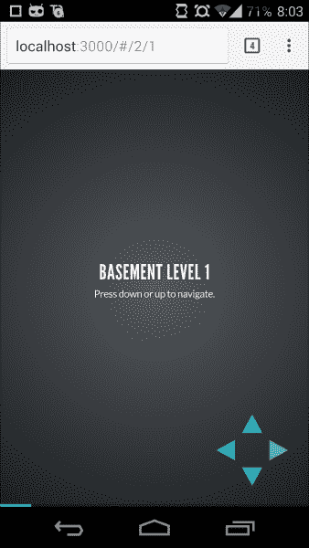

# 第五章：移动和平板电脑的 WebSockets

WebSockets 在 Web 上运行良好并且性能良好。我们已经看到了在 Web 上实现 WebSockets 是多么简单和强大。随着手机的增长，应用程序从桌面转移到移动设备的需求变得非常重要。在本章中，我们将重点关注 WebSocket 的行为以及在移动设备和平板电脑上的实现。

# 移动设备和 WebSocket

整个世界都在转向移动设备；那么我们为什么不呢？手机已经变得非常强大，它们可以做电脑能做的事情。同样，浏览器也变得非常强大，它们也开始采用 HTML5。不仅仅是浏览器，甚至应用程序的支持也增加了。有很多应用程序提供了很多功能。在这里，WebSockets 扮演了一个重要的角色：每当需要实时数据传输时，WebSockets 都可以帮助我们。让我们看一些 WebSockets 可以帮助的情况：

+   聊天应用程序

+   视频会议

+   游戏

+   具有实时数据更新的仪表板

+   股票应用

+   体育比分应用程序

+   实时数据更新

现在所有这些应用程序都可以在 Web 上制作，并且与浏览器兼容，这要归功于支持 HTML5 的现代浏览器。

要在移动设备上实现 WebSockets，有一些可用的库可以使用。需要提供一种一致的方式来在不同的后端技术中实现 WebSockets。有一些库提供了这些功能：

+   推动者

+   Socket.IO

## 推动者

Pusher 是一个著名的库，可帮助您制作实时应用程序。您可以在[`www.pusher.com`](http://www.pusher.com)找到它。这是一组构建的库，可与不同服务器上构建的不同应用程序集成，例如 Ruby on Rails、Python、PHP 和 Node。它不仅在服务器端提供支持，还为基于 JavaScript 的应用程序以及 iOS 和 Android 设备提供支持。

Pusher 是一个基于事件的 API，并实现了发布者/订阅者机制。在这里，订阅者是服务器，发布者是客户端。订阅者订阅事件，发布者触发订阅者监听的事件。为了实现这个功能，发布者和订阅者在内部实现了 WebSockets，这基本上提供了实时体验。

Pusher API 的另一个重大优势是它具有备用机制，当 WebSockets 不可用时，例如在一些较旧的浏览器版本中，然后它在内部使用 Flash 等其他技术来发送数据。这使得该库具有优势，因此我们不需要为不同的浏览器和设备编写不同的实现。

## Socket.IO

Socket.IO 是另一个完全基于 JavaScript 的库。它不仅支持客户端，还完全支持 Node.js 服务器。该库提供高性能的实时数据传输，并在内部使用 WebSockets。您可以使用此 API 制作各种实时协作应用程序。

# 在移动设备上运行服务器

到目前为止，我们一直在本地服务器和应用程序上工作，但是要在移动设备上运行应用程序，我们需要将客户端应用程序代码转移到服务器，以便以服务器 URL 为应用程序提供服务。为此，我们将举一个简单的例子：基本上，我们将要更改一个我们已经创建的应用程序。在第二章中，*开始使用 WebSockets*，我们为 Echo 测试开发了一个应用程序，它基本上返回我们发送到服务器的任何内容。现在让我们看看它在手机上的运行方式。

首先，我们将更改服务器代码，以满足客户端代码。以下是我们将在服务器端进行的更改：

```js
var express = require('express');

var app = express()

var http = require('http').Server(app);

app.use(express.static(__dirname + '/public'));

app.get('/', function(req, res)
{

  res.sendfile('public/index.html');

});

http.listen(3000, function()
{

  console.log('listening on *:3000');

});

var WebSocketServer = require('ws').Server
  , wss = new WebSocketServer({ port: 9001 });

wss.on('connection', function connection(ws)
{

  ws.on('message', function incoming(message)
  {

    console.log('received: %s', message);

    ws.send(message);

  });

  ws.send('Connected');

});
```

一旦这些设置完成，您就可以开始了。只需在您的移动设备上打开 Chrome 浏览器，打开服务器 URL `http://localhost:3000`，看到魔法。您将看到与我们在桌面上看到的相同的输出。

打开 Chrome 浏览器，转到`chrome://inspect`。

```js
npm install express

```

这个软件包需要安装在与我们的`server.js`文件相同的目录中。这很重要，因为我们的服务器将运行并使用这个软件包，如果找不到它，服务器可能无法按我们想要的方式工作并抛出错误。

在这里，我们监听`3000`端口，所以每当我们打开`http://localhost:3000`时，它将打开指定的文件。我们已经在`public`文件夹下定义了文件，`index.html`。因此，我们将打开的第一个文件是`index.html`文件，我们将看到它的内容。就像我们在之前的章节中所做的那样，我们也在客户端代码中做了同样的编码，几乎没有任何变化。只是文件的位置已经改变了，没有别的。

### 如您所见，应用程序的输出没有任何变化。它与我们在桌面上看到的完全相同。

一旦更改完成，您可以启动服务器并在浏览器中检查它是否工作。由于您监听`3000`端口，只需在浏览器中运行`http://localhost:3000`，确保应用程序正常运行。

要安装 Express.js 服务器，我们只需要运行以下命令：

## 确保所有客户端代码及其相关库都放在`public`文件夹中，因为我们是从公共文件夹中提取它，如果没有正确放置，可能会出现错误。

更改完成后，我们需要在手机上运行本地服务器。这似乎很困难，但实际上并不是。谷歌 Chrome 为我们提供了一个很棒的功能，通过它我们可以在移动浏览器上使用本地服务器。以下是我们需要实施的在移动设备上运行本地服务器的步骤：

1.  注意

1.  浏览器支持

1.  使用 USB 将您的设备连接到计算机。

1.  在您的移动/平板设备上启用 USB 调试。

1.  现在我们需要考虑的主要设置是**端口转发**。我们使用两个不同的端口：`3000`用于客户端，`9001`用于 WebSocket 服务器。只需确保将它们都添加到**端口转发设置**中。

### 提示

在这里，我们没有针对移动设备做任何特定的事情；我们只是创建了另一个服务器，为我们提供主要的客户端文件。我们在这里使用了`Express.js`服务器，它有助于通过服务器提供内容。您可以在互联网上阅读更多关于`Express.js`服务器及其工作原理的信息。在这里，我们的主要重点只是创建一个将监听特定端口的服务器。因此，当有人访问该特定 URL 时，我们将在浏览器上运行客户端应用程序。

1.  这将检查连接的设备。

由于 HTML5 的原因，我们能够以非常简单的方式实现这种输出行为，因为 HTML5 在几乎所有浏览器中都表现一致，并且大多数浏览器都在采用它。这使我们能够使用 HTML5 WebSockets 制作应用程序，并使其几乎在任何地方运行。在构建应用程序时，我们需要确保具有响应式设计，因为移动设备具有不同的分辨率和不同的屏幕尺寸。这是在创建应用程序时需要注意的一个主要问题。但多亏了 HTML5，我们有了媒体查询，可以轻松处理这种情况。

### 手机输出





# 如果您在设置移动设备时仍然遇到问题，请访问[`developer.chrome.com/devtools/docs/remote-debugging`](https://developer.chrome.com/devtools/docs/remote-debugging)。您将获得有关如何设置移动设备的所有详细信息。

HTML5 已经被几乎所有浏览器采用，甚至在移动和平板设备上也是如此。这使得我们在几乎所有现代浏览器中使用 WebSocket 应用程序时具有优势。要检查哪些移动浏览器受支持，请访问[`caniuse.com/#feat=websockets`](http://caniuse.com/#feat=websockets)，这将为我们提供支持 WebSockets 的所有浏览器的列表。

# 自己动手

现在是时候自己动手了：为移动设备创建应用程序与为桌面设备创建应用程序一样容易。现在让我们将一些应用程序转换为移动设备。

## 情景 1

由于我们已经开发了一个演示共享和绘图应用程序，现在我们也将它们提供给移动设备。

### 提示

这是一个非常简单的任务：正如我们所知，我们只需更改服务器以提供客户端应用程序，然后就可以了。我们不必改变其他任何东西的原因是，我们用于应用程序的库编写得非常好，它们也可以适应移动视图。试试看。

当您在移动设备上打开演示共享应用程序时，它将是这个样子：



## 情景 2

服务器将保持不变，但您可以通过使用类似**Bootstrap**的库来调整客户端应用程序界面，使其根据设备屏幕大小进行响应。对于实时数据传输，您可以使用非常易于使用和实现的 Socket.IO API。

### 提示

**为桌面和移动创建一个聊天应用程序**

为此，您需要创建一个服务器，它只接收消息并将其广播给所有人。客户端将非常简单，以便它只向服务器发送消息。这很简单直接，但关键是您需要为桌面和移动设备制作它。

请参考以下图片。



## 情景 3

制作一个问题游戏，您可以通过使用用户界面输入问题和选项来提问。其他人将收到问题并回答。一旦回答，您将立即收到答案。

### 提示

就像聊天应用程序一样，您可以使用相同的 Socket.IO API 来发送数据。其余的都很容易——只要用户回答问题，您就可以使用 API 发送它。

# 总结

在本章中，我们已经看到了在 HTML5 中编码是多么容易，利用其特性提供设备无关的应用程序。几乎所有现代浏览器都支持 WebSockets，这使得我们在开发一致的应用程序方面变得更加容易——我们不必为不同的设备编写不同的代码。我们还看到了 Node.js 如何为不同的设备提供灵活性和良好的支持。在本章中，我们探讨了不同的移动应用程序和一些 API，这些 API 有助于我们实现 WebSockets，以及如何设置本地服务器来运行应用程序。

在下一章中，我们将看到如何使用现代工具增强 HTML5 Web 应用程序开发。
