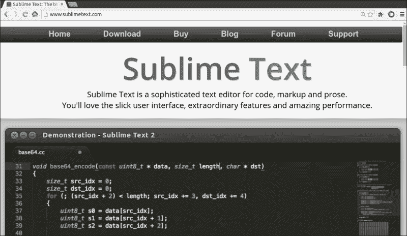
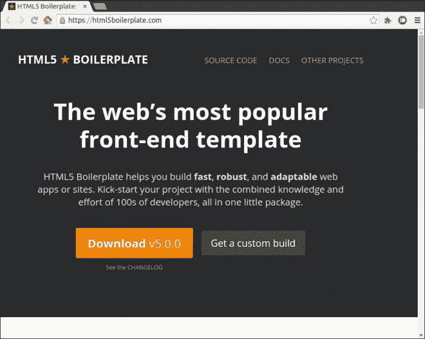
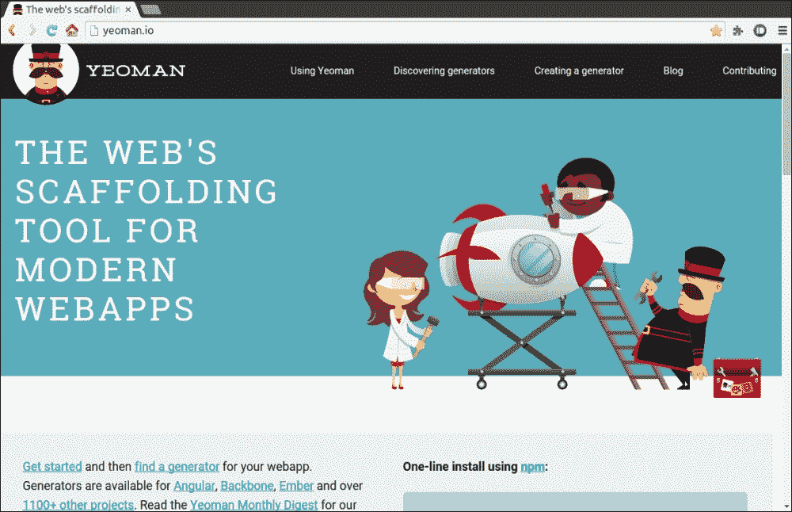
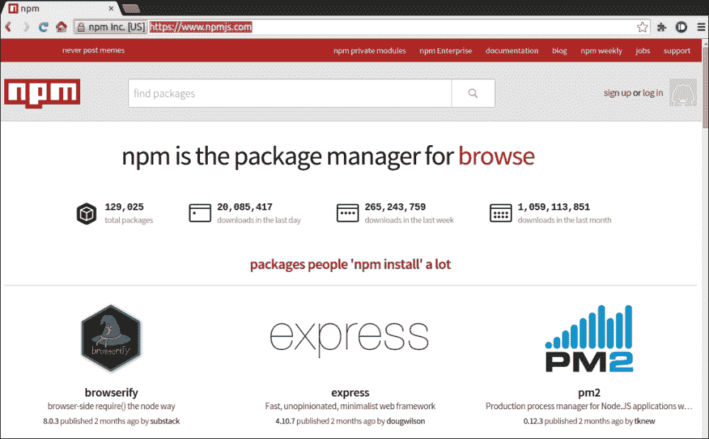
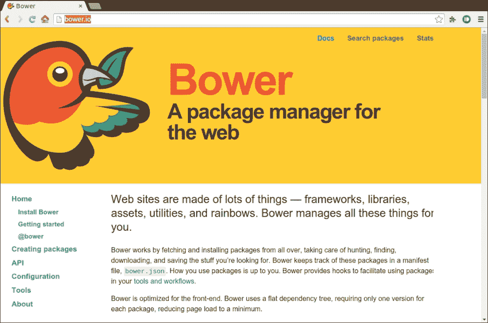
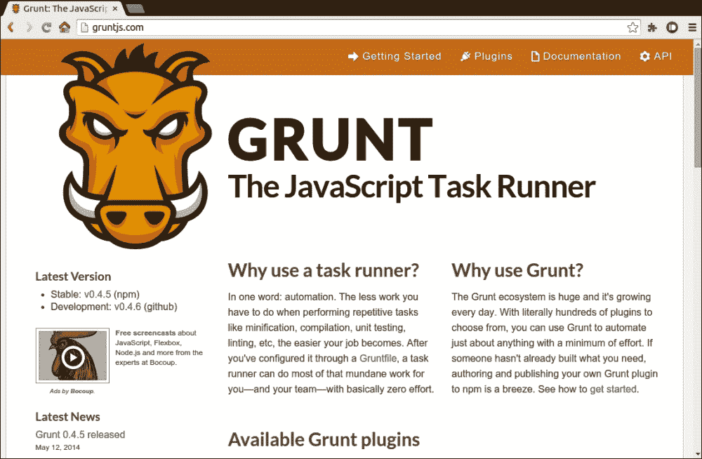
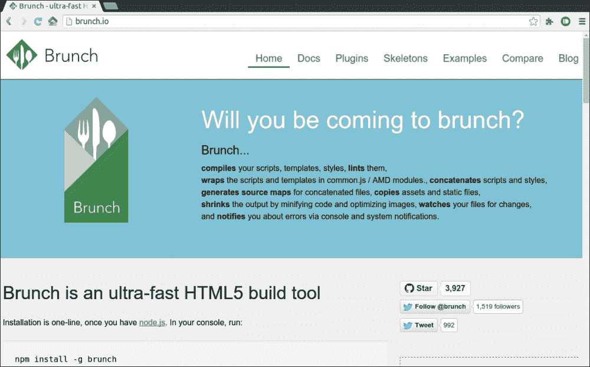
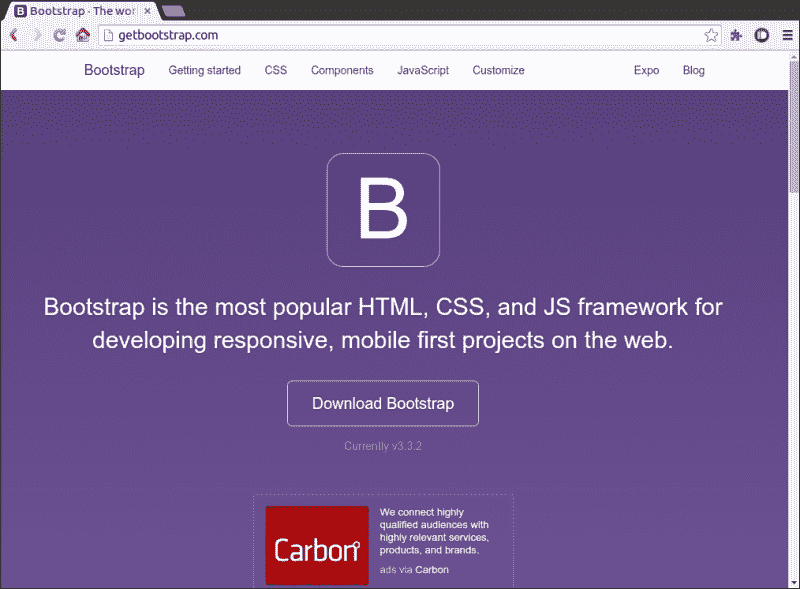
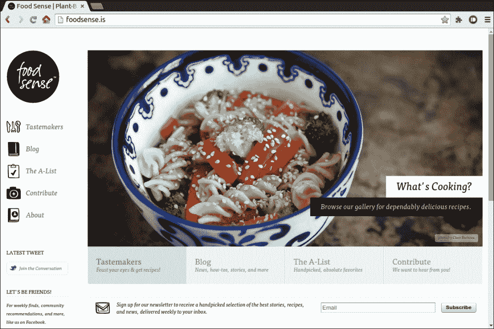

# 第六章：使用现代工具增强 HTML5 Web 应用程序开发

HTML5 是一个现代规范，定义了我们在之前章节中看到的许多功能。应用程序开发中面临的最大问题之一是代码管理：您将如何构建应用程序，使其易于阅读，扩展，可维护等。在本章中，我们将看到现代应用程序开发的现代方法或工具。一旦我们了解了不同的技术，方法和工具，我们就能够增强我们的应用程序。

# 现代工具和技术

有许多不同的工具和技术可以使开发过程变得无缝。让我们谈谈一些使开发人员生活更轻松的现代工具和技术：

+   代码编辑器

+   样板

+   包装工具

+   构建工具

+   应用程序框架

+   现代服务器

+   响应式网页设计

## 代码编辑器

在开始编码之前，首先要选择的是我们将用于编码的编辑器。有许多编辑器可供选择，但最受欢迎的是**Sublime Text**。这是一个免费使用的工具，对不同的技术有很好的支持。

Sublime 提供的一些功能如下：

+   只需按下*Ctrl*+*Shift*+*P*即可导航到文档中的任何位置

+   无干扰模式

+   基于 Python 的优秀插件 API，您可以进行实验

+   Package Control 提供了许多不同的包可供选择，并可在任何您想要的技术上工作

## 样板

这些只是不同的现成模板，可以帮助加速流程。正如我们都知道模板是什么以及它们将如何帮助，让我们看一些样板的例子：

+   我们可以在 Sublime Text 中获得一个样板插件，在应用程序开发过程中非常有用。

+   有一些样板可以帮助您创建完整的代码文件夹结构；其中之一是[`html5boilerplate.com/`](https://html5boilerplate.com/)。

+   Yeoman 是另一个工具，可帮助您快速启动项目，并可在[`yeoman.io/`](http://yeoman.io/)找到。这是一个非常强大的工具；它不仅有助于快速启动应用程序，还为这些应用程序提供了工作流程。这主要是一个工具，可以让您在开发过程的不同阶段提高生产力。它还为您提供了制作自己的构建配置的功能。

## 包装工具

随着应用程序规模的增长，当存在不同的依赖关系时，管理变得困难。在多人共同开发项目的环境中，我们需要注意版本和依赖关系。软件包管理器解决了这个问题。对于现代技术来说，最流行的软件包管理器之一是 NPM。NPM 为您提供了一种非常简单的方式来维护您的软件包并安装它们。

在之前的章节中，我们在应用程序中使用了 WebSocket 和 Express.js 包，并且只需一个命令就安装了它们。软件包管理器使得制作应用程序的不同模块的软件包以及发布它们变得容易。有许多不同的软件包可供我们利用，以使我们的应用程序更好。

Bower 也是一个非常有用的工具，提供软件包管理。它基本上为您管理所有事情，例如查找，下载和保存依赖项，使用一个配置文件。

## 构建工具

当我们制作一个应用程序并且代码长度增加时，我们使用构建工具来构建应用程序，以获得优化的、编译的、测试的和自动化的过程。构建工具在为用户提供优化的应用程序方面真的很有帮助。自动化是构建工具的最大优势；它只是为你自动完成所有事情。现在让我们来看一些用于 HTML5 和基于 JavaScript 的应用程序的伟大、简单和现代的构建工具：

+   Grunt：JavaScript 任务运行器（[`gruntjs.com/`](http://gruntjs.com/)）

+   **Brunch**：HTML5 构建工具（[`brunch.io/`](http://brunch.io/)）

## 应用程序框架

给应用程序一个合适的结构是在开发过程中实施的关键事情。许多应用程序在发展过程中失败，都是因为它们的结构；如果基础不好，那么无论你建造多大的建筑物，它总有一天会倒塌。同样地，我们也必须考虑构建我们的应用程序。有许多不同的可用框架，我们可以使用一些流行的框架有：

+   AngularJS

+   Ember.js

+   Backbone.js

+   Ext JS

## 现代服务器

服务器一直是 Web 开发人员的问题，因为虽然有选择，但它们使用不同的技术。学习另一种技术总是一种负担。然而，JavaScript 服务器 Node.js 解决了这个问题。我们已经看到它是如何工作的。Node.js 服务器也有许多不同的包可用，你可以用它们来使你的应用程序更好。

## 响应式网页设计

UI 一直是任何应用程序的关键元素。以前，我们只在计算机上打开应用程序和网站。但现在情况正在改变；手机和平板电脑正在出现并占领市场。现在公司正在推出他们应用程序或网站的 Web 版本。由于这个阶段，开发人员也为移动设备制作了相同的网站。这是一件昂贵的事情，因为它涉及应用程序的所有生命周期阶段。

然而，使用现代 HTML5 技术，我们不必过多考虑，因为这项技术已经具备了功能：HTML5 中有一些功能可以帮助我们使相同的网站看起来很好或响应。响应式意味着网站会根据屏幕大小自适应。如果是小屏幕，它不会只显示实际网站的较小版本；相反，它会重新缩放和调整，以便所有内容对用户可读。

再次，实施这需要在网站的不同位置进行更改，但我们已经有了不同的已构建的库，可以帮助我们在很短的时间内制作高度响应的网站。其中最常用的库之一是 Bootstrap。这个库不仅可以让你轻松地使你的网站响应，还为你提供了一整套不同的 UI 控件。

响应式 UI 的最佳示例之一是网站[`foodsense.is/`](http://foodsense.is/)。他们真的在 UI 的每一个细节上都进行了精心的工作。如果你打开网站，你不会感觉到任何不同，但当你开始减小浏览器窗口的宽度时，你将能够注意到变化。这些变化是小而有用的：按钮变小了，但主要内容完全正常。随着你不断减小宽度，它会不断变化，并在较小的宽度下提供一个完美可读的网站，这基本上显示了网站在移动设备上的外观。

让我们看看当我们改变浏览器的大小时，UI 是如何改变或适应的：

+   **在桌面上的正常状态**：在那里你可以看到它就像任何其他网站一样-一个菜单栏，一个图像滑块，一些按钮和一个订阅选项。

+   N 代表 Node.js

+   **在平板尺寸下**：当我们将窗口大小减小到平板尺寸时，我们可以注意到变化。左侧菜单栏现在在顶部，图像滑块下方的按钮上的详细信息更少。因此，网站只显示所需的内容，并在屏幕尺寸较小时隐藏一些细节。

## 这本书向我们介绍了快速应用程序开发的不同技术。我们已经看到了 HTML5 的增强；我们学习了 WebSockets 的工作原理。我们已经开发了一些基于 HTML5 和 WebSockets 的应用程序。WebSockets 是通信的最佳方法之一，它提供了一些很棒的功能，比如全双工通信，允许客户端和服务器推送数据。我们了解了基于 Node.js 的服务器可以非常有用且易于实现，还有 WebSocket 服务器。我们通过 WebSockets 实现了不同的全双工通信示例。我们接触了一些基于 JavaScript 的不同库，为我们提供了现成的组件供我们使用。我们还看到了 WebSockets 在移动设备上的工作，并了解了 HTML5 的不同移动 Web 设计特性。最后，我们看到了可以帮助加速应用程序开发过程的不同工具和技术。这些技术不仅有助于，而且还能为您的应用程序带来新的外观和感觉。使用包管理器可以轻松管理依赖关系。所有这些现代工具、MEAN 堆栈提供的加速开发以及响应式 Web 设计将使您能够制作适用于所有设备的现代应用程序。

**在移动尺寸下**：现在当我们将窗口大小减小到移动设备的宽度时，我们可以看到菜单在顶部，其后是标志和滑块。基本上，项目是垂直堆叠的，这是移动设备的最佳视图。我们已经看到了 UI 随着宽度的变化而变化；这一切都是由 HTML5 中的媒体查询功能实现的。

+   MEAN 堆栈为我们提供了构建 Web 应用程序的现代技术。要创建任何应用程序，我们需要一个服务器、一个数据库和一个客户端框架。所有这些都在 MEAN 堆栈中考虑到，并与彼此无缝集成，帮助开发人员构建大型应用程序。

+   A 代表 AngularJS

+   MEAN 堆栈为我们提供了构建 Web 应用程序的现代技术。要创建任何应用程序，我们需要一个服务器、一个数据库和一个客户端框架。所有这些都在 MEAN 堆栈中考虑到，并与彼此无缝集成，帮助开发人员构建大型应用程序。

+   E 代表 Express.js 框架

对于完整的应用程序开发，MEAN 堆栈是最好的工具之一。MEAN 代表：

在[`mean.io/`](http://mean.io/)有一个可用的库，它为您提供了完整的 MEAN 堆栈，并帮助您管理应用程序开发。由于打包管理器，使用这些库真的很容易，并有助于加快开发过程。

# 总结

M 代表 MongoDB
