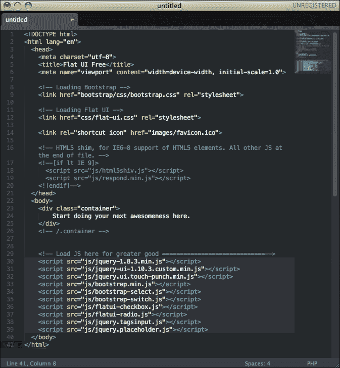
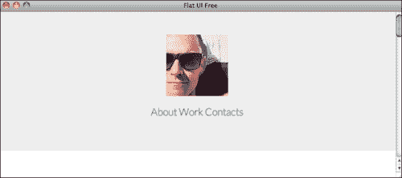
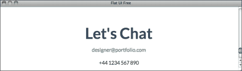
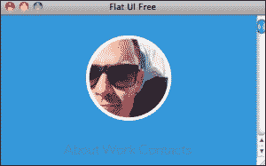
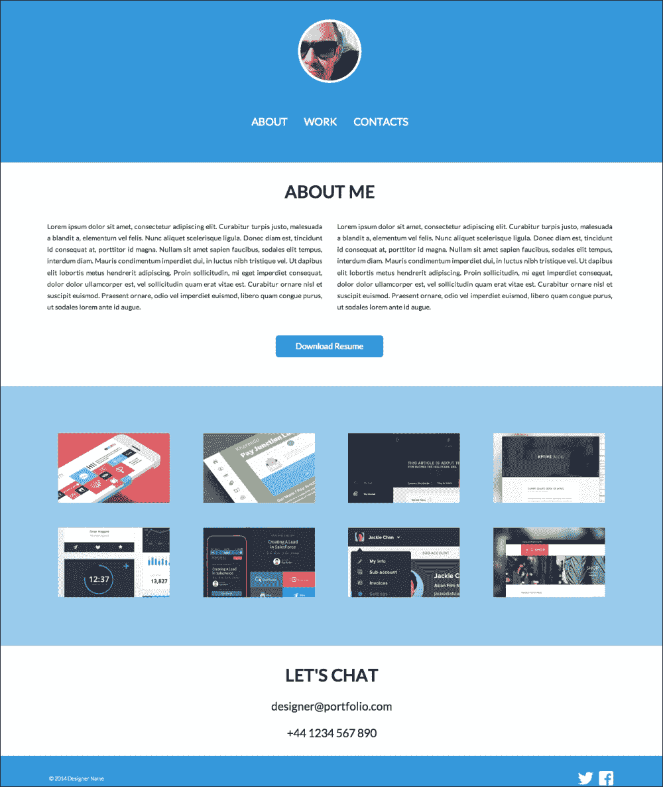

# 五、开发你的网站

在本章中，我们将开发我们在[第 4 章](4.html "Chapter 4. Designing Your Own Flat Website")中设计的平面网站，*设计您自己的平面网站*。为此，我们将使用 Designmodo 平面 UI，它是在 TwitterBootstrap 之上创建的，TwitterBootstrap 是一个前端框架，具有预先开发的组件，允许更快的开发。我们还将介绍如何使用 jQuery 构建导航动画。

# 创建我们的文件夹树

在大型项目中，正确地组织文件以及创建全面的文件结构非常重要。在较小的项目中，您可能没有意识到这一点的重要性，但这是您应该从一开始就养成的习惯，这样当您在较大的项目中工作时，您就可以从一开始就实施良好的实践。

这是非常容易做到的，而且你也可以根据自己的喜好来调整。我喜欢把我的文件分类整理。当我开始一个开发项目时，我喜欢做的第一件事就是创建三个文件夹：`css`，我显然在那里保存我的 CSS 样式文件；`img`，保存用于构建网站的图像；以及`js`，保存所有 JavaScript 文件。在主文件夹的根目录中，您的 HTML 文件应该可以通过使用相对路径轻松加载其余文件。

这是一项非常简单的任务，但它可以帮助您以一种方式组织所有文件，使您能够使用相对路径，在本地工作，并在项目结束时更轻松地将所有内容导出到服务器。

web 开发项目的典型文件夹树类似于以下屏幕截图所示：


现在我们已经讨论了如何开始我们的项目，让我们开始谈正事。但是在我们开始开发我们的项目之前，我们需要准备好我们的图像。

# 准备我们的图片

我们开发项目的第一步是基于 Photoshop。我们需要回到我们的网站设计文件，并导出我们的页面所需的图像。

因为我们设计了这样一个最小的页面，所以页面中的大多数元素都是由 HTML 元素构成的，而不是由图像构成的。尽管如此，我们仍然有一些图像，比如我们的头像和工作缩略图，所以让我们将它们导出到我们的页面中使用。

关于阿凡达，我们有两种方法可以做到这一点；简单的方法和正确的方法。简单的方法是将我们的圆圈化身及其边框导出为一个透明背景的`.png`文件。下面的屏幕截图显示了具有透明背景的`Avatar.png`文件：


通过导出一个透明的`.png`文件，我们可以轻松地使用网页中任何背景颜色的图像，这将起作用，而且可能已经足够好了。但这并不是最好的方法。如果你想在网站完成后更改你的头像怎么办？或者，如果你想更新网站的颜色和改变你的笔划颜色呢？然后你需要回到 Photoshop，重新导出这张图片，这只是一个痛苦。

但幸运的是，我们可以在 HTML 中实现大部分效果，这样您就可以在头像中使用一个常规的正方形图像，其余的都可以通过代码完成。这样，你就可以通过改变普通的头像图像或几行 CSS 来更新你的头像。此外，如果您是为客户或公司执行此项目，则可以通过使更新独立于设计器工作来简化将来的更新。我们将在书中进一步访问代码；现在，只需确保将头像导出为 128 x 128 像素的正方形图像。这应该类似于以下屏幕截图中显示的内容：


现在，让我们导出缩略图。这部分很简单；只需确保导出所有大小相同的缩略图，以保持一致性，并便于将来更新。有几种方法可以做到这一点。我喜欢创建一个具有图像尺寸（225 x 141 px）的新文档，复制并粘贴我的所有层，然后分别保存它们。然后，我将该文档保存为模板，以备将来使用。这样，我知道每次我需要创建缩略图时，我都会使用相同的文档。

但是，您可以使用其他方法进行此操作。您可以使用切片并为文档中的每个图像创建切片（键盘快捷键*C*，并直接导出切片图像（在**为 Web&设备保存**菜单上，您可以选择要导出的切片类型）。您还可以使用 Photoshop 中名为**生成图像资源**的新功能，该功能自 2013 年在 Photoshop CC 中提供，允许您轻松地将层或文件夹重命名为文件名（如`background.png`，然后选择从该层自动生成图像文件。这是一种为大型项目创建多个资产的好方法，而且更新非常容易，因为资产是使用任何文件保存选项自动生成的。如果您有兴趣了解有关 image assets generator 的更多信息，我绝对建议您参考 Adobe 帮助链接：[http://helpx.adobe.com/photoshop/using/generate-assets-layers.html](http://helpx.adobe.com/photoshop/using/generate-assets-layers.html) 。

不管怎样，如果你愿意，你可以继续这样做，但是要确保你的图像大小保持一致，并且你以 100%的不透明度导出它们，因为如果你想使用任何类型的滚动效果，我们可以并且以后会用 CSS 来做。

我们唯一缺少的另外两张图片是 Twitter 和 Facebook 图标。对于这些，我们将它们保存为 32 x 32 px 方形透明`.png`，这样，如果我们希望更改页脚的背景，我们仍然可以使用它们。

我们现在已完成图像准备！

# 开发我们的页面

现在我们已经准备好了图片，让我们开始创建页面。就像设计一样，我们将自上而下地创建，从页眉开始，发展到页脚的布局。

为此，我们将免费使用 Designmodo 平面 UI，因此我们需要做的第一件事是导入我们将要使用的文件。如果您还没有完成，请从[下载 http://designmodo.com/flat-free/](http://designmodo.com/flat-free/) 。访问该页面并点击**下载 HTML**。这将为您提供一个包含 Designmodo 平面 UI 免费包、Twitter Bootstrap 3 和一些示例文件的 ZIP 文件。

所以，正如我们前面介绍的，让我们从创建文件夹树开始。创建以下文件夹：`css`、`js`和`img`。我们还需要额外的资源，因此创建两个额外的文件夹：`fonts`，我们将在其中保存使用的自定义字体和`bootstrap`，我们将在其中保存将要使用的引导文件。

Designmodo Flat UI Free pack 构建在 Twitter 引导之上，因此我们将有效地使用 Twitter 引导来构建此页面。Twitter Bootstrap 是一个前端框架，它附带了各种预先开发的元素和样式，这使得开发人员创建简单页面更容易、更快。我是优化工作的坚定信徒，没有必要不断地重新发明轮子。我们将要使用的大多数东西已经做了数百或数百万次，所以让我们共同努力使我们自己的生活更轻松。这就是推特引导非常方便的时候了。如果您想了解更多关于 Twitter 引导的信息并查看所有示例和指南，您可以在线访问[http://getbootstrap.com/](http://getbootstrap.com/) 。

现在我们已经创建了文件结构，让我们用所需的文件填充它。首先，让我们将之前从 Photoshop 导出的图像上传到`img`文件夹中。在我们的`css`文件夹中，我们将粘贴 Designmodo 包中的`flat-ui.css`文件。我们现在不会使用任何 JavaScript，因此不需要复制包中提供的 JavaScript 文件。将 Designmodo pack 的`fonts`文件夹的内容复制到您自己的`fonts`文件夹中，同时复制`bootsrap`文件夹并粘贴到您的`root`文件夹中。这包括引导使用的所有样式和资源。现在，您的主文件夹看起来应该与以下屏幕截图中所示的类似：


这包括开始创建页面所需的所有文件，有了这些文件，我们最终可以启动 HTML。

打开 HTML 编辑器，创建一个名为`index.html`的新文件。这将是我们的网站。Debug Mod 包有一个名为水果挞 T1 的文件，它是一个干净的启动页面，它已经初始化了基本 HTML 结构，这是一个很好的工作基础。因此，打开文件，复制其内容，并将其粘贴到您的`index.html`文件中。

以下屏幕截图显示了索引文件中应该包含的内容：



我们可以从这里删除一些内容。favicon 部分`<link rel="shortcut icon" href="img/favicon.ico">`可以删除，因为我们没有为此页面以及`<!-- Load JS here for greater good =============================-->`之后加载的所有脚本设计 favicon。我们将使用 JavaScript，但我们将根据需要加载文件，以避免不必要的文件占用空间。

我们现在不会创建任何 CSS 文件；我们将只关注于创建 HTML 文件，并准备好包含内容的文档，以便以后对其进行样式设置。当我们使用 Twitter Bootstrap 时，我们将尝试通过使用 Bootstrap 中的现有功能和样式尽可能地复制我们的设计，只有在这之后，我们才能创建自己的样式来定制页面以满足我们的需要。

因此，要创建标题，我们需要一个`<div>`元素，该元素将填充整个浏览器的宽度，以创建我们设计的视觉效果。为此，我们将使用 Bootstrap 已经提供的名为`jumbotron`的类。您可以在[在线查看示例引导文件 http://getbootstrap.com/examples/jumbotron/](http://getbootstrap.com/examples/jumbotron/) 。本质上，这是一个`div`类，其宽度定义为 100%，并延伸以使用不同的背景色填充浏览器。本`div`的结构如下：

```html
<div class="jumbotron">
      <div class="container">
      </div>
    </div>
```

在`<body>`标签后面插入此代码。如果您在浏览器中保存并刷新您的文件，您将能够在`Jumbotron`div 中看到填充浏览器的层的效果。现在，我们只需要将我们的内容插入`div`容器中，如下代码所示：

```html
<p class="text-center" ></p>
        <p class="text-center">
            <a href="#">About</a>
            <a href="#">Work</a>
            <a href="#">Contacts</a>
        </p>
```

如你所见，我们在一些元素中使用了`class="text-center"`。这是一个引导类，负责将文本对齐设置为居中，并将元素居中，使其看起来有点像我们的设计标题。当然，有一些事情需要更改，但我们将在 CSS 中进行这些更改。以下屏幕截图显示了在浏览器中打开 HTML 文件时的外观：



非常接近我们要做的，对吧？

现在，对于我们的`About`部分，我们需要创建一个标题、两个文本块和一个按钮。幸运的是，这主要是通过使用引导样式来实现的。对于标题，我们将使用一个`<h2>`标记；对于块，我们将使用具有特定块类的段落，其如下所示：`<div class="col-md-6">`。Twitter Bootstrap 附带了一个响应网格系统，该系统由 12 列组成。所以在本例中，我们要创建两个块，它们将占据屏幕的每一半。因此，每个块将有六列，因此使用了类`col-md-6`。正如我所说，这是一个响应网格，这意味着该网站将通过动态调整列的大小以适应所使用的设备来适应平板电脑和智能手机。

我们的按钮也可以通过使用引导标签轻松实现；在这种情况下，由于 Designmodo 平面 UI 包，它是平面样式。我们的按钮将如下所示：`<p class="text-center"><button class="btn btn-hg btn-primary">Download Resume</button></p>`。button 元素有`btn`类，这是负责赋予按钮外观的主要类；其他的是设置颜色和行为。我们将在以后更改此选项，以使用我们的颜色和字体选项。因此，本节的 HTML 代码如下所示：

```html
   <div class="container">
      <div class="row">
        <h2 class="text-center">About Me</h2>
        <div class="col-md-6">
          <p>Text</p>
        </div>
        <div class="col-md-6">
          <p>Text</p>
        </div>
       <p class="text-center"><button class="btn btn-hg btn-primary">Download Resume</button></p>
      </div>
  </div>
```

只需替换我们更大文本块的文本，使其适应专栏；我们的**关于我的**部分应该如以下截图所示：


接下来，我们将创建`Work`部分。由于这也将有一个蓝色的宽背景，我们将再次使用`jumbotron div`元素作为我们的主容器。在我们的设计中，我们有一个由 2 x 4 个缩略图组成的网格，由于行和列构成引导网格，我们需要创建两行，每行四个缩略图对应一行。考虑到 12 列网格在引导中的工作方式，我们需要为每个缩略图使用*12/4=3*列，其中我们有四列。以下是我们工作部分的最终代码：

```html
<div class="jumbotron">
      <div class="container">
        <div class="row">
          <div class="text-center col-sm-6 col-md-3">
            </div>
          <div class="text-center col-sm-6 col-md-3">
            </div>
          <div class="text-center col-sm-6 col-md-3">
            </div>
          <div class="text-center col-sm-6 col-md-3">
            </div>
        </div>
        <div class="row">
          <div class="text-center col-sm-6 col-md-3">
            </div>
          <div class="text-center col-sm-6 col-md-3">
            </div>
          <div class="text-center col-sm-6 col-md-3">
            </div>
          <div class="text-center col-sm-6 col-md-3">
            </div>
        </div>
      </div>
    </div>
```

在这里你可以看到我们为背景创建了一个`jumbotron div`元素，为线条创建了两行`div`元素，每行有四个分区，里面有一个图像，这是我们的缩略图。检查我们用于这个`div`元素的类很重要，因为它们用于网格。使用的 div`<div class="text-center col-sm-6 col-md-3">`有三个不同的类。`text-center`类用于将我们的图像置于块的中心；它的响应能力很强，它会根据屏幕大小改变大小，我们不希望图像大于原始文件大小，因为这会产生像素化并破坏图像质量。类`col-md-3`负责在桌面设备中对齐网格中图像的位置，这意味着每个图像将占据三列。`col-sm-6`类指平板电脑设备，这意味着在平板电脑宽度中，每行显示两个缩略图。这将创造更好的自适应体验，因为它将在台式机上显示每行四个缩略图，在平板电脑上显示两个缩略图，在智能手机上仅显示一个缩略图，最小的一个，如以下屏幕截图所示：


只需使用Bootsrap 代码，我们就能够快速、轻松地创建一个可用于`Work`部分的响应性缩略图网格。

`Contact`部分可能是其中最简单的部分，因为我们只需要创建三行内容。我们将再次使用一个`<h2>`元素作为标题，然后每行内容使用两个`<p>`元素，如下代码所示：

```html
<div class="container">
  <h2 class="text-center">Let's Chat</h2>
    <p class="text-center"><a href="mailto:designer@portfolio.com">designer@portfolio.com</a></p>
  <p class="text-center">+44 1234 567 890</p>
</div>
```

代码也相当简单。我们只是使用`text-center`标记将页面中的文本居中，然后在电子邮件中创建一个链接，以便访问者可以直接单击发送任何邮件。通过使用`href=mailto:designer@portfolio.com`，我们允许浏览器打开一个邮件程序来创建一封新的电子邮件，其中`e-mail`字段已经填充了此信息，从而使发送邮件变得更容易。这种行为在任何情况下都可能不好，因为有时可能未配置默认电子邮件程序，或者用户可能使用无法打开此类链接的 webmail 客户端，因此只有在您认为这样做有意义的情况下，才使用此行为。

以下屏幕截图显示了我们的简单联系人部分的外观：



最后一个要创建的元素是页脚，我们将再次使用`jumbotron div`元素。我们需要做更多的调整，以确保页脚粘在页面底部，但我们会在一分钟内，当我们在我们的页面样式工作。

因此，对于页脚，我们将创建`jumbotron div`元素，一个带有版权文本的段落，以及两个带有社交网络图标的超链接。这看起来根本不像我们想要实现的，但是我们的内容是我们需要的，现在只需要通过样式来改变它的外观。下面是我们页脚的最后一段代码：

```html
<div class="jumbotron">
      <div class="container">
        <p>
          <span class="text-left">© 2014 Designer Name</span> 
          <a href="#"></a>
          <a href="#"></a>
        </p>
      </div>
    </div>
```

有了这最后一段代码，我们的基本 HTML 页面就完成了，可以使用 CSS 进行一些样式设计工作了。

# 用 CSS 设计我们的页面样式

让我们先在`css`文件夹中创建一个名为`main.css`的新文件。这将是我们放置自己风格的地方，以根据我们的设计定制页面外观。文件就绪后，我们现在需要在 HTML 页面中链接 CSS 文件。转到您的`index.html`文件，将`<link href="css/main.css" rel="stylesheet">`添加到`<head>`标签中，并确保在`bootsrap.css`和`flat-ui.css`之后添加它；否则，我们的样式可能会被覆盖而无法工作。

我们要做的第一个更改是文本颜色。因为我们希望它是我们在设计中设置的颜色，所以让我们为`<body>`标记中的每个元素将文本颜色设置为`#222222`。我们使用以下代码来实现这一点：

```html
body{
  color: #222222;
}
```

现在，让我们从标题开始，让我们将其背景设置为蓝色。我们将为此选择的颜色代码为`#3498db`，由于我们希望为每个`jumbotron div`元素更改此颜色代码，因此我们将针对`jumbotron`类，如下代码所示：

```html
.jumbotron{
  background-color: #3498db;
}
```

保存该文件并在浏览器中刷新它，您会注意到，它将立即看起来更像您的蓝色背景部分的设计。对于头像，我之前告诉过你，我们可以用 CSS 制作圆形头像。我们之所以能够做到这一点，是因为 CSS3 允许我们在边界和边界半径中轻松创建圆角。通过将边界设置为 50%，它将在每个角创建这样一个半径，从而形成一个完美的圆。因此，请记住，这并不适用于所有浏览器，因为并非所有浏览器都支持 CSS3，但您应该始终使用最新的技术和技术来充分利用它们，同时始终记住旧版本的优雅降级。

在这种情况下，唯一的问题是，在较旧的浏览器中，化身将是正方形而不是圆形。这不是一个大问题，因为这只是视觉上的差异，根本不会影响业务或可用性。但是回到我们的头像，我们希望它是一个圆圈，有一个白色的边框，所以我们需要在 CSS 选择器中定位我们的头像。因为我们的化身只是一个标记，所以我们需要返回 HTML 文件并更改标记以包含一个类，例如``。现在，我们可以在 CSS 中以`.avatar`为目标，下面是我们将用于效果的代码：

```html
.avatar{
  -webkit-border-radius: 50%;
  -moz-border-radius: 50%;
  -ms-border-radius: 50%;
  -o-border-radius: 50%;
  border-radius: 50%;
  border: solid 5px #FFF;
  display: inline-block;
}
```

这就可以了，我们的头像现在看起来和我们原来的设计一模一样。但是，Safari 和其他浏览器可能会遇到一些问题，因为每个浏览器呈现这些元素的方式略有不同。所以，你可以做一个小的改变，它仍然可以工作。您可以将图像定义为 CSS 中的背景图像，而不是将图像放在 HTML 文件中，这将解决问题。在 HTML 文件中，将行更改为`<p class="text-center"><span class="avatar"></span></p>`；在 CSS 文件中，添加以下参数：

```html
background: url('img/avatar.jpg'); 
height: 128px; 
width: 128px; 
```

现在，它也应该在 Safari 中工作，但每次尝试一些新技术时，一定要检查它的工作和中断位置，因为总有一些方法可以调整代码使其工作。以下屏幕截图显示了您的头像在实时 HTML 页面中的工作方式：



对于菜单，我们将使用以下代码：

```html
#header a{
  text-transform: uppercase;
  color: #ffffff;
  margin: 0 15px 0 15px;
  font-weight: bolder;
}

#menu{
  margin-top:50px;
}
```

### 提示

请记住，始终缩进您的代码，无论是 HTML、CSS、JavaScript 还是任何其他语言。它使您和其他人更容易阅读、快速可视化和分析更大的代码块。

正如您所看到的，我们在这个 CSS 中使用了新的 ID。`#header`类是我们在 HTML 中为整个标题`<div>`设置的 ID，`#menu`是为`<p>`元素设置的 ID，其中我们有菜单链接。随着我们开始做越来越多的样式设计，我们需要设置类和 ID，以便能够选择 HTML 文件中的特定元素。在这里，我们通过使用`text-transform`并将颜色更改为白色来确保我们的链接是大写的。此外，为了适应我们的设计，我们将字体的重量改为更大的重量。

对于`About`部分，我们需要更改一些内容，例如标题大小、文本字体大小以及行高。最后，我们将使用边距和填充使元素之间的间距与我们设计的完全相同。这个 CSS 的一个非常重要的部分是`text-align: justify`属性，它使文本块与我们的设计具有相同的文本对齐方式，塑造文本以适应块并帮助视觉定义布局。

我们还希望更改按钮的颜色以匹配调色板，因此我们通过定义`.btn`元素的背景色来实现这一点。这样我们可以覆盖以前使用的颜色。我们还将在鼠标滚动时更改颜色，因此当鼠标在元素上时，我们将使用选择器`.btn:hover`更改元素的样式。您会注意到，当您滚动按钮时，会出现一个小的淡入淡出，这是由于 Designmodo 平面 UI 包的 CSS 文件中使用了`css-transitions`，将其设置为应用于每个链接和按钮的效果。让我们使用以下代码：

```html
#about h2{
  font-size: 35px;
  text-transform: uppercase;
  margin: 70px 0 70px 0;
  color: #222222;
}

#about p.text{
  font-size: 14px;
  line-height: 1.70;
  text-align: justify;
  color: #222222;
}

#about .btn{
  margin-top: 90px;
  margin-bottom: 135px;
  background-color: #3498DB;
  font-size: 17px;
  padding: 12px 40px;
}

#about .btn:hover{
  background-color: #99CBED;
}
```

下面的截图是`About`部分如何处理设置 CSS 的：


我们的`Work`部分不需要对 CSS 文件做很多更改，因为它已经非常类似于我们要做的。因此，我们只需更改`jumbotron div`元素的背景色，并在元素之间留一些边距，使它们的间距相等，如下代码所示：

```html
#work{
  background: #99cbed;
  padding-top: 95px;
}

#work img{
  margin-bottom: 50px;
}
```

对于我们的`Contacts`部分，我们的内容由`<h2>`标签、链接和电话号码的文本组成。这也很容易进行样式化，主要只是颜色和文本大小的变化，以及适应此部分的边距设置。`Contacts`部分使用以下代码：

```html
#contacts{
  margin-bottom: 80px; 
}

#contacts p{
  font-size: 23px;
}

#contacts h2{
  font-size: 35px;
  text-transform: uppercase;
  margin: 70px 0 35px 0;
  color: #222222;
}

#contacts a{
  color: #222222;
}

#contacts a:hover{
  color: #3498db;
}
```

最后，让我们来处理我们的页脚。目前这与我们的设计不太相似，因此我们需要通过定义其高度、缩小文本并将图标向右对齐来缩小它。要对齐图标，我们将使用`float: right`；我们将使用`margin`在图标之间创建一些间距。以下是为该位创建的代码的 CSS 部分：

```html
#footer{
  height: 50px;
  margin-bottom: 0px;
  padding-top: 25px;
  padding-bottom: 60px;
}

#footer span{
  color: #fff;
  font-size: 11px;
}

#footer .icon{
  float: right;
  margin-left: 10px;
}
```

我们必须为元素`<a href="#" class="icon"></a>`设置类图标，这样我们才能有效地将这些图标对准同一行中的右侧。这就结束了我们布局页面的 CSS 工作。

通过使用一些简单的 CSS 线条来对齐元素并更改一些颜色，这看起来与我们的设计非常相似。让我们来看看我们的页面是如何出现的。其外观应类似于以下屏幕截图所示：



# 使用 jQuery 进行导航

正如我们之前所说，我们可以使用`section`代码的幻灯片来创建我们的单页网站导航，这样当用户点击菜单时，页面就会滚动到该部分的开头。为了达到这个效果，我们将使用一个名为`PageScroller`的 jQuery 插件，该插件在[提供http://pagescroller.com/](http://pagescroller.com/) 。有两个版本：Pro 和 Lite。对于本练习，Lite 版本就足够了，因为我们只需要最低限度的功能。我们要实现这一点的方法也非常简单，但是如果你想寻找更多选项，你可以查看插件`readme`文件和网站。

首先，我们需要加载此操作所需的 JavaScript 文件。打开插件后，复制并粘贴`jquery.pagescroller.lite.js`文件到您的`js`文件夹中。我们也需要 jQuery，但我们将从外部路径从**内容交付网络**（**CDN**加载它。因此，在`<head>`元素中包含这两行，最好在`</head>`标记之前，如下代码所示：

```html
<script type="text/javascript" src="http://code.jquery.com/jquery-latest.min.js"></script>
<script type="text/javascript" src="js/jquery.pagescroller.lite.js"></script>
```

这将把 JavaScript 文件加载到您的页面，但您现在需要初始化插件。

您只需在`document.ready`JavaScript 函数中调用函数`pageScroller()`，就可以实现这一点，这意味着它只有在加载文档后才会启动。请看下面的代码：

```html
  <script type="text/javascript">
  $(document).ready(function(){
    // initiate page scroller plugin
    $('body').pageScroller({
      navigation: '#menu'
    }); });
  </script>
```

加载并初始化脚本后，一切就绪。因此，插件的工作方式是在初始化时监听特定于元素的点击，在本例中，我们将其定义为`navigation: '#menu'`中的`#menu div`元素。现在，它将寻找`class`部分滚动到它，所以我们需要将这个类添加到我们的标题中。

理想情况下，我们希望将其添加到容器的开头或节的`<h2>`标题中。以下代码显示了我们如何在 HTML 文档中定义节：

```html
<div id="about" class="container section">
      <div class="row">
(..)
<div id="work" class="jumbotron section">
(..)
<div id="contacts" class="container section">
```

通过这种方式，我们每次都会在节的开头添加类节，当点击菜单时，它会将页面滚动到相应的节。试一试，您会看到它直接滚动到菜单中单击的部分。

这种导航对于更大的部分效果更好，但它是一种快速简便的方法，可以为我们的单页网站添加一个酷而简单的导航。

# 总结

这是为了我们的发展！在本章中，我们使用 Designmodo 平面 UI 包开发了单页网站，以简化工作流程。我们将文件组织、图像导出和项目阶段付诸实践，并学习了如何处理项目以及在更大的项目中应该考虑什么。我们还与推特引导程序进行了第一次交互，这是平板 UI 包的基础。我们通过使用 HTML、预定义的引导类和自定义 CSS 样式来创建与我们的布局非常相似的外观，以创建我们以前所做的精确设计。我们还使用`PageScroller`创建了单页滚动导航。

接下来，让我们看看如何通过创建自己的组件来创建自己的平面 UI 工具包。