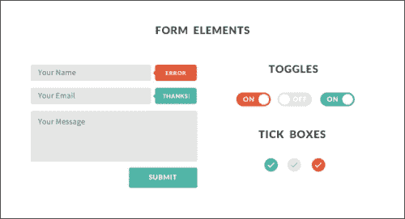
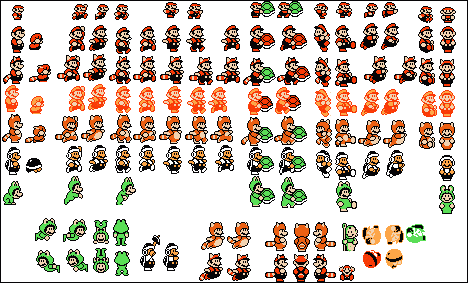
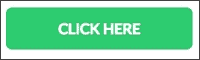
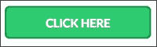

# 六、创建自己的平面 UI 套件

在最后一章中，我们将学习如何创建自己的个人平面 UI 工具包。我们将涵盖流程的所有阶段，从设计到开发和导出您的资产。在创建自己的包时，您需要记住这些最重要的元素。我们还将解释如何通过记录每个元素和用法来确保您或任何其他人的易用性。

# 设计您的组件

要创建自己的平面 UI 包，第一步是定义应该创建哪些元素。您的目标是创建和收集一组元素，以便在将来的项目中重用，因此您应该寻找大多数项目通用的基本接口元素。按钮等元素、单选按钮和复选框等表单控件、文本字段和文本区域等表单内容区域、标题样式以及`<h1>`、`<h2>`和`<h3>`等大小，一旦设计、构思和开发，就可以在多个项目中重用。通常，网页设计师会发现自己在重复使用旧的 HTML 和 CSS 代码，因此创建自己的个人软件包对于简化和加快工作流程非常重要。

创建自己的平面 UI 包的第一阶段是设计元素。在线上有一些 UI 包、web 元素甚至伟大的图标包的设计，您可以将其作为自己工作的灵感。一个简单的搜索在 To.T0\. Dr.WebBuff.Outt1 将帮助你找到伟大的元素，你可以用来作为灵感，甚至一些免费赠品，你可以用作为基础来创建自己的设计。

下面的屏幕截图显示了 Alexandre Crenn 在[处制作的平面 UI 包的示例http://dribbble.com/shots/1020321-FREE-Pack-UI-PSD](http://dribbble.com/shots/1020321-FREE-Pack-UI-PSD) ：



要创建您的包，请定义您想要包含和设计的元素。列出你最需要和将要处理的元素，然后开始设计它们。

例如，让我们做一个练习，为您的个人背包创建其中一个元素。让我们通过执行以下步骤创建一个按钮，因为它是所有按钮中使用最多、视觉冲击力最强的元素之一：

1.  打开 Photoshop 并创建一个新的 320 x 95 px 文档。
2.  Using the rounded rectangle tool, create a rectangle with 8 px of radius and `#2ecc71` as the background color. The output will be similar to what is shown in the following screenshot:

    

3.  Let's create a more interesting flat button this time and give it some depth. Duplicate this layer, change its color to `#27ae60`, and move it 5 px down. Make sure that this second rectangle is under the first one that we've created in the layer order. This makes the second rectangle appear as a side of the button along with its shadow. Only by making this slight change, you'll be able to see that we have a depth effect in the button, as shown in the following screenshot:

    

4.  为了完成按钮的设计，让我们创建一个写有`CLICK HERE`的文本字段。使用字体字体拉托，字体样式为白色，并将大小设置为 20 磅。现在，在文本层中创建一个投影层样式，距离为 1 像素，大小为 1 像素，颜色为黑色，不透明度为 33%。
5.  Now, our new flat button is complete, as shown in the following screenshot:

    

如您所见，我们在文本中使用了阴影，在这个平面按钮中使用了 3D 深度效果。你可能会对此感到疑惑，因为我之前说过反对使用这种效果。事实上，你可以使用阴影，甚至是 3D 对象，比如上图中使用的对象，只要你能够以巧妙的方式明智地使用它们。这个按钮，即使有阴影和深度，仍然看起来很平，而且在这种特性下看起来更吸引人。然而，它本质上仍然是一个平面按钮，而不是物理按钮的直接表示。此外，文本中的阴影非常微妙，刚好可以稍微弹出文本。和所有事情一样，不要对规则太苛刻；试着尝试一下这种风格，看看什么最有效。然而，要实现极简主义，您需要能够专注于基本要素并设计干净的元素。

现在我们已经设计了按钮，我们准备将其转换为代码。由于这个按钮可以完全在 HTML 和 CSS 中创建，由于 CSS3 的边界半径和文本阴影特性，我们不需要进行任何图像导出。然而，在另一个元素中，比如单选按钮或复选框，我们需要准备这些图像。因此，我们继续下一步，即导出图像并对元素进行编码。

# 导出和编码

正如我之前所说，这一步是你导出和准备你的背包所需的任何图像的地方。有几种不同的处理图像的方法。无论是图标还是背景，你都应该尽可能优化你的图像。减少图像大小和加速页面加载的一个好方法是使用 CSS 精灵。精灵最初用于视频游戏，其中单个图像文件将包含动画的多个帧，然后加载这些帧，更改所显示图像的坐标将创建动画，就像在传统动画中一样。以下屏幕截图显示 Super Mario Bros.3 Sprite 床单：



同样的技术也用于 web 和界面设计，通过创建按钮、图标和几个状态，并将它们包含在单个图像中，然后使用 CSS 仅显示特定元素所需的部分。有一些程序和在线应用程序可以非常有助于为这些精灵创建 CSS 代码，这比计算它们并手动创建所有 CSS 代码要快得多。在线应用程序如雪碧奶牛（[http://www.spritecow.com/](http://www.spritecow.com/) 和软件，如 Sprite Right（[http://spriterightapp.com/](http://spriterightapp.com/) ）对创建 CSS 精灵非常有帮助，你一定要看看它们，并在下一个大项目中尝试使用精灵。现在，让我们回到我们的按钮。以下截图显示了Amazon.com 上的精灵：


由于我们的按钮仅由代码组成，因此我们可以直接进入开发，而无需为此元素导出任何图像。让我们直接跳到代码编辑器并执行以下步骤：

1.  Let's first create the HTML code for our button. We'll need to create a simple HTML page just to host the button. Create a new HTML file named `button.html` with the following code as reference:

    ```html
    <!DOCTYPE html>
    <html lang="en">
    <head>
    </head>
    <body>
    <button class="btn">Click Here</button>
    </body>
    </html>
    ```

    在这里，您可以看到我们的按钮实际上是一个`<button>`元素，类为`class="nbtn"`。对类使用小名称是很好的，因为它们很小，易于识别和编写。在开发包时，您需要尽可能多地考虑如何重用 CSS。比如说，在创建一个按钮时，如果你想创建同一个按钮的几种颜色，你应该创建一个类`btn`，然后为每种颜色创建一个类，比如红色、蓝色等等。这样，`btn`类将只有用于大小和外观的 CSS，并且您将在单独的类中定义颜色。这意味着您将为每种颜色重用类`btn`，使其更易于定制和更改，以备将来使用。一个红色按钮看起来像`<button class=tbtn redred class=then look l>`。这只是一个在创建 CSS 时如何为不同的目标混合不同的类的问题。

2.  让我们回到我们的按钮。现在我们已经创建了HTML 文件，如果您在浏览器中打开该文件，您将看到我们的按钮完全没有样式，具有默认的浏览器外观。因此，随着 HTML 文件的创建，是时候让我们用 CSS 来设计这个元素了。首先，我们想为此使用自定义字体，所以在 HTML 文件的`<head>`元素中包含这一行：`<link href='http://fonts.googleapis.com/css?family=Lato:700' rel='stylesheet' type='text/css'>`。这将加载要在按钮中使用的字体 Lato。为了便于组织，我们将在标题中创建 CSS 代码，因此创建一个`<style></style> element inside the <head>`。
3.  To create the look of a button, the following is the CSS code that we're going to use:

    ```html
    .btn{
    -moz-border-radius: 8px;
    -webkit-border-radius: 8px;
    border-radius: 8px;
    border:none;
    border-bottom: 5px solid #27ae60;
    background: #2ecc71;
    font-family: 'Lato', sans-serif;
    text-shadow: 0 1px 2px #239a55;
    font-size: 20px;
    color: #ffffff;
    height: auto;
    margin: 0;
    width: 210px;
    display: block;
    padding: 15px;
    text-transform: uppercase;
    width: 250px;
    float: left;
    outline: none;
    }
    ```

    因此，在代码中，我们将边界半径定义为 8px，不幸的是，由于浏览器的兼容性，我们必须包含几个浏览器前缀，以确保它在大多数浏览器中都能工作。我们不仅要将背景色设置为所选的绿色，还要设置文本的颜色和字体以及阴影。

4.  If you refresh your browser now, you'll see that the design we used previously is now completely developed, including the 3D depth. This was done by creating a bigger bottom border with `border-bottom: 5px solid #27ae60`. We've given the border a radius of 5 px and a darker shade of green, creating the illusion of depth to the button. The last part, `outline: none`, is also very important as it's the one that deactivates the browser focus outline, which is usually a blue glow or a blue border (depending on the browser used). So this way, we make sure that our element doesn't have any other kind of effect applied, other than the ones created by us.

    下面向我们展示了按钮现在在 CSS 中的外观：

    

### 提示

创建 CSS3 代码的一个很好的资源是`css3generator.com`。它允许您微调和可视化细节，例如边界半径和框阴影。它非常有助于您处理几个特定于浏览器的前缀。

现在，对于不同的状态，我们的按钮具有以下在代码中使用的属性：

```html
.btn:hover{
outline: none;
border: 1px solid #27ae60;
margin-top:3px;	
}

.btn:active{
outline: none;
padding-top: 16px;
padding-bottom: 14px;
-webkit-box-shadow: inset 0px 0px 5px 0px rgba(0, 0, 0, 1);
box-shadow: inset 0px 0px 5px 0px rgba(0, 0, 0, 1);
}
```

`.btn:hover`类是鼠标悬停在按钮上时发生的翻转效果。我们的目标是让它看起来像按钮被按下一样，所以我们将边框改为一个较小的边框，以便为按钮提供一种阴影，并丢失较大的边框底部。然而，由于按钮需要向下，我们给它一个 3 像素的余量，使它看起来像按钮真的被按下了，如下面的屏幕截图所示：



对于活动状态，单击按钮时，我们希望使其看起来像是从以前的状态被按下。因此，我们创建了一个插入阴影，并更改了填充，使文本下降了几个像素，刚好足以让用户感觉到它在物理上下降了一点。在与它交互时，您了解它所产生的效果以及它的工作情况。以下屏幕截图显示处于活动状态的按钮：



这是为我们开发的按钮！它可以在您的包和未来的项目中使用。您可以根据相同的外观进一步定制，并为其创建不同的尺寸。

# 文件是关键

在创建元素和脚本时，应该记录所有内容。组织和文档非常重要，这样您就可以正确地重用您创建的元素。另外，如果你经常和更多的人一起工作，你应该确保你所有的类都有可以理解的名字。此外，请确保注释 CSS 和 HTML 的方式使其他任何人都可以在将来获取和使用您的代码。有时，有时会使用坏的类名称，当您寻找特定的类或试图理解代码时，如果没有任何支持或文档，这将是一项非常艰巨的任务。

确保所有代码都可以理解的最好方法是使用注释。在 HTML 中，您可以按如下方式使用封闭代码或文本注释来完成此操作：

```html
<!-- This is a HTML comment.-->
```

在 CSS 中，您还可以对代码进行注释或添加自己的文本，如下所示：

```html
/* This is a CSS Comment */
```

这些可以而且应该尽可能多地使用。要简洁，准确地描述代码的功能，因为在将来，您或其他任何人都将重新访问代码，并且需要了解其功能和目标。您还可以使用注释为更改和作者添加时间戳，以便跟踪文件上的最后更新。

对于更大、更复杂的项目，您可以创建完整的`readme`文件，其中包含解释元素以及如何设计元素的文本指南。但是，注释通常就足够了，而且更容易，因为它们直接放在工作文件中。

# 总结

在本章中，我们介绍了创建您自己的平面 UI 包的过程，从元素设计到开发，还详细介绍了如何创建文档和评论您的工作以供将来使用。我们在 CSS 中创建了一个平面设计按钮，以举例说明一个过程，并创建包的一个资产。

这也是最后一章，随着它，我们来到我们的书的结尾。在这里，我们介绍了平面设计中 web 设计项目的所有阶段，重点介绍了平面样式的细节以及创建项目的简单性和影响力。从规划、素描、设计到开发，您现在已经准备好创建自己的页面，您只需要继续并将其付诸实践，因为您实践得越多，您就会变得越好。