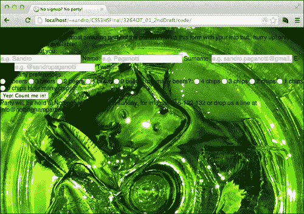
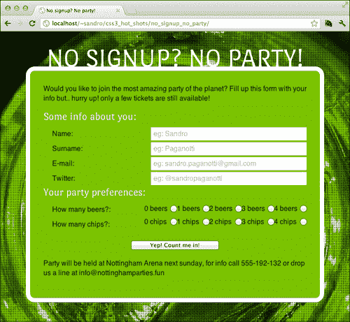
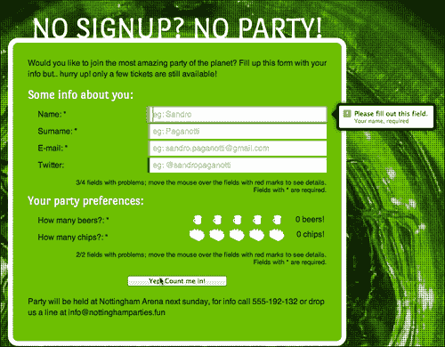

# 第一章，没有报名？没有派对！

CSS3 是表单的一大飞跃。不仅可以使用新的样式，而且现在还可以使用新的、功能强大的伪选择器来修改页面的外观，具体取决于表单或其字段的状态。在本章中，我们将使用一个 party 注册表单作为一个测试用例来展示如何通过新的 CSS 规范来增强这个组件。我们还将关注如何为旧浏览器保留正确的行为。我们将讨论以下主题：

*   HTML 结构
*   形式
*   基本造型
*   标记必填字段
*   选中单选按钮的技巧
*   计算无效字段
*   气球造型

# HTML 结构

让我们从一些 HTML5 代码开始塑造我们项目网页的结构。为此，在名为`no_signup_no_party`的新文件夹中创建一个名为`index.html`的文件，其中包含以下标记：

```html
<!doctype html>
<html>
<head>
  <meta charset="utf-8">
  <meta http-equiv="X-UA-Compatible" content="IE=edge"/>
  <title>No signup? No party!</title>
  <link rel="stylesheet" type="text/css" 
href="http://yui.yahooapis.com/3.7.3/build/cssreset/cssreset-
min.css">
  <link rel='stylesheet' type='text/css' 
href='http://fonts.googleapis.com/css?family=Port+Lligat+Sans'>
  <link rel='stylesheet' type='text/css' 
href='css/application.css'>
  <script 
src="http://html5shiv.googlecode.com/svn/trunk/html5.js">
</script>
</head>
<body>
  <article>
    <header>
      <h1>No signup? No party!</h1>
      <p>
        Would you like to join the most amazing party of the 
planet? Fill out this form with your info but.. hurry up! only a 
few tickets are still available!
      </p>
    </header>
    <form name="subscription">
      <!-- FORM FIELDS -->
      <input type="submit" value="Yep! Count me in!">
    </form>
    <footer>
      Party will be held at Nottingham Arena next sunday, for info 
call 555-192-132 or drop us a line at info@nottinghamparties.fun
    </footer>
  </article>
</body>
</html>
```

### 提示

**下载示例代码**

您可以下载您通过[账户购买的所有Packt 图书的示例代码文件 http://www.packtpub.com](http://www.packtpub.com) 。如果您在其他地方购买了本书，您可以访问[http://www.packtpub.com/support](http://www.packtpub.com/support) 并注册，将文件直接通过电子邮件发送给您。

从标记中可以看出，我们正在利用 HTML5 提供的新结构。`<article>`、`<header>`和`<footer>`等标签通过为内容添加语义来丰富页面。这些标记的呈现方式与`<div>`完全相同，但从语义上讲，它们更好，因为它们解释了它们的内容。

### 注

有关更多信息，我建议您查看以下文章：[http://html5doctor.com/lets-talk-about-semantics](http://html5doctor.com/lets-talk-about-semantics)

除了味道文本，唯一需要详细解释的部分是`<head>`部分。在这个标签中，我们要求浏览器包含一些外部资产，这些资产将帮助我们前进。

## 重置样式表和自定义字体

首先，有一个重置样式表，它对于确保删除浏览器默认应用于 HTML 元素的所有 CSS 属性特别有用。在这个项目中，我们使用的是雅虎免费提供的！，基本上将所有属性设置为`none`或类似的值。

接下来，我们需要另一个样式表。这一个来自于一个名为谷歌网页字体的谷歌服务（[www.Google.com/webfonts](http://www.google.com/webfonts)，该服务分发可嵌入并在网页中使用的字体。自定义 web 字体由一个特殊的`@font-face`属性定义，该属性包含指向浏览器必须实现的字体文件的链接。

```html
@font-face{
  font-family: YourFontName;
  src: url('yourfonturl.eot');
}
```

不幸的是，为了在浏览器之间达到最大可能的兼容性，需要更多的字体文件格式，因此需要更复杂的语句。以下语句有助于实现这种兼容性：

```html
@font-face{
  font-family: YourFontName;
  src: url('yourfonturl.eot');
  src: 
    url('yourfonturl.woff') format('woff'), 
    url('yourfonturl.ttf') format('truetype'), 
    url('yourfonturl.svg') format('svg');
  font-weight: normal;
  font-style: normal;
}
```

Google Web Fonts为我们提供了一个样式表，其中包含我们选择的字体的这些语句，为我们省去了所有与字体转换相关的麻烦。

接下来，让我们在项目的`css`文件夹下为样式表创建一个空文件。

最后但并非最不重要的一点是，我们需要确保即使是较旧的 Internet Explorer 浏览器也能够正确处理新的 HTML5 标记。`html5shiv`（[html5shiv.googlecode.com](http://html5shiv.googlecode.com)是一个小 JavaScript 文件，正好完成了这个任务。

# 创建表单

现在，让我们为表单编写 HTML 代码，在`<!--FORM FIELDS-->`标记下方添加以下代码：

```html
<fieldset>
  <legend> 
    Some info about you:
  </legend>
  <input type="text" name="name" id="name" placeholder="e.g. 
Sandro" title="Your name, required" required>
  <label class="label" for="name"> Name: </label>
  <input type="text" name="surname" id="surname" placeholder="e.g. 
Paganotti" title="Your surname, required" required>
  <label class="label" for="surname"> Surname: </label>
  <input type="email" name="email" id="email" placeholder="e.g. 
sandro.paganotti@gmail.com" title="Your email address, a valid 
email is required" required>
  <label class="label" for="email"> E-mail: </label>
  <input type="text" name="twitter" id="twitter" placeholder="e.g. 
@sandropaganotti" title="Your twitter username, starting with @" 
pattern="@[a-zA-Z0-9]+">
  <label class="label" for="twitter"> Twitter:</label>
  <footer></footer>
</fieldset>
```

HTML5 提供了一些我们将简要探讨的新属性，如下所示：

*   `placeholder`：用于指定某个帮助文本，该文本为空时显示在字段内。
*   `required`：根据需要标记字段。它是一个布尔属性，告诉浏览器在提交表单之前确保字段不为空。此属性是新表单验证功能的一部分，它基本上提供了一种在客户端指定一些输入约束的方法。不幸的是，每个浏览器都以不同的方式处理`title`属性中包含的错误消息的显示，但我们将在本章后面的部分对此进行检查。
*   `pattern`: This is a powerful and sometimes complex way of specifying a validation pattern. It needs a regular expression as a value. This expression is then checked against the data inserted by the user. In case of failure, the message contained in the `title` attribute is displayed.

    在给定的示例中，模式值为`@[a-zA-Z0-9]+`，这意味着“范围`a-z`（所有小写字母）、`A-Z`（所有大写字母）和`0-9`（所有数字）中的一个或多个符号（`+`符号）”。

    ### 注

    更多的现成模式可在[中找到 http://html5pattern.com/](http://html5pattern.com/) 。

与 HTML5 引入的大多数功能一样，即使是我们在前面代码中看到的新表单属性，在完全浏览器兼容性方面也会受到影响。

### 注

要了解当前浏览器对这些属性以及许多其他 HTML5 和 CSS3 功能的支持，我建议访问[http://caniuse.com/](http://caniuse.com/) 。

## 标签放错位置

这段代码还有一个奇怪之处：标签放在链接到的字段后面。这种标记虽然不常见，但仍然有效，并为我们提供了一些新的有趣选项来拦截用户和表单元素的交互。这听起来可能有点神秘，但我们将在接下来的几页中详细分析这项技术。

让我们在刚才写的下面再添加一个`fieldset`元素：

```html
<fieldset class="preferences">
  <legend> Your party preferences: </legend>
  <input type="radio" name="beers" id="4_beers" value="4">
  <label class="beers" for="4_beers">4 beers</label>
  <input type="radio" name="beers" id="3_beers" value="3">
  <label class="beers" for="3_beers">3 beers</label>
  <input type="radio" name="beers" id="2_beers" value="2">
  <label class="beers" for="2_beers">2 beers</label>
  <input type="radio" name="beers" id="1_beers" value="1">
  <label class="beers" for="1_beers">1 beers</label>
  <input type="radio" name="beers" id="0_beers" value="0" 
required>
  <label class="beers" for="0_beers">0 beers</label>
  <span  class="label"> How many beers?: </span>
  <input type="radio" name="chips" id="4_chips" value="4">
  <label class="chips" for="4_chips">4 chips</label>
  <input type="radio" name="chips" id="3_chips" value="3">
  <label class="chips" for="3_chips">3 chips</label>
  <input type="radio" name="chips" id="2_chips" value="2">
  <label class="chips" for="2_chips">2 chips</label>
  <input type="radio" name="chips" id="1_chips" value="1">
  <label class="chips" for="1_chips">1 chips</label>
  <input type="radio" name="chips" id="0_chips" value="0" 
required>
  <label class="chips" for="0_chips">0 chips</label>
  <span class="label"> How many chips?: </span>
  <footer></footer>
</fieldset>
```

这里没有什么要强调的；我们刚刚添加了两个单选按钮组。现在，如果我们尝试在浏览器中运行到目前为止所做的工作，我们将面临一些失望，因为默认浏览器的样式已被重置样式表删除。


是时候添加一些基本的样式了！

# 基本造型

我们需要做的是将表单居中，为文本指定合适的大小，选择背景，并调整标签和字段的位移。

让我们从背景开始。我们想要实现的是，在保持其比例的同时，尽可能大地放置一个图像以适合页面。在“CSS2 时代”这个简单的任务将涉及一些 JavaScript 的使用，例如著名的Redux jQuery 插件（[http://bavotasan.com/2011/full-sizebackground-image-jquery-plugin/](http://bavotasan.com/2011/full-sizebackground-image-jquery-plugin/) ）。对于 CSS3，只需几句话：

```html
html{
  height: 100%;
  background: black;
  background-image: url('img/background.jpg');
  background-repeat: no-repeat;
  background-size: cover;
  background-position: top left;
  font-family: sans-serif;
  color: #051a00;
}
```



这里的技巧是`background-size`属性，它接受以下值：

*   `length`：使用该值，我们可以使用任何测量单位来表示背景的大小，例如`background-size: 10px 10px;`。
*   `percentage`：使用该值，我们可以指定随元素大小变化的背景大小，例如`background-size: 10% 10%;`。
*   `cover`：该值将图像缩放（不拉伸）为覆盖元素的整个区域。这意味着图像的一部分可能不可见，因为它可能会比容器大。
*   `contain`：该值将图像缩放（不拉伸）到最大可用大小，同时将整个图像保持在容器内。很明显，这可能会使元素的某些区域未被覆盖。

因此，通过使用`cover`，我们可以确保整个页面被我们的图像覆盖，但我们可以做更多！如果我们在浏览器中运行到目前为止所做的所有工作，我们将看到，如果我们过度放大窗口，背景图像的像素将变得可见。为了避免这种情况，我们可以做的是在这张图片的上方使用另一张背景图片。我们可以使用小黑点来隐藏基础图像的像素，从而获得更好的效果。

好消息是，我们不需要使用其他元素就可以做到这一点，因为 CSS3 允许同一元素上有多个背景。我们可以使用逗号（`,`分隔背景，记住我们首先声明的内容将覆盖其他内容。那么，让我们稍微修改一下前面的代码：

```html
html{
  height: 100%;
  background: black;
  background-image: 
    url('img/dots.png'), 
    url('img/background.jpg');
  background-repeat: repeat, no-repeat;
  background-size: auto, cover;
  background-position: center center, top left;
  font-family: sans-serif;
  color: #051a00;
}
```


此外，所有其他与背景相关的属性都以相同的方式工作。如果省略其中一个值，则使用前一个值，因此如果声明了两个背景图像，则写入`background-repeat: repeat`与写入`background-repeat: repeat, repeat`相同。

## 定义属性

让我们继续定义完成项目第一阶段所需的其他属性：

```html
/* the main container */
article{
  width: 600px;
  margin: 0 auto;
  background: #6cbf00;
  border: 10px solid white;
  margin-top: 80px;
  position: relative;
  padding: 30px;
  border-radius: 20px;
}
/* move the title over the main container */
article h1{
  width: 600px;
  text-align: center;
  position: absolute;
  top: -62px;
/* using the custom font family provided by google */
  font-family: 'Port Lligat Sans', cursive;
  color: white;
  font-size: 60px;
  text-transform: uppercase;
}

/* the small text paragraphs */
article p, 
article > footer{
  padding-bottom: 1em;
  line-height: 1.4em;
}

/* the fieldsets' legends */
article legend{
  font-family: 'Port Lligat Sans', cursive;
  display: block;
  color: white;
  font-size: 25px;
  padding-bottom: 10px;
}

.label{
  display: block;
  float: left;
  clear: left;
}

/* positioning the submit button */
input[type=submit]{
  display:block;
  width: 200px;
  margin: 20px auto;
}

/* align texts input on the right */
input[type=text], input[type=email]{
  float: right;
  clear: right;
  width: 350px;
  border: none;
  padding-left: 5px;
}
input[type=text], 
input[type=email], 
.label{
  margin: 2px 0px 2px 20px;
  line-height: 30px;
  height: 30px;
}

span + input[type=radio], legend + input[type=radio]{
  clear: right
}

/* size of the small labels linked to each radio */
.preferences label.chips,
.preferences label.beers{
  width: 60px;
  background-image: none;
}

input[type="radio"]{
  padding-right: 4px;
}

input[type="radio"], 
.preferences label{
  float: right;
  line-height: 30px;
  height: 30px;
}
```

这里只有几件事需要强调。首先，通过使用一些浮动，我们将所有字段向右移动，标签向左移动。接下来，我们定义了元素之间的距离。也许最隐晦的说法是：

```html
span + input[type=radio], legend + input[type=radio]{
  clear: right
}
```

由于我们刚才提到的浮动，每组单选按钮的第一个元素成为最右边的。因此，我们通过使用`selector1 + selector2`选择器来标识该元素，这表明指定的元素必须是同级元素。这称为一个**相邻同级选择器**，并选择与`selector2`选择器匹配的所有元素，该选择器直接跟随与`selector1`选择器匹配的元素。最后，使用`clear:right`我们只需声明，这些单选按钮的右侧不得有其他浮动元素。

让我们在浏览器中重新加载项目，以欣赏我们工作的结果：



# 标记必填字段

让我们看一个简单的技巧，它可以在必填字段的标签附近自动显示星号（*）。HTML5 表单验证模型引入了一些新的非常有趣的伪选择器：

*   `:valid`：仅匹配处于有效状态的字段。
*   `:invalid`：相反，只匹配有错误的字段。这包括将`required`属性设置为`true`的空字段。
*   `:required`：只匹配带`required`标志的字段，不管是否已填充。
*   `:optional`：与所有字段一起工作，不带`required`标志。

在本例中，我们需要匹配具有`required`属性的字段后面的所有标签。现在我们前面实现的 HTML5 结构派上了用场，因为我们可以利用`+`选择器来实现这一点。

```html
input:required + .label:after, input:required + * + .label:after{
  content: '*';
}
```

为了截取单选按钮的结构，我们添加了一个小的变化（`input:required + * + .label:after`）。

在继续之前，让我们先分析一下这个句子。我们使用了`:after`伪选择器来访问位于`label`类元素后面的位置。然后，使用`content`属性，我们在该位置内注入星号。

如果我们重新加载页面，我们可以验证，现在，所有属于带有`required`标志的字段的标签都以星号结尾。有人可能会指出，屏幕阅读器不认识这种技术。为了找到解决这个问题的方法，我们可以利用WAI-ARIA 规范（[的一部分`aria-required`属性 http://www.w3.org/TR/WCAG20-TECHS/ARIA2](http://www.w3.org/TR/WCAG20-TECHS/ARIA2) ）。


# 选中的单选按钮

现在我们可以把注意力集中在单选按钮上，但是我们如何才能以更好的方式渲染它们呢？这有一个很酷的技巧；它利用了这一事实，即您可以通过点击单选按钮的链接标签来检查单选按钮。我们可以做的是隐藏输入元素并设置相应标签的样式，可能使用代表薯条和啤酒的图标。

让我们首先从单选按钮标签中删除文本，并更改光标悬停在其上时的外观：

```html
.preferences label{
  float: right;
  text-indent: -100px;
  width: 40px !important;
  line-height: normal;
  height: 30px;
  overflow: hidden;
   cursor: pointer;
}
```

做得好！现在我们必须隐藏单选按钮。我们可以通过在单选按钮上放置与背景颜色相同的补丁来实现这一点。让我们这样做：

```html
input[type=radio]{
  position: absolute;
  right: 30px;
  margin-top: 10px;
}

input[type=radio][name=chips]{
  margin-top: 35px;
}

span + input[type=radio] + label, 
legend + input[type=radio] + label{
  clear: right;
  margin-right: 80px;
  counter-reset: checkbox;
}

.preferences input[type="radio"]:required + label:after{
  content: '';
  position: absolute;
  right: 25px;
  min-height: 10px;
  margin-top: -22px;
  text-align: right;
  background: #6cbf00;
  padding: 10px 10px;
  display: block;
}
```

如果我们现在尝试使用基于 WebKit 的浏览器或 Firefox 提交表单，我们会发现与单选按钮相关的验证气球在两个浏览器上都显示正确。

## 单选按钮标签内显示图标

让我们继续研究单选按钮标签，目前完全为空，因为我们使用`text-indent`属性将文本移走。我们现在要做的是在每个标签中放置一个小小的占位符图像，并利用CSS3`~`选择器，创建一个具有良好鼠标悬停效果的伪星评级系统。

由于我们必须处理不同的图像（啤酒和薯片），我们必须复制一些声明。让我们从`.beers`标签开始：

```html
.preferences label.beers{
  background: transparent url('img/beer_not_selected.png') 
no-repeat center center;
}

.preferences label.beers:hover ~ label.beers, 
.preferences label.beers:hover, 
.preferences input[type=radio][name=beers]:checked ~ label.beers{
  background-image: url('img/beer.png');
  counter-increment: checkbox;
}
```

`elem1 ~ elem2`选择器适用于所有`elem2`标签，这些标签是`elem1`标签的同级标签，并且在其之后（尽管`elem2`标签不必相邻）。通过这种方式，我们可以使用选择器`.preferences label.beers:hover ~ label.beers`将处于悬停状态（当鼠标位于元素上方）的标签后面的所有标签作为目标。

使用 CSS3`:checked`伪类选择器，我们可以识别已检查的单选按钮，并且通过应用我们刚才讨论的相同技巧，我们可以通过使用`.preferences input[type=radio][name=beers]:checked ~ label.beers`来针对已检查单选按钮后面的所有标签。通过将这两个选择器和一个经典的`.preferences label.beers:hover`选择器组合在一起，我们现在可以更改占位符图像，以反映用户与单选按钮的交互。现在，让我们添加最后一个很酷的功能。我们使用了`counter-increment`属性来跟踪所选标签的数量，因此我们可以利用此计数器并显示它。

```html
.preferences input[type=radio][name=beers]:required + 
label.beers:after{
  content: counter(checkbox) " beers!";
}
```

让我们在浏览器中尝试以下结果：


现在，我们也必须为`.chips`标签复制相同的陈述：

```html
.preferences label.chips{
  background: transparent 
url('img/frenchfries_not_selected.png') 
no-repeat center center;
}

.preferences label.chips:hover ~ label.chips, 
.preferences label.chips:hover, 
.preferences input[type=radio][name=chips]:checked ~ label.chips {
 background-image: url('img/frenchfries.png');
  counter-increment: checkbox;
}

.preferences input[type=radio][name=chips]:required + 
label.chips:after {
  content: counter(checkbox) " chips!";
}
```

我们在本章中所做的所有造型都有一个大问题；如果浏览器不支持 CSS3，它会成功隐藏单选按钮和文本标签，但无法添加它们的图像替换，使所有内容都无法使用。有几种方法可以防止这种情况。这里介绍的是使用**媒体查询**。

媒体查询将在以后的项目中详细介绍，它基本上由描述应用某些样式所需的一些条件的语句组成。让我们考虑下面的例子：

```html
@media all and (max-width: 1000px){
  body{
    background: red;
  }
}
```

在本例中，仅当浏览器窗口的大小不超过`1000px`时，主体背景才会变为红色。媒体查询只对目标设备（智能手机、平板电脑等）应用特定样式非常有用，但它们还有另一个有趣的特性；如果浏览器支持它们，那么它也支持我们使用的 CSS3 规则，因此我们可以将本节和前几节中编写的所有 CSS 放在媒体查询语句中：

```html
@media all and (min-device-width: 1024px){

/* --- all of this and previous sections' statements --- */

}
```

通过这个技巧，我们解决了另一个微妙的问题。在没有媒体查询语句的 iPad 上尝试该项目会导致单击单选按钮时出现一些问题。这是因为标签不会对 iOS 上的点击做出响应。通过实现此媒体查询，我们强制 iOS 设备退回到常规单选按钮。

# 计算并显示无效字段

在上一节中，我们使用了一些属性，但没有解释它们；它们是`counter-reset`和`counter-increment`。另外，我们使用了一个类似于命令`counter()`的函数。在本节中，我们将通过创建一个显示无效字段数量的机制来解释这些属性。**计数器**基本上是一个我们可以命名的变量，其值可以使用`counter-increment`进行递增。接下来，可以使用`content`属性中的`counter(variable name)`声明来显示此计数器。

让我们看一个小例子：

```html
<ul>
  <li>element</li>
  <li>element</li>
  <li>element</li>
</ul>
<p></p>

<style>

ul{
  counter-reset: elements;
}

li{
  counter-increment: elements;
}

p:after{
  content: counter(elements) ' elements';
}

</style>
```

尝试这一小块代码会产生一个包含句子**3 个元素**的`p`元素：


我们可以将这些强大的属性与新的表单伪选择器结合起来，以获得显示有效和无效字段的方法。

## 计数器的实现

让我们首先创建两个计数器，`invalid`和`fields`，并在每个`fieldset`元素处重置它们，因为我们希望显示每个`fieldset`元素的无效字段。然后，当我们发现一个无效字段时，我们增加两个计数器，当我们发现一个有效字段时，我们只增加`fields`计数器。

```html
fieldset{
  counter-reset: invalid fields;
}

input:not([type=submit]):not([type=radio]):invalid, 
input[type=radio]:required:invalid{
  counter-increment: invalid fields;
  border-left: 5px solid #ff4900;
}

input:not([type=submit]):not([type=radio]):valid, 
input[type=radio]:required{
  counter-increment: fields;
  border-left: 5px solid #116300;
}
```

`:not`伪选择器非常简单。它从匹配最左侧选择器的元素中减去括号内匹配选择器的元素。如果这看起来有点混乱，让我们尝试读取最后一个选择器：匹配所有的`input`元素，其`type`值是*不是*`submit`和*不是*`radio`，它们响应`:valid`伪选择器。

快到了！现在我们已经有了计数器，让我们使用`footer`元素来显示它们：

```html
fieldset footer{
  clear: both;
  position: relative;
}

fieldset:not([fake]) footer:after{
  content: 'yay, section completed, move on!';
  text-align: right;
  display: block;
  font-size: 13px;
  padding-top: 10px;
}

/* the value of the content property must be on one single line */ 
fieldset > input:invalid ~ footer:after{
  content: counter(invalid) '/' counter(fields) " fields with 
problems; move the mouse over the fields with red marks to see 
details.\a Fields with * are required.";
  white-space: pre;
}
```

`:not([fake])`选择器的使用方式与前面显示的媒体查询相同。我们只是想确保只有支持`:valid`和`:invalid`伪选择器的浏览器才能解释该选择器。

不过，最后添加的内容也有一些缺点；通常避免将演示与内容混为一谈。

# 气球造型

每个浏览器实际上都以自己的方式显示表单错误，我们不能做太多事情来影响这种可视化。唯一的例外是基于 WebKit 的浏览器，它允许我们更改此类消息的外观。下面的代码显示了如何在这些浏览器中构造错误气球：

```html
<div>::-webkit-validation-bubble
  <div>::-webkit-validation-bubble-arrow-clipper
    <div>::-webkit-validation-bubble-arrow
    </div>
  </div>::-webkit-validation-bubble-message
  <div>
    <b>Browser validation message</b>
    element's title attribute
  </div>
</div>
```

通过使用前面代码中列出的特殊伪类，我们可以访问组成错误消息的所有元素。那么，让我们开始吧！

```html
::-webkit-validation-bubble{
  margin-left: 380px;
  margin-top: -50px;
  width: 200px;
}

input[type=radio]::-webkit-validation-bubble{
  margin-left: 50px;
  margin-top: -50px;
}

::-webkit-validation-bubble-arrow-clipper{
  -webkit-transform: rotate(270deg) translateY(-104px) 
translateX(40px);
}

::-webkit-validation-bubble-arrow{
  background: #000;
  border: none;
  box-shadow: 0px 0px 10px rgba(33,33,33,0.8);
}

::-webkit-validation-bubble-message{
  border: 5px solid black;
  background-image: none;
  box-shadow: 0px 0px 10px rgba(33,33,33,0.8);
}
```

在`-webkit-transform`中，我们对匹配的元素应用了一些变换。在本例中，我们将箭头移动到气球的左侧，箭头通常位于气球底部。

以下是我们已完成项目的概况：



# 优雅降级

正如我们所期望的，这个项目并不是在所有浏览器上都得到完全支持，因为它实现了 HTML5 和 CSS3 特性，当然，这些特性并没有包含在旧的浏览器中。有许多技术可以解决这个问题；我们现在要看的是称为**优雅降级**。它主要关注于使项目的核心功能得到尽可能广泛的支持，同时接受其他所有功能都可能不受支持，因此不会显示。

我们的项目是优雅降级的一个很好的例子：当浏览器不支持特定属性时，其效果将被忽略，而不会影响表单的基本功能。

为了证明这一点，让我们试试 IE8 上的项目，它基本上没有 CSS3 支持：


为了获得尽可能好的浏览器支持，我们可能还想隐藏 IE9 上的页脚元素和单选按钮，因为否则，它们会显示出来，但不会按照预期的方式工作。为此，我们需要在`index.html`文件中添加一个条件注释，就在`head`部分的末尾之前。我们将在后面的章节中看到条件注释是如何工作的，但现在让我们假设它们允许我们指定一些只需要由选定浏览器解释的标记。

```html
<!--[if IE 9]>
  <style>
    footer, input[name=beers], input[name=chips]{
      display: none;
    }
  </style>
<![endif]-->
```

# 总结

在第一个项目中，我们探讨了 CSS3 如何使用从标记和字段状态派生的有用信息来增强表单。在下一章中，我们将重点关注按钮，以及如何通过充分利用渐变和其他 CSS3 属性，在不使用图像的情况下模拟真实世界的形状和行为。