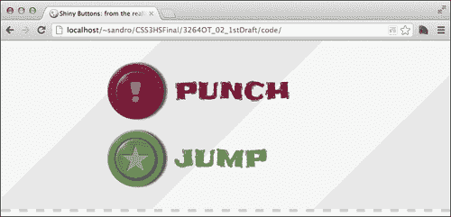
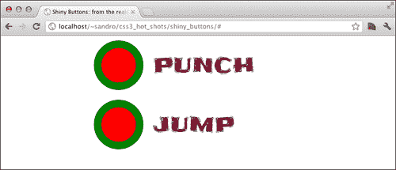
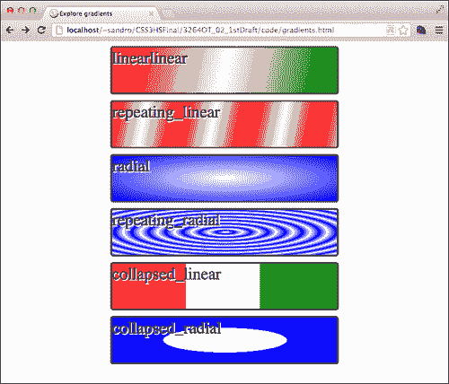
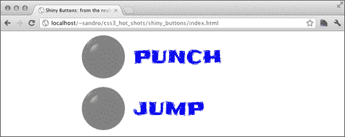
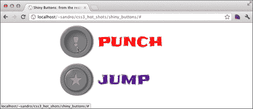
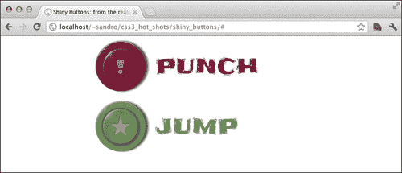
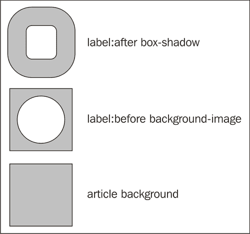
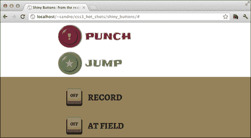
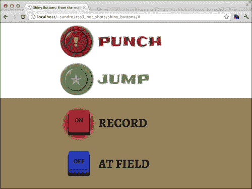

# 二、闪闪发光的按钮

自从 CSS3 按钮首次出现在尖端浏览器的夜间版本中以来，它一直被认为是一个热门话题。按钮是大多数用户界面中重要且公认的元素。CSS3 按钮之所以成为 web 开发人员的热门话题，是因为只要更改文本或样式表声明，就可以轻松修改 CSS3 按钮。

在本章中，我们将仅使用 CSS3 创建模拟真实世界的按钮。在这样做的同时，我们将探索新的 CSS 属性和技巧来实现我们的目标。我们将讨论以下主题：

*   投币式按钮
*   `:before`和`:after`伪选择器
*   梯度
*   避免实验前缀
*   阴影
*   添加标签
*   处理鼠标点击
*   CSS 中的小变化，大结果
*   开关
*   活动状态
*   检查状态
*   添加颜色
*   支持旧浏览器
*   CSS 渐变语法的最后一点说明

# 创建投币式按钮

在本章的第一部分中，我们着重于创建一个逼真的硬币操作按钮。我们希望尽可能多地使用 CSS，并在不使用图像的情况下利用新功能。下面的屏幕截图是对结果的简要介绍：



首先，让我们创建一个名为`shiny_buttons`的文件夹，我们将在其中存储项目的所有文件。然后，我们需要一个文件，`index.html`，填充很少的标记：

```html
<!doctype html>
<html>
<head>
  <meta http-equiv="X-UA-Compatible" content="IE=edge"/>
  <meta charset="utf-8">
  <title>Shiny Buttons: from the reality to the web!</title>
  <link 
href='http://fonts.googleapis.com/css?family=Chango|Frijole|
Alegreya+SC:700' rel='stylesheet' type='text/css'>
  <link rel="stylesheet" type="text/css" 
href="http://yui.yahooapis.com/3.4.1/build/cssreset/cssreset-min.css">
  <link rel="stylesheet" type="text/css" 
href="css/application.css">
  <script 
src="http://html5shiv.googlecode.com/svn/trunk/html5.js"></script>
</head>
<body>
  <section>
    <article id="arcade_game">
 <a href="#" role="button" class="punch">punch</a>
 <a href="#" role="button" class="jump">jump</a>
    </article>

  </section>
</body>
</html>
```

如标记所示，我们使用单个`<a>`元素来声明按钮。锚定标记似乎不够复杂，无法生成复杂的按钮，这让我们相信我们需要更多的 HTML，但事实并非如此。我们只需要使用这个标签和我们的 CSS3 声明就可以获得惊人的结果。

# 伪选择器的：before 和：after

正如我们在上一章中发现的，伪选择器可以被视为元素并进行样式化，而无需向HTML 页面添加额外的标记。如果我们将`<a>`元素设置为`position:relative`，并且`:after`和`:before`都设置为`position:absolute`，我们可以使用相对于`<a>`位置的坐标来放置它们。让我们在项目中的`css`文件夹中创建一个`application.css`文件来尝试这一点：

```html
/* link */
#arcade_game a{
 display: block;
 position: relative;
  text-transform: uppercase;
  line-height: 100px;
  text-decoration: none;
  font-family: 'Frijole', cursive;
  font-size: 40px;
  width: 300px;
  padding: 10px 0px 10px 120px;
  margin: 0px auto;
  color: rgb(123,26,55);
}

/* :before and :after setup */
#arcade_game a:before, 
#arcade_game a:after{
  content: "";
 display: block;
 position: absolute;
  left: 0px;
  top: 50%;
}

/* :before */
#arcade_game a:before{
  z-index: 2;
  width: 70px;
  height: 70px;
  line-height: 70px;
  left: 15px;
  margin-top: -35px;
  border-radius: 35px;
  background-color: red; /* to be removed */
}

/* :after */
#arcade_game a:after{
  z-index: 1;
  width: 100px;
  height: 100px;
  border-radius: 50px;
  margin-top: -50px;
  background-color: green; /* to be removed */
}
```

如果我们在浏览器中加载到目前为止所做的事情，我们就会开始注意到投币式按钮的形状。两个圆圈，一个在另一个内，位于标签左侧的，如下图所示：



我们所做的一切，以创造一个圆圈形状是强加一个边界半径等于一半大小的方块。做得好！现在我们可以移除绿色和红色圆圈背景，继续探索渐变。

# 梯度

当使用 CSS 渐变时，我们指示浏览器的布局引擎按照 CSS 方向绘制图案。**渐变**对应于运行时生成的、与大小无关的图像，因此它可以在允许使用`url()`符号的任何地方使用。有四种类型的梯度：`linear-gradient`、`repeating-linear-gradient`、`radial-gradient`和`repeating-radial-gradient`。下面的渐变代码示例提供了每个渐变代码的介绍性概述：

```html
<!doctype html>
<html>
<head>
  <meta charset="utf8">
  <title>Explore gradients</title>

  <style>
    .box{
      width: 400px;
      height: 80px;
      border: 3px solid rgb(60,60,60);
      margin: 10px auto;
      border-radius: 5px;
      font-size: 30px;
      text-shadow: 2px 2px white;
    }

    #linear{
 background-image: linear-gradient(top left, red, white, green);
    }

    #repeating_linear{
 background-image: repeating-linear-gradient(top left, red, white, red 30%);
    }

    #radial{
 background-image: radial-gradient(center center, ellipse cover, white, blue);
    }

    #repeating_radial{
 background-image: repeating-radial-gradient(center center, ellipse cover, white, blue, white 30px);
    }

    #collapsed_linear{
 background-image: linear-gradient(left, red, red 33%, white 33%, white 66%, green 66%);
    }

    #collapsed_radial{
 background-image: radial-gradient(center center, ellipse contain, white, white 55%, blue 55%);
    }

  </style>

</head>
<body>
  <section>

    <div id="linear" class="box">linear</div>
    <div id="repeating_linear" class="box">repeating_linear</div>
    <div id="radial" class="box">radial</div>
    <div id="repeating_radial" class="box">repeating_radial</div>
    <div id="collapsed_linear" class="box">collapsed_linear</div>
    <div id="collapsed_radial" class="box">collapsed_radial</div>

  </section>
</body>
</html>
```

## 梯度句法

在前面的渐变代码示例中，很明显，每个语句都包含带有颜色步长的位置信息（例如，`top left`或`45deg`），可以选择具有指示颜色停止位置的值。如果两种颜色停在完全相同的位置，我们会得到一个急剧的颜色变化，而不是渐变。

径向渐变允许使用额外的参数。特别是，我们可以在圆形和省略号之间选择渐变的形状，以及渐变如何填充元素的区域。要指定，我们可以从以下选项中进行选择：

*   `closest-side`：使用此参数，梯度将扩展，直到它与包含元素的最近一侧相交
*   `closest-corner`：使用此参数，梯度将扩展，直到它与包含元素的最近角相交
*   `farthest-side`：使用此参数，梯度将扩展，直到它与包含元素的最远一侧相交
*   `farthest-corner`：使用此参数，渐变将扩展，直到它与包含元素的最远角相交
*   `contain`：这是`closest-side`的别名
*   `cover`：这是`farthest-corner`的别名

以下屏幕截图显示了在浏览器中执行上述代码的结果：



不幸的是，前面的屏幕截图没有说明如果在 web 浏览器中运行示例代码会看到什么。事实上，如果我们在支持 CSS3 渐变的浏览器中执行前面的代码，比如Google Chrome，我们得到的是一个带有黑色边框的白框列表。这是因为渐变被认为是实验性的，因此需要为我们想要支持的每个浏览器（例如，`-webkit-`、`-ms-`、`-o-`和`-moz-`）添加特定于浏览器的字符串作为前缀。这意味着我们必须为想要支持的每个浏览器复制语句。例如，在前面代码中的`#linear`选择器中，为了实现最大的兼容性，我们应该编写：

```html
#linear{
  background-image: -webkit-linear-gradient(top left, red, white, 
green);
  background-image: -ms-linear-gradient(top left, red, white, 
green);
  background-image: -o-linear-gradient(top left, red, white, 
green);
  background-image: -moz-linear-gradient(top left, red, white, 
green);
  background-image: linear-gradient(top left, red, white, green);
}
```

# 避免实验前缀

我们需要找到一种方法来避免编写大量重复的 CSS 代码，而只是为了实现所有现有的浏览器前缀。无前缀（[提供了良好的解决方案 http://leaverou.github.com/prefixfree/](http://leaverou.github.com/prefixfree/) ），一个由 LeaVerou 创建的小型 JavaScript 库，用于检测用户的浏览器并动态添加所需的前缀。要安装它，我们只需在我们项目的`js`文件夹中下载`.js`文件，将其命名为`prefixfree.js`，并在`css`请求之后将相应的脚本标签添加到`index.html`：

```html
<script src="js/prefixfree.js"></script>
```

从现在开始，我们不必再担心前缀，因为这个库将为我们完成繁重的工作。然而，也有一些小缺点；有些属性不会自动检测并加前缀（例如，`radial-gradient`和`repeating-radial-gradient`没有加上`-moz-`前缀），在 CSS 正确加前缀之前，我们必须经历短暂的延迟，大约相当于脚本下载时间。

那么，让我们继续并为按钮添加一些渐变：

```html
#arcade_game a:before, #arcade_game a:after{
  background: gray;  /* to be removed */
}

#arcade_game a:before{
  background-image: 
    -moz-radial-gradient(7px 7px, ellipse farthest-side, 
    rgba(255,255,255,0.8), rgba(255,255,255,0.6) 3px, 
    rgba(200,200,200,0.0) 20px);
 background-image: 
 radial-gradient(7px 7px, ellipse farthest-side, 
 rgba(255,255,255,0.8), rgba(255,255,255,0.6) 3px, 
 rgba(200,200,200,0.0) 20px);
}

#arcade_game a:after{
  background-image: 
    -moz-radial-gradient(7px 7px, ellipse farthest-side, 
    rgba(255,255,255,0.8), rgba(255,255,255,0.6) 3px, 
    rgba(200,200,200,0.0) 20px), 
    -moz-radial-gradient(50px 50px, rgba(255,255,255,0), 
    rgba(255,255,255,0) 40px, rgba(200,200,200,0.1) 43px, 
    rgba(255,255,255,0.0) 50px);
 background-image: 
 radial-gradient(7px 7px, ellipse farthest-side, 
 rgba(255,255,255,0.8), rgba(255,255,255,0.6) 3px, 
 rgba(200,200,200,0.0) 20px), 
 radial-gradient(50px 50px, rgba(255,255,255,0), 
 rgba(255,255,255,0) 40px, rgba(200,200,200,0.1) 43px, 
 rgba(255,255,255,0.0) 50px);
}
```

为了特别关注向我们的按钮添加新功能的主题，前面的代码不重复`application.css`中的现有 CSS 声明。我们如何应用新指令并不重要；我们可以附加前面的语句，也可以合并每个选择器的属性。在任何情况下，结果都是一样的。

在前面的代码中，我们创建了两个光点，使用径向渐变来模拟按钮的形状和反射。CSS3 允许我们通过支持`rgba()`符号来创建这种效果，该符号接受介于`0`（透明）和`1`（不透明）之间的 alpha 值。

让我们在浏览器中尝试结果：



## 即将对 CSS3 渐变进行语法更改

关于 CSS3 梯度的最新编辑草稿（[http://www.w3.org/TR/2012/CR-css3-images-20120417/](http://www.w3.org/TR/2012/CR-css3-images-20120417/) 在提供关键字来定义位置信息时，引入了一个小的语法变化。因此，与其写：

```html
linear-gradient(bottom, blue, red);
```

我们现在需要写：

```html
linear-gradient(to top, blue, red);
```

对于径向渐变语法，还有一些变化；我们之前写的是：

```html
radial-gradient(center center, ellipse cover, white, blue);
```

更改为：

```html
radial-gradient(cover ellipse at center center, white, blue);
```

不幸的是，在编写本书时，这种新语法在不同浏览器中没有得到很好的支持。因此，我们将继续使用旧语法，它具有良好的支持。

# 阴影

阴影在 CSS3 中实现，有两个不同的属性共享相似的语法，`box-shadow`和`text-shadow`。让我们创建另一个示例来展示它们的工作原理：

```html
<!doctype html>
<html>
<head>
  <meta charset="utf8">
  <title>Explore Shadows!</title>

  <style>
    .box{
      width: 400px;
      height: 80px;
      border: 3px solid rgb(60,60,60);
      margin: 30px auto;
      border-radius: 5px;
      line-height: 80px;
      text-align: center;
    }  
    #outset{
      box-shadow: 10px 10px 3px rgb(0,0,0);
    }
    #inset{
      box-shadow: 10px 10px 3px rgb(0,0,0) inset;
    }
    #offset{
      box-shadow: 0px 0px 0px 10px rgb(0,0,0);
    }
    #text{
      text-shadow: 10px 10px 3px rgb(0,0,0);
    }

  </style>

  <script src="js/prefixfree.js"></script>
</head>
<body>
  <section>

    <div id="outset" class="box"></div>
    <div id="inset" class="box"></div>
    <div id="offset" class="box"></div>
    <div id="text" class="box">Some text</div>

  </section>
</body>
</html>
```

本质上，`box-shadow`和`text-shadow`是相似的。这两个属性都有阴影偏移（前两个参数）和模糊（第三个参数）。只有`box-shadow`具有控制阴影扩散或模糊距离的可选第四个参数。

接下来是颜色，然后，可选地并且仅针对`box-shadow`属性，一个额外的关键字`inset`，它会导致阴影落在元素内部而不是外部。最后，可以定义更多阴影，用逗号（`,`分隔）。

以下屏幕截图显示了在浏览器中执行上述代码的结果：


有了这些新知识，我们现在可以为按钮添加更多效果。让我们为`application.css`添加更多属性：

```html
/* shadows */
#arcade_game a:before{
  box-shadow: 
    0px 0px 10px rgba(0,0,80,0.7), 
    0px 0px 4px rgba(0,0,0,0.4), 3px 3px 6px rgba(0,0,0, 0.5), 
    2px 2px 1px  rgba(255,255,255,0.3) inset, 
    10px 10px 20px rgba(0,0,0,0.1) inset;
}
#arcade_game a:after{
  box-shadow: 
    1px 0px 1px rgba(0,0,0, 0.7), 
    6px 0px 4px rgba(0,0,0, 0.6), 
    0px 1px 0px rgba(200,200,200,0.7) inset, 
    2px 2px 1px  rgba(255,255,255,0.3) inset;
}
```

然后，在浏览器中重新加载项目。


# 添加标签

每个按钮上都必须有自己的符号。为了获得这个结果，我们可以使用 HTML5`data-*`属性，比如`data-symbol`。HTML5 认为所有`data-*`属性对开发人员来说都是有效和免费的，用于保存一些特定于应用程序的信息，例如在本例中。我们可以然后使用`content`属性在按钮中插入自定义属性的值。让我们看看如何，但首先我们需要更新我们的`<a>`元素。那么我们来编辑`index.html`：

```html
<a href="#" class="punch" data-symbol="!">PUNCH</a>
<a href="#" class="jump" data-symbol="★">JUMP</a>
```

### 注

输入黑星(★) （Unicode 字符：U+2605），我们可以从[复制粘贴 http://www.fileformat.info/info/unicode/char/2605/index.htm](http://www.fileformat.info/info/unicode/char/2605/index.htm) ，或者我们可以使用 Windows 中包含的角色映射。

接下来，我们需要在`application.css`中添加适当的说明：

```html
/* text */
#arcade_game a:before{
  font-family: 'Chango', cursive;
  text-align: center;
  color: rgba(255,255,255, 0.4);
  text-shadow: -1px -1px 2px rgba(10,10,10, 0.3);
  content: attr(data-symbol);
}
```

以下屏幕截图显示了浏览器中的结果：


事实上，我们可以通过修改`data-symbol`属性的值来更改按钮的符号。

# 处理鼠标点击

差不多完成了！现在我们需要让按钮更灵敏一点。为了实现这一点，我们可以利用`:active`伪选择器来修改一些阴影。让我们在`application.css`中添加以下行：

```html
/* active */
#arcade_game a:active:before{
  background-image: none;
  box-shadow: 
    0px 0px 7px rgba(0,0,80,0.7), 
    0px 0px 4px rgba(0,0,0,0.4), 
    10px 10px 20px rgba(0,0,0,0.3) inset;
 line-height: 65px;
}

#arcade_game a:active:after{
  background-image: 
    -moz-radial-gradient(7px 7px, ellipse farthest-side, 
    rgba(255,255,255,0.8), rgba(255,255,255,0.6) 3px, 
    rgba(200,200,200,0.0) 20px),
    -moz-radial-gradient(53px 53px, rgba(255,255,255,0), 
    rgba(255,255,255,0) 33px, rgba(255,255,255,0.3) 36px, 
    rgba(255,255,255,0.3) 36px, rgba(255,255,255,0) 36px);
  background-image: 
    radial-gradient(7px 7px, ellipse farthest-side, 
    rgba(255,255,255,0.8), rgba(255,255,255,0.6) 3px, 
    rgba(200,200,200,0.0) 20px),
    radial-gradient(53px 53px, rgba(255,255,255,0), 
    rgba(255,255,255,0) 33px, rgba(255,255,255,0.3) 36px, 
    rgba(255,255,255,0.3) 36px, rgba(255,255,255,0) 36px);
}
```

通过增加`line-height`属性的值，我们将符号向下移动一点，从而产生一种错觉，即它已被按钮按下。让我们在浏览器中重新加载项目并检查结果：



# CSS 变化小，结果大

我们现在已经完成了第一种按钮。在继续下一步之前，我们最好暂停一下，以了解我们编码的所有阴影和渐变基本上都是无色的；他们只是简单地将白色或黑色添加到基础颜色中。这意味着我们可以为每个按钮选择不同的背景色。那么让我们在`application.css`中添加以下代码：

```html
 /* puch */
#arcade_game .punch:after, #arcade_game .punch:before{
  background-color: rgb(123,26,55);
}

#arcade_game .punch{
  color: rgb(123,26,55);
}

/* jump */
#arcade_game .jump:after, #arcade_game .jump:before{
  background-color: rgb(107,140,86);
}

#arcade_game .jump{
  color:  rgb(107,140,86);
}
```

以下屏幕截图显示了结果：



# 创建开/关开关

好的，现在我们将设计一些复选框按钮，以尝试匹配一些录音室按钮（“REC”）的外观。以下是最终结果的截图：


首先，让我们将复选框添加到`index.html`，就在前面的`article`元素之后：

```html
<article id="old_panel">
  <form>
    <input type="checkbox" id="rec">
    <label class="rec" for="rec">RECORD</label>
    <input type="checkbox" id="at_field">
    <label class="at_field" for="at_field">AT FIELD</label>
  </form>
</article>
```

正如我们在上一章中所做的，我们现在想要隐藏`input`元素。让我们在`application.css`中添加几行：

```html
#old_panel input{
  visibility: hidden;
  position: absolute;
  top: -999px;
  clip: 'rect(0,0,0,0)';
}

#old_panel label{
  display: block;
  position: relative;
  width: 300px;
  padding-left: 125px;
 cursor: pointer;
  line-height: 140px;
  height: 130px;
  font-family: 'Alegreya SC', serif;
  font-size: 40px;
  margin: 0px auto;
  text-shadow: 1px 1px 1px rgba(255,255,255, 0.3), -1px -1px 1px 
rgba(10,10,10, 0.3);
}
```

好的我们希望这个元素像某种按钮一样工作，因此我们使用`cursor`属性强制光标采用指针图标。

## 制作面具

现在我们为`article`元素设置背景色。这对我们将要建设的项目相当重要。

```html
#old_panel{
 background: rgb(150,130,90);
  padding: 9px 0px 20px 0px;
}
```

接下来，我们将重点介绍`:before`和`:after`伪选择器：

```html
#old_panel label:before{
  content: '';
  z-index: 1;
  display: block;
  position: absolute;
  bottom: 0px;
  left: 0px;
  width: 126px;
  height: 131px;
  background-image: 
    -moz-radial-gradient(50% 50%, circle, 
    rgba(0,0,0,0.0), 
    rgba(0,0,0,0.0) 50px, 
    rgb(150,130,90) 50px);
 background-image: 
 radial-gradient(50% 50%, circle, 
 rgba(0,0,0,0.0), 
 rgba(0,0,0,0.0) 50px, 
 rgb(150,130,90) 50px);
}
```

我们现在做的是使用渐变作为一种遮罩。本质上，我们创建了一个半径为`50px`的透明圆，然后使用背景色覆盖剩余区域。

好，现在是棘手的部分。为了模拟按钮的形状，我们创建了一个圆角框，然后使用`box-shadow`属性给出高度错觉：

```html
#old_panel label:after{
  content: 'OFF';
  display: block;
  position: absolute;
  font-size: 20px;
  text-align: center;
  line-height: 60px;
  z-index: 2;
  bottom: 30px;
  left: 30px;
  width: 60px;
  height: 65px;
  border-radius: 7px;
  background-image: 
    -moz-radial-gradient(30px -15px, circle, 
    rgba(255,255,255,0.1), rgba(255,255,255,0.1) 60px, 
    rgba(255,255,255,0.0) 63px);
  background-image: 
    radial-gradient(30px -15px, circle, 
    rgba(255,255,255,0.1), rgba(255,255,255,0.1) 60px, 
    rgba(255,255,255,0.0) 63px);
  box-shadow: 
    0px 1px 0px rgba(255,255,255,0.3) inset, 
    0px -11px 0px rgba(0,0,0,0.4) inset, 
    -3px 9px 0px 0px black, 
    3px 9px 0px 0px black, 
    0px 10px 0px 0px rgba(255,255,255,0.3), 
    -4px 9px 0px 0px rgba(255,255,255,0.3), 
    4px 9px 0px 0px rgba(255,255,255,0.3), 
 0px 0px 0px 30px rgb(150,130,90);

  border: 
    3px solid rgba(0,0,0,0.2);
    border-bottom: 3px solid rgba(0,0,0,0.4);
  background-clip: padding-box;
}
```

最后声明的阴影（高亮显示的阴影）也用作遮罩。它与背景颜色相同，在我们刚刚创建的长方体周围扩散`30px`，覆盖我们用上一个渐变声明的透明区域。

这是怎么回事？让我们试着用一个方案来解释它：



上图显示了我们使用的三种形状，一种在另一种之上。如果我们关闭`box-shadow`一个，那么在`label:before`的`background-image`属性创建的遮罩中，在`label:before`上设置了`background-color`属性的所有颜色都将可见。

要查看到目前为止所做的工作，让我们在浏览器中加载项目：



# 激活状态

现在我们需要像以前一样处理活动状态。为了模拟压力，我们降低了元素的高度，并改变了一些阴影的偏移。

```html
  #old_panel label:active:after{
    height: 54px;
    box-shadow: 
      0px 0px 0px 3px black,
      -3px 9px 0px 0px black,
      3px 9px 0px 0px black,
      0px 0px 0px 4px rgba(255,255,255,0.3),
      0px 10px 0px 0px rgba(255,255,255,0.3),
      -4px 9px 0px 0px rgba(255,255,255,0.1),
      4px 9px 0px 0px rgba(255,255,255,0.1),
      0px 0px 0px 30px rgb(150,130,90);
  }
```

让我们在浏览器中尝试以下操作：


# 添加选中状态

我们现在要做的，基本上是将标签的文本从“关闭”更改为“打开”，并移除`box-shadow`遮罩，以暴露我们将用于模拟从按钮传播的光的背景色。

```html
#old_panel input:checked + label:not(:active):after{
  content: 'ON';
  background-clip: border-box;
  box-shadow: 
    0px 1px 0px rgba(255,255,255,0.3) inset, 
    0px -11px 0px rgba(0,0,0,0.4) inset, 
    -3px 9px 0px 0px black, 
    3px 9px 0px 0px black, 
    0px 10px 0px 0px rgba(255,255,255,0.3), 
    -4px 9px 0px 0px rgba(255,255,255,0.3), 
    4px 9px 0px 0px rgba(255,255,255,0.3);
}

#old_panel input:checked + label:not(:active):before{
  background-image: 
    -moz-radial-gradient(50% 57%, circle, 
    rgba(150,130,90,0.0), 
    rgba(150,130,90,0.3) 40px, 
    rgb(150,130,90) 55px);
  background-image: 
    radial-gradient(50% 57%, circle, rgba(150,130,90,0.0), 
    rgba(150,130,90,0.3) 40px, 
    rgb(150,130,90) 55px);
}
```

我们不想在按钮仍处于按下状态时激活此效果，因此我们添加了`:not(:active)`伪选择器。

# 添加颜色

让我们为每个按钮设置不同的颜色。这次，我们需要为关闭状态指定一种颜色，为打开状态指定一种颜色：

```html
 /* -- record -- */
#old_panel input:checked + label.rec:not(:active):before, #old_panel input:checked + label.rec:not(:active):after{
  background-color: rgb(248,36,21);
}

#old_panel label.rec:before{
  background-color: rgb(145,67,62);
}
/* -- at field -- */
#old_panel input:checked + label.at_field:not(:active):before, #old_panel input:checked + label.at_field:not(:active):after{
  background-color: rgb(61,218,216);
}

#old_panel label.at_field:before{
  background-color: rgb(29,51,200);
}
```

下面的屏幕截图显示了结果：



# 支持较旧的浏览器

这个项目并不意味着要在旧浏览器上优雅地降级，所以我们需要应用不同的技术来检测这个项目所必需的特性何时丢失，并提供一个替代的 CSS2 样式表。

为此，我们依赖一个名为`Modernizr.js`（[的 JavaScript 库 http://modernizr.com/](http://modernizr.com/) ），其中显示了每个 HTML5/CSS3 功能的方法。这些方法只是根据所需特征的存在返回`true`或`false`。然后，我们将使用`Modernizr.js`中包含的一个名为 yepnope.js 的小型库（[http://yepnopejs.com](http://yepnopejs.com) 动态选择要加载的样式表。

首先，我们需要下载图书馆。为此，我们必须在[的下载页面上标记与我们要测试的功能对应的复选框 http://modernizr.com/download/](http://modernizr.com/download/) 。让我们标记**边界半径**、**盒影**、**CSS 渐变**、**多背景**。然后，点击**生成**按钮，然后点击**下载**按钮，将文件保存为`modernizr.js`在我们项目的`js`文件夹下。

好的，现在我们需要更改`index.html`文件的`<head>`标记中的某些内容，以使这个新技巧起作用。新的`<head>`部分如下图所示：

```html
<head>
  <meta charset="utf8">
  <meta http-equiv="X-UA-Compatible" content="IE=edge" />
  <title>Shiny Buttons: from the reality to the web!</title>
  <link 
href='http://fonts.googleapis.com/css?family=Chango|Frijole|Alegre
ya+SC:700' rel='stylesheet' type='text/css'>
  <link rel="stylesheet" type="text/css" 
href="http://yui.yahooapis.com/3.4.1/build/cssreset/cssreset-
min.css">
  <script 
src="http://html5shiv.googlecode.com/svn/trunk/html5.js"></script>
  <script src="js/modernizr.js"></script>
 <script>
 yepnope({
 test : Modernizr.borderradius && Modernizr.boxshadow && 
Modernizr.multiplebgs && Modernizr.cssgradients, 
 yep  : ['css/application.css','js/prefixfree.js'], 
 nope : 'css/olderbrowsers.css'
 });
 </script>

</head>
```

我们只需要记住创建一个`css/olderbrowsers.css`文件，其中包含一些 CSS2 指令，用于为旧浏览器设置这些元素的样式，如以下指令：

```html
#arcade_game a{
  display: block;
  margin: 20px auto;
  width: 200px;
  text-align: center;
  font-family: 'Frijole', cursive;
  font-size: 40px;
  color: white;
  text-decoration: none;
}

/* puch */
#arcade_game .punch{
  background-color: rgb(123,26,55);
}

/* jump */
#arcade_game .jump{
  background-color: rgb(107,140,86);
}

#old_panel{
  text-align: center;
}

#old_panel label{
  font-family: 'Alegreya SC', serif;
  font-size: 40px;
}
```

我们还必须考虑，仅仅依赖 JavaScript 有时可能是一个危险的选择，因为我们不提供非 JavaScript 替代。一个简单的解决方法可能是将`olderbrowsers.css`设置为默认样式表，然后仅在支持所需的 CSS3 属性时动态加载`application.css`。

然而，要做到这一点，我们必须在`application.css`中添加几行，以使`olderbrowsers.css`属性无效：

```html
/* === [BEGIN] VOIDING BASE CSS2 === */

#arcade_game a{
  background-color: transparent !important;
  width: 300px !important;
  text-align: left !important;
}

#old_panel{
  text-align: left !important;
}

/* === [END] VOIDING BASE CSS2 === */
```

最后，我们可以按如下方式更改以前的 HTML 代码：

```html
<link rel="stylesheet" type="text/css" 
href="css/olderbrowsers.css">
<script>
  yepnope({
    test : Modernizr.borderradius && Modernizr.boxshadow && 
Modernizr.multiplebgs && Modernizr.cssgradients, 
    yep  : ['css/application.css','js/prefixfree.js']
  });
</script>
```

# 支持 IE10

Internet Explorer 10 支持本项目中显示的所有 CSS 功能。然而，我们不得不面对这样一个事实：Prefix-Free 没有在`radial-gradient`符号上添加`-ms-`实验前缀。这不是什么大问题，因为我们的按钮在没有梯度的情况下也能正常工作，除了我们在开/关开关中用作遮罩的`radial-gradient`符号。为了找到解决方法，我们可以在`application.css`中添加以下行：

```html
#old_panel label:before{
  background-image: 
  -ms-radial-gradient(50% 50%, circle, 
  rgba(0,0,0,0.0), 
  rgba(0,0,0,0.0) 50px, 
  rgb(150,130,90) 50px);
}
```

# 总结

本项目详细介绍了渐变和阴影，展示了如何利用这些属性，使用一组非常小的 HTML 元素实现惊人的效果。

在继续下一章之前，了解一些在线渐变生成器可能会很有用，它们可以让我们使用一个漂亮的 UI 合成渐变，然后为我们提供正确的 CSS 语法以包含在样式表中。可在[找到 http://www.colorzilla.com/gradient-editor/](http://www.colorzilla.com/gradient-editor/) 、[http://www.cssbuttongenerator.com/](http://www.cssbuttongenerator.com/) 和[http://css3generator.com/](http://css3generator.com/) 。

在下一章中，我们将学习如何通过创建一个在桌面和智能手机上都可以使用的菜单来处理多个设备可视化！