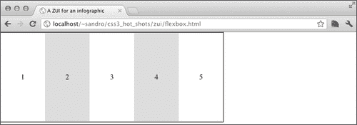
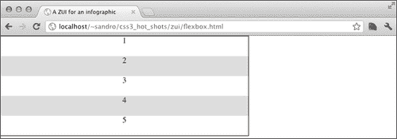
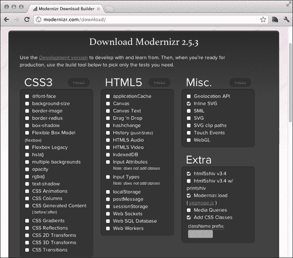
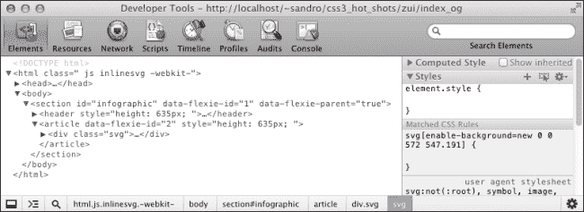
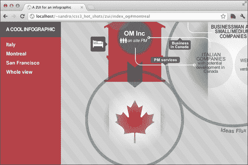

# 四、缩放用户界面

在本章中，我们将学习如何创建一个简单的**ZUI**。该首字母缩略词代表**缩放用户界面**；一种图形环境，用户可以在其中更改查看区域的比例以查看更多或更少的细节。对于这个项目，我们将创建一个 ZUI，让用户移动并探索一个**信息图形**、，它是数据、信息或知识的可视化图形表示。我们将要构建的项目结合了许多 CSS3 特性，例如转换、转换和灵活的方框布局。它还介绍了 SVG 以及我们可以用来将它们嵌入 HTML 页面的各种方法。此外，作为一个额外的挑战，我们还将使我们的页面能够在较旧的浏览器上执行，并将探索完成此任务的聪明方法。

以下是本章讨论主题的预览：

*   信息图
*   灵活的盒子布局
*   多填料
*   嵌入 SVG
*   现代化者
*   `:target`伪选择器
*   CSS3 变换
*   用 CSS 定位 SVG
*   优雅退化

# 信息图形

信息图形正在通过创建聚合数据或显示流的图形表示迅速改变我们消费信息的方式，并且能够以非常直观和易于使用的方式显示大量知识。关于这个话题的一个重要信息来源是博客FlowingData（[http://flowingdata.com/](http://flowingdata.com/) ）。

对于本项目，我们将使用以下由意大利公司[Oxigenio 创建的惊人信息图http://www.officinastrategia.it](http://www.officinastrategia.it) ：


我们想为这个惊人的信息图保留浏览器的大部分视口区域，除了一个 200 像素宽的边栏，它包含一些我们稍后将看到的命令。首先，让我们在`index.html`文件中定义一些基本 HTML：

```html
<!doctype html>
<html>
  <head>
    <meta charset="utf-8">
   <meta http-equiv="X-UA-Compatible" content="IE=edge" />
    <title> A ZUI for an infographic</title>
    <link rel="stylesheet" type="text/css" 
href="http://yui.yahooapis.com/3.5.0/build/cssreset/
cssreset-min.css" data-noprefix>
    <link rel="stylesheet" type="text/css" 
href="css/application.css">

    <script src="js/modernizr.js"></script>
    <script src="js/prefixfree.js"></script>

  </head>
  <body>
    <section id="infographic">
      <header>
        <h1>a cool infographic</h1>
      </header>
      <article>

      </article>
    </section>
  </body>
</html>
```

对于这个项目，我们使用`modernizr.js`和`prefixfree.js`文件。因此，让我们在项目的根文件夹下创建一个`js`目录，并从各自的网站（[下载到那里 http://modernizr.com/downloads/modernizr-latest.js](http://modernizr.com/downloads/modernizr-latest.js) 和[http://leaverou.github.com/prefixfree/](http://leaverou.github.com/prefixfree/) ）。

接下来我们必须准备一个`css`文件夹，并在其中创建一个空`application.css`。

到目前为止，我们定义的 HTML 结构非常简单和简约：一个`header`元素和一个由`section`元素包围的`article`元素。现在我们要将`header`元素放置在左侧，固定宽度为 200 px，并告诉`article`元素覆盖屏幕的其余部分。

我们可以通过多种技术实现此元素配置。在本书中，我们将使用 CSS3 灵活的方框布局。

# 实现灵活的箱体布局

CSS2.1 定义了四种布局模式：块、内联、表格和定位。CSS3 增加了一些新的布局模式，其中一种是**柔性箱布局**。这个新模式由一个新的值激活，我们可以给`display`语句一个新的值，并且可以通过一组全新的属性进行配置。

这种新布局模式背后的基本思想是，在容器元素（例如，`section`元素）中，我们可以指定希望内部元素显示的方向。所以如果我们说`horizontal`元素将从左到右流动，如果我们说`vertical`元素将一个位于另一个之下，从上到下。

然后，我们可以通过使用固定维度或定义增长因子来确定每个元素的大小。

### 注

当容器中有新空间可用时，图元的宽度将根据其生长因子成比例增加。

说够了！让我们创建一个小演示来测试这一点：

```html
<!doctype html>
<html>
  <head>
    <meta charset="utf-8">
    <meta http-equiv="X-UA-Compatible" content="IE=edge" />
    <title> A ZUI for an infographic</title>
    <link rel="stylesheet" type="text/css" 
href="http://yui.yahooapis.com/3.5.0/build/cssreset/
cssreset-min.css">

    <style>
      ul{
        width: 500px;
        height: 200px;
 display: box;
        counter-reset: anchors;
 box-orient: horizontal;
        border: 1px solid black;
      }
      li{
        text-align: center;
        line-height: 200px;
        display: block;
 box-flex: 1;
        counter-increment: anchors;
      }
      li:hover{
 box-flex: 2;
      }
      li:nth-child(2n){
        background: #ddd;
      }
      li:before{
        content: counter(anchors);
      }
    </style>

    <script src="js/prefixfree.js"></script>
  </head>
  <body>
    <ul>
      <li></li>
      <li></li>
      <li></li>
      <li></li>
      <li></li>
    </ul>
  </body>
</html>
```

我们可以看到`ul`元素中的`li`元素如何以相同的宽度开始，这正好是包含元素宽度的五分之一。这是因为它们都具有由属性`box-flex`指定的相同增长因子，这使得它们平均分配可用空间。当我们将鼠标悬停在其中一个`li`元素上时，我们会更改该元素的`box-flex`值；我们将鼠标悬停在`2`上，这使得它的宽度是其他宽度的两倍。以下是刚刚加载页面的屏幕截图：



以下是将鼠标悬停在某个元素上时的屏幕截图：


通过将方向属性（`box-orient`）从`horizontal`更改为`vertical`，我们可以在相反的轴上观察到相同的行为。由于本具体示例的结构，我们还需要修改`line-height`以删除我们设置的`200px`高度：

```html
ul{
  box-orient: vertical;
}
li{
  line-height: normal;
}
```

以下是显示结果的屏幕截图：



# 定义基本结构

现在我们已经有了创建项目结构的基础，我们需要在`section`元素中定义一个水平方向，然后将`header`元素的宽度设置为固定值。

我们已经在本章的第一节中创建了`index.html`HTML。为了清晰起见，现在让我们重新打印`body`部分：

```html
<body>
  <section id="infographic">
    <header>
      <h1>a cool infographic</h1>
    </header>
    <article>

    </article>
  </section>
</body>
```

我们可以开始在`application.css`中添加以下说明：

```html
html, body{
  height: 100%;
}
body{
  overflow: hidden;
font-family: sans-serif;
}
section{
 display: box;
 box-orient: horizontal;
  height: 100%;
  width: 100%;
  overflow: hidden;
}
header{
 width: 200px;
  background: rgb(181, 65, 71);
}
article{
  background-color: rgb(204, 204, 204);
  background-image: 
    repeating-linear-gradient(bottom left, rgb(204, 204, 204) 0px, 
    rgb(204, 204, 204) 20px, 
    rgb(210, 210, 210) 20px, rgb(210, 210, 210) 40px);
 box-flex: 1;
  overflow: hidden;
  position: relative;
}
```

与上一个示例相比，我们添加了更多的说明，因为我们还希望`section`元素覆盖整个浏览器的视口。此外，我们应该防止显示垂直滚动条，因为唯一的导航机制必须是 ZUI 提供的。所以我们在`section`和`article`中都添加了`overflow: hidden`属性。

如果我们现在将项目加载到支持 CSS3 的浏览器中，我们可以欣赏以下结果：


### 注

Flexible Box Layout Module 规范发展迅速，目前没有一款 web 浏览器支持所有规范。我们的实施对应于 2009 年 7 月 23 日发布的以下文件：

[http://www.w3.org/TR/2009/WD-css3-flexbox-20090723/](http://www.w3.org/TR/2009/WD-css3-flexbox-20090723/)

# 添加聚填充物

自本书开始以来，我们第一次使用 CSS3 来定义页面的结构。这意味着我们不能简单地依赖优雅的降级来支持较旧的浏览器，因为这会破坏项目的整体结构。相反，我们将寻找一些能够模拟我们实现的行为的 JavaScript 库。当然，如果用户的浏览器缺少 JavaScript 支持和灵活的方框布局，这可能会导致一些问题，但至少我们希望这样的用户数量非常少。

有不同类型的此类 JavaScript 库，根据需要多少额外工作才能获得与本机实现相同的结果进行分类：

*   **泛型库**：泛型库不允许开发人员获得完全相同的结果，而是给他/她一些工具来编写解决方案的替代实现。
*   **垫片**：垫片允许开发人员完美模拟本机实现，但实现它需要额外的工作成本。
*   **Polyfills**：Polyfills 是最好的。这些库读取我们的代码，检测不受支持的功能，并实现所需的 JavaScript 解决方案，而无需添加额外代码。

我们需要找到一个模拟灵活的盒子布局模块的多边形填充。我们可以从以下页面开始搜索，该页面由 Modernizer 的作者创建并保存，其中列出了他们测试并发现有效的所有 PolyFill：

[https://github.com/Modernizr/Modernizr/wiki/HTML5-Cross-Browser-Polyfills](https://github.com/Modernizr/Modernizr/wiki/HTML5-Cross-Browser-Polyfills)

在向下滚动页面后，我们发现 Flexie，它声称为旧浏览器（最多 IE6）的 Flexible Box 布局添加了支持。我们所要做的就是将库`flexie.js`下载到我们的`js`文件夹中（也可以从 GitHub 的[上获得该库）https://github.com/doctyper/flexie](https://github.com/doctyper/flexie) ，在`src`文件夹中）。

让我们修改我们的`index.html`文件，在`</body>`标记前添加以下行：

```html
<!-- Adding older browser's support -->
<script 
src="http://ajax.googleapis.com/ajax/libs/jquery/1.7.2/
jquery.min.js"></script>
<script src="js/flexie.js"></script>
```

现在，我们可以通过在不支持 CSS3 灵活方框布局的浏览器中加载项目来测试一切是否顺利。以下是从 IE8 中截取的屏幕截图：


正如我们从输出中看到的，没有条纹背景，但整体结构保存完好。

### 注

向项目添加多边形填充不可避免地会增加其复杂性。Polyfills 几乎总是能够模拟为其构建的 CSS3 功能，但其方式明显不同于本机实现。可能是 polyfill 需要向我们的页面注入额外的元素，或者添加 CSS 属性。因此，在开发页面的过程中，尽早添加这些库，并经常测试它们，以便捕获开发页面和库之间的冲突，这是一个很好的经验法则。

# 嵌入 SVG

我们希望使用**可缩放矢量图形**（**SVG**）而不是支持的光栅图像。我们正在构建一个 ZUI，因此我们的信息图需要缩放，使用矢量图可以保持对象的质量。事实上，矢量图像与大小无关，因此缩放时不会出现像素化。

### 注

有关矢量图像和 SVG 的更多信息，请访问维基百科[http://en.wikipedia.org/wiki/Vector_graphics](http://en.wikipedia.org/wiki/Vector_graphics) 。

有三种方法可以嵌入 SVG：

*   作为一个`<object>`元素。这是最受支持的添加 SVG 的方式。但是，SVG 被视为一个外部元素，因此无法通过 JavaScript 进行操作（除了一些明显的属性，如`width`和`height`），这在某种意义上是有限的。
*   作为需要图像的 CSS 的值。
*   直接输入我们的 HTML 代码。这种方法在 SVG 和页面之间提供了最多的交互。正如我们将在本章后面看到的，我们可以直接从 CSS 甚至 JavaScript 与矢量图形交互。

让我们来看第三种方法，因为我们希望 CSS 能够影响 SVG 图形的一部分。首先，让我们创建一个`div`元素，它将在本章前面创建的`<article>`中充当 SVG 元素的容器：

```html
<article>
<div class="panel">

  <!-- place here the svg content -->

</div>
</article>
```

接下来，我们可以使用 jQuery 将 SVG 文件从`img`文件夹直接加载到我们刚刚创建的容器中，在前面编写的`script`标记之后，在`index.html`文件中添加几行：

```html
  <script>
    $(document).ready(function(){
      $('div.panel').load('img/infographic.svg' );
    });
  </script>
</body>
```

在这些行中，我们首先要求 jQuery 等待 DOM 就绪，然后用`.panel`类将 SVG 文件的内容加载到`div`元素中。

现在，我们可以添加一点 CSS，使`div`元素在包含的`article`中垂直和水平居中。

这可能很奇怪，因为只有 Webkit 浏览器和 IE9+似乎接受大小为`100%`的容器，所以我们必须区分这些浏览器和其他浏览器。因此，让我们在`application.css`中添加以下说明：

```html
div.panel{
  width: 572px;
  height: 547px;
}

.-webkit- div.panel, 
.-ms- div.panel {
  width: 100%;
  height: 100%;
}

img.panel{
  display: block;
  position: absolute;
  top: 50%; left: 50%;
  margin-top: -282px;
  margin-left: -273px;
}

html:not(.-webkit-):not(.-ms-) div.panel{
  display: block;
  position: absolute;
  top: 50%; left: 50%;
  margin-top: -282px;
  margin-left: -273px;
}
```

我们现在已经涵盖了所有可能的情况：

*   我们使用 Prefix Free 的功能向`<html>`元素添加一个额外的类来检测 Webkit 和 Microsoft 浏览器，并将这些浏览器的容器大小设置为`100%`，以获得容器允许的最大 SVG
*   如果浏览器不是上一项中讨论的浏览器，我们将集中对齐 SVG 并设置固定大小
*   如果存在一个图像而不是 SVG（稍后我们将看到如何处理它），我们将执行与上一项基本相同的操作。

如果现在在浏览器中重新加载项目，我们可以看到 SVG 的显示：


### 注

由于我们使用的是 AJAX，所以我们需要一个合适的 web 服务器来尝试这个项目。双击`index.html`文件不会产生预期的结果。有关如何安装 web 服务器的更多信息，请参阅本书的*前言*部分。

当然，有些浏览器不支持 SVG。IE8 就是其中之一，所以我们需要找到一个解决方案，以使我们的项目在这些浏览器上保持愉快。

# 利用现代化

在上一章中，我们已经大致了解了现代化，这是一个做很多事情的图书馆，其中一些事情如下所示：

*   它增加了对旧浏览器中新 HTML5 标记的支持。
*   它在 JavaScript 中公开了一些方法，允许我们测试特定的 CSS3/HTML5 特性。例如，`Modernizr.multiplebg`根据多个背景的支持返回`true`或`false`。
*   它向`<html>`元素添加了一些类，反映了对某些 CSS3/HTML5 特性的支持。例如，`<html class="multiplebg">`或`<html class="no-multiplebg">`取决于多个背景的支持。

我们已经将此库添加到我们的项目中。但是，如果没有正确调整，Modernizer 将执行所有测试，以检测支持的功能，即使我们不打算使用它们。为了提高库的性能，我们可以选择希望它执行哪些测试。

为此，我们必须点击 Modernizer 的下载页面（[http://modernizr.com/download/](http://modernizr.com/download/) ）并仅检查我们将使用此库的功能。

对于这个项目，我们需要测试内联 SVG 支持。以下是选中右侧复选框的屏幕截图：



接下来我们点击**生成！**按钮，然后在**下载**按钮上下载并覆盖我们项目中的`modernizr.js`文件。

现在，我们可以检查为我们的项目生成的 HTML 代码，看看如果浏览器支持内嵌 SVG，`html`元素是如何通过`inlinesvg`类得到丰富的，否则通过`no-inlinesvg`类得到丰富的。

### 提示

您可以使用浏览器的开发控制台检查生成的 HTML 代码。例如，如果使用谷歌 Chrome，请按*Ctrl*+*Shift*+*I*（在 Windows 和 Linux 上），或按*命令*+*选项*+*I*（在 Mac 上）。



我们现在将使用普通图像实现 SVG 图形的替代方案；然后，利用Modernizer 提供给我们的类，根据浏览器的支持在其中一个或另一个之间切换。因此，我们首先在`</article>`标记前面的`index.html`中添加一个小的 HTML 片段：

```html

```

那么我们需要修改我们的`application.css`：

```html
.no-inlinesvg div.panel{
  display: none;
}

.inlinesvg img.panel{
  display: none;
}
```

如果我们现在在 IE8 中重新加载项目，我们可以看到如何正确处理一切：


# 目标伪选择器

现在我们可以开始为我们的项目添加一些交互。我们想要的是在`<header>`侧边栏中显示一些控件，当单击这些控件时，可以缩放到信息图的某个定义区域。

为了实现这一点，我们将利用一个新的 CSS3 伪选择器：`:target`。当锚点成为当前 URL 的目标时，它将被激活。让我们创建一个小示例来尝试这一点：

```html
<!doctype html>
<html>
  <head>
    <meta charset="utf8">
    <title> :target test</title>
    <link rel="stylesheet" type="text/css" 
href="http://yui.yahooapis.com/3.5.0/build/cssreset/
cssreset-min.css">

    <style>
    a[id]{
      display: block;
      width: 100px;
      height: 100px;
      text-align: center;
      line-height: 100px;
      margin: 10px;
      background: gray;
    }
 a:target{
 background: yellow;
 }
    </style>

    <script src="js/prefixfree.js"></script>
  </head>
  <body>
    <a href="#one"> light 1 </a>
    <a href="#two"> light 2 </a>
    <a id="one" name="one"> one </a>
    <a id="two" name="two"> two </a>
  </body>
</html>
```

在前面的示例中，我们基本上说当`a`元素成为当前 URL 的目标时，其背景色必须变为黄色。以下截图显示了结果（请注意 URL）：


现在我们需要一组`a`元素，其中包含我们希望用户能够执行的命令。那么让我们在`index.html`文件中的`header`元素中添加一个`nav`元素：

```html
<nav>
  <ul>
    <li><a href="#italy">Italy</a></li>
    <li><a href="#montreal">Montreal</a></li>
    <li><a href="#sanfrancisco">San Francisco</a></li>
    <li><a href="#">Whole view</a></li>
  </ul>
</nav>
```

接下来，我们可以在`application.css`文件中使用一些CSS 指令来设置这些命令的样式：

```html
nav, ul, li{
  width: 100%;
}

h1{
  font-size: 16px;
  text-transform: uppercase;
  letter-spacing: -1px;
  font-weight: bold;
  line-height: 30px;
  text-align: center;
  padding: 10px 0 10px 0;
  color: rgb(255,255,255);
  background: rgb(85, 85, 85);
  margin-bottom: 10px;
}

li, li a{
  display: block;
  height: 30px;
  line-height: 30px;
}

li a{
  color: rgb(255,255,255);
  text-decoration: none;
  font-weight: bold;
  padding-left: 20px;
}

li a:hover{
  text-decoration: underline;
}
```

如果重新加载项目，我们可以看到结果：


## 增加一些锚

现在我们需要放置`a`元素，它们是我们刚刚实现的命令的目标。这里有一个小技巧：如果我们将这些元素放在页面顶部，然后隐藏它们，我们可以使用邻近选择器（`+`和`~`来匹配跟随它们的元素，并且能够几乎触及页面中的所有其他元素。

因此，让我们首先为指定的每个命令添加一个`a`元素，就在`index.html`文件的`body`元素下面：

```html
<a id="italy" name="italy"></a>
<a id="montreal" name="montreal"></a>
<a id="sanfrancisco" name="sanfrancisco"></a>
```

好的现在，如果我们想在点击**意大利**命令时更改`header`背景色，我们可以在 CSS 中添加一行简单的内容：

```html
a[id="italy"]:target ~ section header{
  background: green;
}
```

当然我们不想这样做，但是通过使用相同的原则，我们可以触发对信息图的一些更改。首先，我们必须了解转换。

# CSS3 转换

我们将探索一组全新的属性，目标是能够使用 CSS 任意缩放元素。这是我们完成 ZUI 需要学习的最后一项核心技术，涉及的属性称为**CSS3 转换**。

通过 CSS3 转换，我们可以对页面上的元素应用一些修饰符，即：

*   `translateX(x)`、`translateY(y)`和`translate(x,y)`：这些修饰符将元素沿一个或两个轴移动`x`和`y`变量指定的距离（以 px 为单位）
*   `rotate(deg)`：按`deg`变量指定的值旋转元素，必须用等级表示（从 0 到 360 度）
*   `scaleX(s)`、`scaleY(s)`、`scale(s,[s])`：缩放比例因子`s`指定值的元素，其中`1`的比例对应于保持元素的相同大小
*   `skewX(k)`和`skewY(k)`：按给定的`k`角度进行倾斜变换，以等级表示（从 0 到 360 度）

还有一个`matrix`修饰符，它接受六个参数，让我们定义一个变换矩阵。有关`matrix`修饰符的更多信息，请访问[http://www.w3.org/TR/SVG/coords.html#TransformMatrixDefined](http://www.w3.org/TR/SVG/coords.html#TransformMatrixDefined) 。

让我们在一个小演示中试验这些修改器：

```html
<!doctype html>
<html>
  <head>
    <meta charset="utf-8">
    <meta http-equiv="X-UA-Compatible" content="IE=edge" />
    <title>transform test</title>
    <link rel="stylesheet" type="text/css" 
href="http://yui.yahooapis.com/3.5.0/build/cssreset/
cssreset-min.css">

    <style>
    div{
      width: 100px;
      height: 100px;
      background: green;
      margin: 30px auto;
    }
 div:first-child{
 transform: translateX(100px);
 }
 div:nth-child(2){
 transform: rotate(45deg);
 }
 div:nth-child(3){
 transform: scale(2);
 background: red;
 }
 div:nth-child(4){
 transform: skewX(45deg);
 }
 div:last-child{
 transform: skewY(45deg) scale(1.2) rotate(45deg);
 }
    </style>

    <script src="js/prefixfree.js"></script>
  </head>
  <body>
    <div>translate</div>
    <div>rotate</div>
    <div>scale</div>
    <div>skew</div>
    <div>mixed</div>
  </body>
</html>
```

如您所见，可以组合转换以获得一些有趣的结果。以下是此演示在符合CSS3 的浏览器中运行的屏幕截图：


### 注

另一个值得注意的特性是，元素位置是在应用变换之前计算出来的。这一点的一个证明是，缩放的`div`元素不会向下移动其他元素，而是简单地重叠它们。

## 应用变换

现在我们只需要把我们刚刚学过的东西放在一起，通过点击其中一个命令来转换信息图。为了进行平滑转换，让我们指定一个`1`秒到`application.css`中所有转换属性的转换：

```html
.panel{
    transition: transform 1s;
}

/*
Now we can add these few instructions to trigger the transform when corresponding anchor became target of the current URL:
*/

a[id='italy']:target ~ section div.panel { 
  transform: scale(2) translateY(15%);
  -ms-transform: scale(2) translateY(15%);
}

a[id='montreal']:target ~ section div.panel{
  transform: scale(1.8) translate(24%, -21%);
  -ms-transform: scale(1.8) translate(24%, -21%);
}

a[id='sanfrancisco']:target ~ section div.panel{
  transform: scale(1.8) translate(-24%, -21%);
  -ms-transform: scale(1.8) translate(-24%, -21%);
}
```

好的让我们在浏览器中重新加载项目：



## 闪烁问题

当应用一些 CSS 属性时，所有最新的 Chrome 版本（在撰写本文时版本 18 之前）都会在 CPU 和 GPU 加速图形之间切换（其中包括转换）。如果电脑速度不够快，可能会在屏幕上产生闪烁。一种解决方案是在页面加载时强制 Chrome 应用 GPU 加速属性。在这个解决方案中，我们将在接下来的几章中看到的 3D 变换属性非常有用，因此我们可以向`body`元素添加 null`translateZ`属性，如下所示：

```html
body{
  -webkit-transform: translateZ(0);
}
```

但是，我们必须记住，这种解决方案会降低 SVG 的质量，因为 Chrome 在加速时似乎不会在`transform`属性之后细化图形。此外，移动环境中的 3D 变换属性（如我们刚才使用的属性）需要谨慎处理，因为它们占用大量内存。

# 添加面具

我们可能需要为每个可用的缩放区域添加一个小说明遮罩。在蒙版中，我们还希望用户能够使用小箭头在缩放区域之间移动。

首先，让我们定义所需的 HTML：将有四个掩码，分别用于三个命令中的一个，以及一个用于中心区域。我们可以在`</section>`标记之后添加所需的标记：

```html
<div id="mask"> 
  <div data-detail="italy">
    <span>Help text. Click the arrows to explore more.</span>
    <menu>
      <a role="button" aria-label="move down" 
href="#italy2">&#x25BC;</a>
    </menu>
  </div>
  <div data-detail="italy2">
    <span>Help text. Click the arrows to explore more.</span>
    <menu>
      <a role="button" aria-label="move left" 
href="#montreal">>&#x25C4;</a>
      <a role="button" aria-label="move up" 
href="#italy">&#x25B2;</a><a role="button" aria-label="move right" href="#sanfrancisco">&#x25BA;</a>
    </menu>
  </div>
  <div data-detail="montreal">
    <span>Help text. Click the arrows to explore more.</span>
    <menu>
      <a role="button" aria-label="move right" 
href="#italy2">&#x25BA;</a>
    </menu>
  </div>
  <div data-detail="sanfrancisco">
    <span>Help text. Click the arrows to explore more.</span>
    <menu>
      <a role="button" aria-label="move left" 
href="#italy2">>&#x25C4;</a>
    </menu>
  </div>
</div>
```

现在我们必须将`#mask`元素放置在视口的底线下方，并在触发其中一个命令时激活它。那么让我们在`application.css`中写下以下说明：

```html
#mask{
  position: absolute;
 padding-top: 5px;
  font-size: 18px; 
  font-weight: bold;
 height: 50px;
  color: rgb(255,255,255);
  background-color: rgb(0,0,0);
  background-color: rgba(0,0,0,0.8);
  text-align: center;
 bottom: -55px;
  left: 201px;
  right: 0;
}

#mask menu{
  position: absolute;
  padding: 0; margin: 0;
  bottom: 4px;
  left: 0;
  right: 0;
  text-align: center;
}

#mask div{
 display: none;
}

#mask a{
  text-decoration: none;
  color: rgb(255,255,255);
  padding: 0 10px;
}

a[id='montreal']:target ~ #mask div[data-detail="montreal"],
a[id='italy2']:target ~ #mask div[data-detail="italy2"],
a[id='italy']:target ~ #mask div[data-detail="italy"],
a[id='sanfrancisco']:target ~ #mask 
div[data-detail="sanfrancisco"]{
 display: block;
}

a[id='italy']:target ~ #mask,
a[id='italy2']:target ~ #mask,
a[id='montreal']:target ~ #mask,
a[id='sanfrancisco']:target ~ #mask{
 transition: bottom 1s;
 bottom: 0;
}

```

在突出显示的代码块中，我们指示浏览器：

*   隐藏浏览器底线下方的`#mask`元素
*   隐藏`#mask`元素中的所有`div`元素
*   仅显示与目标`a`元素对应的`#mask`元素中的`div`元素
*   当`a`元素之一为`:target`时，显示`#mask`元素

现在我们需要处理`italy2`锚。所以让我们在`index.html`中`<section>`之前添加另一个`a`元素：

```html
<a id="italy2" name="italy2"></a>
```

以及`application.css`中对应的 CSS：

```html
a[id='italy2']:target ~ section div.panel{
  transform: scale(2) translateY(-15%);
  -ms-transform: scale(2) translateY(-15%);
}
```

做得好！现在，让我们在浏览器中重新加载项目：


# 用 CSS 定位 SVG

好了，该做最后的润色了。我们现在想要的是提供一种机制来切换信息图标签的可见性。由于我们的 SVG 是内联的，我们可以通过简单地将`opacity: 0`添加到它们的`id`选择器中来关闭它们，就像我们对普通 HTML 元素所做的那样。那么让我们在`application.css`中添加以下行：

```html
#Layer_2{ /* this id is present within the SVG */
  opacity: 0;
  transition: opacity 1s;
}
```

下一步是找到让用户切换`opacity`值的方法。我们可以使用复选框并或多或少地利用`:checked`伪选择器来实现这个结果，就像我们使用`:target`选择器一样。

首先，让我们在`index.html`文件中的`<section>`标记前面添加一个复选框：

```html
<input type="checkbox" id="show_labels" name="show_labels">
```

然后，让我们在`nav`命令中标记前面添加相应的标签：

```html
<li><label for="show_labels"></label></li>
```

现在将以下行添加到`application.css`：

```html
#show_labels{
 display: none;
}

nav label:before{
 content: 'Click to show labels';
}

#show_labels:checked ~ section label:before{
 content: 'Click to hide labels';
}

#show_labels:checked ~ section #Layer_2{
 opacity: 1;
}

label{
  text-align: left;
  font-family: sans-serif;
  padding-left: 20px;
  font-size: 13px;
  cursor: pointer;
}

nav label{
  display: block;
  height: 30px;
  line-height: 30px;
}

li:not(:nth-last-child(2)) a:after{
  content: " \00BB";
}

li:nth-last-child(2) a:before{
  content: "\00AB";
}
```

以下是我们项目的最终截图：


# 优雅降级

因为我们添加了 CSS 转换，所以在旧浏览器上开始出现问题。事实上，旧浏览器不支持转换和`:target`伪选择器，因此我们必须找到一个有效的替代方案。一种解决方案是通过 JavaScript 监听 URL 哈希更改，并使用`hashchange`事件将反映当前哈希的类添加到`section`和`#mask`元素中。然后可以使用该类触发一些 CSS 属性。

为了能够在旧浏览器上收听`hashchange`事件，我们需要一个小型 JavaScript 库。我们可以从[下载 http://benalman.com/code/projects/jquery-hashchange/docs/files/jquery-ba-hashchange-js.html](http://benalman.com/code/projects/jquery-hashchange/docs/files/jquery-ba-hashchange-js.html) ，将其重命名为`jquery.hashchange.js`，并将其放入我们的`js`文件夹中。接下来，我们必须用一个新的版本替换我们的 Modernizer（`js/modernizr.js`），该版本还包括**多背景**测试。为了实现这一点，我们可以使用前面讨论的相同过程。

现在我们需要插入这个库，然后在`</body>`标记之前添加一些小 JavaScript 代码：

```html
<script src="js/jquery.hashchange.js"></script>
<script>
  $(document).ready(function(){
/* we check for multiblegbs support because browsers who do support multiple backgrounds surely support also the features we need */
    if(!Modernizr.multiplebgs){
      if(window.location.hash.substring(1) != "")
        window.location.href = window.location.href.replace(window.location.hash,'');
      jQuery(window).hashchange(function(e){
 $('section, #mask').removeClass().addClass(window.location.hash.substring(1));
      });
    }
  });
</script>
```

好的现在我们可以通过改变`img.panel`元素的宽度、高度和位置来模拟`transform`属性。此外，我们还可以使用 JavaScript 动态添加的类来显示和隐藏`#mask`元素。

```html
.no-inlinesvg #mask{
  left: 0px;
}

.no-inlinesvg label{
  display: none;
}

#mask.montreal, #mask.sanfrancisco, #mask.italy, #mask.italy2{
  bottom: 0px;
}

#mask.montreal div[data-detail="montreal"], 
#mask.italy2 div[data-detail="italy2"], 
#mask.italy div[data-detail="italy"], 
#mask.sanfrancisco div[data-detail="sanfrancisco"]{
 display: block;
}

section.italy img.panel{
 top: 60%; left: 25%;
 width: 1000px;
 height: 1000px;
}

section.italy2 img.panel{
 top: 0%; left: 25%;
 width: 1000px;
 height: 1000px;
}

section.montreal img.panel{
 top: -10%; left: 50%;
 width: 1000px;
 height: 1000px;
}

section.sanfrancisco img.panel{
 top: -10%; left: 0%;
 width: 1000px;
 height: 1000px;
}

```

以下屏幕截图显示了最终结果：


# 总结

在本章中，我们学习了如何处理从结构上影响页面的 CSS3 属性。我们还发现了转换，以及一些与 SVG 交互的酷方法。在下一章中，我们将讨论如何增强图像库。