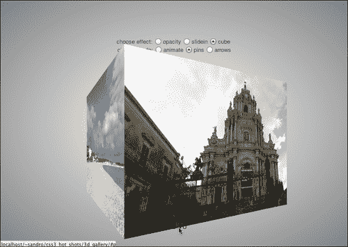
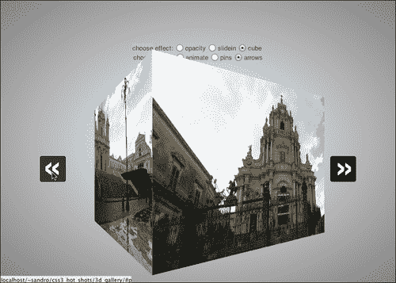

# 五、图像画廊

图像库现在是网站的常见组成部分。在本章中，我们将了解如何仅使用*CSS 属性实现一系列过渡效果和几种导航模式。我们将首先使用一系列图像实现一个基本的过渡效果，然后我们将开发一个纯 CSS 结构，让用户选择自己喜欢的导航模式和过渡效果，最后，我们将添加更复杂的过渡效果。以下是我们将在本章中介绍的主题列表：*

*   基本的图库 HTML 结构
*   实现不透明度转换
*   实现幻灯片转换
*   三维变换
*   添加幻灯片放映模式
*   创建上一个和下一个箭头
*   CSS 预处理器

# 准备结构

在前面的章节中，我们将首先定义一个基本 HTML 结构，在此基础上我们将构建我们的项目。因此，让我们为这个项目创建一个新文件夹，文件名为`index.html`，包含以下代码：

```html
<!doctype html>
<html>
  <head>
    <meta charset="utf-8">
    <meta http-equiv="X-UA-Compatible" content="IE=edge" />
    <title>A 3D Gallery</title>
    <link rel="stylesheet" type="text/css" href="http://yui.yahooapis.com/3.7.3/build/cssreset/cssreset-min.css">
    <link rel="stylesheet" type="text/css" href="css/application.css">
    <script src="js/prefixfree.js"></script>
  </head>
  <body>
    <div>
      choose effect:
      <input type="radio" name="mode" id="opacity" checked >
      <label for="opacity">opacity</label>
      <input type="radio" name="mode" id="slidein">
      <label for="slidein">slidein</label>
      <input type="radio" name="mode" id="cube" >
      <label for="cube">cube</label>
      <br>
      choose mode:
      <input type="radio" name="controls" id="animate">
      <label for="animate">animate</label>
      <input type="radio" name="controls" id="bullets" checked>
      <label for="bullets">bullets</label>
      <input type="radio" name="controls" id="arrows">
      <label for="arrows">arrows</label>

      <a id="picture1" name="picture1"></a>
      <a id="picture2" name="picture2"></a>
      <a id="picture3" name="picture3"></a>
      <a id="picture4" name="picture4"></a>
      <a id="picture5" name="picture5"></a>
      <section>
        <ul>
          <li>
            <figure id="shot1"></figure>
          </li>
          <li>
            <figure id="shot2"></figure>
          </li>
          <li>
            <figure id="shot3"></figure>
          </li>
          <li>
            <figure id="shot4"></figure>
          </li>
          <li>
            <figure id="shot5"></figure>
          </li>
        </ul>
        <span>
          <a href="#picture1" ></a>
          <a href="#picture2" ></a>
          <a href="#picture3" ></a>
          <a href="#picture4" ></a>
          <a href="#picture5" ></a>
        </span>
      </section>
    </div>
  </body>
</hthiml>
```

在前面的章节中，我们使用的是 Yahoo！重置 CSS 样式表以及 Lea Verou 的无前缀库。您可以复制上一章示例中的`prefixfree.js`，也可以从[下载 http://leaverou.github.com/prefixfree/](http://leaverou.github.com/prefixfree/) 。

我们定义的结构包含几个单选按钮，分为两组：`mode`和`controls`。在这个项目中，我们将学习如何改变我们图库的行为来反映用户的选择。我们将首先实现的默认设置涉及不透明度转换和基于项目符号的导航系统。

接下来，锚定的数量等于我们要显示的图像数量。然后，在一个`section`元素中，我们为每个图像都有一个`figure`元素，一个`a`元素指向先前定义的锚。

我们要实现的是在按下相应的`a`元素时激活一个特定的图像。为此，我们将使用已经引入的`:target`伪选择器和其他一些有用的小技巧，但首先我们必须花一点时间定义基本 CSS 结构。

## 应用基本 CSS

首先，我们必须把我们的项目集中在浏览器的视口中间，然后对单选按钮进行一点调整。为此，我们在`application.css`中写了几行的CSS，如下所示：

```html
/* == [BEGIN] General == */

body,html{
  height: 100%;
  background-image: radial-gradient(center center, white, gray);
}
body > div{
  position: absolute;
  width: 500px;
  height: 400px;
  top: 50%; left: 50%;
  margin-left: -250px;
  margin-top: -200px;
  text-align: center;
  font-family: sans-serif;
  font-size: 13px;
  color: #444;
  line-height: 1.5;
}

section{
  margin-top: 20px;
  width: 500px;
  height: 390px;
  position: relative;
}

section > ul{
  width: 500px;
  height: 390px;
  position: relative;
}

input{
  width: 20px;
}

/* == [END] General == */
```

好的现在让我们为每个`figure`元素分配相应的图像：

```html
/* == [BEGIN] Pics == */

section figure {
  position: absolute;
  top: 0px; left: 0px;
  width: 500px; height: 370px;
  padding: 0px; margin: 0px;
  background-position: center center;
}

#shot1{
  background-image: url('img/picture1.jpg');
}
#shot2{
  background-image: url('img/picture2.jpg');
}

#shot3{
  background-image: url('img/picture3.jpg');
}

#shot4{
  background-image: url('img/picture4.jpg');
}

#shot5{
  background-image: url('img/picture5.jpg');
}

/* == [END] Pics == */
```

### 注

请注意，在现实世界的示例中，我们可能会通过`style`属性动态插入这些图像。

现在，我们可以使用符合CSS3 的浏览器测试此设置阶段的成功。此时，我们还没有向单选按钮添加任何行为，因此我们只希望看到`#shot5`中的图像，没有任何交互或动画。


## 子弹造型

让我们开始对`a`元素应用一些样式。我们首先创建项目符号，因为它们是默认表示。我们的子弹在图片下方可以看到一组空心的、可点击的圆圈，就像在线幻灯片中经常看到的那样。我们可以为圆使用一些圆形边框，并在单击元素时应用`background`规则。为了截取这种状态，我们将在页面顶部插入的相应的`a`元素上使用`:target`伪选择器。

```html
/* == [BEGIN] Span == */

section > span > a{
 display: inline-block;
  text-decoration: none;
  color: black;
  font-size: 1px;
  padding: 3px;
  border: 1px solid black;
  border-radius: 4px;
  font-weight: bold;
}

section > span{
  position: absolute;
  bottom: 0px;
  left: 0px;
  right: 0px;
  text-align: center;
}

a[name=picture1]:target ~ section a[href="#picture1"],
a[name=picture2]:target ~ section a[href="#picture2"],
a[name=picture3]:target ~ section a[href="#picture3"],
a[name=picture4]:target ~ section a[href="#picture4"],
a[name=picture5]:target ~ section a[href="#picture5"]{
 background: #111;
}

/* == [END] Span == */
```

我们决定将项目符号设置为`display:inline-block`，以便在元素之间留有一些空间时，该属性在元素之间注入空间，正如我们在[第 3 章](03.html "Chapter 3. Omni Menu")、*Omni 菜单*中看到的。

接下来，我们使用`:target`伪选择器和邻近选择器`~`来定义一条规则，该规则与指向当前锚点的项目符号相匹配。

现在一切都准备好了，我们可以开始处理第一个过渡效果：不透明度。

# 实现不透明度转换

不透明效果是最简单的，我们所要做的就是通过属性`opacity:0`隐藏所有元素，除了与单击项目符号对应的元素。为了获得良好的衰落效果，我们可以使用`transition`属性指定两种状态之间的过渡期。

我们必须在这里实现的一个技巧是，仅当在设置面板中选择了**不透明**单选按钮时，才附加此行为。为此，我们可以在规则之前放置另一个选择器`#opacity:checked`：

```html
/* == [BEGIN] Opacity == */

#opacity:checked ~ section figure{
  opacity: 0;
  transition: opacity 0.4s;
}

#opacity:checked ~ a:not(:target) + a:not(:target) + a:not(:target) + a:not(:target) + a:not(:target) ~ section #shot1,
#opacity:checked ~ a[name=picture1]:target ~ section #shot1,
#opacity:checked ~ a[name=picture2]:target ~ section #shot2,
#opacity:checked ~ a[name=picture3]:target ~ section #shot3,
#opacity:checked ~ a[name=picture4]:target ~ section #shot4,
#opacity:checked ~ a[name=picture5]:target ~ section #shot5{
  opacity: 1;
}

/* == [END] Opacity == */
```

我们基本上使用了与前面相同的技巧，并且我们添加了一个规则，在没有选择项目符号的情况下，将`opacity:1`设置到第一张图像。为此，我们使用`+`选择器专门匹配五个非`:target`的连续`a`元素。

做得好！如果我们在浏览器中运行项目，我们可以测试效果，并注意到只有在选择相应单选按钮的情况下*才起作用*。


### 注

在继续之前的最后一个注意事项是，我们为这个项目创建的选择器非常复杂，如果在大型应用程序中广泛使用，可能会带来性能问题。

是时候实现新效果了：幻灯片！

# 实施幻灯片过渡

滑动效果基本上是一种过渡，其中一个元素在用户视图之外移动，在一个方向上滑动，而另一个方向上移动。要实现这种效果，我们必须处理两种不同的动画：滑入和滑出。使此效果起作用的基本思想与前一个类似，尽管稍微复杂一些。为了实现幻灯片效果，我们必须将所有图片移动到剖面视口之外，比如说`left:-500px`，然后，当单击相应的项目符号时，拍摄所选图片并使用动画将其移动到对面（`left:500px`，然后将其移动到正确的位置（`left:0`。

为了实现滑出效果，我们可以使用另一个从`left:0px`到`left:-500px`的动画。以下是完整的 CSS 片段：

```html
/* == [BEGIN] Slide In == */

#slidein:checked ~ section > ul{
 overflow:hidden;
}

#slidein:checked ~ section figure{
  left: -500px;
  animation-name: slideout;
  animation-duration: 1.5s;
}

#slidein:checked ~ a:not(:target) + a:not(:target) + a:not(:target) + a:not(:target) + a:not(:target) ~ section #shot1,
#slidein:checked ~ a[name=picture1]:target ~ section #shot1,
#slidein:checked ~ a[name=picture2]:target ~ section #shot2,
#slidein:checked ~ a[name=picture3]:target ~ section #shot3,
#slidein:checked ~ a[name=picture4]:target ~ section #shot4,
#slidein:checked ~ a[name=picture5]:target ~ section #shot5{
  animation-name: slidein; 
  animation-duration: 1.5s;
  left: 0px;
}

@keyframes slidein{
 0% { left: 500px; }
 100% { left: 0px; }
}

@keyframes slideout{
 0% { left: 0px; }
 100% { left: -500px; }
}

/* == [END] Slide In == */
```

我们使用`overflow:hidden`将图像隐藏在剖面视口之外。`slideout`动画被添加到除所选元素之外的所有元素中，因此当一个元素退出所选状态时，动画被激活，并将元素平滑地移动到`left:-500px`。

以下是从兼容 CSS3 的浏览器（例如，Chrome、Firefox、IE10 等）中截取的屏幕截图：


现在我们准备编写第三个转换效果代码：立方体！但首先，为了更好地理解下一步，让我们花一些时间介绍 3D 变换的基础知识。

# 三维变换

3D 转换为网站设计带来了一个巨大的飞跃。我们现在可以在一个得益于 GPU 加速（对于大多数浏览器）的 3D 空间中试验移动和动画元素，例如`div`、`img`甚至`video`。一旦我们决定引入 3D 效果，首先要处理的是**透视图**。

我们为`perspective`属性设置的值向浏览器指定如何渲染 z 轴上位置等于 0（或未设置）的元素。例如，`perspective:300px`表示绘制 z=0（或未设置）的元素时，其距离视口的距离为 300 px。当然，这会影响旋转时元素的渲染方式。

接下来是一个有用的属性，其目的是告诉浏览器应用三维变换。此属性称为`transform-style`，其值可以是`flat`或`preserve-3d`。当该值为`flat`时，具有影响 x 或 y 轴旋转的变换的元素没有透视效果，但当该值为`preserve-3d`时，它们的行为实际上类似于真实 3D 曲面。此属性也适用于元素的所有子元素。

最后是转变。这里要使用的属性与 2D 的属性`transform`相同，但是有一些新的关键字可以选择为值。

默认情况下，变换原点设置为 z=0 的元素中心，但可以使用`transform-origin`属性进行调整。

考虑到这些概念，我们可以开始定义立方体效果，这种效果基本上与幻灯片效果类似，但当然可以利用 3D 变换机制。

```html
/* == [BEGIN] Cube == */

#cube:checked ~ section{
 perspective: 500px;
}

#cube:checked ~ section > ul{
 transform-style: preserve-3d;
}

#cube:checked ~ section figure{
 transform-origin: 250px 185px -250px;
 backface-visibility: hidden;
  transform: rotateY(-90deg);
  animation-name: cubeout;
  animation-duration: 1.5s;

}

#cube:checked ~ a:not(:target) + a:not(:target) + a:not(:target) + a:not(:target) + a:not(:target) ~ section #shot1,
#cube:checked ~ a[name=picture1]:target ~ section #shot1,
#cube:checked ~ a[name=picture2]:target ~ section #shot2,
#cube:checked ~ a[name=picture3]:target ~ section #shot3,
#cube:checked ~ a[name=picture4]:target ~ section #shot4,
#cube:checked ~ a[name=picture5]:target ~ section #shot5{
  animation-name: cubein;
  animation-duration: 1.5s;
  transform: rotateY(0deg);
}

@keyframes cubein{
  0%   { transform: rotateY(90deg); }
  100% { transform: rotateY(0deg); }
}

@keyframes cubeout{
  0%   { transform: rotateY(0deg); }
  100% { transform: rotateY(-90deg); }
}

/* == [END] Cube == */
```

我们将`perspective`和`transform-style`设置为要转换的对象的父元素。然后我们定义一个原点，该原点位于`figure`元素的中心，但偏离视口 250 像素。

然后，我们使用与前面的`slidein`动画相同的机制，围绕 y 轴应用旋转变换。

最后，我们告诉浏览器，当图片与用户的视角相反时，不要显示图片。这是通过`backface-visibility: hidden`语句完成的。

在浏览器中快速刷新，结果如下：



### 注

如果运行浏览器的电脑硬件没有 GPU，Chrome 会自动禁用 3D 效果。要检查此行为是否已触发，我们可以在地址栏中写入`about:GPU`。

# 添加幻灯片放映模式

现在我们准备好实现剩下的两种模式：幻灯片和箭头。让我们从幻灯片开始。这里我们要做的就是为每个效果定义一个动画（**不透明**、**幻灯片单元**和**立方体**），并触发它，注意为每个`figure`元素指定不同的延迟（使用`animation-delay`属性）。

让我们从最后一部分开始，为每个`figure`元素定义不同的延迟：

```html
/* == [BEGIN] Animation == */

#animate:checked ~ section #shot1{
  animation-delay: 0s;
}

#animate:checked ~ section #shot2{
  animation-delay: 2.5s;
}

#animate:checked ~ section #shot3{
  animation-delay: 5s;
}

#animate:checked ~ section #shot4{
  animation-delay: 7.5s;
}

#animate:checked ~ section #shot5{
  animation-delay: 10s;
}

#animate:checked ~ section span{
 display: none;
}

```

如果每个动画持续 4 秒（1.5 秒进入动画，1 秒静止，1.5 秒退出动画），我们需要第二个`figure`元素在 2.5 秒后启动，正好是第一个元素开始退出动画的时间。在本章后面，我们将学习如何使 CSS 代码适应不同数量的图像。

然后，我们可以对剩余的`figure`元素重复此步骤，并得出前面的代码。

高亮显示的部分用于隐藏项目符号，因为在幻灯片放映过程中不需要这些项目符号。

好的现在我们要写动画了。让我们从不透明度动画开始：

```html
/* opacity animation */
#opacity:checked ~ #animate:checked ~ section #shot1,
#opacity:checked ~ #animate:checked ~ section #shot2,
#opacity:checked ~ #animate:checked ~ section #shot3,
#opacity:checked ~ #animate:checked ~ section #shot4,
#opacity:checked ~ #animate:checked ~ section #shot5{
  opacity: 0;
 animation-name: opacity;
 animation-duration: 12.5s;
 animation-iteration-count: infinite;
}

@keyframes opacity{
  0%    { opacity: 0; }
  12%   { opacity: 1; }
  20%   { opacity: 1; }
  32%   { opacity: 0; }
  100%  { opacity: 0; }
}
```

我们必须检查**不透明度**和**动画**单选按钮是否都已选中。在这种状态下，我们可以将动画设置为`opacity`并选择一个持续时间，即最后一个`figure`元素`#shot5`（10 秒）的`animation-delay`属性值加上其动画时间（4 秒）减去该动画与前一个动画重叠的时间（1.5 秒）。

接下来，我们定义一些关键帧，将计时转换为百分比（例如，12.5 秒的 12%=1.5 秒）。

我们还可以很容易地为其余两个动画扩展此行为，如下所示：

*   对于滑动效果，我们从可见区域外的图片开始。然后我们移动它直到它完全可见。最后，一段时间后，我们再次将其移出可见区域，但从另一侧移动。

    ```html
    /* slide animation */
    #slidein:checked ~ #animate:checked ~ section #shot1,
    #slidein:checked ~ #animate:checked ~ section #shot2,
    #slidein:checked ~ #animate:checked ~ section #shot3,
    #slidein:checked ~ #animate:checked ~ section #shot4,
    #slidein:checked ~ #animate:checked ~ section #shot5{
      left: -500px;
      animation-name: slide;
      animation-duration: 12.5s;
      animation-iteration-count: infinite;
    }

    @keyframes slide{
      0%    { left: 500px; }
      12%   { left: 0px;   }
      20%   { left: 0px;   }
      32%  { left: -500px;}
      100%  { left: -500px;}
    }
    ```

*   对于旋转立方体效果，我们基本上做了相同的操作，但是我们没有使用`left`属性，而是使用`transform: rotate()`属性，我们没有在图片中滑动（-500 px，然后 0 px，最后 500 px），而是旋转立方体（90 度，然后 0 度，最后-90 度）。

    ```html
    /* cube animation */
    #cube:checked ~ #animate:checked ~ section #shot1,
    #cube:checked ~ #animate:checked ~ section #shot2,
    #cube:checked ~ #animate:checked ~ section #shot3,
    #cube:checked ~ #animate:checked ~ section #shot4,
    #cube:checked ~ #animate:checked ~ section #shot5{
      transform: rotateY(-90deg);
      transition: none;
      animation-name: cube;
      animation-duration: 12.5s;
      animation-iteration-count: infinite;
    }

    @keyframes cube{
      0%    { transform: rotateY(90deg); }
      12%   { transform: rotateY(0deg);  }
      20%   { transform: rotateY(0deg);  }
      32%  { transform: rotateY(-90deg);}
      100%  { transform: rotateY(-90deg);}
    }

    /* == [END] Animation == */
    ```

# 上一个和下一个箭头

好了，最棘手的部分来了：创建箭头。为了完成这项任务，我们要做的是：

1.  使用 CSS 将每个项目符号转换为箭头符号，方法是更改其形状并使用漂亮的背景图像。
2.  将所有箭头移到图片左侧，一个在另一个上方。这样，唯一可见的箭头将是与索引最高的图片对应的箭头。
3.  隐藏与选定图像对应的箭头。
4.  将与所选图像对应的箭头后面的所有箭头向右移动，一个在另一个的上方。这样，左侧将只保留与索引低于所选图片的图片相对应的箭头（例如，如果选择图片编号 3，则只有图片编号 1 和 2 的箭头将保留在左侧，图片编号 2 的箭头位于堆栈顶部）。
5.  选择与所选图像对应的箭头后面的箭头，并更改其`z-index`值，以便将其置于右侧堆栈的顶部。

以下是相应的 CSS 代码：

```html
/* == [BEGIN] Arrows == */

#arrows:checked ~ section span{
  position: static;
}

/* step 1 and 2: transform each bullet in an arrow sign and move all the arrows to the left of the picture */
#arrows:checked ~ section a{
  display: block;
  width: 50px; height: 50px;
  background-image: url('img/freccie.png');
  background-repeat: no-repeat;
  background-color: #000;
  background-position: -50px 0px;
  position: absolute;
  padding: 0;
  top: 50%;
  margin-top: -25px;
  margin-left: -70px;
  left: 0;
}

#arrows:checked ~ section a:hover{
  background-color: #333;
}

/* step 3: hide the arrow corresponding to the selected image */
#arrows:checked ~ a[name=picture1]:target ~ section a[href="#picture1"],
#arrows:checked ~ a[name=picture2]:target ~ section a[href="#picture2"],
#arrows:checked ~ a[name=picture3]:target ~ section a[href="#picture3"],
#arrows:checked ~ a[name=picture4]:target ~ section a[href="#picture4"],
#arrows:checked ~ a[name=picture5]:target ~ section a[href="#picture5"]{
 display: none;
}

/* step 4: Move all the arrows that follow the one corresponding to the selected image to the right, one above another */
#arrows:checked ~ a[name=picture1]:target ~ section a[href="#picture1"] ~ a,
#arrows:checked ~ a[name=picture2]:target ~ section a[href="#picture2"] ~ a,
#arrows:checked ~ a[name=picture3]:target ~ section a[href="#picture3"] ~ a,
#arrows:checked ~ a[name=picture4]:target ~ section a[href="#picture4"] ~ a,
#arrows:checked ~ a[name=picture5]:target ~ section a[href="#picture5"] ~ a{
 display: block;
 position: absolute;
 margin-right: -70px;
 right: 0;
 left: auto;
}
/* step 5: Pick the arrow that follows the one corresponding to the selected image and change its z-index in order to put it on top of the right stack */
#arrows:checked ~ a[name=picture1]:target ~ section a[href="#picture1"] + a,
#arrows:checked ~ a[name=picture2]:target ~ section a[href="#picture2"] + a,
#arrows:checked ~ a[name=picture3]:target ~ section a[href="#picture3"] + a,
#arrows:checked ~ a[name=picture4]:target ~ section a[href="#picture4"] + a,
#arrows:checked ~ a[name=picture5]:target ~ section a[href="#picture5"] + a{
 background-position: 0px 0px;
 z-index: 20;
}

/* == [END] Arrows == */
```

以下屏幕截图显示了结果：



# CSS 预处理器

在本节中，我们将尝试解决该项目的最大问题：整个样式表严格取决于库中显示的图像数量。每个效果都是围绕这个数字定制的，因此添加一个新的图像可以在我们的 CSS 中引起大量的工作。

为了解决这个问题，我们可以使用一个**CSS 预处理器**，它允许我们用一种语言创建一个文件，其中包括一些工具，如循环和变量，以及一个可以编译成 CSS 样式表的工具。

我们将在这个项目中使用 Sass。要安装它，首先需要安装Ruby（[http://www.ruby-lang.sorg/en/downloads/](http://www.ruby-lang.sorg/en/downloads/) ），然后从项目目录中的终端仿真器中键入`gem install sass`（根据您的操作系统，您可能需要改用`sudo gem install sass`。

一旦安装完成，由于 SCSS 是 CSS3 的*超集*，我们可以通过复制`css/application.css`的内容来创建`scss/application.scss`文件。

接下来，我们可以在整个代码前面加一个变量，以包含我们的图库当前保存的图片数量：

```html
/* == [BEGIN] Variables == */

$number_of_images: 5;

/* == [END] Variables == */

/* ... rest of CSS ... */
```

现在，每次在 CSS 中，我们都会遇到一个结构，如下所示：

```html
a[name=picture1]:target ~ section a[href="#picture1"],
a[name=picture2]:target ~ section a[href="#picture2"],
a[name=picture3]:target ~ section a[href="#picture3"],
a[name=picture4]:target ~ section a[href="#picture4"],
a[name=picture5]:target ~ section a[href="#picture5"]{
  background: #111;
}
```

我们可以更改代码，使其根据`$number_of_images`生成正确数量的选择器：

```html
@for $i from 1 through $number_of_images {
 a[name=picture#{$i}]:target ~ section a[href="#picture#{$i}"]{
 background: #111;
 }
}

```

## 处理特殊情况

不过，有一些特殊情况，其中之一是当我们遇到一个 CSS 选择器时，它包含一个字符串标记，重复的次数等于图像的数量。例如，以下 CSS 行：

```html
#opacity:checked ~ a:not(:target) + a:not(:target) + a:not(:target) + a:not(:target) + a:not(:target) ~ section #shot1,
```

要将以前的代码转换为其变量驱动版本，我们必须创建一个函数，一小段返回字符串的代码。我们可以将其写在变量声明的正上方，如下所示：

```html
/* == [BEGIN] Function == */

@function negate-a-times($n) {
 $negate: unquote("");
 @for $i from 1 through $n - 1 {
 $negate: append($negate, unquote("a:not(:target) + "), space);
 }
 @return $negate + unquote("a:not(:target)")
}

/* == [END] Function == */

```

现在我们可以定义一个新变量，该变量包含字符串`a:not(:target)`的重复次数等于我们图库中的图片的重复次数。因此，`.scss`文件中的新变量部分将类似于以下 CSS 片段：

```html
* == [BEGIN] Variables == */

$number_of_images: 5;
$negate_images: negate-a-times($number_of_images);

/* == [END] Variables == */
```

最后，前面的 CSS 片段可以转换为：

```html
#opacity:checked ~ #{$negate_images} ~ section #shot1,

```

另一件事，我们必须注意的是我们的动画时间。我们必须动态计算动画的总持续时间以及三个关键帧（输入动画、静止和退出动画）的百分比，从库中的图像数量开始计算。为此，我们必须在`application.scss`文件的`Variables`部分结束之前定义一些额外的变量：

```html
$animation_duration: 2.5 * $number_of_images;
$enter_animation: 0% + (1.5 / $animation_duration) * 100;
$still: 0% + (2.5 / $animation_duration) * 100; 
$exit_animation: 0% + (4 / $animation_duration) * 100;
$animation_duration: $animation_duration + 0s;

/* == [END] Variables == */
```

在前几行中，我们定义了动画的总持续时间，然后将动画的计时（1.5 秒设置动画进入，1 秒静止，1.5 秒设置动画退出）转换为百分比。

最后但并非最不重要的一点是，我们必须运行`.scss`代码，并将每个`animation-duration: 12.5s;`转换为`animation-duration: $animation_duration;`。我们还需要将`@keyframes opacity`、`@keyframes slide`和`@keyframes cube`变更如下：

```html
@keyframes opacity{
  0%    { opacity: 0; }
 #{$enter_animation}   { opacity: 1; }
 #{$still}             { opacity: 1; }
 #{$exit_animation}    { opacity: 0; }
  100%  { opacity: 0; }
}
@keyframes slide{
  0%    { left: 500px; }
 #{$enter_animation} { left: 0px; }
 #{$still}           { left: 0px; }
 #{$exit_animation}   { left: -500px; }
  100%  { left: -500px; }
}
@keyframes cube{
  0%    { transform: rotateY(90deg); }
 #{$enter_animation}   { transform: rotateY(0deg); }
 #{$still}              { transform: rotateY(0deg); }
 #{$exit_animation}    { transform: rotateY(-90deg); }
  100%  { transform: rotateY(-90deg); }
}
```

### 注

`application.scss`文件的完整版本可从项目来源获得。

要将我们的`application.scss`文件编译成`application.css`，我们可以使用终端模拟器从项目根目录调用以下命令：

```html
sass scss/application.scss:css/application.css

```

通过使用这些简单的翻译规则，我们可以将CSS 转换为非常灵活的 SCS。为了证明这一点，我们可以尝试从 HTML 中删除一个`figure`元素（及其对应的`a`元素），将`$number_of_images:`更改为`4`，重新编译`application.scss`，并注意整个项目是如何顺利运行的。

# 对旧浏览器的支持

Internet Explorer 版本 9 或更低版本不支持 CSS3 转换，也不支持 CSS3 3D 转换，因此可以在这些浏览器上模拟此项目。但是，我们可以实现基本的图片导航，同时隐藏所有其他选项。为了实现这一点，让我们再利用一次条件注释并用以下行替换`<html>`：

```html
<!--[if lte IE 9]> <html class="lteie9"> <![endif]-->
<!--[if !IE]> --> <html> <!-- <![endif]-->
```

接下来，我们需要在项目期间使用的一些 CSS3 选择器中添加对 InternetExplorer8 的支持。为此，我们必须添加一个名为Selectivizr（[的库 http://selectivizr.com/](http://selectivizr.com/) ），它使用 JavaScript 支持大多数新的 CSS3 选择器。Selectivizr 依赖于 jQuery，所以我们也需要添加它。最后，我们需要使用 polyfill 使 InternetExplorer8 支持新的 HTML5 元素。以下是插入这三个库所需的代码片段，我们需要在`index.html`中`head`部分末尾之前添加它：

```html
<!--[if lte IE 8]> 
<script src="http://html5shiv.googlecode.com/svn/trunk/html5.js"></script>
<script src="https://ajax.googleapis.com/ajax/libs/jquery/1.8.3/jquery.min.js"></script>
<script src="http://cdnjs.cloudflare.com/ajax/libs/selectivizr/1.0.2/selectivizr-min.js"></script>
<![endif]-->
```

最后，当`.lteie9`类存在时，我们可以添加一些 CSS 行来隐藏除第一个`figure`元素之外的所有内容。此外，我们可以利用 Sass 来触发与所选项目符号对应的`figure`元素上的`display:block`。

```html
/* == [BEGIN] Old Browser == */

.lteie9 body > div > span, 
.lteie9 body > div > input, 
.lteie9 body > div > br, 
.lteie9 body > div > label, 
.lteie9 figure{
  display: none;
}

.lteie9 #{$negate_images} ~ section #shot1{
  display: block;
}

@for $i from 1 through $number_of_images {
  .lteie9 a[name=picture#{$i}]:target ~ section #shot#{$i}{
    display: block;
  }
}

/* == [END] Old Browser == */
```

# 总结

CSS3 提供了新的简化方法，无需使用 JavaScript 即可创建令人惊叹的图库。可以理解，这些技术不适用于较旧的不符合 CSS3 的浏览器，但我们可以检测这些浏览器并创建回退解决方案。

在本章中，我们了解了如何仅使用 CSS3 创建酷的交互机制。此外，我们发现了一种从更灵活的语言开始静态生成 CSS 的好方法。

最后，我们尝试了三种很酷的动画效果。这些可以很容易地混合，或者可以通过例如将`rotateX`更改为`rotateY`，或者将`left`更改为`top`来创建新的。在下一章中，我们将探讨如何获得有趣的视差效果。