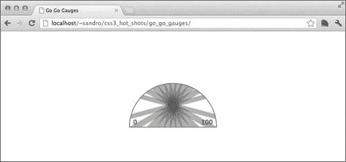
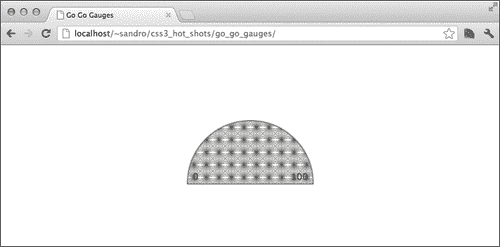
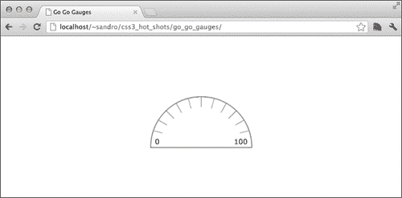
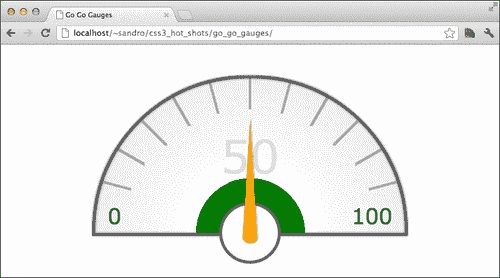
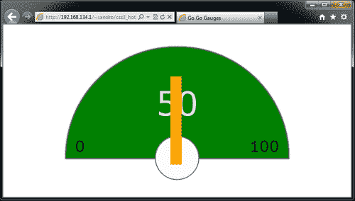
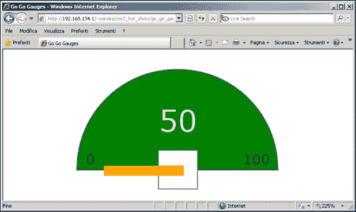

# 八、指南针

在 web 应用程序开发中，仪表可用于以可视化或直观的方式显示复杂或动态数据。在本章中，我们将学习如何创建一个完全可定制的动画仪表，以响应实时变化。我们还将讨论移植这种小部件的技术，以便在旧的 web 浏览器中提供支持。首先，我们将学习一种名为**指南针**的酷炫 SASS 增强功能；这是处理 CSS3 实验前缀的另一种方法。以下是我们将讨论的主题列表：

*   基本规范结构
*   使用指南针
*   使用快速眼动
*   移动箭头
*   为箭头设置动画
*   处理旧浏览器

# 基本轨距结构

让我们从一个新项目开始；像往常一样，我们需要创建一个`index.html`文件。这次涉及的标记非常小且紧凑，我们可以立即添加它：

```html
<!doctype html>
<html>
<head>
<meta charset="utf-8">
<meta http-equiv="X-UA-Compatible" content="IE=edge" />

  <title>Go Go Gauges</title>

  <link rel="stylesheet" type="text/css" href="css/application.css">
</head>
<body>

 <div data-gauge data-min="0" data-max="100" data-percent="50">
 <div data-arrow></div>
 </div>

</body>
</html>
```

仪表小部件由`data-gauge`属性标识，并由其他三个自定义数据属性定义；即，`data-min`、`data-max`、`data-percent`，分别表示该范围的最小值和最大值以及当前箭头位置的百分比值。

在标有`data-gauge`属性的元素中，我们定义了一个`div`标记，它将成为仪表的箭头。

从样式设计阶段开始，我们首先需要为自己配备一个易于使用的框架，并为我们提供生成CSS 代码的机会。我们决定使用 SASS，就像我们在[第 5 章](05.html "Chapter 5. An Image Gallery")中使用的一样，*一个图像库*，所以我们首先需要安装Ruby（[http://www.ruby-lang.org/en/downloads/](http://www.ruby-lang.org/en/downloads/) ），然后从命令行终端输入以下内容：

```html
gem install sass

```

### 注

如果您在 Unix/Linux 环境中工作，可能需要执行以下命令：

```html
sudo gem install sass

```

# 安装罗盘

在这个项目中，我们还将使用 Compass，这是一个 SASS扩展，能够为我们的 SASS 样式表添加一些有趣的特性。

要安装指南针，我们只需在终端窗口中输入`gem install compass`（或`sudo gem install compass`）。安装过程结束后，我们必须使用以下代码在项目的根文件夹中创建一个小的`config.rb`文件：

```html
# Require any additional compass plugins here.

# Set this to the root of your project when deployed:
http_path = YOUR-HTTP-PROJECT-PATH
css_dir = "css"
sass_dir = "scss"
images_dir = "img"
javascripts_dir = "js"

# You can select your preferred output style here (can be overridden via the command line):
# output_style = :expanded or :nested or :compact or :compressed

# To enable relative paths to assets via compass helper functions. Uncomment:
relative_assets = true

# To disable debugging comments that display the original location of your selectors. Uncomment:
# line_comments = false

preferred_syntax = :sass 

```

`config.rb`文件有助于 Compass 了解项目各种资产的位置；让我们详细了解一下这些选项：

*   `http_path`：必须将设置为与项目根文件夹相关的 HTTP URL
*   `css_dir`：包含生成的 CSS 文件应保存的文件夹的相对路径
*   `sass_dir`：包含到包含我们`.scss`文件的文件夹的相对路径
*   `images_dir`：包含保存项目所有图像的文件夹的相对路径
*   `javascripts_dir`：这类似于和`images_dir`，但适用于 JavaScript 文件

还有其他选择；我们可以决定是否应该压缩输出 CSS，或者让 Compass 使用相对路径而不是绝对路径。有关所有可用选项的完整列表，请参见[中的文档 http://compass-style.org/help/tutorials/configuration-reference/](http://compass-style.org/help/tutorials/configuration-reference/) 。

接下来，我们可以创建刚才描述的文件夹结构，为我们的项目提供`css`、`img`、`js`和`scss`文件夹。最后，我们可以创建一个空的`scss/application.scss`文件，开始发现指南针的美。

# CSS 重置和供应商前缀

我们可以要求 Compass 在每次更新其对应的 SCSS 后重新生成 CSS 文件。为此，我们需要使用终端从项目根目录执行以下命令：

```html
compass watch .

```

Compass 提供了雅虎的另一种选择！重置我们在上一个项目中使用的样式表。要包含此样式表，我们只需将 SASS`include`指令添加到我们的`application.scss`文件中：

```html
@import "compass/reset";

```

如果我们勾选`css/application.css`，结果如下（已修剪）：

```html
/* line 17, ../../../../.rvm/gems/ruby-1.9.3-p194/gems/compass-0.12.2/frameworks/compass/stylesheets/compass/reset/_utilities.scss */
html, body, div, span, applet, object, iframe,
h1, h2, h3, h4, h5, h6, p, blockquote, pre,
a, abbr, acronym, address, big, cite, code,
del, dfn, em, img, ins, kbd, q, s, samp,
small, strike, strong, sub, sup, tt, var,
b, u, i, center,
dl, dt, dd, ol, ul, li,
fieldset, form, label, legend,
table, caption, tbody, tfoot, thead, tr, th, td,
article, aside, canvas, details, embed,
figure, figcaption, footer, header, hgroup,
menu, nav, output, ruby, section, summary,
time, mark, audio, video {
  margin: 0;
  padding: 0;
  border: 0;
  font: inherit;
  font-size: 100%;
  vertical-align: baseline;
}

/* line 22, ../../../../.rvm/gems/ruby-1.9.3-p194/gems/compass-0.12.2/frameworks/compass/stylesheets/compass/reset/_utilities.scss */
html {
  line-height: 1;
}

... 
```

还要注意生成的 CSS 如何保持对原始 SCS 的引用；当调试页面中的一些意外行为时，这很方便。

下一个`@import`指令将处理 CSS3 实验供应商前缀。通过在`application.scss`文件的顶部添加`@import "compass/css3"`，我们要求 Compass 为我们提供很多强大的自动添加实验前缀的方法；例如，以下代码段：

```html
.round {
    @include border-radius(4px);
}
```

已编译为以下内容：

```html
.round {
    -moz-border-radius: 4px;
    -webkit-border-radius: 4px;
    -o-border-radius: 4px;
    -ms-border-radius: 4px;
    -khtml-border-radius: 4px;
    border-radius: 4px;
}
```

有了这些新知识，我们现在可以开始部署项目了。

# 使用 rem

对于这个项目，我们想引入`rem`，一个几乎等同于`em`的度量单位，但总是相对于页面的根元素。因此，基本上我们可以在`html`元素上定义一个字体大小，然后所有大小都将与之相关：

```html
html{
  font-size: 20px;
}
```

现在，`1rem`对应于`20px`；这种测量方法的问题在于，某些浏览器，如 InternetExplorer 版本 8 或更低版本，实际上并不支持它。为了找到解决此问题的方法，我们可以使用以下两种不同的回退度量单位：

*   `em`：好消息是`em`如果进行了完美的调谐，其工作原理与`rem`完全相同；坏消息是，此度量单位与元素的`font-size`属性相关，而与`html`无关。因此，如果我们决定采用这种方法，那么每次处理`font-size`时，我们都必须格外小心。
*   `px`：我们可以使用固定的单位像素大小。这种选择的缺点是，在较旧的浏览器中，动态更改小部件比例的功能变得复杂。

在这个项目中，我们将使用像素作为测量单位。我们之所以决定这样做，是因为`rem`的好处之一是，我们可以通过媒体查询更改 font-size 属性来轻松更改仪表的大小。这仅在支持媒体查询和`rem`的情况下才可能实现。

现在，我们必须找到一种方法来解决大多数重复问题，这些重复问题是由于必须将包含空间度量单位的每个语句插入两次（`rem`和`px`）。通过在我们的`application.scss`文件中创建一个 SASS mixin，我们可以很容易地解决这个问题，如下所示（有关 SASS mixin 的更多信息，我们可以参考[的规范页面）http://sass-lang.com/docs/yardoc/file.SASS_REFERENCE.html#mixins](http://sass-lang.com/docs/yardoc/file.SASS_REFERENCE.html#mixins) ：

```html
@mixin px_and_rem($property, $value, $mux){
  #{$property}: 0px + ($value * $mux);
  #{$property}: 0rem + $value;
}
```

因此，下次不要写以下内容：

```html
#my_style{
width: 10rem;
}
```

我们可以这样写：

```html
#my_style{
@include px_and_rem(width, 10, 20);
}
```

除此之外，我们还可以将`px`和`rem`之间的`multiplier`系数保存在一个变量中，并在对该函数的每次调用中和`html`声明中使用它；我们也将此添加到`application.scss`：

```html
$multiplier: 20px;

html{
  font-size: $multiplier;
}
```

当然，在某些情况下，我们刚刚创建的`@mixin`指令仍然不起作用，在这种情况下，我们必须手动处理这种二元性。

# 仪表的基本结构

现在，我们已经准备好开发至少我们的仪表的基本结构，包括圆形边框和最小和最大范围标签。我们需要在`application.scss`中添加以下代码：

```html
div[data-gauge]{
  position: absolute;

  /* width, height and rounded corners */
  @include px_and_rem(width, 10, $multiplier);
  @include px_and_rem(height, 5, $multiplier);
  @include px_and_rem(border-top-left-radius, 5, $multiplier);
  @include px_and_rem(border-top-right-radius, 5, $multiplier);

  /* centering */
  @include px_and_rem(margin-top, -2.5, $multiplier);
  @include px_and_rem(margin-left, -5,  $multiplier);
  top: 50%;
  left: 50%;

  /* inset shadows, both in px and rem */
box-shadow: 0 0 #{0.1 * $multiplier} rgba(99,99,99,0.8), 0 0 #{0.1 * $multiplier} rgba(99,99,99,0.8) inset;
  box-shadow: 0 0 0.1rem rgba(99,99,99,0.8), 0 0 0.1rem rgba(99,99,99,0.8) inset;

  /* border, font size, family and color */
  border: #{0.05 * $multiplier} solid rgb(99,99,99);	
  border: 0.05rem solid rgb(99,99,99);

  color: rgb(33,33,33);
  @include px_and_rem(font-size, 0.7, $multiplier);
  font-family: verdana, arial, sans-serif;

  /* min label */
  &:before{
    content: attr(data-min);
    position: absolute;
    @include px_and_rem(bottom, 0.2, $multiplier);
    @include px_and_rem(left, 0.4, $multiplier);
  }

  /* max label */
  &:after{
    content: attr(data-max);
    position: absolute;
    @include px_and_rem(bottom, 0.2, $multiplier);
    @include px_and_rem(right, 0.4, $multiplier);
  }
}
```

对于`box-shadow`和`border`，我们无法使用`px_and_rem`mixin，因此我们先使用`px`然后使用`rem`复制这些属性。

以下屏幕截图显示了结果：


## 仪表刻度线

如何处理记号？一种方法是使用图像，但另一种有趣的方法是受益于多背景支持，并利用渐变创建那些记号。例如，要创建垂直标记，我们可以在`div[data-gauge]`选择器中使用以下选项：

```html
linear-gradient(0deg, transparent 46%, rgba(99, 99, 99, 0.5) 47%, rgba(99, 99, 99, 0.5) 53%, transparent 54%)
```

基本上，我们在透明和另一种颜色之间定义一个非常小的渐变，以获得记号。这是第一步，但我们还需要处理一个事实，即每个记号都必须用不同的角度来定义。我们可以通过引入一个 SASS 函数来解决这个问题，该函数接受要打印的记号的数量，并迭代到该数量，同时还可以调整每个记号的角度。当然，我们还必须注意实验性的供应商前缀，但我们可以依靠 Compass。

下面是函数。我们可以创建一个名为`scss/_gauge.scss`的新文件，用于此函数和其他与仪表相关的函数；最前面的下划线是告诉 SASS 不要用这个`.scss`文件创建`.css`文件，因为它将包含在一个单独的文件中。

```html
@function gauge-tick-marks($n, $rest){
  $linear: null;
  @for $i from 1 through $n {
 $p: -90deg + 180 / ($n+1) * $i;
    $linear: append($linear, linear-gradient( $p, transparent 46%, rgba(99,99,99,0.5) 47%, rgba(99,99,99,0.5) 53%, transparent 54%), comma);
  }
  @return append($linear, $rest);  
}
```

我们从一个空字符串开始，添加调用`linear-gradient`Compass 函数的结果，该函数处理实验性供应商前缀，角度根据当前记号索引而变化。

为了测试这个函数，我们首先需要在`application.scss`中包含`_gauge.scss`：

```html
@import "gauge.scss";
```

接下来，我们可以在`application.scss`中的`div[data-gauge]`选择器中插入函数调用，指定所需的记号数：

```html
@include background(gauge-tick-marks(11,null));
```

`background`功能也是由 Compass 提供的，它只是处理实验前缀的另一种机制。不幸的是，如果我们重新加载项目，结果与预期相差甚远：



虽然我们总共可以看到 11 条条纹，但它们的尺寸和位置都不正确。为了解决这个问题，我们将创建一些函数来为`background-size`和`background-position`设置正确的值。

## 处理背景尺寸和位置

让我们从最简单的`background-size`开始。因为我们希望每个记号的大小都精确到`1rem`，所以我们可以创建一个函数来打印**1rem 1rem**作为传递参数的次数；那么让我们在`_gauge.scss`中添加以下代码：

```html
@function gauge-tick-marks-size($n, $rest){
  $sizes: null;
  @for $i from 1 through $n {
 $sizes: append($sizes, 1rem 1rem, comma);
  }
  @return append($sizes, $rest, comma);
}
```

我们已经注意到了`append`功能；关于它，有一件有趣的事情要知道，这个函数的最后一个参数让我们决定是否必须使用某个字母来连接正在创建的字符串。其中一个可用选项是`comma`，它非常适合我们的需要。

现在，我们可以在`div[data-gauge]`选择器中添加对该函数的调用：

```html
background-size: gauge-tick-marks-size(11, null);
```

结果如下：



现在，记号大小正确，但它们一个接一个地显示，并在整个元素中重复。为了避免这种行为，我们只需在前面的说明下方添加`background-repeat: no-repeat`：

```html
background-repeat: no-repeat;
```

另一方面，为了处理记号的位置，我们需要另一个 SASS 函数；这一次它有点复杂，涉及到一些三角函数。每个梯度必须以其角度的函数来放置，x 是该角度的余弦，y 是正弦。`sin`和`cos`功能由 Compass 提供，我们只需处理移位，因为它们是指圆的中心，而 css 属性的原点在左上角：

```html
@function gauge-tick-marks-position($n, $rest){
  $positions: null;
  @for $i from 1 through $n {
 $angle: 0deg + 180 / ($n+1) * $i;
 $px: 100% * ( cos($angle) / 2 + 0.5 );
 $py: 100% * (1 - sin($angle));
    $positions: append($positions, $px $py, comma);
  }
  @return append($positions, $rest, comma);
}
```

现在我们可以继续在`div[data-gauge]`选择器中添加新行：

```html
background-position: gauge-tick-marks-position(11, null);
```

下面是期待已久的结果：



下一步是创建一个`@mixin`指令，将这三个函数保存在一起，因此我们可以在`_gauge.scss`中添加以下内容：

```html
@mixin gauge-background($ticks, $rest_gradient, $rest_size, $rest_position) {

  @include background-image(
    gauge-tick-marks($ticks, $rest_gradient) 
  );

  background-size: gauge-tick-marks-size($ticks, $rest_size);
  background-position: gauge-tick-marks-position($ticks, $rest_position);
  background-repeat: no-repeat;
}
```

并将本章`div[data-gauge]`中的内容替换为一次调用：

```html
@include gauge-background(11, null, null, null );
```

我们还留下了三个额外的参数来定义`background`、`background-size`和`background-position`的额外值，因此，例如，我们可以轻松添加渐变背景：

```html
@include gauge-background(11,
  radial-gradient(50% 100%, circle, rgb(255,255,255), rgb(230,230,230)),
  cover,
  center center
);
```

以下是截图：


# 创建箭头

要创建一个箭头，我们可以首先在固定箭头的量规中心定义圆形元素。这很简单，不会引入任何真正的新内容；下面是需要嵌套在`div[data-gauge]`选择器中的代码：

```html
  div[data-arrow]{
    position: absolute;
    @include px_and_rem(width, 2, $multiplier);
    @include px_and_rem(height, 2, $multiplier);
    @include px_and_rem(border-radius, 5, $multiplier);
    @include px_and_rem(bottom, -1, $multiplier);
    left: 50%;
    @include px_and_rem(margin-left, -1, $multiplier);
   box-sizing: border-box;

    border: #{0.05 * $multiplier} solid rgb(99,99,99);  
    border: 0.05rem solid rgb(99,99,99);
    background: #fcfcfc;
  }
```

箭本身是一件更严肃的事情；基本思想是使用线性渐变，从对角线开始，只为元素的一半添加颜色。然后，我们可以旋转元素，以便在其中心移动尖端。以下是需要放置在`div[data-arrow]`中的代码：

```html
    &:before{
      position: absolute;
      display: block;
      content: '';
      @include px_and_rem(width, 4, $multiplier);
      @include px_and_rem(height, 0.5, $multiplier);
      @include px_and_rem(bottom, 0.65, $multiplier);
      @include px_and_rem(left, -3, $multiplier);
 background-image: linear-gradient(83.11deg, transparent, transparent 49%, orange 51%, orange); 
 background-image: -webkit-linear-gradient(83.11deg, transparent, transparent 49%, orange 51%, orange); 
 background-image: -moz-linear-gradient(83.11deg, transparent, transparent 49%, orange 51%, orange);
 background-image: -o-linear-gradient(83.11deg, transparent, transparent 49%, orange 51%, orange); 

 @include apply-origin(100%, 100%);
 @include transform2d( rotate(-3.45deg));
 box-shadow: 0px #{-0.05 * $multiplier} 0 rgba(0,0,0,0.2);
 box-shadow: 0px -0.05rem 0 rgba(0,0,0,0.2);			@include px_and_rem(border-top-right-radius, 0.25, $multiplier);
 @include px_and_rem(border-bottom-right-radius, 0.35, $multiplier);
    }
```

为了更好地理解这个实现背后的技巧，我们可以在`&:before`选择器中临时添加`border: 1px solid red`到结果中并稍微放大：


## 移动箭头

现在我们要根据`data-percent`属性值将箭头定位到正确的角度。要做到这一点，我们必须利用 SASS 的力量。理论上，CSS3 规范允许我们使用从属性中获取的值对某些属性进行估值，但实际上，这只有在处理和`content`属性时才可能，正如我们在本书前面看到的那样。

所以我们要做的是创建一个从`0`到`100`的`@for`循环，并在每次迭代中打印一个与`data-percent`属性定义值匹配的选择器。然后我们将为每个 CSS 规则设置不同的`rotate()`属性。

以下是代码；这次必须将其置于`div[data-gauge]`选择器内：

```html
@for $i from 0 through 100 {
  $v: $i;
  @if $i < 10 { 
    $v: '0' + $i;
  }

  &[data-percent='#{$v}'] > div[data-arrow]{
      @include transform2d(rotate(#{180deg * $i/100}));
  }
}
```

如果您太担心生成的 CSS 数量，那么您可以决定调整仪表的增量，例如，调整为`10`：

```html
  @for $i from 0 through 10 {
    &[data-percent='#{$i*10}'] > div[data-arrow]{
      @include transform2d(rotate(#{180deg * $i/10}));
    }
  }
```

结果如下：


# 设置仪表动画

现在，我们可以使用 CSS 变换为箭头设置动画。基本上，我们必须告诉浏览器`transform`属性需要设置动画；由于 Compass 尚未能够为`transition`属性及其值（[添加前缀，因此必需的 SASS 代码比预期的稍长 https://github.com/chriseppstein/compass/issues/289](https://github.com/chriseppstein/compass/issues/289) ），所以我们必须手动进行：

```html
  -webkit-transition: -webkit-transform 0.5s;
  -moz-transition: -moz-transform 0.5s;
  -ms-transition: -ms-transform 0.5s;
  -o-transition: -o-transform 0.5s;
  transition: transform 0.5s;
```

在我们将这些 CSS 指令放入`div[data-arrow]`选择器之后，我们会注意到，如果我们使用 Chrome 及其开发控制台更改`data-percentage`属性，箭头将以平滑的动画响应。

# 总体指标

一些仪表显示颜色指示器，通常从绿色到红色，与箭头位置相关；我们可以得出类似的结果。首先，我们需要定义两个新的自定义数据属性，一个表示指示器从绿色切换到橙色的百分比，另一个表示百分比从橙色切换到红色的百分比。这是：

```html
<div data-gauge data-min="0" data-max="100" data-percent="50" data-orange-from="60" data-red-from="90">
  <div data-arrow></div>
</div>
```

然后我们需要指定一个默认的背景色，比如说`green`，在`div[data-gauge]`内：

```html
background-color: green;
```

接下来，我们重新定义背景梯度，使前 25%的周长保持透明；通过这种方式，我们可以显示（并控制）底层颜色，因此让我们重写`gauge-background`调用：

```html
@include gauge-background(11,
 radial-gradient(50% 100%, circle, rgba(255,255,255,0), rgba(255,255,255,0) 25%, rgb(255,255,255) 25%, rgb(230,230,230)),
  cover,
  center center
);
```

现在我们可以使用另一个 Sass 循环来更改与属性中定义的值相关的`background-color`属性。因为我们要实现一个嵌套在前一个循环中的循环，所以我们必须小心不要将结果 CSS 的大小增加太多。

为了实现这一点，让我们只考虑 10Ts 和 Ty1 T1 数据属性的 10s。我们需要做的基本上是编写一个 CSS 规则，当`data-percentage`属性大于或等于`data-orange-from`或`data-red-from`时，激活红色或橙色背景色。

以下是完整的循环，包括我们用于移动箭头的上一个循环：

```html
@for $i from 0 through 100 {
  $v: $i;
  @if $i < 10 { 
    $v: '0' + $i;
  } 

  &[data-percent='#{$v}'] > div[data-arrow]{
    @include transform2d(rotate(#{180deg * $i/100}));
  }

 @for $k from 0 through 10 {
 @if $i >= $k * 10 {
 &[data-percent='#{$v}'][data-orange-from^='#{$k}']{
 background-color: orange;
 }
 &[data-percent='#{$v}'][data-red-from^='#{$k}']{
 background-color: red;
 }
 }
 }
}
```

以下是结果：


## 缩小 CSS 的大小

我们可以通过要求Compass 不要在每个指向相应 SASS 规则的规则之前添加注释来减小生成的 CSS 的大小。如果我们想这样做，只需将`line_comments = false`添加到`config.rb`文件中，然后停止并重新启动项目根文件夹中的`compass watch`。

# 增加一些颤抖

作为一个附加功能，我们可以添加一个选项，让箭头在接近 100%时稍微颤动。如果存在额外的`data-trembling`属性，我们可以通过添加一个小动画来实现此行为：

```html
<div data-gauge data-min="0" data-max="100" data-percent="50" data-orange-from="60" data-red-from="90" data-trembling>

```

不幸的是，Compass 不提供现成的 CSS3 动画混合，所以我们必须安装一个 Compass 插件来帮助我们。在这种情况下，插件名为**指南针动画**（[https://github.com/ericam/compass-animation](https://github.com/ericam/compass-animation) ），由 Eric Meyer 创作（[http://eric.andmeyer.com/](http://eric.andmeyer.com/) ）。安装方式如下：

```html
gem install animation –pre

```

或如下：

```html
sudo gem install animation –-pre

```

然后我们必须在调用`compass watch`时包含插件：

```html
compass watch . –r animation

```

在`application.scss`的标题中：

```html
@import "animation";
```

做得好！现在，我们已经准备好定义一个非常简单的动画，它可以修改箭头的旋转角度，从而产生我们想要的抖动效果。让我们在`application.scss`的末尾添加几行代码：

```html
@include keyframes(trembling) {
  0% {
      @include transform2d( rotate(-5.17deg));
  }
  100% {
      @include transform2d( rotate(-1.725deg));
  }
}
```

然后我们需要在`div[data-gauge]`中添加一个新规则，如果`data-trembling`存在并且`data-percentage`以`8`或`9`开头或等于`100`则激活此动画：

```html
&[data-trembling][data-percent^='8'] > div[data-arrow]:before,
&[data-trembling][data-percent^='9'] > div[data-arrow]:before,
&[data-trembling][data-percent='100'] > div[data-arrow]:before{
 @include animation(trembling 0.2s infinite linear alternate);
}
```

不幸的是，由于基于 WebKit 的浏览器中存在一些尚未解决的错误，这些错误阻止动画应用于`before`和`after`伪选择器，因此在撰写本文时，只有 Firefox 正确实现了这种行为：


# 显示仪表值

如果我们对 HTML 代码进行一个小的编辑，可以很容易地显示当前的仪表值：

```html
<div data-gauge data-min="0" data-max="100" data-percent="50" data-orange-from="60" data-red-from="90" data-trembling>
<span>50</span>
  <div data-arrow></div>
</div>
```

下面是在`div[data-gauge]`选择器中添加的代码：

```html
span{
  display: block;
  color: #DDD;
  @include px_and_rem(font-size, 1.5, $multiplier);
  text-align: center;
  @include px_and_rem(width, 10, $multiplier);
  @include px_and_rem(height, 5, $multiplier);
  @include px_and_rem(line-height, 5, $multiplier);
}
```

结果是：



# 优雅降级

为了使这个小部件对那些不支持背景渐变的浏览器也有意义，我们必须为箭头处理不同的表示。要检测此功能缺失的位置，我们可以通过创建自定义构建（[使用Modernizer】http://modernizr.com/download/](http://modernizr.com/download/) ），正如我们在前面章节中看到的，只检查梯度支撑：

```html
<script src="js/modernizr.js"></script>
```

然后我们可以选择纯色背景；箭头当然会变成一个矩形，但我们将保存小部件的含义；让我们在`application.scss`的底部添加此规则：

```html
.no-cssgradients div[data-gauge]{ 

 div[data-arrow]:before{
 background-color: orange;
 @include transform2d( rotate(0deg));
 box-shadow: none;
 border-radius: 0;
 }
}
```

结果如下：



我们可以进一步利用 Compass 将渐变转换为`Base64`编码的 SVG，并在不支持本地渐变的情况下将其用作后备背景图像。不幸的是，这不适用于使用数值（如`23deg`）表示角度的渐变，因此我们无法重现记号。但是，我们可以要求 Compass 转换我们用作背景的`radial-gradient`属性。以下是我们需要在`.no-cssgradients div[data-gauge]`规则中添加的属性：

```html
background-image: -svg(radial-gradient(50% 100%, circle, rgba(255,255,255,0), rgba(255,255,255,0) 35%, rgb(255,255,255) 35%, rgb(230,230,230)));
background-size: cover;
background-position: auto;
```

结果如下，更接近于原始测量值：


# 在 InternetExplorer8 中实现仪表

如果我们想支持 InternetExplorer8，那么我们需要解决`border-radius`和`transform`属性的不足。

对于`border-radius`我们可以使用基于 JavaScript 的 polyfill，如 CSS3 Pie，我们可以从其网站[下载此 polyfillhttp://css3pie.com/](http://css3pie.com/) ，然后将`PIE.js`复制到我们项目的`js`文件夹中。接下来，我们可以包括来自`index.html`的这个 JavaScript 文件，以及最新版本的 jQuery 和`js/application.js`（稍后我们将使用的一个空文件）：

```html
<!--[if IE 8]>
  <script src="http://code.jquery.com/jquery-1.8.0.min.js"></script>
  <script src="js/PIE.js"></script>
  <script src="js/application.js"></script>
<![endif]-->
```

通常，CSS3 Pie 通过识别要仿真的 CSS3 属性自动检测如何增强给定元素。然而，在本例中，我们使用了`border-top-left-radius`和`border-top-right-radius`，而 CSS3 Pie 只支持一般的`border-radius`。我们可以通过在`div[data-gauge]`规则中添加一个前缀为`–pie`的特殊`border-radius`属性来解决此问题：

```html
-pie-border-radius: #{5 * $multiplier} #{5 * $multiplier} 0px 0px;

```

接下来，我们必须通过在`js/application.js`中插入几行 JavaScript 代码来激活 CSS3 Pie：

```html
$(function() {
    if (window.PIE) {
 $('div[data-gauge]').each(function() {
 PIE.attach(this);
 });
    }
});
```

结果如下：



现在，如果我们想激活箭头旋转，我们需要模拟`transform`属性。为了实现这种行为，我们可以使用`jquery.transform.js`（[https://github.com/louisremi/jquery.transform.js 路易·雷米·巴贝的](https://github.com/louisremi/jquery.transform.js)（[http://twitter.com/louis_remi](http://twitter.com/louis_remi) ）。

下载完库后，我们需要将`jquery.transform2d.js`复制到我们项目的`js`文件夹中。然后我们在`index.html`中添加必要的`script`元素。当浏览器为Internet Explorer 8 时，为了向元素`html`添加不同的类，我们将使用`IE`条件注释向`html`元素添加不同的类。结果如下：

```html
<!doctype html>
<!--[if IE 8]> <html class="ie8" > <![endif]-->
<!--[if !IE]> --> <html> <!-- <![endif]-->
<head>
  <title>Go Go Gauges</title>
  <script src="js/modernizr.js"></script>
  <link rel="stylesheet" type="text/css" href="css/application.css">
  <!--[if IE 8]>
    <script src="http://code.jquery.com/jquery-1.8.0.min.js"></script>
 <script src="js/jquery.transform2d.js"></script>
    <script src="js/PIE.js"></script>
    <script src="js/application.js"></script>
  <![endif]-->
</head>
<!-- ...rest of index.html ... -->
```

`jquery.transform2d.js`增加了即使在 IE 8 上也能触发`transform`属性的能力，从而增强了 jQuery 提供的`css`功能；以下是一个例子：

```html
$(elem).css('transform', 'translate(50px, 30px) rotate(25deg) scale(2,.5) skewX(-35deg)');
```

因此，我们可以尝试通过调用前面的函数来添加更多的 JavaScript 代码行；这将`js/application.js`转换为以下内容：

```html
$(function() {
    if (window.PIE) {
        $('div[data-gauge]').each(function() {
            PIE.attach(this);

 var angle = Math.round(180 * parseInt($(this).attr('data-percent'),10)/100);
 $('div[data-arrow]',$(this)).css({
 'transform': 'rotate(' + angle + 'deg)'
 });
        });
    }
});
```

不幸的是，结果不如预期的好：


问题在于`div[data-arrow]:before`元素被剪裁在其父元素中。这可以通过在箭头下方绘制一个白色的磁盘（现在是正方形）来解决，并调整`div[data-arrow]`的大小，使其与整个小部件一样大，具有透明的背景和无边框，以便轻松容纳箭头。

要做到这一点，我们只能在浏览器为 InternetExplorer8 时使用`.ie8`类添加一些属性。让我们在`application.scss`后面附加几行代码。

```html
.ie8 div[data-gauge]{
  div[data-arrow]{
    width: #{10 * $multiplier};
    height: #{10 * $multiplier};
    margin-top: #{-5 * $multiplier};
    margin-left: #{-5 * $multiplier};
    top: 50%;
    left: 50%;
    background: transparent;
    border: none;
    &:before{
      bottom: 50%;
      margin-bottom: #{-0.25 * $multiplier};
      left: #{1 * $multiplier};
    }
  }
}
```

最后，工作结果如下：


# 指南针和 Internet Explorer 10

在撰写本文时，Compass 的最新版本（0.12.0）没有在`linear-gradient`和`radial-gradient`中添加`-ms-`实验前缀。为了找到解决此问题的方法，并使仪表在 IE10 上顺利工作，我们必须对`.scss`代码进行一些修改。特别是我们需要对`_gauge.scss`中的`gauge-tick-marks`函数进行如下修改：

```html
@function gauge-tick-marks($n, $rest, $ms){
  $linear: null;
  @for $i from 1 through $n {
    $p: -90deg + 180 / ($n+1) * $i;
 $gradient: null;
 @if $ms == true {
 $gradient: -ms-linear-gradient( $p, transparent 46%, rgba(99,99,99,0.5) 47%, rgba(99,99,99,0.5) 53%, transparent 54%);
 } @else{
 $gradient: linear-gradient( $p, transparent 46%, rgba(99,99,99,0.5) 47%, rgba(99,99,99,0.5) 53%, transparent 54%);
 }
    $linear: append($linear, $gradient, comma);
  }
 @if $ms == true {
 @return append($linear, #{'-ms-' + $rest} ); 
 } @else{
 @return append($linear, $rest); 
 }
}
```

我们还需要更改`gauge-background`混合，也在`_gauge.scss`内：

```html
@mixin gauge-background($ticks, $rest_gradient, $rest_size, $rest_position) {

 @include background-image(
 gauge-tick-marks($ticks, $rest_gradient, false) 
 );

 background-image: gauge-tick-marks($ticks, $rest_gradient, true);

  background-size: gauge-tick-marks-size($ticks, $rest_size);
  background-position: gauge-tick-marks-position($ticks, $rest_position);
  background-repeat: no-repeat;
}
```

最后，我们必须在`div[data-arrow]`内`:before`内`application.scss`添加一个额外的 CSS 行：

```html
background-image: -ms-linear-gradient(83.11deg, transparent, transparent 49%, orange 51%, orange);
```

在进行这些小修改后，我们还可以使用 Internet Explorer 10 欣赏此小部件：


# 总结

绘制量规可能比预期的更困难；如果我们还注意保持对旧浏览器的支持，这一点就更加正确了。在本章中，我们学习了如何安装和使用 Compass，如何使用 SASS 语法的强大功能创建复杂的 CSS，以及如何处理优雅的降级和多边形填充技术。在下一章中，我们将利用 CSS 动画和 3D 变换的强大功能创建一个电影预告片。