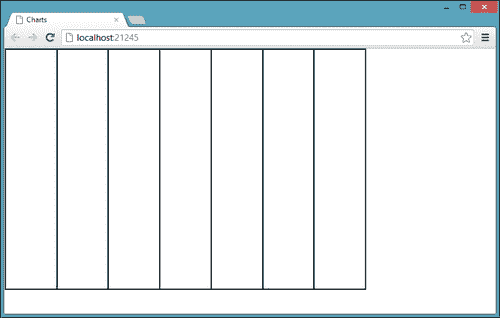
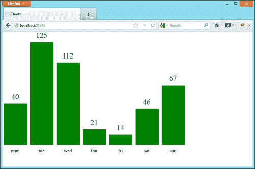
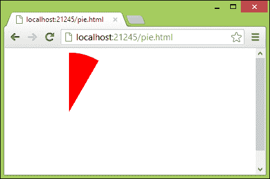

# 十、CSS 图表

只需一个简单的谷歌搜索，我们就会发现周围有很多令人惊叹的图表库，比如**谷歌图表工具**（[https://developers.google.com/chart/](https://developers.google.com/chart/) 、**高图**（[http://www.highcharts.com/](http://www.highcharts.com/) 、及**gRaphael**（[http://g.raphaeljs.com/](http://g.raphaeljs.com/) ），举几个例子。我们可能不知道的是，有一些 CSS 技术允许我们在不使用 JavaScript 库的情况下创建全功能图表。在本章中，我们将探讨其中一些技术，以下是主题：

*   创建条形图
*   实现跨浏览器、灵活的方框布局
*   处理和显示`data-*`属性
*   实现高级渐变
*   添加更多图表系列
*   为图表设置动画
*   创建饼图

# 创建条形图

要创建条形图，我们需要设置一个`div`元素数组，所有元素都与底部对齐，然后控制它们的高度属性。然后，我们需要找到一种聪明的方法来显示每个条的标签，还可以选择显示每个条的值。

要创建`div`数组，我们只需使用一个`div`容器，其中`position:relative`包含一个`div`元素，用于绝对定位`bottom:0`的每个条。这种技术的问题是我们必须定义 CSS 中每个条的大小。我们还需要提前知道我们正在设置样式的图表的条数，这会降低 CSS 对不同图表的适应性，或者对我们正在设置样式的图表进行动态修改。

为了解决这个问题，我们需要找到一个 CSS 结构，它可以在子元素之间均匀地细分容器的空间。在过去的章节中，我们已经使用了灵活的方框布局显示模式，但是，我们通常在水平和垂直方向上使用它来居中元素。要解决我们的条形图定位问题，需要灵活的方框布局被证明是无价的。

让我们定义一个具有结构的`index.html`文件来开发我们的项目，如下所示：

```html
<!doctype html>
<html>
<head>
<meta charset="utf-8">
  <title>Charts</title>
  <link rel="stylesheet" type="text/css" href="css/application.css">
</head>
<body>
    <div data-bar-chart class="this_bar_chart">
        <div data-bar data-label="mon">
            <div class="value series1" data-value-percentage="40" data-value-label="40"></div>
        </div>
        <div data-bar data-label="tue">
            <div class="value series1" data-value-percentage="100" data-value-label="125"></div>
        </div>
        <div data-bar data-label="wed">
            <div class="value series1" data-value-percentage="80" data-value-label="112"></div>
        </div>
        <div data-bar data-label="thu">
            <div class="value series1" data-value-percentage="15" data-value-label="21"></div>
        </div>
        <div data-bar data-label="fri">
            <div class="value series1" data-value-percentage="10" data-value-label="14"></div>
        </div>
        <div data-bar data-label="sat">
            <div class="value series1" data-value-percentage="35" data-value-label="46"></div>
        </div>
        <div data-bar data-label="sun">
            <div class="value series1" data-value-percentage="58" data-value-label="67"></div>
        </div>
    </div>
</body>
```

在这里，我们可以识别这种结构的三个不同组成部分。首先是具有`data-bar-chart`属性的`div`元素；这是整个图表的容器；它还拥有所有的酒吧。然后，我们有具有`data-bar`属性的`div`元素；它们都在容器中保留了真实条形图所需的空间，并在`data-label`属性中保留了相应的条形标签。

最后，带有`.``value`类的`div`元素表示图表的实际条形图；条的高度用`data-value-percentage`属性表示，范围从`0%`到`100%`。我们决定使用规范化值，因为这使我们的图表 CSS 实现更加通用，而不是固定在这个特定实例上。为了表示每个条的实际值，我们定义了另一个属性`data-value-label`。

在开始之前，我们需要像往常一样设置我们的开发环境，所以我们需要在项目的根文件夹中创建一些文件夹，即`css`、`img`、`js`和`scss`。我们将在这个项目中使用 Sass 和 Compass，所以我们需要首先安装 Ruby（[来安装它们（如果还没有安装）http://www.ruby-lang.org/en/downloads/ 然后从命令行终端执行`gem install compass`（或`sudo gem install compass`。](http://www.ruby-lang.org/en/downloads/)

最后，我们需要在项目的根文件夹中创建一个`config.rb`文件，这可以通过从上一个项目复制相同的文件来完成。

当一切都设置好后，我们可以在`scss`文件夹下创建一个`application.scss`文件，其中只包含以下行：

```html
@import "compass/reset";
```

然后，我们可以从命令行终端输入`compass watch .`并验证是否存在相应的`css/application.css`文件。

# 细分空间

因为我们不想开发一个只适用于此特定 HTML 代码的 CSS 条形图实现，所以我们必须区分与此图表相关的属性和更通用、更可重用的属性。因此，主元素有一个名为`this_bar_chart`的类。我们可以专门为这个图表使用这个类，例如，为这个图表定义`width`和`height`，因此我们可以在`application.scss`中写以下内容：

```html
.this_bar_chart{
    width: 600px;
    height: 400px;
}
```

好的我们现在需要实现灵活的长方体布局，在所有的`data-bar`元素之间用`data-bar-chart`属性平均地细分元素的空间。

一个小问题是，目前存在两种不同的 flexbox 语法（正如我们在[第 9 章](09.html "Chapter 9. Creating an Intro")中看到的，*创建了一个简介*），并且对这两种语法的浏览器支持不完整。为了解决这一复杂问题，我们将同时实施这两种方法。我们需要将容器的`display`属性设置为`box`（旧语法）或`flex`（新语法），然后为每个`data-bar`元素设置一个属性`box-flex: 1`（旧语法）或`flex: 1`（新语法）。

通过指定每个`data-bar`元素具有相同的 flex增长因子，所有这些元素将同步以相同的速度填充容器空间，从而使每个元素具有相同的宽度。

以下是要添加到`application.scss`的代码：

```html
*[data-bar-chart]{
    display: -moz-box;
    display: -webkit-box;
    display: box;

    display: -moz-flex;
    display: -webkit-flex;
    display: -ms-flexbox;
    display: flex;

    /* temporary property only for this step */
    border: 1px solid black;    

    *[data-bar]{
        -webkit-box-flex: 1;
        -moz-box-flex: 1;
        box-flex: 1;

        -moz-flex: 1;
        -webkit-flex: 1;
        -ms-flex: 1;
        flex: 1;

        /* temporary property only for this step */
        border: 1px solid black;    
    }
}
```

如果我们在浏览器（Chrome、Firefox、InternetExplorer10）中尝试我们的项目，我们会注意到容器空间是如何在所有子级之间平均细分的，无论数字是多少：



## 添加 Internet Explorer 8 和 9 支持

版本 10 之前的 Internet Explorer 版本不支持任何形式的 flexbox。我们可以通过使用名为 flexie.js（[的 polyfill 库（我们已经在](http://flexiejs.com/)[第 4 章](04.html "Chapter 4. Zooming User Interface")、*缩放用户界面*中介绍了该库）轻松找到解决此问题的方法 http://flexiejs.com/ 。

为了增加灵活性，我们需要首先下载 jQuery（[http://jquery.com/](http://jquery.com/) ，然后选择 IVZR（[http://selectivizr.com/](http://selectivizr.com/) ），并最终自我调整。这三个文件都必须放在`js`文件夹中。

最后，我们可以将这三个文件放在条件注释中，确保只有 Internet Explorer 8 和 9 需要执行这些附加 HTTP 请求：

```html
    <!--[if (gte IE 8)&(lte IE 9)]>
        <script src="js/jquery-1.8.2.min.js"></script>
        <script src="js/selectivizr-min.js"></script>
        <script src="js/flexie.js"></script>
    <![endif]-->
```

# 创建条形标签

好的现在，我们可以删除临时边框属性并继续下一步，创建条形标签。

目前，我们的条形标签作为`data-label`属性的值包含在`data-bar`元素中，因此我们必须结合`content`属性使用`:after`或`:before`伪选择器才能打印它们。

我们还需要为这些标签保留一些空间，因为在时刻，所有容器的高度都被要创建的图表条所占据。

我们可以通过向容器中添加`padding-bottom`（以及`box-sizing`属性以保持原始容器高度，如有支持），然后使用绝对定位将条形标签放置在每个`data-bar`元素的外部和下方来实现这一点。

下面是一小段 CSS 代码，我们可以实现这一行为：

```html
@import "compass/css3/box-sizing";

*[data-bar-chart]{
    padding-bottom: 30px;
    @include box-sizing(border-box);

    /* temporary property only for this step */
    border: 1px solid red;

    *[data-bar]{
        position: relative;

        /* temporary property only for this step */
        background: green;

        &:before{
            display: block;
            content: attr(data-label);
            position: absolute;
 top: 100%;
            left: 0;
            width: 100%;
            text-align: center;
            padding-top: 10px;
        }
    }
}
```

我们使用`top:100%`属性将`:before`选择器的内容移动到包含元素之外，而不指定精确的高度值，通过这样做，我们尽可能保持 CSS 图表说明的通用性。

现在，在浏览器中重新加载项目时，将显示正确放置在容器底部、填充空间内的标签：


在继续之前，我们需要记住删除在此步骤中定义的临时属性。

# 钢筋设计

每个条包含一个`.value`元素，该元素需要设置样式以响应以下特征：

*   其高度必须符合其`data-value-percentage`值
*   它必须在其父`data-bar`元素的底部对齐
*   它必须在某处显示其`data-value-label`值的值
*   它自身和下一个图表栏之间必须有某种余量

让我们从最后两点开始。首先，我们可以使用绝对定位将`.value`元素放置在其父元素的底部，并与其父元素的左右边界保持选定的距离。

以下是所需的 CSS：

```html
.value{    
    position: absolute;
    bottom: 0;
    left: 6%;
    right: 6%;
}
```

通过从`0`循环到`100`并打印 CSS 规则，根据当前循环索引设置`height`属性，可以实现所需的条高行为，如下所示：

```html
@for $i from 0 through 100{
    *[data-value-percentage='#{$i}']{ height: 0% + $i; }
}
```

最后，我们可以使用我们在图表标签上实现的相同技巧来打印每个条形图值，只是这一次，我们需要将文本刚好放在每个彩色条形图上。我们还必须记住，与标签一样，我们需要为该文本节省一些空间，以防该条的`height`属性设置为`100%`；因此，我们需要向容器添加一个顶部填充（使用`padding-top`属性），如下所示：

```html
*[data-bar-chart]{
    padding-top: 35px;

    .value:after{
        content: attr(data-value-label);
        position: absolute;
        font-size: 25px;
        display: block;
        bottom: 100%;
        padding-bottom: 10px;
        left: 0;
        width: 100%;
        text-align: center;
    }
}
```

在展示项目之前，我们需要为图表栏提供至少一种颜色，这是另一个临时属性，因为我们将在本章后面介绍图表系列时替换它。

```html
.value{
    /* temporary property only for this step */
    background: green;
}
```

在我们最喜欢的浏览器中重新加载后，我们的项目如下所示：



# 美化图表

现在是时候删除临时属性并稍微美化图表了。

我们有很多方法可以进一步美化我们迄今为止所做的事情，让它看起来更好。首先，我们可以为标签和条值使用自定义字体；接下来，我们可以添加圆角和阴影。最后，我们可以使用渐变。

在渐变主题上，我们可以实现一种类似于[第 2 章](02.html "Chapter 2. Shiny Buttons")*闪亮按钮*中使用的技术，其中我们使用渐变处理高光和阴影，将`background-color`属性设置为条的颜色。

接下来，我们将选择一种自定义字体，设置一些插入阴影，指定一个`border-radius`属性，然后定义一个从透明变为纯色的渐变；以下是所需的 CSS：

```html
@import url(http://fonts.googleapis.com/css?family=Chivo);
@import "compass/css3/images";

.value:after, *[data-bar]:before{
    font-family: 'Chivo', sans-serif;
}

.value{
    background-image: -ms-linear-gradient(bottom, transparent, rgba(0,0,0,0.3));
    @include background-image(linear-gradient(bottom, transparent, rgba(0,0,0,0.3)));
    border-top-left-radius: 5px;
    border-top-right-radius: 5px;
    box-shadow: 1px 1px 0px rgb(255,255,255) inset;
    border: 1px solid rgba(0,0,0,0.5);
    @include box-sizing(border-box);
}
```

我们必须明确指定`-ms-linear-gradient`，因为 Compass 不处理此类属性的`-ms-`实验前缀。Compass 的这种行为事实上是正确的，因为微软表示，大多数最新的 CSS3 属性在新的 Internet Explorer（[上）上都可以正常工作 http://blogs.msdn.com/b/ie/archive/2012/06/06/moving-the-stable-web-forward-in-ie10-release-preview.aspx](http://blogs.msdn.com/b/ie/archive/2012/06/06/moving-the-stable-web-forward-in-ie10-release-preview.aspx) ），但在撰写本文时，当前版本的 Internet Explorer 10 仍然需要`-ms-`前缀。

现在，我们可以通过简单地向`.value`元素添加一个临时`background-color`属性来测试该项目，如下所示：

```html
.value{
    /* temporary property only for this step */
    background-color: green;
}
```

结果如下：


如果浏览器不支持我们用来美化项目的属性，结果可能会有所不同。但是，由于`background-color`属性设置为主色，因此图表中的关键信息仍然可用。

## 海图线

我们还可以使用背景属性绘制水平线，这些水平线通常会标记条形图的背景，并将其划分为多个步骤，每个步骤代表总高度的 20%。

为了继续，我们需要创建一个几乎透明的线性渐变，除了它的第一个像素，然后我们必须将这个背景的大小设置为 20%，并重复它；以下是所需的 CSS：

```html
*[data-bar]{
    background-image: -ms-linear-gradient(top, rgb(99,99,99), rgb(99,99,99) 1px, transparent 1px, transparent);
    @include background-image(linear-gradient(top, rgb(99,99,99), rgb(99,99,99) 1px, transparent 1px, transparent));
    background-size: 100% 25%;
    background-repeat: repeat-y;
}
```

结果如下：


这并不完全是我们所期望的；最后一行略高于条的底部。这可能是因为当容器大小不是我们希望背景适合的次数的完美倍数时，浏览器发现很难对齐重复渐变。

我们可以尝试一种不同的方法，使用一个梯度来描述五个小的灰色带；以下是取代前一个 CSS 代码的 CSS 代码：

```html
*[data-bar]{
    background-image: -ms-linear-gradient(top, rgb(150,150,150), rgb(150,150,150) 0.5%, transparent 0.5%, transparent 24.5%, rgb(150,150,150) 24.5%, rgb(150,150,150) 25%, transparent 25%, transparent 49.5%, rgb(150,150,150) 49.5%, rgb(150,150,150) 50%, transparent 50%, transparent 74.5%, rgb(150,150,150) 74.5%, rgb(150,150,150) 75%, transparent 75%, transparent 99.5%, rgb(150,150,150) 99.5%, rgb(150,150,150) 100%);
    @include background-image(linear-gradient(top, rgb(150,150,150), rgb(150,150,150) 0.5%, transparent 0.5%, transparent 24.5%, rgb(150,150,150) 24.5%, rgb(150,150,150) 25%, transparent 25%, transparent 49.5%, rgb(150,150,150) 49.5%, rgb(150,150,150) 50%, transparent 50%, transparent 74.5%, rgb(150,150,150) 74.5%, rgb(150,150,150) 75%, transparent 75%, transparent 99.5%, rgb(150,150,150) 99.5%, rgb(150,150,150) 100%));
}
```

虽然代码看起来不那么优雅，但结果远远好于以前的尝试。


我们目前的解决方案并不完全完美，因为我们被迫使用百分比指定灰色带的大小，当图表的大小增加太多时，这可能会导致较厚的带。综合考虑，这是目前为止最好的解决方案，所以让我们坚持下去。

现在我们可以删除临时 CSS`background-color`属性，并转到下一个图表增强功能，即系列。

# 图表系列

在我们的标记中，所有的`.value`元素都有另一个类`.series1`；这是因为我们希望图表支持多个系列，所以让我们在标记中添加一组新的元素：

```html
<input type="checkbox" class="series1" checked id="series1"> <label for="series1">show serie 1</label>
<input type="checkbox" class="series2" checked id="series2"> <label for="series2">show serie 2</label><br/>
<div data-bar-chart class="this_bar_chart">
    <div data-bar data-label="mon">
        <div class="value series1" data-value-percentage="40" data-value-label="40"></div>
 <div class="value series2" data-value-percentage="60" data-value-label="60"></div>
    </div>
    <div data-bar data-label="tue">
        <div class="value series1" data-value-percentage="100" data-value-label="125"></div>
 <div class="value series2" data-value-percentage="30" data-value-label="20"></div>
    </div>
    <div data-bar data-label="wed">
        <div class="value series1" data-value-percentage="80" data-value-label="112"></div>
 <div class="value series2" data-value-percentage="70" data-value-label="80"></div>
    </div>
    <div data-bar data-label="thu">
        <div class="value series1" data-value-percentage="15" data-value-label="21"></div>
 <div class="value series2" data-value-percentage="50" data-value-label="60"></div>
    </div>
    <div data-bar data-label="fri">
        <div class="value series1" data-value-percentage="10" data-value-label="14"></div>
 <div class="value series2" data-value-percentage="90" data-value-label="100"></div>
    </div>
    <div data-bar data-label="sat">
        <div class="value series1" data-value-percentage="35" data-value-label="46"></div>
 <div class="value series2" data-value-percentage="20" data-value-label="25"></div>
    </div>
    <div data-bar data-label="sun">
        <div class="value series1" data-value-percentage="58" data-value-label="67"></div>
 <div class="value series2" data-value-percentage="10" data-value-label="12"></div>
    </div>
</div>
```

我们可以假设每个图表系列都带有一个复选框和一组元素，所有元素都具有相同的`.seriesx`类，其中`x`是介于`1`和`4`之间的数字（我们不支持每个图表超过 4 个系列）。

基于此假设，我们可以在`1`和`4`之间建立一个 Sass`@for`循环，以完成以下任务：

*   为该系列设置`background-color`
*   如果未选中相应的复选框，则隐藏序列

为了动态地为每个系列创建不同的颜色，我们可以依赖**hsl**坐标系（**色调饱和度亮度**，因为只需改变色调分量，我们就可以获得保持相同饱和度和亮度的颜色，从而产生更令人愉悦的构图。

为了隐藏该系列，我们必须创建一个相当复杂的CSS 规则，基本上说，如果选中了类为`series1`-的复选框，则获取具有相同系列类（`series1`在本例中）的`data-bar-chart`系列中的所有元素，并将其`opacity`属性设置为`1`。

以下是相应的 CSS：

```html
.value{
    opacity: 0;
}

@for $i from 1 through 4{
    input:checked.series#{$i}[type='checkbox'] ~ *[data-bar-chart] .series#{$i}{
        opacity: 1;
    }
    *[data-bar-chart] .series#{$i}{
        background-color: hsl(0deg + 10 * $i, 50%, 50%);
    }
}
```

结果如下：


## 添加一些动画

我们已经使用`opacity`来隐藏系列，以响应复选框取消选中，以便我们可以添加`transition`指令并淡入淡出系列：

```html
@import "compass/css3/transition";

.value{
    @include transition(opacity 0.4s);        
}
```

## Internet Explorer 8 和 9

令人惊讶的是，即使是 InternetExplorer8 也理解并应用了我们以前定义的复杂规则。这一成就归功于 Selectivzr，这是我们随 flexie 提供的一个库，它能够支持一些从 IE6 到 IE8 的 CSS3 选择器。唯一的问题是这些浏览器不支持`opacity`属性，所以我们必须检测到这一点，然后切换回支持更好的`display:none`属性。

我们可以使用定制的 Modernizer 构建来完成这项任务，所以让我们从官方网站（[下载它 http://modernizr.com/download](http://modernizr.com/download) 注意从**CSS3**列中选择**不透明度**复选框。

接下来，将文件重命名为`modernizr.js`后，我们可以将其包含在 HTML 文件中，如下所示：

```html
<script src="js/modernizr.js"></script>
```

最后，如果`html`元素上存在类`no-opacity`，我们需要在序列的循环中添加另一个使用`display:none`而不是`opacity: 0`的规则。

这是新的循环，包括`.no-opacity`选择器：

```html
.value{
    opacity: 0;
}

@for $i from 1 through 4{
    input[type='checkbox'].series#{$i}:not(:checked) ~ *[data-bar-chart] .series#{$i}{
        opacity: 1;
    }

 .no-opacity input[type='checkbox'].series#{$i}:not(:checked) ~ *[data-bar-chart] .series#{$i}{
 display:none;
 }

    *[data-bar-chart] .series#{$i}{
        background-color: hsl(0deg + 10 * $i, 50%, 50%);
    }
}
```

# 旋转图表

通过利用 CSS`transform`属性，我们可以轻松地将此图表从垂直条形图转换为水平条形图。然而，这个过程不能像我们对条形图和系列图那样进行一般定义，因为它与图表大小密切相关；因此，我们将使用`.this_bar_chart`选择器。

为此，我们将更改图表的`width`和`height`属性（我们将它们都设置为`500px`以更好地处理子顺序旋转），将整个图表旋转`90`度，然后向后旋转文本元素以保持可读性。

以下是 CSS：

```html
@import "compass/css3/transform";

.this_bar_chart{
    @include transform(rotate(90deg) translate(10px,-10px));
    width: 500px;
    height: 500px;

    *[data-bar]{

        &:before{
            @include transform(rotate(-90deg) translate(-7px,0px));
        }

        .value:after{
            @include transform(rotate(-90deg) translate( 5px ,0px));
        }    
    }
}
```

这就是结果：


当然，在不支持 CSS`transform`属性的浏览器中，最后的实现既不起作用，也不容易获得。

# 仅使用 CSS 和 HTML 创建饼图

在本章的最后，我想向大家介绍一种非常聪明的技术，我从 Patrick Denny（Atomic Noggin Enterprise 的 Noggin 负责人）那里学到了这种技术，它只使用 HTML 和 CSS 创建饼图。

该技术的核心在于如何获得所需大小的图表切片；这是使用如下 HTML 结构上的`clip`和`border-radius`属性实现的（我们可以创建一个新的`pie.html`文件）：

```html
<div class="hold">
<div class="slice slice1"></div>
</div>
```

首先，我们使用`.slice`选择器和`border-radius`属性创建一个圆；我们把圆圈切成两半。

```html
.slice{
  position: absolute;
  width: 200px;
  height: 200px;
  clip: rect(0px,100px,200px,0px);
  border-radius: 100px;
}
```

然后，我们使用`clip`属性切断圆的另一半，如下所示：

```html
.hold {
  position: absolute;
  width: 200px;
  height: 200px;
  clip: rect(0px,200px,200px,100px);
}
```

现在，使用`.hold`上的`clip`属性，我们将`width`和`height`属性设置为`200px`来切断圆的另一半。最后一步很简单，我们可以通过旋转`.slice`相应的角度来显示选定大小的饼片：

```html
.slice1{
  -moz-transform: rotate(30deg);
  -webkit-transform: rotate(30deg);
  -o-transform: rotate(30deg);
  transform: rotate(30deg);
  background-color: red;
}
```

结果如下：



通过将其中一些 HTML 结构一个堆叠在另一个的之上，可以获得一个功能完整、纯 CSS 饼图。

更详细的程序见Patrick 的博客[http://atomicnoggin.ca/blog/2010/02/20/pure-css3-pie-charts/.](http://atomicnoggin.ca/blog/2010/02/20/pure-css3-pie-charts/.) 。

# 总结

在本章中，我们使用了本书前面介绍的资源和技术来构建一个相当复杂的可视化图形。本项目展示了如何使用 CSS 开发组件，否则这些组件将需要 JavaScript 或其他技术，如 Flash 或 Silverlight。