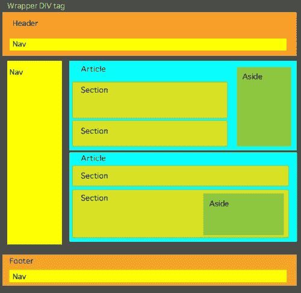
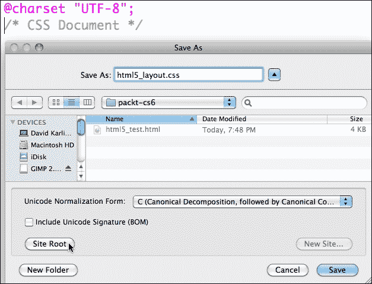
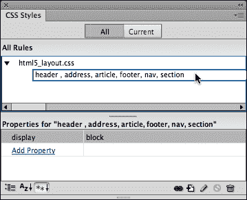

# 第二章。使用 HTML5 进行页面结构

在本书的第一章中，我们看到了在 Dreamweaver CS6 中工作的基本和基础技术的压缩概述:在已定义的 Dreamweaver 站点中工作、构建 HTML5 页面、链接 CSS 样式表文件以及将页面内容约束在`<div>`容器标签中。

在本章中，我们将学习在 Dreamweaver 中使用 HTML5 容器标记构建网页。我们将通过学习做到以下四点:

*   完全依赖 HTML5 布局构建页面布局将磨练我们使用这些新工具进行页面设计的技能，并在 Dreamweaver 中引入 HTML5 代码提示
*   依靠*标准化的*和*定义的* HTML5 布局元素(相对于自定义的、不规则实现的`div`标签)简化了页面设计
*   在现实世界中，构建完全依赖 HTML5 布局元素的页面是设计页面的最佳方式(例如，在为 iPhones 或 iPads 设计页面时)
*   在 HTML5 布局元素中组织页面内容的功能优势超出了设计考虑。我们将在构建 HTML5 页面时检查这些优势

在仅使用 HTML5 布局元素构建页面的过程中，我们将探索依赖前面列出的 HTML5 的所有四个优势。

在这里，回顾或至少加强以下两个在 Dreamweaver 中构建任何专业质量网站的基本技巧是很重要的:

1.  没有首先定义一个 Dreamweaver 站点，什么也不要做。如果您当前不在已定义的站点内工作，请查看[第 1 章](01.html "Chapter 1. Creating Sites and Pages with Dreamweaver CS6")、*使用 Dreamweaver CS6* 创建站点和页面。
2.  其次，虽然不太重要，但仍然非常基础:我们总是使用*外部*样式表。这使得我们定义的样式可以在整个网站上全局应用，并使更新网站成为可能。当我们开始在 CSS 样式面板中协调样式并使用 HTML5 元素构建页面时，我将提醒您，并且在必要时，指导您完成确保所有样式都保存到外部样式表所需的步骤。

以此作为一个预览和警示，让我们开始创建带有 HTML5 布局元素的页面。

# 用 HTML5 构建页面

HTML5 引入了一种新的方法，并为组织页面内容开辟了新的直观技术。在 HTML 出现之前，我们有分配标题级别(`H1` … `H6`)的标签、段落标签、列表标签和其他主要定义内容显示方式的元素。

当谈到将内容组织到容器或盒子中时，我们只能靠自己的设备。因此，开发人员创建了他们自己的标识和类样式集——每个 HTML 文件使用一次的标识样式(像包装样式)，以及在页面上使用多次的类样式(像定义图片/标题框的样式)。

HTML5 将用于组织页面内容的元素标准化。HTML5 的主要结构元素如下:

*   `<header>`
*   `<nav>`
*   `<article>`
*   `<section>`
*   `<aside>`
*   `<footer>`

这些元素的名称几乎是不言自明的。`<header>`元素定义页面顶部的页眉内容，`<footer>`元素定义页脚内容。`<nav>`元素定义导航内容。`<article>`标签定义了页面中不同的文章或连贯的内容块，更大或更长的文章可以细分为几个部分。`<aside>`元素定义了应该嵌入到`<article>`或`<section>`元素中的侧边栏内容。

还有其他 HTML5 元素定义了日期、时间和地址等内容。

用 HTML5 元素构造页面被称为*语义标记*，因为这些标记元素实际上描述了标签中的内容类型。使用 HTML5 语义标记可以完成两件事:

*   对于开发人员来说，HTML5 元素消除了创建一整套单独定义的`<div>`标签样式的需要。
*   对于用户来说，HTML5 元素的优势本质上归结为搜索引擎优化。通过清楚地描述内容是什么(标题、日期、导航栏、文章等)，HTML5 元素帮助搜索引擎识别您的内容并使其可访问。

## HTML5 结构元素

让我们继续探索在 Dreamweaver CS6 中用 HTML5 构建页面。现在，我们将介绍构建一个相当复杂的 HTML5 页面所涉及的步骤。

第一步是提醒浏览器我们正在呈现 HTML5 内容，为此，我们需要在 HTML5 代码的顶部指出这是一个 HTML5 页面。至于那些回应“嗯，那是什么？”—我将在本章末尾解释如何解决这一挑战。但是首先，使用以下步骤从头开始创建一个新的 HTML5 页面:

1.  定义好您的 Dreamweaver 站点后，选择**文件** | **新建**。在**新文档**对话框中，从对话框左侧的类别列表中选择**空白页**。在**页面类型**栏选择 **HTML** 。在**布局**栏中选择 **<无>** 。
2.  弹出的**布局 CSS** 设置为**新建文件**。请记住，我们将把样式保存到外部样式表中。如果您已经有了一个用于 HTML 布局的 CSS 文件，您可以选择**链接到退出文件**来代替，并选择您现有的 HTML5 相关的 CSS 文件作为页面的样式文件。
3.  From the **DocType** pop up, choose **HTML 5** if that is not already selected, as shown in the following screenshot:

    

    上面的截图显示了在**新文档**对话框中生成的一个新的 HTML5 页面。

4.  点击**创建**生成空白页。

在**文档**窗口的**设计**视图中出现一个空白页。在**拆分**视图中，我们可以看到已经生成了以下基本代码:

```html
<!doctype html>
<html>
<head>
<meta charset="UTF-8">
<title>Untitled Document</title>
</head>
<body>
</body>
</html>
```

## 分解 HTML5 页面代码

让我们快速浏览一下这个基本代码来定位我们自己。

`<!DOCTYPE HTML>`和`<html>`标签是 HTML 早期版本的进化延续，实际上并不是 HTML5 浏览器所需要的。在考虑非 HTML5 浏览器时，这段代码可能会很有用，我们将很快对此进行研究。顺便说一下，HTML5 的`<!DOCTYPE>`声明不区分大小写。

这是 HTML5 声明的另一个有趣的地方。通过告诉浏览器我们正在用 HTML5 构建我们的内容，我们也在告诉旧的浏览器在执行规则时不要太严格，比如用`</p>`结束每个段落元素。因此，我们避免了恼人的和不必要的浏览器错误消息。

回到我们生成的代码:

`<head>`和`</head>`标签划分了没有显示在页面上的标题内容，但作为浏览器的说明。

在这种情况下，`<head>`元素内的内容标识当前最广泛适用的字符集 **UTF-8** 已实现。这个字符集允许显示各种语言的字符。

我们为页面创建的所有内容都将放在`<body>`和`</body>`标签中。因此，我们为这个页面创建 CSS 样式的第一步，将是为`</body>`标签定义几个基本属性。

最后，将此页面保存为一个 HTML 文件。选择**文件** | **保存**。在**另存为**对话框中，确保在弹出的**中选择的文件夹是您的 Dreamweaver 站点文件夹(或其中的子文件夹)。给文件命名，如`html5_test`，点击**保存**。**

 **

前面的截图展示了如何保存一个 HTML5 页面。

此时，在**文档**工具栏的**标题**框中输入一个描述性标题。定期重新保存。


前面的截图显示了如何定义页面标题。

# 使用 HTML5 结构元素

已经用基本的网页编码建立了我们的 HTML5 文档，我们现在准备创建和格式化 HTML5 布局元素，这些元素将定义页面的外观。

下面的截图展示了一个基本的 HTML5 页面布局。它展示了页面的某种层次结构。所有内容都被限制在一个传统的包装器`div`标签中。其中，页面有一个页眉、一个页脚和`article`元素。`section`元素存在于`article`元素中。

还要注意的是`nav`元素(保存导航内容)既可以在另一个元素(如页眉或页脚)内部使用，也可以在任何 HTML5 语义布局元素外部使用。注意，`aside`元素可以用在`article`或`section`元素中。



前面的截图显示了一个 HTML5 页面布局。

# 使用代码提示

我不会拐弯抹角，Dreamweaver CS6 几乎避免了对 HTML5 页面结构的任何所见即所得的支持。在游戏的这个阶段，我们大多数人无论如何都会使用 Dreamweaver 的 **Split** 视图，而 Dreamweaver 的 **Code** 视图(在 **Split** 视图中作为半个屏幕提供)对于创建 HTML5 页面结构有着有益的代码提示。当您开始在**代码**视图中键入 HTML5 元素时，从`<`开始，Dreamweaver 会提示您一组以您键入的字母开头的标签。因此，例如，输入`<he`会产生代码提示，您可以点击 **< >标题**并按下*回车*键(窗口)或*回车*键(Mac)来放置代码。

Dreamweaver 为 HTML5 语义布局元素提供代码提示，如下图所示:


要关闭 HTML5 布局元素的(定义结束)，只需键入`</`。当您这样做时，Dreamweaver 会自动输入打开元素的结束代码。

当我们在本章的剩余部分中完成定义不同 HTML5 布局元素所涉及的编码时，您可以在**分割**视图中输入必要的代码，利用代码提示，并在**分割**视图的**设计**视图中查看结果。

# 添加标题、导航和分组

`<header>`元素用于组织页面顶部的所有内容。在`<header>`元素中，您可能会包含`<nav>`内容，如下面的截图所示。

而且，您可能会包括标准的(传统的)HTML 标签，如标题和链接。

所以`<nav>`内容——页面顶部的链接——当它们被放在页面顶部时，就包含在`<header>`元素中。放置在边栏中的导航元素也包含在`<nav>`元素中，但是因为在这种情况下它们不是标题的一部分，所以它们不包含在`<header>`元素中。

在`<header>`元素中，与标签(`<h1>`、`<h2>`等)或类`<div>`标签相关联的 CSS 样式可用于为内容的显示方式提供附加的格式规则。

为了使标题中的内容更容易分类，HTML5 包含了`<hgroup>`元素。`<hgroup>`内容的正式要求是至少包含一个标题标签(`<h1>`、`<h2>`、`<h3>`、`<h4>`、`<h5>`或`<h6>`)。

其概念是标题的内容，如副标题、替代标题或标语都应该分组在一个标题中，以便于访问。因此，例如，在下一个截图中，两个标题行已经被包装在一个`<hgroup>`元素中。但是导航内容虽然是标题的一部分，却不包含在`<hgroup>`元素中。

在下面的代码中，一个`<h1>`标题和一个`<h2>`标题，以及一个带有自己的`<h5>`标题的`<nav>`元素(和三个占位符链接)，都是一个`<header>`元素的一部分:

```html
<header>
<hgroup>
<h1>Page header</h1>
<h2>Header 2 </h2>
</hgroup>
<nav><h5>Navigate: <a href="#">link 1</a> | <a href="#">link 2</a> | <a href="#">link 3</a></h5>
</nav>
</header>
```

以下截图说明了这在 Dreamweaver 中的**分割**视图中的外观(在**分割**视图的**设计**视图侧打开了**直播**视图)。


# 创建文章和章节

如果你以写作为生，就像我一样，你学会了把内容组织成块和子块，概念和子概念，想法和更详细的想法，等等。以这种方式组织内容的基本规则是，如果创建一个子部分，必须创建两个子部分。否则，只创建一个子部分是没有意义的。

与我们在 HTML5 布局中反复出现的内容和设计统一的主题相一致，HTML5 页面中的内容，在它必须被分解的地方，被分解成所谓的**文章**。如果文章中需要不同的小节，这些小节就是**小节**。

当您创建一个 CSS 文件来匹配您的 HTML 布局元素时，您可以为文章和部分分配特定的格式。例如，您可以选择缩进部分内容或在其后面放置一个独特的背景。

上图中`<article>`和`<section>`元素的代码，包括占位符文本和标题如下:

```html
<article>
<h3>First article</h3>
<p>First article content ....</p>
<p>more content....</p>
<section>
<h3>1st section heading</h3>
<p>1st section content</p>
</section>
<section>
<h3>2nd section heading</h3>
<p>2nd section content</p></section>
</article>
```

或者，您可以选择*而不是*将特定的 CSS 规则应用于文章和章节，并简单地将内容包装在`<article>`和`<section>`元素中进行内容组织，同时依赖于`<body>`标签、`<p>`(段落)标签或您在 Dreamweaver 中定义的自定义类样式来格式化文章和章节内容。

# 添加一旁的内容

侧边栏是为侧边栏内容保留的，侧边栏内容依赖于文章或文章部分中的内容。例如，`<aside>`元素不是用来作为导航内容的容器的(导航内容应该由前面讨论的`<nav>`元素来标识和包装)。

假设一旁的内容通常被格式化为侧边栏，那么有一种特定的风格通常与`<aside>`元素的使用相关联:`Float`。CSS `Float`属性将容器移动到其他内容的左侧(`float:left`)或右侧(`float:right`)，并在容器周围流动其他内容。当我们在本章末尾为 HTML5 语义布局元素定义 CSS 样式时，我们一定会浮动我们的`<aside>`元素样式。

# 创建页脚

HTML5 页面布局的最后一部分通常是一个`<footer>`元素。与所有 HTML5 布局元素一样，`<footer>`元素具有内容分配。页脚通常包括网站内容作者信息、法律声明(如版权信息)等。

# 一个 HTML5 布局模板

下面的代码包含了到目前为止讨论的所有 HTML5 语义布局元素。请随意复制并粘贴到 Dreamweaver 的**分割**视图的**代码**端，并使用它来实验和熟悉【HTML5 页面结构。

此外，这段代码将为试验 HTML5 元素的 CSS 样式提供一个良好的基础——这是我们旅程的下一步:

```html
<!doctype html>
<html>
<head>
<meta charset="UTF-8">
<title>HTML5 test</title>
<link href="html5_layout.css" rel="stylesheet" type="text/css">
</head>
<body>
<div id="wrapper">
<header>
<hgroup>
<h1>Page header</h1>
<h2>Header 2 </h2>
</hgroup>
<nav>
<h5>Navigate: <a href="#">link 1</a> | <a href="#">link 2</a> | <a href="#">link 3</a></h5>
</nav>
</header>
<article>
<h3>First article</h3>
<p>First article content ....</p>
<p>more content....</p>
<section>
<h3>1st section heading</h3>
<aside>
<p>Sidebar content</p>
<figure>
<p></p>
<figcaption>Caption </figcaption>
</figure>
</aside>
<p>1st section content</p>
</section>
<section>
<h3>2nd section heading</h3>
<p>2nd section content</p>
</section>
<h3>Second article</h3>
<p>Second article content ....</p>
<p>more content....</p>
<section>
<h3>1st section heading</h3>
<p>1st section content</p>
</section>
<section>
<h3>2nd section heading</h3>
<p>2nd section content</p>
</section>
</article>
<footer>
<h5>Footer content </h5>
<address>Contact us at <a href="http://www.website.us" target="_blank">www.website.us</a>
</address>
</footer>
</div>
</body>
</html>
```

这个代码示例包括一个我们还没有探索过的元数据元素——一个`<figure>`元素。我想我应该把放入代码中，以保持事情的条理和简单，但是现在让我们继续探索这个和其他 HTML5 元数据元素。

# 添加元数据

正如我们所看到的，我们到目前为止探索的 HTML5 布局元素具有双重功能:它们作为可样式化的元素，可以控制内容的显示方式，并且它们组织内容以实现可访问性。这些 HTML5 元素可以被认为是元数据。

HTML5 布局元素的风格和内容维度都在发展，但它们已经成为设计页面和传递内容的工具。我们之前探讨的能够在 iPhone 上轻松选择文章或文章部分进行复制的例子让我们尝到了这在不久的将来可能会如何发展。

除了到目前为止探索的关键布局元素之外，值得简要注意的是几个 HTML5 元素，它们的主要作用是索引内容(尽管它们也可以用于应用样式)。

## 定义地址

通常，网站访问者首先寻找的是联系信息，如网址(如果该页面不是网站的主页)、电子邮件地址或物理地址(如果他或她想找到最热门的地下俱乐部或最近的高评级烧烤摊)。

如果`<address>`元素为文章的作者(或主题)提供联系信息，则它可以放置在任何其他 HTML5 语义布局元素中，例如`<article>`元素。或者，如果一个`<address>`元素提供整个页面的联系信息，它可以与一个`<footer>`元素相关联(放置在其中)。

## 图形和说明

`<figure>`和`<figcaption>`元素足够直观地识别一个图形和一个关联的标题。同样，将这些元素分配给内容有助于内容聚合器和索引程序(如搜索引擎)解释您的页面内容，并使其更易于访问。而且，你也可以使用这些元素来设计图形和/或标题。

例如，`<figure>`元素可以同时围绕图像和标题(`<figcaption>`)。

## 表示日期和时间

说到用 HTML5 元素 来传达内容，有不同的 HTML5 元素关联着不同种类的时间和日期信息。

`<time>`元素用于标记即将到来的事件的时间和日期。它并不打算定义日期和时间的每个引用。例如，在撰写历史文章时，引用不同历史事件的日期时，不要使用`<time>`元素。

`<time>`元素可用于设定特定时间，如以下 HTML5 代码所示:

```html
The show starts at <time>12:00</time>.
```

或者，日期和时间信息 可以使用`datetime`参数编码在文本中，如下面一行代码所示:

```html
<time datetime="2012-01-01">all night jam session!</time>
```

时间和日期的格式为:`YYYY-MM-DDThh:mm:ssTZD`，其中`TZD`为时区。

您不太可能使用`<time>`元素作为造型工具。相反，它最好用来划分日期和时间。

## 为 HTML5 页面结构创建一个 CSS 文件

设计师与我们的 HTML5 文件一起创建并使用一个 CSS 文件来组织和管理页面中的所有样式。那么，让我们现在就创建这个 CSS 文件，当我们这样做的时候，添加一行代码，使我们的 HTML5 页面兼容所有当前的浏览器和大多数旧的浏览器。

为此，请执行以下步骤:

1.  Navigate to **File** | **New**, and in the **New Document** dialog, choose the **Blank Page** category on the left-hand side, and **CSS** from the **Page Type** category. Click on **Create** to generate and open a new CSS file.

    

    前面的截图显示了新的 CSS 文件的生成。

2.  The file opens in **Code** view. We'll be editing it in the **CSS Styles** panel, so—except as a learning experience—we won't need to view this page again. But we do need to save it. Navigate to **File** | **Save**, and give the file a name such as `html5_layout.css`. Make sure the site folder is selected in the **Where** pop up, and click on **Save**, as shown in the following screenshot:

    

    上面的截图显示了保存一个 CSS 文件。

3.  在文档窗口顶部的标签栏中，切换回您创建的 HTML 文件。
4.  View the **CSS Styles** panel (if it is not visible, navigate to **Window** | **CSS Styles**), and click on the **Attach Style Sheet** icon as shown in the following screenshot:

    

5.  出现**附加外部样式表**对话框。使用**浏览**按钮导航到刚刚创建的 CSS 文件，点击**确定**附加样式表。CSS 文件出现在 **CSS 文件**面板中(使用 **CSS 样式**面板中的 **All** 选项卡作为标准，除非您正在对特定样式进行一些检测工作，这可能需要使用**当前**选项卡)。您还会在**代码**视图中看到 CSS 文件的链接。

## 分配块属性

接下来，我们将添加一个单一属性，使大多数浏览器能够解释 HTML5 元素，即使它们不符合 HTML5。在这里，我们将重温我们在上一章中提到的技术，在该技术中，我们看到了 Dreamweaver CS6 的 HTML5 布局如何使用`display:block` CSS 属性来防止 HTML5 布局在非 HTML5 浏览器中折叠。

为此，请执行以下步骤:

1.  点击 **CSS 样式**面板底部的**新 CSS 规则**图标—它位于上图中确定的**附加样式表**图标的右侧。出现**新 CSS 规则**对话框。
2.  在**新 CSS 规则**对话框中，从第一个弹出窗口中选择**复合**。我们正在创建一个规则，将适用于一个以上的 HTML5 布局元素。这些是 HTML5 标签，我们希望防止在非 HTML5 浏览器中查看时折叠。
3.  在**选择或输入选择器**的名称字段中，输入`header`。我们实际上想将我们正在研究的规则应用于额外的 HTML5 元素，但是我们将很快添加这些元素。在对话框的**规则定义**部分，确保你的附加 CSS 文件被选中(默认情况下)。点击**确定**。
4.  In the **CSS Rule Definition for Header** dialog, select the **Block** category, choose **Block** from the **Display** pop up as shown in the following screenshot, and then click on **OK**:

    

    前面的屏幕截图显示了定义块显示的过程。

5.  当您展开链接到页面的 CSS 样式文件时，`header`样式出现在 **CSS 样式**面板中。您可以看到标题样式的**显示**属性在 **CSS 样式**面板中有一个与之关联的**块**属性。
6.  We want to expand the list of HTML5 elements to which this `display:block` attribute is assigned. The long, slow way to do that is to duplicate steps we've traversed so far for each additional element. To do that the quick and easy way, click once in the header row in the top half of the **CSS Styles** panel, and edit the list of elements to include the `<address>`, `<article>`, `<footer>`, `<nav>`, and `<section>` elements. Use commas (",") to separate the additional elements as you type them in. These are HTML5 tags that we want to prevent from collapsing when viewed in non-HTML5 browsers. The **CSS Styles** panel should now look like the the following screenshot:

    

    前面的截图显示了将块显示分配给多个 HTML5 语义布局标签的过程。

通过前面的一组步骤，我们已经告诉大多数非 HTML5 浏览器将基本的 HTML5 构建块元素保留在它们自己不同的水平行上，这样它们就不会相互混淆。

## 定义样式

在这里，我不会通过在 Dreamweaver CS6 中排练定义链接样式表中的样式的基本技术来让您感到厌烦。我们在[第 1 章](01.html "Chapter 1. Creating Sites and Pages with Dreamweaver CS6")、*用 Dreamweaver CS6* 创建站点和页面中，以压缩的方式浏览了这一部分，为了便于查看，我们在前面的一组步骤中定义了链接的 CSS 文件中的一种(复合)样式。

要快速查看，通过点击 **CSS 样式**面板底部的**新 CSS 规则**图标，新的 CSS 样式定义被添加到链接样式表中。我们将创建的所有样式都是标签类型的样式，应用于 HTML5 语义元素(标签)。

您可以使用 **CSS 样式**面板以这种方式定义以下样式。或者，您可以在我们刚刚创建的复合样式之后，将以下代码输入(或复制)到您的 CSS 样式表中:

```html
@charset "UTF-8";
/* CSS Document */
header , address, article, footer, nav, section{
  display: block;
}
header {

color: #FFF;
  background-color: #CCC;
}
footer {
  color: #000;
  background-color: #FFF;
}
article {
  color: #000;
}
aside {
  float: right;
  width: 200px;
  border: thin solid #FFF;
  background-color: #999;
  padding: 10px;
  margin: 10px;
}
figure {
  background-color: #CCC;
  margin: 10px;
  padding: 10px;
  float: right;
  width: 160px;
  height: 180px;
}
section {
  padding: 0px;
}
```

### 注

关于我们创建的 CSS 的几个注意事项:我们使用非常极简的背景和文本颜色(灰色加上白色和黑色的阴影)来做出极简的美学声明，并保持我们的项目简单。

`<aside>`元素上的`float`属性将旁边的(侧边栏)框与页面的右侧对齐，使其周围的内容流向右侧。额外的填充和边距会在旁边的内容和框的边框之间以及框本身和围绕框流动的内容之间强制间隔。

类似地，分配给`<figure>`元素的`float`和 `margin`属性将包含图像和说明的框与页面的右侧对齐。

将文章部分的`margin`设置为零可以防止内容缩进超过从指定给`<article>`和`<section>`元素的边距继承的缩进量。

# 解决 HTML5 兼容性挑战

在写这本书的时候，HTML5 是一个正在进行的作品。这是什么意思？从历史的角度来看，这意味着 HTML5 的标准仍在系统化，尽管已经达到了一个临界质量，大多数 HTML5 术语的含义和效果得到了广泛认同，浏览器要么支持 HTML5，要么在有限的术语中朝着这个方向发展。

对于开发人员来说，这意味着当我们探索 HTML5 节省时间和压力的功能来构建网页时，我们必须意识到并弥补一些浏览器不支持 HTML5 某些方面的事实。

总的来说，这意味着支持根深蒂固的互联网浏览器社区，尤其是旧版本的 IE，其用户已经被微软抛弃，微软没有为大多数用户提供升级选项。

为了不让这些用户被锁定在 HTML5 页面之外，开发人员采用了 HTML5 Shiv 脚本和设计者对它的链接。JavaScript 允许 IE8 识别 HTML5 语义结构标签。

要将 HTML5 Shiv JavaScript 添加到页面，请在页面的`<head>`元素中插入以下代码:

```html
<!--[if lt IE 9]><script src="http://html5shiv.googlecode.com/svn/trunk/html5.js"></script><![endif]-->
```

# 总结

在本章中，我们探索了在 Dreamweaver 中使用 HTML5 语义布局元素来构建页面。我们看到了这些元素如何既作为设计容器又作为内容标识符。我们还看到，对于某些环境，仅使用几个基本的 HTML 标记加上 HTML 布局元素就可以构建整个页面。

在下一章中，我们将探索 Dreamweaver CS6 用于生成已验证表单的强大工具。**