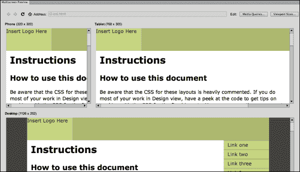
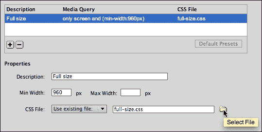
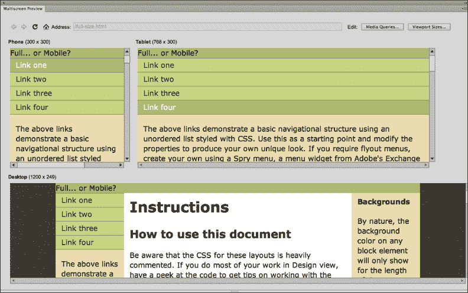
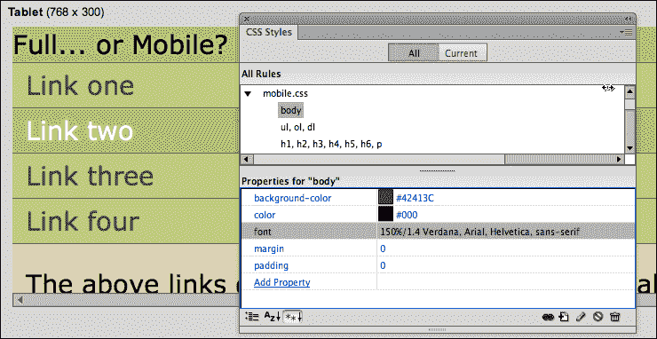
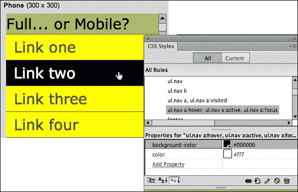

# 六、响应式媒体查询的设计

这是一个多媒体世界。人们通过各种媒体体验网络内容并与之互动，从网站的大屏幕投影到手持设备。这给网页设计师带来了特殊的挑战。

其中一个挑战是设计可访问的、吸引人的、功能多样的页面。内容居中、左右侧边栏、图像周围流动的文本的页面在笔记本电脑上可能很诱人，但在 iPhone 上可能会乱糟糟的。

随着 HTML5 和 CSS3 的出现，可以设计检测查看设备(视口)大小的页面，并呈现为该设备定制的独特页面布局。例如，您可以创建一个页面的三个可选视图——一个用于智能手机，一个用于平板电脑，一个用于全尺寸显示器。该方法被称为**响应设计**。实现它的 CSS3 技术是 **媒体查询**。

在本章中，我们将学习在 Dreamweaver 中使用 Dreamweaver 生成的媒体查询来设计检测媒体视口的页面，并根据访问者的查看环境呈现适当的页面设计。

在此过程中，我们将:

*   使用 Dreamweaver 的多屏预览窗口预览网站在不同视口中的外观
*   为特定设备自定义多屏预览
*   使用 Dreamweaver 的媒体查询为不同尺寸的观看设备创建多种样式

# 多媒体网络世界的网页设计

正如本章导言中所指出的，最近人们与网站互动的媒体种类激增，尤其是智能手机和平板电脑越来越多地定义了浏览体验。此外，如上所述，一个合适的网页设计对于宽屏幕体验来说可能是必要的，但通常是不合适的，过于杂乱的，或者仅仅是在一个小屏幕上的简单功能障碍。

解决方案是媒体查询 CSS3 引入的 CSS 样式表的一个新元素。但是在我们研究 CSS3 中的新媒体特性之前，了解导致 CSS3 Media Queries 发展的基本进化路径会有所帮助。这一背景将有助于我们了解所涉及的概念，因为在当今疯狂的狂野西部浏览环境中(出现了尚未解决的标准冲突)，为最广泛的媒体进行设计需要将新的 CSS3 媒体查询与旧的 CSS 媒体检测工具相结合。在这一章的末尾，我们将看到这在现实生活中是如何进行的，当我们检查创建可以检测到例如苹果 iPhone 的媒体查询的特殊挑战时。

## 媒体查询如何工作

我们来看一个例子。如果你在一个笔记本电脑宽度的浏览器窗口中打开波士顿环球(报纸)网站([http://www.bostonglobe.com/](http://www.bostonglobe.com/))，你会看到一个三栏的页面布局(继续，我会等你检查；或者看看下面的例子)。


三列布局在笔记本电脑中运行良好。但是在较小的视口中，设计会调整为以两列显示内容，如下图所示:


两列布局和三列布局是同一个 HTML 页面。并且两个页面的内容(文字、图片、媒体等)都是一样的。环球公司的工作人员不必为平板电脑或智能手机建立单独的主页。但是一个媒体查询链接了一个不同的显示在较窄视口中的 CSS 文件。

## 媒体查询简史

回溯一点时间，当前(CSS3 之前)版本的 CSS 已经可以检测媒体，并根据媒体启用不同的样式表。此外，Dreamweaver CS6(也是 CS5.5、CS5 和以前的版本)为这些功能提供了非常好的直观支持。

这在 Dreamweaver 中的工作方式是，当您单击 **CSS 样式**面板底部的**附加样式表**图标时(在 Dreamweaver 的**文档**窗口中打开一个网页)，将出现**附加外部样式表**对话框。

对话框中的**媒体**弹出窗口允许您附加一个专门为打印、听觉(由阅读器软件大声读出)、盲文、手持设备和其他“传统”输出选项设计的样式表，以及更新的基于 CSS3 的选项。下面的截图中显示的**手持**选项，在 CSS3 之前可用:


因此，总结一下演进路径，检测媒体并为该媒体提供自定义样式对于 HTML5 及其配套的 CSS3 来说并不陌生，Dreamweaver CS6 中也支持这些功能。Dreamweaver 中提供了检测和同步已定义媒体的样式。

然而，相对较新的是能够为特定的屏幕尺寸检测和提供定义好的样式表。这一新功能为特定媒体的定制页面设计打开了新的台阶。

## HTML5、CSS3 和媒体查询

有了 HTML5 和 CSS3，媒体查询得到了扩展。我们现在可以定义各种标准来选择应用于查看环境的样式表，包括方向(无论手机、平板电脑等是保持在纵向[上下]视图还是横向[横向]视图)、设备是否显示颜色、查看区域的形状、以及最有价值的查看区域的宽度和高度。

所有这些选项都提供了为不同的查看环境创建自定义样式表的多种可能性。事实上，它们打开了一个大得可笑的可能性阵列。但是对于大多数设计师来说，简单地创建三个合适的样式表就足够了，一个用于笔记本电脑/台式机查看，一个用于手机，一个用于平板电脑。

为了定义在环境中显示哪个样式表的标准，HTML5 和 CSS3 允许我们使用`if-then`语句。因此，例如，如果我们为平板电脑分配样式表，我们可能会指定，如果查看区域的宽度大于手机的宽度，但小于笔记本电脑屏幕的宽度，我们希望应用平板电脑样式表。

## 移动设备和平板电脑的造型

虽然对为不同媒体创建风格的美学维度的全面探索超出了我们在本书中的使命的范围，但值得注意的是与移动设备的风格相对应的几个基本“注意事项”。

我会在本章后面的部分带着关于移动造型的更详细的建议回来，但总而言之，挑战在于:简化。一般来说，这意味着对页面应用以下许多或所有调整:

*   较小的边距
*   更大(更易读)的类型
*   背景要简单得多；没有图像背景
*   没有侧边栏或浮动内容(其他内容环绕的内容)
*   通常，没有定义页面宽度的容器

### 注

**在线设计建议**:如果你在网上搜索“移动设备 css”，你会发现成千上万篇关于设计网页的不同视角和建议的文章，手持设备可以轻松访问。

## 媒体查询与 jQueryMobile和应用的对比

在转到使用媒体查询构建具有响应性设计的页面的技术维度之前，让我简单地将媒体查询与全屏和移动设备以不同方式显示内容的另外两个选项进行比较。

一个选项是**应用**。应用(应用的简称)是用高级编程语言创建的成熟的计算机程序。Dreamweaver CS6 包括通过在线 PhoneGap 资源连接和生成应用的新工具。我们在本书的最后一章[第 10 章](10.html "Chapter 10. Building Apps with PhoneGap")、*用 PhoneGap* 构建应用中对这一过程进行了深入探讨。

第二个选项是一个 jQuery Mobile 网站。jQuery 移动网站基于 JavaScript。但是，正如我们将在本书后面看到的，您不需要知道 JavaScript 来构建 jQuery Mobile 站点。jQuery Mobile 站点和设计为移动友好的 Media Query 站点之间的主要区别在于，jQuery Mobile 站点需要不同的内容，而 Media Query 站点只是用不同的样式表重新打包相同的内容。

您应该使用哪种方法，媒体查询还是 JavaScript？这是一种判断。我在这里可以建议的是，媒体查询提供了最简单的方法来创建和维护您的网站的移动版本。

# 多屏预览预览

Dreamweaver 的多屏幕预览提供了网页在三种不同查看环境下的即时(如果不是精确的话)预览。

要在**多屏预览**中查看打开的网页，请转到**查看** | **工具栏** | **文档**，或从**文档**窗口菜单转到**窗口** | **多屏预览**。此时**多屏预览**窗口打开，有三个视图，如下图截图所示:



多屏预览是一种实时视图。您不能在那里编辑内容，您只能在浏览器中预览页面的外观。然而，正如我们将看到的，您可以编辑与每个视图相关联的样式表，并在多屏幕预览中观察效果。

**多屏幕预览**窗口中的三种预设视口大小提供了一组非常广泛适用的屏幕大小，用于预览打开的页面在智能手机、平板电脑和桌面(或屏幕宽度为 1024 像素或更大的全尺寸笔记本电脑)上的外观。宽度设置是预览页面在不同媒体中的外观的一种很好的通用方法。

另一方面，如果您是为特定的观看环境进行设计，则可以自定义这些设置。为此，点击**多屏预览**窗口右上角的**视口尺寸**按钮。打开**视口尺寸**对话框。您可以通过更改**宽度**或**高度**框中的值，并单击**确定**来更改三个可用视图中任何一个视图的宽度(以及高度)。

在**视口尺寸**对话框中最有用的调整可能是**手机**预览的高度。通过将该值放大一点，您可以更好地了解页面在具有更长观看屏幕的智能手机中的外观。在下面的截图中，**手机**预览窗口的高度被更改为 **480** 像素:


当您第一次预览页面时，您很可能不喜欢它在手机和平板电脑预览窗口中的外观。此时，你可以做两件事之一，如下:

*   选择不要担心页面在移动设备中的外观和工作方式，假设这种移动设备只是一时的流行，很快就会消失
*   您可以使用 Dreamweaver 生成媒体查询，以便在移动设备中呈现更具吸引力、更易于访问的内容

假设您选择了后者，让我们继续探索如何为手机和平板电脑显示创建样式表，并在适当的环境中应用这些样式表。

# 在 Dreamweaver CS6 中生成媒体查询

在 Dreamweaver CS6 中，有许多有效的方法和可能的协议可以用来为媒体查询生成样式集。在浏览一个运行良好的之前，让我们来调查一下我们正在努力实现的目标。

### 注

与 Dreamweaver CS5.5 中的工具相比，Dreamweaver 在 CS6 中用于创建媒体查询的工具稍有增强；因此，使用旧版 Dreamweaver 的读者会发现下面我们探讨的一些选项不可用。

本质上，我们需要三套样式表——一套用于手机，一套用于平板电脑，一套用于全尺寸显示器。因为在这一点上，全尺寸显示器仍然是查看网页内容的“标准”，并且因为手机和平板电脑的样式可能没有那么复杂，所以从为全尺寸页面创建样式表开始是有意义的。

换句话说，第一步是创建一个基本的 CSS 样式表，当它在全尺寸的桌面或笔记本显示器上打开时，可以很好地处理页面。然后，可以使用手机和平板电脑上的简化布局来生成该页面的变体。

## 构建替代样式表

如上所述，从风格和可访问性的角度来看，从“全尺寸”网页风格开始，然后构建适用于手机和平板电脑的该风格的排列是有意义的。

使用该工作流还有一个技术原因。请记住，所有三个 CSS 样式表文件都将为同一个页面提供样式规则。这意味着所有三个可选的 CSS 文件都必须为同一组 HTML 元素和标签提供规则。

例如，如果一个`<div>`标签定义了页面上的一个主容器，那么所有三种媒体(电话、平板电脑和桌面)的样式表都必须定义该`<div>`标签应该如何出现。手机 CSS 的规则可能包括更窄的宽度、更简单的背景颜色和其他属性。但是，重点是所有三个样式表都有这个主容器`div`标签的规则。所有布局元素都必须如此，无论是 HTML5 布局元素、`<div>`标签，还是两者的某种组合。

## 准备生成媒体查询

准备生成媒体查询的一个有效协议是准备好三个 CSS 文件分配给不同的媒体。

一个简单的协议如下:

1.  为您的页面创建一个基本的 CSS 文件，适用于台式机或笔记本电脑大小的显示器。如果您正在从 Dreamweaver CS6 的 HTML5 布局生成页面，您可以使用相应布局附带的 CSS 文件作为此“主”布局。
2.  用文件名保存“主”CSS 文件，如`full-size.css`，然后用两个不同的文件名(如`tablet.css`和`smartphone.css`)保存两次，创建三个相同的样式表。或者，如果您只想提供两个选项(并让平板电脑用户看到全尺寸样式)，只需保存两个版本的 CSS 文件— `full-size.css`和`smartphone.css`。
3.  保存备选样式表后，您可以直接在**多屏预览**菜单中自定义它们。

有了三个可供分配和编辑的可选 CSS 文件，您就可以定义媒体查询了。接下来我们将走完这个过程。

## 为不同的媒体分配样式

利用 Dreamweaver 工具构建媒体查询的最佳方式是在多屏幕预览模式下工作。请记住，这意味着我们在调整样式时不会编辑内容。但这种约束是我们绝对可以忍受的，事实上，作为一种通用的方法，调整内容和风格应该被认为是不同的过程。

因此，我们的场景是我们已经为一个打开的网页打开了**多屏预览**。我们已经准备好了三个不同的 CSS 文件——在本章前面的“3 步”协议中讨论的那些。

至少有两个 CSS 文件保存为 Dreamweaver 站点的一部分，并且网页在**多屏预览**中打开，请按照以下步骤为每个视图定义自定义样式:

1.  点击**媒体查询**按钮，打开**媒体查询**对话框。
2.  在**将媒体查询写入**区域，选择**此文档**选项。**全网站媒体查询文件**的选择更为棘手；它涉及 Dreamweaver 更改您所有页面中的代码，因此不太可靠。
3.  Leave the **Force Devices to Report Actual Width** checkbox selected. This overcomes any confusion that can be caused when different devices define "pixels" in ways that distort their actual width. The initial selections in the **Media Queries** dialog should look like the following:

    

4.  Click on the **+** icon to add a stylesheet. The **Properties** area becomes active for that selected stylesheet:
    *   在**描述**字段中，输入描述样式的文本(这是为了您自己的利益，不是为了公开展示)。
    *   在**最小宽度**字段中，输入一个值，该值定义了此样式将在其中显示的最窄视口，只要合适。如果您正在为智能手机定义 CSS 样式，您将没有任何最小宽度，因为无论视口有多小，该样式都将适用。
    *   在**最大宽度**字段中，输入一个值，该值定义了此样式将在其中显示的最窄视口，只要合适。如果您正在为全尺寸浏览器定义 CSS 样式，您将没有任何最大宽度，因为无论视口有多大，该样式都将适用。
    *   使用 **CSS 文件**区域中的**选择文件**图标，导航并选择一个样式表文件，该文件将在符合定义标准的视口中应用，如下图所示:

    

5.  Repeat step 4 to add additional stylesheets to the media query. All the associated styles will be listed as shown in the following screenshot:

    

6.  Click **OK** to close the **Media Queries** dialog, and see your media query applied in the **Multiscreen Preview** window as shown here:

    

7.  在任何时候，您都可以通过从**窗口**菜单中选择**多屏预览**来切换进入或退出**多屏预览**。

# 格式化媒体查询的 CSS 文件

通过为网页定义的媒体查询，我们可以交互式地为每个目标浏览环境创建和调整样式。为此，请重新打开页面的多屏预览。

“等等！”，您可能会惊呼，“当多屏幕预览窗口像文档窗口中的实时视图一样工作时，我如何在多屏幕预览中编辑页面—锁定任何内容编辑？”。一个深思熟虑的问题，但在这里，我们将只编辑 CSS 样式，而不是页面内容。我们可以在**多屏预览**中进行。

要在**多屏预览**中编辑样式，请查看 **CSS 样式**面板(**窗口** | **CSS 样式**)。附加的样式，以及帮助我们记住哪种样式是哪种的括号注释，出现在 **CSS 样式**面板的上半部分。

您可以通过单击 **CSS 样式**面板上半部分样式名称旁边的三角形来展开这些样式。在下面的截图中，`mobile.css`样式被展开。点击样式中的一个样式规则(在本例中，`body`标签样式的`font`参数)会在**CSS 样式**面板的下半部分显示该样式的参数。



# 调整手机 CSS

如前所述，为移动设备设计风格的艺术是一门艺术。而且，如前所述，有大量在线资源就手机和平板电脑的风格提出意见和建议。但是在强调移动设备样式的一些广泛认同的元素之前，发出警告很重要:不要从任何样式表文件中删除样式规则。

我们为媒体查询创建三个可选样式表的协议从一个样式表开始，我们从这个样式表创建了两个副本。这些样式表带着相同的样式规则“来到了这个世界”。

更改这些样式规则的参数是很好的，也是必要的。手机样式中的容器、文本、背景等格式可以不同于平板电脑样式中的格式。没问题。但是请记住，您的所有三种样式都必须与相同的 HTML 文件相匹配，使用相同的 CSS 样式名称来定义格式和布局标签和元素。

至于移动设备的造型，以下技术可广泛应用:

*   保持字体较大。
*   保持链接容易找到。带下划线的链接在全尺寸网页中已经过时，但在手机上很有用。
*   使用漂亮的大边距和/或容器中的填充，让粗短的大手指可以轻松选择手机屏幕上的微小内容。
*   避开侧边栏(不要使用`float`属性)。
*   使用`visibility: hidden`隐藏手机风格中的非必要元素。在下面的截图中，`visibility`已经被设置为`hidden`为手机风格的页眉，并且页眉的高度已经被降低到 1 像素，以便出于美观的原因创建一条细线间距，因此它不会占用智能手机屏幕上的宝贵空间。

以下截图显示了在**多屏预览**中应用于同一页面的三个样式表。平板视图只需要一些调整——基本上减少了布局元素(主容器、侧边栏和标题)的宽度。电话样式表进行了更多的试错实验，包括移除所有`float`属性和减少不同元素的宽度。每个样式表也应用了不同的配色方案，手机样式应用了非常基本的配色方案(黑色和白色)。


正如他们在减肥产品的广告中所说，“你的结果可能会有所不同。”也就是说，为手机调整样式表确实需要一些反复试验。但同样，基本规则是:更简单。消除浮动(因此第二列中不会出现任何内容)通常是第一步。

# 为智能手机定义媒体查询

在这个例子中，我们将一步一步地介绍如何使用 Dreamweaver 灵活且非常有用的三列 HTML5 布局。我们将创建一个媒体查询，以更适合手机的布局显示这两列内容— 没有列或边栏。

和往常一样，开始的假设是你在一个 Dreamweaver 站点工作(如果没有注册，请参考[第 1 章](01.html "Chapter 1. Creating Sites and Pages with Dreamweaver CS6")、*使用 Dreamweaver CS6* 创建站点和页面)。定义了站点后，以下步骤将为手机中的页面生成一个漂亮、适当的极简布局:

1.  转到**文件** | **新建**。在**新文档**对话框中，选择**空白页**类别。从**页面类型**列中选择 **HTML** ，从**布局**列中选择第一个 HTML5 布局， **2 列固定，居中**。在**新建文档**对话框中，将**布局 CSS** 弹出选择留在**新建文件**中。确保在**附加 CSS 文件**框中没有选择文件(如果有，使用 **垃圾桶**图标删除)。设置完成后，点击**创建**。
2.  将打开**将样式表文件另存为**对话框。将保存的样式表名称更改为`fullsize.css`，点击**保存**将样式表保存到您站点的文件夹中。
3.  网页在 Dreamweaver **文档**窗口中打开。让我们对内容进行两项编辑:
    *   删除[http://www.adobe.com/go/adc_css_layouts](http://www.adobe.com/go/adc_css_layouts)链接。这个链接太长了，特别是对于手机来说。如果(在现实生活中)我们想链接到一个长网址的网站，我们可以通过转到**插入** | **超链接**将链接分配到更短的文本。
    *   在标题区，输入`Full... or Mobile?`。
4.  转到**文件** | **保存**将编辑好的 HTML 页面保存为`2_views.html`。
5.  接下来，我们将创建一个 CSS 文件来构建，以在移动设备中显示内容。转到**文件** | **新建**。在**新建文档**对话框中，从**页面类型**列表中选择 **CSS** ，点击**创建**按钮。转到**文件** | **保存**，将新的空白 CSS 文件保存为`mobile.css`。将原`fullsize.css`文件中的所有代码复制粘贴到新的`mobile.css`文件中。接下来我们将编辑这些样式。
6.  返回到**文档**窗口的`2_views.html`页面。您可以通过点击**文档**窗口顶部的**文件**标签栏中的文件，或者使用**窗口**菜单进行操作。
7.  转到**窗口** | **多屏预览**；点击**多屏预览**中的**媒体查询**按钮，打开**媒体查询**对话框。
8.  对于平板电脑和全尺寸电脑，为了这个例子，我们将简单地显示已经附加的 CSS 文件(`fullsize.css`)。点击`+`图标添加样式表。新样式表的**属性**区域变为活动状态:
    *   在**描述**字段中，输入`Full Size`。
    *   在**最小宽度**字段中，输入`960`。此样式仅适用于宽度至少为 960 像素的视口。
    *   将**最大宽度**字段留空。当我们为全尺寸浏览器定义 CSS 样式时，我们不想设置最大宽度；无论视口有多宽，都将应用此样式。
    *   使用 **CSS 文件**区域中的 **选择文件**图标，导航并选择将在符合定义标准的视口中应用的`fullsize.css`样式表文件。
9.  对于智能手机，我们将显示我们在第五步中创建的`mobile.css`文件。点击 **+** 图标添加样式表。新样式表的**属性**区域变为活动状态。
    *   在**描述**字段中，输入`Mobile`。
    *   将**最小宽度**字段留空。此样式将应用于宽度小于 960 像素的视口。
    *   在**最大宽度**字段中，输入`960`。当我们为手机定义 CSS 样式时，我们不希望这个样式表在大于 960 像素的视窗中显示。
    *   使用 **CSS 文件**区域中的**选择文件**图标，导航并选择将在符合定义标准的视口中应用的`mobile.css`样式表文件。
10.  View the page layouts in **Multiscreen Preview**; the layout for the full screen viewport is not bad. But the page layout and colors won't work well in mobile devices. Let's make some adjustments in the mobile version of the page, as follows:
    *   Change the font size for the `body` tag to `150%`, providing larger text for mobile devices, as shown here:

        

    *   We want to remove all `width` and `float` parameters in every style rule for our mobile style. Those `width` and `float` parameters create columns, and content that doesn't fill the entire width of the page, and make the display in a mobile phone inaccessible and uninviting. Go through each of the styles in the `mobile.css` stylesheet and click to left of every `width` or `float` parameter to convert that code to comments, as shown here:

        

    *   考虑调整配色方案，在背景和前景色之间创建更高的对比度，使页面在手机用户遇到的不同光照条件下(包括明亮、户外和阳光)更容易阅读和导航。以下示例显示了分配给导航元素的更高对比度:

    

11.  就这样！我们可以做更多的调整，但请记住，在为移动设备设计时，少即是多。退出**多屏预览**(转到**窗口** | **多屏预览**取消选择该视图)。将您的页面与对 CSS 的更改一起保存。

# 调查替代方法

在本章中，我们将重点介绍如何使用 Dreamweaver 的**多屏预览**窗口和 **媒体查询**对话框创建媒体查询。

定义媒体查询的另一种方法是在单个 CSS 文件中创建它们。这种方法的优点是所有视口的样式都在同一个 CSS 文件中。缺点是这会使 CSS 文件的长度增加两倍、三倍甚至四倍(或更多)，体积庞大，并且难以编辑。总的来说，我认为在大多数情况下，我们到目前为止采用的方法更容易管理，但是由于 Dreamweaver 包含了一个使用单 CSS 文件方法的实质性模板，让我们调查一下这是如何工作的。

在 CSS 文件中定义媒体查询的语法是:

```html
@media only screen and (value)
```

该值可以包括最大宽度和/或最小宽度。

在本例中，`body`标签的背景颜色对于`480`像素以下的视口为黄色，对于`481`像素以上的视口为绿色:

```html
@media only screen and (max-width: 480px) 
{
body {  background-color: yellow;}
}

@media only screen and (min-width: 481px) 
{
body {background-color: green;}
}
```

正如我所指出的，Dreamweaver CS6 包含一个丰富而复杂的示例页面，该页面包含 CSS 文件和相同 CSS 文件中多个视口的媒体查询，以及 JavaScripting。

同样，Dreamweaver 的流体网格布局是一个特定(且复杂)的示例，例如，使用在单个 CSS 文件中为多个视口定义样式的技术的媒体查询。

与所有 Dreamweaver 示例页面一样，您可以使用此页面进行教育和启发；它被很好地记录了下来(除了 JavaScript)。如果您有兴趣检查此样本，请转到**文件** | **新流体网格布局**并浏览此页面样本的 **新文档**对话框中的选项。


# 总结

旧版本的 HTML 和 CSS 允许媒体查询识别输出设备，包括打印机、盲文阅读器和音频阅读器设备。CSS3 中的新增加允许媒体查询检测屏幕大小(以像素为单位)以及浏览环境的其他更深奥的属性。

Dreamweaver CS6 的多屏幕预览和媒体查询对话框协同工作，预览和编辑相同的 HTML 页面内容在智能手机、平板电脑和全尺寸显示器中的不同显示方式。

在本书的下一章中，我们将开始探索一种创建移动友好网站的不同方法:jQuery Mobile。jQuery Mobile 方法为移动站点提供了更动态、更生动、更吸引人的风格，但是，正如您将在 jQuery Mobile 的[第 7 章](07.html "Chapter 7. Creating Mobile Pages with jQuery Mobile")、*移动页面*中看到的，对于全尺寸和移动站点，它需要单独的内容。