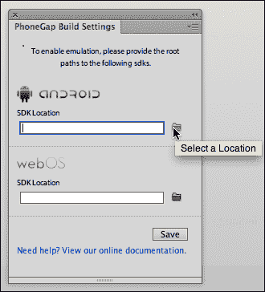
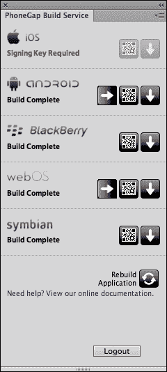
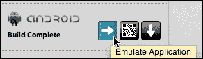
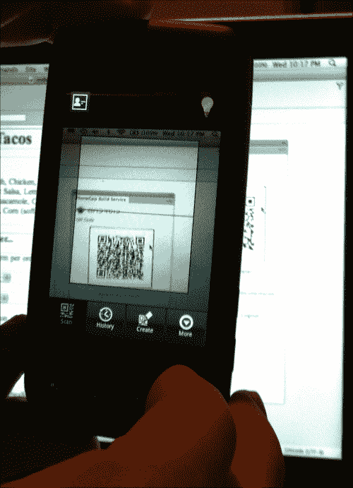
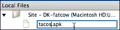

# 十、使用 PhoneGap 构建应用

什么是 app？应用与移动友好网站有何不同？

你需要一个应用吗？如何在 Dreamweaver 中创建应用？

在本章中，我们将回答所有这些问题，并逐步介绍在 Dreamweaver CS6 中创建应用的过程。

一个**应用**——应用的简称——与一个移动友好网站的不同之处在于，一个应用不在浏览器中运行。相反，应用作为一个独立的程序运行在移动设备操作系统中。摆脱了在浏览器中运行的限制，应用可以利用移动设备的整个视窗。此外，应用可以在移动设备上运行，即使该设备没有连接到互联网。

虽然在大多数方面，应用的外观和感觉都非常像 jQuery Mobile 页面，但它们在“引擎盖下”是非常不同的应用是用高级编程语言编写的，而移动友好的网站可以用 HTML5、CSS3 和 JavaScript(jQuery Mobile 的三个组件)创建。

借助 Dreamweaver CS5.5，Adobe 推出了允许您将 jQuery Mobile 网站转换为应用的工具。这些应用生成工具仍处于早期进化阶段。事实上，Dreamweaver CS6 中用于生成应用的功能比 Dreamweaver 5.5 中的功能有所缩小。尽管如此，你可以在 Dreamweaver 中生成真实的工作应用；在本章中，我们将介绍如何做到这一点。

涵盖以下主题:

*   了解应用和移动网站之间的关系
*   两种主要移动操作系统概述:安卓和 iOS
*   在电脑上模拟应用
*   安装安卓软件开发工具包
*   在 Dreamweaver 中使用 PhoneGap
*   配置电话间隙设置
*   使用 Dreamweaver 生成应用
*   测试和分发应用

# 应用和移动网站

正如本章导言中简要提到的，应用是成熟的软件程序。这其中的一个主要含义是，应用需要在特定的操作系统上运行。例如，Dreamweaver 就是一个应用。Dreamweaver 运行在两个操作系统上:微软的 Windows 和苹果的 OS X 操作系统。同样，应用是特定于操作系统的，因此您不能在苹果电脑上运行视窗版本的 Dreamweaver(也不能在视窗机器上运行苹果版本的 Dreamweaver)。苹果电脑和视窗版的 Dreamweaver 都不能在 Linux 机器上运行。

重点是。当您为移动设备创建应用时，您必须为每个移动操作系统创建不同版本的应用。手机操作系统很多，包括谷歌安卓、苹果 iOS、微软 Windows Phone、惠普 WebOS、黑莓、塞班等。

在它们之间提供服务的主要移动操作系统，即绝大多数移动设备，是安卓和 iOS。

## 安卓和 iOS

谷歌赞助了的开发，后来购买了安卓移动操作系统。安卓是开源的——意思是任何人都可以访问源代码。谷歌的方法是鼓励移动制造商在他们的设备上使用安卓作为操作系统。在移动设备发展的这个阶段，安卓操作系统出现在非常多的移动设备上，从亚马逊的 Kindle Fire、三星的平板电脑和智能手机，到低成本的智能手机，价格低至 39 美元。安卓是应用最广泛的移动操作系统。

安卓应用的大量受众已经为安卓带来了数十万个应用。安卓应用最大的分销商是谷歌游戏在线市场，但安卓应用可以由任何人以文件形式分发，文件扩展名为`.apk`。

你可以构建一个安卓应用，并通过电子邮件发送给客户或朋友，或者从你的网站上获得它。这是我们将在本章重点讨论的场景。

苹果的 iOS 移动操作系统不是开源的。iOS 仅在 iPhones、ipad、苹果电视和 iPod Touch 上可用。

正如苹果严格控制对 iOS 操作系统的访问一样，它也严格控制运行在 iOS 上的应用的分发。分发 iOS 应用需要将您的应用放入 iTunes 商店，并获得苹果的批准。这个过程很复杂，甚至是政治性的。

### 注

苹果辩称，它对哪些应用可以通过 iTunes 进行营销的严格控制确保了质量控制。苹果的批评者指出了一些事件，比如普利策奖获奖漫画家马克·菲奥雷在 2009 年禁止了一款名为 *NewsToons* 的漫画应用，理由是该应用“嘲笑”了公众人物。在广泛的抗议之后，苹果改变了决定，允许通过 iTunes 销售*新闻工具*应用。

为了避免在成为一名合格的 iOS 应用开发者的过程中陷入困境，我们将在本章重点介绍如何使用 Dreamweaver 生成和分发安卓应用。也就是说，如果你是一个经过批准的苹果 iOS 应用开发人员，构建 iOS 应用的步骤几乎与构建安卓(和其他)应用的步骤完全相同，所以你可以使用本章后面的逐步说明来添加 iOS 版本的应用。

## 了解电话差距

PhoneGap 是在 Adobe 的支持下开发的移动开发框架，现在归 Adobe 所有。PhoneGap 从使用 JavaScript、HTML5 和 CSS3 创建的页面生成应用，这意味着它可以从 jQuery Mobile 页面生成应用。

PhoneGap 可以从一组 HTML、CSS 和 JavaScript 文件中生成多个应用。早期版本的 PhoneGap(在 Dreamweaver CS5.5 中使用的版本)只能在 OS X(苹果)电脑上生成 iOS 应用，但当前版本将文件上传到云中，在那里它们被转换为应用，因此您可以从 Windows 电脑上创建 iOS 应用。

无需 Dreamweaver(在[www.phonegap.com](http://www.phonegap.com))就可以访问和使用 PhoneGap，但是 Dreamweaver 提供了一套简化的、更容易访问的工具，用于直接从 Dreamweaver 生成带有 PhoneGap 的应用。

## 在构建应用之前

比利·周有一首歌，歌词如下:

> “你听说过新款式吗，亲爱的？你只需要长相和一大笔钱。”

在 Dreamweaver 中构建应用既不需要外观，也不需要大量资金，但有两件事是你确实需要的:

1.  一个工作的 jQuery 移动页面。本书的前三章将带你走过构建 jQuery Mobile 网站的过程，所以如果你在这里潜心钻研本书，你会想要回溯几章，以获得创建 jQuery Mobile 网站所需的技能。
2.  PhoneGap 构建服务帐户。可以说，Dreamweaver 实际上是 PhoneGap 的前端。但是 Dreamweaver 会要求您登录您的 PhoneGap 帐户。我将很快向您介绍获取 PhoneGap 帐户和登录信息的过程。

还有第三个要素对在 Dreamweaver CS6 中构建应用很有用，但不是必不可少的，那就是 Android 的**软件开发工具包** ( **SDK** )(如果你是注册 iOS 开发人员，也可以下载 iOS 的 SDK)。SDK 允许您在自己的计算机上预览和测试您的应用，所以让我们也来看看下载这些文件的过程。

### 创建 PhoneGap 构建服务帐户

让我强调一下:没有 PhoneGap Build 服务帐户，您无法使用 PhoneGap Build 和 Dreamweaver。账户免费且易于设置。要创建一个，请访问位于[https://build.phonegap.com/people/sign_up](https://build.phonegap.com/people/sign_up)的 PhoneGap Build 网站。

当您进入 PhoneGap Build 网站时，您将看到两个注册选项。其中一个选项是使用 Adobe ID。如果你已经有了一个 Adobe ID，你可以在这里使用它，如果没有，你可以创建一个。

### 下载安卓 SDK

虽然安卓软件开发工具包不是构建应用的必要工具，但在自己的电脑上预览和测试应用是必要的。还有 SDK 是免费的，很容易下载，有助于预览和测试应用，所以你应该下载。

要下载包含安卓软件开发工具包的文件集，请前往[http://developer.android.com/sdk](http://developer.android.com/sdk)。点击**下载软件开发工具包**按钮，如下图所示:

点击**下载软件开发工具包**按钮，进入法律页面。阅读条款和条件，勾选**我已阅读并同意上述条款和条件**复选框，并点击**下载软件开发工具包**按钮(具体措辞因您的操作系统而异)。

点击**下载**按钮，下载开始。将 ZIP 文件保存到一个您可以找到它的文件夹中。解压文件 Mac 版是`adt-bundle-mac-x86_64.zip`，Windows 版有点不一样。

重要的是:保存解压后的文件，有一个名为`SDK`的文件夹。跟踪该文件夹在计算机文件结构中的位置。在配置 PhoneGap 构建功能的过程中，您需要在 Dreamweaver 中导航到此文件夹。

## PhoneGap 和 Dreamweaver

你会发现，在 Dreamweaver 中，使用 PhoneGap 生成应用的 99%的工作是在你开始将页面导出到应用之前完成的。简而言之，一切都是准备。如果你所有的东西都准备好了，生成应用就没有麻烦了。

当你准备将 jQuery Mobile 页面导出到应用时，要记住一条规则:每个应用都必须基于不同的 Dreamweaver 站点。换句话说，您不能从同一 Dreamweaver 站点中的文件构建两个不同的应用。

在本书中，我一直强调始终在 Dreamweaver 站点工作的重要性。当你建立一个将被导出到应用的网站时，这条规则就有了新的重要性。

当然，在一个 Dreamweaver 站点中创建多个 jQuery Mobile HTML 页面是非常可能的。这很好，只要你不打算将网页导出到应用中。但是，如果您计划将 jQuery Mobile 页面导出到应用，请创建一个新的 Dreamweaver 站点，并在该站点中只创建一个 HTML 页面。命名页面`index.html`。

如果您已经将 jQuery Mobile 页面保存为`index.html`，则可以使用 Dreamweaver 的 PhoneGap 工具将内容导出到应用。

### 类型

Dreamweaver CS6 引入了大量新的不同的程序来生成应用。在某些方面，Dreamweaver CS5.5 中生成应用的工具比 CS6 中的工具更强大，但同样，步骤也有很大不同。有关在 Dreamweaver CS5.5 中生成应用的分步说明，请参见 *Dreamweaver CS5.5 带有 HTML5、CSS3 和 jQuery 的移动和 Web 开发*、*大卫·卡林*、 *Packt Publishing* 。

## 配置电话间隙设置

您可以在 Dreamweaver 中生成应用，而无需配置 PhoneGap 设置。但是除非你配置了 PhoneGap 设置，否则你不能在你的电脑上模拟这个应用。这里是你要去的地方需要记住你把那些安卓 SDK 文件保存在哪里。还记得吗？很好，然后你就可以配置 PhoneGap 设置了，这样你就可以模拟(预览和测试)你的安卓应用了。

为此，请执行以下步骤:

1.  打开您的 Dreamweaver 站点，导航至**站点** | **电话差距构建服务** | **电话差距构建设置**。打开**电话间隙构建设置**面板。
2.  In the **Android** section of the panel (the top), click on the **Select a Location** (folder) icon and navigate to and select the **SDK** folder within the folders you unzipped from the Android SDK download file.

    

    ### 类型

    在这里，我们不是在讨论 iOS SDK 的安装过程，但是如果你是一个注册的苹果开发者，你可以在面板的 iOS 部分使用**选择一个位置**(文件夹)图标，导航并选择你保存解压缩的 iOS SDK 文件的文件夹。

3.  定义 PhoneGap SDK 设置后，点击 **PhoneGap 构建设置**面板中的**保存**按钮。

定义了 PhoneGap Build 设置后，您可以在台式机或笔记本电脑上模拟(测试)您的应用。同样，这不是必需的——您仍然可以在移动设备中创建和测试应用，并将其下载到您的计算机上，而无需配置 PhoneGap Build 设置。但是，如果您可以在运行 Dreamweaver 的同一台计算机上直接测试您的应用，您会发现开发和测试过程更加高效。

# 使用 Dreamweaver 生成应用

让我们回顾一下在 Dreamweaver 中生成应用之前需要准备的项目清单:

*   您需要在 PhoneGap 注册，并有登录 ID 和密码。
*   你需要建立一个 jQuery Mobile 页面并保存为`index.html`。请记住，每个应用都需要自己的 Dreamweaver 站点。
*   如果你想在自己的电脑上模拟你的应用，你至少需要下载安卓软件开发工具包，解压文件，并使用 **PhoneGap Build Settings** 面板来定义这些文件的位置。

有了这些部分，您就可以生成应用了。为此，请执行以下步骤:

1.  导航至**站点** | **电话差距构建服务** | **电话差距构建服务**。出现**电话间隙建立服务**面板。
2.  To begin the process of creating a new app, leave the dropdown set to the default, **Create as a new project**, and click on the **Continue** button.

    

3.  After you click on **Continue**, a new **PhoneGap Build Service** panel opens. Here, you have the option to enter keys and passwords for apps that you plan to distribute professionally. Keys and passwords are not required for apps that you will distribute yourself, and are generally not necessary unless you are developing apps on a commercial basis for large-scale sale. You can select **None** in the **Key** popup for Android.

    ### 类型

    有关获取安卓应用密钥和密码的详细信息，请参见[http://developer . Android . com/tools/publishing/app-signing . html # cert](http://developer.android.com/tools/publishing/app-signing.html#cert)。

4.  Click on the **Continue** button in the following panel:

    

5.  Yet another **PhoneGap Build Service** panel opens showing the progress of your apps being generated. There is nothing to do here but sit back, relax, and wait while PhoneGap generates your app(s).

    

6.  When PhoneGap is done generating apps for your configured mobile operating systems (which in our case means everything except iOS), the **PhoneGap Build Service** panel will display the status of each app.

    

您现在可以测试和分发您的应用了。但是不要关闭 **PhoneGap 构建服务**面板！你将需要它来测试和分发你的应用。

### 类型

**故障排除注意事项**

如果 **PhoneGap Build Services** 面板反复冻结，问题可能不在您的配置或互联网连接中。Dreamweaver CS6 可能带有一个似乎未被承认的错误，这导致了 **PhoneGap Build Services** 面板的冻结。如果此问题仍然存在，请导航到 Dreamweaver 中的**帮助** | **更新**，并用最新版本更新您的 Dreamweaver CS6 安装，这将修复此错误。

# 测试和分发应用

在分发应用之前，有三种方法可以测试它们:

*   你可以在你的电脑上模拟这个应用，前提是你已经下载并安装了那个应用的软件开发工具包。
*   您可以使用移动设备的二维码阅读器将该应用扫描到该设备中。它提供了一个指向 PhoneGap 网站上保存的应用文件的链接，并允许将该应用下载到您的移动设备上进行测试。
*   您可以下载该应用，并将其从计算机传输到移动设备。

在你自己的电脑上模拟一个应用是这些选项中最简单的一个，我们将关注这一点。但我也将介绍如何将您的应用加载到带有二维码阅读器的移动设备中，以及如何下载该应用。

## 用模拟器测试应用

查看您的应用在移动设备中的外观的最简单方法是在您用来运行 Dreamweaver 的台式机或笔记本电脑上模拟它。如果您已经为任何操作系统(如安卓)安装并配置了软件开发工具包，该软件开发工具包包括仿真软件。

要启动任何操作系统的模拟器，请单击 **PhoneGap 构建服务**面板中的**模拟应用**图标。

下一个出现在 **手机间隙构建服务**面板中的屏幕提供了如何模拟你的应用的选项(它们在哪里工作)。一般来说，你会接受默认设置，点击**启动**按钮。

启动模拟器需要互联网连接，并且需要一些时间。为什么呢？因为该应用实际上托管在 PhoneGap 站点，并且必须从该站点下载到模拟器窗口中。因此，在启动模拟器之前，请确保您有一个可用的互联网连接，并保持耐心。最终，模拟器将启动，您可以在您的计算机上测试该应用。

不同的操作系统有不同的模拟器，但它们都提供了键盘和预览窗口，可以在移动设备上或多或少地显示您的应用。

## 修改你的应用

一般来说，创建应用的测试和编辑过程发生在生成应用之前。当你的 jQuery Mobile 网站转变成应用时，你要确保它按照你想要的方式工作。

也就是说，有时当你在模拟器窗口中测试你的应用时，你会发现你需要做的改变。您可以通过编辑 jQuery Mobile 网站来实现这一点，并通过单击 **PhoneGap Build Service** 面板底部的**重建应用**图标来重新生成您的应用。

您可以在此过程中保持模拟器运行，并通过单击应用的 **【模拟应用】**图标来更新模拟器。该应用将需要上传和重新生成，这需要大量时间——这强调了在生成应用之前测试和完善您的 jQuery Mobile 网站的重要性。

## 将应用扫描到你的安卓设备中

测试生成的安卓应用的另一种方法是将其下载到安卓设备上。为此，请在 **PhoneGap 构建服务**面板中点击**查看安卓二维码**图标。

点击**查看二维码**图标后，**手机间隙建立服务**面板显示一个大的可扫描二维码。

在安卓手机中使用二维码扫描仪软件，将二维码扫描到你的安卓设备中。您可以通过在安卓移动设备中启动二维码阅读器，并将扫描窗口指向在 Dreamweaver 中生成的二维码来完成操作。

将二维码扫描到安卓设备后，设备会显示一个指向应用文件的链接。点击该链接，使用安卓设备中的工具下载、打开和安装应用文件。

### 类型

如何在不同的安卓移动设备上下载和安装文件的完整探索超出了本书的范围，但是您可以使用 Astro File Manager 完成整个过程，这是一个可以下载到任何安卓移动设备上的应用。

一旦你下载并安装了你的应用，你就可以在你的安卓移动设备上进行测试。我自己的安卓手机没有屏幕截图实用程序，所以我们必须使用屏幕照片来演示应用在我的设备上的外观。

## 下载应用

测试你的应用的第三个选择是下载到你的电脑上。该应用不会在您的计算机上运行，因为它只在为其创建的移动操作系统上运行。但是您可以使用任何文件传输技术将文件移动到您的移动设备并进行测试。

在这里，我们再次偏离了 Dreamweaver，但一般来说，您可以通过用 USB 线连接设备并将应用(扩展名为`.apk`的文件)拖到移动设备上，将应用从开发计算机传输到移动设备。然后，您可以像启动任何应用一样，在移动设备上启动应用。

## 分发应用

应用分发特定于每个操作系统。如上所述，苹果设备的所有应用都是通过 iTunes 分发的。安卓应用通过谷歌游戏销售和分发。通过 Google Play 分发应用不需要经过 Google 的批准，但是有要求，而且确实要注册为 Android 开发者(并支付注册费)。您将在 https://play.google.com/apps/publish 通过谷歌游戏找到销售或分发应用所需的所有信息。

虽然应用的商业分发远远超出了本书的范围，但你可以直接从你的网站分发安卓应用。下面是在 Dreamweaver 中如何做到这一点:

1.  In the **PhoneGap Build Service** panel, click on the **Download Application** icon for Android.

    

2.  The **Choose a Location to Save the .apk file** dialog opens. Navigate to the site through which you will be distributing the app, and click on the **Open** button to download your app to the selected folder. When the app is downloaded, a small dialog appears. Click on **OK** in that dialog.

    

3.  You can rename the app in Dreamweaver's **Local Files** panel, just be sure to keep the `.apk` filename extension.

    

4.  With the `.apk` file saved to a Dreamweaver site, you can create a link to that app file just as you would create a link to any other file.

    

从你自己的网站分发应用是一种让你的应用变得可用的简单易行的方法。考虑到您通过 Dreamweaver 构建的应用种类的技术限制，从您的网站共享应用是分发它们的合适方式。

# 总结

应用是您网站的独立版本。它们不需要浏览器就可以在移动设备上工作，也不需要互联网连接(一旦下载并安装完毕)。应用是用高级编程语言编写的，专业级别的应用需要在高级编码方面进行大量投资。

Dreamweaver CS6 与 PhoneGap 工具集合作并作为其前端。这些工具将 HTML5、CSS3 和 JavaScript 构建的网页(一般来说，这意味着 Dreamweaver 中的 jQuery Mobile 页面)转换为适用于包括安卓在内的一系列移动操作系统的应用。如果你是注册的苹果开发者，你也可以使用 PhoneGap 和 Dreamweaver 来创建苹果 iOS 应用。

Dreamweaver CS6 的 PhoneGap 构建服务管理构建、测试和分发应用的整个过程(简单来说)。用 jQuery Mobile 构建的页面被上传到 PhoneGap 服务器，在那里它们被转换成应用并保存。

您可以使用模拟器软件来测试应用，模拟器软件是每个操作系统提供的软件开发工具包(SDK)文件的一部分。您可以自己分发生成的应用，方法是将应用文件下载到您的计算机上，并在网页中发布到该文件的链接，就像您发布到任何文件的链接一样。

Dreamweaver CS6 的应用工具是否上升到创建通过谷歌 Play 或 iTunes 销售的商业分发应用的水平？可能不会。由专业程序员构建的应用将加载更快，运行更快，可以包括 3D 图形，最重要的是，可以为不同的操作系统定制(而 PhoneGap 基于相同的源文件为每个操作系统生成应用)。但是您在 Dreamweaver 中构建的应用运行良好，可以免费分发。如果你选择与专业编码人员签约，创建一个商业质量的应用，你可以使用 PhoneGap 生成的应用作为你的编码团队工作的模型。