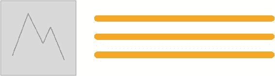

# 第三章。实现获得的智慧

> *你往往在第一次实现一个解决方案——大教堂和集市之后才真正理解这个问题*

在最后一章中，我们考虑了处理大型 CSS 代码库的一些更明显的困难。在本章中，我们将考虑一些现有的方法来处理这些问题。

在两年的时间里，我一直在进行 CSS 架构和维护的探索。在体验开始时，我做了任何明智的开发人员都应该做的事情。我想知道聪明人已经如何处理这个问题了。

CSS 架构方法看起来像是为超重人群准备的减肥药。很容易抓住明显的解决方案，希望它们正是你所需要的。然而，你可能不知道你到底需要什么，直到你尝试解决你的问题至少一次。

这个建议也适用于这里。这可能是因为 ECSS 不能解决你的问题，所以如果你刚刚开始解决你的 CSS 问题，一定要考虑不同的方法提供了什么。

在我冒险的时候，处理大规模 CSS 的主要方法是:

*   **OOCSS** ( **面向对象 CSS** ，由*妮可·沙利文*([http://www.stubbornella.org/content/](http://www.stubbornella.org/content/))开发
*   **SMASSS**(**CSS**的可扩展模块化架构，由*乔纳森·斯努克*([https://snook.ca/](https://snook.ca/))开发
*   **BEM** ( **块体元素修改器**)，由*Yandex*([https://en.bem.info/](https://en.bem.info/))开发

现在，我会毫不羞耻地告诉你，我已经从每一个中窃取了元素。然而，这些都没有真正解决我所有的问题。

在我们讨论 ECSS 本身之前，我想简单回顾一下我所研究的每种现有方法的优缺点。这样，至少当我们到达 ECSS 时，您可以欣赏它正在解决的问题。

# 在 OOCSS 上

在我所研究的现有方法中，实践最广泛、肯定也是最受称赞的是 OOCSS。这是我在尝试与不断增长的 CSS 代码库搏斗时使用的第一种方法。

OOCSS 方法的一个主要论点是它消除了代码的重复，因此产生了一个更易维护的 CSS 代码库。本质上，您构建了一组 CSS *乐高*块，然后可以在您的 HTML/模板中使用它们来快速构建设计。希望一旦你的 OOCSS 风格写好了，它们就不会增长(太多)。您可以在可能的地方重用，并在需要的地方扩展。

在我们看 OOCSS 之前，我需要得到一些警告。

1.  这不是对 OOCSS、原子 CSS 或任何相关**单一责任原则** ( **SRP** )方法的攻击。这只是我的论点，根据你的目标，不同的方法可以提供一个优先的结果。
2.  我并不是说我提倡的方法是解决所有 CSS 缩放问题的灵丹妙药。不是(没有)。

## 响应式网页设计，OOCSS 的致命弱点

对我来说，OOCSS 方法最大的问题是:

*   响应式网页设计
*   频繁的设计变更和持续的维护
*   供新开发人员学习的陌生抽象

让我们看看我是否能证明为什么我觉得这些问题值得考虑。

## 响应问题

我认为*原子 CSS*([https://www . smashingmagazine . com/2013/10/challenge-CSS-最佳实践-原子方法/](https://www.smashingmagazine.com/2013/10/challenging-css-best-practices-atomic-approach/) )(不要与*原子设计*([http://bradfrost.com/blog/post/atomic-web-design/](http://bradfrost.com/blog/post/atomic-web-design/))混淆)代表第 n 度的 OOCSS。让我们考虑一个假想的原子 CSS 例子:

```html
<div class="blk m-10 fr">Here I am</div>
```

在这个 OOCSS/Atomic CSS 的例子中，元素的视觉需求被分解/抽象成可重用的类。一个设置块格式化上下文(`.blk`)，另一个设置一些边距(`.m-10`)，最后一个为元素提供浮动机制(`.fr`)。不固执己见，简洁是肯定的。

### 注

原则上，原子 CSS 非常类似于我设计的第一个架构方法。

它被称为 **PST！**是位置结构主题的缩写。想法是这样的:没有语义 HTML 类/CSS 选择器。相反，页面上的每个元素都可以用它的位置、结构和主题来描述。每一个新的选择器都会取下一个可用的号码。比如`s1`、`s2`、`s3`等等。它并不像原子 CSS 那样是每个职责的一个类，但是它是一种大量抽象风格需求的方式。

标记如下所示:

```html
<div class="p1 s3 t4">Content</div>
```

就像原子 CSS 一样，它很简洁，没有考虑在你创作的时候应该怎么称呼它，但是实际上它对我的需求来说是有很大问题的，原因和本章中描述的一样。

然而，当视口改变，我们不希望 10px 的边距或项目浮动时，会发生什么？

我们当然可以创建一些类来在特定的断点上做事情。例如，`Mplus-cc2`可能会在 *Mplus* 断点处改变颜色(这里的 Mplus 是*中等*大小的视口及以上)。但是我发现这种做法既慢又费力。在某些断点处进行非常具体的更改，并将它们绑定到一个必须添加到 HTML 中的类，这似乎没有必要复杂。此外，您不可避免地会在样式表中出现大量过时的 SRP 类。当不再需要时，从创作样式表中删除任何 cruft 的创作机制是什么？

## 维护和迭代

让我们继续前面的例子。假设在未来的某个时间点，我们将我们的产品改变为更进步的布局机制；我们从基于浮动的布局转向基于 Flexbox 的布局。在这一点上，我们现在将有两倍的维护负担。我们不仅需要改变标记/模板中的类，还需要改变 CSS 规则本身(或者编写全新的规则)。此外，使用`float`对于 Flexbox 来说是多余的，所以我们要么让`.fr`单独存在(这样它就继续存在，不必要地出现在我们的 CSS 中)，要么让`.fr`负责其他事情，比如`justify-content: flex-end`。但是如果我们在一个特定的视口改变父对象的弯曲方向会发生什么呢？啊啊啊！

当你的设计经常改变或者你需要在不同的视口呈现完全不同的布局时，希望你能看到 OOCSS 维护方法的固有缺点？

### 注

自从 2013 年蒂埃里在《粉碎杂志》上发表文章以来，原子 CSS 已经有了很大的发展。根据你的目标，这可能正是你需要的，我鼓励你去 [http://acss.io](http://acss.io) 查看这个项目。

## 对新开发人员来说是陌生的抽象概念

快速加入新开发人员可能不是每个人的重要因素。然而，对于开发人员相当定期地加入和离开一个团队(或者甚至一个公司)的情况，这可能是一个重要的考虑因素。我在寻找一种解决方案，它在很大程度上允许开发人员继续编写他们所知道的 CSS。强迫新开发人员学习一个陌生的抽象概念会是一个额外的不必要的负担。此外，将抽象应用于模板层可能有问题，也可能没有问题；毕竟，许多解决方案可能甚至没有传统意义上的模板层。

## 一个纯 OOCSS 的例子

公平地说，使用原子 CSS 作为例子是不公平的，并且可能不公平地代表 OOCSS。然而，试图获得一个 OOCSS 的规范例子是很困难的，因为在 CSS 作者认为它是什么和它是如何实现的之间似乎有太多的差异。

因此，我将提供一些进一步的例子，仅限于 OOCSS。我将使用妮可·沙利文幻灯片中的原始示例*我们的最佳实践正在杀死我们*([http://www . slide share . net/stubornella/我们的最佳实践正在杀死我们](http://www.slideshare.net/stubbornella/our-best-practices-are-killing-us))。

我不愿意这样做，因为妮可最初的例子现在已经很老了(2009 年，在响应式网页设计成为一件事之前)，我不想为她说话，但我敢说她今天可能会使用不同的例子和方法。

但是，希望我们能认同 OOCSS 的本质目标是*结构与皮肤分离，内容与容器分离*([https://github.com/stubbornella/oocss/wiki](https://github.com/stubbornella/oocss/wiki))？假设我们在这一点上达成一致，我确信 OOCSS 在某些情况下对创建速度和代码库的可维护性是有害的。

在响应性网页设计中，有时结构就是皮肤。或者更确切地说，这个结构在不同的上下文中做不同的事情，没有理智的方法用 OOCSS 来处理这个问题。然而你将是法官。

考虑这个 OOCSS 的例子。首先是标记:

```html
<div class="media attribution">
  <a href="#" class="img">
    
  </a>
  <div class="bd">@Stubbornella 14 minutes ago</div>
</div>
```

现在 CSS(注意，我在这里删除了一些旧的特定属性/值):

```html
.media { overflow: hidden; margin: 10px; }
.media .img { float: left; margin-right: 10px; }
.media .img img { display: block; }
.media .imgExt { float: right; margin-left: 10px; }

```



面向对象软件的实例；媒体对象模式

然而，也许这个媒体对象需要在一个 300 像素宽的视窗中有不同的布局。在这种情况下，您可以设置媒体查询，使其成为基于列的布局。但是假设您在相同的视口宽度下，在不同的上下文中有相同的*对象*？在这种情况下，它不应该在列布局中。猜测:

1.  一个媒体对象需要是 300 像素宽的基于列的布局(我们称之为 *media1* )
2.  第二个媒体对象需要是 300px 宽的基于行的布局(因为它在另一个上下文/容器中，我们称之为 *media2* )

让我们创建一个类来分离更多的关注点。它使媒体对象成为特定视口的列布局:

```html
@media (min-width: 18.75rem) {  
  .media-vp-small {
    /* Styles */
  }
}

```

它被添加到任何需要成为该视口中的列的元素中( *media1* )，因此您需要前往模板/HTML 进行更改，在需要的地方添加类。

此外，*中间 2* 需要在更大的视口具有不同的背景颜色。让我们添加另一个类来分隔这个问题:

```html
@media (min-width: 60rem) {
  .draw-focus {
    /* Styles */
  }
}

```

进入 HTML/模板，在需要的地方添加样式。

哦，还有*中间 1* 需要`.img`在更大的视口更宽，没有边距。我们可以为其制作另一个类:

```html
@media (min-width: 60rem) {
  .expand-img {
    width: 40%;
    margin-right: 0!important;
  }
}

```

返回到 HTML/模板中，以实现这种改变。

希望现在，你能明白这是怎么回事了？有许多单一责任原则(SRP)类被添加，以促进我们的媒体对象需要促进的多种多样的场景。

这种方法并没有让我庞大的响应代码库变得更容易维护。事实上，恰恰相反。每当需要改变的时候，就有必要针对特定的情况寻找特定的 SRP 类，并且经常在标记/模板中添加/删除 HTML 类。这让我思考了一个问题:

> **为什么事物不能，只是事物？*T3】*

现在，你可能会反驳，*这是一个愚蠢的例子，如果一个设计有这么多可能性，它应该被规范化*。在这一点上，我会反驳说没有必要。那些负责前端编码的人不应该仅仅因为设计者的代码不可预测而阻碍他们的创造力。他们应该能够简单而容易地设计出新的设计，而不用担心新的组件/模块/事物会如何影响他人。

### 类型

仅仅因为一个项目的视觉变化会使我们的代码库难以维护和推理，就试图阻止这种变化是站不住脚的。我们应该能够以速度和可预测性构建任何新的视觉处理，而不用担心无意中影响项目的其他领域。

当我使用 OOCSS 来解决我的需求时，我构建新视觉效果的速度下降了，SRP 类的数量增加了；通常一个类在整个项目中只使用一两次。即使考虑了 SRP 类的命名约定，记住特定需求的正确类名也需要不断的精神杂耍。

当在一个快速变化的项目中使用 OOCSS 时，我也发现过了一段时间后，当需要变化时，我发现*拆开*这些抽象类令人难以置信的沮丧。我不得不创建许多非常相似的抽象类，而它们实际上很少被使用。像`w10`、`w15`、`w20`、`w25`等不同宽度百分比的实用类看起来是一个好主意，也是一个显而易见的抽象概念，但最终证明它们对迭代设计是无用的，也是有问题的(回到需要在不同上下文中做不同事情的问题上)。

因此，当我使用 OOCSS 时，我学到的第一个重要的经验就是优秀的凯丽格·德卢梅奥-普里金特(T1)(T2·http://www.kaelig.fr/(T3))在英国广播公司和《卫报》从事大型 CSS 代码库工作时学到的经验:

> *两年前，我写了一本书，在书中我宣扬 DRY 代码，但在从事持久的项目之后，对我来说，解耦变得更加重要。*

在大型、快速变化的项目中，能够轻松地将可视化模块从项目中分离出来对于持续的维护来说非常重要，而 OOCSS 并没有很好地满足这种需求。

# SMACSS

代表 CSS 可扩展模块化体系结构的 SMACSS 在乔纳森·斯努克关于这个主题的书中有详细的描述。我不会在这里详细介绍 SMACSS，因为我认为你应该自己去看看那本书。当我面对自己的挑战时，阅读 SMACSS 给了我很多东西来思考，我当然从中吸取了一些东西，比如如何思考状态的变化。不过，我会详细说明为什么 SMACSS 对我不起作用。

同样，就像我关于我对 OOCSS 的看法的警告一样，这不是对 SMACSS 的批评。它只是强调了对我不起作用的部分，以及为什么我觉得它不能解决我自己的问题。SMACSS 为网站的视觉方面明确定义了术语和概念。因此，它规定了支持这些定义的基础、布局、模块和可选主题规则/文件。例如，考虑以下建议的文件结构:

```html
+-layout/ 
| +-grid.scss 
| +-alternate.scss 
+-module/ 
| +-callout.scss 
| +-bookmarks.scss 
| +-btn.scss 
| +-btn-compose.scss 
+-base.scss 
+-states.scss 
+-site-settings.scss 
+-mixins.scss”
```

> *节选自:乔纳森·斯诺克。*CSS 的可扩展模块化架构。*T3】*

虽然这些定义在很多情况下都很有意义，但对我来说却不是。我想要一种更宽松的方法，一种不需要我考虑在这些视觉定义中加入什么的方法；我正在构建和维护的应用通常不符合这些定义。

# 很好

BEM 是开发者在 [http://yandex.ru](http://yandex.ru) 开发的方法论。

我从 BEM 那里学到的关键是，当涉及到 CSS 维护时，命名约定能给你带来多少好处。

### 注

如果你有兴趣阅读更多关于 BEM 的内容，规范资源是[。为了更好地解释这一切是从哪里开始的，我建议从这里开始:](https://en.bem.info)[https://en.bem.info/method/history](https://en.bem.info/method)

同样，像 SMACSS 一样，我不打算试图完全解释边界元方法的来龙去脉。不过，我会给你*电梯节距*重点讲解。边界元方法围绕页面的关键区域可以被定义为**块**的概念工作。反过来，这些关键区域由元素组成。然后，我们可以用我们命名事物的方式来表示块及其元素之间的关系。考虑之前的 OOCSS 媒体对象示例。在边界元法中，我们可以使用这样的类:

```html
<div class="media">
  <a href="#" class="media__img">
    
  </a>
  <div class="media__attribution">@Stubbornella 14 minutes
  ago</div>
</div>

```

这个命名方案非常有用，因为它清楚地传达了元素和它们所属的块之间的关系。另外，除了 HTML 之外，如果我们在 CSS 中遇到这样的选择器:

```html
.media__headshot {

}

```

我们立刻知道这是一个名为**爆头**的元素，它生活在一个名为**媒体**的街区内。将组件命名为其他组件的一部分有助于隔离样式，并防止应用的样式从“T4”泄露出去，这是我在 OOCSS 中最大的缺陷之一。对于我试图解决的问题来说，这无疑是朝着正确的方向迈出的一步。

边界元法也有*修饰语*的概念。修改器是添加到块中以修改其外观的东西。假设我们想在不同的场景中对媒体对象进行不同的主题设计。边界元法是这样促进的:

```html
<div class="media media_dark">
  <a href="#" class="media__img">
    
  </a>
  <div class="media__attribution">@Stubbornella 14 minutes
  ago</div>
</div>

```

边界元法文档规定使用单个下划线字符来标识块的修饰符。该修改器类必须始终与块名一起使用。例如，您必须这样做:

```html
<div class="media media_dark">

```

而不是这个:


```html
<div class="media_dark">
```

我看到了以这种方式使用修饰语的价值，但它对我来说是有问题的。通常我设计的东西需要以更传统的方式表现得不同。也许视觉效果需要根据使用的上下文或者 DOM 中是否有其他类被添加到它上面来进行不同的显示。或者由于某些媒体查询条件，或者实际上这些场景的任意组合。我需要一种创作风格的方法，这种方法足够实用，可以处理发生的非理想情况。在创作样式表中保持某种理智的方法，不管向它们抛出什么。

# 总结

在我查看的所有现有 CSS 方法中，我从边界元法中获益最多。边界元法有很多值得欣赏的地方:

*   所有元素获得相同的特异性；一个类被添加到所有元素中。
*   没有使用类型选择器，所以 HTML 结构没有与样式紧密结合。
*   无论是在浏览器开发工具中查看 DOM 树，还是在代码编辑器中查看 CSS，都很容易推断出元素的父元素是什么。

然而，修饰语的使用并不真正符合我的需要。虽然这可能不太好，但我的现实是，我经常需要覆盖一个块上的样式(用边界元法的说法)，这取决于它上面或 DOM 中它旁边的某种可能性。

例如，在应用中已经确定了现有逻辑的场景中，可能会有像`contains2columns`这样的类被添加到 DOM 中有问题的项之上，并且我需要基于此进行样式更改，而不是直接在有问题的块上进行更改。

有了边界元法，我找不到一个清晰的方法来理解这种可能性应该如何处理。或者我如何在创作样式表中包含这些类型的覆盖。我想定义项目并封装可能发生在特定项目上的所有可能性。

我还发现，在浏览课程时，语法令人费解。修饰语的书写方式和元素的书写方式之间的区别可以忽略不计。这将是一个简单的解决办法，但它仍然是困扰我的事情。

最后，我意识到我需要一些额外的东西。我希望能够交流和促进模块的不同环境。当一个*事物*是由同一条逻辑创建的，但是可以在不同的上下文中使用和风格不同，我想要一种交流的方式。

从 SMACSS 中，我发现有用的主要事情是处理状态。我喜欢像`is-pressed`或属性`.btn[data-state=pressed]`这样的类清晰地传达元素状态的声明方式。

OOCSS 证明是我所需要的对立面。虽然我很欣赏 OOCSS 所能提供的，但它并不是解决我遇到的问题的办法。我不想创建一个乐高风格的盒子，作者可以用它在 DOM/模板中建立视觉效果。OOCSS 促进的抽象本质上是*泄漏的*，这使得维护成为问题(改变一个规则中的值，您可能会无意中影响许多元素)，也很难找到处理不同视口的方法，原因已经解释过了，当新开发人员加入时，额外的抽象增加了进一步的复杂性。

最终，通过不同程度的尝试和失败，我最终完全理解了我的问题。现在是定制解决方案的时候了。套用巴勃罗·毕加索的话:

> *优秀的程序员抄袭，伟大的程序员偷窃**巴勃罗·毕加索**(有点-对不起巴勃罗)*

和我一起走。