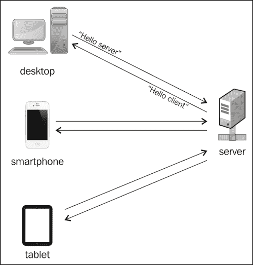
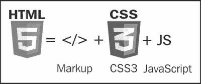

# 一、WebSocket——握手！

在现实生活中，握手是指轻轻握住两个人的手，然后进行短暂的上下运动。如果您曾经以这种方式问候过某人，那么您已经理解了 HTML5WebSocket 协议的基本概念。

WebSocket定义了 web 服务器和 web 客户端之间的持久双向通信，这意味着双方可以同时交换消息数据。WebSocket 引入了真正的并发性，它们针对高性能进行了优化，并产生了响应更快、更丰富的 web 应用。

下图显示了与多个客户端的服务器握手：

为了记录在案，WebSocket 协议已经由**互联网工程任务组**（**IETF**标准化，web 浏览器的 WebSocket API 目前正在由**万维网联盟**（**W3C**标准化）-是，这是一项正在进行的工作。不，您不需要担心巨大的变化，因为当前的规范已作为“建议标准”发布。

# WebSocket 之前的生活

在深入探讨 WebSocket 的世界之前，让我们先看看用于服务器和客户端之间双向通信的现有技术。

## 投票

Web 工程师最初使用一种称为轮询的技术来处理这个问题。轮询是一种同步方法（即无并发），它执行周期性请求，而不管是否存在用于传输的数据。客户端在指定的时间间隔后发出连续请求。每次，服务器都会使用可用数据或适当的警告消息进行响应。

虽然轮询“只起作用”，但很容易理解，这种方法在大多数情况下都是多余的，而且对于现代 web 应用来说，它非常消耗资源。

## 长轮询

长轮询是一种类似的技术，如其名称所示，客户端打开连接，服务器保持连接活动，直到获取某些数据或超时。然后，客户端可以重新启动并执行顺序请求。长轮询是对轮询的性能改进，但是持续的请求可能会减慢进程。

## 流媒体

流式传输似乎是实时数据传输的最佳选择。使用流式传输时，客户端执行请求，服务器无限期地保持连接打开，在准备就绪时获取新数据。虽然这是一个很大的改进，但流仍然包括 HTTP 头，这会增加文件大小并导致不必要的延迟。

## 回发和 AJAX

web 是围绕 HTTP 请求-响应模型构建的。HTTP是一个无状态协议，意味着两个部分之间的通信由独立的请求和响应对组成。简单地说，客户机向服务器询问一些信息，服务器用正确的 HTML 文档进行响应，页面被刷新（实际上称为回发）。在执行新操作（如单击按钮或从下拉菜单中选择）之前，其间不会发生任何事情。任何页面加载之后都会出现恼人的（用户体验方面的）闪烁效果。

直到 2005 年，由于**异步 JavaScript 和 XML**（**AJAX**），才绕过回发闪烁。AJAX 基于 JavaScript 的`XmlHttpRequest`对象，允许异步执行 JavaScript 代码，而不会干扰用户界面的其余部分。AJAX 只发送和接收 web 页面的一部分，而不是重新加载整个页面。

假设你正在使用 Facebook并想在你的时间线上发表评论。在适当的文本字段中键入状态更新，点击回车键并。。。瞧！您的评论将自动发布，无需加载单个页面。除非 Facebook 使用 AJAX，否则浏览器需要刷新整个页面才能显示您的新状态。

AJAX，与 jQuery 等流行的 JavaScript 库一起，极大地改善了最终用户体验，被广泛认为是每个网站的必备属性。只有在 AJAX 之后，JavaScript 才成为一种受人尊敬的编程语言，而不是被认为是一种必要的邪恶。

但这还不够。长轮询是一种非常有用的技术，它使您的浏览器看起来像是保持了一个持久的连接，而事实是客户端会连续调用！这可能是资源密集型的，特别是在移动设备中，速度和数据大小非常重要。

前面描述的所有方法都提供实时双向通信，但与 WebSocket 相比有三个明显的缺点：

*   它们发送 HTTP 头，使文件总大小变大
*   通信类型为半双工，这意味着每一方（客户机/服务器）必须等待另一方完成
*   web 服务器消耗更多的资源

回发世界就像一部对讲机，你需要等待另一个人说完（半双工）。在 WebSocket 世界中，参与者可以同时讲话（全双工）！

web 最初是为显示文本文档而构建的，但想想今天它是如何使用的。我们显示多媒体内容，添加定位功能，完成复杂任务，因此，传输不同于文本的数据。AJAX 和 Flash 等浏览器插件都很棒，但需要一种更为自然的方式。我们现在使用 web 的方式需要一个全新的应用开发框架。

# 接着是 HTML5

HTML5为前面讨论的问题引入了重要的解决方案，因此在当今引起了一场巨大但合理的讨论。如果您已经熟悉 HTML5，请跳过本节继续。

HTML5 是开发和设计 web 应用的强大框架。

HTML5 不仅仅是一种新的标记或一些新的样式选择器，它也不是一种新的编程语言。HTML5 代表一系列技术、编程语言和工具，每种技术、编程语言和工具都有各自的作用，所有这些共同完成一项特定任务，即为任何类型的设备构建丰富的 web 应用。

HTML5 的主要支柱包括标记、CSS3 和 JavaScript API。

下图显示了 HTML5 组件：

以下是 HTML5 家族的主要成员。由于本书并未涵盖整个HTML5，我建议您访问[html5rocks.com](http://html5rocks.com)，开始动手示例和演示。

<colgroup><col style="text-align: left"> <col style="text-align: left"></colgroup> 
| 加成 | 结构元素形式元素属性 |
| 图样 | 样式表帆布SVGWebGL |
| 多媒体 | 音频视频 |
| 存储 | 隐藏物本地存储Web SQL |
| 连通性 | 网络信息网袋网络工作者 |
| 地方 | 地理定位 |

虽然存储和连接应该是最高级的主题，但如果您不是一名经验丰富的 web 开发人员，则无需担心。在本书中，我们将解释如何完成常见任务，并创建一些分步示例，稍后您可以下载并试用这些示例。此外，通过 HTML5API 管理 WebSocket 非常容易掌握，因此深呼吸，毫无恐惧地投入其中。

# WebSocket 协议

WebSocket 协议从头开始重新定义全双工通信。事实上，WebSocket 和 WebWorkers 在将桌面丰富的功能引入 web 浏览器方面迈出了巨大的一步。并发和多线程在回发世界中并不真正存在。他们是以一种相当严格的方式模仿的。

## 网址

HTTP 协议需要自己的模式（HTTP 和 https）。WebSocket 协议也是如此。下面是一个典型的 WebSocketURL 示例：

`ws://example.com:8000/chat.php`

首先要注意的是`ws`前缀。这很正常，因为我们需要新协议的新 URL 模式。也支持`wss`，WebSocket 相当于安全连接（SSL）的 https。URL 的其余部分类似于普通的旧 HTTP URL，如下图所示。

下图显示了令牌中的 WebSocket URL：

## 浏览器支持

目前，WebSocket 协议的最新规范是 RFC6455，并且每个现代 web 浏览器的最新版本都支持它，这是一件幸事。更具体地说，以下浏览器支持 RFC 6455：

*   Internet Explorer 10+
*   Mozilla Firefox 11+
*   谷歌浏览器 16+
*   狩猎 6+
*   歌剧 12+

值得一提的是，Safari（iOS 版）、Firefox（安卓版）、Chrome（安卓版、iOS 版）和 Opera mobile 的移动版本都支持 WebSocket，为智能手机和平板电脑带来了 WebSocket 功能！

但是，等等。全世界许多人仍在使用的旧版本浏览器有什么特点？好的，不必担心，因为在本书中，我们将了解一些使我们的网站尽可能被最大的读者访问的后备技术。

## 谁在使用 WebSocket

尽管 WebSocket 是一项全新的技术，但许多有前途的公司利用它的各种功能为用户提供更丰富的体验。最著名的范例是考津（[http://demo.kaazing.com/livefeed/](http://demo.kaazing.com/livefeed/) ），一家初创公司，为其实时通信平台筹集了 1700 万美元的投资。

其他业务包括：

<colgroup><col style="text-align: left"> <col style="text-align: left"> <col style="text-align: left"></colgroup> 
| 

名称

 | 

网站

 | 

描述

 |
| --- | --- | --- |
| 伽穆加“T0” | [http://www.gamooga.com/](http://www.gamooga.com/) | 应用和游戏的实时后端 |
| GITT0 现场直播。 | [http://gitlive.com/](http://gitlive.com/) | 关于 GitHub 项目的通知 |
| 超级进料器 | [http://superfeedr.com/](http://superfeedr.com/) | 实时数据推送 |
| 推进器 | [http://pusher.com/](http://pusher.com/) | 可扩展的web 和移动应用实时功能 API |
| 品尝“T0” | T0https://smarkets.com/ T1 | 实时投注 |
| IRC云 | [https://www.irccloud.com/](https://www.irccloud.com/) | 聊天 |

包含多种 WebSocket演示的两大资源如下：

*   [http://www.websocket.org/demos.html](http://www.websocket.org/demos.html)
*   [http://www.html5rocks.com/en/features/connectivity](http://www.html5rocks.com/en/features/connectivity)

# 手机？

WebSocket，顾名思义，与 web 相关。你知道，对于某些浏览器来说，网络不仅仅是一堆技术；相反，它是一个广泛的通信平台，适用于大量设备，包括台式电脑、智能手机和平板电脑。

显然，任何使用 WebSocket 的 HTML5 应用都可以（几乎）在任何支持 HTML5 的移动 web 浏览器上运行。假设您希望使用本机移动应用的增强功能实现相同的功能。主流移动操作系统是否支持 WebSocket？简短的回答是：是的。目前，移动行业的所有主要参与者（苹果、谷歌、微软）都提供了一个 WebSocket API，您可以在自己的本地应用中使用。iOS、Android、Windows 智能手机和平板电脑以类似于 HTML5 的方式集成 WebSocket。

# 未来是现在

一项新的神经科学研究证实了一句古老的格言：握手的力量：人们确实会对举手问候的人留下更好的印象（[http://www.sciencedaily.com/releases/2012/10/121019141300.htm](http://www.sciencedaily.com/releases/2012/10/121019141300.htm) ）。正如人类握手可以带来更好的交易一样，WebSocket 握手可以带来更好的用户体验。我们将用户体验作为性能（用户等待时间更少）和简单性（开发人员直接快速构建）的组合进行研究。

所以，这取决于您：您是否希望构建现代、真正实时的 web 应用？您想为您的用户提供最大的体验吗？您想为现有的 web 应用提供出色的性能提升吗？如果以上任何一个问题的答案都是肯定的，那么现在是时候认识到 WebSocket API 已经足够成熟，可以在这里提供它的优点了。

# 我们要做什么？

在本书中，我们将实现一个真实的项目：一个简单、多用户、基于 WebSocket 的聊天应用。实时聊天是所有现代社交网络中非常常见的功能。我们将逐步学习如何配置 web 服务器、实现 HTML5 客户端以及如何在它们之间传输消息。

除了纯文本消息，我们还将了解 WebSocket 如何处理各种类型的数据，例如二进制文件、图像和视频。是的，我们还将演示实时媒体流！

此外，我们还将提高应用的安全性，检查一些已知的安全风险，并找出如何避免常见陷阱。此外，我们将简要介绍一些针对那些还不能（或不想）更新浏览器的可怜人的回退技术。

最后但并非最不重要的一点是，我们将使用手机。您可以使用桌面浏览器、手机或平板电脑进行聊天。如果您可以在多个目标上使用相同的技术和原则，那不是很好吗？通过阅读本书，您将了解如何轻松地将 web 应用转换为本机移动和平板电脑应用。

# 总结

在第一章中，我们介绍了 WebSocket 协议，提到了现有的实时通信技术，并确定了 WebSocket 满足的具体需求。此外，我们还研究了它与 HTML5 的关系，并举例说明了用户如何从这些增强中获益。现在是时候更详细地介绍 WebSocket 客户端 API 了。