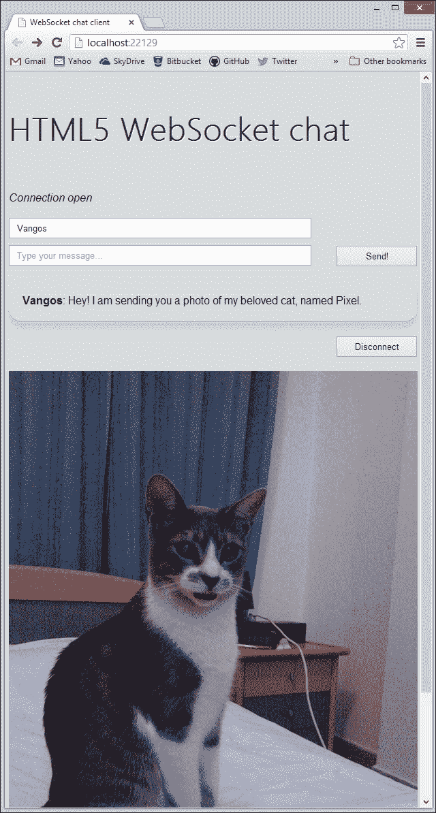

# 第 4 章数据传输-发送、接收和解码

现代 web 开发都是关于内容的。无论你正在构建什么类型的应用程序，用户都会停止使用它，除非他们得到他们想要的。在过去的网络时代，人们可以在其网站上发布的内容极其有限。如今，内容已经远远超过了静态文本和图像；您可以交换消息、观看视频、下载程序等。作为一名 web 开发人员，您应该能够以快速高效的方式交付所需的内容。WebSocket 协议支持多种可转移数据，从而尽可能加快整个过程。

在本章的演示中，您将通过 WebSocket 处理图像和视频数据。让我们开始吧！

# WebSocket 可以传输哪些类型的数据？

WebSocket 协议支持文本和二进制数据。在 JavaScript 中，文本被称为字符串，而二进制数据由 ArrayBuffer 和 Blob 类表示（第一个仍然是实验性的）。使用纯文本和二进制格式，您可以传输和解码几乎任何类型的 HTML5 媒体。

请始终记住，WebSocket 一次只支持一种二进制格式，您必须明确声明如下：

```html
socket.binaryType = "arraybuffer";
```

另一种方法是如下所示：

```html
socket.binaryType = "blob"
```

在本书中，我们将演示使用每种数据类型的具体示例。

## 字符串

在前面的章节中，您已经对传输纯文本数据进行了一瞥，在这里您交换了简单的聊天信息。除此之外，字符串在处理人类可读的数据格式时非常有用，例如**XML**和**JSON**。

请记住，无论何时引发`onmessage`事件，客户端都需要检查数据类型并采取相应的行动。JavaScript 可以使用严格的相等运算符（即`===`）轻松确定数据类型为`string`类型。

```html
socket.onmessage = function(event) {
  if (typeof event.data === "string") {
    console.log("Received string data.");
  }
}
```

如果您对核心 JavaScript 有一般的体验，您可能会注意到，您可以使用以下表达式：

```html
if (event.data instanceof String)
```

虽然这段代码非常有效，但它在您的情况下不起作用。原因是`instanceof`表达式要求左侧的对象是使用 JavaScript 字符串构造函数创建的。在您的例子中，数据是从服务器生成的，因此您只能确定它们的底层类型，而不是它们的 JavaScript 类。

### JSON

**JSON**（**JavaScript 对象表示法**）是用于在计算机之间传输人类可读数据的轻量级格式。它以键值对的形式构造，通常描述属性和值。由于其效率，JSON是服务器和客户端之间传输数据的主要格式。现在最流行的 RESTful API，包括Facebook、Twitter和 Github都完全支持 JSON。此外，JSON 是 JavaScript 的一个子集，因此您可以在不使用外部解析器的情况下立即解析它！

假设 web 服务器以某种方式发送以下 JSON 字符串：

```html
{
"name" : "Vangos Pterneas",
"message" : "Hello world!"
}
```

显然，前面的符号包含两个键值对。你猜怎么着？在聊天演示中，它表示从其他用户接收的聊天数据。您将在几分钟内使用此信息。

以下代码显示了如何处理 JSON 对象并提取其属性：

socket.onmessage=函数（事件）{

```html
  if (typeof event.data === "string") {
    // Create a JSON object.
    var jsonObject = JSON.parse(event.data);

    // Extract the values for each key.
    var userName = jsonObject.name;
    var userMessage = jsonObject.message;
  }
}
```

前面的代码很简单。使用`eval`函数，可以从输入字符串创建 JSON 对象。`eval`真正做的是调用 JavaScript 编译器并执行包含的字符串参数。生成对象的属性是 JSON 键的名称，每个属性都保存其相应的值。

### XML

与 JSON 类似，您可以使用 JavaScript 解析XML 编码的字符串。我们不会深入讨论 XML 解析，因为这超出了本书的范围。解析 XML 并不困难，但对于不同的浏览器需要不同的技术（**DOMParser**与**ActiveXObject**）。最好的方法是使用第三方库，如**jQuery**。

### 注

在 XML 和 JSON 两种情况下，服务器都应该向您发送字符串值，而不是实际的 XML/JSON 文件（当然是二进制类型）！

## 阵列缓冲器

ArrayBuffer包含结构化二进制数据。这里的关键术语是**结构化的**，这意味着封闭的位是按顺序给出的，因此您可以检索其中的部分。为了操作特定格式的 ArrayBuffer，您需要创建相应的`ArrayBufferView`对象。

ArrayBuffers 对于存储图像文件非常方便。假设聊天室的客人可以通过在聊天窗口上拖放图像文件来交换图像。以下代码解释了 JavaScript 如何在 HTML5 浏览器中处理 drop 事件：

```html
document.ondrop = function(event) {
  var file = event.dataTransfer.files[0];
  var reader = new FileReader();

  reader.readAsArrayBuffer(file);

  reader.onload = function() {
    socket.send(reader.result);
  }

  return false;
}
```

在前面的代码段中，首先为 drop 事件创建一个事件处理程序。事件处理程序接受一个参数，该参数允许您访问删除的文件。您只删除一个图像，因此您需要零索引文件。然后，创建一个文件读取器，将文件数据作为 ArrayBuffer 读取。读取器处理完文件后，您将处理`onload`事件，在该事件中，您将使用 WebSocket 将图像发送到 web 服务器。

在[了解有关 FileReader 的更多信息 http://www.html5rocks.com/en/tutorials/file/dndfiles/](http://www.html5rocks.com/en/tutorials/file/dndfiles/) 。

以下是引发 send 方法的 drop 效果的屏幕截图：


将图像拖放到浏览器并将其发送到服务器

以阵列缓冲方式接收数据相当简单。请注意，您使用`instanceof`进行检查，而不是使用严格的相等运算符。

```html
socket.onmessage = function(event) {
  if (event.data instanceof ArrayBuffer) {
    var buffer = event.data;
  }
}
```

## 斑点

**BLOB**（**二进制大对象**）包含最原始的原始数据。从理论上讲，blob 可能是任何东西，甚至是一个非 JavaScript 对象。因此，解释 blob 数据可能相当棘手。根据经验，您最好确切地知道服务器应该发送什么，否则您需要做出相当不具体的假设。

然而，blob 数据的最大优势是其文件大小。二进制格式是机器级格式，所以几乎没有使用会增加其大小的抽象层。

当您通过网络传输多媒体时，您需要尽可能快的速度，以获得最佳的用户体验。WebSocket Blob 不会给您的 Internet 连接带来额外负担，它们依赖于客户端进行正确的解释。

以下代码显示了如何显示作为一组原始位发送的传入图像：

```html
socket.onmessage = function(event) {
  if (event.data instanceof Blob) {
    // 1\. Get the raw data.
var blob = event.data;

    // 2\. Create a new URL for the blob object.
    window.URL = window.URL || window.webkitURL;
    var source = window.URL.createObjectURL(blob);

    // 3\. Create an image tag programmatically.
    var image = document.createElement("img");
    image.src = source;
    image.alt = "Image generated from blob";

    // 4\. Insert the new image at the end of the document.
    document.body.appendChild(image);
  }
}
```

前面的代码段通过正确解释传入的原始数据生成图像。您已经使用了一些全新的 HTML5JavaScript 方法来轻松处理 blob。让我们更具体一点。

首先，验证服务器消息是否是 blob 实例，类似于检查缓冲阵列的方式。然后，将原始数据存储到一个名为`blob`的局部变量中。

为了以图像格式显示 blob，需要对其进行正确解码。新的 JavaScript API 使得基本的图像处理变得轻而易举。不读取字节，而是创建指向指定数据源的普通 URL。只要 HTML文档处于活动状态，此 URL 就处于活动状态。这意味着您在关闭浏览器窗口后无法检索它。

尽管**谷歌 Chrome**将其命名为`window.webkitURL`，但目前所有主流浏览器都支持`window.URL`属性。`createObjectURL`方法为指定为参数的临时文件生成 URL。您不需要提供任何进一步的详细信息或编写任何进一步的代码！JavaScript 将您收到的 blob 表示为普通浏览器 URL！

最后，使用已知的 DOM 操作方法，创建一个图像元素，为其提供新的 URL，并将其插入 HTML 文档的末尾。

### 注

Chrome 23+、Firefox 8+、Internet Explorer 10+、Opera 16+和 Safari 6+以及它们的移动对等设备（IE 和 Opera 除外）都支持`createObjectURL`方法。

尝试一下，您将看到如下屏幕截图：



传入的 blob 数据，显示为 HTML 图像

### 视频流

许多网络设计师和开发者认为网络的未来是视频。到目前为止，视频是使用第三方插件和技术（如 Flash 或 Silverlight）交付的。尽管这些技术在桌面浏览器上运行得很好，但它们需要额外的软件，对移动和平板设备来说是一场灾难（就电池寿命而言）。在苹果决定放弃对 iPhone 和 iPad 的 Flash 支持后，HTML5 成为唯一一个通过网络提供视频和丰富图形的门户。

就 WebSocket 而言，使用快速高效的方式在不同的客户端上传输视频是有意义的。目前，实时视频流被认为是 Flash 仍然存在的最后原因之一。让我们看看如何以 WebSocket 的方式将实时视频数据从服务器流到客户端。

视频不过是连续图像的集合。这些图像中的每一个都被称为**帧**。当每秒显示若干帧（通常超过 20 帧）时，人眼无法区分不同的图像，并将其视为连续的图像流。这就是将视频文件从服务器流式传输到客户端的技术。

服务器每秒发送 20 帧或更多帧（图像），以便客户端不断等待新消息。还记得您为显示图像而编写的代码吗？在实时视频流上下文中，在关闭网页之前，不需要将数据存储为 URL。相反，当您不再使用框架 URL 时，处理它们是一种很好的做法。此外，不需要使用 JavaScript 创建``元素，因为您可以将其放在我们的标记中：

```html

```

…并在 JavaScript 代码中创建引用：

```html
var video = document.getElementById("video");
```

下面是修改后的 onmessage 客户端事件，它将每秒引发 20 次或更多次：

```html
socket.onmessage = function(event) {
  if (event.data instanceof Blob) {
    // 1\. Get the raw data.
var blob = event.data;

    // 2\. Create a new URL for the blob object.
    window.URL = window.URL || window.webkitURL;
    var source = window.URL.createObjectURL(blob);

    // 3\. Update the image source.
    video.src = source;
    // 4\. Release the allocated memory.
    window.URL.revokeObjectURL(source);
  }
}
```

该代码类似于您用来在 HTML 文档上放置图像的代码。有两件事需要注意：

*   您已经为``元素创建了一个引用，以便不断修改其`src`属性。
*   每次`src`赋值后，通过调用`revokeObjectURL`函数释放图像。此函数用于清理分配给指定 URL 的内存，并让浏览器知道不再需要保留 URL 的引用。

以下屏幕截图显示了使用连续帧的视频流：


### 注

尽管这一点很重要，但这可能不是流式传输视频的最佳方式。要了解更专业的方法，请查看 WebRTC（[http://www.webrtc.org](http://www.webrtc.org) ），一个很棒的多媒体开发 API，由 Google、Mozilla 和 Opera 实现。

# 把这一切放在一起

您可能想知道处理请求、接收图像和更新视频帧的服务器代码在哪里。为了专注于客户端 JavaScript 代码，我们特意省略了服务器端部分。对于我们的聊天演示 web 应用程序，我们现在将向您展示客户端和服务器代码。再次注意，您可以使用自己选择的编程语言和框架来实现 WebSocket 服务器。

让我们仔细看看将要实现的新部件。

## 使用 JSON 发送昵称和消息

首先，您将在 HTML 文档中再添加一个文本字段，以便用户键入他/她的首选昵称。您将通过将昵称编码为 JSON 格式，将其与文本消息一起发送。

在消息输入之前添加新的文本输入：

```html
<label id="status-label">Status...</label>
<input type="text" id="name-view" placeholder="Your name" />
<input type="text" id="text-view" placeholder="Type yourmessage..." />
```

然后，创建对 JavaScript 代码的引用：

```html
var nameView = document.getElementById("name-view");
```

最后，将昵称和消息发送到服务器，就像几页前一样！

```html
buttonSend.onclick = function (event) {
  if (socket.readyState == WebSocket.OPEN) {
    var json = "{ 'name' : '" + nameView.value + "', 'message' :
      '" + textView.value + "' }";
    socket.send(json);
    textView.value = "";
  }
}
```

服务器现在需要将此消息传输到客户端。与前一章相比，没有任何更改：

```html
socket.OnMessage = message =>
  {
    // Send the text message to everyone!
    foreach (var client in clients)
      {
        client.Send(message);
      }
  };
```

客户端解码JSON 字符串并相应地显示消息。您已经添加了一个更漂亮的演示样式，用于在聊天区中显示文本。

```html
socket.onmessage = function (event) {
  if (typeof event.data === "string") {
    // Display message.
    var jsonObject = eval('(' + event.data + ')');
    var userName = jsonObject.name;
    var userMessage = jsonObject.message;

    chatArea.innerHTML = chatArea.innerHTML + 
      "<p><strong>" + userName + "</strong>: " + userMessage +
        "</p>";
  }
}
```

## 向服务器发送图像

还记得我们之前讨论过的`ondrop`事件吗？出于一致性原因，以下是使用 Blob 而不是 ArrayBuffers 的相同功能：

```html
document.ondrop = function(event) {
  var file = event.dataTransfer.files[0];

  socket.send(file);

  return false;
}
```

在处理 HTML5 拖放时，请记住始终防止默认的拖放行为！除非明确定义要覆盖默认功能，否则将无法正确显示您实现的任何功能。幸运的是，防止预定义操作发生非常简单：

```html
document.ondragover = function (event) {
  event.preventDefault();
}
```

服务器需要将 blob 映像分发给所有客户端。`Fleck`库引入`OnBinary`事件，在接收到二进制数据时引发：

```html
socket.OnBinary = data =>
  {
    // Send the binary data to everyone!
    foreach (var client in clients)
      {
        client.Send(data);
      }
};
```

方法的工作原理与`OnMessage`方法类似。唯一的区别是它采用字节数组（数据）而不是字符串作为参数。字节数组是最自然、最有效的图像表示形式。

当其他客户端接收到图像时，将创建一个新的``元素。您已经看到了方法，因此您相应地更新了`onmessage`函数：

```html
socket.onmessage = function(event) {
if (typeof event.data === "string") {
  // Decode JSON, then display nickname and message.
  // …
}
  else if (event.data instanceof Blob) {
  // Get the raw data and create an image element.
var blob = event.data;

    window.URL = window.URL || window.webkitURL;
    var source = window.URL.createObjectURL(blob);

var image = document.createElement("img");
    image.src = source;
    image.alt = "Image generated from blob";

    document.body.appendChild(image);
  }
}
```

# 总结

在本章中，您详细了解了 WebSocket 协议支持的各种数据格式。您使用字符串和二进制数据（文本、图像和视频）实现了各种示例，了解了如何正确编码和解码客户端数据，并最终扩展了聊天演示以处理图像和视频。下一章将讨论网络上的安全注意事项，这将使您的应用程序更加健壮。