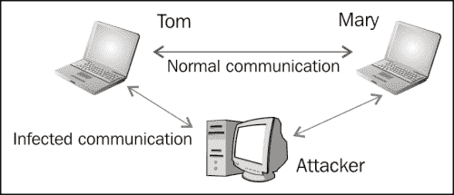
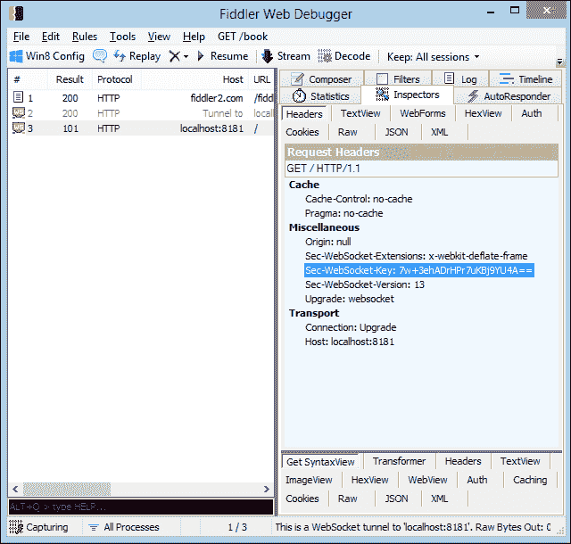
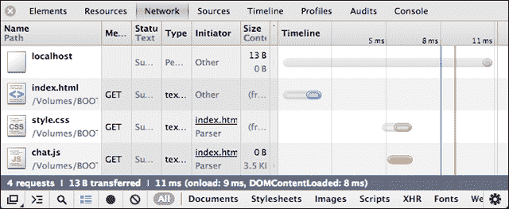

# 五、安全

安全性是交换数据的 web 应用的关键问题。在网络上生存和呼吸的每个网站或应用都会受到人类或机器人入侵者的攻击。这是一个悲伤但真实的现实，我们都必须接受它。

当然，这并不意味着你的网络应用是完全不安全的。幸运的是，本机 HTML5 安全机制可以在不进行任何配置的情况下保护您免受最常见的安全攻击。此外，WebSocket 协议被设计为一种安全服务，因此基本的保护是有保证的。

在本章中，我们将介绍 WebSocket 应用可能存在的一些已知安全风险，并为您的用户提供预防、应对和克服这些风险的工具和知识。

# WebSocket 标题

你通常不会与陌生人或不愿透露身份的人握手。在 WebSocket 世界中，您需要确定请求的来源。**来源**是从客户端发送的标头，对于跨域通信至关重要，因为它允许 web 服务器拒绝特定连接。Origin 是 WebSocket 中介绍和记录的第一个也是最重要的安全方面。

允许客户端升级到 WebSocket 协议还需要几个头。这样的头以一个`Sec-`前缀开始，并保证每个 WebSocket 请求都将通过 WebSocket 构造函数初始化，而不是通过任何 HTTP API 初始化，后者可能希望访问交换的信息。

以下是从客户端发送的 WebSocket 头的示例：

```html
GET /chat HTTP/1.1
Host: server.example.com
Upgrade: websocket
Connection: Upgrade
Origin: http://example.com
Pragma: no-cache
Cache-Control: no-cache
Sec-WebSocket-Key: AAf/gvkPw6szicrMH3Rwbg==
Sec-WebSocket-Version: 13
Sec-WebSocket-Extensions: x-webkit-deflate-frame
```

`Sec-WebSocket-Version`参数可以帮助您识别所使用的浏览器。如果您需要针对特定浏览器进行特定调整，请小心。来自服务器的相应握手应如下所示：

```html
HTTP/1.1 101 Switching Protocols
  Upgrade: websocket
  Connection: Upgrade
  Sec-WebSocket-Accept: s3pPLMBiTxaQ9kYGzzhZRbK+xOo=
```

如果您对更多的理论细节感兴趣，请随时阅读 RFC 6455 的完整规范，网址为[http://tools.ietf.org/html/rfc6455](http://tools.ietf.org/html/rfc6455) 。

# 常见攻击

目前，您需要知道的是，该协议设计为尽可能安全。不过要小心！WebSocket是一个全新的协议，并不是所有的 web 浏览器都能正确实现它。例如，其中一些仍然允许混合使用 HTTP 和 WS，尽管规范暗示了相反的含义。一切都可能发生变化，在等待浏览器成熟的同时，您可以自己轻松地采用一些保护技术。

因此，旧的学校问题没有得到解决。还记得那些嗅探 HTTP 并拦截 web 流量的坏人吗？嗯，WS 也可以用同样的方式进行嗅探。

以下是一些您需要注意的常见安全攻击，以及一些保护您的应用和用户的方法。

## 拒绝服务

**拒绝服务****拒绝服务**攻击试图使请求机器或网络资源的用户无法使用该机器或网络资源。想象一下，有人向 web 服务器发出无限多的请求，没有时间间隔或时间间隔很小。显然，服务器将无法处理每个连接，并且将停止响应或响应速度太慢。这是拒绝服务攻击的最简单形式。

没有必要提及这对最终用户来说是多么令人沮丧，他们甚至无法加载网页。

DoS 攻击甚至可以应用于点对点通信，迫使 P2P 网络的客户端同时连接到受害 web 服务器。

下图描述了一个DoS 攻击：


拒绝服务攻击

## 中间人

假设你正在通过 IM 客户端与女友聊天。她的前男友想查看你们交换的信息，所以他会与你们两人建立独立的联系并嗅探你们的信息。他还向你和你的女朋友发送信息，作为你交流的无形中介。这就是所谓的中间人攻击。中间人攻击对于未加密的连接更容易，因为入侵者可以直接读取包。当连接被加密时，信息必须由攻击者解密，这可能太难了。

从技术角度看，攻击者拦截公钥消息交换并发送消息，同时用自己的密钥替换请求的密钥。

显然，使攻击者的工作变得困难的可靠策略是将 SSH 与 WebSocket 一起使用。通常在交换关键数据时，更喜欢 WSS 安全连接，而不是未加密的 WS。

下图描述了间谍如何干扰和获取数据：



中间人攻击

**跨站点脚本**（**XSS**是一个漏洞，使得攻击者能够将客户端脚本注入网页或应用。攻击者可以使用您的应用集线器发送 HTML 或 JavaScript 代码，并让这些代码在客户机上执行。

在填写 web 表单时，您可能会遇到最简单的 XSS 攻击形式。假设有人使用我们开发的聊天应用发送以下数据：

```html

```

试试看！在消息文本字段中键入前面的行，单击**发送**并等待结果。

下图显示了对 WebSocket 聊天应用的 XSS 攻击：


虽然在聊天应用中图像传输一点也不差，但用户通过注入 HTML 代码发送图像。以类似的方式，有人可能执行 JavaScript 代码并破坏对话。

我们能做什么？考虑到关于 XSS 攻击的旧规则仍然有效，这是最佳实践。您可以做的事情是检查代码中的 HTML 实体或 JavaScript 语法，并用适当的表示替换它们，或者干脆拒绝它们。

[https://www.owasp.org/index.php/XSS_Filter_Evasion_Cheat_Sheet 如果您想了解 XSS 攻击的各个方面，以及如何避免 XSS 攻击，](https://www.owasp.org/index.php/XSS_Filter_Evasion_Cheat_Sheet)包含了更多的信息。

# WebSocket 原生防御机制

默认情况下，WebSocket 协议设计为安全的。在现实世界中，您可能会遇到由于浏览器实现不佳而可能出现的各种问题。不过没必要担心。随着时间的推移，浏览器供应商会立即修复任何问题，如果您仍然感到害怕，您可以随时使用一些老式的回退技术（将在下一章中介绍）。

## SSH/TLS

正如您可能已经猜到的，当您通过 SSH（或 TLS）使用安全 WebSocket 连接时，会添加额外的安全层。还记得什么时候需要决定 HTTP 和 HTTPS 吗？您仅在交易绝对必要时（例如，银行帐户信息、私人数据等）才选择 HTTPS。否则，HTTP 就是一条出路，因为它更加轻量级和快速。HTTPS 需要更多的 CPU 资源，并且比 HTTP 慢得多。

在 WebSocket 世界中，您不需要担心安全连接的性能。尽管上面还有一个额外的 TLS 层，但协议本身包含了针对这种用途的优化，而且，WSS 通过代理更灵活地工作。

## 客户端到服务器屏蔽

在 WebSocket 服务器和 WebSocket 客户端之间传输的每一条消息都包含一个名为**屏蔽密钥**的特定密钥，该密钥允许任何符合 WebSocket 的中介机构解除屏蔽并检查该消息。如果中介不符合 WebSocket，则消息不会受到影响。屏蔽由实现 WebSocket 协议的浏览器处理。

# 安全工具箱

最后，我们提供了一些有用的工具，帮助您调查 WebSocket 客户端和服务器之间的信息流，分析交换的数据，并识别可能的风险。

## 小提琴手

**Fiddler**是监控网络活动和检查任何传入或传出数据的流量的绝佳工具。

以下屏幕截图显示了 fiddler 的操作，显示了 WebSocket 标题：



小提琴手可从[下载http://www.fiddler2.com/fiddler2/](http://www.fiddler2.com/fiddler2/)

## 线框

**Wireshark**是一款网络数据包分析仪，它能够捕获数据包并尽可能准确地显示数据包。

以下屏幕截图显示 wireshark 正在运行：


Wireshark 可从[下载http://www.wireshark.org/](http://www.wireshark.org/)

## 浏览器开发工具

就开发者支持而言，Chrome、Firefox 和 Opera 是非常好的浏览器。他们的内置工具帮助我们确定客户端交互和资源的几乎所有方面。

以下屏幕截图显示了运行中的 Chrome 开发者工具：



## “T0”：ZAP

**ZAP**是一种渗透测试工具，可通过对您的 web 应用和网站执行攻击来发现其漏洞！与前面的所有工具一样，ZAP 提供了一个方便的 GUI 可视化。

下面的屏幕截图显示了 ZAP 的作用：


ZAP 可从[下载https://code.google.com/p/zaproxy/](https://code.google.com/p/zaproxy/)

# 总结

在本章中，您调查了您的 web 应用必须注意的各种安全威胁，了解了内置的 WebSocket 安全机制，并介绍了一些帮助我们更好地管理网络传输的流行工具。接下来，我们将描述一些针对缺乏完整或部分 WebSocket 支持的浏览器的回退技术。