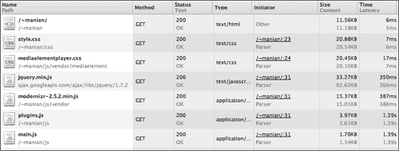
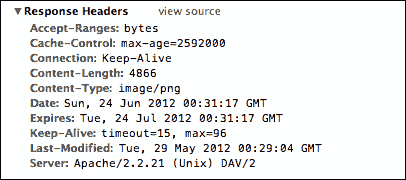
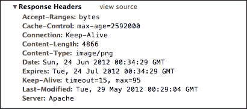

# 第五章。定制阿帕奇服务器

我们的日月沙节现场或多或少都做了！但是在我们将其部署到生产环境之前，让我们确保我们已经优化了页面和相关文件的服务器配置，以便最终用户可以尽快加载页面，同时我们检查可能导致我们的网站被黑客攻击的安全漏洞。

# 服务器端配置

在我们进一步讨论之前，让我们简单了解一下服务器的功能。服务器理解浏览器对你的站点页面的请求，然后寻找网址请求的文件。然后，服务器将该文件连同称为 HTTP 头的附加信息一起发送回浏览器。 **Apache** 是最受欢迎的网站服务器软件，HTML5 样板附带了一个名为`.htaccess`的 Apache 配置文件。

# 设置阿帕奇服务器

在我们查看 HTML5 Boilerplate 提供的 Apache 配置文件的各种特性之前，让我们设置一个本地 Apache 服务器，这样我们就可以看到这些特性在起作用。

## 安装阿帕奇

我们将看看 Apache 在苹果、视窗和 Linux 上的安装。

### Mac

你不必做任何特别的事情；阿帕奇已经安装了。但是要在这个项目中使用它，请确保将所有文件复制到个人文件夹(`/~<username>`)中的网站文件夹中。编辑`/etc/apache2/httpd.conf`文件以更改以下突出显示的代码:

```html
<Directory /usr/share/web>
AllowOverride None
        Options MultiViewsFollowSymlinks
        Order allow,deny
        Allow from all
        Header Set Cache-Control no-cache
</Directory>
```

致:

```html
<Directory /usr/share/web>
AllowOverrideAll
 Options MultiViewsFollowSymlinks
        Order allow,deny
        Allow from all
        Header Set Cache-Control no-cache
</Directory>
```

您还将需要以同样的方式在`/etc/apache2/<username>.conf`中更改该条目。

### 窗户

你需要在 Windows 上下载安装 Apache 可以从`httpd.apache.org/docs/2.2/platform/windows.html`下载。请注意，您需要将以下代码片段添加到`conf/httpd.conf`，该代码片段位于找到 Apache 应用的文件夹中:

```html
<Directory "/apache/htdocs/">
AllowOverride All
Options None
Order deny, allow
</Directory>
```

### Linux

如果你是使用 Ubuntu 的，在[https://help.ubuntu.com/8.04/serverguide/C/httpd.html](https://help.ubuntu.com/8.04/serverguide/C/httpd.html)有一个友好的文档。要启用用于配置您的 Apache 服务器的`.htaccess`文件，您需要从以下代码片段中编辑`/etc/apache2/sites-available/default`:

```html
<Directory /var/www/>
Options Indexes FollowSymLinksMultiViews
AllowOverride None
   Order allow,deny
allow from all
   # Uncomment this directive is you want to see apache2's
   # default start page (in /apache2-default) when you go to /
   #RedirectMatch ^/$ /apache2-default/
</Directory>
```

到下面的代码片段:

```html
<Directory /var/www/>
Options Indexes FollowSymLinksMultiViews
AllowOverrideAll
   Order allow,deny
allow from all
   # Uncomment this directive is you want to see apache2's
   # default start page (in /apache2-default) when you go to /
   #RedirectMatch ^/$ /apache2-default/
</Directory>
```

## 配置阿帕奇

我们的 HTML5 样板文件夹包含一个名为`.htaccess`的文件。由于文件名以`.`开头，当您在 Finder/Windows Explorer 或其他文件管理器实用程序中列出文件时，`.htaccess`可能不会出现，如下图所示:


但是，如果您让隐藏文件出现在您的操作系统上，您将能够看到这个文件。

现在只需要将我们的站点文件(包括`.htaccess`文件)移动到我们刚刚设置的服务器上。Apache 会在所有文件夹中寻找一个`.htaccess`文件(除非配置设置告诉不要这样做)，所以将我们的`.htaccess`文件放在我们站点的父文件夹中就可以了。

一般来说，使用`.htaccess`文件进行测试并不是一个坏主意。但是，如果你想让你的网站真正的 zippy，最好把配置直接放在 Apache 服务器的主配置文件(`httpd.conf`)上。不幸的是，并不是所有的主机提供商都允许这样做。

如果您可以访问 Apache 服务器的主配置文件(`httpd.conf`)，您应该从 HTML5 的`.htaccess`文件中复制配置，并将它们放在`httpd.conf`内的`Directory`标签中，如以下代码片段所示:

```html
<Directory /path/to/website/root>
[htaccess rules]
</Directory>
```

然后，您应该删除`.htaccess`文件，因为指令已经在服务器的主配置文件中。

# 开箱即用的功能

HTML5 样板文件`.htaccess`提供的大部分优势并不是马上就能显现出来的。如果您的网站流量很低，并且没有发出太多的网络请求，您可能不会注意到使用 HTML5 样板文件`.htaccess`的任何显著差异。然而，当你有高活动峰值时(并不罕见！)或者突然有很多网络请求你的网站需要的图片和视频，HTML5 的`.htaccess`会自动来救你。

只要您在项目文件夹中放入一个`.htaccess`文件，或者如前所述设置 Apache 的主配置文件，所有这些功能都是可用的。

## 去除 ETags

**实体标签** ( **ETags** ) 验证浏览器缓存中的组件(即图像、文件等)是否与服务器上的组件匹配。不幸的是，ETags 弊大于利。大多数服务器默认情况下都有 ETags 可用，这就是 HTML5 Boilerplate 的服务器配置文件阻止服务器为它们提供服务的原因，如以下代码片段所示:

```html
<IfModule mod_headers.c>
  Header unset ETag
</IfModule>
FileETag None
```

### 注

史蒂夫·索德斯在`developer.yahoo.com/blogs/ydn/posts/2007/07/high_performanc_11/`中深入地写道，为什么 ETags 不能解决它们被设计的问题，为什么你应该移除它们。

## Gzip 组件

**Gzip** 是最流行的压缩方法。通过使用 Gzip 压缩您的文件，您可以确保您的文件传输更快，即使是低带宽连接。有时节省高达 70%的文件大小，这是一个很好的默认性能配置。

让我们看看如果没有我们的`.htaccess` Gzip 功能，我们的文件有多大。为此，我们只需注释掉该部分，如下面的代码片段所示:

```html
#<IfModule mod_deflate.c>
#
#  # Force deflate for mangled headers developer.yahoo.com/blogs/ydn/posts/2010/12/pushing-beyond-gzipping/
#  <IfModule mod_setenvif.c>
#    <IfModule mod_headers.c>
#      SetEnvIfNoCase ^(Accept-EncodXng|X-cept-Encoding|X{15}|~{15}|-{15})$ ^((gzip|deflate)\s*,?\s*)+|[X~-]{4,13}$ #HAVE_Accept-Encoding
#      RequestHeader append Accept-Encoding "gzip,deflate" env=HAVE_Accept-Encoding
#    </IfModule>
#  </IfModule>
#
#  # HTML, TXT, CSS, JavaScript, JSON, XML, HTC:
#  <IfModule filter_module>
#    FilterDeclare   COMPRESS
#    FilterProvider  COMPRESS  DEFLATE resp=Content-Type $text/html
#    FilterProvider  COMPRESS  DEFLATE resp=Content-Type $text/css
#    FilterProvider  COMPRESS  DEFLATE resp=Content-Type $text/plain
#    FilterProvider  COMPRESS  DEFLATE resp=Content-Type $text/xml
#    FilterProvider  COMPRESS  DEFLATE resp=Content-Type $text/x-component
#    FilterProvider  COMPRESS  DEFLATE resp=Content-Type $application/javascript
#    FilterProvider  COMPRESS  DEFLATE resp=Content-Type $application/json
#    FilterProvider  COMPRESS  DEFLATE resp=Content-Type $application/xml
#    FilterProvider  COMPRESS  DEFLATE resp=Content-Type $application/xhtml+xml
#    FilterProvider  COMPRESS  DEFLATE resp=Content-Type $application/rss+xml
#    FilterProvider  COMPRESS  DEFLATE resp=Content-Type $application/atom+xml
#    FilterProvider  COMPRESS  DEFLATE resp=Content-Type $application/vnd.ms-fontobject
#    FilterProvider  COMPRESS  DEFLATE resp=Content-Type $image/svg+xml
#    FilterProvider  COMPRESS  DEFLATE resp=Content-Type $image/x-icon
#    FilterProvider  COMPRESS  DEFLATE resp=Content-Type $application/x-font-ttf
#    FilterProvider  COMPRESS  DEFLATE resp=Content-Type $font/opentype
#    FilterChain     COMPRESS
#    FilterProtocol  COMPRESS  DEFLATE change=yes;byteranges=no
#  </IfModule>
#
#  <IfModule !mod_filter.c>
#    # Legacy versions of Apache
#    AddOutputFilterByType DEFLATE text/html text/plain text/css application/json
#    AddOutputFilterByType DEFLATE application/javascript
#    AddOutputFilterByType DEFLATE text/xml application/xml text/x-component
#    AddOutputFilterByType DEFLATE application/xhtml+xml application/rss+xml application/atom+xml
#    AddOutputFilterByType DEFLATE image/x-icon image/svg+xml application/vnd.ms-fontobject application/x-font-ttf #font/opentype
#  </IfModule>
#
#</IfModule>
```

现在，让我们看看通过浏览器开发工具(在本例中是 Chrome 开发工具)中可用的网络工具传递到我们浏览器的文件的大小:



现在，让我们通过启用 Gzip，通过从行首移除`#`来启用`.htaccess`中的适当规则。请注意差异，如下图所示:


如果你想了解更多关于 Gzip，[第 4 章](04.html "Chapter 4. Adding Interactivity and Completing Your Site")、*更小的组件，速度之书，斯托扬·斯特凡诺夫*，在[www.bookofspeed.com/chapter4.html](http://www.bookofspeed.com/chapter4.html)找到，将是一个很好的起点。

## 使用 Expires 头来更好地控制缓存

服务器可以向浏览器指示它们可以在缓存中保存文件多长时间。这对于不经常更改的静态文件非常有用，并且会减少页面加载时间。HTML5 样板的`.htaccess`文件有一组大多数静态文件的默认值，如下面的代码片段所示:

```html
<IfModule mod_expires.c>
ExpiresActive on

# Perhaps better to whitelist expires rules? Perhaps.
ExpiresDefault                          "access plus 1 month"

# cache.appcache needs re-requests in FF 3.6 (thanks Remy ~Introducing HTML5)
ExpiresByType text/cache-manifest       "access plus 0 seconds"

# Your document html
ExpiresByType text/html                 "access plus 0 seconds"

# Data
ExpiresByType text/xml                  "access plus 0 seconds"
ExpiresByType application/xml           "access plus 0 seconds"
ExpiresByType application/json          "access plus 0 seconds"

# Feed
ExpiresByType application/rss+xml       "access plus 1 hour"
ExpiresByType application/atom+xml      "access plus 1 hour"

# Favicon (cannot be renamed)
ExpiresByType image/x-icon              "access plus 1 week"

# Media: images, video, audio
ExpiresByType image/gif                 "access plus 1 month"
ExpiresByType image/png                 "access plus 1 month"
ExpiresByType image/jpg                 "access plus 1 month"
ExpiresByType image/jpeg                "access plus 1 month"
ExpiresByType video/ogg                 "access plus 1 month"
ExpiresByType audio/ogg                 "access plus 1 month"
ExpiresByType video/mp4                 "access plus 1 month"
ExpiresByType video/webm                "access plus 1 month"

# HTC files  (css3pie)
ExpiresByType text/x-component          "access plus 1 month"

# Webfonts
ExpiresByType application/x-font-ttf    "access plus 1 month"
ExpiresByType font/opentype             "access plus 1 month"
ExpiresByType application/x-font-woff   "access plus 1 month"
ExpiresByType image/svg+xml             "access plus 1 month"
ExpiresByType application/vnd.ms-fontobject "access plus 1 month"

# CSS and JavaScript
ExpiresByType text/css                  "access plus 1 year"
ExpiresByType application/javascript    "access plus 1 year"
</IfModule>
```

这告诉服务器在文本`"access plus…"`指定的时间段内，一旦新访问了每种类型的文件，就缓存对该文件的请求。例如，考虑以下代码片段:

```html
# CSS and JavaScript
ExpiresByType text/css                  "access plus 1 year"
ExpiresByType application/javascript    "access plus 1 year"
```

这个片段让服务器告诉浏览器，请求 CSS 和 JavaScript 文件，从第一次被访问起缓存这些文件至少一年，除非用户故意清除它们的缓存。

### 注

雅虎加速你的网站的最佳实践有一个详细的解释，过期标题在`developer.yahoo.com/performance/rules.html#expires`做什么。

## 自定义 404 页

HTML5 样板提供了一个名为`404.html`的自定义 404 页。但是，这将永远不会被使用，除非服务器知道每次找不到资源时都提供这个文件。HTML5 样板文件`.htaccess`的配置告诉服务器使用该文件，如下所示:

```html
ErrorDocument 404 /404.html
```

确保使用完整路径参考`404.html`。例如，在苹果电脑上，完整路径是`/~<username>/404.html`，如果你把它放在你的`<username>`文件夹下的网站文件夹中。

以下截图显示了当使用 HTML5 样板的`.htaccess`文件时，浏览器如何呈现默认的 HTML5 样板 404 页面:


## 强制最新 IE 版本

Internet Explorer 利用一个`meta`标签来决定它是应该以兼容模式渲染一个站点，还是使用最新的渲染引擎来渲染它。

谷歌 Chrome 发布了一个名为 **Chrome Frame** 的插件，可从[https://developers.google.com/chrome/chrome-frame/](https://developers.google.com/chrome/chrome-frame/)下载，如果安装在用户的电脑上，当用户使用旧版本的 Internet Explorer 时，将提供现代浏览器的体验。当您的网页正在旧版本的 Internet Explorer 上查看时，您的网站可以选择在用户的计算机上使用此插件。要自动选择使用该插件，请将`", chrome=1"`追加到`http-equiv` `meta`标签的`content`属性值中。

这个标记可以在 HTML 文件本身中设置，这就是 HTML5 样板所做的，如下面的代码片段所示:

```html
<meta http-equiv="X-UA-Compatible" content="IE=edge,chrome=1">
```

然而，由于 HTML5 样板在`html`标签周围使用了条件注释，IE 将在**兼容性视图**中呈现 HTML，而不是使用 Chrome Frame。因此，在`html`标签周围使用带有条件注释的`meta`标签是行不通的。HTML5 的样板文件。`htaccess`文件将其设置为 HTTP 头，如以下代码片段所示:

```html
<IfModule mod_headers.c>
  Header set X-UA-Compatible "IE=Edge,chrome=1"
  # mod_headers can't match by content-type, but we don't want to send this header on *everything*...
<FilesMatch "\.(js|css|gif|png|jpe?g|pdf|xml|oga|ogg|m4a|ogv|mp4|m4v|webm|svg|svgz|eot|ttf|otf|woff|ico|webp|appcache|manifest|htc|crx|oex|xpi|safariextz|vcf)$" >
    Header unset X-UA-Compatible
</FilesMatch>
</IfModule>
```

这迫使 IE 尊重发送的 HTTP 头，并使用最新的渲染引擎，而不管`meta`标签状态如何。你也可以设置 IE 使用任何你喜欢的渲染引擎。我们在[附录](08.html "Appendix A. You Are an Expert,Now What?")、*中深入讨论了这个特性，你是专家，现在是什么？*，在*一节下什么是 meta x-ua 兼容？*。

### 注

大量详细的测试和评论让我们决定推荐这种方法来设置 IE 兼容性模式，这可以从位于[github.com/h5bp/html5-boilerplate/issues/378](http://github.com/h5bp/html5-boilerplate/issues/378)的 Github 上的**问题跟踪器**获得。

## 使用 UTF-8 编码

字符编码是用字节序列表示文本数据的一种方式。不同的脚本有不同的标准，例如希腊语、日语等，但是创建 HTML 规范的标准机构 W3C 强烈支持使用**UTF-8**T4 作为网络上所有文本的实际编码方案，以确保所有浏览器都能正确呈现您的文本数据。`.htaccess`文件以如下方式设置:

```html
# Use UTF-8 encoding for anything served text/plain or text/html
AddDefaultCharset utf-8
# Force UTF-8 for a number of file formats
AddCharset utf-8 .css .js .xml .json .rss .atom
```

### 注

Edward Z. Yang 在`htmlpurifier.org/docs/enduser-utf8.html#whyutf8;`写了一篇关于为什么-8 是字符编码的最佳选择的信息性帖子，如果你对这个话题感兴趣，值得一读。

## 提供正确的哑剧类型

作为 HTTP 头发送的**多用途互联网邮件扩展** ( **MIME** )类型帮助浏览器决定如何处理发送的内容。例如，浏览器需要知道文件何时是样式表，何时是可下载的文本文档。该信息由服务器在发送该资源时返回的 MIME 类型 HTTP 头提供。HTML5 样板文件的`.htaccess`文件确保您的服务器在提供内容时提供正确的 MIME 类型。

例如，在我们的塞内加尔音乐节网站上，我们需要我们的网页字体被浏览器理解为字体文件，而不是乱码文本。在我们的 HTML5 样板文件`.htaccess`中，以下几行确保服务器返回正确的 MIME 类型，以便浏览器可以做到这一点:

```html
AddType application/vnd.ms-fontobjecteot
AddType application/x-font-ttfttfttc
AddType font/opentypeotf
AddType application/x-font-woffwoff
```

### 注

更多关于 MIME 类型的信息可以在`developer.mozilla.org/en/Properly_Configuring_Server_MIME_Types#What_are_MIME_types.3F`的 **Mozilla 开发者网络**上找到。

## 阻止对隐藏文件夹的访问

如果您使用**版本控制系统** ( **VCS** )来管理您网站的代码，则用于管理版本控制的隐藏文件夹(`.git`或`.svn`)也可能存在于您的生产服务器中。你不希望任何人访问这些文件，并找到任何可能被用来黑你的网站的信息。HTML5 样板文件阻止服务器在`.htaccess`文件中提供这些文件夹所请求的内容，如以下代码片段所示:

```html
# Block access to "hidden" directories whose names begin with a period. This
# includes directories used by version control systems such as Subversion or Git.
<IfModule mod_rewrite.c>
RewriteCond %{SCRIPT_FILENAME} -d
RewriteCond %{SCRIPT_FILENAME} -f
RewriteRule "(^|/)\." - [F]
</IfModule>
```

## 阻止对备份和源文件的访问

如果你在服务器上备份了你的数据库，例如`database.sql.bak`，你也不希望任何人访问它，也不希望日志文件或你的任何源文件，例如用于徽标的 Photoshop 文件——我们知道这种情况会发生！`.htaccess`文件中的以下代码阻止访问这些文件:

```html
# Block access to backup and source files
# This files may be left by some text/html editors and
# pose a great security danger, when someone can access them
<FilesMatch "(\.(bak|config|sql|fla|psd|ini|log|sh|inc|swp|dist)|~)$">
  Order allow,deny
  Deny from all
  Satisfy All
</FilesMatch>
```

这告诉服务器寻找以下列任何扩展名结尾的文件:`<filename>.bak`、`<filename>.config`等，如果是，拒绝处理对这些文件的请求。它将返回一个`403 Forbidden`错误。

## 启动重写引擎

Apache 服务器要求您在进行任何网址重写之前启动重写引擎。HTML5 样板文件`.htaccess`实现了这一点，如下面的代码片段所示:

```html
<IfModule mod_rewrite.c>
  Options +FollowSymlinks
RewriteEngine On
# RewriteBase /
</IfModule>
```

如果您的站点位于子文件夹中，请从`RewriteBase`行中删除`#`，并将其设置为从根目录到子文件夹的完整路径。

## 防止不存在的重定向文件夹出现 404 个错误

在 Apache 中，如果您想将从不存在的路径请求的网址重定向到另一个路径，您需要禁用`MultiViews`。

例如，如果您有一个传入到`http://example.com/beaches/10`的请求，并且您希望它在内部重定向到`http://example.com/index.php?q=10`，而文件夹`beaches`在您网站的根文件夹中不存在，Apache 会抛出一个错误。HTML5 样板文件的`.htaccess`文件通过使用以下代码语句来防止这种情况发生:

```html
Options -MultiViews
```

# 附加定制

提供了许多额外的定制，但被注释掉了，因为它们需要仔细考虑，有时可能会产生不必要的影响。

## 压制或强迫“www”在网址的开头

我们大多数人都没有意识到`http://example.com`和`http://www.example.com`被搜索引擎当成了两个独立的网站。你可以强制将网址重写为 www 或者非 www。我更喜欢非 www 网址，因为它短了三个字符！

HTML5 的样板文件`.htaccess`为你提供了两种选择。默认情况下，配置会强制服务器将`http://www.example.com`的请求重写为`http://example.com`。如果您喜欢反过来，让服务器将`http://example.com`的请求重写为`http://www.example.com`，如以下步骤所述:

1.  注释掉以下代码片段中显示的默认选项:

    ```html
    # Option 1:
    # Rewrite "www.example.com -> example.com"
    <IfModule mod_rewrite.c>
      RewriteCond %{HTTPS} !=on
      RewriteCond %{HTTP_HOST} ^www\.(.+)$ [NC]
      RewriteRule ^ http://%1%{REQUEST_URI} [R=301,L]
    </IfModule>
    ```

2.  The commented-out default section should now look like the following code snippet:

    ```html
    # Option 1:
    # Rewrite "www.example.com -> example.com"

    # <IfModule mod_rewrite.c>
    #  RewriteCond %{HTTPS} !=on
    #  RewriteCond %{HTTP_HOST} ^www\.(.+)$ [NC]
    #  RewriteRule ^ http://%1%{REQUEST_URI} [R=301,L]
    #</IfModule>
    ```

    正如你可能注意到的，我们所做的只是在每一行前添加一个`#`字符和一个空格。

3.  现在，我们将通过取消注释来启用第二个选项。通过取消注释来更改以下代码片段:

    ```html
    # Option 2:
    # To rewrite "example.com -> www.example.com" uncomment the following lines.
    # Be aware that the following rule might not be a good idea if you
    # use "real" subdomains for certain parts of your website.

    # <IfModule mod_rewrite.c>
    #   RewriteCond %{HTTPS} !=on
    #   RewriteCond %{HTTP_HOST} !^www\..+$ [NC]
    #   RewriteRule ^ http://www.%{HTTP_HOST}%{REQUEST_URI} [R=301,L]
    # </IfModule>
    ```

4.  The uncommented code section should look like the following code snippet:

    ```html
    # Option 2:
    # To rewrite "example.com -> www.example.com" uncomment the following lines.
    # Be aware that the following rule might not be a good idea if you
    # use "real" subdomains for certain parts of your website.

    <IfModule mod_rewrite.c>
    RewriteCond %{HTTPS} !=on
    RewriteCond %{HTTP_HOST} !^www\..+$ [NC]
    RewriteRule ^ http://www.%{HTTP_HOST}%{REQUEST_URI} [R=301,L]
    </IfModule>
    ```

    我们所做的只是删除了`#`字符和以`<IfModule mod_rewrite.c>`开头、以`</IfModule>`结尾的行前空格。

无论您想使用哪个选项，请确保您没有同时启用这两个选项，因为这将阻止 Apache 为您的页面提供服务。

## 从 iFrames 设置饼干

IE 通常会阻止 IFrame 中设置的 cookies。如果你要求设置这样的 cookies，特别是有广告或者社交网络插件的话，需要发一个**隐私偏好项目平台** ( **P3P** )头。

在`.htaccess`文件中查找与本节标题文本相同的注释，并更改以下行:

```html
# <IfModule mod_headers.c>
#   Header set P3P "policyref=\"/w3c/p3p.xml\", CP=\"IDC DSP COR ADM DEVi TAIi PSA PSD IVAi IVDi CONi HIS OUR IND CNT\""
# </IfModule>
```

到下面的代码片段:

```html
<IfModule mod_headers.c>
  Header set P3P "policyref=\"/w3c/p3p.xml\", CP=\"IDC DSP COR ADM DEVi TAIi PSA PSD IVAi IVDi CONi HIS OUR IND CNT\""
</IfModule>
```

### 注

埃里克·劳详细描述了 IE 的 cookie 政策，这有助于在`blogs.msdn.com/b/ieinternals/archive/2009/08/20/wininet-ie-cookie-internals-faq.aspx`阅读。

## PHP 安全默认值

如果您正在提供 PHP，HTML5 样板文件`.htaccess`中有很多配置选项可以让您的 PHP 安装更加安全。如果您正在使用 PHP，您可以使用与标题为*的章节中概述的相同过程来打开它们，抑制或强制“www”*网址开头。

鉴于我们没有在网站中使用 PHP，我们不需要打开它们。

## 停止阿帕奇版广告

您可以阻止 Apache 宣传其版本，以减少恶意程序员利用特定版本漏洞的机会。以下是 Apache 版本的宣传方式:



上一张截图显示了作为 HTTP 头发送到浏览器的 Apache 版本号。

### 注

您可以使用大多数浏览器附带的开发工具来验证 HTTP 头。在这种情况下，我们使用的是 Chrome 的开发者工具**资源**标签。更多关于如何使用这个工具的信息可以在 Chrome 的帮助中心`developers.google.com/chrome-developer-tools/docs/network`找到。

这需要从服务器的主配置文件中进行配置，我们不能从`.htaccess`文件中进行配置。因此，让我们从 HTML5 样板文件`.htaccess`中删除以下指令，并替换在`/etc/apache2/httpd.conf`中找到的指令(如果您使用的是 Windows 或 Linux，该文件的路径会有所不同):

```html
ServerTokens Prod
```

下面的截图显示了在将配置值应用到 Apache 服务器的主配置文件后，Apache 发送的无版本 HTTP 头:



## 允许从特定的 JS 和 CSS 文件中进行连接

有时，您可能希望服务器在发出请求时将多个脚本或样式表文件合并到一个响应中。请注意，这样做并不能加快页面的加载速度，因为服务器会花费自己的时间将这些文件拼接在一起。

这是我建议你最后考虑的一个选择，当所有其他解决方案都失败了。理想情况下，你不应该这样做。

为此，首先取消`.htaccess`文件中以下行的注释:

```html
#<FilesMatch "\.combined\.js$">
#  Options +Includes
#  AddOutputFilterByType INCLUDES application/javascript application/json
#  SetOutputFilter INCLUDES
#</FilesMatch>
#<FilesMatch "\.combined\.css$">
#  Options +Includes
#  AddOutputFilterByType INCLUDES text/css
#  SetOutputFilter INCLUDES
#</FilesMatch>
```

到下面的代码片段:

```html
<FilesMatch "\.combined\.js$">
  Options +Includes
AddOutputFilterByType INCLUDES application/javascript application/json
SetOutputFilter INCLUDES
</FilesMatch>
<FilesMatch "\.combined\.css$">
  Options +Includes
AddOutputFilterByType INCLUDES text/css
SetOutputFilter INCLUDES
</FilesMatch>
```

然后，在`js`文件夹中，创建一个名为`script.combined.js`的文件。

在文本编辑器中打开`script.combined.js`文件，对`script.combined.js`文件中所有需要组合输出的文件使用以下语法:

```html
#   <!--#include file="<path/to/file.js>" -->
#   <!--#include file="<path/to/another-file.js>" -->
```

如果您希望动态组合样式表，也可以这样做。在`css`文件夹中创建一个名为`style.combined.css`的文件。

在文本编辑器中打开`style.combined.css`文件，对`style.combined.css`文件中所有需要组合输出的文件使用以下语法:

```html
#   <!--#include file="<path/to/file.css " -->
#   <!--#include file="<path/to/another-file.css>" -->
```

正如我前面提到的，这样做会使 Apache 响应这些请求的速度变慢。您应该使用构建脚本来连接文件(我们将在[第 7 章](07.html "Chapter 7. Automate Deployment With the Build Script")、*中查看构建脚本，使用构建脚本*自动部署)。因此，只有当您别无选择时，才能取消对该设置的注释。

## 停止 CSS 翻转时 IE 中的屏幕闪烁

当你使用在链接上悬停时会改变的背景图像时，当这种情况发生时，你会在 IE 中看到闪烁。您可以通过更改`.htaccess`文件中的以下行来防止这种情况:

```html
# BrowserMatch "MSIE" brokenvary=1
# BrowserMatch "Mozilla/4.[0-9]{2}" brokenvary=1
# BrowserMatch "Opera" !brokenvary
# SetEnvIfbrokenvary 1 force-no-vary
```

到下面的代码片段:

```html
BrowserMatch "MSIE" brokenvary=1
BrowserMatch "Mozilla/4.[0-9]{2}" brokenvary=1
BrowserMatch "Opera" !brokenvary
SetEnvIfbrokenvary 1 force-no-vary
```

## 防止 SSL 证书警告

如果你想只在安全连接上为你的网站服务，你需要获得一个**安全套接字层** ( **SSL** )证书，浏览器将使用该证书来识别你的网站。如果证书上的域与传入请求上的域不匹配，例如，您有一个`https://secure.example.com`的 SSL 证书，并且在该域上托管的页面上加载的资产是从`https://example.com`提供的，但是所有文件都托管在同一个 Apache 服务器上；—然后浏览器会抛出警告，并通知用户网页的真实性无法验证。

您可以确保对没有 SSL 证书的域的请求被重写为您有 SSL 证书的请求。如果需要，可以取消注释以下代码段:

```html
# <IfModule mod_rewrite.c>
#   RewriteCond %{SERVER_PORT} !^443
#   RewriteRule ^ https://example-domain-please-change-me.com%{REQUEST_URI} [R=301,L]
# </IfModule>
```

到下面的代码片段:

```html
<IfModule mod_rewrite.c>
RewriteCond %{SERVER_PORT} !^443
RewriteRule ^ https://example-domain-please-change-me.com%{REQUEST_URI} [R=301,L]
</IfModule>
```

请注意`https://example-domain-please-change-me.com`网址需要指向您拥有 SSL 证书的域。

### 注

关于 SSL 和 SSL 认证的更多细节在`tldp.org/HOWTO/SSL-Certificates-HOWTO/x64.html`的 Linux 文档项目中给出。

这涵盖了 HTML5 样板文件`.htaccess`提供的所有可选功能。让我们看看跨域策略以及如何设置它们。

## 您应该了解的跨域策略

当从一个域(例如`http://example.com`)提供的页面需要来自另一个域(例如`http://foo.com`)的数据时，HTTP 请求被称为**跨域**请求。默认情况下，大多数浏览器不允许跨域请求数据，无论是数据还是闪存资产，以防止恶意访问。

但是，您可以在服务器上设置一个跨域策略文件(在前面的示例中，`http://foo.com`的服务服务器)，允许浏览器访问这些资源。

Flash 要求在名为`crossdomain.xml`的文件中指定该策略文件，您可以在其中指定哪些域可以从服务器请求资产。

该文件在 HTML5 样板文件中提供，默认情况下，启用最严格的策略。如果您确实想要限制最少的策略，您可以取消对该选项的注释，并注释掉限制最多的选项。

### 注

一定要意识到，在降低限制之前，您需要充分理解允许跨域请求访问资产的含义。

您还可以通过设置 HTTP 头来发出跨域 AJAX 请求，或者限制对图像或字体的访问。这就是所谓的**跨产地资源共享** ( **CORS** )政策。

## 跨域 AJAX 请求

只有当请求页面与其请求数据的 URL 在同一个域中时，才能发出 AJAX 请求。CORS 是一个新的 HTML5 特性，允许你从任何域发出 AJAX 请求，前提是请求的域已经获得许可。通过在使用 AJAX 请求请求数据的服务器上设置一个 HTTP 头，您可以克服这个限制。让我们看看如何做到这一点。

以下是您可以提出的跨域请求的示例:

```html
var CORSRequest = new XMLHttpRequest();
CORSRequest.onload = function(e){
  // Process returned data
}
CORSRequest.open('GET', 'http://nimbupani.com/data.json');
CORSRequest.send( null );
```

我们注意到浏览器抛出了一个错误，说这种访问是被禁止的，如下面的截图所示:


现在，在位于[http://nimbupani.com](http://nimbupani.com)的`.htaccess`文件中，我们将取消以下指令的注释:

```html
#  <IfModule mod_headers.c>
#    Header set Access-Control-Allow-Origin "*"
#  </IfModule>
```

让我们再次尝试我们的代码。啊哈！现在成功了！

这是限制最少的设置，可以允许任何域在您的服务器上发出 AJAX 请求。因此，发出大量的请求，假装这是你的网站，欺骗访问者，等等，都是相当琐碎的事情。小心使用此设置。

## 启用 CORS 的图像

通常，浏览器允许从任何其他域链接所有图像。这叫做**热链接**。在`en.wikipedia.org/wiki/Inline_linking`阅读更多相关信息。如果一个高流量的网站链接到你的服务器上托管的资产，你的托管提供商甚至可能会因为你过度使用带宽而对你罚款(或者你的网站可能会瘫痪！).如果您想防止这种情况，例如，如果您不想让`http://example.com`使用带有指向您的服务器`http://foo.com/image.jpg`上的图像的`src`属性的`img`元素，您可以启用更严格的策略，只允许某些域访问您的图像文件，方法是将`.htaccess`文件中的以下行从:

```html
Header set Access-Control-Allow-Origin "*" env=IS_CORS
```

到下面一行:

```html
Header set Access-Control-Allow-Origin "http://example.com" env=IS_CORS
```

其中您将`http://example.com`替换为只允许访问该图像的域名。然后，服务器将阻止任何其他域访问您域中的图像。

如果您希望您的图像能够被多个域访问，那么您必须为原点编写一个复杂的正则表达式比较，如下面的代码片段所示:

```html
SetEnvIf Origin »
    "^http(s)?://(.+\.)?(example-1\.com|example-2\.com)$" origin_is=$0
  Header always set Access-Control-Allow-Origin %{origin_is}eenv=origin_is
```

在这种情况下，将`example-1\.com`替换为您的域(注意将正斜杠放在`.com`之前)，对于`example-2\.com`也是如此。

## 网络字体访问

大多数情况下，您将在使用字体的同一个域中托管字体。如果您在一个单独的域中托管字体，火狐不会在没有正确的 HTTP 头的情况下请求它们。该指令在`.htaccess`文件中已经默认启用。如果您想要限制访问，您需要从以下位置更改这些行:

```html
<IfModule mod_headers.c>
  <FilesMatch "\.(ttf|ttc|otf|eot|woff|font.css)$">
    Header set Access-Control-Allow-Origin "*"
  </FilesMatch>
</IfModule>
```

到下面的代码片段:

```html
<IfModule mod_headers.c>
  <FilesMatch "\.(ttf|ttc|otf|eot|woff|font.css)$">
    Header set Access-Control-Allow-Origin "http://example.com"
  </FilesMatch>
</IfModule>
```

将`http://example.com`替换为您希望明确允许访问网络字体的域名。

### 注

如果你想全面了解支持 CORS 的图像、网络字体和 AJAX 请求是如何工作的，以及它们与`crossdomain.xml`的不同之处，你应该阅读`code.google.com/p/html5security/wiki/CrossOriginRequestSecurity`的 HTML5security 项目维基页面。

# 使用其他服务器配置文件

我们已经看到了如何使用 HTML5 样板文件附带的 Apache `.htaccess`文件中可用的特性。但是有一个其他类型服务器的配置文件的存储库，比如 Ngnix、Node、谷歌应用引擎、IIS 和 Lighttpd。下表包含配置文件名及其对应的服务器软件:

<colgroup><col style="text-align: left"> <col style="text-align: left"></colgroup> 
| 

配置文件名

 | 

服务器软件

 |
| --- | --- |
| `.htaccess` | `httpd.apache.org/docs/2.2/howto/htaccess.html`的 Apache 网络服务器。 |
| `Web.config` | 从`learn.iis.net/page.aspx/376/delegating-configuration-to-webconfig-files/`开始的 IIS Web 服务器。 |
| `Node.js` | 节点网络服务器从`nodejs.org`开始。 |
| `Ngnix.conf` | `wiki.nginx.org/Configuration`处的 Ngnix 服务器。 |
| `Lighttpd.conf` | `redmine.lighttpd.net/projects/lighttpd/wiki/TutorialConfiguration`处的 Lighttpd 服务器。 |
| `App.yaml`和`gae.py` | `code.google.com/appengine/docs/python/config/appconfig.html`的谷歌应用引擎。 |

这些服务器的配置文件可在`github.com/h5bp/server-configs`获得。

## web.config

HTML5 样板文件`web.config`用于为运行在 IIS7 服务器或更高版本上的站点配置选项。

就像`.htaccess`文件一样，仅仅把它放在你网站的根文件夹中，就可以识别它并用来配置一个 IIS7 服务器。

## lighttpd.conf

与其他配置文件一样，将其放在 Lighttpd 服务器的根文件夹中以配置服务器。

## engine . conf

Nginx 是一个轻量级服务器，很受使用 Ruby on Rails 框架的网站的欢迎。

与`.htaccess`文件一样，将该文件放在网站的根文件夹中。此外，确保`nginx-mime.types`也在根文件夹中。Ngnix 需要此文件，以确保它以正确的 MIME 类型发送每个文件。

## node.js

有了`node.js`配置文件，用法就不同了。配置文件假设您正在使用快速/连接框架来管理应用的资源请求。在服务器端应用代码中，您可以使用以下内容启动服务器:

```html
var h5bp = require('h5bp'); 
var app = express.createServer();
app.use(h5bp.server());
app.listen(3000);
```

这需要您使用**节点包管理器** ( **NPM** )安装`h5bp`包，并使用相同的安装`express`包。`h5bp`包有一系列配置，将在服务器启动时使用。如果您希望只使用一些特定的配置，可以将它们作为选项传递给服务器函数，如下面的代码片段所示:

```html
app.use(h5bp.server({
server: true,
setContentType: true,
removeEtag: true
});
```

## 谷歌应用引擎

有些网站也是由谷歌应用引擎([http://code.google.com/appengine/](http://code.google.com/appengine/))提供服务的，它要求你的网站后端用 Java、Python 或 Go 编写。

您需要确保`app.yaml`文件在您网站的根文件夹中。

下表包含 HTML5 样板服务器配置中所有可用功能的摘要:

<colgroup><col style="text-align: left"> <col style="text-align: left"> <col style="text-align: left"> <col style="text-align: left"> <col style="text-align: left"> <col style="text-align: left"> <col style="text-align: left"></colgroup> 
| 

功能名称

 | 

街头流氓

 | 

Nginx

 | 

（同 ImmigrationInspectors 移民检查）

 | 

Lighttpd

 | 

Node.js

 | 

谷歌应用引擎

 |
| --- | --- | --- | --- | --- | --- | --- |
| ETags(电子商务) | 是 | 是 | 是 | 是 | 不 | 不 |
| Gzip | 是 | 是 | 是 | 是 | 是 | 是 |
| 过期标题 | 是 | 不 | 不 | 不 | 是 | 不 |
| 自定义 404 页 | 是 | 是 | 是 | 不 | 不 | 不 |
| 强制最新的 IE 版本 | 是 | 是 | 是 | 是 | 是 | 是 |
| 使用 UTF-8 编码 | 是 | 是 | 是 | 不 | 不 | 不 |
| 提供正确的 MIME 类型 | 是 | 是 | 是 | 是 | 不 | 是 |
| 阻止对隐藏文件夹的访问 | 是 | 不 | 不 | 不 | 是 | 不 |
| 阻止对备份和源文件的访问 | 是 | 不 | 不 | 是(仅`~&.inc`) | 是 | 不 |
| 停止广告服务器信息 | 不 | 不 | 是 | 不 | 是 | 不 |
| 启动重写引擎 | 是 | 不 | 不 | 不 | 不 | 不 |
| 防止不存在的重定向文件夹出现 404 错误 | 是 | 不 | 不 | 不 | 不 | 不 |
| 压制或强迫“www”在网址的开头 | 是 | 不 | 是 | 不 | 是 | 不 |
| 从 iFrames 设置 cookies | 是 | 不 | 是 | 不 | 不 | 不 |
| PHP 安全默认值 | 是 | 不 | 是 | 不 | 不 | 不 |
| 停止宣传 Apache 版本 | 是 | 不 | 不 | 不 | 不 | 不 |
| 允许在 JS 和 CSS 文件中进行连接 | 是 | 不 | 是 | 不 | 不 | 不 |
| 在 CSS 翻转时停止 IE 中的屏幕闪烁 | 是 | 不 | 是 | 不 | 不 | 不 |
| 防止 SSL 证书警告 | 是 | 不 | 是 | 不 | 不 | 不 |
| 跨域 AJAX 请求 | 是 | 不 | 是 | 不 | 是 | 不 |
| 支持 CORS 的图像 | 是 | 不 | 不 | 不 | 不 | 不 |
| Webfont Access | 是 | 不 | 不 | 不 | 不 | 不 |

# 总结

我们深入研究了在几个服务器上提供页面的内部结构以及一些主要服务器的配置文件。我们查看了一些现成的好的默认设置，以及一些您可以仔细理解的可选设置。

现在，我们的网站几乎已经准备好了，我们将考虑一些其他的方法来使它变得更好。