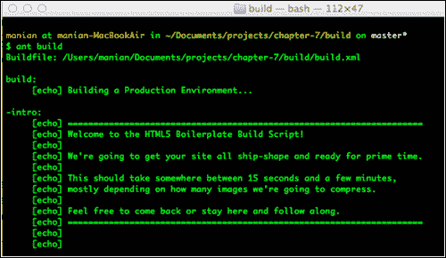
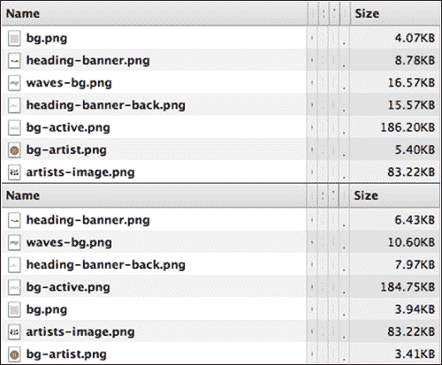
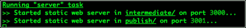

# 第七章。使用构建脚本自动部署

我们准备部署我们的站点！但是在我们这样做之前，我们应该确保我们最小化我们所有的脚本并优化图像，以便这些页面在世界任何地方都可以尽可能快地加载。我们可以通过在命令行上执行脚本来自动化这些任务。让我们看看我们有哪些选择。

# 构建脚本

一旦你完成了你的项目，你会想要生成去除注释的文件，并且为快速加载进行了优化。有一些软件构建系统通常用于目标相似的软件项目中。HTML5 样板文件的构建脚本提供了一个典型的网络开发项目所需要的任务。

只有在您确认您的项目已经准备好进行部署并且已经过良好的测试之后，才应该使用该脚本。构建脚本只是自动化了删除注释、优化文件和确保文件准备就绪的过程。

目前有两种由 HTML5 样板贡献者主动维护的构建脚本；这些将在下一节中探讨。

## 蚂蚁构建脚本

蚂蚁构建脚本是一组在 Apache 蚂蚁构建系统(`ant.apache.org/`)之上工作的文件，该系统从 HTML5 样板文件的早期就已经可用了。它提供了多种选择，描述如下:

*   向测试、开发和生产环境发布文件
*   使用 **JSHint** 或 **JSLint** 检查脚本文件的语法和代码质量，或者使用**csslit**检查样式表的语法和代码质量
*   连接并缩小所有的 JavaScript 文件到一个文件中，并根据这个新文件更新 HTML 页面
*   通过删除注释、空白以及压缩内联样式和脚本来清理和整理 HTML 标记
*   连接并缩小所有样式表，并使用新文件而不是多个 CSS 文件来更新 HTML 页面
*   将样式预处理器文件(如 Less 或 Sass)编译成生成的 CSS 样式表，并更新 HTML 页面中的引用
*   分别使用`optipng.sourceforge.net/`中的优化图片和`jpegclub.org/jpegtran/`中的 JPEG 图片优化`img`文件夹中的 PNG 和 JPEG 图片
*   从`github.com/jsdoc3/jsdoc`开始使用 JSDoc3 从您的脚本构建文档

## 节点构建脚本

在`nodejs.org/`找到的建立在节点之上的新构建脚本正在积极开发中。虽然它还没有投入生产使用，但它提供了许多类似于蚂蚁构建脚本的任务，并具有如下所述的一些新功能:

*   连接并缩小所有的 JavaScript 文件到一个文件中，并根据这个新文件更新 HTML 页面
*   连接并缩小所有样式表，并使用新文件而不是多个 CSS 文件来更新 HTML 页面
*   通过删除注释、空白以及压缩内联样式和脚本来清理和整理 HTML 标记
*   分别使用 OptiPNG 和 JPEGTran 优化`img`文件夹中的 PNG 和 JPEG 图像

观察项目文件的变化，并自动运行构建脚本，并在浏览器中重新加载打开的页面。

## 使用哪个构建脚本？

根据你对什么平台比较适应，可以选择其中一个。这两个构建脚本都足够稳定，可以用来部署您的生产文件，因此您的选择取决于您最喜欢使用什么。

如果您已经安装了 Ant，那么 Ant 构建脚本可能是一个显而易见的选择。如果您发现自己经常使用节点或在项目中使用它，那么节点构建脚本可能是一个好的开始。在这一章中，我们将研究两者的使用，这样你就可以对它们中的任何一个感到舒适。

# 使用蚂蚁构建脚本

首先，通过在命令行工具中输入以下内容来确认您的系统上已经安装了 Ant:

```html
ant–version
```

如果您没有 Ant，请先安装它，然后再继续下一步。

### 注

蚂蚁在默认情况下安装在苹果电脑上，而它可以作为一个软件包安装在大多数 Linux 平台上。对于 Windows，安装 Ant 稍微复杂一些。您需要从[www.oracle.com/technetwork/java/javase/downloads/index.html](http://www.oracle.com/technetwork/java/javase/downloads/index.html)安装 Java SDK，然后下载`WinAntcode.google.com/p/winant/`并将安装程序指向`Program Files/Java/jre6/bin/`。

接下来，您需要安装 **ant-contrib** ，这是一个实用程序，为 ant 提供了许多 HTML5 构建脚本使用的功能。 **WinAnt** 当你用它在 Windows 上安装 Ant 时，会自动做到这一点。但是对于 Linux 用户来说，可以使用 **yum** 将其作为包安装。在 Mac 上，您可以安装 macport([www.macports.org/install.php](http://www.macports.org/install.php))然后在命令行工具(通常是终端)中输入以下内容:

```html
sudo port install ant-contrib
```

最后，确保安装了映像优化工具。对于 Mac 用户，你需要确保你已经安装了**jpegt****ran**([www.ijg.org/](http://www.ijg.org/))和 **optipng** ( `optipng.sourceforge.net/`)并且在你的路径上。您可以通过在命令行终端中输入以下命令来安装这两个文件:

```html
sudoport install jpeg optipng
```

### 注

`PATH`是一个环境变量，它包含一个文件夹列表，当您输入命令时，命令行界面会搜索该列表。您可以从[www.cs.purdue.edu/homes/cs348/unix_path.html](http://www.cs.purdue.edu/homes/cs348/unix_path.html)了解如何向路径添加文件夹。

如果您在 Windows 上，Ant 构建脚本项目包含这些映像工具所需的二进制文件，供您安装。

## 安装构建脚本

在终端(或您的命令行工具)中，我们将导航到我们的项目文件夹，并使用 Git 安装构建脚本，如下图所示:


我们现在必须将构建脚本文件夹从`ant-build-script`重命名为`build`，然后才能继续。这是通过使用以下命令完成的:

```html
mv ant-build-script build
```

完成后，让我们使用以下命令导航到构建脚本文件夹:

```html
cd build
```

现在，我们将执行构建脚本！转到命令行工具并输入以下内容:

```html
ant build
```

如果您正确设置了构建脚本文件夹，那么您应该会看到以下屏幕:



然后，在任务执行之后，您应该会得到以下输出:


现在，您有了一个全新的`publish`文件夹，其中存储了优化后的文件。让我们看看都做了哪些优化，从`publish`文件夹打开`index.html`页面，在 Chrome 浏览器中，使用 Chrome 开发者工具的**网络**选项卡，观察加载的文件及其相关大小。

请注意，您必须在打开**网络**选项卡的情况下加载页面，以记录正在请求的文件。

## 较小的图像文件

**网络**标签记录所有在`index.html`上获取使用的图像。我们可以看到为**发布**文件夹中的`index.html`页面获取的图像尺寸明显变小。

在下面的截图中，截图的底部显示了**发布**文件夹中的图像列表，这些图像明显小于我们原始项目中使用的图像(在截图的顶部列出):


## 较小的 CSS 文件

我们注意到在我们使用构建脚本之前，我们的 CSS 文件被称为`main.css`，大约为 21 KB，但是在使用构建脚本之后，文件已经被重命名，现在几乎是原始大小的一半，如下图截图所示:


## JS 文件越来越少

执行构建脚本后，您会注意到`main.js`和`plugin.js`已经合并为一个。它们不仅被组合在一起，而且还被缩小，导致最终脚本文件的文件大小更小。

通过构建脚本生成的`publish`文件夹中的`index.html`页面仅调用了四个 JavaScript 文件，如下图底部所示，而最初放在该文件夹中的是五个 JavaScript 文件(顶部):


## 文件中没有注释

`publish`文件夹中的 HTML、CSS 和 JS 文件没有 HTML5 样板文件包含的注释。

## 构建选项

蚂蚁构建脚本有几个默认情况下不执行的任务，但是如果您需要的话可以使用它们。以下部分解释了这些任务允许您做什么。

### 缩小标记

默认情况下，蚂蚁构建脚本在优化时不会从`index.html`页面移除空格；如果您还想删除 HTML 文件中的空白并缩小它，您可以执行以下操作:

```html
ant minify
```

### 阻止图像优化

当执行构建脚本时，您会注意到该脚本优化图像的时间最长。如果您执行构建脚本只是为了测试最终的生产就绪文件，那么您不必优化映像。在这种情况下，您应该执行以下命令:

```html
ant text
```

### 使用 CSSLint

CSS Lint ( `csslint.net`)是一个开放的源码 CSS 代码质量工具，它对你的代码进行静态分析，并标记无效或可能是问题原因的样式规则。要在项目的 CSS 文件中使用 CSS Lint，只需输入以下内容:

```html
ant csslint
```

通常，你会观察到一堆警告。CSS Lint 有很多选项可以设置。为此，在构建中打开`config`文件夹内的`project.properties`文件。使用以下命令，通过删除`#`取消对该行的注释:

```html
#tool.csslint.opts =
```

在`=`符号后输入所有你想使用 CSS Lint 的选项并保存。您可以使用的各种选项在`github.com/stubbornella/csslint/tree/master/src/rules`中提到。

### 使用 JSHint

JSHint ( `jshint.com`)是一个社区驱动的工具，用于检测 JavaScript 代码的错误和潜在问题，并执行您团队的编码约定。要在您的 JavaScript 文件上执行 JSHint，请转到您的项目并执行以下操作:

```html
ant jshint
```

一旦执行，我们会看到一堆错误被列在我们的`main.js`中。修正后的文件包含在本章的代码中。更正后，您还会注意到`plugin.js`中的代码抛出了一系列错误。这是因为我们使用了平滑滚动插件的精简代码。让我们用来自`github.com/kswedberg/jquery-smooth-scroll/blob/master/jquery.smooth-scroll.js`项目库的未统一代码来替换它。

现在，我们得到一堆错误，告诉我们需要使用更严格的比较运算符。让我们在当前项目中关闭它。我们可以通过打开我们的`build`文件夹下的`config`文件夹中的`project.properties`文件并取消注释下面的行来做到这一点，该行允许您使用自己的选项进行 JSHint:

```html
#tool.jshint.opts
```

将其更改为以下代码片段:

```html
tool.jshint.opts = maxerr=25,eqeqeq=false
```

### 注

更多选项列在`jshint.com`的 JSHint 网站上。

我们的错误消失了！

### 设置 SHA 文件名

串联的和缩小的 CSS 和 JS 文件名被设置为唯一生成的字符串，这确保了当新的生产版本被部署到服务器时，这些文件的缓存本地副本永远不会被加载。默认情况下，文件名中使用的字符数为`7`。您可以通过更改`build`文件夹内`config`文件夹内`project.properties`中的以下行来将其设置为更小或更大的数字:

```html
#hash.length = 7
```

取消前一行的注释，然后使用以下语法将数字`7`更改为您喜欢的字符数:

```html
hash.length = <number of characters you prefer>
```

## 与 Drupal 或 WordPress 一起使用

需要进行一些小的更改，以确保这些 Ant 构建脚本能够按照 Drupal 的预期工作。请注意，缩小 HTML 页面没有多大帮助，因为标记的很大一部分将由 Drupal 或 WordPress 生成。

### 更新 build.xml

有一个小改动你需要对`build.xml`进行修改，使其与 Drupal 或 WordPress 的文件结构配合使用。

在文件中查找`<echo message="Minifying any unconcatenatedcss files..."/>`。就在这一行代码之后，更改以下内容:

```html
<filesetdir="${dir.source}/${dir.css}/" excludes="${concat-files}" includes="**/*.css"/>
```

至以下:

```html
<filesetdir="${dir.source}/${dir.css}/" excludes="${concat-files}, ${dir.build.tools}/**/*.css, ${dir.intermediate}/**/*.css, ${dir.publish}/**/*.css" includes="**/*.css"/>
```

### 设置项目配置属性

在`build`文件夹的`config`文件夹内的`project.properties`文件中，添加以下代码:

```html
dir.css = .
dir.images = images
file.root.stylesheet = style.css
```

### 设置 JS 文件描述符

WordPress 或 Drupal 主题要求您将标记分割成单独的文件(例如，WordPress 的`footer.php`或 Drupal 的`footer.tpl.php`)。您需要知道以下代码位于这些文件中的哪个文件中:

```html
<!-- scripts concatenated and minified via build script -->
<scriptsrc="js/plugins.js"></script>
<scriptsrc="js/main.js"></script>
<!-- end scripts -->
```

使用该文件名(例如`footer.php`)通过使用以下代码来设置`project.properties`文件中的`file.root.page`属性:

```html
file.root.page = <name of file>
```

本章的代码中提供了一个包含修改后的构建脚本的示例 Drupal 和 WordPress 主题。

# 使用节点构建脚本

节点构建脚本在以下两个方面不同于蚂蚁构建脚本:

*   它可以通用安装，不需要从一个项目复制到另一个项目。
*   所有项目都应该使用节点构建脚本进行初始化。将它添加到已经在进行的项目中要麻烦得多。

节点构建脚本需要节点，因此通过输入以下命令来验证您已经安装了节点:

```html
node -v
```

如果还没有 Node，可以从`nodejs.org/`安装(或者从[github . com/joyent/Node/wiki/Installing-Node . js-via-package-manager](http://github.com/joyent/node/wiki/Installing-Node.js-via-package-manager)使用**包管理器**安装。

## 咕哝

**Grunt** ( `gruntjs.com/`)是一个基于节点的命令行构建工具，该节点构建脚本基于该工具。节点构建脚本提供了 HTML5 样板优化任务，可以插入到 Grunt 中。

这需要在项目文件夹中使用`package.json`文件和`grunt.js`文件，这可以在您初始化项目时设置。

## 安装节点构建脚本

在您的命令行工具中，首先通过输入以下命令安装节点构建脚本包:

```html
npm install https://github.com/h5bp/node-build-script/tarball/master -g
```

节点构建脚本也可以用作更大的构建设置的一部分。如果你倾向于用不同的方式使用它，在`github.com/h5bp/node-build-script/wiki/install`看看所有可能的方法。

安装后，您可以通过初始化它来创建您的 HTML5 样板项目文件夹。

### 初始化您的项目

您可以从各种选项中选择，为自己设置一个项目文件夹。让我们用它来建立一个临时项目，学习如何使用这个脚本来启动您的 HTML5 样板项目。

创建一个文件夹，您的 HTML5 样板项目应该在那里。在命令行工具中导航到它，并输入以下命令:

```html
h5bpinit
```

这将开始设置一整套命令行交互供您选择。它主要用于设置将由 Grunt 使用的包管理信息。

完成后，您有三个选项可以选择来设置您想要开始的文件；这些选项如下:

*   `[D]efault`:html 5 样板的标准文件集。
*   `[C]ustom`:通过选择重命名`js/`、`css/`或`img/`文件夹，获取所有标准文件。如果您的文件将被用作其他系统(如 Drupal 或 WordPress)的模板，您通常会希望这样做。
*   `[S]illy`:提示重命名 HTML5 样板中的每个文件夹/文件。你最不可能使用这个选项，除非你是一个语义完美主义者。

在你选择了想要做的安装类型之后，也有更多的问题被问到。请注意，如果您按下*进入*，将设置括号内所示的默认值。

然后，这将从 Github 存储库中下载 HTML5 样板的最新版本，作为您的基础。

### 对现有项目使用节点构建脚本

在现有项目中使用脚本不是不可能的，只是有点繁琐。该项目正在进行工作，以使这在`github.com/h5bp/node-build-script/issues/55`发生，但在此之前，以下是我们如何将其用于我们的太阳和沙子网站:

1.  首先，创建一个临时文件夹，并执行 Node 构建脚本从命令行初始化一个空项目，如前一节所述。
2.  然后，只将`package.json`和`grunt.js`复制到项目文件夹中。

您可以在`nimbu.in/h5bp-book/chapter-7-node-init/`文件夹中看到代码，以查看其运行情况。

## 使用节点构建脚本构建您的项目

导航到命令行工具中的日光和沙地项目文件夹(您在上一节中初始化了它)，并输入以下命令:

```html
h5bpbuild:default
```

这将结合文件，结果发布在`publish`文件夹中，就像蚂蚁构建脚本一样。您也可以使用这些其他构建选项，如 Ant 构建脚本。

### 文本

如果您希望在构建项目时不压缩图像，请使用以下命令:

```html
h5bpbuild:text
```

### Minify

如果您希望额外缩小 HTML 文件，请使用以下命令:

```html
h5bpbuild:minify
```

结果类似于您在 Ant 构建脚本中发现的结果；下面的截图显示了缩小过程的结果:



还有一些蚂蚁构建脚本无法提供的附加选项。

### 服务器

这将打开一个本地服务器实例，你可以立即预览你的网站。当您想要测试使用协议相关 URL 链接文件的页面时，这非常有用。为此，只需在命令行工具中导航到项目文件夹，然后输入以下命令:

```html
h5bp server
```

您将看到服务器正在为`publish`文件夹和`intermediate`文件夹启动，如下图所示:



然后，打开`http://localhost:3001`查看发布的站点。

### 连接

使用这个命令，一旦你对项目中的任何资源进行了更改，你就可以在打开的浏览器上看到你的页面重新加载。这样您就不必手动刷新页面来查看更改。为此，只需在命令行工具中导航到项目文件夹，然后输入以下命令:

```html
h5bp connect
```

## 与 Drupal 或 WordPress 一起使用

用 Node 构建脚本初始化一个 HTML5 样板项目，然后将其转换为您正在为 Drupal 或 WordPress 构建的模板，这相当简单。首先，确保在执行`h5bp init`时选择`Custom`选项。然后，在设置文件夹时，将`inc`设置为样式表所在的文件夹，将`images`设置为包含模板图像的文件夹的名称。再次提示时，输入相同的值，系统将为您生成项目框架。确保用模板文件替换`index.html`。

完成此操作后，打开项目文件夹中的`grunt.js`文件，并使用以下代码确认样式表的文件夹设置为父文件夹:

```html
css: {
      'style.css': ['*.css']
    },
```

通过编辑或删除图像，确保只有 JavaScript 文件和样式表以 SHA 文件名作为前缀。这是通过使用以下代码来完成的:

```html
rev: {
js: 'js/**/*.js',
css: '*.css',
},
```

脚本还需要知道`images`文件夹的新位置。我们可以通过为图像设置源和目标文件夹来做到这一点，如下面的代码片段所示:

```html
img: {
dist: {
src: 'images',
dest: 'images'
      }
    },
```

# 下一步

一旦我们对`publish`文件夹中的生产文件感到满意，我们就可以将其转移到我们的托管提供商，以替换构成我们网站的文件。

理想情况下，您应该使用版本控制系统来实现这一点，这样您就可以在更新使某些页面不可用的情况下快速回滚更新。

如果您只是为 Drupal 或 WordPress 创建一个模板，那么将其移动到版本控制系统下的服务器上的 WordPress 文件夹中可能会有所帮助。

或者，您可以压缩项目，然后将文件复制到服务器，在那里可以解压缩和使用。节点构建脚本为此提供了一个选项。转到命令行工具中的项目文件夹，并输入以下命令:

```html
h5bptar –-input publish –-output <project-name>.tgz
```

使用最能描述你的项目的名称，而不是`<project-name>`。然后，将`<project-name>.tgz`复制到您的服务器上，并将其展开到您想要文件所在的文件夹中。

# 总结

在本章中，我们学习了如何使用 HTML5 样板团队提供的两种构建脚本。我们还研究了如何在 Drupal 或 WordPress 模板中使用它们。我们还研究了一旦文件建立后我们可以做什么。

在下一章中，我们将看看您可以承担的一些高级任务，现在您已经知道如何使用 HTML5 样板创建和部署项目。