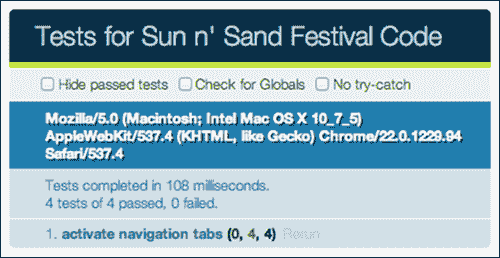

# 附录 a .你是专家，现在怎么办？

我们都对我们的网站了如指掌。我们已经学习了如何编写它的代码，如何用构建脚本构建它，如何将它部署到生产代码中，这样它就可以正常运行而不会出现任何问题。你有效地完成了 HTML5 样板的学习。如果你想成为一个更好的网络开发人员，你可以花时间去了解网络的其他相关和有用的部分！让我们探索其中的一些。

# 为代码编写单元测试

我们为自己的网站写了一些 JavaScript。虽然浏览器让我们知道代码是否写错了，但是没有办法判断代码是否如预期的那样工作。也许有些边缘案例我们没能解释清楚。代码应该尽可能健壮，并且能够处理所有预期的用例，并且能够处理大多数错误情况。您可以通过编写测试来测试代码调用的每个函数来确保这是可能的。

一个单元可以被认为是代码中最小的可测试部分。当您编写单元测试时，您可以确保代码的每个部分都正确运行。开始单元测试最简单的方法是使用测试套件。

`QUnit.js` 是一个流行的基于浏览器的测试套件，可以在浏览器中测试你的代码。让我们在为太阳和沙滩节网站编写的代码中使用这个。

## 创建测试环境

让我们在项目中创建一个文件夹。

然后，我们从`code.jquery.com/qunit/qunit-1.9.0.js`下载`QUnit.js`，从`code.jquery.com/qunit/qunit-1.9.0.css`下载关联的 CSS 文件`qunit.css`。这些文件的最新版本可以在`github.com/jquery/qunit`找到。

我们现在通过在`tests`文件夹中创建`tests.html`页面来创建一个测试环境，并具有以下代码:

```html
<!DOCTYPE html>
<html>
<head>
<meta charset="utf-8">
<title>Tests for Sun n' Sand Festival Code</title>
<link rel="stylesheet" href="qunit-1.9.0.css">
</head>
<body>
<div id="qunit"></div>
<div id="qunit-fixture"></div>
<script src="//ajax.googleapis.com/ajax/libs/jquery/1.7.2/jquery.min.js"></script>
<script>window.jQuery || document.write('<script src="js/vendor/jquery-1.7.2.min.js"><\/script>')</script>
<script src="qunit-1.9.0.js"></script>
<script src="../js/main.js"></script>
<script src="test.js"></script>
</body>
</html>
```

在这段代码中，我们包含了我们在网站上使用的`main.js`文件。我们将测试我们为用于显示队列的选项卡编写的代码。

现在，我们将创建`test.js`文件，在这里我们将为我们的代码编写所有的测试。

由于我们的测试依赖于用于选项卡的标记，让我们将没有内容的标记从`index.html`复制到`tests.html`。

如果我们照原样执行这个测试，我们会得到一个声称全局失败的错误。如果打开浏览器开发工具的控制台，您应该会看到以下错误:

```html
Uncaught TypeError: Object [object Object] has no method 'smoothScroll'
```

这是因为我们从`main.js`调用插件，但是我们没有在这里包含这些插件，因为我们没有测试它们。我们可以收集所有依赖于插件的代码，如果不使用 QUnit，只调用，方法是在调用插件和框架之前先测试 QUnit 的存在性，如下面的代码片段:

```html
if(window.QUnit == undefined) {
  $('.js-scrollitem').smoothScroll();
  if(Modernizr.svg === false) {
    $('img[src$=".svg"]').each(function() {
      this.src = /(.*)\.svg$/.exec(this.src)[1] + '.png';
    });
  }

  if (Modernizr.generatedcontent === false && window.onbeforeprint !== undefined) {
    window.onbeforeprint = printLinkURLs;
    window.onafterprint = hideLinkURLs;
  }

  Modernizr.load({
    test: Modernizr.audio,
    nope: {
      'mediaelementjs': 'js/vendor/mediaelement/mediaelement-and-player.min.js'
},
    callback: {
    'mediaelementjs': function() {
      $('audio').mediaelementplayer();
    }
  } 
 });
}
```

确保您删除了生产代码中的条件— `if(window.QUnit == undefined)`。

现在，让我们编写一个测试，通过使用下面的代码片段来确认当单击导航选项卡时，正确的类被应用于它自己:

```html
$('.js-tabitem').each(function() {
  var $this = $(this);
  $this.trigger('click');
  test( "navigation tabs", function() {
    ok($this.hasClass('t-tab__navitem--active'), 
   'The clicked navigation item has the correct active class applied');
  });
});
```

`test()`功能是可从 QUnit 测试套件获得的功能。第一个参数是文本的标题，第二个是你想要执行的实际测试函数。

我们还使用`ok()`，这是来自 QUnit 测试套件的断言之一，用于确认该类是否适用。断言是单元测试的一个基本元素，在单元测试中，您测试代码执行的结果是否返回了预期值。QUnit 有不同类型的断言，这些断言都记录在`api.qunitjs.com/category/assert/`中。

在`ok()`中，我们传递给这个函数的第一个参数是一个计算为真或假的表达式。第二个参数是执行断言时要显示的消息。

现在，让我们使用下面的代码片段来测试非活动导航项不包含使导航项显示为活动的类名:

```html
$('.js-tabitem').not(this).each(function() {
  ok(!$(this).hasClass('t-tab__navitem--active'),
    'Inactive item does not have active class');
});
```

让我们现在执行这些测试！在浏览器中打开`tests.html`页面。您应该会看到如下截图:



你也可以执行更复杂的测试！从他们的在线烹饪书`qunitjs.com/cookbook/`中了解更多关于 QUnit 的信息。

### 你应该知道的深奥的默认值

为了得到 HTML5 样板文件中的缺省值，进行了大量的研究。了解不同浏览器的行为以及是什么驱使我们选择默认浏览器，这真的很有趣。

## 当 UTF-8 时

`meta`元素表示页面的任何元数据信息。在`<head>`元素中设置`<meta charset="utf-8">`将确保浏览器在没有关于页面编码的任何其他信息的情况下，使用 UTF-8 编码解析页面。

有趣的是，大多数浏览器只在页面的前 512 个字节内寻找字符编码元数据。因此，您需要确保如果您的`<head>`元素中有大量数据，那么这个元元素会先于其他元素出现。

在没有`charset`编码信息的情况下，浏览器要猜测应用哪个`charset`编码。HTML5 规范概述了所有浏览器必须在[实现的嗅探算法。不幸的是，旧的浏览器有自己的猜测字符编码的机制。](http://www.whatwg.org/specs/web-apps/current- work/multipage/parsing.html#encoding-sniffing-algorithm)

在 Internet Explorer 7 及以下版本中，默认字符编码首选项通常设置为`Auto Select`。这意味着浏览器会扫描页面内容，以检测最适合的字符编码。在 Internet Explorer 的情况下，如果它在页面的 4096 个字符内找到一个 UTF-7 字符串，它将假设页面使用 UTF-7 编码，并且您的页面将容易受到使用 UTF-7 编码的跨站点脚本攻击。因此，`meta`元素声明就在`index.html`页面的页面顶部。

请注意，如果您的服务器发送的 HTTP 头是不同的编码，那么这将优先。确保您的服务器设置为将正确的`charset`编码作为 HTTP 头。

## HTML 文档类型

在 HTML 和 CSS 的标准化之前，大多数标记和样式在任何浏览器中都不能一致地呈现。但是，当我们有了关于如何编写标记的标准，并且越来越多的开发人员开始采用这些标准时，浏览器就不得不面对检测互联网上哪些页面符合这些标准，哪些不符合的问题。

Doctype 是发明的，这样开发人员可以通知浏览器使用更新的标准模式呈现页面。没有 Doctype 声明，浏览器将以所谓的**怪癖模式**呈现页面(在标准成为可接受的实践之前，浏览器用来呈现页面的方式)。在 IE6 中，在 Doctype 上方有一个注释或一个 XML 名称空间声明也会以怪癖模式呈现页面。在 2000 年代早期，当建议使用带有 XML 命名空间声明的 XHTML Doctype 时，这将是 Internet Explorer 中出现重大问题的原因。

并非所有 Doctype 声明都以标准模式呈现。使用标准模式最简单的方法是使用最小的推荐 Doctype，`<!doctype html>`。您可以在 Doctype 声明中混合使用上限或下限(例如，`<!DoCtYpE hTmL>`)。

## clear fix 解决方案背后的细节

`clearfix` CSS 类用于确保浮动元素适合它们的父容器。对这一想法的第一次探索发生在 2002 年，并在 www.positioniseverything.net/easyclearing.html 的文章中进一步阐述。

`clearfix`选择器的工作方式如下:

```html
.clearfix:after {
  content: ".";
  display: block;
  height: 0;
  clear: both;
  visibility: hidden;
}
.clearfix { zoom: 1; } /* IE 5.5/6/7 */
```

这种方法最大的问题是，所有浏览器的页边距不会一致地折叠。蒂埃里·科布伦茨在 www.tjkdesign.com/lab/clearfix/new-clearfix.html 写了更多关于它的文章。

Thierry Koblentz 在 2010 年更新了这个方法，在[的帖子中引入了`:before`和`:after`伪元素的使用。这两个伪元素都用在下面的代码片段中:](http://www.yuiblog.com/blog/2010/09/27/clearfix-reloaded-overflowhidden-demystified/ to be so)

```html
.clearfix:before,
.clearfix:after {
  content: ".";
  display: block;
  height: 0;
  overflow: hidden;
}
.clearfix:after {clear: both;}
.clearfix {zoom: 1;} /* IE < 8 */
```

使用这两个伪元素可以防止在使用`clearfix`类时出现边距折叠不一致的问题。

尼古拉斯·加拉格尔，在 2011 年，发现了一种替代方法，如果我们的目标浏览器是 IE6 和更高版本以及其他现代浏览器，它可以减少`clearfix`类所需的代码行数，正如他在`nicolasgallagher.com/micro-clearfix-hack/`的文章中所解释的那样。Nicolas 的代码在下面的代码片段中给出:

```html
.cf:before,
.cf:after {
    content: " ";
    display: table;
}

.cf:after {
    clear: both;
}

/**
 * For IE 6/7 only
 * Include this rule to trigger hasLayout and contain floats.
 */
.cf {
    *zoom: 1;
}
```

在这种方法中，使用`display: table`将在伪元素内创建一个匿名表格单元格(关于这意味着什么的更多信息可在位于[www.w3.org/TR/CSS2/tables.html#anonymous-boxes](http://www.w3.org/TR/CSS2/tables.html#anonymous-boxes)的规范中获得)，这防止了上边距的折叠。`content`属性不需要内部的任何内容就可以工作，但是当用于可编辑的元素时，该方法使用空格字符来克服 Opera 错误。

`clearfix`级就是这样进化的！正如你所看到的，大量的研究和开发投入到了打造最好的`clearfix`类上，该类可以在主流浏览器平台上运行。

## 打印样式是做什么的？

HTML5 样板样式表附带了一组样式，当用户打印您的页面时，这些样式是有用的默认值。设计页面在打印时的外观样式是我们大多数人在设计网页时不会考虑的事情，HTML5 Boilerplate 为您提供了一组很好的默认值，因此您不必在大多数时候都考虑它(但是，这样做是一种很好的做法)。

### 打印媒体查询

我们在一个名为“打印”的 CSS 媒体查询中内联了所有的打印样式。每当用户选择要打印的页面时，都会匹配该媒体查询，在这种情况下将应用这些样式规则。我们在`@media print`查询中声明了所有规则，如以下代码片段所示:

```html
@media print {
  a, a:visited { text-decoration: underline; }
  /* More Styles below */
}
```

### 优化颜色和背景

然后，我们确保优化页面，使其在打印时最具可读性，并确保我们不会浪费过多的打印墨水来打印多余的图像、颜色和文本。这意味着我们要确保移除所有背景图像或图像，这些图像只是所有元素的白色或透明色调略有不同。我们还确保所有颜色都是黑色，因为这意味着打印机不必混合任何墨水，因此可以打印得更快。我们还去除了阴影，因为这会降低文本的可读性。

我们对这些更新的最终规则如下:

```html
* {
        background: transparent !important;
        color: #000 !important; /* Black prints faster: h5bp.com/s */
        box-shadow:none !important;
        text-shadow: none !important;
    }
```

### 更好的链接

现在没有多少设计师使用`text-decoration: underline`来设计页面上的链接。通常，人们用颜色来表示某物是一个链接。但是，在打印的情况下，下划线更容易识别，尤其是当您无法控制打印机和用于渲染它们的颜色时。因此，我们使用下面的代码片段将所有链接(活动的或已访问的)设置为文本下面的一行:

```html
    a,
    a:visited {
        text-decoration: underline;
    }
```

如果用户正在阅读打印页面并希望访问该链接，则用户无法导航到该链接，因此参考打印的实际链接也是有帮助的。我们通过使用 CSS 中的`attr()`函数来实现。`attr()`返回将应用当前规则的元素的属性值。在这种情况下，当我们在链接上应用它时，我们可以使用`attr()`来获取链接的`href`属性的值并打印它们。当字符串在`content`属性中用作值时，使用空格字符将字符串连接在一起。我们还想确保如果一个链接有标题，我们也会打印出来，因为只有在链接上悬停时标题才可见。所有这些都用 CSS 表示，看起来像下面的代码片段:

```html
    a[href]:after {
        content: " (" attr(href) ")";
    }

    abbr[title]:after {
        content: " (" attr(title) ")";
    }
```

但是，这意味着即使是链接到同一个页面中的另一个位置或用于 JavaScript 操作(带有`javascript:`前缀)的链接也会以同样的方式呈现！因此，我们需要确保我们不会为这些链接这样做。

为此，我们使用属性选择器，它允许我们选择具有开始、结束或包含特定值的属性的元素。通过使用选择器`a[href^="javascript:"]:after`，我们确保我们只选择了属性为`href`的链接的`:after`伪元素，其值以字符串`javascript:`开始。

类似地，我们也选择所有具有以`#`字符开始的`href`属性的链接，因为这意味着这些链接是链接到同一页面内另一个位置的内联链接。

然后，我们确保在这些链接中不呈现伪元素的内容。该规则看起来像下面的代码片段:

```html
    .ir a:after,
    a[href^="javascript:"]:after,
    a[href^="#"]:after {
        content: "";
    }
```

请注意，这些规则不适用于 IE6，如果在 IE6 中非常有必要提供此功能，您希望使用提供此功能的 JavaScript。

### 在一页内呈现所有代码和报价

有时会发生这样的情况你打印的页面会包含引号或代码，作为一个读者，当代码(或报价)可能都在一页之内而没有任何中断时，继续返回上一页是令人讨厌的。为此，我们可以使用 CSS `page-break-inside`属性，该属性允许您告诉浏览器您是希望这些元素在两个页面上分开还是停留在同一个页面内。下面的代码片段显示了这方面的代码:

```html
pre,
    blockquote {
        border: 1px solid #999;
        page-break-inside: avoid;
    }
```

请注意`page-break-inside`在 Firefox 中不受支持，但在所有其他浏览器中都可用。

### 更好地渲染表格

默认情况下，将标题放在`thead`标签中可以确保每次表格在两页之间出现间断时标题都会重复出现。不过目前只有火狐和 Opera 对此有支持。在 IE 中，您可以这样做，但是您必须显式地声明它，如下面的代码片段所示:

```html
    thead {
        display: table-header-group; /* h5bp.com/t */
    }
```

### 更好地渲染图像

理想情况下，我们希望防止表格行和图像跨页面中断，因此我们使用现在熟悉的`page-break-inside`属性告诉浏览器我们的偏好，如以下代码片段所示:

```html
    tr,
    img {
        page-break-inside: avoid;
    }
```

当图片在网站上完整显示时超出页面或打印裁剪时，它也不会显示得太好。因此，我们将最大宽度限制为与页面本身一样宽，不能再宽了，如下面的代码片段所示:

```html
    img {
        max-width: 100% !important;
    }
```

### 页边距

`@page`规则允许您在打印时修改页面的属性。除了 Firefox 之外的所有浏览器都支持这个规则。此规则将页边距设置为每页`0.5 cm`，如以下代码片段所示:

```html
    @page {
        margin: 0.5cm;
    }
```

### 孤儿和寡妇的最佳设置

**孤儿**是出现在页面底部的行文本。**寡妇** 出现在页面顶部。我们确保线条不会因为底部或顶部的线条少于预期而断裂。这将创造更具可读性的体验。以下代码片段用于此目的:

```html
    p,
    h2,
    h3 {
        orphans: 3;
        widows: 3;
    }
```

### 保持标题与内容一致

标题出现在一页底部的和标题所针对的内容出现在下一页上是不可读的。为了告诉浏览器避免这样做，我们可以使用`page-break-after`设置，如下面的代码片段所示:

```html
    h2,
    h3 {
        page-break-after: avoid;
    }
}
```

## 什么是协议相关 URL？

在 HTML5 样板中，当我们引用 jQuery 时，我们是这样引用的:

```html
<script src="//ajax.googleapis.com/ajax/libs/jquery/1.8.1/jquery.min.js">
</script>
```

请注意，我们在 URL 前面既没有`http`也没有`https`；相反，它从`//`开始。这些被称为协议相关 URL，当您想要在 HTTP 或 HTTPS 环境中使用与协议无关的资源时，它们非常有用。

当您使用 HTTPS 服务页面时，当页面加载使用 HTTP 协议的资产和资源时，浏览器会抛出警告和错误。为了防止这种情况，您需要确保对您请求的所有资产使用 HTTPS 协议。如果您使用相对 URL 来引用页面父文件夹中的资产，这通常不是问题。但是，如果您引用的是外部 URL，如 jQuery 的 CDN URL(如前所示)，那么您需要确保在页面使用 HTTPS 协议时使用`https`，在页面使用 HTTP 协议时使用`http`前缀。

不使用 JavaScript 来进行这种确定，简单地省略协议可以确保浏览器在请求外部网址时使用当前使用的协议。在这种情况下，如果该页面在 HTTPS 作为`https://example.com`提供，那么请求的网址将是[https://Ajax . googleapis . com/Ajax/libs/jquery/1 . 8 . 1/jquery . min . js](https://ajax.googleapis.com/ajax/libs/jquery/1.8.1/jquery.min.js)。

你可以在`paulirish.com/2010/the-protocol-relative-url/`了解更多。

## 使用条件注释

从历史上看， IE6、IE7 和 IE8 是最有 bug 和风格呈现不一致的浏览器。有很多方法可以为 IE 版及以下版本提供风格，下面是几个。

### 浏览器风格的黑客攻击

最流行的技术是在只针对一个浏览器的 CSS 样式规则中使用黑客。

对于 IE6 及以下版本，请使用以下代码片段:

```html
* html #uno  { color: red }
```

对于 IE7，使用以下代码片段:

```html
*:first-child+html #dos { color: red }
```

对于 IE8，使用以下代码片段:

```html
@media \0screen {
   #tres { color: red }
}
```

还有更多针对两个或两个以上浏览器(或排除两个或两个以上浏览器)的黑客，都在`paulirish.com/2009/browser-specific-css-hacks/`的帖子中列出。

这些黑客的问题在于，他们首先利用了浏览器解析技术中的漏洞。如果浏览器修复了这些解析错误，那么它们可能无法工作。幸运的是，对于 IE6 和 IE7 等较旧的浏览器，我们不必担心这一点。

这些黑客也是不可读的，如果没有注释，就不可能理解它们针对的是哪些浏览器。

这些方法的优势在于，您可以将样式规则保存在一起，并且不必为需要黑客攻击的浏览器提供单独的样式表。

### 服务器端浏览器检测

当向网络服务器发出请求时，浏览器会随请求发送一个用户代理字符串。服务器可以根据它们对用户代理字符串的解释来服务不同的资源。例如，如果浏览器使用以下用户代理字符串将自己标识为 IE6:

```html
Mozilla/4.0 (compatible; MSIE 6.0; Windows XP)
```

然后，服务器可以向 IE6 发回不同的样式表。虽然这看起来是一个简单、容易的解决方案，但问题出现在浏览器说谎的时候。从历史上看，浏览器从来没有确切地声称自己是哪个浏览器，因此，很可能您向浏览器发送了错误的样式表。

根据浏览器的用户代理设置来处理请求还需要一点服务器端的开销，因此不是为 IE8 及以下版本提供不同样式表的理想方式。

### 基于条件注释的样式表

条件注释是 IE9 及以下理解的特殊语法的 HTML 注释。以下是条件注释示例:

```html
<!--[if lt IE 9]>
<p>HTML Markup here</p>
<!--<![endif]-->
```

除了 Internet Explorer 9 及以下版本之外，所有浏览器都忽略这些条件注释中的内容。IE9 及以下版本试图解释这些评论中的`if`条件，如果 IE 浏览器的版本号与`if`条件中的版本号匹配，则有选择地呈现内容。

前面的例子将在 IE 的所有 8、7、6 及以下版本上呈现`p`标签。

条件注释非常适合旧版本的 IE，这也是 HTML5 样板使用的。有两种使用它们的方法。第一种方法是根据匹配的条件注释输出一个单独的样式表，如下面的代码片段所示:

```html
<!--[if lt IE 9]>
<link rel="stylesheet" href="/css/legacy.css">
<![endif]-->
```

这将使 IE8 及以下版本使用`legacy.css`，其他浏览器将忽略这段代码。

独立样式表的问题是，当您开发样式时，您有两个不同的样式表要瞄准，有时 IE 特定的样式表可能会被遗忘。

有些人只为 IE8 和更低版本提供了非常基本的体验，如下面的代码片段所示:

```html
<!--[if ! lte IE 6]><!-->
/* Stylesheets for browsers other than Internet Explorer 6 */
<!--<![endif]-->
<!--[if lte IE 6]>
<link rel="stylesheet" href="http://universal-ie6-css.googlecode.com/files/ie6.1.1.css" media="screen, projection">
<![endif]-->
```

但是 HTML5 样板文件更喜欢可读性更强、更有针对性的方法，这种方法可以为所有使用类名的浏览器提供尽可能好的样式，我们接下来将讨论这一点。

### 基于条件注释的类名

先前条件注释方法的一个迭代是基于条件注释在根元素上追加类名，如下面的代码片段所示:

```html
<!--[if IE 8]>
<html class="no-js lt-ie9">
<![endif]-->
```

然后在样式表中，您可以使用它来设置 IE8 和以下版本的样式，如下所示:

```html
.lt-ie9 h1 { color: red }
```

您可以在`paulirish.com/2008/conditional-stylesheets-vs-css-hacks-answer-neither/`阅读更多关于该解决方案的信息。

这个解决方案不需要单独的样式表，但是允许您编写可读的类名来表明样式表中为什么存在该样式规则。这是我们在 HTML5 样板中采用的解决方案，推荐使用。

## 什么是 meta x-ua 兼容？

`x-ua-compatible`是一个定义互联网浏览器如何渲染你的页面的标题。它声明了 Internet Explorer 应该使用哪种模式来呈现您的页面。这主要是针对较旧的网站，这些网站由于更好地支持标准而在 Internet Explorer 9 以后中断。有两种设置方式。

### 【HTML 页面中的元标签

在这种情况下，我们只需在您的 HTML 页面中的`<head></head>`标签之间添加一个`meta`标签，如下所示:

```html
<head>
<meta http-equiv="X-UA-Compatible" content="IE=EmulateIE7" >
</head>
```

### 来自服务器的 HTTP 头响应

在 Apache 中，在的`.htaccess`文件中，写下以下内容将使服务器发送`X-UA-Compatible` HTTP 头作为对父文件夹上任何请求的响应:

```html
LoadModule headers_module modules/mod_headers.so
Header set X-UA-Compatible "IE=EmulateIE7"
```

我们推荐这种设置其值的方法，因为 HTTP 头值会覆盖通过`meta`标签设置的任何值。此外，在`html`元素上使用带有 IE 条件注释的`meta`标签会导致该`meta`标签被忽略。`X-UA-Compatible`标题可以有以下值。

#### 边缘

这将使用最新的渲染模式。例如，在 Internet Explorer 10 中，它将是 IE10。我们希望始终使用可用的最新呈现模式，因为这意味着我们可以访问最新且最符合标准的浏览器版本。这就是为什么它是我们在 HTML5 样板中的默认选项。

#### IE9

这将只使用IE9 模式来渲染页面。例如，当您使用此模式并且在 Internet Explorer 10 中查看此页面时，它将使用 IE9 模式来呈现页面。

#### IE8

这将使页面呈现为在互联网浏览器 8 上查看。

#### IE7

此模式呈现内容，就像如果 Internet Explorer 7 以标准模式呈现内容时会显示的一样。

#### 模拟 IE9

该模式告诉互联网浏览器使用`<!DOCTYPE>`指令来决定如何渲染内容。标准模式指令以 IE9 模式显示，怪癖模式指令以 IE5 模式显示。与之前的模式不同，所有仿真模式都遵守`<!DOCTYPE>`指令。

#### 模拟 IE8

该模式告诉互联网浏览器使用`<!DOCTYPE>`指令来决定如何渲染内容。标准模式指令以 IE8 模式显示，怪癖模式指令以 IE5 模式显示。与 IE8 模式不同，仿真 IE8 模式尊重`<!DOCTYPE>`指令。

#### 模拟 IE7

该模式告诉互联网浏览器使用`<!DOCTYPE>`指令来决定如何渲染内容。标准模式指令显示在 Internet Explorer 7 标准模式中，怪癖模式指令显示在 IE5 模式中。与 IE7 模式不同，仿真 IE7 模式尊重`<!DOCTYPE>`指令。对于许多网站来说，这是首选的兼容模式。

#### IE5

此模式渲染内容，就像互联网浏览器 7 以怪癖模式显示内容一样。您可以通过`msdn.microsoft.com/en-us/library/cc288325(v=VS.85).aspx`在 MSDN 文档中了解这些模式的更多信息。

# 贡献

如果你喜欢到目前为止你所看到的这个项目，你可能会想要做出贡献！为 HTML5 样板贡献是对所有学习和理解的回报，即使是最小的改变。贡献有两种方式；这些措施如下:

*   报告问题
*   提交拉取请求

## 报告问题

如果您在 HTML5 样板文件中的一个文件中发现了错误或不正确的东西，那么您可以提交一个问题，以便任何贡献者都可以查看它，并查看它是否可以解决。

诀窍是找出是 HTML5 样板文件有问题，还是项目使用的代码有问题。您可以通过启动 HTML5 样板的全新安装并验证错误是否仍然出现来验证这是否是 HTML5 样板的问题。

如果这是 HTML5 样板文件的问题，在您提交问题之前，请确保尚未报告该问题。位于`github.com/h5bp/html5-boilerplate/issues`的 GitHub 问题页面列出了所有未解决的问题。使用顶部的**搜索**栏搜索您面临的问题。很可能已经修复了，但是修复还没有推到稳定分支。

如果这个问题是全新的，那么确保你通过一个简化的测试用例以一种显而易见的方式隔离这个问题(克里斯·科伊尔在`css-tricks.com/reduced-test-cases/`中描述了什么是简化的测试用例)。当你提交一份 bug 报告时，确保它容易理解，这样我们就可以找到一个快速的解决方案。理想情况下，您的错误报告应该包含以下内容:

*   简短的描述性标题
*   问题和出现此错误的浏览器/操作系统的摘要
*   如果可能的话，复制错误的步骤
*   简化测试用例的网址(您可以在`jsfiddle.net`或`codepen.io`上托管一个)
*   任何其他与 bug 相关的信息，包括可能导致 bug 的代码行，以及潜在的解决方案

理想情况下，一个 bug 报告应该是独立的，这样贡献者就不需要再跟你跟进来发现更多关于 bug 的信息，而是可以专注于解决它。

遵循这个过程来提交 bug 报告本身就是一种学习体验，学习如何找出您编写的标记、样式或脚本的问题。

## 拉取请求

如果您对如何改进 HTML5 样板、修补程序以修复一些现有问题、改进或新功能有想法，您可以提交即所谓的**拉取请求**。拉式请求是一组您可以提交给 HTML5 样板 GitHub 存储库进行审查的更改，因此它可以由核心贡献者进行审查，如果发现有用，可以合并到 HTML5 样板中。

开始贡献的一个好方法是找到一个你认为可以解决的小问题，分叉 GitHub 项目(在`help.github.com/articles/fork-a-repo`了解更多这意味着什么)，处理你的更改并提交一个请求。

如果你的贡献改变了很多代码行，并且彻底改变了项目的性质，那么首先考虑在 GitHub 项目中打开一个问题。

以下是开始创建拉取请求的步骤:

*   分叉项目。
*   克隆你的叉子(在你的终端，输入`git clone https://github.com/<your-username>/html5-boilerplate.git`并按*进入*)。
*   添加一个上游遥控器(在你的终端输入`git remote add upstream https://github.com/h5bp/html5-boilerplate.git`并按*进入*)。
*   从上游获取最新变化(例如，在终端输入`git pull upstream master`并按*输入*)。
*   创建一个新的主题分支来包含您的功能、更改或修复(`git checkout -b <topic-branch-name>`)。
*   确保您的更改符合整个项目中使用的当前编码约定；也就是缩进、精确注释等等。
*   在逻辑块中提交您的更改；在公开提交之前，使用 Git 的交互式 rebase 特性(更多关于这个特性的信息见`help.github.com/articles/interactive-rebase`)整理你的提交。请遵守`tbaggery.com/2008/04/19/a-note-about-git-commit-messages.html`中的这些 Git 提交消息准则，否则您的拉取请求不太可能被合并到主项目中。
*   将上游分支本地合并(或重定基础)到主题分支中。
*   将你的话题分支向上推到你的岔口(`git push origin <topic-branch-name>`)。
*   打开一个标题和描述清晰的拉取请求。请提及您在哪些浏览器中测试过。

这看起来像是的大量工作，但是它让你的拉取请求更容易理解，合并也更快。此外，您的代码成为您已经完成的工作的文档，任何想知道为什么该部分看起来是这样的人都可以回到您的提交，并确切地理解为什么会这样。

在 HTML5 样板文件上工作会让你开始了解协作开发的最佳实践，你可以将这些实践带回你的工作场所或你所做的任何其他协作工作。