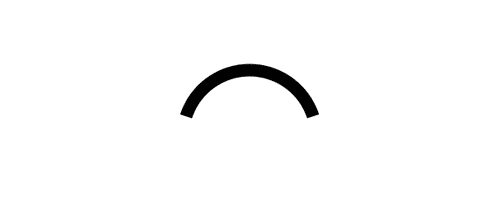
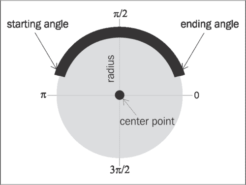
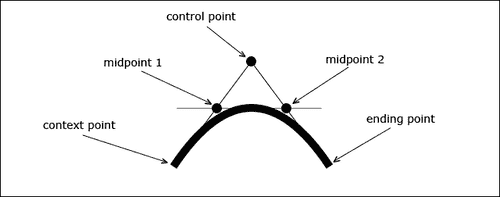
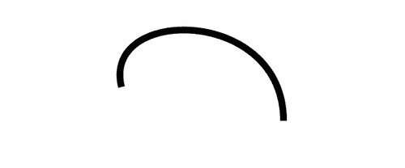
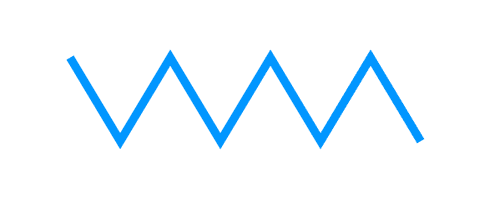

# 第一章。路径和文本入门

在本章中，我们将介绍:

*   画线
*   画弧线
*   画一条二次曲线
*   画一条贝塞尔曲线
*   画一个之字形
*   画螺旋
*   处理文本
*   用阴影绘制三维文本
*   释放分形的力量:画一棵闹鬼的树

# 简介

本章旨在通过提供一系列逐渐复杂的任务来演示 HTML5 画布的基本功能。HTML5 画布 API 提供了绘制和设置不同类型的子路径(包括直线、圆弧、二次曲线和贝塞尔曲线)样式所需的基本工具，以及通过连接子路径来创建路径的方法。该应用编程接口还为具有多种样式属性的文本绘图提供了强大的支持。我们开始吧！

# 画线

第一次学习如何用 HTML5 画布画画时，大部分人对画画布最基础、最初级的元素感兴趣。这个食谱将告诉你如何通过画一条简单的直线来做到这一点。


## 怎么做...

按照以下步骤画一条对角线:

1.  定义 2D 画布上下文并设置线条样式:

    ```html
    window.onload = function(){
    // get the canvas DOM element by its ID
    var canvas = document.getElementById("myCanvas");
    // declare a 2-d context using the getContext() method of the
    // canvas object
    var context = canvas.getContext("2d");
    // set the line width to 10 pixels
    context.lineWidth = 10;
    // set the line color to blue
    context.strokeStyle = "blue";

    ```

2.  放置画布上下文并绘制线条:

    ```html
    // position the drawing cursor
    context.moveTo(50, canvas.height - 50);
    // draw the line
    context.lineTo(canvas.width - 50, 50);
    // make the line visible with the stroke color
    context.stroke();
    };

    ```

3.  将画布标签嵌入到 HTML 文档的主体中:

    ```html
    <canvas id="myCanvas" width="600" height="250" style="border:1px solid black;">
    </canvas>

    ```

### 注意

**下载示例代码**

您可以从[www.html5canvastutorials.com/cookbook](http://www.html5canvastutorials.com/cookbook)运行演示并下载这本书的资源，也可以从您在[http://www.PacktPub.com](http://www.PacktPub.com)的账户上购买的所有 Packt 书籍下载示例代码文件。如果您在其他地方购买了这本书，您可以访问[http://www.PacktPub.com/support](http://www.PacktPub.com/support)并注册，以便将文件直接通过电子邮件发送给您。

## 它是如何工作的...

从前面的代码中可以看到，我们需要等待页面加载，然后再尝试通过其 ID 访问画布标签。我们可以通过 `window.onload`初始值设定项来实现这一点。一旦页面加载，我们可以使用 `document.getElementById()`访问画布 DOM 元素，并且我们可以通过将 `2d`传递到画布对象的 `getContext()`方法来定义 2D `canvas`上下文。正如我们将在最后两章中看到的，我们也可以通过传入其他上下文来定义 3D 上下文，例如 `webgl, experimental-webgl`和其他。

绘制特定元素(如路径、子路径或形状)时，需要了解的是，样式可以在任何时候设置，无论是在元素绘制之前还是之后，但是样式必须在元素绘制后立即应用才能生效。我们可以使用 `lineWidth`属性设置线条的宽度，也可以使用 `strokeStyle`属性设置线条颜色。把这种行为想象成如果我们在一张纸上画一些东西，我们会采取的步骤。在我们开始画画之前，我们会选择一个有一定尖端厚度(线宽)的彩色标记(strokeStyle)。

现在我们已经有了我们的标记，可以说，我们可以使用 `moveTo()`方法将其定位到画布上:

```html
context.moveTo(x,y);

```

将画布上下文视为绘图光标。 `moveTo()`方法为给定点创建一个新的子路径。画布左上角的坐标是(0，0)，右下角的坐标是(画布宽度，画布高度)。

定位好绘图光标后，我们可以使用 `lineTo()`方法，通过定义直线终点的坐标来绘制直线:

```html
context.lineTo(x,y);

```

最后，为了使线条可见，我们可以使用 `stroke()`方法。除非另有说明，否则默认的笔画颜色是黑色。

总而言之，以下是我们在使用 HTML5 画布 API 绘制线条时应该遵循的典型绘制过程:

1.  设计线条的风格(比如选择一个特定粗细的彩色标记)。
2.  使用 `moveTo()`定位画布上下文(如将标记放在一张纸上)。
3.  用 `lineTo()`画线。
4.  使用 `stroke().` 使线条可见

## 还有更多...

HTML5 画布线条也可以有三种不同的线帽之一，包括**屁股、**圆形和**方形**。线帽样式可以使用画布上下文的 `lineCap`属性来设置。除非另有指定，否则线帽样式默认为对接。下图显示了三条线，每条线都有不同的线帽样式。顶线使用默认的对接线帽，中线使用圆形线帽，底线使用方形线帽:


请注意，中间和底部的线比顶部的线稍长，即使所有的线宽都相等。这是因为圆形线帽和方形线帽增加了线的长度，增加的量等于线的宽度。例如，如果我们的线长 200 px，宽 10 px，并且我们使用圆形或方形线帽样式，则结果线将为 210 px 长，因为每个线帽在线长上增加 5 px。

## 另见...

*   *画一个之字形*
*   *综合:在[第二章](02.html "Chapter 2. Shape Drawing and Composites")中画一架喷气式飞机*

# 画一条弧线

使用 HTML5 画布进行绘制时，有时需要绘制完美的弧线。如果你对画快乐的彩虹、笑脸或图表感兴趣，这个食谱将是你努力的一个好的开始。



## 怎么做...

按照以下步骤画一条简单的弧线:

1.  定义 2D 画布上下文并设置弧线样式:

    ```html
    window.onload = function(){
    var canvas = document.getElementById("myCanvas");
    var context = canvas.getContext("2d");
    context.lineWidth = 15;
    context.strokeStyle = "black"; // line color

    ```

2.  画弧线:

    ```html
    context.arc(canvas.width / 2, canvas.height / 2 + 40, 80, 1.1 * Math.PI, 1.9 * Math.PI, false);
    context.stroke();
    };

    ```

3.  将画布标签嵌入到 HTML 文档的主体中:

    ```html
    <canvas id="myCanvas" width="600" height="250" style="border:1px solid black;">
    </canvas>

    ```

### 它是如何工作的...

我们可以用 `arc()`方法创建一个 HTML5 弧，它是由一个假想圆的圆周的一部分定义的。请看下图:



假想圆由一个中心点和一个半径定义。圆周截面由开始角度、结束角度以及圆弧是否逆时针绘制来定义:

```html
context.arc(centerX,centerY, radius, startingAngle,
endingAngle,counterclockwise);

```

请注意，角度从圆右侧的 0π开始，顺时针移动到 3π/2、π、π/2，然后回到 0。对于这个食谱，我们使用了 1.1π作为开始角度，1.9π作为结束角度。这意味着起始角刚好在假想圆左侧中心的稍上方，终止角刚好在假想圆右侧中心的稍上方。

### 还有更多...

开始角度和结束角度的值不一定必须在 0π和 2π之间。事实上，起始角和终止角可以是任何实数，因为当它们绕着圆运动时，这些角可以相互重叠。

例如，假设我们将我们的起始角度定义为 3π。这相当于绕圆(2π)一整圈，绕圆(1π)再转半圈。换句话说，3π相当于 1π。作为另一个例子，- 3π也相当于 1π，因为这个角度绕着圆逆时针旋转一圈半，最终到达 1π。

用 HTML5 画布创建弧线的另一种方法是使用 `arcTo()`方法。 `arcTo()`方法产生的弧由上下文点、控制点、终点和半径定义:

```html
context.arcTo(controlPointX1, controlPointY1, endingPointX, endingPointY, radius);

```

与通过弧的中心点定位弧的 `arc()`方法不同， `arcTo()`方法依赖于上下文点，类似于 `lineTo()`方法。 `arcTo()`方法最常用于创建路径或形状的圆角。

### 另见...

*   *在* [画圆第二章](02.html "Chapter 2. Shape Drawing and Composites")
*   *在[第五章](05.html "Chapter 5. Bringing the Canvas to Life with Animation")中激活机械齿轮*
*   *在[第 5 章](05.html "Chapter 5. Bringing the Canvas to Life with Animation")T3 中为时钟设置动画*

# 画二次曲线

在这个食谱中，我们将学习如何绘制二次曲线。与它的同类曲线圆弧相比，二次曲线提供了更多的灵活性和自然曲率，是创建自定义形状的绝佳工具。


## 怎么做...

按照以下步骤绘制二次曲线:

1.  定义 2D 画布上下文并设置曲线样式:

    ```html
    window.onload = function(){
    var canvas = document.getElementById("myCanvas");
    var context = canvas.getContext("2d");
    context.lineWidth = 10;
    context.strokeStyle = "black"; // line color

    ```

2.  定位画布上下文并绘制二次曲线:

    ```html
    context.moveTo(100, canvas.height - 50);
    context.quadraticCurveTo(canvas.width / 2, -50, canvas.width - 100, canvas.height - 50);
    context.stroke();
    };

    ```

3.  将画布标签嵌入到 HTML 文档的主体中:

    ```html
    <canvas id="myCanvas" width="600" height="250" style="border:1px solid black;">
    </canvas>

    ```

### 它是如何工作的...

HTML5 二次曲线由上下文点、控制点和终点定义:

```html
context.quadraticCurveTo(controlX, controlY, endingPointX, endingPointY);

```

请看下图:



二次曲线的曲率由三条特征切线定义。曲线的第一部分与从上下文点开始到控制点结束的假想线相切。曲线的峰值与从中点 1 开始到中点 2 结束的假想线相切。最后，曲线的最后一部分与从控制点开始到终点结束的假想线相切。

### 另见...

*   *综合:在[第二章](02.html "Chapter 2. Shape Drawing and Composites")中画一架喷气式飞机*
*   *开启分形的力量:画一棵闹鬼的树*

# 绘制贝塞尔曲线

如果二次曲线不能满足你的需求，贝塞尔曲线可能会达到目的。贝塞尔曲线也称为三次曲线，是 HTML5 画布应用编程接口中最先进的曲率。



## 怎么做...

按照以下步骤绘制任意贝塞尔曲线:

1.  定义 2D 画布上下文并设置曲线样式:

    ```html
    window.onload = function(){
    var canvas = document.getElementById("myCanvas");
    var context = canvas.getContext("2d");
    context.lineWidth = 10;
    context.strokeStyle = "black"; // line color
    context.moveTo(180, 130);

    ```

2.  定位画布上下文并绘制贝塞尔曲线:

    ```html
    context.bezierCurveTo(150, 10, 420, 10, 420, 180);
    context.stroke();
    };

    ```

3.  将画布标签嵌入到 HTML 文档的主体中:

    ```html
    <canvas id="myCanvas" width="600" height="250" style="border:1px solid black;">
    </canvas>

    ```

### 它是如何工作的...

HTML5 画布贝塞尔曲线由上下文点、两个控制点和一个结束点定义。与二次曲线相比，额外的控制点给了我们更多的曲率控制:

```html
context.bezierCurveTo(controlPointX1, controlPointY1,
controlPointX2, controlPointY2,
endingPointX, endingPointY);

```

请看下图:


与由三条特征切线定义的二次曲线不同，贝塞尔曲线由五条特征切线定义。曲线的第一部分与从上下文点开始到第一个控制点结束的假想线相切。曲线的下一部分与从中点 1 开始到中点 3 结束的假想线相切。曲线的峰值与从中点 2 开始到中点 4 结束的假想线相切。曲线的第四部分与从中点 3 开始到中点 5 结束的假想线相切。最后，曲线的最后一部分与从第二个控制点开始到终点结束的假想线相切。

### 另见...

*   *随机形状属性:在[第二章](02.html "Chapter 2. Shape Drawing and Composites")中绘制一片花田*
*   *综合:在[第二章](02.html "Chapter 2. Shape Drawing and Composites")中画一架喷气式飞机*

# 画一个之字形

在这个食谱中，我们将引入路径绘制，通过迭代地连接线子路径来绘制一条之字形路径。



## 怎么做...

按照以下步骤画一条之字形路径:

1.  定义一个 2D 画布上下文并初始化之字形参数:

    ```html
    window.onload = function(){
    var canvas = document.getElementById("myCanvas");
    var context = canvas.getContext("2d");
    var startX = 85;
    var startY = 70;
    var zigzagSpacing = 60;

    ```

2.  定义之字形并开始路径:

    ```html
    context.lineWidth = 10;
    context.strokeStyle = "#0096FF"; // blue-ish color
    context.beginPath();
    context.moveTo(startX, startY);

    ```

3.  画七条连接的之字形线，然后用 `stroke():`

    ```html
    // draw seven lines
    for (var n = 0; n < 7; n++) {
    var x = startX + ((n + 1) * zigzagSpacing);
    var y;
    if (n % 2 == 0) { // if n is even...
    y = startY + 100;
    }
    else { // if n is odd...
    y = startY;
    }
    context.lineTo(x, y);
    }
    context.stroke();
    };

    ```

    使之字形路径可见
4.  将画布标签嵌入到 HTML 文档的主体中:

    ```html
    <canvas id="myCanvas" width="600" height="250" style="border:1px solid black;">
    </canvas>

    ```

### 它是如何工作的...

要画一个之字形，我们可以把交替的对角线连接起来，形成一条路径。通过编程，这可以通过设置一个循环来实现，该循环在奇数迭代中绘制向上和向右移动的对角线，在偶数迭代中绘制向下和向右移动的对角线。

这个食谱要注意的重点是 `beginPath()`法。这个方法本质上声明了一个正在绘制的路径，这样每个线子路径的末端定义了下一个子路径的开始。如果不使用 `beginPath()`方法，我们将不得不对每个线段使用 `moveTo()`来冗长地定位画布上下文，同时确保前一个线段的结束点与当前线段的起点相匹配。我们将在下一章中看到， `beginPath()`方法也是创建形状的必要步骤。

#### 线条连接样式

注意每个线段之间的连接是如何变成一个尖锐点的。这是因为 HTML5 画布路径的线条连接样式默认为**斜接**。或者，我们也可以使用画布上下文的 `lineJoin`属性将线条连接样式设置为**圆形**或**斜面**。

如果您的线段相当细，并且没有以陡峭的角度连接，区分不同的线条连接样式可能会有些困难。通常，当路径厚度超过 5 px 且线子路径之间的角度相对较小时，不同的线连接样式会更明显。

# 画螺旋

注意，这个配方可能会诱发催眠。在这个食谱中，我们将通过连接一系列短线形成螺旋路径来绘制一个螺旋。


## 怎么做...

按照以下步骤绘制居中的螺旋线:

1.  定义 2D 画布上下文并初始化螺旋参数:

    ```html
    window.onload = function(){
    var canvas = document.getElementById("myCanvas");
    var context = canvas.getContext("2d");
    var radius = 0;
    var angle = 0;

    ```

2.  设置螺旋样式:

    ```html
    context.lineWidth = 10;
    context.strokeStyle = "#0096FF"; // blue-ish color
    context.beginPath();
    context.moveTo(canvas.width / 2, canvas.height / 2);

    ```

3.  绕画布中心旋转三次(每整圈 50 次迭代)，每次迭代半径增加 0.75，用 `lineTo()`从上一点画一条线段到当前点。最后，用 `stroke():`

    ```html
    for (var n = 0; n < 150; n++) {
    radius += 0.75;
    // make a complete circle every 50 iterations
    angle += (Math.PI * 2) / 50;
    var x = canvas.width / 2 + radius * Math.cos(angle);
    var y = canvas.height / 2 + radius * Math.sin(angle);
    context.lineTo(x, y);
    }
    context.stroke();
    };

    ```

    使螺旋可见
4.  将画布标签嵌入到 HTML 文档的主体中:

    ```html
    <canvas id="myCanvas" width="600" height="250" style="border:1px solid black;">
    </canvas>

    ```

### 它是如何工作的...

要用 HTML5 画布绘制一个螺旋，我们可以将我们的绘制光标放在画布的中心，围绕中心迭代增加半径和角度，然后绘制一条从前一点到当前点的超短线。另一种思考方式是把自己想象成一个拿着一支彩色粉笔站在人行道上的孩子。弯下腰，把粉笔放在人行道上，然后开始转一圈(不过不要太快，除非你想头晕和摔倒)。当你旋转时，将粉笔向外移开。几转之后，你会画出一个整齐的小螺旋。

# 处理文本

几乎所有的应用都需要某种文本来有效地与用户交流。这个食谱将告诉你如何用一个乐观的欢迎词来画一个简单的文本串。


## 怎么做...

按照以下步骤在画布上书写文本:

1.  定义 2D 画布上下文并设置文本样式:

    ```html
    window.onload = function(){
    var canvas = document.getElementById("myCanvas");
    var context = canvas.getContext("2d");
    context.font = "40pt Calibri";
    context.fillStyle = "black";

    ```

2.  水平和垂直对齐文本，然后绘制:

    ```html
    // align text horizontally center
    context.textAlign = "center";
    // align text vertically center
    context.textBaseline = "middle";
    context.fillText("Hello World!", canvas.width / 2, 120);
    };

    ```

3.  将画布标签嵌入到 HTML 文档的主体中:

    ```html
    <canvas id="myCanvas" width="600" height="250" style="border:1px solid black;">
    </canvas>

    ```

### 它是如何工作的...

要使用 HTML5 画布绘制文本，我们可以使用 `font`属性定义字体样式和大小，使用 `fillStyle`属性定义字体颜色，使用 `textAlign`属性定义水平文本对齐，使用 `textBaseline`属性定义垂直文本对齐。 `textAlign`属性可以设置为 `left, center`或 `right`， `textBaseline`属性可以设置为 `top, hanging, middle, alphabetic, ideographic`或 `bottom`。除非另有规定， `textAlign`属性默认为 `left`， `textBaseline`属性默认为字母。

### 还有更多...

除了 `fillText()`之外，HTML5 画布 API 还支持 `strokeText():`

```html
context.strokeText("Hello World!", x, y);

```

此方法将为文本的周边着色，而不是填充文本。要设置 HTML 画布文本的填充和描边，可以同时使用 `fillText()`和 `strokeText()`方法。为了正确渲染笔画粗细，在 `strokeText()`方法之前使用 `fillText()`方法是很好的做法。

### 另见...

*   *用阴影绘制 3D 文本*
*   *在[第 4 章](04.html "Chapter 4. Mastering Transformations")中创建镜像变换*
*   *在[第四章](04.html "Chapter 4. Mastering Transformations")* 中画一个简单的标志，并随机其位置、旋转和缩放

# 用阴影绘制三维文本

如果 2D 文本不能让你变得活泼，你可以考虑画三维文本。虽然 HTML5 画布 API 没有直接为我们提供创建 3D 文本的手段，但是我们当然可以使用现有的 API 创建一个自定义的 `draw3dText()`方法。


## 怎么做...

按照以下步骤创建三维文本:

1.  设置画布上下文和文本样式:

    ```html
    window.onload = function(){
    canvas = document.getElementById("myCanvas");
    context = canvas.getContext("2d");
    context.font = "40pt Calibri";
    context.fillStyle = "black";

    ```

2.  对齐并绘制三维文本:

    ```html
    // align text horizontally center
    context.textAlign = "center";
    // align text vertically center
    context.textBaseline = "middle";
    draw3dText(context, "Hello 3D World!", canvas.width / 2, 120, 5);
    };

    ```

3.  定义绘制多个文本层并添加阴影的 `draw3dText()`功能:

    ```html
    function draw3dText(context, text, x, y, textDepth){
    var n;
    // draw bottom layers
    for (n = 0; n < textDepth; n++) {
    context.fillText(text, x - n, y - n);
    }
    // draw top layer with shadow casting over
    // bottom layers
    context.fillStyle = "#5E97FF";
    context.shadowColor = "black";
    context.shadowBlur = 10;
    context.shadowOffsetX = textDepth + 2;
    context.shadowOffsetY = textDepth + 2;
    context.fillText(text, x - n, y - n);
    }

    ```

4.  将画布标签嵌入到 HTML 文档的主体中:

    ```html
    <canvas id="myCanvas" width="600" height="250" style="border:1px solid black;">
    </canvas>

    ```

### 它是如何工作的...

为了用 HTML5 画布绘制 3D 文本，我们可以将同一文本的多个层堆叠在另一个之上，以创建深度的错觉。在这个食谱中，我们已经将文本深度设置为 5，这意味着我们的自定义 `draw3dText()`方法将“Hello 3D World”的 5 个实例分层一个在另一个上面。我们可以将这些层涂成黑色，以在我们的文本下面创造黑暗的错觉。

接下来，我们可以添加一个彩色的顶层来描绘一个面向前方的表面。最后，我们可以通过设置画布上下文的 `shadowColor, shadowBlur, shadowOffsetX`和 `shadowOffsetY`属性，在文本下方应用柔和的阴影。正如我们将在后面的食谱中看到的，这些属性不限于文本，还可以应用于子路径、路径和形状。

# 开启分形的力量:画一棵闹鬼的树

首先，什么是分形？如果你还不知道，当你把数学和艺术结合起来时，分形是令人敬畏的结果，可以在构成生活的各种模式中找到。在算法上，分形是基于一个经历递归的方程。在这个食谱中，我们将通过绘制一个分叉成两个分支的树干来创建一个看起来像有机的树，然后从我们刚刚绘制的分支中再绘制两个分支。经过 12 次迭代，我们最终会得到一个复杂的、看似混乱的树枝和树枝网格。


## 怎么做...

按照以下步骤使用分形绘制一棵树:

1.  创建一个递归函数，绘制一个分叉成两个分支的分支，然后递归调用自己从分叉分支的端点绘制另外两个分支:

    ```html
    function drawBranches(context, startX, startY, trunkWidth, level){
    if (level < 12) {
    var changeX = 100 / (level + 1);
    var changeY = 200 / (level + 1);
    var topRightX = startX + Math.random() * changeX;
    var topRightY = startY - Math.random() * changeY;
    var topLeftX = startX - Math.random() * changeX;
    var topLeftY = startY - Math.random() * changeY;
    // draw right branch
    context.beginPath();
    context.moveTo(startX + trunkWidth / 4, startY);
    context.quadraticCurveTo(startX + trunkWidth / 4, startY - trunkWidth, topRightX, topRightY);
    context.lineWidth = trunkWidth;
    context.lineCap = "round";
    context.stroke();
    // draw left branch
    context.beginPath();
    context.moveTo(startX - trunkWidth / 4, startY);
    context.quadraticCurveTo(startX - trunkWidth / 4, startY -
    trunkWidth, topLeftX, topLeftY);
    context.lineWidth = trunkWidth;
    context.lineCap = "round";
    context.stroke();
    drawBranches(context, topRightX, topRightY, trunkWidth * 0.7, level + 1);
    drawBranches(context, topLeftX, topLeftY, trunkWidth * 0.7, level + 1);
    }
    }

    ```

2.  初始化画布上下文，通过调用 `drawBranches():`

    ```html
    window.onload = function(){
    canvas = document.getElementById("myCanvas");
    context = canvas.getContext("2d");
    drawBranches(context, canvas.width / 2, canvas.height, 50, 0);
    };

    ```

    开始绘制树分形
3.  将画布标签嵌入到 HTML 文档的主体中:

    ```html
    <canvas id="myCanvas" width="600" height="500" style="border:1px solid black;">
    </canvas>

    ```

### 它是如何工作的...

为了使用分形创建一棵树，我们需要设计定义树的数学本质的递归函数。如果你花一点时间研究一棵树(如果你仔细想想，它们相当漂亮)，你会注意到每一根树枝都分叉成更小的树枝。反过来，这些分支分叉成更小的分支，以此类推。这意味着我们的递归函数应该绘制一个分叉成两个分支的分支，然后递归地调用自己来绘制另外两个分支，这两个分支源自我们刚刚绘制的两个分支。

现在我们有了一个创建分形的计划，我们可以使用 HTML5 画布 API 来实现它。绘制分叉为两个分支的分支的最简单方法是绘制两条相互向外弯曲的二次曲线。

如果我们在每次迭代中使用完全相同的绘制过程，我们的树将是完全对称的，并且非常无趣。为了让我们的树看起来更自然，我们可以引入随机变量来抵消每个分支的结束点。

### 还有更多...

这个食谱的有趣之处在于每棵树都不一样。如果你自己编写这个代码，并不断刷新浏览器，你会发现每一个树形结构都是独一无二的。您可能还对调整树枝绘制算法以创建不同种类的树感兴趣，或者甚至在最小的树枝尖端绘制树叶。

在贝壳、雪花、羽毛、植物、晶体、山脉、河流和闪电中也可以找到分形的其他一些很好的例子。