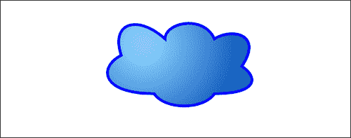
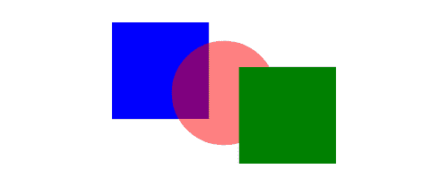
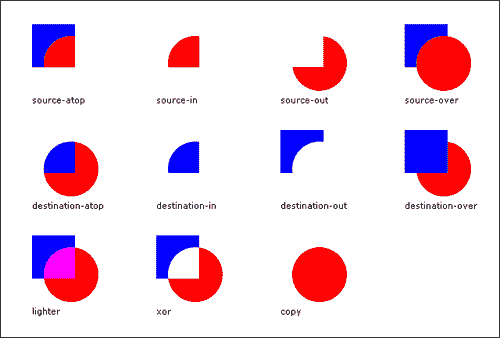
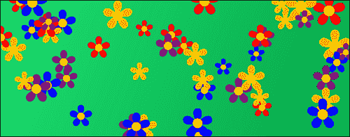
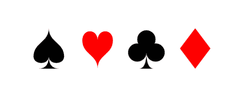

# 第二章。形状绘制和复合材料

在本章中，我们将介绍:

*   画一个矩形
*   画一个圆
*   使用自定义形状和填充样式
*   贝塞尔曲线的乐趣:绘制云
*   绘制透明形状
*   使用上下文状态堆栈保存和恢复样式
*   使用复合操作
*   创建带循环的图案:绘制齿轮
*   随机形状属性:绘制一片花
*   创建自定义形状功能:扑克牌套装
*   综合起来:画一架喷气式飞机

# 简介

在[第一章](01.html "Chapter 1. Getting Started with Paths and Text")、*路径和文字入门*中，我们学习了如何绘制线、弧、二次曲线、贝塞尔曲线等子路径，然后我们学习了如何将它们连接在一起形成路径。在本章中，我们将重点介绍基本和高级的形状绘制技术，例如绘制矩形和圆形、绘制自定义形状、填充形状、使用复合材料以及绘制图片。我们开始吧！

# 画一个长方形

在这个食谱中，我们将学习如何绘制 HTML5 画布 API 提供的唯一内置形状，一个矩形。尽管矩形看起来很无趣，但许多应用都以这样或那样的方式使用它们，所以你不妨熟悉一下。


## 怎么做...

按照以下步骤在画布上画一个简单的矩形:

1.  定义 2D 画布上下文:

    ```html
    window.onload = function(){
    var canvas = document.getElementById("myCanvas");
    var context = canvas.getContext("2d");

    ```

2.  用 `rect()`方法画一个矩形，用 `fillStyle`属性设置颜色填充，然后用 `fill()`方法:

    ```html
    context.rect(canvas.width / 2 - 100, canvas.height / 2 - 50, 200, 100);
    context.fillStyle = "#8ED6FF";
    context.fill();
    context.lineWidth = 5;
    context.strokeStyle = "black";
    context.stroke();
    };

    ```

    填充形状
3.  将画布标签嵌入到 HTML 文档的主体中:

    ```html
    <canvas id="myCanvas" width="600" height="250" style="border:1px solid black;">
    </canvas>

    ```

### 它是如何工作的...

从前面的代码中可以看到，我们可以使用 `rect()`方法绘制一个简单的矩形:

```html
context.rect(x,y,width,height);

```

`rect()`方法在 `x,y`位置画一个矩形，用 `width`和 `height`定义其大小。这个食谱中另一个需要注意的重点是 `fillStyle`和 `fill()`的用法。类似于 `strokeStyle`和 `stroke()`，我们可以使用 `fillStyle`方法指定填充颜色，并使用 `fill()`填充形状。

### 类型

请注意，我们在 `stroke()`之前使用了 `fill()`。如果我们在填充形状之前先描边它，填充样式实际上会覆盖一半的描边样式，有效地将 `lineWidth`设置的线宽样式减半。因此，在使用 `stroke()`之前使用 `fill()`是一个很好的做法。

### 还有更多...

除了 `rect()`方法之外，我们还可以使用另外两种方法来绘制矩形，并且还可以用一行代码应用样式，即 `fillRect()`方法和 `strokeRect()`方法。

#### fill rect()方法

如果我们打算在用 `rect()`绘制矩形后填充矩形，我们可以考虑使用 `fillRect():` 使用单一方法绘制矩形和填充矩形

```html
context.fillRect(x,y,width,height);

```

`fillRect()`方法相当于使用 `rect()`方法后跟 `fill()`。使用此方法时，需要在调用之前定义填充样式。

#### strokeRect()方法

除了 `fillRect()`方法之外，我们还可以使用 `strokeRect()`方法:用单一方法绘制一个矩形

```html
context.strokeRect(x,y,width,height);

```

`strokeRect()`方法相当于使用 `rect()`方法后跟 `stroke()`。类似于 `fillRect()`，您需要在调用此方法之前定义笔画样式。

### 类型

不幸的是，HTML5 画布 API 不支持同时填充和描边矩形的方法。个人喜欢使用 `rect()`方法，使用 `stroke()`和 `fill()`根据需要应用笔画样式和填充，因为更符合自定义形状绘制。然而，如果你想在使用这些短手方法中的一种的同时将笔画和填充应用于矩形，最好使用 `fillRect()`后跟 `stroke()`。如果您使用 `strokeRect()`后跟 `fill()`，您将通过填充覆盖笔画样式，将笔画线宽减半。

### 另见...

*   *在[第五章](05.html "Chapter 5. Bringing the Canvas to Life with Animation")中创建线性运动*
*   *检测区域事件[第六章](06.html "Chapter 6. Interacting with the Canvas: Attaching Event Listeners to Shapes and Regions")*
*   *在[第七章](07.html "Chapter 7. Creating Graphs and Charts")中创建条形图*

# 画一个圆

虽然 HTML5 画布 API 不支持圆的方法，但是我们当然可以通过画一个完全封闭的弧来创建一个。


## 怎么做...

按照以下步骤在画布上画一个圆心:

1.  定义 2D 画布上下文:

    ```html
    window.onload = function(){
    var canvas = document.getElementById("myCanvas");
    var context = canvas.getContext("2d");

    ```

2.  使用 `arc()`方法创建一个圆，使用 `fillStyle`属性设置颜色填充，然后使用 `fill()`方法:

    ```html
    context.arc(canvas.width / 2, canvas.height / 2, 70, 0, 2 * Math.PI, false);
    context.fillStyle = "#8ED6FF";
    context.fill();
    context.lineWidth = 5;
    context.strokeStyle = "black";
    context.stroke();
    };

    ```

    填充形状
3.  将画布标签嵌入到 HTML 文档的主体中:

    ```html
    <canvas id="myCanvas" width="600" height="250" style="border:1px solid black;">
    </canvas>

    ```

### 它是如何工作的...

你可能还记得第一章，我们可以使用 `arc()`方法创建一个弧，该方法绘制一个由起始角和终止角定义的圆的一部分。然而，如果我们将起始角和终止角之间的差值定义为 360 度(2π)，我们将有效地画出一个完整的圆:

```html
context.arc(centerX, centerY, radius, 0, 2 * Math.PI, false);

```

### 另见...

*   *用循环创建图案:绘制齿轮*
*   *在[第四章](04.html "Chapter 4. Mastering Transformations")中将圆形转化为椭圆形*
*   *摆一摆[第五章](05.html "Chapter 5. Bringing the Canvas to Life with Animation")*
*   *模拟粒子物理[第五章](05.html "Chapter 5. Bringing the Canvas to Life with Animation")中的*
*   *在[第五章](05.html "Chapter 5. Bringing the Canvas to Life with Animation")中为时钟*设置动画
*   *检测区域事件[第六章](06.html "Chapter 6. Interacting with the Canvas: Attaching Event Listeners to Shapes and Regions")*
*   *在[第七章](07.html "Chapter 7. Creating Graphs and Charts")中创建饼图*

# 使用自定义形状和填充样式

在这个食谱中，我们将绘制四个三角形，然后用不同的填充样式填充每个三角形。HTML5 画布 API 提供的填充样式有颜色填充、线性渐变、径向渐变和图案。


## 怎么做...

按照以下步骤绘制四个三角形，一个带有颜色填充，一个带有线性渐变填充，一个带有径向渐变填充，一个带有图案填充:

1.  创建一个绘制三角形的简单函数:

    ```html
    function drawTriangle(context, x, y, triangleWidth, triangleHeight, fillStyle){
    context.beginPath();
    context.moveTo(x, y);
    context.lineTo(x + triangleWidth / 2, y + triangleHeight);
    context.lineTo(x - triangleWidth / 2, y + triangleHeight);
    context.closePath();
    context.fillStyle = fillStyle;
    context.fill();
    }

    ```

2.  定义一个 2D 画布上下文，并设置我们的三角形的高度、宽度和 y 位置:

    ```html
    window.onload = function(){
    var canvas = document.getElementById("myCanvas");
    var context = canvas.getContext("2d");
    var grd;
    var triangleWidth = 150;
    var triangleHeight = 150;
    var triangleY = canvas.height / 2 - triangleWidth / 2;

    ```

3.  使用颜色填充绘制三角形:

    ```html
    // color fill (left)
    drawTriangle(context, canvas.width * 1 / 5, triangleY, triangleWidth, triangleHeight, "blue");

    ```

4.  使用线性渐变填充绘制三角形:

    ```html
    // linear gradient fill (second from left)
    grd = context.createLinearGradient(canvas.width * 2 / 5, triangleY, canvas.width * 2 / 5, triangleY + triangleHeight);
    grd.addColorStop(0, "#8ED6FF"); // light blue
    grd.addColorStop(1, "#004CB3"); // dark blue
    drawTriangle(context, canvas.width * 2 / 5, triangleY, triangleWidth, triangleHeight, grd);

    ```

5.  使用径向渐变填充绘制三角形:

    ```html
    // radial gradient fill (second from right)
    var centerX = (canvas.width * 3 / 5 +
    (canvas.width * 3 / 5 - triangleWidth / 2) +
    (canvas.width * 3 / 5 + triangleWidth / 2)) / 3;
    var centerY = (triangleY +
    (triangleY + triangleHeight) +
    (triangleY + triangleHeight)) / 3;
    grd = context.createRadialGradient(centerX, centerY, 10, centerX, centerY, 100);
    grd.addColorStop(0, "red");
    grd.addColorStop(0.17, "orange");
    grd.addColorStop(0.33, "yellow");
    grd.addColorStop(0.5, "green");
    grd.addColorStop(0.666, "blue");
    grd.addColorStop(1, "violet");
    drawTriangle(context, canvas.width * 3 / 5, triangleY, triangleWidth, triangleHeight, grd);

    ```

6.  使用图案填充绘制三角形:

    ```html
    // pattern fill (right)
    var imageObj = new Image();
    imageObj.onload = function(){
    var pattern = context.createPattern(imageObj, "repeat");
    drawTriangle(context, canvas.width * 4 / 5, triangleY, triangleWidth, triangleHeight, pattern);
    };
    imageObj.src = "wood-pattern.png";
    };

    ```

7.  将画布标签嵌入到 HTML 文档的主体中:

    ```html
    <canvas id="myCanvas" width="600" height="250" style="border:1px solid black;">
    </canvas>

    ```

### 它是如何工作的...

大家可能还记得第一章，我们可以用 `beginPath()`方法开始一个新的路径，用 `moveTo()`放置我们的绘制光标，然后绘制连续的子路径形成一个路径。我们可以通过使用画布上下文的 `closePath()`方法关闭路径来创建一个形状:，从而为这个过程增加一个步骤

```html
context.closePath();

```

这个方法本质上告诉画布上下文通过连接路径中的最后一点和路径的起点来完成当前路径。

在 `drawTriangle()`方法中，我们可以使用 `beginPath()`开始新的路径，使用 `moveTo()`定位绘制光标，使用 `lineTo()`绘制三角形的两条边，然后使用 `closePath()`完成三角形的第三条边。

从前面的截图中可以看到，左边第二个三角形填充了线性渐变。可以使用画布上下文的 `createLinearGradient()`方法创建线性渐变，该方法由起点和终点定义:

```html
var grd=context.createLinearGradient(startX,startY,endX,endY);

```

接下来，我们可以使用 `addColorStop()`方法设置渐变的颜色，该方法在沿渐变线从 0 到 1 的偏移位置指定一个颜色值:

```html
grd.addColorStop(offset,color);

```

偏移值为 0 的颜色将位于线性渐变的起点，偏移值为 1 的颜色将位于线性渐变的终点。在这个例子中，我们在三角形的顶部放置了一个浅蓝色，在三角形的底部放置了一个深蓝色。

接下来，让我们讨论径向梯度。右边的第二个三角形填充了由六种不同颜色组成的径向渐变。可以使用画布上下文的 `createRadialGradient()`方法创建径向渐变，这需要一个起点、一个起点半径、一个终点和一个终点半径:

```html
var grd=context.createRadialGradient(startX,startY,
startRadius,endX,endY,endRadius);

```

径向梯度由两个假想圆定义。第一个假想圆由 `startX, startY`和 `startRadius`定义。第二个假想圆由 `endX, endY`和 `endRadius`定义。类似于线性渐变，我们可以使用画布上下文的 `addColorStop()`方法沿着径向渐变线定位颜色。

最后，HTML5 画布 API 提供的第四种填充样式是模式。我们可以使用画布上下文的 `createPattern()`方法创建一个 `pattern`对象，这需要一个 `image`对象和一个重复选项:

```html
var pattern=context.createPattern(imageObj, repeatOption);

```

`repeatOption`可以选择四个选项中的一个， `repeat, repeat-x, repeat-y`和 `no-repeat`。除非另有规定， `repeatOption`默认为 `repeat`。我们将在[第 3 章](03.html "Chapter 3. Working with Images and Videos")、*中更深入地讨论图像和视频。*

### 另见...

*   *放在一起:画一个喷射*

# 贝塞尔曲线的乐趣:绘制云

在这个食谱中，我们将学习如何通过连接一系列贝塞尔曲线子路径来创建蓬松的云来绘制自定义形状。



## 怎么做...

按照以下步骤在画布中央绘制蓬松的云:

1.  定义 2D 画布上下文:

    ```html
    window.onload = function(){
    var canvas = document.getElementById("myCanvas");
    var context = canvas.getContext("2d");

    ```

2.  通过连接六条贝塞尔曲线绘制云:

    ```html
    var startX = 200;
    var startY = 100;
    // draw cloud shape
    context.beginPath();
    context.moveTo(startX, startY);
    context.bezierCurveTo(startX - 40, startY + 20, startX - 40, startY + 70, startX + 60, startY + 70);
    context.bezierCurveTo(startX + 80, startY + 100, startX + 150, startY + 100, startX + 170, startY + 70);
    context.bezierCurveTo(startX + 250, startY + 70, startX + 250, startY + 40, startX + 220, startY + 20);
    context.bezierCurveTo(startX + 260, startY - 40, startX + 200, startY - 50, startX + 170, startY - 30);
    context.bezierCurveTo(startX + 150, startY - 75, startX + 80, startY - 60, startX + 80, startY - 30);
    context.bezierCurveTo(startX + 30, startY - 75, startX - 20, startY - 60, startX, startY);
    context.closePath();

    ```

3.  使用 `createRadialGradient()`方法定义径向渐变，并用渐变填充形状:

    ```html
    //add a radial gradient
    var grdCenterX = 260;
    var grdCenterY = 80;
    var grd = context.createRadialGradient(grdCenterX, grdCenterY, 10, grdCenterX, grdCenterY, 200);
    grd.addColorStop(0, "#8ED6FF"); // light blue
    grd.addColorStop(1, "#004CB3"); // dark blue
    context.fillStyle = grd;
    context.fill();

    ```

4.  设置线宽和描云:

    ```html
    // set the line width and stroke color
    context.lineWidth = 5;
    context.strokeStyle = "#0000ff";
    context.stroke();
    };

    ```

5.  将画布标签嵌入到 HTML 文档的主体中:

    ```html
    <canvas id="myCanvas" width="600" height="250" style="border:1px solid black;">
    </canvas>

    ```

### 它是如何工作的...

要使用 HTML5 画布 API 绘制蓬松的云，我们可以连接几条贝塞尔曲线来形成云形状的周长。为了创建球状表面的错觉，我们可以使用 `createRadialGradient()`方法创建径向渐变，使用 `addColorStop()`方法设置渐变颜色和偏移，使用 `fillStyle`将径向渐变设置为填充样式，然后使用 `fill()`应用渐变。

# 绘制透明形状

对于需要形状分层的应用，通常需要使用透明胶片。在本食谱中，我们将学习如何使用全局 alpha 复合设置形状透明度。


## 怎么做...

按照以下步骤在不透明的正方形上画一个透明的圆:

1.  定义 2D 画布上下文:

    ```html
    window.onload = function(){
    var canvas = document.getElementById("myCanvas");
    var context = canvas.getContext("2d");

    ```

2.  画一个矩形:

    ```html
    // draw rectangle
    context.beginPath();
    context.rect(240, 30, 130, 130);
    context.fillStyle = "blue";
    context.fill();

    ```

3.  使用 `globalAlpha`属性设置画布的全局 alpha，并画一个圆:

    ```html
    // draw circle
    context.globalAlpha = 0.5; // set global alpha
    context.beginPath();
    context.arc(359, 150, 70, 0, 2 * Math.PI, false);
    context.fillStyle = "red";
    context.fill();
    };

    ```

4.  将画布标签嵌入到 HTML 文档的主体中:

    ```html
    <canvas id="myCanvas" width="600" height="250" style="border:1px solid black;">
    </canvas>

    ```

### 它是如何工作的...

要使用 HTML5 画布 API 设置形状的不透明度，我们可以使用 `globalAlpha`属性:

```html
context.globalAlpha=[value]

```

`globalAlpha`属性接受 0 到 1 之间的任何实数。我们可以将 `globalAlpha`属性设置为 `1`以使形状完全不透明，我们可以将 `globalAlpha`属性设置为 `0`以使形状完全透明。

# 使用上下文状态堆栈保存和恢复样式

当创建更复杂的 HTML5 画布应用时，您会发现自己需要一种方法来恢复到以前的样式组合，这样您就不必在绘图过程中的不同点设置和重置数十种样式属性。幸运的是，HTML5 画布 API 为我们提供了对上下文状态堆栈的访问，这允许我们保存和恢复上下文状态。在本食谱中，我们将通过保存上下文状态、设置全局 alpha、绘制透明圆圈、将状态堆栈恢复到设置全局 alpha 之前的状态，然后绘制不透明正方形来演示状态堆栈的工作方式。让我们来看看！



## 做好准备...

在我们介绍画布状态堆栈之前，您必须了解堆栈数据结构是如何工作的(如果您已经了解，您可以跳到*它是如何工作的*部分)。

堆栈数据结构是后进先出(LIFO)结构。栈有三个主要操作——**推、弹出**、**栈顶**。当一个元素被推到堆栈上时，它被添加到堆栈的顶部。弹出堆栈时，顶部元素将从堆栈中移除。*栈顶*操作只是返回栈顶的元素。


看看前面的图表，它代表了一个堆栈在多个操作中的状态。在第 1 步中，我们从包含一个元素的堆栈开始，元素“a”。在步骤 2 中，将“b”元素推送到堆栈上。在步骤 3 中，将“c”元素推到堆栈上。在第 4 步中，我们弹出堆栈，移除最后一个被推送到堆栈上的元素。因为元素“c”在堆栈的顶部，所以它是被移除的元素。在第 5 步中，我们再次弹出堆栈，这将移除最后一个被推送到堆栈上的元素。因为元素“b”在堆栈的顶部，所以它是被移除的元素。

正如我们将在下一节中看到的，堆栈是一种极好的数据结构，用于在状态随时间变化时保存状态，然后通过弹出堆栈来恢复状态。

## 怎么做...

按照以下步骤在透明圆的顶部绘制一个不透明的正方形:

1.  定义 2D 画布上下文:

    ```html
    window.onload = function(){
    var canvas = document.getElementById("myCanvas");
    var context = canvas.getContext("2d");

    ```

2.  画一个矩形:

    ```html
    // draw rectangle
    context.beginPath();
    context.rect(150, 30, 130, 130);
    context.fillStyle = "blue";
    context.fill();

    ```

3.  用 `save()`保存上下文状态，用 `globalAlpha`属性设置画布的全局 alpha，画一个圆，然后用 `restore():`

    ```html
    // wrap circle drawing code with save-restore combination
    context.save();
    context.globalAlpha = 0.5; // set global alpha
    context.beginPath();
    context.arc(canvas.width / 2, canvas.height / 2, 70, 0, 2 * Math.PI, false);
    context.fillStyle = "red";
    context.fill();
    context.restore();

    ```

    恢复画布状态
4.  绘制另一个矩形(将是不透明的)，以显示上下文状态已经恢复到设置全局 alpha 属性之前的状态:

    ```html
    // draw another rectangle
    context.beginPath();
    context.rect(canvas.width - (150 + 130), canvas.height - (30 + 130), 130, 130);
    context.fillStyle = "green";
    context.fill();
    };

    ```

5.  将画布标签嵌入到 HTML 文档的主体中:

    ```html
    <canvas id="myCanvas" width="600" height="250" style="border:1px solid black;">
    </canvas>

    ```

### 它是如何工作的...

正如您在前面的代码中看到的，通过用保存-恢复组合包装圆形绘制代码，我们实际上封装了我们在 `save()`方法和 `restore()`方法之间使用的任何样式，这样它们不会影响后来绘制的形状。保存-恢复组合可以被认为是一种诱导样式作用域的方式，类似于函数在 JavaScript 中诱导变量作用域的方式。虽然你可能会说“嗯，这听起来像是一个复杂的方式来设置全球阿尔法回到 1！”坚持住搭档。在现实世界中，您通常会为不同的代码段处理许多不同的风格组合。在这种情况下，保存-恢复组合是救命稻草。编写没有保存-恢复组合的复杂 HTML5 画布应用非常像用一大块 JavaScript 代码构建一个复杂的 web 应用，除了全局变量什么都不用。哎呀！

### 还有更多...

正如我们将在[第 4 章](04.html "Chapter 4. Mastering Transformations")、*掌握转换*中看到的，状态堆栈的另一个常见用法是保存和恢复转换状态。

### 另见...

*   *使用[第四章](04.html "Chapter 4. Mastering Transformations")中的状态堆栈*处理多个转换

# 使用复合操作

在本食谱中，我们将通过创建每个变体的表格来探索复合操作。复合操作对于创建复杂形状、在其他形状下面而不是上面绘制形状以及创建其他有趣的效果特别有用。



## 做好准备...

以下是 HTML5 画布 API 提供的每个可能的复合操作的描述，其中红色圆圈代表源(S)，蓝色方块代表目的地(D)。为了进一步发展您对复合操作的理解，阅读每个描述时查看相应的操作会有所帮助:

<colgroup><col style="text-align: left"> <col style="text-align: left"></colgroup> 
| 

操作

 | 

描述

 |
| --- | --- |
| `source-atop`(D 顶上的 S) | 在两个图像都不透明的地方显示源图像。在目标图像不透明但源图像透明的地方显示目标图像。在其他地方显示透明度。 |
| `source-in`(D 中的 S) | 在源图像和目标图像都不透明的地方显示源图像。在其他地方显示透明度。 |
| `source-out` (S 出 D) | 在源图像不透明而目标图像透明的地方显示源图像。在其他地方显示透明度。 |
| `source-over` (S 重于 D，默认) | 在源图像不透明的地方显示源图像。在其他地方显示目标图像。 |
| `destination-atop`(D 顶上的 S) | 在两个图像都不透明的地方显示目标图像。在源图像不透明但目标图像透明的地方显示源图像。在其他地方显示透明度。 |
| `destination-in`(D 中的 S) | 在目标图像和源图像都不透明的地方显示目标图像。在其他地方显示透明度。 |
| `destination -out` (S 出 D) | 在目标图像不透明而源图像透明的地方显示目标图像。在其他地方显示透明度。 |
| `destination -over` (S 重于 D) | 在目标图像不透明的地方显示目标图像。在其他地方显示目标图像。 |
| `lighter` (S 加 d) | 显示源图像和目标图像的总和。 |
| `xor` (S 异或 D) | 源映像和目标映像的异或。 |
| `copy` (D 忽略) | 显示源图像而不是目标图像。 |

在撰写本文时，处理复合操作相当棘手，因为五大浏览器——Chrome、Firefox、Safari、Opera 和 IE9——处理复合操作的方式各不相同。在撰写本文时，您不应该显示浏览器当前支持的复合操作的图表，而是应该上网搜索类似“浏览器支持的画布复合操作”的内容，以查看每个浏览器的当前支持(如果您打算使用它们的话)。

## 怎么做...

按照以下步骤创建复合操作的实时表:

1.  定义画布和文本显示的样式:

    ```html
    /* select the div child element of the body */
    body > div {
    width: 680px;
    height: 430px;
    border: 1px solid black;
    float: left;
    overflow: hidden;
    }
    canvas {
    float: left;
    margin-top: 30px;
    }
    div {
    font-size: 11px;
    font-family: verdana;
    height: 15px;
    float: left;
    width: 160px;
    }
    /* select the 1st, 5th, and 9th label div */
    body > div > div:nth-of-type(4n+1) {
    margin-left: 40px;
    }

    ```

2.  定义每个正方形和圆形的大小和相对距离:

    ```html
    window.onload = function(){
    var squareWidth = 55;
    var circleRadius = 35;
    var rectCircleDistX = 50;
    var rectCircleDistY = 50;

    ```

3.  构建复合操作数组:

    ```html
    // define an array of composite operations
    var operationArray = [];
    operationArray.push("source-atop"); // 0
    operationArray.push("source-in"); // 1
    operationArray.push("source-out"); // 2
    operationArray.push("source-over"); // 3
    operationArray.push("destination-atop"); // 4
    operationArray.push("destination-in"); // 5
    operationArray.push("destination-out"); // 6
    operationArray.push("destination-over"); // 7
    operationArray.push("lighter"); // 8
    operationArray.push("xor"); // 9
    operationArray.push("copy"); // 10

    ```

4.  执行每个操作，并在相应的画布上绘制结果:

    ```html
    // draw each of the eleven operations
    for (var n = 0; n < operationArray.length; n++) {
    var thisOperation = operationArray[n];
    var canvas = document.getElementById(thisOperation);
    var context = canvas.getContext("2d");
    // draw rectangle
    context.beginPath();
    context.rect(40, 0, squareWidth, squareWidth);
    context.fillStyle = "blue";
    context.fill();
    // set the global composite operation
    context.globalCompositeOperation = thisOperation;
    // draw circle
    context.beginPath();
    context.arc(40 + rectCircleDistX, rectCircleDistY, circleRadius, 0, 2 * Math.PI, false);
    context.fillStyle = "red";
    context.fill();
    }
    };

    ```

5.  在 HTML 文档的正文中为每个操作嵌入一个画布标签:

    ```html
    <body>
    <div>
    <canvas id="source-atop" width="160" height="90">
    </canvas>
    <canvas id="source-in" width="160" height="90">
    </canvas>
    <canvas id="source-out" width="160" height="90">
    </canvas>
    <canvas id="source-over" width="160" height="90">
    </canvas>
    <div>
    source-atop
    </div>
    <div>
    source-in
    </div>
    <div>
    source-out
    </div>
    <div>
    source-over
    </div>
    <canvas id="destination-atop" width="160" height="90">
    </canvas>
    <canvas id="destination-in" width="160" height="90">
    </canvas>
    <canvas id="destination-out" width="160" height="90">
    </canvas>
    <canvas id="destination-over" width="160" height="90">
    </canvas>
    <div>
    destination-atop
    </div>
    <div>
    destination-in
    </div>
    <div>
    destination-out
    </div>
    <div>
    destination-over
    </div>
    <canvas id="lighter" width="160" height="90">
    </canvas>
    <canvas id="xor" width="160" height="90">
    </canvas>
    <canvas id="copy" width="160" height="90">
    </canvas>
    <canvas width="160" height="90">
    </canvas>
    <div>
    lighter
    </div>
    <div>
    xor
    </div>
    <div>
    copy
    </div>
    </div>
    </body>

    ```

### 它是如何工作的...

我们可以使用画布上下文的 `globalCompositeOperation`属性来设置合成操作:

```html
context.globalCompositeOperation=[value];

```

`globalCompositeOperaton`属性接受十一个值中的一个，包括 `source-atop, source-in, source-out, source-over, destination-atop, destination-in, destination-out, destination-over, lighter, xor`， `copy. Source`指的是操作后画布上绘制的一切， `destination`指的是操作前画布上绘制的一切。除非另有说明，默认的合成操作被设置为 `source-over`，这基本上意味着每次在画布上绘制东西时，它都被绘制在已经存在的东西上面。

我们可以为每个复合操作创建一个数组，然后循环遍历每个操作，将结果绘制到相应的画布上。对于每次迭代，我们可以画一个正方形，设置合成操作，然后画一个圆。

# 用循环创建图案:绘制齿轮

在这个食谱中，我们将通过反复绘制径向之字形来形成齿，然后绘制圆形来形成齿轮的主体，从而创建一个机械齿轮。


## 怎么做...

按照以下步骤在画布上绘制居中的齿轮:

1.  定义 2D 画布上下文并设置齿轮属性:

    ```html
    window.onload = function(){
    var canvas = document.getElementById("myCanvas");
    var context = canvas.getContext("2d");
    // gear position
    var centerX = canvas.width / 2;
    var centerY = canvas.height / 2;
    // radius of the teeth tips
    var outerRadius = 95;
    // radius of the teeth intersections
    var innerRadius = 50;
    // radius of the gear without the teeth
    var midRadius = innerRadius * 1.6;
    // radius of the hole
    var holeRadius = 10;
    // num points is the number of points that are required
    // to make the gear teeth. The number of teeth on the gear
    // are equal to half of the number of points. In this recipe,
    // we will use 50 points which corresponds to 25 gear teeth.
    var numPoints = 50;

    ```

2.  画出轮齿:

    ```html
    // draw gear teeth
    context.beginPath();
    // we can set the lineJoinproperty to bevel so that the tips
    // of the gear teeth are flat and don't come to a sharp point
    context.lineJoin = "bevel";
    // loop through the number of points to create the gear shape
    for (var n = 0; n < numPoints; n++) {
    var radius = null;
    // draw tip of teeth on even iterations
    if (n % 2 == 0) {
    radius = outerRadius;
    }
    // draw teeth connection which lies somewhere between
    // the gear center and gear radius
    else {
    radius = innerRadius;
    }
    var theta = ((Math.PI * 2) / numPoints) * (n + 1);
    var x = (radius * Math.sin(theta)) + centerX;
    var y = (radius * Math.cos(theta)) + centerY;
    // if first iteration, use moveTo() to position
    // the drawing cursor
    if (n == 0) {
    context.moveTo(x, y);
    }
    // if any other iteration, use lineTo() to connect sub paths
    else {
    context.lineTo(x, y);
    }
    }
    context.closePath();
    // define the line width and stroke color
    context.lineWidth = 5;
    context.strokeStyle = "#004CB3";
    context.stroke();

    ```

3.  绘制齿轮体:

    ```html
    // draw gear body
    context.beginPath();
    context.arc(centerX, centerY, midRadius, 0, 2 * Math.PI, false);
    // create a linear gradient
    var grd = context.createLinearGradient(230, 0, 370, 200);
    grd.addColorStop(0, "#8ED6FF"); // light blue
    grd.addColorStop(1, "#004CB3"); // dark blue
    context.fillStyle = grd;
    context.fill();
    context.lineWidth = 5;
    context.strokeStyle = "#004CB3";
    context.stroke();

    ```

4.  画齿轮孔:

    ```html
    // draw gear hole
    context.beginPath();
    context.arc(centerX, centerY, holeRadius, 0, 2 * Math.PI, false);
    context.fillStyle = "white";
    context.fill();
    context.strokeStyle = "#004CB3";
    context.stroke();
    };

    ```

5.  将画布标签嵌入到 HTML 文档的主体中:

    ```html
    <canvas id="myCanvas" width="600" height="250" style="border:1px solid black;">
    </canvas>

    ```

### 它是如何工作的...

要用 HTML5 画布画一个齿轮，我们可以从画齿轮周围的齿开始。在齿轮周围画齿的一种方法是用斜线连接画一个径向之字形。径向之字形的一个很好的例子是恒星，它沿着一个假想的内圆有五个点，沿着一个假想的外圆还有五个点。为了创建一个星形，我们可以设置一个有 10 次迭代的循环，每个点一次迭代。对于偶数迭代，我们可以沿着外圆画一个点，对于奇数迭代，我们可以沿着内圆画一个点。因为我们的恒星将有 10 个点，每个点将被(2π / 10)弧度分开。

你可能会问自己“明星和齿轮齿有什么关系？”。如果我们扩展这个逻辑，画一个 50 点而不是 10 点的之字形，我们将有效地创建一个有 25 个楔形齿的齿轮。

一旦照顾好齿轮齿，我们就可以用 `createLinearGradient()`方法画一个圆并应用线性梯度，然后为齿轮的孔画一个更小的圆。

### 另见...

*   *在[第五章](05.html "Chapter 5. Bringing the Canvas to Life with Animation")中激活机械齿轮*

# 随机形状属性:绘制一片花

在这个食谱中，我们将通过创造一片五彩缤纷的花来拥抱我们内心的嬉皮士。



## 怎么做...

按照以下步骤在画布上绘制随机花朵:

1.  定义 `Flower`对象的构造函数:

    ```html
    // define Flower constructor
    function Flower(context, centerX, centerY, radius, numPetals, color){
    this.context = context;
    this.centerX = centerX;
    this.centerY = centerY;
    this.radius = radius;
    this.numPetals = numPetals;
    this.color = color;
    }

    ```

2.  定义 `Flower`对象的 `draw`方法，用 `for`循环创建花瓣，然后绘制黄色中心:

    ```html
    // Define Flower draw method
    Flower.prototype.draw = function(){
    var context = this.context;
    context.beginPath();
    // draw petals
    for (var n = 0; n < this.numPetals; n++) {
    var theta1 = ((Math.PI * 2) / this.numPetals) * (n + 1);
    var theta2 = ((Math.PI * 2) / this.numPetals) * (n);
    var x1 = (this.radius * Math.sin(theta1)) + this.centerX;
    var y1 = (this.radius * Math.cos(theta1)) + this.centerY;
    var x2 = (this.radius * Math.sin(theta2)) + this.centerX;
    var y2 = (this.radius * Math.cos(theta2)) + this.centerY;
    context.moveTo(this.centerX, this.centerY);
    context.bezierCurveTo(x1, y1, x2, y2, this.centerX, this.centerY);
    }
    context.closePath();
    context.fillStyle = this.color;
    context.fill();
    // draw yellow center
    context.beginPath();
    context.arc(this.centerX, this.centerY, this.radius / 5, 0, 2 * Math.PI, false);
    context.fillStyle = "yellow";
    context.fill();
    };

    ```

3.  设置 2D 画布上下文:

    ```html
    window.onload = function(){
    var canvas = document.getElementById("myCanvas");
    var context = canvas.getContext("2d");

    ```

4.  为背景创建绿色渐变:

    ```html
    // create a green gradation for background
    context.beginPath();
    context.rect(0, 0, canvas.width, canvas.height);
    var grd = context.createLinearGradient(0, 0, canvas.width, canvas.height);
    grd.addColorStop(0, "#1EDE70"); // light green
    grd.addColorStop(1, "#00A747"); // dark green
    context.fillStyle = grd;
    context.fill();

    ```

5.  创建一组花卉颜色:

    ```html
    // define an array of colors
    var colorArray = [];
    colorArray.push("red"); // 0
    colorArray.push("orange"); // 1
    colorArray.push("blue"); // 2
    colorArray.push("purple"); // 3

    ```

6.  创建一个循环，生成具有随机位置、大小和颜色的花朵:

    ```html
    // define number of flowers
    var numFlowers = 50;
    // draw randomly placed flowers
    for (var n = 0; n < numFlowers; n++) {
    var centerX = Math.random() * canvas.width;
    var centerY = Math.random() * canvas.height;
    var radius = (Math.random() * 25) + 25;
    var colorIndex = Math.round(Math.random() * (colorArray.length - 1));
    var thisFlower = new Flower(context, centerX, centerY, radius, 5, colorArray[colorIndex]);
    thisFlower.draw();
    }
    };

    ```

7.  将画布标签嵌入到 HTML 文档的主体中:

    ```html
    <canvas id="myCanvas" width="600" height="250" style="border:1px solid black;">
    </canvas>

    ```

### 它是如何工作的...

这个食谱是关于随机对象属性和使用 HTML5 画布在屏幕上绘制结果。这个想法是创造一束不同位置、大小和颜色的花。

为了帮助我们创建一个花田，创建一个 `Flower`类来定义花的属性和绘制花的方法是很有用的。对于这个食谱，我一直保持花瓣的数量不变，尽管你当然可以自己为每朵花尝试不同数量的花瓣。

画一朵花实际上与我们之前的食谱*非常相似，用循环创造图案:画一个齿轮*，只是这次，我们将围绕一个圆画花瓣，而不是之字形。我发现用 HTML5 画布画花瓣最简单的方法就是画一条 Bezier 曲线，它的起点和终点相连。贝塞尔曲线的起点和终点在花的中心，控制点在 `Flower`类的 `draw()`方法中用每次迭代来定义。

一旦我们的 `Flower`类被建立并准备好，我们就可以创建一个循环，在每次迭代中实例化随机的 `Flower`对象，然后用 `draw()`方法渲染它们。

如果你自己尝试这个食谱，你会发现每次你刷新屏幕时，这些花都是完全随机的。

# 创建自定义形状功能:扑克牌套装

如果皇家同花顺让你肾上腺素上升，那么这个是给你的。在这个食谱中，我们将为铲子、心、球杆和钻石套装创建绘图功能。



## 怎么做...

按照以下步骤画出铲子、心、球杆和钻石套装:

1.  定义 drawSpade()函数，用四条贝塞尔曲线、两条二次曲线和一条直线绘制一个 spade:

    ```html
    function drawSpade(context, x, y, width, height){
    context.save();
    var bottomWidth = width * 0.7;
    var topHeight = height * 0.7;
    var bottomHeight = height * 0.3;
    context.beginPath();
    context.moveTo(x, y);
    // top left of spade
    context.bezierCurveTo(
    x, y + topHeight / 2, // control point 1
    x - width / 2, y + topHeight / 2, // control point 2
    x - width / 2, y + topHeight // end point
    );
    // bottom left of spade
    context.bezierCurveTo(
    x - width / 2, y + topHeight * 1.3, // control point 1
    x, y + topHeight * 1.3, // control point 2
    x, y + topHeight // end point
    );
    // bottom right of spade
    context.bezierCurveTo(
    x, y + topHeight * 1.3, // control point 1
    x + width / 2, y + topHeight * 1.3, // control point 2
    x + width / 2, y + topHeight // end point
    );
    // top right of spade
    context.bezierCurveTo(
    x + width / 2, y + topHeight / 2, // control point 1
    x, y + topHeight / 2, // control point 2
    x, y // end point
    );
    context.closePath();
    context.fill();
    // bottom of spade
    context.beginPath();
    context.moveTo(x, y + topHeight);
    context.quadraticCurveTo(
    x, y + topHeight + bottomHeight, // control point
    x - bottomWidth / 2, y + topHeight + bottomHeight // end point
    );
    context.lineTo(x + bottomWidth / 2, y + topHeight + bottomHeight);
    context.quadraticCurveTo(
    x, y + topHeight + bottomHeight, // control point
    x, y + topHeight // end point
    );
    context.closePath();
    context.fillStyle = "black";
    context.fill();
    context.restore();
    }

    ```

2.  定义 drawHeart()函数，用四条贝塞尔曲线绘制心脏:

    ```html
    function drawHeart(context, x, y, width, height){
    context.save();
    context.beginPath();
    var topCurveHeight = height * 0.3;
    context.moveTo(x, y + topCurveHeight);
    // top left curve
    context.bezierCurveTo(
    x, y,
    x - width / 2, y,
    x - width / 2, y + topCurveHeight
    );
    // bottom left curve
    context.bezierCurveTo(
    x - width / 2, y + (height + topCurveHeight) / 2,
    x, y + (height + topCurveHeight) / 2,
    x, y + height
    );
    // bottom right curve
    context.bezierCurveTo(
    x, y + (height + topCurveHeight) / 2,
    x + width / 2, y + (height + topCurveHeight) / 2,
    x + width / 2, y + topCurveHeight
    );
    // top right curve
    context.bezierCurveTo(
    x + width / 2, y,
    x, y,
    x, y + topCurveHeight
    );
    context.closePath();
    context.fillStyle = "red";
    context.fill();
    context.restore();
    }

    ```

3.  定义 drawClub()函数，用四个圆、两条二次曲线和一条直线绘制一个球杆:

    ```html
    function drawClub(context, x, y, width, height){
    context.save();
    var circleRadius = width * 0.3;
    var bottomWidth = width * 0.5;
    var bottomHeight = height * 0.35;
    context.fillStyle = "black";
    // top circle
    context.beginPath();
    context.arc(
    x, y + circleRadius + (height * 0.05),
    circleRadius, 0, 2 * Math.PI, false
    );
    context.fill();
    // bottom right circle
    context.beginPath();
    context.arc(
    x + circleRadius, y + (height * 0.6),
    circleRadius, 0, 2 * Math.PI, false
    );
    context.fill();
    // bottom left circle
    context.beginPath();
    context.arc(
    x - circleRadius, y + (height * 0.6),
    circleRadius, 0, 2 * Math.PI, false
    );
    context.fill();
    // center filler circle
    context.beginPath();
    context.arc(
    x, y + (height * 0.5),
    circleRadius / 2, 0, 2 * Math.PI, false
    );
    context.fill();
    // bottom of club
    context.moveTo(x, y + (height * 0.6));
    context.quadraticCurveTo(
    x, y + height,
    x - bottomWidth / 2, y + height
    );
    context.lineTo(x + bottomWidth / 2, y + height);
    context.quadraticCurveTo(
    x, y + height,
    x, y + (height * 0.6)
    );
    context.closePath();
    context.fill();
    context.restore();
    }

    ```

4.  定义 drawDiamond()函数，用四条直线绘制钻石:

    ```html
    function drawDiamond(context, x, y, width, height){
    context.save();
    context.beginPath();
    context.moveTo(x, y);
    // top left edge
    context.lineTo(x - width / 2, y + height / 2);
    // bottom left edge
    context.lineTo(x, y + height);
    // bottom right edge
    context.lineTo(x + width / 2, y + height / 2);
    // closing the path automatically creates
    // the top right edge
    context.closePath();
    context.fillStyle = "red";
    context.fill();
    context.restore();
    }

    ```

5.  当页面加载时，定义画布上下文，然后使用四个绘图功能渲染一把铲子、一颗心、一根球杆和一颗钻石:

    ```html
    window.onload = function(){
    var canvas = document.getElementById("myCanvas");
    var context = canvas.getContext("2d");
    drawSpade(context, canvas.width * 0.2, 70, 75, 100);
    drawHeart(context, canvas.width * 0.4, 70, 75, 100);
    drawClub(context, canvas.width * 0.6, 70, 75, 100);
    drawDiamond(context, canvas.width * 0.8, 70, 75, 100);
    };

    ```

6.  将画布标签嵌入到 HTML 文档的主体中:

    ```html
    <canvas id="myCanvas" width="600" height="250" style="border:1px solid black;">
    </canvas>

    ```

### 它是如何工作的...

这个配方演示了如何通过组合 HTML5 画布提供的四种主要类型的子路径来绘制任何形状:直线、圆弧、二次曲线和贝塞尔曲线。

要画一把铲子，我们可以连接四条贝塞尔曲线形成顶部，我们可以使用两条二次曲线和一条直线形成底部。为了画一个心形，我们可以用与创建铲子几乎相同的方式连接四条贝塞尔曲线，除了形状的点在底部而不是顶部。为了创建一个球杆，我们可以用圆弧为顶部画三个圆，和铲子类似，我们可以用两条二次曲线和一条直线来形成底部。最后，要画一颗钻石，我们可以简单地连接四条直线。

# 综合起来:画一架喷气式飞机

在这个食谱中，我们将通过使用线、曲线、形状、颜色、线性渐变和径向渐变绘制矢量样式的喷射来推动 HTML5 画布绘制 API 的极限。


## 怎么做...

按照以下步骤绘制矢量样式的喷射:

1.  定义 2D 画布上下文并设置线条连接样式:

    ```html
    window.onload = function(){
    var canvas = document.getElementById("myCanvas");
    var context = canvas.getContext("2d");
    var grd;
    context.lineJoin = "round";

    ```

2.  画右尾翼:

    ```html
    // outline right tail wing
    context.beginPath();
    context.moveTo(248, 60); //13
    context.lineTo(262, 45); // 12
    context.lineTo(285, 56); //11
    context.lineTo(284, 59); // 10
    context.lineTo(276, 91); // 9
    context.closePath();
    context.fillStyle = "#495AFE";
    context.fill();
    context.lineWidth = 4;
    context.stroke();
    // right tail wing detail
    context.beginPath();
    context.moveTo(281, 54); // 10
    context.lineTo(273, 84); // 9
    context.closePath();
    context.lineWidth = 2;
    context.stroke();

    ```

3.  画右翼:

    ```html
    // outline right wing
    context.beginPath();
    context.moveTo(425, 159);
    context.lineTo(449, 91); // 4
    context.lineTo(447, 83); // 5
    context.lineTo(408, 67); // 6
    context.lineTo(343, 132); // 7
    context.fillStyle = "#495AFE";
    context.fill();
    context.lineWidth = 4;
    context.stroke();
    // right wing detail
    context.beginPath();
    context.moveTo(420, 158);
    context.lineTo(447, 83); // 4
    context.lineWidth = 2;
    context.stroke();
    context.beginPath();
    context.moveTo(439, 102);
    context.lineTo(395, 81);
    context.lineWidth = 2;
    context.stroke();

    ```

4.  画出身体和尾巴顶部:

    ```html
    // outline body
    context.beginPath();
    context.moveTo(541, 300); // 1
    context.quadraticCurveTo(529, 252, 490, 228); // 2
    context.quadraticCurveTo(487, 160, 303, 123); // 3
    // outline tail
    context.lineTo(213, 20); // 14
    context.lineTo(207, 22); // 15
    context.bezierCurveTo(208, 164, 255, 207, 412, 271); // 27
    context.lineTo(427, 271); // 28
    context.quadraticCurveTo(470, 296, 541, 300); // 1
    context.closePath();
    grd = context.createLinearGradient(304, 246, 345, 155);
    grd.addColorStop(0, "#000E91"); // dark blue
    grd.addColorStop(1, "#495AFE"); // light blue
    context.fillStyle = grd;
    context.fill();
    context.lineWidth = 4;
    context.stroke();
    // tail detail
    context.beginPath();
    context.moveTo(297, 124);
    context.lineTo(207, 22);
    context.lineWidth = 2;
    context.stroke();

    ```

5.  画左尾翼:

    ```html
    // outline left tail wing
    context.beginPath();
    context.moveTo(303, 121); // 8
    context.lineTo(297, 125); // 8
    context.lineTo(255, 104);
    context.lineWidth = 2;
    context.stroke();
    context.beginPath();
    context.moveTo(212, 80);
    context.lineTo(140, 85); // 18
    context.lineTo(138, 91); // 19
    context.lineTo(156, 105); // 20
    context.lineTo(254, 104);
    context.lineTo(254, 100);
    context.lineWidth = 4;
    context.fillStyle = "#495AFE";
    context.fill();
    context.stroke();
    // left tail wing detail
    context.beginPath();
    context.moveTo(140, 86); // 18
    context.lineTo(156, 100); // 20
    context.lineTo(254, 100);
    context.lineTo(209, 77);
    context.lineWidth = 2;
    context.stroke();

    ```

6.  画左翼:

    ```html
    // outline left wing
    context.beginPath();
    context.moveTo(262, 166); // 22
    context.lineTo(98, 208); // 23
    context.lineTo(96, 215); // 24
    context.lineTo(136, 245); // 25
    context.lineTo(339, 218);
    context.lineTo(339, 215);
    context.closePath();
    context.fillStyle = "#495AFE";
    context.fill();
    context.lineWidth = 4;
    context.stroke();
    // left wing detail
    context.beginPath();
    context.moveTo(98, 210);
    context.lineTo(136, 240); // 25
    context.lineTo(339, 213);
    context.lineWidth = 2;
    context.stroke();
    context.beginPath();
    context.moveTo(165, 235);
    context.lineTo(123, 203);
    context.lineWidth = 2;
    context.stroke();

    ```

7.  绘制侧面详图:

    ```html
    // side detail
    context.beginPath();
    context.moveTo(427, 271);
    context.lineTo(423, 221);
    context.quadraticCurveTo(372, 175, 310, 155);
    context.lineWidth = 4;
    context.stroke();

    ```

8.  画鼻子细节:

    ```html
    // nose detail
    context.beginPath();
    context.moveTo(475, 288);
    context.quadraticCurveTo(476, 256, 509, 243);
    context.quadraticCurveTo(533, 268, 541, 300); // 1
    context.quadraticCurveTo(501, 300, 475, 288);
    grd = context.createLinearGradient(491, 301, 530, 263);
    grd.addColorStop(0, "#9D0000"); // dark red
    grd.addColorStop(1, "#FF0000"); // light red
    context.fillStyle = grd;
    context.fill();
    context.lineWidth = 4;
    context.stroke();
    context.beginPath();
    context.moveTo(480, 293);
    context.quadraticCurveTo(480, 256, 513, 246);
    context.lineWidth = 2;
    context.stroke();

    ```

9.  绘制驾驶舱:

    ```html
    // cockpit detail
    context.beginPath();
    context.moveTo(442, 169);
    context.quadraticCurveTo(419, 176, 415, 200);
    context.quadraticCurveTo(483, 250, 490, 228);
    context.quadraticCurveTo(480, 186, 439, 170);
    context.lineWidth = 4;
    context.stroke();
    grd = context.createRadialGradient(473, 200, 20, 473, 200, 70);
    grd.addColorStop(0, "#E1E7FF"); // dark gray
    grd.addColorStop(1, "#737784"); // light gray
    context.fillStyle = grd;
    context.fill();
    context.beginPath();
    context.moveTo(448, 173);
    context.quadraticCurveTo(425, 176, 420, 204);
    context.lineWidth = 2;
    context.stroke();
    context.beginPath();
    context.moveTo(470, 186);
    context.quadraticCurveTo(445, 190, 440, 220);
    context.lineWidth = 2;
    context.stroke();

    ```

10.  绘制进气口:

    ```html
    // intake outline
    context.beginPath();
    context.moveTo(420, 265);
    context.lineTo(416, 223);
    context.bezierCurveTo(384, 224, 399, 270, 420, 265);
    context.closePath();
    context.fillStyle = "#001975";
    context.fill();
    context.lineWidth = 4;
    context.stroke();
    context.beginPath();
    context.moveTo(420, 265);
    context.lineTo(402, 253);
    context.lineWidth = 2;
    context.stroke();
    context.beginPath();
    context.moveTo(404, 203);
    context.bezierCurveTo(364, 204, 379, 265, 394, 263);
    context.lineWidth = 2;
    context.stroke();
    };

    ```

11.  将画布标签嵌入到 HTML 文档的主体中:

    ```html
    <canvas id="myCanvas" width="650" height="350" style="border:1px solid black;">
    </canvas>

    ```

### 它是如何工作的...

这个配方结合了直线、二次曲线、贝塞尔曲线、路径、形状、实心填充、线性渐变和径向渐变的使用。虽然 HTML5 画布确实非常简陋，但它确实提供了我们制作伟大绘画所需的一切，包括矢量风格的喷气式飞机。

要用 HTML5 画布绘制一个 jet，我们可以从在 Adobe Photoshop 或其他一些图像编辑器中绘制一个 jet 开始，绘制区域大小等于我们画布的大小，在本例中是 650 x 350 像素。接下来，我们可以通过将光标悬停在绘图中每条线的端点上并记录 x，y 坐标，来找到形成喷射形状的主要点。有了这些坐标在手，我们可以用 4 的线宽画出喷流的主要轮廓，我们可以回去用 2 的线宽填充喷流的更精细的细节。

### 类型

最好先绘制离查看器最远的绘图部分，因为您在画布上绘制的每个形状都将与前面的形状重叠。如果你看一下前面的代码，你会注意到右边的机翼首先被画出来，然后是飞机的机身，接着是左边的机翼。这是因为右翼离观察者最远，而左翼离观察者最近。

画线完成后，我们可以用纯色填充喷气机，给车身添加线性渐变，给驾驶舱添加径向渐变，让画图有一些深度。最后，我们可以给飞机的机头增加一个大胆的红色渐变，为起飞做准备，激发我们的想象力。