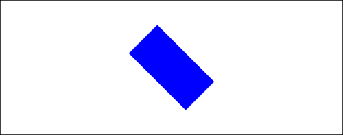
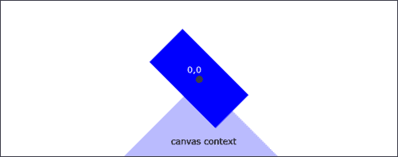
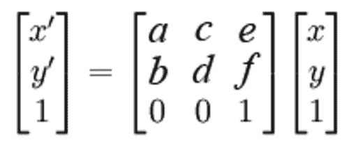
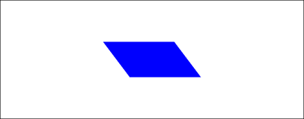
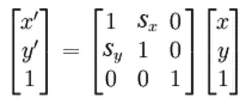
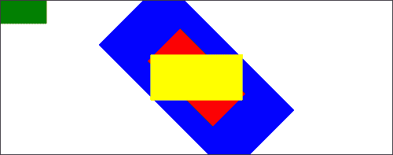
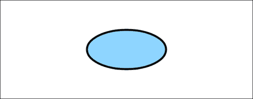

# 第四章。掌握转变

在本章中，我们将介绍:

*   翻译画布上下文
*   旋转画布上下文
*   缩放画布上下文
*   创建镜像变换
*   创建自定义转换
*   剪切画布上下文
*   使用状态堆栈处理多个转换
*   把圆形变成椭圆形
*   旋转图像
*   画一个简单的标志，并随机其位置，旋转和比例

# 简介

这一章将揭示画布转换的力量，它可以极大地简化复杂的绘图，并提供新的功能，否则我们不会有。到目前为止，我们一直用 x 和 y 坐标在屏幕上直接定位元素。如果您已经计算出复杂绘图中每个点的坐标，然后决定整个绘图需要重新定位、旋转或缩放，这很快就会成为一个问题。画布变换通过使开发人员能够平移、旋转和缩放画布的整个部分来解决这个问题，而不必重新处理组成绘图的每个点的坐标。此外，画布变换还使开发人员能够旋转和缩放图像和文本，这在没有变换的情况下是不可能的。我们开始吧！

# 翻译画布上下文

在这个食谱中，我们将学习如何执行 HTML5 画布 API 提供的最基本和最常用的转换——翻译。如果你不熟悉转换术语，“翻译”只是一种表达“移动”的奇特方式。在这种情况下，我们将把上下文移动到画布上的新位置。


## 怎么做...

按照以下步骤绘制移动到画布中心的平移矩形:

1.  定义画布上下文和矩形的尺寸:

    ```html
    window.onload = function(){
    var canvas = document.getElementById("myCanvas");
    var context = canvas.getContext("2d");
    var rectWidth = 150;
    var rectHeight = 75;

    ```

2.  将上下文翻译到画布的中心:

    ```html
    // translate context to center of canvas
    context.translate(canvas.width / 2, canvas.height / 2);

    ```

3.  绘制一个矩形，其中心位于翻译后的画布上下文的左上角:

    ```html
    context.fillStyle = "blue";
    context.fillRect(-rectWidth / 2, -rectHeight / 2, rectWidth, rectHeight);
    };

    ```

4.  将画布标签嵌入到 HTML 文档的主体中:

    ```html
    <canvas id="myCanvas" width="600" height="250" style="border:1px solid black;">
    </canvas>

    ```

### 它是如何工作的...

这就是它的工作原理！


HTML5 画布转换背后的思想是以某种方式转换画布上下文，然后绘制到画布上。在本食谱中，我们翻译了画布上下文，使上下文的左上角移到画布的中心:

```html
context.translate(tx,ty);

```

*`tx`参数对应水平平移， `ty`参数对应垂直平移。一旦上下文被转换，我们可以在画布上下文的左上角画一个矩形。最终的结果是一个平移的矩形，被移动到画布的中心。*

 *# 旋转画布上下文

HTML5 画布应用编程接口提供的下一种类型的转换，可以说是最方便的，是旋转转换。在这个食谱中，我们首先用平移变换定位画布上下文，然后用 `rotate()`方法旋转上下文。



## 怎么做...

按照以下步骤绘制旋转矩形:

1.  定义画布上下文和矩形的尺寸:

    ```html
    window.onload = function(){
    var canvas = document.getElementById("myCanvas");
    var context = canvas.getContext("2d");
    var rectWidth = 150;
    var rectHeight = 75;

    ```

2.  平移画布上下文，然后旋转 45 度:

    ```html
    // translate context to center of canvas
    context.translate(canvas.width / 2, canvas.height / 2);
    // rotate context 45 degrees clockwise
    context.rotate(Math.PI / 4);

    ```

3.  画出矩形:

    ```html
    context.fillStyle = "blue";
    context.fillRect(-rectWidth / 2, -rectHeight / 2, rectWidth, rectHeight);
    };

    ```

4.  将画布标签嵌入到 HTML 文档的主体中:

    ```html
    <canvas id="myCanvas" width="600" height="250" style="border:1px solid black;">
    </canvas>

    ```

### 它是如何工作的...

这就是它的工作原理！



为了定位和旋转矩形，我们可以将画布上下文平移到画布的中心，就像我们在前面的食谱中所做的那样，然后我们可以使用旋转变换旋转画布上下文，该变换围绕上下文的左上角旋转上下文:

```html
canvas.rotate(theta);

```

参数 `theta`以弧度为单位，变换顺时针旋转上下文。一旦上下文被平移和旋转，我们就可以在上下文的左上角画一个居中的矩形。最终结果是一个以画布为中心的旋转矩形。

### 类型

请注意，我们已经通过链接两个不同的转换，一个平移和一个旋转，实现了这个结果。HTML5 画布 API 提供的三种转换中的每一种都将转换矩阵应用于当前状态。例如，如果我们一个接一个地应用三个平移，将画布上下文向右移动 10 个像素，最终结果将是向右平移 30 个像素。

如果我们想要围绕不同的点旋转矩形，比如说矩形的右下角，我们可以简单地在画布上下文的原点绘制矩形的右下角。

在创建复杂的 HTML5 画布绘图时，平移和旋转是最常用的变换链。正如我们将在下一章中看到的，旋转在制作绕轴旋转的形状的动画时特别有用。

### 另见...

*   *摆一摆[第五章](05.html "Chapter 5. Bringing the Canvas to Life with Animation")*
*   *在[第五章](05.html "Chapter 5. Bringing the Canvas to Life with Animation")中激活机械齿轮*
*   *在[第五章](05.html "Chapter 5. Bringing the Canvas to Life with Animation")中为时钟*设置动画

# 缩放画布上下文

除了翻译和旋转，HTML5 画布 API 还为我们提供了缩放画布上下文的方法。在本食谱中，我们将使用 `scale()`方法缩小画布上下文的高度。


## 怎么做...

按照以下步骤绘制缩放矩形:

1.  定义画布上下文和矩形的尺寸:

    ```html
    window.onload = function(){
    var canvas = document.getElementById("myCanvas");
    var context = canvas.getContext("2d");
    var rectWidth = 150;
    var rectHeight = 75;

    ```

2.  平移画布上下文，然后将画布上下文高度缩放 50%

    ```html
    // translate context to center of canvas
    context.translate(canvas.width / 2, canvas.height / 2);
    // scale down canvas height by half
    context.scale(1, 0.5);

    ```

3.  绘制一个矩形，其中心位于画布上下文的左上角:

    ```html
    context.fillStyle = "blue";
    context.fillRect(-rectWidth / 2, -rectHeight / 2, rectWidth, rectHeight);
    };

    ```

4.  将画布标签嵌入到 HTML 文档的主体中:

    ```html
    <canvas id="myCanvas" width="600" height="250" style="border:1px solid black;">
    </canvas>

    ```

### 它是如何工作的...

为了缩放画布上下文，我们可以简单地使用缩放变换:

```html
context.scale(sx,sy);

```

在上下文的默认状态下， `sx`和 `sy`参数被归一化为 `1`和 `1`。如您所料， `sx`参数对应水平刻度， `sy`参数对应垂直刻度。

在本食谱中，我们通过将 `sy`参数设置为 `0.5`值，将垂直上下文缩小了 50%。另一方面，如果我们将 `sy`赋给一个大于 `1`的值，上下文将垂直延伸。正如我们将在下一个配方中看到的，如果我们为 `sx`或 `sy`值指定负值，我们将最终水平或垂直反转画布上下文，创建镜像变换。

### 另见...

*   *振荡气泡[第五章](05.html "Chapter 5. Bringing the Canvas to Life with Animation")*

# 创建镜像变换

缩放变换的另一个有趣的用途是它能够垂直或水平地镜像画布上下文。在这个食谱中，我们将水平镜像画布上下文，然后写出一些向后的文本。


## 怎么做...

按照以下步骤向后书写文本:

1.  定义画布上下文:

    ```html
    window.onload = function(){
    var canvas = document.getElementById("myCanvas");
    var context = canvas.getContext("2d");

    ```

2.  翻译画布上下文，然后使用负值 `x`:

    ```html
    // translate context to center of canvas
    context.translate(canvas.width / 2, canvas.height / 2);
    // flip context horizontally
    context.scale(-1, 1);

    ```

    水平翻转上下文
3.  写“你好世界！”:

    ```html
    context.font = "30pt Calibri";
    context.textAlign = "center";
    context.fillStyle = "blue";
    context.fillText("Hello World!", 0, 0);
    };

    ```

4.  将画布标签嵌入到 HTML 文档的主体中:

    ```html
    <canvas id="myCanvas" width="600" height="250" style="border:1px solid black;">
    </canvas>

    ```

### 它是如何工作的...

要使用 HTML5 画布 API 创建镜像变换，我们可以在使用画布上下文的 `scale`方法时为 `sx`或 `sy`指定负值:

```html
context.scale(-sx,-sy);

```

在这个食谱中，我们已经将画布上下文转换到画布的中心，然后通过使用 `scale()`变换应用 `-sx`值来水平反转上下文。

# 创建自定义转换

如果您希望执行除平移、缩放或旋转之外的自定义转换，HTML5 画布 API 还提供了一种方法，允许我们定义可应用于当前上下文的自定义转换矩阵。在这个食谱中，我们将手动创建一个平移变换来演示 `transform()`方法是如何工作的。


## 怎么做...

按照以下步骤执行自定义转换:

1.  为我们的矩形定义画布上下文和尺寸:

    ```html
    window.onload = function(){
    var canvas = document.getElementById("myCanvas");
    var context = canvas.getContext("2d");
    var rectWidth = 150;
    var rectHeight = 75;

    ```

2.  通过手动转换画布上下文来应用自定义转换:

    ```html
    // translation matrix:
    // 1 0 tx
    // 0 1 ty
    // 0 0 1
    var tx = canvas.width / 2;
    var ty = canvas.height / 2;
    // apply custom transform
    context.transform(1, 0, 0, 1, tx, ty);

    ```

3.  画出矩形:

    ```html
    context.fillStyle = "blue";
    context.fillRect(-rectWidth / 2, -rectHeight / 2, rectWidth, rectHeight);
    };

    ```

4.  将画布元素嵌入到 HTML 文档的主体中:

    ```html
    <canvas id="myCanvas" width="600" height="250" style="border:1px solid black;">
    </canvas>

    ```

### 它是如何工作的...

在本食谱中，我们通过将自定义翻译转换矩阵应用于上下文状态来创建自定义翻译转换。变换矩阵只是一个二维矩阵，可用于将当前矩阵变换为新矩阵。可以使用画布上下文的 `transform()`方法将自定义转换应用于上下文状态:

```html
context.transform(a,b,c,d,e,f);

```

其中参数 `a, b, c, d, e`和 `f`对应于变换矩阵的以下组成部分:



这里*x '**y '*是应用变换后的新矩阵 *x* 和 *y* 组件。平移变换的变换矩阵如下所示:


其中 *tx* 为水平平移， *ty* 为垂直平移。

### 还有更多...

除了*将*变换矩阵应用于当前上下文状态的 `transform()`方法外，我们还可以*使用画布上下文的 `setTransform()`方法设置变换矩阵*

```html
context.setTransform(a,b,c,d,e,f);

```

如果您想用公式化的转换矩阵直接设置上下文的转换矩阵，而不是通过一系列转换获得相同的结果，那么这个方法会很有用。

# 剪切画布上下文

在本食谱中，我们将使用从画布上下文的 `transform()`方法中学到的知识来创建一个自定义剪切变换，以水平倾斜画布上下文。



## 怎么做...

按照以下步骤绘制剪切矩形:

1.  定义画布上下文和矩形的尺寸:

    ```html
    window.onload = function(){
    var canvas = document.getElementById("myCanvas");
    var context = canvas.getContext("2d");
    var rectWidth = 150;
    var rectHeight = 75;

    ```

2.  翻译画布上下文，然后对上下文应用自定义剪切变换:

    ```html
    // shear matrix:
    canvas contextsheared rectangle drawing, steps// 1 sx 0
    // sy 1 0
    // 0 0 1
    var sx = 0.75; // 0.75 horizontal shear
    var sy = 0; // no vertical shear
    // translate context to center of canvas
    context.translate(canvas.width / 2, canvas.height / 2);
    // apply custom transform
    context.transform(1, sy, sx, 1, 0, 0);

    ```

3.  画出矩形:

    ```html
    context.fillStyle = "blue";
    context.fillRect(-rectWidth / 2, -rectHeight / 2, rectWidth, rectHeight);
    };

    ```

4.  将画布元素嵌入到 HTML 文档的主体中:

    ```html
    <canvas id="myCanvas" width="600" height="250" style="border:1px solid black;">
    </canvas>

    ```

### 它是如何工作的...

为了剪切画布上下文，我们可以应用以下变换矩阵:



我们可以使用 `transform()`方法，参数如下:

```html
context.transform(1,sy,sx,1,0,0);

```

我们增加 `sx`的值越多，横向剪切的上下文就越大。我们增加 `sy`的值越多，上下文被垂直剪切的越多。

# 使用状态堆栈处理多个转换

现在，我们已经很好地处理了 HTML5 画布 API 的转换，我们现在可以进一步探索画布状态堆栈，看看它在转换方面能为我们做些什么。在[第 2 章](02.html "Chapter 2. Shape Drawing and Composites")、*形状绘制和复合*中，我们介绍了状态堆栈，这是画布 API 的一个非常强大但有时被忽略的属性。虽然画布状态堆栈可以帮助管理样式，但它最常用的用法是保存和恢复转换状态。在这个食谱中，我们将执行多个转换，同时保存每个转换之间的画布状态，然后在恢复每个状态后绘制一系列矩形来查看效果。



## 怎么做...

按照以下步骤构建一个具有四种不同状态的状态堆栈，然后在弹出每个状态后绘制一个矩形:

1.  为我们的矩形定义画布上下文和尺寸:

    ```html
    window.onload = function(){
    var canvas = document.getElementById("myCanvas");
    var context = canvas.getContext("2d");
    var rectWidth = 150;
    var rectHeight = 75;

    ```

2.  将当前转换状态(默认状态)推送到状态堆栈上，并翻译上下文:

    ```html
    context.save(); // save state 1
    context.translate(canvas.width / 2, canvas.height / 2);

    ```

3.  将当前转换状态(转换后的状态)推送到堆栈上，并旋转上下文:

    ```html
    context.save(); // save state 2
    context.rotate(Math.PI / 4);

    ```

4.  将当前转换状态(平移和旋转状态)推送到堆栈上，并缩放上下文:

    ```html
    context.save(); // save state 3
    context.scale(2, 2);

    ```

5.  画一个蓝色的矩形:

    ```html
    // draw the rectangle
    context.fillStyle = "blue";
    context.fillRect(-rectWidth / 2, -rectHeight / 2, rectWidth, rectHeight);

    ```

6.  通过弹出当前状态，从状态栈中恢复到之前的状态，然后画一个红色矩形:

    ```html
    context.restore(); // restore state 3
    context.fillStyle = "red";
    context.fillRect(-rectWidth / 2, -rectHeight / 2, rectWidth, rectHeight);

    ```

7.  通过弹出当前状态，从状态堆栈中恢复到之前的状态，然后画一个黄色矩形:

    ```html
    context.restore(); // restore state 2
    context.fillStyle = "yellow";
    context.fillRect(-rectWidth / 2, -rectHeight / 2, rectWidth, rectHeight);

    ```

8.  通过弹出当前状态，从状态堆栈中恢复到之前的状态，然后画一个绿色矩形:

    ```html
    context.restore(); // restore state 1
    context.fillStyle = "green";
    context.fillRect(-rectWidth / 2, -rectHeight / 2, rectWidth, rectHeight);
    };

    ```

9.  将画布标签嵌入到 HTML 文档的主体中:

    ```html
    <canvas id="myCanvas" width="600" height="250" style="border:1px solid black;">
    </canvas>

    ```

### 它是如何工作的...

该方法执行一系列三个变换，一个平移、一个旋转和一个缩放变换，同时用 `save()`操作将每个变换状态推到状态堆栈上。绘制蓝色矩形时，它会居中、旋转和缩放。此时，状态堆栈有四种状态(从下到上):

1.  默认状态
2.  翻译状态
3.  平移和旋转状态
4.  当前状态(平移、旋转和缩放状态)

蓝色矩形绘制完成后，我们使用 `restore()`方法弹出状态堆栈中的顶部状态，并将画布上下文恢复到第三个状态，在第三个状态中，画布上下文被平移和旋转。红色的矩形被绘制出来，你可以看到它被平移和旋转了，但是没有缩放。接下来，我们再次使用 `restore()`方法弹出状态堆栈中的顶部状态，并恢复第二个状态，其中画布上下文仅被翻译。然后我们画一个黄色的矩形，这确实是刚刚翻译。最后，我们最后一次调用 `restore()`方法，弹出状态堆栈中的顶部状态，并将我们返回到默认状态。当我们绘制绿色矩形时，它出现在原点，因为没有应用任何变换。

### 类型

使用状态堆栈，我们可以在转换状态之间跳转，这样我们就不必不断地将状态重置回默认状态，然后分别翻译每个元素。此外，我们还可以使用保存-恢复组合来封装一小部分代码的转换，而不会影响后来绘制的形状。

# 把圆形变成椭圆形

缩放变换最常见的应用之一是水平或垂直拉伸圆形以创建椭圆形。在这个食谱中，我们将通过平移画布上下文，水平拉伸它，然后画一个圆来创建一个椭圆形。



## 怎么做...

按照以下步骤绘制椭圆:

1.  定义画布上下文:

    ```html
    window.onload = function(){
    var canvas = document.getElementById("myCanvas");
    var context = canvas.getContext("2d");

    ```

2.  将当前转换状态(默认状态)推送到状态堆栈上:

    ```html
    context.save(); // save state

    ```

3.  定义圆的尺寸:

    ```html
    var centerX = 0;
    var centerY = 0;
    var radius = 50;

    ```

4.  将画布上下文平移到画布中心，然后缩放上下文宽度向外拉伸:

    ```html
    context.translate(canvas.width / 2, canvas.height / 2);
    context.scale(2, 1);

    ```

5.  画圆:

    ```html
    context.beginPath();
    context.arc(centerX, centerY, radius, 0, 2 * Math.PI, false);

    ```

6.  恢复之前的转换状态，这是默认状态，同时从状态堆栈中弹出当前的转换状态:

    ```html
    context.restore(); // restore original state

    ```

7.  将造型应用于椭圆形:

    ```html
    context.fillStyle = "#8ED6FF";
    context.fill();
    context.lineWidth = 5;
    context.strokeStyle = "black";
    context.stroke();
    };

    ```

8.  将画布标签嵌入到 HTML 文档的主体中:

    ```html
    <canvas id="myCanvas" width="600" height="250" style="border:1px solid black;">
    </canvas>

    ```

### 它是如何工作的...

要使用 HTML5 画布 API 绘制一个椭圆，我们可以简单地使用 `translate()`方法将上下文平移到它想要的位置，使用 `scale()`方法垂直或水平拉伸上下文，然后绘制圆。在这个食谱中，我们水平拉伸画布上下文，创建了一个两倍宽的椭圆形。

当我们想要将笔画样式应用于椭圆时，我们可以使用保存-恢复组合来封装用于创建椭圆的变换，以便它们不会影响椭圆之后的样式。

如果你自己尝试一下这个食谱，去掉 `save()`和 `restore()`的方法，你会发现椭圆形顶部和底部的线条粗细是 5 个像素，椭圆形侧面的线条粗细是 10 个像素，因为笔画样式也是随着圆形水平拉伸的。

### 另见...

*   *振荡气泡[第五章](05.html "Chapter 5. Bringing the Canvas to Life with Animation")*

# 旋转图像

在本食谱中，我们将通过平移和旋转画布上下文来旋转图像，然后在转换后的上下文上绘制图像。


## 怎么做...

按照以下步骤旋转图像:

1.  定义画布上下文:

    ```html
    window.onload = function(){
    var canvas = document.getElementById("myCanvas");
    var context = canvas.getContext("2d");

    ```

2.  创建一个新的 `image`对象并设置其 `onload`属性:

    ```html
    var imageObj = new Image();
    imageObj.onload = function(){

    ```

3.  图像加载时，将上下文平移到画布中心，逆时针旋转上下文 45 度，然后绘制图像:

    ```html
    // translate context to center of canvas
    context.translate(canvas.width / 2, canvas.height / 2);
    // rotate context by 45 degrees counter clockwise
    context.rotate(-1 * Math.PI / 4);
    context.drawImage(this, -1 * imageObj.width / 2, -1 * imageObj.height / 2);
    };

    ```

4.  设置图像来源:

    ```html
    imageObj.src = "jet_300x214.jpg";
    };

    ```

5.  将画布标签嵌入到 HTML 文档的主体中:

    ```html
    <canvas id="myCanvas" width="600" height="250" style="border:1px solid black;">
    </canvas>

    ```

### 它是如何工作的...

要旋转图像，我们可以简单地用 `translate()`方法定位画布上下文，用 `rotate()`方法旋转上下文，然后用 `drawImage()`方法绘制图像。

### 还有更多...

还值得注意的是，除了旋转图像之外，另一种用于图像的常见变换是镜像变换。要镜像一个图像，我们可以将上下文翻译到想要的位置，用 `scale(-1,1)`水平反转上下文或者用 `scale(1,-1)`垂直反转上下文，然后使用 `drawImage()`绘制图像。

### 另见...

*   *创建镜像变换*配方

# 画一个简单的标志，随机其位置，旋转和比例

这个方法的目的是通过变换复杂的形状来演示变换的实际应用。在这种情况下，我们的复杂形状将是一个标志，这只是一些文字，下面有几条波浪线。当我们想要平移、旋转或缩放复杂形状时，变换非常有用。开发人员通常会创建函数，在原点绘制复杂的东西，然后使用变换将其移动到屏幕上的某个地方。在这个食谱中，我们将在屏幕上绘制五个随机定位、旋转和缩放的徽标。


## 怎么做...

按照以下步骤绘制五个随机定位、旋转和缩放的徽标:

1.  定义 `drawLogo()`功能，通过写出文本并在下面画两个波浪来画一个简单的标志:

    ```html
    function drawLogo(context){
    // draw Hello Logo! text
    context.beginPath();
    context.font = "10pt Calibri";
    context.textAlign = "center";
    context.textBaseline = "middle";
    context.fillStyle = "blue";
    context.fillText("Hello Logo!", 0, 0);
    context.closePath();
    // define style for both waves
    context.lineWidth = 2;
    context.strokeStyle = "blue";
    // draw top wave
    context.beginPath();
    context.moveTo(-30, 10);
    context.bezierCurveTo(-5, 5, 5, 15, 30, 10);
    context.stroke();
    // draw bottom wave
    context.beginPath();
    context.moveTo(-30, 15);
    context.bezierCurveTo(-5, 10, 5, 20, 30, 15);
    context.stroke();
    }

    ```

2.  定义 `getRandomX()`函数，该函数返回一个介于 0 和画布宽度之间的随机 `X`值:

    ```html
    function getRandomX(canvas){
    return Math.round(Math.random() * canvas.width);
    }

    ```

3.  定义 `getRandomY()`函数，该函数返回一个介于 0 和画布高度之间的随机 `Y`值:

    ```html
    function getRandomY(canvas){
    return Math.round(Math.random() * canvas.height);
    }

    ```

4.  定义 `getRandomSize()`函数，该函数返回 0 到 5 之间的随机大小:

    ```html
    function getRandomSize(){
    return Math.round(Math.random() * 5);
    }

    ```

5.  定义 `getRandomAngle()`函数，该函数返回 0 到 2 之间的随机角度:

    ```html
    function getRandomAngle(){
    return Math.random() * Math.PI * 2;
    }

    ```

6.  定义画布上下文:

    ```html
    window.onload = function(){
    var canvas = document.getElementById("myCanvas");
    var context = canvas.getContext("2d");

    ```

7.  创建一个循环，绘制五个随机定位、旋转和缩放的徽标:

    ```html
    // draw 5 randomly transformed logos
    for (var n = 0; n < 5; n++) {
    context.save();
    // translate to random position
    context.translate(getRandomX(canvas), getRandomY(canvas));
    // rotate by random angle
    context.rotate(getRandomAngle());
    // scale by random size
    var randSize = getRandomSize();
    context.scale(randSize, randSize);
    // draw logo
    drawLogo(context);
    context.restore();
    }
    };

    ```

8.  将画布标签嵌入到 HTML 文档的主体中:

    ```html
    <canvas id="myCanvas" width="600" height="250" style="border:1px solid black;">
    </canvas>

    ```

### 它是如何工作的...

首先，为了画出我们简单的 logo，我们可以创建一个名为 `drawLogo()`的函数，写出文字**你好 Logo！**在原点，然后使用 `bezierCurveTo()`方法为每个波绘制两条波浪线。

接下来，为了绘制五个随机定位、旋转和缩放的徽标，我们可以创建一些返回位置、旋转和缩放的随机值的实用函数，然后创建一个 `for`循环，该循环为每个迭代使用保存-恢复组合来归纳状态范围，执行三个转换，然后使用 `drawLogo()`方法绘制徽标。如果你自己尝试这个方法，你会发现每次刷新屏幕时，五个徽标的位置、旋转和缩放方式都不同。*