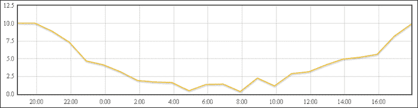
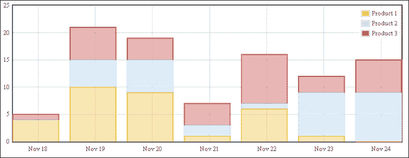
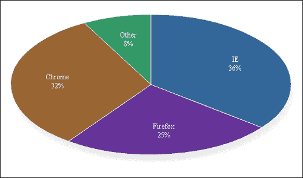
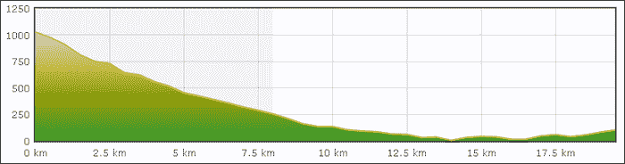
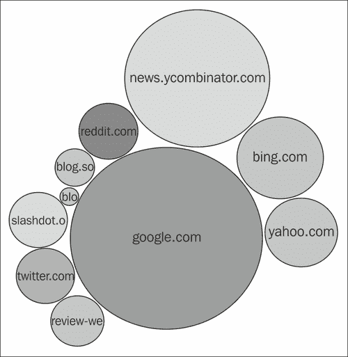
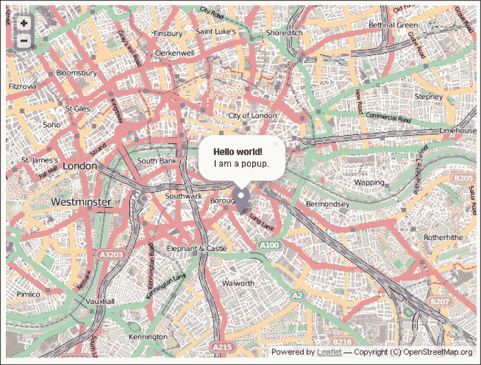
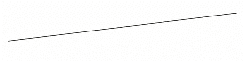
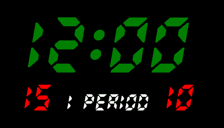

# 二、图形数据的显示

在本章中，我们将介绍许多常见的图形任务，例如:

*   创建折线图
*   创建条形图
*   创建饼图
*   创建面积图
*   显示组合图表
*   创建气泡图
*   显示带有标记位置的地图
*   显示带有路径的地图
*   显示仪表
*   显示树
*   使用网页字体的发光二极管记分板

# 简介

在本章中，我们将了解如何使用基于现代 HTML5 标准的各种 JavaScript 库来显示图形数据。主要的想法是让你在解决问题的例子的帮助下，对各种视觉部分感兴趣，从带有画布的 2D 图形到 SVG 数据驱动的文档。

# 创建折线图

折线图是最基本的图表类型。它们显示一系列由线连接在一起的数据点。折线图通常用于可视化时间序列数据。

有各种各样的库可以实现这种图表功能，包括付费的和免费的。我们将使用 **Flot** 图表库。它是免费的，简单的，易于使用的，并且在过去的 4 年里一直在积极开发中。它还旨在制作美观的图表。

在这个食谱中，我们将制作一个时间序列图表，显示过去 24 小时的室外温度历史。

## 做好准备

我们需要从 http://www.flotcharts.org/的官方网站下载 Flot，并将内容提取到名为`flot`的单独文件夹中。

## 怎么做...

让我们编写 HTML 和 JavaScript 代码。

1.  为我们的图表创建一个带有占位符的基本 HTML 页面。我们还将包括 jQuery(Flot 需要)和 Flot 本身。Flot 需要在图表画布上绘制一个占位符 div，所以我们将提供一个。图表占位符需要指定其宽度和高度，否则 Flot 将无法正确绘制:

    ```html
    <!DOCTYPE HTML>
    <html>
        <head>
            <title>Chart example</title>
        </head>
        <body>
            <div id="chart" style="height:200px; width:800px;"></div>
            <script src="http://ajax.googleapis.com/ajax/libs/jquery/1.8.2/jquery.min.js"></script>
            <script src="flot/jquery.flot.js"></script>
            <script type="text/javascript" src="example.js"></script>
        </body>
    </html>
    ```

2.  在`example.js`中添加绘制我们图表的代码。`getData`函数生成一些看起来令人信服的随机数据——你可以很容易地用一个从服务器获取数据的函数来代替它。数据需要作为二元数组的数组返回。该对中的第一个(x 轴)值是标准的 UNIX 时间戳，以毫秒为单位，通常在 JavaScript 中使用，而第二个(y 轴)值是温度。
3.  绘制图表非常简单。`$.plot`功能使用指定的图表选项在包含指定系列的指定占位符中绘制图表:

    ```html
    $(function() {    
        function getData(cb) {
            var now  = Date.now();
            var hour = 60 * 60 * 1000;
            var temperatures = [];
            for (var k = 24; k > 0; --k)
                temperatures.push([now - k*hour,
                    Math.random()*2 + 10*Math.pow((k-12)/12,2)]);
            cb({data:temperatures});
        }
        getData(function(data) {
            $.plot("#chart", [data], {xaxis: {mode: 'time'}});
        });
    });
    ```

就这样！最终结果如下:



## 它是如何工作的...

`$.plot`函数有三个参数:

*   占位符选择器。这是 Flot 将绘制图表的地方。
*   要绘制的系列数组。Flot 可以在同一个图表上同时绘制多个系列。每个序列都是一个至少必须包含`data`属性的对象。这个属性是一个二元数组的数组，它是数列的 x 和 y 值。额外的属性允许我们控制特定系列的绘制方式——这些将在下一个食谱中更详细地探讨。默认情况下，Flot 使用预设颜色绘制常规折线图。
*   一个`options`对象，包含图表标签、坐标轴、图例和网格的大量图表绘制选项。这些选项也将在下一个食谱中探讨。

在这个食谱中，我们为 x 轴指定了“时间”模式。这使得 Flot 在我们的轴上适当地标注小时、天、月或年(取决于数据的时间跨度)。

## 还有更多...

下面是对`getData`函数的简单 Ajax 替换，将一个 Ajax 请求发送到位于路径`/chart`的同一个域上的请求处理程序，以检索图表数据:

```html
function getData(cb) {
    $.get('/chart').success(cb);
}
```

# 创建条形图

与通常用于显示平均值或瞬时值的折线图不同，条形图用于可视化属于离散组的数据。示例包括每日、每月和每周销售额(组分别为天、月和周)、每个用户的页面访问量、每辆车的油耗等。

Flot 图表库还可以绘制条形图。在本例中，我们将可视化过去七天的每日销售额。我们还将分别展示不同产品的销售情况，相互叠加。

## 做好准备

我们需要从官方网站[http://www.flotcharts.org/](http://www.flotcharts.org/)下载 Flot，并将内容提取到一个名为`flot`的单独文件夹中。

## 怎么做...

让我们修改折线图代码，使其绘制我们的条形图。

1.  首先，我们将从前面的折线图食谱中复制相同的 HTML 页面，但是我们将进行一些更改。为了绘制堆叠条，我们需要堆叠插件，它位于`jquery.flot.stack.js`文件中。图表占位符的高度增加，以便更好地了解各个堆叠条:

    ```html
    <!DOCTYPE HTML>
    <html>
        <head>
            <title>Chart example</title>
        </head>
        <body>
            <div id="chart" style="height:300px; width:800px;"></div>
            <script src="http://ajax.googleapis.com/ajax/libs/jquery/1.8.2/jquery.min.js"></script>
            <script src="flot/jquery.flot.js"></script>
            <script src="flot/jquery.flot.stack.js"></script>
            <script type="text/javascript" src="example.js"></script>
        </body>
    </html>
    ```

2.  然后我们将创建`example.js`脚本:

    ```html
    $(function() {    
        var day = 24 * 60 * 60 * 1000;
        function getData(cb) {
            var now  = new Date();
            now = new Date(now.getYear(), now.getMonth(), now.getDate()).getTime();
            var products = [];
            for (var product = 1; product < 4; ++product) {
                var sales = { label: "Product " + product, data: [] };
                for (var k = 7; k > 0; --k)
                    sales.data.push([now - k*day, Math.round(Math.random()*10)]);
                products.push(sales);
            }
            cb({series:products});
        }

        getData(function(data) {
            $.plot("#chart", data.series, {
                series: {
                    stack: true, lines: { show: false },
                    bars: { show: true, barWidth: 0.8 * day, align:'center' }
                }, xaxis: {mode: 'time'}
            });
        });
    });
    ```

下一节将解释代码。以下是结果图表的显示方式:



## 它是如何工作的...

和前面的食谱一样，`$.plot`函数有三个参数。第一个参数是图表占位符，第二个参数是数据，第三个参数是包含图表选项的对象。

以下是我们的输入数据方案:

```html
[
  {label: "Product 1", data:[
    [timestamp, value],
    [timestamp, value], …]},
  {label: "Product 2", data: […]},
  {label: "Product 3", data: […]}
]
```

输入数据是一系列的数组。每个系列代表一种产品的销量。系列对象具有表示乘积的`label`属性和`data`属性，后者是数据点的数组。每个数据点都是一个二维数组。该数组的第一个元素是以毫秒为单位的 UNIX 时间戳表示的日期，即一天的确切开始。第二是当天的销量。

为了更容易地处理日期，我们定义了一个表示一天中毫秒数的变量。稍后，我们使用这个变量来定义图表中条形的宽度。

Flot 自动从预定义的列表中为我们挑选系列颜色(然而，也可以指定我们需要的颜色，我们将在下面的食谱中看到)。

代码中指定了几个系列选项。我们告诉 Flot 通过将`stack`属性的值设置为`true`来堆叠我们的系列。我们还确保隐藏默认情况下会显示的线条。

为了使条形中心与当天的 x 轴刻度对齐，我们将`bar`对象中的`align`属性的值设置为`center`。

我们输入数据中的每个系列都有一个标签。因此，Flot 会自动生成一个放置在右上角的图例。

轴的边界由 Flot 自动拾取，但可以使用`options`对象控制它们。

# 创建饼图

当将比例或百分比作为一个整体可视化时，我们通常使用饼图。饼图很简单，可以自己画；然而，为了获得更大的灵活性和美观的结果，我们将使用 Flot 图表库及其 pie 插件。

Flot 的 pie 插件可以显示带或不带图例的 pie，并有大量选项来控制标签的位置。它还能够渲染倾斜的馅饼和甜甜圈。还包括对互动馅饼的支持。

在这个食谱中，我们将制作一个访问者浏览器的饼图。

## 做好准备

我们需要从官方网站[http://www.flotcharts.org/](http://www.flotcharts.org/)下载 Flot，并将内容提取到一个名为`flot`的单独文件夹中。

## 怎么做...

让我们编写 HTML 和 JavaScript 代码。

1.  Create the following HTML page in `index.html`:

    ```html
    <!DOCTYPE HTML>
    <html>
        <head>
            <title>Chart example</title>
        </head>
        <body>
            <div id="chart" style="height:600px; width:600px;"></div>
            <script src="http://ajax.googleapis.com/ajax/libs/jquery/1.8.2/jquery.min.js"></script>
            <script src="flot/jquery.flot.js"></script>
            <script src="flot/jquery.flot.pie.js"></script>
            <script type="text/javascript" src="example.js"></script>
        </body>
    </html>
    ```

    该页面有一个占位符元素用于我们的图表。

    Flot 依赖于包含的 jQuery 库。要绘制饼图，我们需要添加 Flot 的饼图插件。

2.  创建`example.js`脚本:

    ```html
    $(function() {    
        var day = 24 * 60 * 60 * 1000;
        function getData(cb) {
            var browsers = [
                {label: 'IE', data: 35.5, color:"#369"},
                {label: 'Firefox', data: 24.5, color: "#639"},
                {label: 'Chrome', data: 32.1, color: "#963"},
                {label: 'Other', data: 7.9, color: "#396"}
            ];
            cb(browsers);
        }

        getData(function(data) {
            $.plot("#chart", data, {
            series: {
                pie: {
                    show: true,
                    radius: 0.9,
                    label: {
                        show: true,
                        radius: 0.6,
                    },
                    tilt: 0.5
                }
            },
            legend: { show: false }
            });
        });
    });
    ```

它会生成以下饼图:



## 它是如何工作的...

Flot 要求以对象数组的形式提供饼图切片数据。每个对象都包含以下两个属性:

*   `label`:这个是切片的标签
*   `data`:这个是切片的编号——可以是任意值的编号(不需要是百分比)

调用`$.plot`时，第一个参数是饼图的占位符元素，第二个参数是饼图切片的数组，第三个参数包含饼图选项。

为了显示饼图，最小`options`对象如下:

```html
{pie: {show: true}}
```

为了自定义默认饼图，我们在`pie`属性中添加了以下内容:

*   `radius`:指定饼图的大小占画布的百分比。
*   `label`:`show`(布尔)属性设置为`true`以显示饼图标签，`radius`属性控制标签到饼图中心的距离。
*   `tilt`:这将执行饼图的 3D 倾斜。如果省略，Flot 将呈现一个无标题的圆形饼图。

## 还有更多...

有更多选项可用，例如:

*   `innerRadius`:这个被设置为一个值，比如`0.5`来创建一个圆环图。
*   `combine`:此属性用于将较小的切片组合成单个切片。它是一个包含以下属性的对象:
    *   `threshold`:设为整体的百分比，例如`0.1`
    *   `color`:这是用来渲染“其他”切片的颜色，例如`#888`

更多详细信息，请参见[http://people.iola.dk/olau/flot/examples/pie.html](http://people.iola.dk/olau/flot/examples/pie.html)的饼图示例。

# 创建面积图

当我们想要将多个结果叠加在一起时，面积图通常用来代替折线图。在某些情况下，它们还可以用来增强图表的视觉吸引力。

这个食谱将展示一个例子，其中面积图用于增强视觉吸引力:显示高度数据。

假设我们需要想象一次 8 公里的下坡徒步旅行的高度，然后是 12 公里的平地步行。我们还想标记图表中的“山”部分。最后，我们希望海拔线以下的区域以令人想起彩色地形图的方式填充，其中颜色为绿色表示低海拔，黄色表示中海拔，白色表示高海拔。

## 做好准备

在本例中，我们还将使用 Flot 图表库，因此我们需要从官方网站 ta[http://www.flotcharts.org/](http://www.flotcharts.org/)下载 Flot，并将内容提取到名为`flot`的单独文件夹中。

## 怎么做...

1.  我们的 HTML 文件需要一个图表占位符元素和必要的脚本包括在内。以下是内容:

    ```html
    <!DOCTYPE HTML>
    <html>
        <head>
            <title>Chart example</title>
            <style type="text/css">
                #chart { font-family: Verdana; }
            </style>
        </head>
        <body>
            <div id="chart" style="height:200px; width:800px;"></div>
            <script src="http://ajax.googleapis.com/ajax/libs/jquery/1.8.2/jquery.min.js"></script>
            <script src="flot/jquery.flot.js"></script>
            <script type="text/javascript" src="example.js"></script>
        </body>
    </html>
    ```

2.  我们将在我们的`example.js`脚本中绘制图表，该脚本包含以下代码:

    ```html
    $(function() {    
        function getData(cb) {
            var altitudes = [];
            // Generate random but convincing-looking data.
            for (var k = 0; k < 20; k += 0.5)
                altitudes.push([k, Math.random()*50 + 1000*Math.pow((k-15)/15,2)]);
            cb(altitudes);
        }

        getData(function(data) {
            $.plot("#chart", [{data: data}], {
                xaxis: {
                    tickFormatter: function(km) { return km + ' km'; }
                },
                lines: {
                    fill: true,
                    fillColor: {colors: ["#393", "#990", "#cc7", "#eee"] }
                },
                grid: {
                    markings: [{ xaxis: { from: 0, to: 8 }, color: "#eef" }]
                }
            });
        });
    });
    ```

下面是我们的结果:



海拔线以下的区域以令人联想到彩色浮雕的方式填充。山体剖面用蓝色区域标记，由`markings`对象创建。

## 它是如何工作的...

和我们所有的例子一样，`example.js`中的`getData`函数生成随机数据，然后用数据调用提供的回调函数。我们可以使用 jQuery 轻松编写一个替代程序，从服务器获取数据。

对`$.plot`的一次调用将绘制面积图。第一个参数是目标容器。第二个参数是要绘制的系列数组——在本例中只有一个。

第三个论点更复杂。它由以下部分组成:

*   `xaxis`属性指定了我们 x 轴的行为。我们通过提供自己的刻度格式化程序来覆盖默认的刻度标签。该格式化程序在刻度值后添加`"km"`字符串。
*   `lines`属性指定我们将使用填充折线图。我们想要一个像山一样的渐变填充效果，所以我们指定了一个包含 CSS 颜色字符串数组的渐变对象，也就是`{color: [array of colors]}`。
*   `grid`属性用于在我们的图表上标记山段。我们规定，它应包含一个跨越 0 至 8 公里范围的 x 轴线段标记，并具有浅蓝色。

## 还有更多...

Flot 有更多的面积图选项，它们可以在发行版附带的 API 文档中找到。

要使用这个方法，我们需要从服务器提供我们自己的数据阵列。下面是对`getData`函数的简单 Ajax 替换，将一个 Ajax 请求发送到位于路径`/areachart`的同一个域上的请求处理程序，以检索图表数据。很简单:

```html
function getData(cb) {
    $.get('/areachart').success(cb);
}
```

# 显示组合图表

组合图表是指有一个以上 x 轴或 y 轴的图表，可以有多种类型的系列(线条、条形和区域)。有时，我们可能希望在单个图表上呈现多种异构类型的数据，通常是为了可视化其相关性。

在这个食谱中，我们将尝试通过在一张图表上显示温度和海拔高度来想象爬山。海拔系列将是一个带有渐变颜色的面积图，让人想起地形图，但是温度系列将是一个折线图，如果高于 19 摄氏度，我们希望是红色，如果低于 19 摄氏度，我们希望是蓝色。

为了做到这一点，我们需要一个能够处理两个 y 轴的图表库。我们将使用 Flot 图表库，因为它能够显示具有两个或更多 x 轴或 y 轴的图表。

## 做好准备

和之前的食谱一样，我们需要从官方网站[http://www.flotcharts.org/](http://www.flotcharts.org/)下载 Flot，并将内容提取到一个单独的名为`flot`的文件夹中。

## 怎么做...

让我们编写 HTML 和 JavaScript 代码。

1.  我们的 HTML 文件需要一个图表占位符、jQuery、Flot 和我们的示例脚本。这次我们还需要`threshold`插件来获得两种温度颜色。以下是内容:

    ```html
    <!DOCTYPE HTML>
    <html>
        <head>
            <title>Chart example</title>
            <style type="text/css">
                #chart { font-family: Verdana; }
            </style>
        </head>
        <body>
            <div id="chart" style="height:200px; width:800px;"></div>
            <script src="http://ajax.googleapis.com/ajax/libs/jquery/1.8.2/jquery.min.js"></script>
            <script src="flot/jquery.flot.js"></script>
            <script src="flot/jquery.flot.threshold.js"></script>
            <script type="text/javascript" src="example.js"></script>
        </body>
    </html>
    ```

2.  我们的图表在`example.js`中使用以下代码绘制:

    ```html
    $(function() {    
        function getData(cb) {
            var altitudes = [], temperatures = [];
            // Generate random but convincing-looking data.
            for (var k = 0; k < 20; k += 0.5) {
                altitudes.push([k, Math.random()*50 + 1000*Math.pow((k-15)/15,2)]);
                temperatures.push([k, Math.random()*0.5 + k/4 + 15]);
            }
            cb({alt:altitudes, temp:temperatures});
        }

        getData(function(data) {
            $.plot("#chart", [
               {
                 data: data.alt, yaxis:1,
                 lines: {fill:true, fillColor: {
                 colors: ["#393", "#990", "#cc7", "#eee"] } }
                    },
               {
                 data: data.temp, yaxis:2, color: "rgb(200, 20, 30)",
                 threshold: { below: 19, color: "rgb(20, 100, 200)" }
                    }
                ], {
                yaxes: [ { }, { position: "right"}],
                xaxis: {
                    tickFormatter: function(km) { return km + ' km'; }
                },
                grid: {
                    markings: [{ xaxis: { from: 0, to: 8 }, color: "#eef" }]
                }
            });
        });
    });
    ```

下面的截图显示了最终结果:


## 它是如何工作的...

使用`getData`函数，我们为该图生成两个系列，一个包含温度，另一个包含海拔。

绘制图时，我们先调用`getData`函数。在提供的回调中，我们获取数据并将其传递给`$.plot`函数，该函数获取目标容器元素、系列数组和绘图选项。

数组中的第一个序列包含高度数据。我们有两个 y 轴，因此我们需要声明我们将用于本系列的 y 轴，即第一个 y 轴。其余参数声明填充渐变；更多信息参见*创建面积图*配方。

第二个系列使用第二个 y 轴。这里新的是`threshold`属性。它指定对于低于 19 度的值，线条的颜色应该不同(蓝色而不是红色)。

我们将通过指定`yaxes`属性来配置`options`对象中的第二个 y 轴(注意名称中的复数)。该属性是一个包含 y 轴选项的数组。我们将使用第一个轴的默认值，因此是空对象。我们将把第二个轴放在右手边。

x 轴的单位是公里，因此我们的`tickformatter`函数将字符串`" km"`添加到数字中。

最后，我们用网格标记选项用蓝色标记“山脉部分”(从 0 到 8 公里)。

## 还有更多...

这里有一个简单的`getData`函数的 Ajax 替换，将一个 Ajax 请求发送到位于`/charts`路径的同一个域上的请求处理程序，以检索图表数据。这个处理程序应该以下列格式返回一个对象:

```html
{alt: data1, temp: data2}
```

其中`data1`和`data2`是包含数据的二维数组。

```html
function getData(cb) {
    $.get('/charts').success(cb);
}
```

# 创建气泡图

气泡图可以将多组值显示为圆形。它们可用于大小在 10 到 100 之间的数据集。它们对于可视化数量级不同的值特别有用，在这些情况下可以代替饼图。

由于气泡图更复杂，也不太常见，我们需要一个灵活的库来绘制它们。优秀的 D3 库([http://d3js.org/](http://d3js.org/))非常契合；它提供了一套工具(核心数据驱动的 DOM API 加上“打包”数据布局)，支持创建气泡图。

我们将绘制一个气泡图，显示从推荐网站访问我们网站的人数。

## 怎么做...

让我们编写 HTML 和 JavaScript 代码。

1.  我们将创建一个包含图表占位符的 HTML 页面。我们将包括图表库 D3，以及从我们的`example.js`文件中绘制气泡图的代码:

    ```html
    <!DOCTYPE HTML>
    <html>
        <head>
            <title>Chart example</title>
            <style type="text/css">
                #chart text { font-family: Verdana; font-size:10px; }
            </style>
        </head>
        <body>
            <div id="chart"></div>
            <script src="http://mbostock.github.com/d3/d3.v2.js?2.9.5"></script>
            <script type="text/javascript" src="example.js"></script>
        </body>
    </html>
    ```

2.  然后我们将在`example.js`中添加以下代码:

    ```html
    (function() {
    var getData = function(cb) {
        cb({children:[
            {domain: 'google.com', value: 6413},
            {domain: 'yahoo.com', value: 831},
            {domain: 'bing.com', value: 1855},
            {domain: 'news.ycombinator.com', value: 5341},
            {domain: 'reddit.com', value: 511},
            {domain: 'blog.someone.com', value: 131},
            {domain: 'blog.another.com', value: 23},
            {domain: 'slashdot.org', value: 288},
            {domain: 'twitter.com', value: 327},
            {domain: 'review-website.com', value: 231}
        ]});
    }

    // r is the dimension of the bubble chart
    var r = 640,
        fill = d3.scale.category20c();

    // create the visualization placeholder
    var vis = d3.select("#chart").append("svg")
        .attr("width", r)
        .attr("height", r)
        .attr("class", "bubble");

    // create a pack layout for the bubbles
    var bubble = window.bubble = d3.layout.pack()
        .sort(null)
        .size([r, r])
        .padding(1.5);

        getData(function(json) {
            // Process the data with the pack layout
            var data = bubble.nodes(json);
            // Create a node for every leaf data element
            var selection = vis.selectAll("g.node")
                .data(data.filter(function(d) { return !d.children; }));
            var node = selection.enter().append("g");

            node.attr("class", "node");
            node.append("title")
                .text(function(d) { return d.domain });
            node.attr("transform", function(d) { return "translate(" + d.x + "," + d.y + ")"; });
            node.append("circle")
                .attr("r", function(d) { return d.r; })
                .style("fill", function(d) { return fill(d.domain); });
            node.append("text")
                .attr("text-anchor", "middle")
                .attr("dy", ".3em")
                .text(function(d) { return d.domain.substring(0, d.r / 3); });
        });
    }());
    ```

在下一节中，我们将解释 D3 是如何工作的，以及我们如何使用它来创建气泡图:

## 它是如何工作的...

与大多数其他图表库不同，D3 没有任何可以绘制的预定义图表类型。相反，它附带了一套模块化工具，您可以自由混合和匹配来创建任何类型的数据驱动文档。

然而，D3 包含一些非常特定于可视化的工具。

例如，`d3.scale.category20c`创建一个序数刻度。序数标度将输入值映射到一组离散的输出值。在这种情况下，离散值集是一组 20 种预定义的输出颜色。比例是一个函数，它将输入值映射到输出。我们可以显式地指定哪些输入值映射到哪些输出，但是如果我们不这样做，这是从用法中推断出来的。在我们的例子中，这意味着第一个域名将被映射到第一种颜色，第二个被映射到第二个，以此类推。

其他工具包括类似 jQuery 的 DOM 选择工具，在我们的食谱中，我们使用这些工具将 SVG 元素添加到图表占位符中。

另一个例子是 D3 布局。要绘制气泡图，我们需要一个包装布局。布局基于某些规则和约束将一组具有值的对象映射到一组输出坐标。一个流行的例子是**力布局**，这是一种通过在图形节点之间迭代施加虚拟力来排列对象的图形布局。

我们使用的包装布局将物体分层包装成圆形。我们的数据是平面的，因此包装布局仅用于自动排列我们的圆圈。创建包装布局并分配给`bubble`变量。

包装布局通过对输入数据应用`bubble.nodes`功能来工作。该函数在输入数据的每个对象中查找`value`属性。基于这个属性(它将其视为相对半径)和布局的大小，它将以下属性添加到我们的数据中:x、y 和 r，并返回结果对象数组。

在这一点上，我们有了泡沫图表所需的大部分数据:我们有了泡沫的位置和尺寸。我们现在需要做的就是把它们变成合适的 SVG 元素。我们用来做这个的工具是 D3 的`selectAll`功能。

与 jQuery 选择器不同，D3 的`selectAll`可以用来维护文档和数据对象之间的双向映射。我们通过使用选择的`.data`函数来指定映射到我们的选择的数据数组。

在我们声明了这个映射之后，我们可以使用`.enter`函数来决定当一个元素被添加到我们的数据数组中时会发生什么。在我们的配方中，我们声明一个新的 SVG 图形元素被添加到 SVG 画布中，并将该声明分配给`node`变量。

需要注意的是，我们的节点变量没有包含 SVG 元素；相反，它是对节点集中每个图形 SVG 元素的选择，这些元素将在未来创建，无论何时新的数据元素“进入”选择。因此，节点上的操作指定将在每个添加的 SVG 元素上执行的操作。

我们指定每个节点都将有一个`title`属性(将出现在鼠标悬停时)。该标题的内部文本取决于数据数组中的特定元素。为了描述这一点，我们将一个函数作为参数传递给`.text()`调用。传递的函数的第一个参数将是特定节点的数据元素，返回值应该是将被设置为标题的文本。

同样，我们将气泡移动到包装布局计算的位置。然后，我们添加一个圆，其半径由圆的包装布局和颜色比例计算，以生成圆的颜色。

最后，以同样的方式追加一个文本节点。

结果如下所示:



## 还有更多...

该示例使用 SVG(可缩放矢量图形)标记来呈现可视化。大多数现代浏览器支持 SVG，但 IE9 之前的 Internet Explorer 版本不支持。然而，D3 并不局限于 SVG——它还能够生成 HTML 元素，这些元素可以在旧版本的 IE 中作为替代。

# 显示带有标记位置的地图

谷歌地图的兴起及其优秀的 API 普及了网站上地图的嵌入。嵌入式地图有多种用途:显示用户去过的地方、显示事件的位置、显示企业拥有的商店的位置以及许多其他用途。地图可以与我们网站上显示的每个文本地址一起显示。

在这个食谱中，我们将制作一个简单的地图，上面标注一个位置。为此，我们将使用**传单**库([http://leafletjs.com/](http://leafletjs.com/)，这是一个众所周知的库，被 Flickr、FourSquare、Craigslist、Wikimedia 和其他热门网站广泛使用。

我们将显示一个**开放街道地图**地图图层。开放街道地图([http://www.openstreetmap.org/](http://www.openstreetmap.org/))是一个类似维基百科的免费合作创建的街道地图，覆盖范围很广。

我们还将添加一个描述气球，它将在点击地标时显示。

## 怎么做...

让我们编写 HTML 和 JavaScript 代码。

1.  在我们的 HTML 文件中添加 lambda 的样式表，以及 IE8 和更早版本所需的附加条件 CSS:

    ```html
    <link rel="stylesheet" href="http://cdn.leafletjs.com/leaflet-0.4/leaflet.css" />
     <!--[if lte IE 8]>
         <link rel="stylesheet" href="http://cdn.leafletjs.com/leaflet-0.4/leaflet.ie.css" />
    <![endif]-->
    ```

2.  在我们的脚本中包含传单库 JS 文件:

    ```html
    <script src="http://cdn.leafletjs.com/leaflet-0.4/leaflet.js"></script>
    ```

3.  在我们的页面上为地图放置一个占位符。我们还必须指定它的高度，否则活页将无法正常工作:

    ```html
    <div id="map" style="height:200px;"></div>
    ```

4.  通过添加`example.js` :

    ```html
    <script src="example.js"></script>
    ```

    来添加我们的 JS 代码
5.  最后，在`example.js` :

    ```html
    var map = L.map('map').setView([51.505, -0.09], 13);

    L.tileLayer('http://{s}.tile.openstreetmap.org/{z}/{x}/{y}.png',{
            attribution:'Copyright (C) OpenStreetMap.org',
            maxZoom:18
            }).addTo(map);

    var marker = L.marker([51.5, -0.09]).addTo(map);
    marker.bindPopup("<b>Hello world!</b><br>I am a popup.").openPopup();
    ```

    中添加代码创建地图

## 它是如何工作的...

大多数地图库通过使用切片图像图层来绘制地图。切片图像层是具有预定义固定大小的图像网格。图像是地图的切片部分，已预先渲染并托管在切片服务器上。

地图使用称为**缩放级别**的离散缩放点。不同的图块图像以不同的缩放级别使用。

在某些情况下，尤其是在高缩放级别，服务器会动态呈现切片，因为缓存图像所需的空间超过了合理的存储空间大小。例如，OpenStreetMap 使用 19 个缩放级别。第一级使用一个单幅图块，第二级将此图块拆分为四幅图块，第三级使用 16 幅，依此类推。在第 19 个缩放级别，有 480 亿个切片，假设平均切片大小为 10 KB，则需要 480 TB 的存储空间。

当用户滚动地图时，先前卸载区域的切片会被动态加载并显示在容器中。当用户更改缩放级别时，旧缩放级别的切片将被移除，新切片将被添加。

在我们的`example.js`文件中，我们使用小叶的函数(在`L`命名空间对象中找到)来创建映射。地图在代表一对`[latitude, longitude]`的数组的帮助下，以位于伦敦的一个中心进行初始化。另一个参数是缩放级别，设置在`13`。

然后添加一个平铺层。我们指定 OpenStreetMap 使用的切片服务器模式如下:

```html
http://{s}.tile.openstreetmap.org/{z}/{x}/{y}.png
```

其中`s`为服务器字母(`a`、`b`或`c`)，`z`为缩放级别，`x`和`y`为图块的离散坐标。例如，在缩放级别 1 下，`x`和`y`可以是`1`或`2`，而在缩放级别 2 下，它们可以在 1 到 4 的范围内，以此类推。我们还指定了可用的最大缩放级别。

我们在地图上添加我们自己的标记。初始化参数是`[latitude, longitude]`对。然后，我们可以在标记内添加一个弹出窗口，显示文本和/或任意的 HTML。我们立即打开弹出窗口。



用传单绘制的地图

# 显示带有路径的地图

当显示地图时，有时我们可能想要显示的不仅仅是位置。除了标记，其他最常见的地图覆盖是路径和区域。

在这个食谱中，我们将创建一个地图，显示一条路径和一个区域。

## 怎么做...

让我们编写 HTML 和 JavaScript 代码。

1.  就像在*中显示一个带有标记位置的地图*食谱一样，我们需要包括适当的 CSS 和脚本。以下是一个示例 HTML 文件:

    ```html
    <!DOCTYPE HTML>
    <html>
        <head>
            <title>Map example</title>
            <link rel="stylesheet" href="http://cdn.leafletjs.com/leaflet-0.4/leaflet.css" />
            <!--[if lte IE 8]>
            <link rel="stylesheet" href="http://cdn.leafletjs.com/leaflet-0.4/leaflet.ie.css" />
            <![endif]-->
        </head>
        <body>
            <div id="map" style="height:480px; width:640px;"></div>
            <script src="http://ajax.googleapis.com/ajax/libs/jquery/1.8.2/jquery.min.js"></script>
            <script src="http://cdn.leafletjs.com/leaflet-0.4/leaflet.js"></script>
            <script type="text/javascript" src="example.js"></script>
        </body>
    </html>
    ```

2.  然后我们可以将我们的代码添加到`example.js` :

    ```html
    var map = L.map('map').setView([52.513, -0.06], 14)

    L.tileLayer('http://{s}.tile.openstreetmap.org/{z}/{x}/{y}.png',{
        attribution:'Copyright (C) OpenStreetMap.org',
        maxZoom:18
    }).addTo(map);

    var polyline = L.polyline([
        [52.519, -0.08],
        [52.513, -0.06],
        [52.52, -0.047]
    ]).addTo(map);

    var polygon = L.polygon([
        [52.509, -0.08],
        [52.503, -0.06],
        [52.51, -0.047]
    ], {
        color:"#f5f",
        stroke: false,
        fillOpacity:0.5
    }).addTo(map);
    ```

## 它是如何工作的...

我们使用`L.map`功能创建地图，并使用`setView`在指定的`[latitude, longitude]`阵列和缩放级别设置地图的位置。我们还添加了标准的 OpenStreetMap 平铺层。

首先，我们创建并添加一条标准折线。因为我们没有指定任何选项，所以传单对颜色、不透明度、边框等使用合理的默认值。折线构造器获取一组`[latitude, longitude]`对，并绘制一条顶点穿过它们的直线。


之后，我们创建一个稍微定制的多边形。像折线构造器一样，多边形也采用`[latitude, longitude]`对的数组。此外，我们自定义背景颜色，移除多边形的边框，并将多边形的不透明度指定为 50%。

# 显示仪表

模拟仪表对于可视化数值在预定最小值和最大值之间变化的数据非常有用。示例包括燃料量、当前速度、磁盘空间、进程和内存使用等。

在这个食谱中，我们将为 jQuery 制作一个非常灵活的、数据驱动的仪表插件。然后我们将使用这个插件来显示一个模拟汽车速度计。以下是车速表的外观:


食谱大量使用了 HTML5 的画布。

## 怎么做...

让我们为我们的例子编写 HTML 代码，仪表插件和将它们联系在一起的代码。

1.  用画布为我们的仪表制作一个简单的 HTML 文件:

    ```html
    <!DOCTYPE HTML>
    <html>
        <head>
            <title>Gauge example</title>
        </head>
        <body>
            <canvas id="gauge" width="400" height="400"></canvas>
            <script src="http://ajax.googleapis.com/ajax/libs/jquery/1.8.2/jquery.min.js"></script>
            <script type="text/javascript" src="example.js"></script>
        </body>
    </html>
    ```

2.  然后在`example.js` :

    ```html
    (function($) {
    ```

    中写下我们的仪表插件代码
3.  这是一个替代`Array.forEach`的支持功能，对单品和数组都有效。我们的仪表将支持多个条纹、针和刻度，但当提供单个时，它也应该能够工作:

    ```html
        function eachOrOne(items, cb) {
            return (items instanceof Array ? items : [items]).map(cb);
        }
    ```

4.  下面的是围绕中心`c`旋转点`pt`的通用函数(角度量为`a`)。方向为顺时针:

    ```html
        function rotate(pt, a, c) {
            a = - a;
            return { x: c.x + (pt.x - c.x) * Math.cos(a) - (pt.y-c.y) * Math.sin(a),
                     y: c.y + (pt.x - c.x) * Math.sin(a) + (pt.y-c.y) * Math.cos(a) };
        }
    ```

5.  The following is our gauge plugin

    ```html
        $.gauge = function(target, options) {
            var defaults = {
                yoffset: 0.2,
                scale: {
                    type: 'linear',
                    values: [1, 200],
                    angles: [0, Math.PI]
                },
                strip: {
                    scale: 0, radius: 0.8, width: 0.05,
                    color: "#aaa", from: 0, to: 200
                },           
                ticks: {
                    scale: 0, radius: 0.77, length: 0.1, width: 1, color: "#555",
                    values: {from: 0, to:200, step: 10},
                },           
                labels: {
                    scale: 0, radius: 0.65,
                    font: '12px Verdana', color: "#444",
                    values: {from: 0, to:200, step: 20}
                },
                needle: {
                    scale: 0, length: 0.8, thickness: 0.1,
                    color: "#555", value: 67
                }
            };
    ```

    默认情况下，我们的仪表具有以下内容:

    *   从顶部偏移 20%
    *   具有值范围为 1 到 200、角度范围为 0 到 180 度，
    *   在 80%或总半径处有一个条带，宽度为总半径的 5%,用灰色着色，从 0 到 200。
    *   有一个从 0 到 200 的单个`ticks`数组，其中`step` 10
    *   步骤 20 的标签从 0 到 200
    *   具有设置为值 67 的单针
6.  我们允许用户覆盖选项并指定一个以上前面提到的任何组件:

    ```html
            var options = $.extend(true, {}, defaults, options);
            for (var key in defaults) if (key != 'yoffset')
                options[key] = eachOrOne(options[key], function(item) {
                    return $.extend(true, {}, defaults[key], item);
                });        
            var $target = $(target);
            var ctx = $target[0].getContext('2d');
    ```

7.  我们构造我们的`scale`函数，并用实际的数组替换指定数值范围的对象。请注意，除了`range`对象，您还可以指定一个实际的数组:

    ```html
            options.scale = eachOrOne(options.scale, function(s) {
                return $.gauge.scale(s);
            });
            eachOrOne(options.ticks, function(t) {
                return t.values = $.gauge.range(t.values);
            });
            eachOrOne(options.labels, function(l) {
                return l.values = $.gauge.range(l.values);
            });
    ```

8.  以下为图纸代号:

    ```html
            function draw(options) {
    ```

9.  我们将使用仪表中心作为参考点，并将清除画布:

    ```html
                var w = $target.width(), h = $target.height(),
                    c = {x: w * 0.5, y: h * (0.5 + options.yoffset)},
                    r = w * 0.5,
                    pi = Math.PI;
                ctx.clearRect(0, 0, w, h);
    ```

10.  然后我们将所有的条(一个或多个)画成弧:

    ```html
                // strips
                eachOrOne(options.strip, function(s) {
                    var scale = options.scale[s.scale || 0];
                    ctx.beginPath();
                    ctx.strokeStyle = s.color;
                    ctx.lineWidth = r * s.width;
                    ctx.arc(c.x, c.y, s.radius * r, scale(s.to), scale(s.from), true);
                    ctx.stroke();
                });
    ```

11.  然后画出所有的记号(我们用非常短、非常粗的弧线作为记号)。我们的`scale`功能将`range`中的值转换为角度:

    ```html
                // ticks
                eachOrOne(options.ticks, function(s) {
                    var scale = options.scale[s.scale || 0];
                    ctx.strokeStyle = s.color;
                    ctx.lineWidth = r * s.length;
                    var delta = scale(s.width) - scale(0);
                    s.values.forEach(function(v) {
                        ctx.beginPath();
                        ctx.arc(c.x, c.y, s.radius * r,
                            scale(v) + delta, scale(v) - delta, true);
                        ctx.stroke();
                    });
                });
    ```

12.  然后我们画标签。我们通过将它放置在最右边的垂直居中位置，然后逆时针旋转它，旋转量按值

    ```html
                // labels
                ctx.textAlign    = 'center';
                ctx.textBaseline = 'middle';
                eachOrOne(options.labels, function(s) {
                    var scale = options.scale[s.scale || 0];
                    ctx.font = s.font;
                    ctx.fillStyle = s.color;
                    s.values.forEach(function(v) {
                        var pos = rotate({x: c.x + r * s.radius, y:c.y},
                            0 - scale(v), c);
                        ctx.beginPath();
                        ctx.fillText(v, pos.x, pos.y);
                        ctx.fill();
                    });
                });
    ```

    缩放来确定位置
13.  最后，我们拔针。针由一个圆心在量规中心旋转点的圆和一个从那里延伸的三角形组成。我们旋转所有三个三角形点的方式与旋转标签中心的方式相同:

    ```html
                // needle
                eachOrOne(options.needle, function(s) {
                    var scale = options.scale[s.scale || 0];
                    var rotrad = 0 - scale(s.value);
                    var p1 = rotate({x: c.x + r * s.length, y: c.y},    rotrad, c),
                        p2 = rotate({x: c.x, y: c.y + r*s.thickness/2}, rotrad, c),
                        p3 = rotate({x: c.x, y: c.y - r*s.thickness/2}, rotrad, c);
                    ctx.fillStyle = s.color;
                    ctx.beginPath();
                    ctx.arc(c.x, c.y, r * s.thickness / 2, 0, 2*Math.PI);
                    ctx.fill();
                    ctx.beginPath();
                    ctx.moveTo(p1.x, p1.y);
                    ctx.lineTo(p2.x, p2.y);
                    ctx.lineTo(p3.x, p3.y);
                    ctx.fill();                
                });            
            }        
            draw(options);
    ```

14.  绘制整个仪表后，`gauge`功能返回一个可用于改变仪表指针值并重新绘制的功能:

    ```html
            return function(val, i) {
                i = i || 0;
                options.needle[i].value = val;
                draw(options);
            }
        };
    ```

15.  These are common helper functions. The `range` function creates an array of values, while `scale` creates a function that scales values from one range to another. Both support logarithmic scales:

    ```html
        $.gauge.range = function(opt) {
            if (opt instanceof Array) return opt;
            var arr = [], step = opt.step;
            var last = opt.from;
            for (var k = opt.from; k <= opt.to; k+= step)
                arr.push(opt.log ? Math.pow(opt.log, k) : k);
            return arr;
        };
        $.gauge.scale = function(opt, f) {
            if (opt.type == 'linear') opt.type = function(x) { return x; };
            else if (opt.type == 'log') opt.type = Math.log;
            var f = opt.type,
                v0 = f(opt.values[0]),
                v1 = f(opt.values[1]);
            return function(v) {
                return (f(v) - v0) / (v1 - v0)
                        * (opt.angles[1] - opt.angles[0]) + Math.PI + opt.angles[0];
            };
        }
    }(jQuery));
    ```

    匿名函数以 jQuery 对象作为参数调用，在函数的范围内，该参数变为`$`。这是用自己的私有范围构建 jQuery 插件的典型方法，并且使 jQuery 在该范围内作为`$`可用，而不管`$`是否与全局命名空间中的 jQuery 相同。

16.  我们将在`example.js`中画出我们的标尺。以下是内容:

    ```html
    $(function() {
        var g = $.gauge("#gauge", {
            scale: {
                angles: [-0.3, Math.PI+0.3],
                values: [0, 220]
            },
            strip: [
                { from: 0,   to: 140, color:"#ada" },
                { from: 140, to: 180, color:"#dda" },
                { from: 180, to: 220, color:"#d88" }
            ],
            ticks: [{
                color: "rgba(0,0,0,0.33)",
                values: { from: 0, to: 220, step:10 },
                length:0.05, radius:0.8, width:0.3
            }, {
                color: "rgba(0,0,0,0.33)",
                values: { from: 0, to: 220, step:20 },
                length:0.11, radius: 0.77, width:0.3
            }],
            labels: {
                color: "#777",
                values: { from: 0, to: 220, step:20 },
                radius: 0.62
            },
            needle: { color:"#678" }
        });
        g(25);
    });
    ```

## 它是如何工作的...

我们为仪表指定了一个线性刻度，角度略低于中间，速度值在 0 到 220 的范围内。我们创建了三个条带，绿色的一个在 0 到 140 公里/小时的范围内，黄色的一个在 140 到 180 公里/小时的范围内，红色的一个在 180 到 220 公里/小时的范围内。我们将使用两组条带:一个每 20 公里/小时大一点，一个每 10 公里/小时小一点，都是半透明的。最后，我们添加一根蓝色的针。

最后，我们可以用返回的函数设置我们的仪表值，我们用它来设置 25 公里/小时。

# 展示一棵树

在本食谱中，我们将研究如何以树状布局显示数据。我们将通过 JSON 文件来可视化一个小的 Linux 家谱。此外，将使用`D3.js`文件来操作 DOM 以显示数据。


## 做好准备

首先，我们需要获得用于可视化的数据。我们需要得到`tree.json`文件，它是这个食谱的例子的一部分。

## 怎么做...

我们将编写应该从 JSON 文件中生成数据的 HTML 和支持 JavaScript 代码:

1.  Let's first take a look a the structure of the JSON data:

    ```html
    {
      "name": "GNU/Linux",
      "url": "http://en.wikipedia.org/wiki/Linux",
      "children": [
        {
          "name": "Red Hat",
          "url": "http://www.redhat.com",
          "children": [ .. ]
       } ]
    ...
    }
    ```

    每个对象都有一个代表分发名称的`name`属性、一个链接到官方网页的`url`属性以及可选的`children`属性，后者可以包含其他对象的列表。

2.  下一步是使用 HTML5 文档类型创建页面，并将依赖项添加到`D3.js`和一个名为`tree.css` :

    ```html
    <!DOCTYPE html>
    <html>
      <head>
        <title>Linux Tree History</title>
        <script src="http://d3js.org/d3.v2.js"></script>
        <link type="text/css" rel="stylesheet" href="tree.css"/>
      </head>
    ```

    的 CSS 文件中
3.  在`body`部分，我们将添加一个名为`location`的`<div>`标签，该标签有一个名为`location`的`id`，我们将使用该标签作为占位符，此外，我们还将包含一个名为`tree.js`的 JavaScript 文件，该文件将用于包含映射数据的逻辑:

    ```html
      <body>
        <div id="location"></div>
        <script type="text/javascript" src="tree.js"></script>
      </body>
    </html>
    ```

4.  让我们从在`tree.js`文件中创建显示区域开始。首先，我们创建匿名函数，提供内部使用的变量的私有状态:

    ```html
    (function() {
    ```

5.  然后我们用给定的`width`和`height`设置生成图像的大小。为简单起见，我们将它们设置为固定值:

    ```html
    var width = 1000,
              height = 600;
    ```

6.  之后，我们建立了一个标准的 D3 布局树:

    ```html
      var tree = d3.layout.tree()
              .size([height, width - 200]);
      var diagonal = d3.svg.diagonal()
              .projection(function(d) {
                return [d.y, d.x];
              });
    ```

7.  由于我们需要指定和创建实际的 SVG，我们使用先前在 HTML 中选择的名为`location`的`id`来选择位置，并添加 SVG 元素:

    ```html
      var vis = d3.select("#location").append("svg")
              .attr("width", width)
              .attr("height", height)
              .append("g")
              .attr("transform", "translate(60, 0)");
    ```

8.  我们还需要从`tree.json`读取数据，并以某种方式创建具有给定层次的节点和链接:

    ```html
    d3.json("tree.json", function(json) {
        var nodes = tree.nodes(json);
        vis.selectAll("path.link")
              .data(tree.links(nodes))
              .enter().append("path")
              .attr("class", "link")
              .attr("d", diagonal);
        var node = vis.selectAll("g.node")
                .data(nodes)
                .enter().append("g")
                .append("a")
                .attr("xlink:href", function(d) {
                     return d.url;
                  })
                .attr("class", "node")
                .attr("transform", function(d) {
                    return "translate(" + d.y + "," + d.x + ")";
                  });

        node.append("circle")
                .attr("r", 20);

        node.append("text")
                .attr("dx", -19)
                .attr("fill", "white")
                .attr("dy", -19)
                .style("font-size", "20")
                .text(function(d) {
                  return d.name;
                });
    ```

9.  我们可以使用 CSS 来设计页面的样式，为页面的链接背景和圆圈选择颜色:

    ```html
     .node circle {
         fill: #fc0;
         stroke: steelblue;
         stroke-width: 1px;
    }
    .link {
      fill: none;
      stroke: #fff;
      stroke-width: 5.0px;
    }
    body{  
        background-color: #000;
     }
    ```

## 它是如何工作的…

第`d3.layout.tree()`行使用默认设置创建一个新的树形布局，其中假设数据元素中的每个输入都有一个子数组。

借助`d3.svg.diagonal()`，我们创建了一个带有默认访问器函数的生成器。返回的函数可以为连接节点的三次贝塞尔曲线生成路径数据，其中我们有平滑直线的切线。

### 注

关于贝塞尔曲线的更多信息可以在[http://en.wikipedia.org/wiki/Bézier_curve](http://en.wikipedia.org/wiki/Bézier_curve)找到。这背后有一些数学原理，但最简单的解释是，这是一条受某些点影响的线，因此它是定义曲线的好选择。

由于我们希望从左到右显示树，而不是从上到下显示默认树，因此我们需要通过投影来更改默认行为:

```html
var diagonal = d3.svg.diagonal()
          .projection(function(d) {
              return [d.y, d.x];
          });
```

该功能将使用`[d.y, d.x]`代替默认的`[d.x,d.y]`。您可能已经注意到的一件事是`.append("g")`函数添加了 SVG `g`元素，这是一个用于将各种相关元素组合在一起的容器元素。我们可以在内部有多个嵌套的元素，一个在另一个里面，达到任意的深度，允许我们在不同的层次上创建组:

```html
<g>
      <g>
      <g>
       </g>
     </g>
   </g>
```

为了读取 JSON 数据，我们使用了以下内容:

```html
d3.json("tree.json", function(json) { … }
```

这是对`tree.json`资源的 AJAX 调用。

### 注

请注意，默认情况下，您的浏览器不允许跨域请求。这包括对本地文件系统的请求。为了克服这一点，请使用在[附录 A](13.html "Appendix A. Installing Node.js and Using npm") 、*安装 Node.js 和使用 npm* 中解释的本地网络服务器。另一个选择是使用 JSONP 作为一个很好的解决方法，因为有了这个安全限制，就有一些缺点。在[第 8 章](08.html "Chapter 8. Communicating with Servers")、*与服务器*的通信中，我们讲述了这些限制背后的问题和原因。

更多信息，请查看位于[http://www.w3.org/TR/cors/](http://www.w3.org/TR/cors/)的 W3C 页面。

然后自动将 JSON 文件中的数据映射到`tree.nodes(json)`，这里对数据内部的内容做了一些假设；例如，我们可以有一个父节点或子节点。

之后，我们使用 W3C 选择器选择了所有的`path.link`，这些选择器非常类似于 jQuery 选择器:

```html
vis.selectAll("path.link")
```

使用`.data`，我们用`tree.links`返回的链接信息绑定它们:

```html
.data(tree.links(nodes))
```

后台发生的事情是，D3 的树布局有一个`links`函数，该函数接受一个节点数组，并返回一个对象数组，表示这些节点从父节点到子节点的链接。不会创建页面的链接。存储在返回对象中的信息有一个`source`或父节点和`target`或子节点。在接下来的部分中。`enter()`功能那可是非常厉害的 D3 魔法。发生的事情是，对于数组中属于`.data([theArray])`并且在选择中没有找到对应的 DOM 元素的每个元素，它只是“进入数据内部”，允许我们使用`.append`。`insert`、`.select`或`.empty`操作员。在我们的例子中，我们想要创建具有 CSS 类`link`和`d`属性的 SVG 路径元素，该属性使用我们之前定义的对角函数计算:

```html
           .enter()
           .append("path")
           .attr("class", "link")
           .attr("d", diagonal)
```

因此，对于每个数据元素，它将创建`<path class='link' d='dataCalucatedByDiagonal' />`。

SVG 路径元素是一个用来表示线条画的概念，我们可以用笔来完成，例如，具有各种类型的几何图形和表示。`d`属性包含用`moveto(M)`、`lineto(L)`、`curve( cubic and quadratic besiers)`、`arc(A)`、`closepath(Z)`、`vertical lineto (V)`等指定的路径数据。

了解 D3 为我们生成了什么，以便更全面地了解它是如何工作的，这很好。假设我们想要显示一条简单的线:



SVG 代码如下:

```html
<svg  version="1.1">
  <g style="stroke: red; fill: none;">
    <path d="M 10 30 L 200 10"/>
 </g>
</svg>
```

检查路径数据值，我们可以看到它的意思是将`pen(M)`移动到`(10,30)`并绘制`line(L)`到`(200,10)`。

在我们的树示例中，我们使用路径绘制了线条，因此下一步是绘制节点。我们应用相同的过程，选择所有旧的`g.node`元素并输入节点数据，但是我们没有创建`<path/>`元素，而是追加`"g"`并添加一个具有`<xlink:href>`属性的`<a>`元素:

```html
…
            .append("a")
            .attr("xlink:href", function(d) {
                 return d.url;
              })
```

由于我们已经自动迭代了所有的数据节点，我们可以访问`d.url`，检索每个节点的网址，并将其设置为链接到我们稍后要添加的所有内部元素。

不要忘记，我们需要旋转坐标，因为我们希望树从左到右显示:

```html
            .attr("transform", function(d) {
                return "translate(" + d.y + "," + d.x + ")";
              });
```

在此之后，我们可以将其他元素添加到每个元素中，因此为了创建圆，我们添加了以下内容:

```html
    node.append("circle")
            .attr("r", 20);
```

创建一个半径为 20px 的 SVG 圆，我们还附加了`<text/>`元素，它将显示分布名称:

```html
   node.append("text")
            .attr("dx", -19)
            .attr("dy", -19)
             ...
```

注意，我们是用`(-19,-19)`移动文本元素，以避免与圆和线重叠，就是这样。

## 还有更多...

您必须做的第一件事是处理常量值，例如图像大小或文本偏移量。这将帮助您更好地理解更改如何影响布局。有各种不同的功能来生成布局，你可以创建一个放射状的方式或使它像枝晶。

有各种各样的方法来添加交互，在这些方法中，您可以对代码的某些部分进行更新，使某些部分成为动画，甚至在 SVG 中包含 HTML。

# 采用网页字体的 LED 记分板

在这个食谱中，我们将通过巧妙使用 HTML 网页字体来创建一个类似于篮球比赛中使用的发光二极管记分板。食谱的主要目标是介绍网络字体及其提供的功能。



### 类型

网页字体的完整规范可以在 http://www.w3.org/TR/css3-webfonts/的 W3C 网站上找到。

## 做好准备

在开始之前，你需要得到我们在这个例子中要使用的字体。这些文件可以从示例代码中检索到，它们都有一个`RADIOLAND`前缀。

## 怎么做...

为了创建记分板，我们将创建一个 HTML 页面，一个将更新计时器和相关数据的支持 JavaScript 代码，以及一个将使用 web 字体的 CSS 文件:

1.  首先，我们将从创建 HTML 页面开始；在`head`部分，包括`stylesheet.css`和对 jQuery

    ```html
      <link rel="stylesheet" href="stylesheet.css" type="text/css" charset="utf-8">
      <script src="http://ajax.googleapis.com/ajax/libs/jquery/1.8.2/jquery.min.js"></script>
    ```

    的依赖
2.  在`body`部分，添加我们将用作分数占位符的`div`元素，此外还包括`scoreboard.js` :

    ```html
        <div class="counter"></div>
        <div class="score">
                  <span class="home"></span>
                   <span class="period"></span>
                   <span class="guests"></span>
        </div>
      </div>
      <script type="text/javascript" src="scoreboard.js"></script>
    ```

3.  我们现在可以创建`stylesheet.css`文件，首先定义具有发光二极管外观的网页字体:

    ```html
    @font-face {
      font-family: 'RadiolandRegular';
      src: url('RADIOLAND-webfont.eot');
      src: url('RADIOLAND-webfont.eot?#iefix') format('embedded-opentype'),
        url('RADIOLAND-webfont.woff') format('woff'),
        url('RADIOLAND-webfont.ttf') format('truetype'),
        url('RADIOLAND-webfont.svg#RadiolandRegular') format('svg');
      font-weight: normal;
      font-style: normal;
    }
    ```

4.  由于字体现在定义为`RadiolandRegular`，我们可以直接参考它:

    ```html
    div.counter{
      font: 118px/127px 'RadiolandRegular', Arial, sans-serif;
      color: green;
    }
        .score {
          font: 55px/60px 'RadiolandRegular', Arial, sans-serif;
          letter-spacing: 0;
          color: red;
          width: 450px;
        }

      .period {
          font: 35px/45px 'RadiolandRegular', Arial, sans-serif;
          color: white;
        }

        div.display {
          padding: 50px;
        }
    ```

5.  我们可以继续创建将要使用的 JavaScript，我们将使用一个名为`game`的模拟对象，它包含游戏信息。一般来说，这个对象应该使用 AJAX 调用从服务器中检索，但是为了简单起见，我们使用了一些预定义的值:

    ```html
      var game = {
        periodStart: 1354650343000,
        currentPeriod: 1,
        score: {
          home: 15,
          guests: 10
        }
      };
    ```

6.  为了将创建显示对象和获取数据的逻辑分开，我们可以将它放在一个函数中:

    ```html
      function fetchNewData() {
        // server data
        var game = {
          periodStart: new Date().getTime(),
          //the server will return data like: periodStart: 1354838410000,
          currentPeriod: 1,
          score: {
            home: 15,
            guests: 10
          }
        };
        //return display data
        return {
          periodStart: game.periodStart,
          counter: '00:00',
          period: game.currentPeriod + ' Period',
          score: {
            home: game.score.home,
            guests: game.score.guests
          }
        };
      }
    ```

7.  我们还创建了一个`config`对象，在这里我们可以定义游戏参数，例如周期数和每个周期的分钟数:

    ```html
      var config = {
        refreshSec: 1,
        periods: 4,
        minPerPeriod: 12
      };
    ```

8.  然后我们定义 `updateCounter()`和 `updateScore()`功能，它们将更新显示并为计时器执行计算。我们将检查当前时间是否小于游戏开始时间，并将计时器设置为`00:00`。如果当前时间大于最大可能时间，将定时器设置为最大可能时间，持续时间:

    ```html
      function updateCounter() {
              var now = new Date(),
              millsPassed = now.getTime() - displayData.periodStart;

             if (millsPassed < 0) {
               displayData.counter = '00:00';
             } else if (millsPassed > config.minPerPeriod * 60 * 1000) {
               displayData.counter = config.minPerPeriod + ':00';
             } else {
               //counting normal time
               var min = Math.floor(millsPassed/60000);
               if (min<10) {
                 min = '0' + min;
               }
               var sec = Math.floor((millsPassed % 60000)/1000);
               if (sec<10) {
                 sec = '0'+sec;
               }
               displayData.counter = min+':'+sec;
             }
             $('.counter').text(displayData.counter);
             $('.period').text(displayData.period);
    ```

9.  接下来，我们添加一个函数来更新分数:

    ```html
      function updateScore(){
        $('.home').text(displayData.score.home);
        $('.guests').text(displayData.score.guests);
      }
    ```

10.  最后，我们可以调用`setInterval`函数，该函数将每 500 毫秒调用一次更新:

    ```html
        setInterval(updateCounter, 500);
        setInterval(updateScore, 500);
    ```

## 它是如何工作的…

在这个食谱中，HTML 和 JavaScript 代码非常简单，但是另一方面，我们正在深入研究 CSS 和字体文件。

随着`@font-face` at 规则的加入，我们可以指定在线字体用于其他元素。通过这样做，我们允许使用客户端机器上不可用的不同字体。

在`@font-face`的定义中，我们添加了`font-family`—一个名称定义，之后我们可以将其应用于任何元素。例如，考虑以下我们称之为字体`someName`的例子:

```html
@font-face {
  font-family: someName;
  src: url(awesome.woff) format("woff"),
       url(awesome.ttf) format("opentype");
}
```

您可以注意到在本例中以及在我们的`stylesheet.css`中`url`旁边名为`format("woff")`的格式定义。以下格式可应用于此:

*   `.woff`:这代表**Web Open Font Format**(**WOFF**)，一种由 Mozilla 开发的格式，是目前比较新的标准之一。完整规格可在[http://www.w3.org/TR/WOFF/](http://www.w3.org/TR/WOFF/)获得。该格式的目标是为其他格式提供替代解决方案，这些解决方案最适合在我们需要特定级别许可的情况下使用。该格式允许将元数据附加到可以包含许可证的文件本身。
*   `.ttf`和`.otf`:T2**TrueType Font**(**TTF**)和扩展版**OpenType Font**(**OTF**)是使用最广泛的一些类型。TrueType 的标准是由苹果电脑在 80 年代末开发的，作为某些 PostScript 标准的替代。它为字体开发人员提供了灵活性，并控制如何以多种不同的大小向用户显示字体。由于它的流行和功能，它迅速传播到其他平台，如视窗系统。OpenType 是它所基于的 TrueType 的继承者。该规范是由微软开发的，并有 Adobe Systems 的补充。OpenType 这个名字是微软公司的注册商标。详细规格见[http://www.microsoft.com/typography/otspec/default.htm](http://www.microsoft.com/typography/otspec/default.htm)。
*   `.eot`:嵌入式 OpenType 字体是 OpenType 字体的一种形式，设计用于网页。嵌入式版本的扩展与复制保护密切相关。由于其他字体很容易复制，EOT 只向用户提供可用字符的子集，因此更难完全复制字体。更多关于 EOT 的信息可以在 http://www.w3.org/Submission/EOT/的 W3C 规范中找到。
*   `.svg``.svgz`:SVG 和带扩展名`.svgz`的枪拉链版本可以用来表示字体。字体定义存储为 SVG 字形以便于支持。关于 SVG 字体的更多信息，可在[http://www.w3.org/TR/SVG/fonts.html](http://www.w3.org/TR/SVG/fonts.html)的规范中找到。遗憾的是，在撰写本文时，IE 和 Firefox 不支持这种格式。

很少有其他属性可以在`@font-face`上使用，比如`font-style`、`font-weight`、`font-stretch`。此外，我们可以通过设置`unicode-range`的值来指定 Unicode 中使用的字符范围。本规范中的一些例子如下:

*   `unicode-range: U+0-7F;`:这是基本 ASCII 字符的代码范围
*   `unicode-range: U+590-5ff;`:这是希伯来文字的代码范围

网络字体的一个问题是 CSS2 的规范没有要求特定的格式。这通常意味着我们需要提供几种不同的格式来获得跨浏览器的相同体验。

### 注

有许多`font-face`定义生成器简化了所有这些可能选项的创建。其中一个就是**方松鼠**T3([http://www.fontsquirrel.com/tools/webfont-generator](http://www.fontsquirrel.com/tools/webfont-generator))。

网络字体正在成为网络最常见的组成部分之一，因此，当我们需要一个漂亮的字体时，应该始终考虑它们。图像、SVG、Coufons 和类似类型只是不能很好地处理文本。我们可能会使用这些功能获得好看的文本，但是搜索引擎无法访问这些文本，大多数辅助工具软件会忽略它，甚至可能会使页面变大。另一方面，使用文本允许我们在可以使用选择器的地方对数据进行各种 CSS 调整，例如`:first-letter`、`:first-line`和`:lang`。

## 还有更多...

谷歌有很好的字体选择，我们可以使用[http://www.google.com/fonts/](http://www.google.com/fonts/)提供的字体。除了标准的字体外，他们还有一个基于 JavaScript 的字体加载器。该加载器解决了加载“真实”字体时看到回退文本渲染的问题，俗称**无样式文本的 Flash**(**FOUT**)。在那里，例如，我们可以做以下操作来包含名为`'Noto Sans'`的字体:

```html
<script type="text/javascript">
  WebFontConfig = {
    google: { families: [ 'Noto+Sans::latin' ] }
  };
  (function() {
    var wf = document.createElement('script');
    wf.src = ('https:' == document.location.protocol ? 'https' : 'http') +
      '://ajax.googleapis.com/ajax/libs/webfont/1/webfont.js';
    wf.type = 'text/javascript';
    wf.async = 'true';
    var s = document.getElementsByTagName('script')[0];
    s.parentNode.insertBefore(wf, s);
  })(); </script>
```

之后，我们可以简单地使用`font-family: 'Noto Sans', sans-serif;`将其包含在 CSS 中。

### 注

更多关于谷歌字体的选项可以在[https://developers.google.com/fonts/](https://developers.google.com/fonts/)找到。至于所谓的 FOUT 和一些对抗它的方法，更多的是在*保罗·爱尔兰*在[http://paulirish.com/2009/fighting-the-font-face-fout/](http://paulirish.com/2009/fighting-the-font-face-fout/)的一篇文章中。